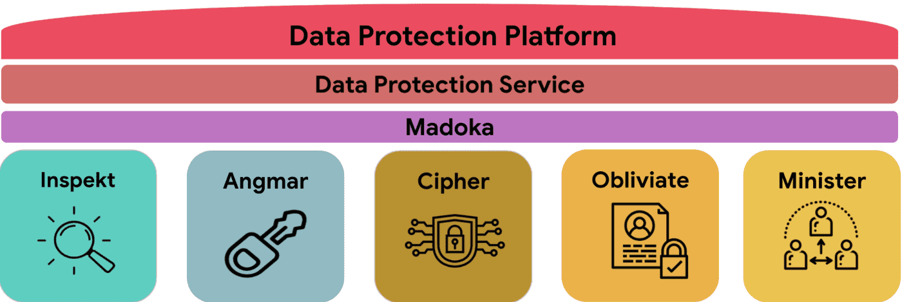
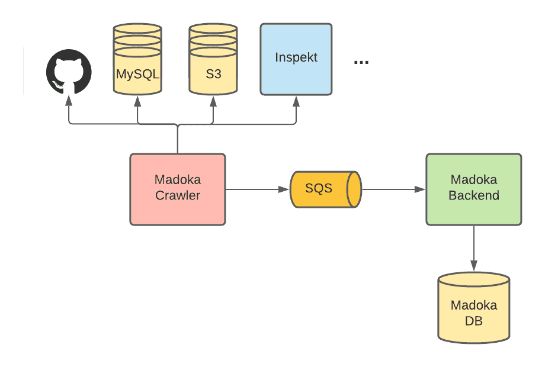
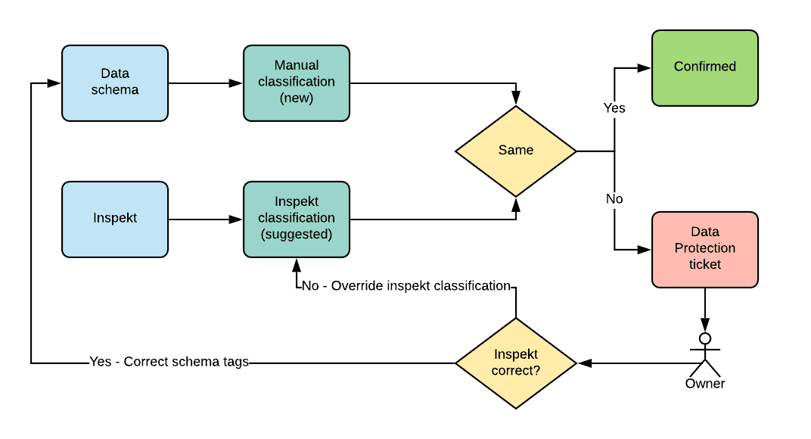

{{ page.description }}

# Automating Data Proteciton at Scale 1

## Introduction

첫번째 포스팅에서는 data privacy를 어떻게 자동화했는지 설명할것이다.

airbnb 유저들은 airbnb가 데이터를 안전하게 보호하고 privacy right을 지킬것이라고 믿고있을 것이다. 또한 data security에 대한 뉴스와 국제적인 규정이나 security requirement 문제도 중요시여겨지고 있으므로, data protection은 해결해야할 중요한 문제가 되었다.

airbnb에서 data는 여러 data store나 infra에걸쳐서 수집,저장,전달되므로 엔지니어들이 직접 각각의 환경에서 sensitve data를 추적, 관리하는 것은 어렵기 떄문에 data를 보호하는것은 챌린징하다. data security측면에서 많은 vendor들이 있지만, data discovery나 automated data protection 등 airbnb의 주요 요구사항을 맞춰주거나, airbnb의 시스템을 모두 지원해주는 vendor는 없다.

이 시리즈에서는 airbnb의 Data Protection Platform (DPP)를 만들고 운영하는 경험에 대해 공유할 것이다. 첫번째 포스팅에서는 DPP가 어떤 아키텍쳐를 가졌는지 보여주며, data inventory component인 Madoka에 대해 볼 것이다.

## Data Protection Platform (DPP)

airbnb의 요구사항을 만족시키는 툴이 없으므로 global regulation, security requirements를 만족하는 data protection platform을 만들기로 결정했다. 하지만 data protection을 위해서는 data protection과 secuirty, privacy risk에 대해 이해할 필요가 있다

### Understanding Airbnb’s Data

airbnb는 petabytes data를 다양한 포맷과 다양한 store(MySQL, Hive, S3 등)에 저장한다. data는 매일 전체 시스템에 걸쳐 생성, 복제, 전달된다. 계속 변화하는 data를 모니터링하고 이해하기 위해 airbnb는 모든 data asset을 추적하는 centralized inventory system을 만들었다. inventory system은 각 data asset에 대해 security, privacy property에 관련된 metadata를 수집하여 airbnb내의 stakeholder들이 risk에 대해 인지할 수 있도록 했다.

일부 data assert이 민감한 secret등을 가지고 있을 수 있으므로 data asset에 저장된 data의 종류가 어떤건지 이해하는 것은 data protection level을 결정하는데 중요하다. 또한 European Union Global Data Protectino Regulation (GDPR)이나 California Consumer Privacy Act (CCPA) 같은 개인정보 보호법은 유저들이 personal data를 접근하고 지울 수 있는 권리를 줘야 한다. 하지만 personal data는 이메일 주소, 메시지, 위치정보 등 다양한 data를 표현하기떄문에 다소 모호한 용어이다. 위의 법을 맞추기 위해선 모든 personal data의 정확한 위치를 알아야 한다. 이를 위해 airbnb는 data asset안에 어떤 종류의 데이터가 있는지 결정하기 위해 data assert을 지속적으로 스캔하고 구분하는 scalabe data classification system을 만들었다.

### Enabling Automated Data Protection

data에 대한 이해를 바탕으로 DPP는 protection을 전사적으로 각 팀에게 data protection을 할 수 있도록 알리는 시스템을 만드는데 시간을 썼다. 이런 자동화는 data discovery, sensitve data leak 방지, data encryption에 주요 초점을 맞췄다.

personal data를 찾아내는건 privacy compliance의 첫 스텝이다. 특히 유저가 요청할 경우 personal data를 제거하거나 정보를 줘야하는 경우에 더욱 중요하다. airbnb의 platform은 data store에서 새 personal data를 감지했을때 data owner에게 알리고, privacy orchestration service와 연동하여 personal data가 필요한경우 삭제되거나 제공할수 있도록 만들어준다.

data leak은 API key나 credential같이 secret이 내부에 유출된뒤 attacker가 습득하는 것이 주요한 원인이다. 이런 상황은 엔지니어가 secret을 로깅하거나 commit하는것부터 시작한다. airbnb의 DPP는 이처럼 다양한 endpoint에서의 잠재적인 leak을 식별하고 engineer가 대응(code, log에서 secret을 지우거나, rotate하거나 등) 할 수 있도록 알려준다.

attacker가 침입 한 후에도 sensitve data를 얻지 못하게 하기 위해선, encryption이 가장 중요하다. 하지만 unencrypted sensitve data로 인한 사건은 업계에서 자주 발생한다.

적절한 key 관리를 통한 secure encryption은 기술적으로 어려우며, 조직에서 sensitve data가 저장된 위치를 언제나 인지 할 수 있는 것은 아니다. DDP는 이런 challenge를 data ecnryption service, client library를 제공하여 엔지니어들이 쓸 수 있게 하는 것으로 이 문제를 추상화했다. DDP는 자동적으로 sensitve data를 감지하여 manual identification에 의존하지 않도록 만들어줬다.

## Platform Architecture

Data Protection Platform Overview

DDP는 data를 discover, understand, protect하는데 초점을 맞춘다. data protction의 다양한 측면을 처리하기 위해 여러 service, tool과 연동되었다.

- Inspekt는 Data Classification Service이다. airbnb의 data store를 지속적으로 스캔하여 sensitve하거나 personal data type인지 확인한다.
- Angmar는 codebase에서 secret을 찾아내는 Secret Detection Pipeline이다.
- [Cipher](https://medium.com/airbnb-engineering/one-step-forward-in-data-protection-8071e2258d16)는 개발자들이 쉽게 sensitve inforation을 암호화, 복호화 할 수 있게 해주는 Data Encryption Service이다.
- Obliviate은 모든 privacy compliance request를 처리하는 orchestration service이다. 예를들어 user가 personal data를 삭제해달라고 요청하면 obliviate은 모든 airbnb service로 각 data store에 저장된 personal data를 제거하라고 요청을 보낸다.
- Minister는 external vendor들에 대한 모든 privacy data에 대한 권리 요청을 처리하고 전달하는 third party risk, privacy compliance service이다.
- Madoka는 다양한 source에 있는 data asset에서 security, privacy property를 수집하는 metadata service이다.
- Data Protection Service는 Madokaf로 부터 오는 정보를 이용해 자동화된 protection action이나 notification을 수행하는 job을 정의하는 presentation layer이다.

## Madoka: A Metadata System

Madoka는 airbnb paltform 위의 모든 data asset의 metadata에 대해 security, privacy를 책임지는 data prtection metadata system이다. madoka는 centralized repository로 airbnb engineer와 다른 stakeholder들이 data asset metadata에대해 쉽게 추적, 관리할 수 있게 해준다. 따라서 전사적인 data security, privacy posture에 대한 이해와 이를 자동화하는 역할을 한다.

Madoka Architecture

madoka는 metadata를 수집하고, 저장하고 다른 서비스에 이를 제공하는 역할을 하며 crawler, backend 두개의 서비스로 구현되어있다. madoka crawler는 매일 github, mysql, s3, inspekt등 다른 datasource로부터 metadata를 crawlin하여 SQS로 publish한다. Madoka backend는 SQS를 ingest하면서 conflict reconciling을 수행하며 db에 metadata를 저장한다. backend는 API를 통해 다른 서비스가 metadata를 조회할 수 있게 해준다.

Madoka가 가지고있는 주요 metadata는 Data assets list, Ownership, Data classification 이다. datasource는 mysql, s3 format중 하나로만 되어있다.

### Data Assets List

data asset은 schema, location, asset type과 같은 metadata로 airbnb에 존재하는 모든 data asset list이다.

- MySQL에서 cralwer는 production AWS account에 존재하는 모든 column list를 수집한다. AWS API를 통해 production env의 모든 cluster의 endpoint를 가져온 뒤, JDBI를 통해 모든 database, table, column, data type을 수집한다. crawler는 다음과 같은 metadata inforation을 수집하여 backend로 전달한다.
    - Cluster Name
    - Database Name
    - Table Name
    - Column Name
    - Column Data Type
- S3에서 crawler는 AWS account에 있는 모든 object list를 수집한다. airbnb는 terraform에 모든 s3 bucket을 정의해서 쓰고있어서, cralwer는 S3 metadata를 가져오기 위해 terraform file을 파싱한다.
모든 bucket은 account의 subrepo 밑에 정의되어있으므로 1) 모든 account number, name을 파싱한뒤 각 account subrepo에 있는 bucket name을 가져온다.
bucket에 들어있는 object list를 가져오기 위해 crawler는 AWS에서 제공하는 [S3 inventory reports](https://docs.aws.amazon.com/AmazonS3/latest/userguide/storage-inventory.html) 를 사용한다. 이 툴은 매일/매주 bucket에 존재하는 모든 object와 그 metadata를 csv file로 만들어준다. 이건 직접 AWS API를 호출하는 것보다 훨씬 빠르고 저렴하다. airbnb는 terraform에서 모든 production s3 bucket에 invetory report 기능을 켜두었다.
S3 crawler가 수집하는 정보는 아래와 같다.
    - Account Number
    - Account Name
    - Assume Role Name
    - Bucket Name
    - Inventory Bucket Account Number
    - Inventory Assume Role Name
    - Inventory Bucket Prefix
    - Inventory Bucket Name
    - Object key

### Ownership

ownership은 특정 data asset을 누가 소유했는지 알려주는 metadata property이다.

madoka는 service ownership을 수집하여 data asset이 특정 codebase와 연결되고, code change를 필요로하는 data protection action을 자동화하였다.

또한 engineer가 작업을 하거나 approval이 필요한 data protection action을 수행하는데 필요한 team membership을 수집한다. team member들이 지속적으로 바뀌기 때문에 user ownership이 아닌 team ownership을 수집한다.

- airbnb는 Service-Oriented Architecture이기 때문에 대부분 MySQL cluster는 한 서비스나 한 팀에 속한다. service ownership을 결정하기 위해 crawler는 MySQL cluster와 연결된 service list를 가져오고 각 MySQL cluster에 속하는 모든 table owner는 최근 60일동안 가장 많은 수의 connection이 있는 서비스로 결정한다. 많은 서비스들이 monitoring, observability등의목적으로 모든 cluster와 연결하기 때문에 (모든 cluster..???), ownership을 결정할때 filter out role을 적용한다.
여러 서비스에서 공유하고 있는 일부 legacy cluster는 각 service가 특정 테이블을 소유하도록 한다. legacy cluster는 모든 테이블에 적절한 service owner가 할당되지 않을 수 있어서 manual override를 허용하고 있다.
airbnb의 service codebase에 team ownership이 설정되어 있으므로 service를 알아내면 team ownership도 알 수 있다.
- 또한 terraform의 모든 S3 bucket에는 project tag (service tag?)가 붙어있으므로 어떤 service가 어떤 bucket을 소유하는지 알 수 있다. crawler는 tf file에서 service ownership을 가져와서 team ownership을 결정한다.

### Data Classification

Data Classification은 data asset에 저장되는 data element의 타입을 설명하는 metadata property이다. 예를들어 email, phone number를 저장하는 MySQL column은 personal data로 분료된다. data classification을 수집하는건 각 dataset에대한 risk를 알 수 있어 protection level을 결정할 수 있게 해준다.

crawler는 두개의 source에서 data classification을 가져온다. 첫번째는 data owner가 data schema에 대한 classification을 직접 지정할 수 있으므로 git repo에서 data classification을 가져온다. 하지만 manual classification으로는 부족하다. data owner는 data asset 가진 data가 무엇인지 언제나 알기 어렵고, 새 data를 추가할때 classification을 까먹을 수 있다.

따라서 crawler는 inspekt라고 하는 automated data classification tool에서 data classification을 가져온다 (얘는 다음 포스팅에서 소개). Inspekt는 Mysql, S3등 주요 data store를 스캔하고 classify한다. Inspekt는 data asset에 어떤 data element가 들어있는지에 대한 정보를 뱉는다. Inspekt로 airbnb의 data가 지속적으로 모니터링되고 data가 바뀜에 따라 classification도 바뀌게 된다. 다만 precision recall이 언제나 100%은 아니기때문에 false positive/negative가 발생 할 수 있다.

Classification Reconcilation

crawler가 두개의 source에서 classification을 가져오기때문에 discrepancy가 생길 수 있다 (manuall classification에는 data element가 있지만 Inspekt에는 없는경우, 또는 그 반대). crawler는 이 모든것을 그대로 backend로 전달하여 backend가 이런 conflict를 해결한다. manual classification의 stat는 default로 $new$로 마킹되고, Inspekt는 $suggest$로 마킹된다. manual과 inspekt 결과가 같으면 classification은 자동적으로 confirm되지만, discrepancy가 발생하면 data protection service를 통해 data owner에게 티켓을 전달한다. owner는 conflict을 해결하기 위해 git repo의 data schema를 업데이트하거나(inspekt가 맞은 경우), Inspekt classification을 $incorrect$로 마킹한다(inspekt가 틀린 경우).

### Other Security and Privacy Related Attributes

Madoka는 어떻게 data asset이 security, privacy tool과 연동되었는지도 저장한다. 예를들어 data asset이 Cipher를 사용하여 암호화되었는지, 또는 Obliviate와 연동되었는지 여부등을 저장한다. madoka는 쉽게 확장가능하며 지속적으로 security, privacy에 관련된 attribute를 수집, 저장하도록 만들어졌다.

## Conculstion

DPP에 대한 overview와 data inventory component인 madoka에 대해 깊게 알아보았다. 다음 포스팅에서는 personal, sensitve data를 감지해주는 data classification system에대해 소개할 것이다. 마지막 포스팅은 어떻게 DDP가 다양한 security, privacy usecase에서 사용되는지 보여줄 것이다.