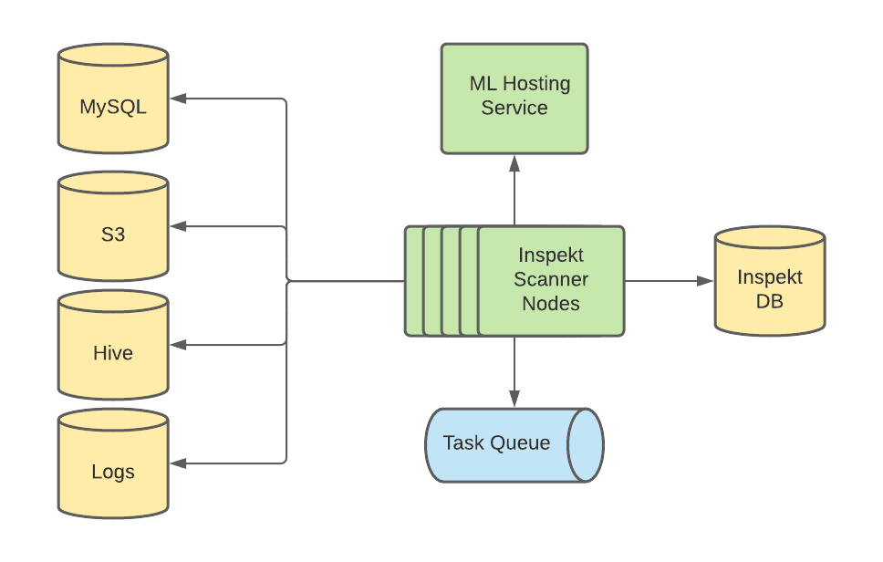
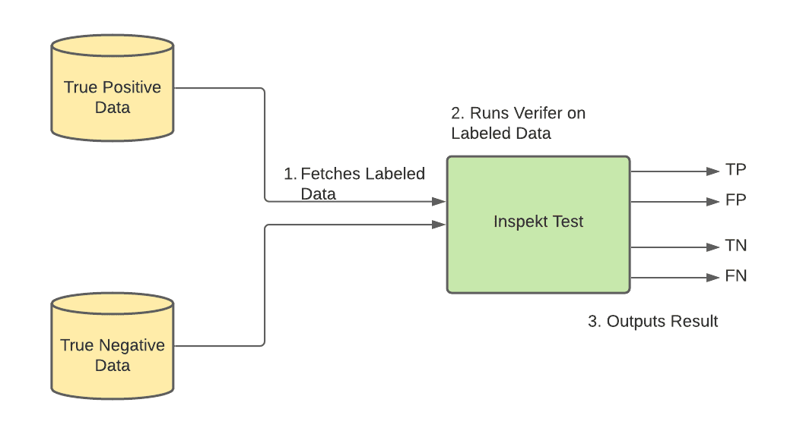
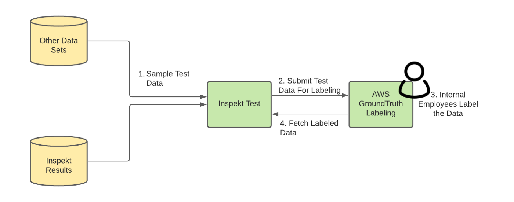
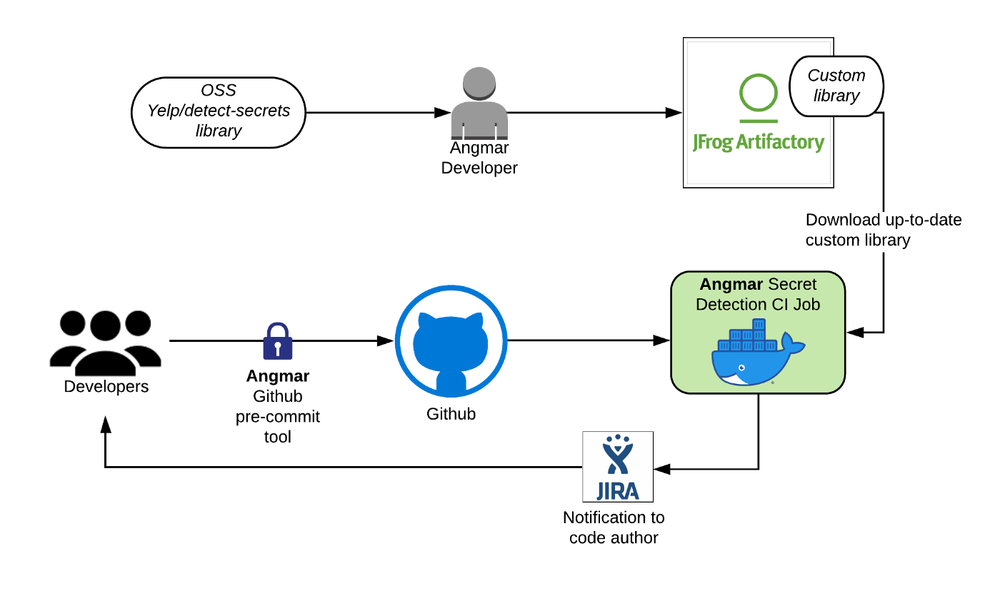

**{{ page.description }}**

# Automating Data Protection at Scale 2

## Introduction

첫번째 포스팅에서 golbal regulation, security requirement를 맞추기 위한 Data Protection Platform을 소개했다. personal / sensitive data가 어디에 저장되어 있는지 추적하여 data를 이해하는 것이 data protection에 필수적인 building block임을 강조했다. 이 포스팅에서는 personal / senstive data의 정확한 위치를 찾아내려 할때 직면하는 문제에 대해 볼 것이다. 많은 회사들은 임시방편으로 엔지니어들이 매뉴얼하게 personal / sensitve data가 어디로 흐르는지 확인한다. 하지만 이런 manual data classification은 여러 문제가 있다.

1. Data is constantly evolving.
이건 엔지니어들이 data에 대한 전체적인 이해와 어떻게 data가 infra 전반에 걸쳐 흐르는지 알기 어렵게 만든다. data는 여러 data store로 복제되거나 전달될 수 있다. 또한 product가 추가되거나 바뀌면서 새 종류의 data가 수집되기도 한다.
2. Manual classification is more prone to error.
엔지니어들이 data asset에 personal data가 있는지 잊을 수 있으며, form처럼 data asset에 들어있는게 뭔지 모를 수 있다 (memo column 같은것?).
3. Security and privacy personal data elements keep expanding.
엔지니어들은 새 data element가 새 privacy regulation, security compliance에 맞는지 확인하기 위해 manual data classification을 또다시 수행해야만 한다. 이건 회사에 높은 비용과 낮은 생산성을 만든다.
4. Secrets can leak into our codebase and various data stores.
protection API key등 secret은 엔지니어들이 많이 쓴다. codebase의 secret leakage는 흔한 일이고 일반적으로 의도되지않은 commit에 의해 발생하며 reviewer들이 알지 못할 수도 있다. 한번 check in하는 순간 secret은 아주 찾기 힘들어진다.

이런 문제를 해결하기 위해 aibnb는 data stoure, log, source code에서 personal, sensitive data를 감지하는 data classification tool을 만들었다. 특히 data store, log에 대한 data classification system인 Inspekt와 github codebase에서 동작하는 secret detection, prevetion system인 angmar에 대해 볼 것이다.

## Inspekt: A Data Classification Service

Inspekt는 personal, sensitve data가 infrastructure에서 저장되는 위치를 결정하는 automated, scalable한 data classification tool이다. Inspekt는 스캔되어야할 것을 결정하는 Task creator와 personal, senstive data를 감지하기 위해 data를 스캔하는 Scanner로 구성된다.

### Task Creator

task createion system은 스캔해야될 것들을 결정하고, scanning system이 ingest할 수 있또록 task들로 쪼갠다.

Inspekt Task Creator는 주기적으로 Madoka를 호출해서 airbnb에 존재하는 data asset list를 조회한다.

- MySQL, Hive data store: 모든 table list를 조회
- S3: 각 AWS account의 모든 bucket list와 object key를 조회한다. 엄청 큰 데이터 볼륨으로 인해 task creator는 각 bucket에서 object key의 작은 비율만 랜덤샘플링을 한다.
- application log: 모든 service list를 조회한 뒤 log를 담아둔 Elasticsearch cluster를 조회한다.

Task Creator는 각 table, object, application에 대해 task에 해당하는 SQS message를 만들고 scanning SQS queue에 publish한다.

### Scanner

scanning system은 data에서 personal, sensitive information을 찾기 위해 샘플링을 한 뒤 스캔한다. Inspekt는 scanning method를 정의하는 인터페이스, sample data를 스캔하는 알고리즘을 제공한다. 각 data element에 대해 하나 이상의 scanning method의 조합인 “verifier”를 정의한다.

Inspekt는 현재 4가지의 scanning method를 지원한다.

- **Regexes**: regex는 위도, 경도, 생일, 이메일같이 fixed format을 가진 data element에 대해 유용하다. allow list와 deny list를 정의하여 사용할 수 있다.
- **Trie**(CS tree 변종인 trie): 일부 data element는 “first_name last_name” 같이  fixed pattern을 가지지 않아 regex로 찾을 수 없다. data element가 source data store에 저장될때 airbnb는 finite sample data 에 대해 substring match를 수행하는 [Aho-corasick algorithm](https://en.wikipedia.org/wiki/Aho%E2%80%93Corasick_algorithm)을 이용한다.
- **ML Models**: 많은 data element는 regex같은 string matching으로 해결할 수 없다. 주소같은 일부 data element는 다양한 format을 가진다. 두번째로 월클 회사인 airbnb는 data를 각각의 각 나라에 맞게 각각의 언어로 저장한다. 세번째로 image같은 일부 데이터는 text based가 아니므로 regular scanning method로는 해결할 수 없다. ML based algorithm은 이런 문제에 적절하다. airbnb는 mutltask CNN, Bert-NER, WiDeText Classification Model등 complex data element에서 personal, sensitive data를 감지할 수 있는 ML model을 만들었다. model들은 production database의 data sample이나 public dataset으로 traning한다. 이런 model들은 [Bighead](https://databricks.com/session/bighead-airbnbs-end-to-end-machine-learning-platform) 라는 Airbnb maching learning platform에 호스팅된다. Inspekt는 Bighead API를 통해 각 data element를 스캔한다.
- **Hardcoded methods**: 일부 데이터는 fixed pattern이지만 regex로 표현하기에느 너무 복잡하거나 이미 open source solution이 존재하는 경우가 있다. Inspekt는 code block을 정의할 수 있도록 하여 이와 같은 data element를 감지할 수 있다. 예를들어 International bank Account Number data element verifier는 open source를 활용한다.

Inspekt에서 verifier는 JSON blob으로 정의되고 Scanner가 읽는 database에 저장된다. 이건 service를 재배포할 필요 없이 쉽게 기존에 존재하는 verifier를 수정하거나 새 data element를 감지하기위해 새 verifier를 추가할 수 있다.

밑은 “birthdate”를 포함하는 column name 또는 content를 찾는 verifier configuration 예시이다.

```json
{
  "dataElementName": "birthdateKeyword",
  "scanningMethods": [
    {
      "methodName": "birthdate_content_regex",
      "methodType": "content_regex",
      "contentRegexConfig": {
        "allowList": ["birthdate"]
      }
    },
    {
      "methodName": "birthdate_colname_regex",
      "methodType": "colname_regex",
      "colNameRgexConfig": {
        "allowList": ["birthdate"]
      }
    }
  ],
  "evaluationExpression": "birthdate_content_regex || birthdatee_colname_regex"
}
```

Inspekt Scanner는 k8s를 활용하는 distributed system이다. workload(tasks in queue)에 따라 scale-out 된다. 각 Scanner node는 SQS task queue에서 task message를 가져온다. scanning rubustness를 위해 각 message는 N회까지 requeue된다.



Inspekt Scanner Architecture

Inspekt Scanner node는 시작할때 DB에서 verifier를 가져온다. verfier는 새 verfier나 configuration change를 반영하기 위해 주기적으로 refresh된다. verfier initialization 후 scanner node는 task queue에서 task를 fetch한다. 각 Task는 task가 실행되어야하는 spec을 가지고 있다 (스캔해야 할 data asset location, samplling amount 등). 그리고 각 task를 thread pool에넣어 sampling, scanning job을 수행한다. scanning job은 아래 작업을 수행한다.

1. Inspekt scanner는 task에 정의된 data store에서 data를 샘플링한다.
    1. MySQL: scanner node는 MySQL DB에서 각 table의 row subset을 샘플링한다. full scan을 만들지 않으면서 다른 row subset을 가져오기 위해, max PK보다 작은 random value X를 만들어 `key >= X` 조건으로 subset row를 선택한다.
    2. Hive: 최신 partition에서 각 table의 row subset을 가져온다.
    3. Service Logs: 하루마다 각 service의 log subset을 샘플링한다. 여러 로그에 대해 coverage를 높이기 위해 여러 logging point에서 log를 가져오는 ES query를 쓴다.
    4. S3: object size보다 작은 Random offset을 설정하고 offset부터 특정 bytes만큼 샘플링한다. 또한 여러 AWS account에 대해서도 스캐닝을 지원한다. 다른 AWS account에 있는 object이면 Inspekt는 자동적으로 적절한 Assume Role IAM permission을 이용해 object에 접근한다.
2. data store에서 샘플링한 데이터들로 Inspekt scanner는 verifier를 실행시킨다.
3. Inspekt scanner는 mathcing result와 그에 해당하는 data asset metdata, matched content, matched verifier를 저장한다. 또한 data asset과 matched content는 별도의 테이블에 저장하고 security, privacy를 위해 주기적으로 데이터를 제거한다.
4. SQS message를 제거한다

## Inspekt Quality Measurement Service

이전 포스팅에서 써둔것처럼 Data Protection Platform은 protection measurement를 classification result를 활용한다. downstream stakeholder가 Inspekt에서 온 classfication result를 믿고 활용하기 위해선 matched data element가 high quality를 유지해야 한다. 너무 많은 false positive는 downstream team에 방해가 되고 Inspekt의 신뢰도를 떨어트릴 것이다. 너무 많은 false negative는 privacy security 문제가 발생하게 된다.

### Quality Measurement Strategy

각 data element verifier의 quality를 모니터링하고 향상시키기 위해 precision, recall, accuracy를 측정하는 Inspekt Quality Measurement Service를 만들었다.

각 data element에 대해 true positive, true negative data를 ground truth로 Inspekt Quality Measurement Service DB에 저장한다. 그다음 ground truth dataset에 대해 verfier를 실행시킨다. true postivie data에 대해 TP, FN을 뱉는다. true negative data에 대해 FP, TN을 뱉는다. 그다음 precision, recall, accuracy를 게산한다.



Inspekt Quality Calculation

### Sampleing and Populating Test Data

위의 metric들은 정확해야 하며 test에 사용한 dataset은 가능한한 production data와 비슷해야 한다. 따라서 airbnb는 이런 dataset을 아래 source들에서 주기적으로 샘플링한다.

- Known datasets in production: online database나 data warehouse에 있는 일부 컬럼은 특정 data element를 표현하고 있다. 예를들어 MySQL column은 email address를 저장하고 있다. 우리는 이런 컬럼들을 true postive로 사용한다.
- Inspekt results: Inspekt가 실행되고 result를 생성할때 result는 TP나 FP가 된다. 따라서 이런 data를 test dataset을 만드는데 사용할 수 있다.
- Known freeform/unstructured data: online database, data warehouse의 일부 컬럼은 user가 작성한 freeform data나 message, JSON, unstructured blob이다. 이런 컬럼들은 여러 종류의 data element를 포함할 수 있어 Inspekt가 unstructrued format과 edge case를 잘 감지하는지 확인 할 좋은 test data source이다.
- Generated fake, syntehsized data: user의 height, weight같은 일부 data element는 data store에 거의 없다. 이런 data element에 대해 충분한 test data를 넣을 수 있도록 fake data를 생성한다.

### Labeling

sample dataset이 test dataset으로 저장되기 전에 TP나 NP임을 보장해야한다. 이를 위해 [AWS Ground Truth](https://aws.amazon.com/sagemaker/groundtruth/)를 통해 “직접" labeling한다. 각 data element에 대해 instruction을 만들고 airbnb 직원들을 트레이닝시켜 각 샘플에 대해 적절하게 labeling하도록 한다. 그다음 raw dataset을 AWS S3에 업로드 하고 Ground Trutu에 instruction 과 함꼐 labeling job을 만든다. 직원들이 data labeling을 끝내면 labeled output은 S3 bucket에 저장된다. Inspekt Quality Measurement Service는 주기적으로 labemed data가 ready상태인지 주기적으로 확인한다. ready이면 S3에서 data를 가져와 test dataset으로 저장한 뒤 S3 data는 제거한다.



Inspekt Test Labeling Pipeline

### Re-Traning ML Models

Inspekt Quality Measurement service의 labeld data는 Inspekt verifier의 성능을 향상시키기 위해 사용된다. 특히 labeled result는 Inspekt ML model의 성능을 높이는데 유용하다. ML model들에 대해 training sample로 labeled data를 넣는다. re-training동안 새 labeled data는 training sample로 사용하여 더 나은 model을 만들게 된다.

## Angmar: Secrets Detection and Prevention in Code

이전 섹션에서는 어떻게 Inspekt가 personal, sensitive data를 감지하는지 알아봣다. 하지만 business, infra secret같은 sensitive data는 codebase에 남아있을 수 있다. airbnb는 이런 케이스에 대해 secret detction solution인 Angmar를 만들었다.

### Architecture

Angmar는 GHE에 푸시된 secret을 확인하는 CI check와 secret이 처음부터 GHE에 들어가는 것을 방지하기 위한 github pre-commit hook으로 구성된다.

Ci check은 GHE에 푸시된 모든 커밋을 스캔한다. 커밋이 GHE로 푸시되면 main branch에 merge되기 위해 패스해야하는 CI job이 시작된다. Ci job은 [Yelp/detect-secrets](https://github.com/Yelp/detect-secrets) 에서 파생한 customized version library를 실행시켜 커밋에서 변경/추가된 파일에 대해 잡을 실행한다. CI job에서 secret이 감지되면 Data Protetction Platform을 트리거하여 JIRA ticket이 생성되고 자동적으로 code author를 할당시킨다. JIRA ticket 생성에 대한 내용은 다음 포스팅에 나온다. airbnb는 모든 production secret이 제거되거나, rotate되거나 production secrement management tool인 [Bagpiper](https://medium.com/airbnb-engineering/production-secret-management-at-airbnb-ad230e1bc0f6)에서 확인하는것을 요구한다.



Angmar Architecture

하지만 CI check는 푸시된 이후 실행되므로 secret은 잠시동안 security risk를 만들수밖에 없다. 또한 일부 케이스에서 secret rotation이 굉장히 시간이 많이 소요될 수 있다. 따라서 airbnb는 GHE에 secret이 들어오는 것을 막아 secret rotate를 하지 않게 해주는 방법을 만들었다. 같은 custom detection library를 사용하는 Angmar pre-commit tool은 개발자가 커밋하기 전에 막을 수 있게 해준다. commit command에서 secret이 감지되면 에러가 발생한다.

### Customization

airbnb는 Yelp/detect-secrets서 몇가지 customization을 했다

- airbnb specific한 library plugin에 대한 secret data element를 추가했다.
- library에 대한 fals positive detection을 분석했을때 일부 test secret, staging secret, placeholder가 false positive로 나타났다. 이런 케이스들을 스킵하기 위해 path-filtering logic을 추가했다.
- 서로 다른 커밋에서 같은 파일을 수정했을때 여러번 감지되는것을 막기위해 deduplication logic을 만들었다.
- 가끔 false positive가 일어나는 경우이지만, emergency code가 blocking되는 것을 피하기 위해 특정 code line, file을 스킵하도록 했다. security team은 스킵된 코드를 리뷰한다.

## Future Work

더많은 datasource를 스캔하고 privacy, sensitive data를 감지하기 위해 지속적으로 Inspekt, Angmar를 개발하고 있다.

1. Thrift IDL API의 request, response를 스캔하여 personal, sensitive data flow를 추적하게 할 것이다.
2. Googld Drive, DropBox등 third party application을 스캔하여 외부로 나가는 data flow와 내외부에서 접근되는 방식에 대한 data lineage를 만드려 한다.
3. airbnb에서 사용하는 DynamoDB, Redis등 다른 datastore에 대한 스캔도 가능하게 할 것이다.

## Alternatives

여러 상용 제품이 있지만 아래와 같은 이유로 in-house solution을 만들었다.

- Data store coverage: 상용제품은 SAAS application이나 S3 bucket만 지원한다.
- Customized scanning
- Cost efficiency

## Conclusion

두번째 포스팅에서는 personal, sensitive data를 감지하는 data classification system에 대해 들여봤다. 다음포스팅에선 어떻게 Data Protection Platform이 사용되는지 볼 것이다.
