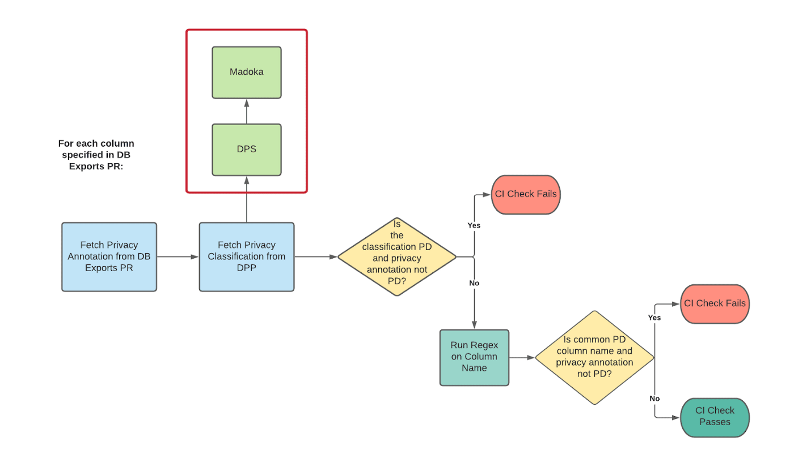
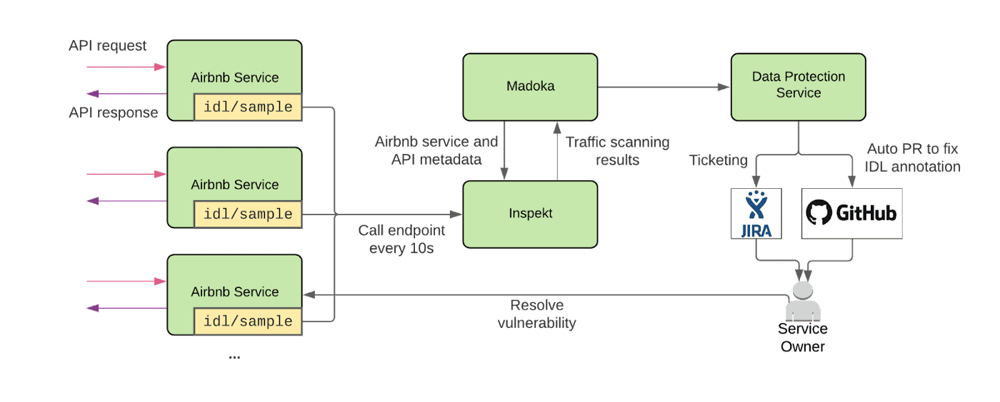
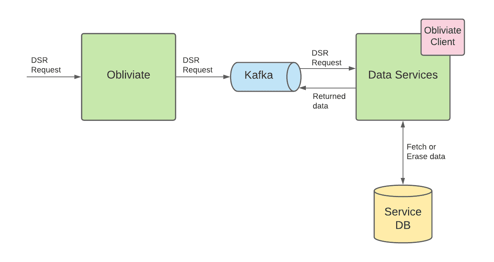

**{{ page.description }}**

# Automating Data Protection at Scale 3

## Introduction

이전 포스팅에서 Data Protection Platform에 대한 overview를 보았다. 특히 어떻게 data에 엮인 security, privacy risk를 이해하는지 보았다. 이번 포스팅에서는 어떻게 DPP를 이용하여 자동화된 seucirty privacy engineering capability를 제공하는지 보여줄 것이다. 전사적으로 risk를 줄이기 위해 아래의 문제들을 해결하기로 했다.

- **Accountability**: security, privacy compliance는 security, privacy team에서만 챙겨야 하는 문제가 아닌 platform, development, product lifecycle, enterprise vendor solution등 전사적인 문제이다. data volume이 증가하고 서비스가 복잡해지면서 data를 제어하는 팀 (service owner)가 data에 대한 security, privacy를 책임지도록 만들 필요가 있었다.
- **Minimal overhead**: service owner들이 risk를 줄이기 위한 책임을 가지면서, 많은 작업을 자동화하며 operational overhead를 줄이기를 원했다.
- **Global alignment**: 모두가 정확히 같은 data classification, protection strategy에 대한 이해를 할 수 없다. 따라서 airbnb는 security, privacy, legal consensus를 맞춰야하고 privacy, security annotation과 action에 대한 single source of truth를 제공해야 한다.

## Data Protection Service

airbnb는 DPP의 모든 component를 통합하는 Data Protection Service (DPS)를 만들었고 stakeholder에게 security, privacy action을 자동화했다.

DPS는 DPP 외부의 stakeholder, service를 위한 API endpoint를 제공하여 Madoka에 저장된 privacy, security metadata를 조회할 수 있도록 했다. 예를들어 자신 service에 해당하는 data들이 personal data를 포함하는지 조회하게 된다.

또한 DPS는 특정한 step을 자동화하기 위해 쉽게 custom job을제공한다.

- **Creating JIRA notification**: JIRA ticket을 만들기 위해 DPS는 ticketing mechanism을 추상화하고 쉽게 중복된 ticket을 제외하는 internal ticket generator를 쓴다. 같은 결과에 대해 두개의 ticket이 생성되지 않도록 unique id를 정의해서 쓰고있다. 이 외로 slackbot, email등 다른 기능도 넣어놨다.
- **Generating PRs**: GHE에 PR을 만들기 위해 GHE API를 이용해서 repo를 받고 PR을 만들고 PR의 상태를 확인한다. 각 job에서는 repo의 target file을 수정하고 PR에 추가하는 로직을 구현했다.

## Data Protection Annotation Validation

privacy law에 대해 효과적으로 대응할 수 있도록 어떤 personal data가 어디에 있는지 알 필요가 있다. 또한 여러 data store, service간에 data가 전달될 때에도 data를 보호해야 할 필요가 있다. 이를 위해 airbnb는 3 level의 data classification annotation(critical, personal, public)을 정의하고 data에 태깅을 했다.

airbnb에서 engineer, data scientist들은 online MySQL table snapshot을 분석을 위해 offline hive table로 export하는 database-export pipeline을 정의할 수 있다. 우리는 owner가 각 table column에 data classification annotation을 태깅하는것을 필요로 했다. tag를 이용해서 적절한 access control, retention limit을 적용하여 sensitive data category를 분리하고 보호할 수 있었다.

```json
{
  "version": 1,
  "columns": [
    {
      "name": "id",
      "type": "bigint",
      "_mysql_type": "int",
      "sensitivity": "low"
    },
    {
      "name": "email",
      "type": "string",
      "_mysql_type": "varchar",
      "sensitivity": "medium"
    }
  ]
}
```

Service owner는 Thrift IDL의 extension을 이용해서 inter-service communication에 대한 data interface를 정의한다. endpoint의 각 필드에 data classification annotation을 태깅하도록 해서 service API가 high risk location을 접근하는 것을 제한한다. Annotation은 또한 service의 security, privacy risk를 평가할때도 유용하다. 아래는 Thirft IDL API의 예시이다

```json
struct Person {
  1: optional i32 id (non_null, low_sensitivity)
  2: optional string firstName (non_null, medium_sensitivity)
  2: optional string lastName (medium_sensitivity)
  2: optional string email (medium_sensitivity)
}
```

하지만 annotation은 사람의 손에 의존하므로 에러에 취약하다. service owner는 API나 data column에 대해 잘못 판단하거나 태깅 자체를 잊어서 data가 부정확하게 annotate 될 수 있다. 따라서 우리는 data classification annotation의 정확성을 검증한다.

## Database Export Validation



Database Exports Data Classification Validation CI Check

database-exports annotation을 검증하기 위해 DPS를 이용하는 CI check을 만들어 database-export PR이 생성될때마다 수행한다. PR에 선언된 모든 column에 대해 CI check은 아래 내용을 수행한다.

1. DPS에 쿼리하여 컬럼이 privacy classification이 무엇인지 확인하고, PR의 annotation과 매치되지 않으면 CI check이 실패한다.
2. 1을 통과하면 regex를 실행해서 해당 컬럼이 어떤 data classification annotation을 가져야하는지 확인한다. 이건 주로 data를 가지지 않은 테이블이나 false negative를 거르는데 유용하다. (즉 email같은 컬럼명이면 아웃)
3. 1, 2를 통과하면 CI는 통과한다.

data warehouse는 data classification result를 이용해 이미 check-in된 database-export file에 annotation을 검사한다. daily job은 DPS를 통해 모든 Hive table의 data classification을 가져오고, classification과 annotation이 맞지 않는경우 service owner에게 알린다. 제대로 annotation이 달리지 않은 table들은 service owner가 액션을 취하지 않을경우 자동적으로 **제거된다.** ㄷㄷ

## IDL Validation



Service API Interface Data Language Validation

airbnb service의 traffic-capturing feature를 이용해서 IDL API에 대한 request-response pair를 얻는다. Inspekt는 주기적으로 각 service에 요청을 보내 traffic sample을 받는다. 그다음 traffic sample을 스캔하고 classify한다. Madoka는 Inspekt의 scanning result를 수집해서 annotation tag가 일치하는지 확인한다. scanning result classification은 모든 detected data element의 가장 높은 sensitivity에 의해 결정된다. 예를들어 scanning result가 bank account number (high), mailing address (medium) 두가지 data를 가진다면, classification은 high로 나온다. 이 discrepancy는 IDL definition의 특정 필드를 감지한다.

discrepancy가 감지되면 DPS는 JIRA ticket을 생성하고 service owner가 IDL annotation을 고칠 수 있도록 PR을 만든다. DPS는 IDL annotation file의 inconsistent field를 찾고 GHE client를 이용해 code contributer를 찾는다. 그다음 제안하는 change와 JIRA ticket link를 걸어 PR을 연다.

## Privacy Data Subject Rights Orchestration

GDPR, CCPA같은 privacy law가 발전함에따라 사용자들은 어떻게 personal data가 수집되고, 저장되고, 사용되는지 제어할 수 있어야 한다. 특정한 data protection law는 개인에게 권한을 주기도 한다. 여기에는 잊혀질 권리와, 접근권한이 포함된다.

### Obliviate

위의 규제를 대응하기 위해, Obliviate라는 Data Subjects Rights (DSR) orchestration service를 만들었다. obliviate은 DSR requeset를 받고 유저에 대한 erasure, access, portability를 제공한다.



Obliviate Workflow

consumer가 DSR erasure/access나 portability를 요청하면 obliviate으로 들어온다. obliviate은 이 요청을 Kafka queue에 publish하여 downstream service에게 요청을 보낸다. data를 소유하고있는 service는 DSR request를 실행시켜 service가 가진 table에대해 personal data를 제거하거나, 조회해서 줘야하는 책임이 있다.

service가 obliviate과 상호작용하는 방식을 단순하게 만들기 위해 obliviate client를 만들었다. client는 각 DSR 요청 (delete, access, portability)에 대해 하나씩 넣어야하는 empty Thrift IDL schema로 서비스를 제공한다 (예시..주세요..). service owner는 각 schema에 service가 소유하는 personal data에대한 모든 컬럼을 채운다.

또한 client는 interface를 제공하여 특정 user id에 대한 DSR request를 실행해야하는 몇가지 method를 구현하도록 했다. client는 다른 나머지 로직을 추상화했다(kafka consumer, producer로직같은것들은 client로 숨겨짐).

각 DSR request에 대해 obliviate service는 각 data service로부터 response를 기다리며 완료시 compliance를 알린다. data service가 응답하지 않는경우 service는 성공할때까지 계속 재시도한다.

### Automating Obliviate Integrations

client code의 많은 부분이 추상화되어있더라도 obliviate을 연동하는건 여전히 손이 많이간다. service owner는 personal data를 저장하는 컬럼을 확인하기 위해 시간을 많이 써야한다. 또한 client code를 연동하고 service에 dependency를 추가해야하니 test, debug하는 시간도 필요하다. 이처럼 service owner가 직접 personal data를 결정하도록 하는것은 column을 놓치거나 column이 가진 data가 확실하지 않을 수 있으므로 문제가 생길 가능성이 있다.

우리는 DPS를 가능한한 자동화하는 방식으로 연동하게 만들기로 했다. 자동화된 연동은 daily job으로 수행되며 아래와 같은 일을 한다. 

1. DPS는 Madoka에 요청을보내 personal data를 소유한 모든 column list중 obliviate과 연동되지 않은것들을 조회한다.
2. DPS는 obliviate client code와 서비스를 연동하는 PR을 보낸다. 만약 아직 연동되지 않은 경우 해당 서비스와 연결된 각 컬럼을 Thrift struct에 추가한다.
3. DPS는 JIRA ticket을 만들고 PR에 연결한뒤 service owner에게 할당한다.

그 다음 service owner는 Thrift struct에 포함된 column에서 해당 user와 관련된 모든 컬럼을 제거하거나 리턴하는 interface를 구현해야한다.

## Eliminating Accidental Secret Leakage

potental leakage가 발견되면 DPS는 자동적으로 security vulnerability ticket을 생성하여 leakage point를 남기고 owner에게 ticket을 할당한다. 각 ticket은 security operator가 추적하기 위한 tag가 포함된다. data store, service log에서 secret이 감지되면 service owner가 감지된 레코드에 대해 책임을 져야 한다.

첫번째 포스팅의 ownership section에서 Madoka service가 data asset에대한 service ownership을 어떻게 수집하는지 보았다. record를 찾으면 DPS는 Madoka에 요청을 보내 data asset에대한 metadata를 조회한다. 예를들어 MySQL인 경우 DPS는 Madoka에 database cluster name, table name을 넣고, service log인 경우 service name을 넣는다. Madoka는 해당하는 owner를 리턴한다.

data leakage를 방지하기 위해 ticket은 감지된 data cotent를 넣진 않고 metadata만 넣는다. 예를들어 service log에서 감지됐다면 service log code template과 감지된 secret type(access key 같은?)만 넣고 실제 내용은 넣지 않는다. owner가 ticket을 받으면 data store나 service log에서 직접 찾아야한다.

DPS를 릴리즈 한 뒤 본 병목은 생성된 ticket을 해결하기 위해선 여전히 직접 확인이 필요하다는 것이다. 즉 security team은 leaked secret이 data store, service log에서 제거되었는지 또는 leakage가 생긴 logging template이 source code에서제거되었는지 확인해야 한다. 이런 operational cost를 줄이기 위해 자동화된 verification soluttion을 계획하고 있다. 예를들어 secret logging ticket이 resolve되면 DPS는 해당하는 source code를 스캔하고 logging template이 제거됐는지 확인한다. 또한 DPS는 logging cluster를 스캔하거나 검색하여 leaked secret이 제거됐는지 확인할 수 있다.

### Secret in Code

CI check job에서 secret이 감지되면 CI job은 `git blame`을 실행하여 secret에 대한 최근 commiter를 찾는다. 이후 DPS는 아래 일을 한다

- **deduplicates secret findings**: 같은 파일에 있는 같은 secret에 대해 중복된 ticket, noti를 만들지 않기 위해 secret, path를 해싱한다. hash value가 존재하면 DPS는 이를 무시한다.
- **sends notification**: alert은 dedicated slack channel로 번달되고 메트릭 수집을 위해 datadog으로 전송된다.

DPS는 airbnb codebase의 secret data protection을 자동화하고 security operation의 operational overhead를 줄인다. 

## Conclution

Data Protection Platform이 security, privacy risk를 줄이는데 사용되는 사례에 대해 소개했다끝.