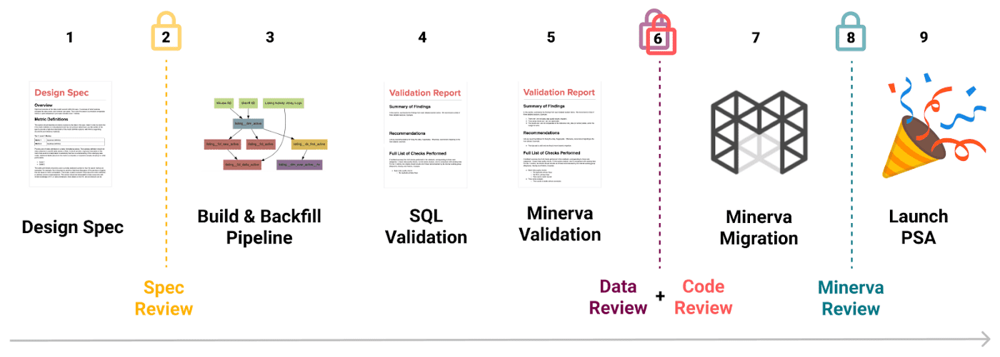

**{{ page.description }}**

# Data Quality 1 - Rebuilding at Scale

## Background

Airbnb가 작은회사에서부터 성장하면서, Data에 대한 요구사항도 변경되었다. data timeliness / quality에 대한 높은 목표가 설정하고, 비용과 준수(compilance)에 대한 집중도를 높였다. 이런 목표를 달성하려면  데이터에 대한 큰 투자가 필요했고 특히 ownership, data architecture, governance에 중점을 맞췄다

### Ownership

이전에는 ownership이 여러 프로덕팀에 있는 engineer/ data scientist들에게 분산되어있었지만 책임에 대한것은 명확하지 않아 이부분이 병목이었다

### Data Architecture

이전의 대다수 파이프라인은 잘 정의된 quality standard나 data architecture를 위한 전략을 고려하지 않고 만들어졌다. 이에 따라 bloated data model이 되었고 작은 엔지니어 그룹(소규모 팀?)에게 큰 부담을 주었다

### Governance

data architecture를 위한 overarching strategy뿐만 아니라, 각각 팀이 strategy와 standard를 맞출 수 있도록 centralized governance process가 필요했다

## The Data Quality Initiative

Data Quality를 위해 다섯가지 목표를 만들었다.

1. 모든 중요 데이터셋에 대해 명백한 오너십을 만든다.
2. 중요한 데이터들은 언제나 SLA를 맞춰야 한다.
3. pipeline들은 best practices를 써서 high quality standard로 만들어져야 한다.
4. 중요 데이터는 신뢰 가능해야하며 주기적으로 검증되어야 한다.
5. 데이터는 문서화가 되어있어야 하고 쉽게 찾을 수 있어야 한다.

## Organization

DQ initiative를 위해 DE resource를 재편성했다. (즉 풀집중 할 수 있는 리소스를 확보했다는 말)

### Data Engineering Role

이전동안 airbnb는 DE role이 없었다, DE 작업은 대부분 DS나 software engineer가 했다. 이것때문에 DE skill을 가진 직군을 채용하기 힘들었다. 따라서 airbnb는 engineering 조직 내에 DE role을 만들었으며, DE는 data modeling, pipeline development, software engineering등을 포함안 여러 도메인의 requirements를 가진다.

### Organization Structure

Centralized data engineering 조직에서, product team에 속해있는 decentralized organizational structured로 만들었다. 이런 구조는 DE가 소비자의 니즈, 제품의 방향에 align되도록 해주며, 3명이상의 엔지니어를 붙였다. — 적절한 크기는 팀 크기는 멘토링/리더쉽 기회, data operation, 인력 격차 완화에 중요하다

DE가 분산된것을 보완하기 위해, Data Engineering standard, tooling, best practices를 만드는 central DE team을 만들었다. 이 팀에서 어떤 product team에 속하지 않은 global data set을 관리한다.

### Community

DE들간 유기성을 만들기 위해 아래와같은 미팅들을 만들었다.

- Data Engineering Forum: DE들의 monthly all-hands meeting, 컨텍스트를 퍼트리고, 피드백을 얻기위한 미팅
- Data Architecte Working Group: Senior DE로 구성, architectural decision, Midas Certification 검토
- Data Engineering Tooling Wroking Group: 모든 DE로 구성, workflow, tooling 개발
- Data Engineering Leadership Group: DE manager, senior individual contributor로 구성, organization, hiring decision

### Hiring

미래 몇년동안 조직에 큰 영향을 미칠 결정을 내리기 위한 senior leader를 채용하는데 심혈을 기울였다

## Architecture and Best Practices

airbnb에서는 data modeling, operation, pipeline을 구현할때의 technical standard에대한 포괄적인 가이드라인을 제공한다

### Data Model

airbnb의 초기 분석 데이터 구조인 `core_data`는 편의성에 초점을 맞춘 star schema였다. `core_data`는 central team이 소유하고, 다른 영역까지도 포함해서 많은 data source를 통합했다. 이 모델은 2014년까진 잘 돌았지만, 회사 사이즈가 커가면서 점점더 관리하기 어려워졌다. 따라서 airbnb의 미래 data model은 centralized ownership을 결점을 피할수 있게 디자인해야했다.

metric/demension cataloging, join등을 수행하는 platform인 Minerva가 도입되면서, Minerva는 Data architecture에서 중심이 되어야하며 Data model은 mierva의 강점을 활용하도록 만들어야 했다.

1. 테이블은 normalized되어야 하며 최대한 적은 dependency가 걸려야한다. Minerva는 여러 데이터 모델을 조인하기 위해선 heavy lifting을 하기때문이다
2. 비슷한 도메인을 설명하는 테이블들은 subject area로 그루핑한다. 각 subject area는 한 팀이 가지는 scope와 align되는 single owner가 있어야한다. 즉 오너십이 명백히 있어야 한다.

data modeling에서 normalized data와 subject area는 최근에 다시 부활한 개념이다. 이 방식이 이전의 문제를 해결하고 airbnb의 조직구조와 잘 부합한다.

### Data Technology

- Spark and Scala
DQ initiative를 만들때, 대부분의 critical data는 SQL로, hive에서 만들어졌다. SQL은 functional programming 의 이점이 부족했다(code reuse, modularity, type safety, ...). Spark는 mature해졌고 회사에서는 spark에 대해 점점더 깊은 지식을 쌓아가고 있었다. 따라서 SQL + hive 기반에서 spark + scala로 옮겨갔다. 또한 read/write pattern과 integration testing을 간단하게 만들기 위해 common spark wrapper에 기여했다
- Testing
Test가 충분하지 않아 interation speed를 느리게하고, outsider들이 코드를 수정하기 어렵게 했다. 따라서 integration test를 만들어 pipeline이 안정적으로 생성되도록 했다.
- Data Quality Checks
DQ check,1 anomaly detection을 하기 위한 툴을 만들고 파이프라인에서 사용했다. 특히 anomaly detection은 quality issue를 미리 방지하는데 크게 일조했다.
- Operations
모든 중요 dataset은 landing time SLA를 가지게 했고 pipeline은 pagerduty를 붙였다

## Governance

### Process

data warehouse를 다시 구축하면서, data model간의 응집력을 보장하고, high quality를 유지하기 위한 메커니즘이 필요했다. 또한 end user가 신뢰할수있는 dataset을 표현할수있는 더 좋은 방법이 필요했다. 이를 위해 airbnb는 Midas certification process를 만들었다.

- (1 - 2) Design spec을 통해 pipeline을 만들기 전에 stakeholder들이 align한다. design doc은 다른 사람도 이해할 수 있는metric, demension, table schema, pipeline diagram을 설명하며, 모호한 비즈니스 로직과 가정들에 대해 명시한다.
- (3 - 6) Design doc이 approve되면 DE가 spec에따라서 dataset과 pipeline을 만든다. 최종 데이터와 코드는 리뷰를 받고, certification이 부여된다.
- certification flag는 모든 데이터 툴에서 보여지며, certified data는 discovery priority가 높아진다.

### Accountability

DQ와 관련한 accountability를 봊아하기 위한 메커니즘을 만들었다.

- DQ bug를 리포팅하는 프로세스를 바꿨다.
- 우선순위가 높은 버그를 고치기 위한 weekly bug review를 만들었따.
- 분기 OKR planning에 data pipeline SLA를 넣었다.

## Conclusion