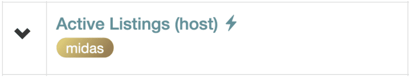
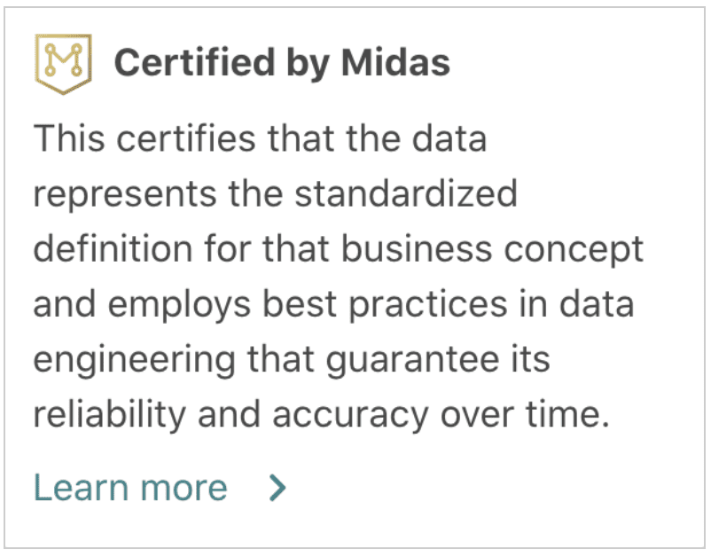
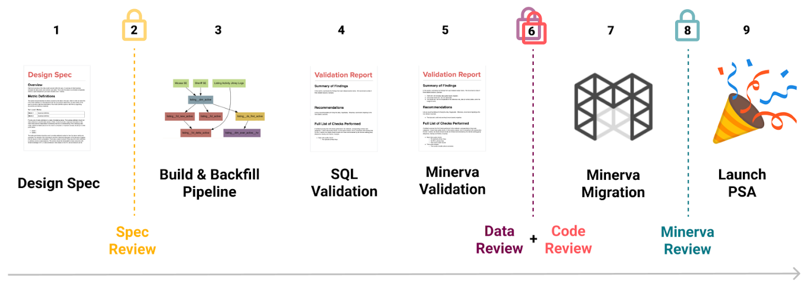
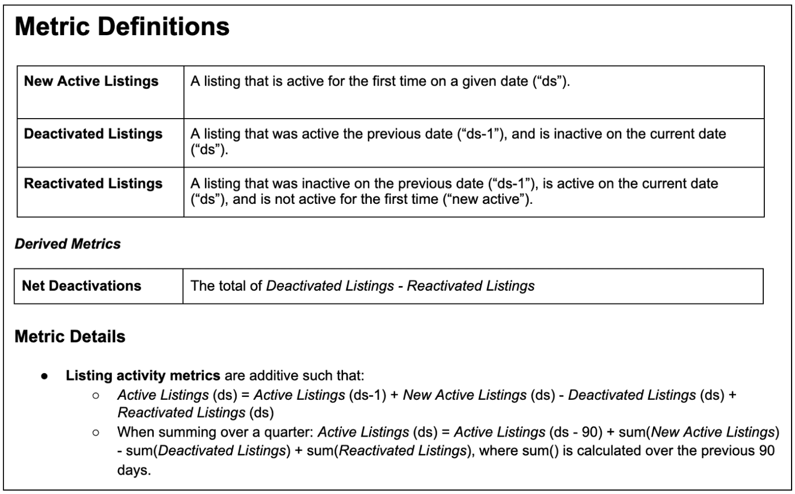
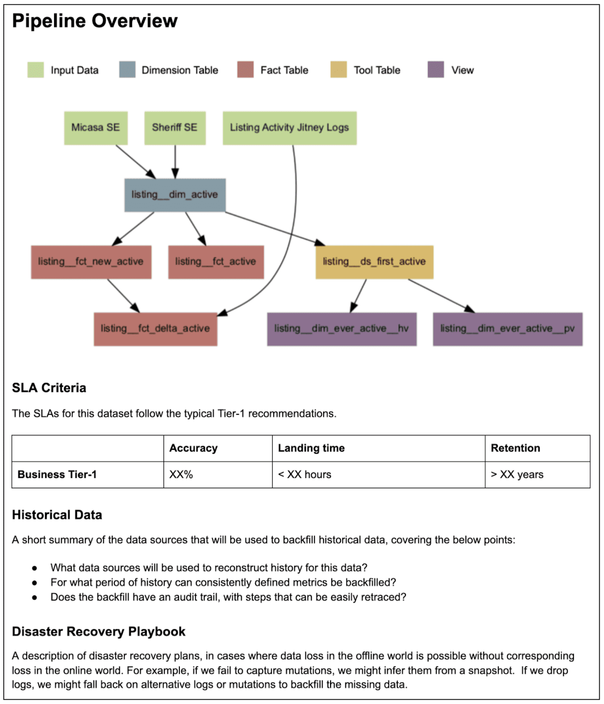
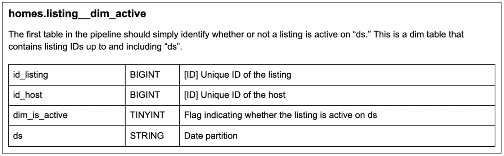
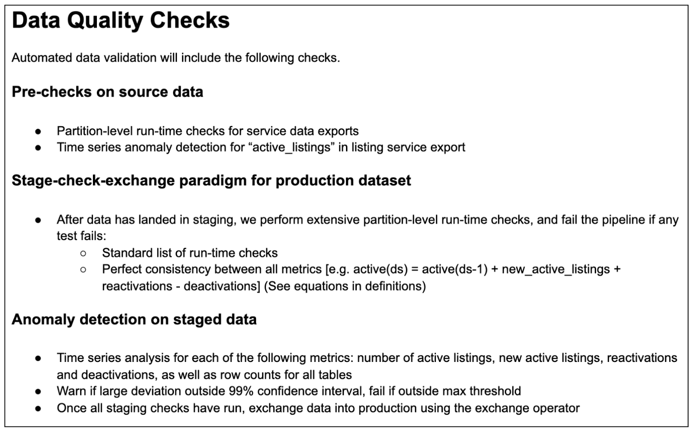

**{{ page.description }}**

# Data Quality 2 - A New Gold Standard

## Introduction

이전 포스팅에서 airbnb 조직이 어떻게 성장했는지, DQ challenge를 어떻게 극복햇는지 overview를 썼다. 이 포스트에선 DQ를 보장하는 "Gold Standard"를 만드는 Midas process에 대해 설명한다.

## Defining the Gold Standard

Data asset을 개발, 유지보수 하는 규모와 크기 자체도 커져서 전사적으로 DQ와 reliability에대한 일관적인 standard를 강제하는것이 어려워졌다. 2019년에 내부 설만조사에서는 Data Scientist들이 warehouse의 데이터를 찾기가 어려워지고, 어떤 data source가 그들의 작업에 high quality 기준을 충족하는지 알기 어려웠다.

이런 상황이 airbnb에서 DQ에 대한 일관적인 표준을 만드는 gold standard를 정의해야 하는 상황을 만들었다.

### A Multi-dimensional Challenge

여러 stakeholder들이 DQ가 중요하다는것에 동의했지만, DQ에 대한 정의는 각각 달랐다

- Accuracy
- Consistency
- Usability
- Timeliness
- Cost Efficiency
- Availability

각각 DQ 구성요소에 초점을 맞춘 표준을 만든다면 실제로는 큰 이펙트를 가져오지 못할것이라는 문제를 안고 있었다. 따라서 여러 관점에 걸친 DQ expectation을 표준화하기 위한 계획이 필요했다.

### End-to-end Data Quality

DQ의 여러 관점에 대해 얘기하는것 말고도, end-to-end로 엮인 데이터 input과 output에 대한 모든 data asset에 대해 적용할 수 있는 표준이 필요하다는것을 알았다. 특히 warehouse는 data asset과 workflow의 일부분이기 때문에, warehouse table의 quality를 높이는것 만으로는 충분하지 않았다.

특히 airbnb는 datasource를 abtract한 metric lens를 통해 데이터를 보는것에 익숙했으므로, data warehouse가 모든 data coverage를 보장해주지도 못했다. 따라서 모든 데이터에 대한 quality를 보장해야 했다.

airbnb data architecture에서는 metric은 minerva에서 정의되고, 여러 data tool에서 접근가능하다. 즉 minerva에서 정의한 메트릭은, dashboard, abtest, anomaly detction, lineage, ML feature, adhoc analysis등의 모든 툴에서 접근가능하다. 즉 single source of truth를 만들었다. Midas가 end-to-end data quality를 보장하는것을 통해 만들어졌다.

### The Midas Promise

certification process는 여러 관점의 Data Quality를 보장한다

- Accuracy: certified data는 모든 과거 데이터에 대한 검사, production pipeline에 구현된 ongoing autmated check에 의해 검증되었다
- Consistency: certified data, metric은 회사의 모든 팀, stakeholder에 걸친 비즈니스 컨셉에 대한 singlue source of truth를 나타낸다.
- Timeliness: certified data는 landing time SLA를 가진다.
- Cost Efficiency: certified data pipeline은 computing cost, storage optimization에 대한 best practice를 지킨다
- Usability: certified data는 모든 사내 툴에 쓸수 있으며, doc definition, computation logic을 지원한다 (뭔말?)
- Availability: 주요 company data는 certification이 필수다.

data가 certified되면, 다양한 data tool에서 별도로 표시된다.

## The Midas Certification Process

midas certification process는 각각의 비즈니스 컨셉이나 feature에 해당하는 data table/metric으로 구성된 데이터모델에 대한 프로젝트별로 진행된다. 데이터모델에 대한 바운더리를 정의할 명확한 기준은 없지만, 이정도의 abtraction으로 data table, pipeline, metric을 aggreagate하면 offline data warehouse를 더 효과적으로 구성, 설계, 유지할 수 있다.

### Broad Stakeholder Input

midas process는 data model 디자인에대한 오너쉽을 공유하는 data engineering, data science owner를 필요로 한다. 이같은 cross-functional input은 certification이 실제 사용, 구현문제, downstream requirements 뿐만 아니라 DQ dimension의 모든 범위를 커버할 수 있도록 만든다.

midas process는 모든 팀의 consumer에게 new data model의 reviewer로 참여하도록 하여 모델 생산자의 요구사항보단 전사원의 데이터 요구사항을 충족시키도록 만든다. midas process를 도입하기 이전엔 cross team partnership을 하기 어려웠지만, midas process의 구조는 전사적인 데이터 설계에 대한 협업에 큰 도움이 되었다.

### Design specs

Midas process의 첫번째는 pipeline, table, metric대 tech spec과 data model에 대한 ongoing doc 역할을 하는 design spec을 작성하는것이다. design spec은 표준화된 sub section template을 따른다. design spec은 data producer가 가지고있는(숨겨진?) domain knowledge를 노출하여 data producer로부터 dependency를 줄이고, 기존 data model에 대한 미래의 반복 작업을 쉽게해주고, owner간의 data asset에 대한 transition(ownership 변경)을 쉽게해준다.

밑 그림은 airbnb의 Active listings data model(airbnb의 listing supply에 대한 지표)에 대한 design spec을 간단하게 표현한 것이다.

- design spec의 위쪽에는, owner와 reviewer를 명시한다

- 첫번째 섹션에는 datamodel에 포함된 headline metric과 business definition, 메트릭을 이해하는데 필요한 디테일을 명시한다

- 두번째 섹션은 data model에 포함되는 테이블을 만드는데 필요한 파이프라인 요약을 나타낸다
    - tool table이 뭘까

- 그 밑에, 만들어질 테이블 스키마를 보여준다

- 마지막 섹션은, pipeline validation을 위한 DQ check를 보여준다

이 예시는 단순하게 표현했지만, 실제로는 메트릭과 파이프라인 디테일에 대한 자세한 스펙을 작성하며, 긴것들은 20페이지를 넘길때도 있다... 이러한 문서화는 많은 시간이 필요하지만, data model이 제대로 설계되고, 여러 stakeholder가 design input(요구사항 등)을 넣게 만들어주며, 소수만 알던 데이터 스펙을 많은 사람들이 알수 있게 해준다.

### Data Validation

Design spec이 작성되고 data pipeline이 만들어지면, output data에 대한 검증을 해야한다.

1. Data engineer에 의해 automated check가 data pipeline에 들어가고, design spec에 추가된다. certified data에 대해서는 필수로 들어가야 한다. 간단한 sanity check, definitional testing, anomaly detection등을 포함한다.
2. 과거 데이터에대한 validation은 data scientist가 수행하며, design spec과 별도로 validation report를 작성한다. validation report는 data model이 업데이트 될때마다 다시 검증할 수 있도록 코드와 쿼리와 검증했던 시점의 결과를 요약하여 작성한다. 이 작업은 더 디테일한 과거데이터의 anomaly detection, 기존 data source / metric과의 비교(새 data model의 consistency를 보기 위함) 등을 포함한 data pipeline에서 쉽게 자동화 하기 어려운 것들을 검증한다

design spec처럼 data validation도 많은 시간을 필요로 하지만, data inaccuracy와 bug report가 줄어들고, data model이 변화함에 따라서 validation또한 쉽게 반영시킬 수 있다.

### Certification Reviews

Certification review는 midas process의 중요한 컴포넌트이다. 회사에서 data architect나 metrics architect로 지정된 recognized data expert가 수행한다. 이 리뷰는 data quality에 대한 gatekeeper 역할을 한다.

1. Spec Review: 구현을 하기 전에 data model에 대한 design spec을 리뷰한다 (2)
2. Data Review: data quality check와 validation report를 리뷰한다 (6)
3. Code Review: data pipeline을 생성하는데 쓰이는 코드를 리뷰한다 (6)
4. Minerva Review: 미네르바에 구현된 source of truth metric 정의를 리뷰한다 (8)

이런 리뷰는 모든 data asset의 accuracy와 engineering practices를 커버하며, Midas promise를 맞추는 certified data model을 보장한다

### Bugs and Change Requests

offline data를 각각의 data model로 구성하고, 명확한 ownership을 통해 전사적으로 data consumer의 요청을 처리하는 process를 만들었다. 직원들은 간단하게 버그와 change request를 요청할 수 있다