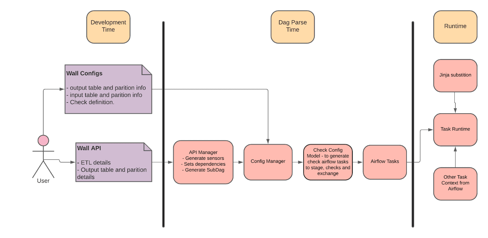
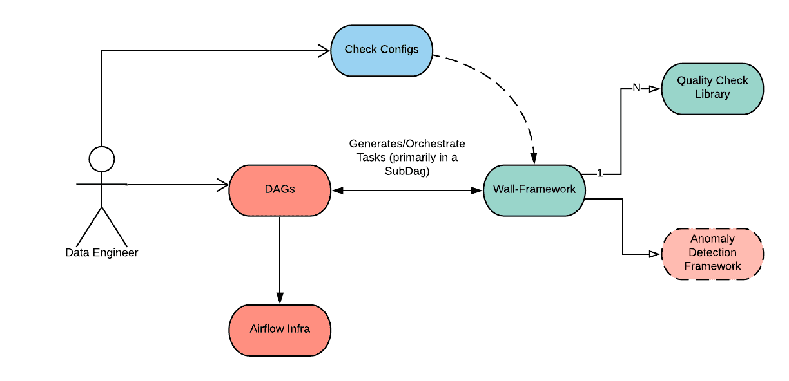
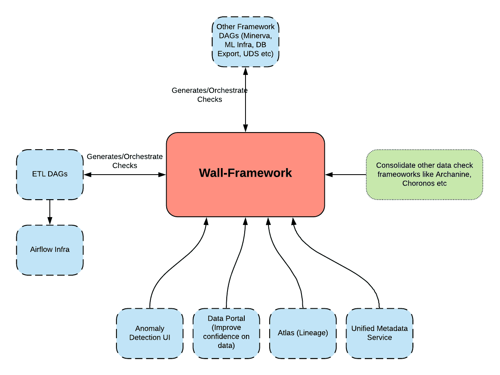

# Data Quality 3 - Prevent Data Bugs


[https://medium.com/airbnb-engineering/how-airbnb-built-wall-to-prevent-data-bugs-ad1b081d6e8f](https://medium.com/airbnb-engineering/how-airbnb-built-wall-to-prevent-data-bugs-ad1b081d6e8f)

# How Airbnb Built “Wall” to prevent data bugs

이 포스트에서는 data bug를 방지하기 위해 많은 종류의 data check(DQ, accuracy, completeness, anomal checks, ...)를 추가하는동안 직면한 문제에서 만들어진 새 framework를 설명한다.

# Challenges

Airbnb가 Midas certification process를 도입했을때, 어떤 종류의 DQ check이 필요한지 권장사항을 만들었지만, 이것들을 구현하도록 강제하지 않았다. 따라서 각각의 data engineering team은 그들만의 접근방식을 취했고, 아래와같은 문제들이 보였다

## 1. Multiple Approaches to add data checks

Airbnb는 Airbnb를 스케줄링에 사용하고, Hive SQL, Spark SQL, Scala Spark, PySpark, Presto가 execution engine으로 사용된다. 하지만 다른 execution engine에서 유사한 DQ check을 만들어서 아래와같은 문제점이 생겼다

- 팀간의 Data check coverage를 보기위한 일관된 방법이 없다.
- Data check guideline에 대한 변화는 여러 codebase의 변화를 필요로 하게 된다.
- scalable implementation이 불가능했다. 각 팀은 계속해서 같은 코드를 복붙하였다.

## 2. Redundant efforts

때때로 각 팀은 각각의 다른 data check을 위한 툴을 만들었다.

- 동시에 여러 framework를 만들었다.
- Data check framework는 유지보수가 힘들고, operational overhead가 생겼다.
- fliexibility/extensibility가 부족해서 framework들이 전사적으로 재사용하기 힘들었다.

## 3. Complicated Airflow DAG Code

각 Data check는 airflow의 task구현되는데, DAG file들이 커지게 되었다. 이런 check task의 operational overhead는 아래 요인들로 인해 관리하기 힘들었다

- Blocking, non-blocking check에 대한 지원이 없어, Minor check failure나 false alarm은 Critical data pipeline의 SLA를 만족시키지 못하는 경우가 생겼다.
- ETL logic과 data check가 tight-coupled되었고, 재사용성이 없었다
- dependency를 수동으로 붙였기때문에 maintenance가 어려웠고, data check를 더 추가하기 힘들었다.

# Defining the Requirements

위와같은 문제를 해결하기 위해, 아래의 requirements를 충족하고 시간이 지나도 더 나은 usability를 보장하는 unified data check framework를 만들기 시작했다.

- Extensible: data check methodology 통합
- Coniguration-driven: 개발 생산성을 위한 yaml format의 data check 정의
- Easy to use: 전사적으로 쉽게 적용가능한 단순한 인터페이스 제공

# Introducing Wall Framework

Wall은 offling DQ check 작성을 위한 잘 포장된 방식이다 (yaml로 쓰니까?). Wall framework는 data bug로 인한 analytical decision을 보호하고 데이터 신뢰도를 보장한다.

- Wall framework는 대부분의 DQ check와 anomaly detection mechanism을 제공하여 data check가 표준화되기 쉽게 한다
- Wall framework는 템플릿화된 SQL기반의 business logic, accuracy check, predefined check의 library를 제공한다.
- Wall framework는 config-driven이므로 check를 추가할때 code를 추가할 필요 없다.
- Check는 ETL pipeline에서 Stage-Check-Exchange 패턴이나 standalone check로 사용될 수 있다.
- Wall framework는 확장가능하다. 각 팀은 오픈소스 모델에 따라 쉽게 팀에 필요한 check를 wall framework에 추가할 수 있다
- Business user는 airflow DAG나 check task를 만들 필요 없이 쉽게 check를 추가할 수 있다
- Wall framework는 SQL기반의 check와 anomaly detection check를 만들 수 있다. 또한 stage and exchange task 생성을 처리하고, decoupling manner로 check에 대한 적절한 디펜던시를 추가한다. Wall framework으로 migration한 이후 ETL pipeline이 크게 간소화 되었다

# Wall Architecture

Wall framework는 확장성있게 설계되었다. WallAPIManager, WallConfigManager, WallConfigModel로 구성된다



## WallAPIManager

WallAPIManager는 wall을 사용하여 check와 exchange를 관리하는 public interface이다. Wall user는 DAG file에서만 사용한다. config folder path를 받고, spark hive와 같은 여러 ETL작업을 수행한다.

## WallConfigManager

WallConfigManager는 check config file을 파싱하고 검증하고, 관련된 CheckConfigModel을 호출해서 airflow task를 생성한다. Wall은 주로 Presto check를 이용하여 data check를 생성한다.

## CheckConfigModel

CheckConfigModel은 check parameter를 검증하고, check task를 생성한다. CheckConfigModel은 확장성이 있어 기존 모델이 필요한 usecase를 지원하지 않으면 다른 팀에서 자체 CheckConfigModel을 만들 수 있다.

# Key Features

## Flexibility

- Wall config는 DAG와 같은 repository에 있고, 여러 테이블들을 한개의 같은 yaml로 wall config를 사용 할수도 있고, 따로따로 사용할 수도 있다
- 각 check config model은 파라미터를 넣을 수 있고, override도 가능하다, 같은 종류의 check를 pre/post check나, stage-check-exchange 등의 형태로도 쓸 수 있다

```bash
Airbnb uses the stage-check-exchange pattern when loading data.
Data is staged in a temporary table, after which data quality checks are performed against that table.
Once the checks all pass the partition is moved into the production table.
```

- stage-check-exchange는 blocking check, non-blocking check로 만들 수 있다

## Extensibility

- 새 check model을 도입하기 쉽고 Wall은 일반적인 data check, validation을 지원한다.
- 각 check config model은 서로 디커플링 되어있고, 각각이 필요한 parameter, validation, check generation, preprocessing을 정의 할 수있다

## Simplicity

- 다른 테이블, 컨텍스트에서 비슷한 check를 쉽게 복붙할 수 있다.
- Check model은 직관적이다.
- ETL pipeline 업데이트와 디커플링 되어있다.
- 모든 check를 테스트하기 쉽다

# Adding a Wall Check

high level로 볼때, 유저는 yaml config를 작성하고 dag에서 wall api를 호출한다.



check 예제

- partition이 비어있지 않음을 확인하는 check
- table 이름은 `foo.foo_bar`, DAG는 `wall_tutorials_00`
1. check config를 작성한다, location은 `projects/tutorials/dags/wall_tutorials_00/wall_checks/foo.foo_bar.yaml`. yaml은 아래처럼 구성된다

```yaml
primary_table: foo.foo_bar
emails: ['subrata.biswas@airbnb.com']
slack: ['#subu-test']
quality_checks:
   - check_model: CheckEmptyTablePartition
     name: EmptyPartitionCheck
```

1. DAG file `wall_tutorials_00.py` 에서 config file을 읽어서 check task를 생성한다

```python
from datetime import datetime
from airflow.models import DAG
from teams.wall_framework.lib.wall_api_manager.wall_api_manager import WallApiManager
args = {
  "depends_on_past": True,
  "wait_for_downstream": False,
  "start_date": datetime(2020, 4, 24),
  "email": ["subrata.biswas@airbnb.com",],
  "adhoc": True,
  "email_on_failure": True,
  "email_on_retry": False,
  "retries": 2,
}
dag = DAG("wall_tutorials_00", default_args=args)
wall_api_manager = WallApiManager(config_path="projects/tutorials/dags/wall_tutorials_00/wall_checks")
# Invoke Wall API to create a check for the table.
wall_api_manager.create_checks_for_table(full_table_name="foo.foo_bar", task_id="my_wall_task", dag=dag)
```

### Validates and Tests

`wall_tutorials_00` DAG에 붙은 task들을 보면 wall framework에 의해 아래와 같은 task들이 생성된다.

```bash
<Task(NamedHivePartitionSensor): ps_foo.foo_bar___gen>
   <Task(SubDagOperator): my_wall_task>
```

Wall은 SubDagOperator task와 NamedHivePartitionSensor를 생성했다. Wall은 이 task들을 sub-dag로 encapsulate했다.

airflow cli로 list task를 수행하면 아래같이 나온다 `airflow tasks list <DAG_ID>`

```bash
<Task(WallPrestoCheckOperator): EmptyPartitionCheck_foo.foo_bar>
   <Task(DummyOperator): group_non_blocking_checks>
      <Task(DummyOperator): foo.foo_bar_exchange>
<Task(DummyOperator): group_blocking_checks>
   <Task(DummyOperator): foo.foo_bar_exchange>
<Task(PythonOperator): validate_dependencies>
```

Wall은 sub-dag에 PythonOperator, DummyOperator를 생성했는데, 이것들은 control flow(blocking/non-blocking, dependencies, validataion 등)를 붙이기 위한것이다. 이런 task들은 나중에 바뀌거나 지워질수도 있기 때문에 dependency를 가질 필요는 없다.

아래처럼 test도 쉽게 가능하다 (airflow에 없는 기능..)

```bash
airflow test wall_tutorials_00.my_wall_task EmptyPartitionCheck_foo.foo_bar {ds}
```

# Wall in Airbnb's Data Ecosystem

Wall framework를 airbnb의 전체 data ecosystem에 통합하는건 장기적인 성공을 위한 중요한 키이다. airflow가 아닌 다른 data tool들이 쉽게 연동하기 위해, check stage의 결과를 kafka event로 퍼블리쉬하고, 다른 data tool들이 subscribe한다



# Conclusion