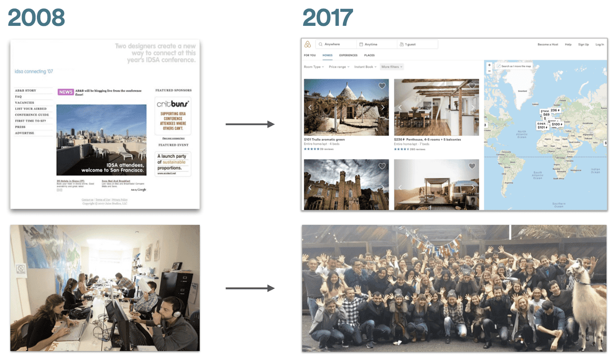
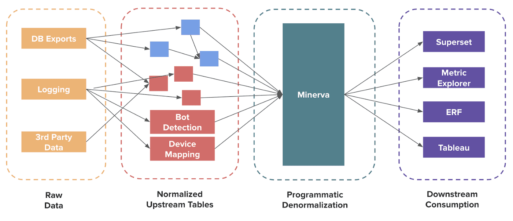
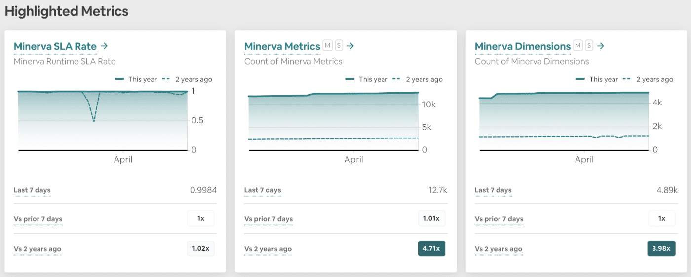
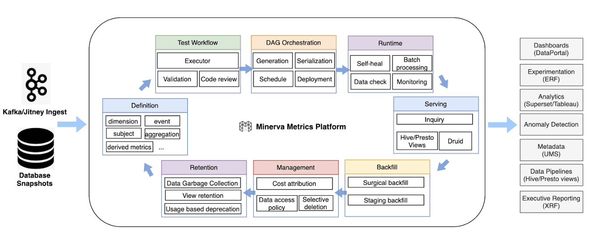
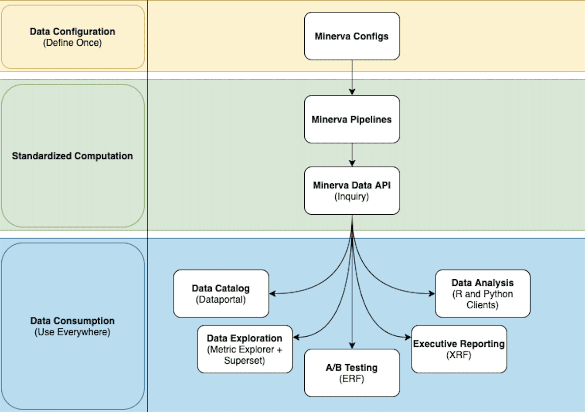
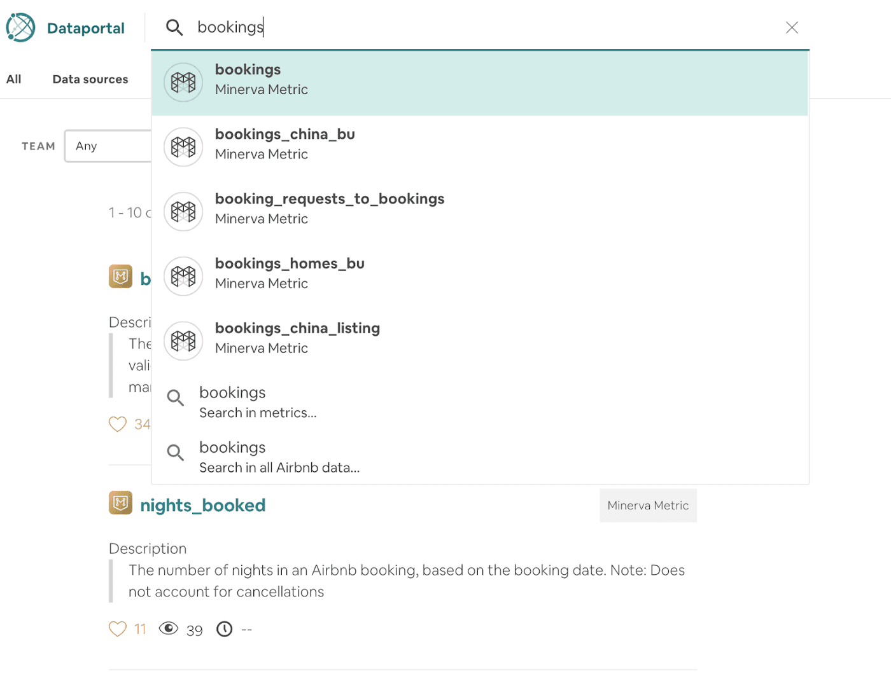
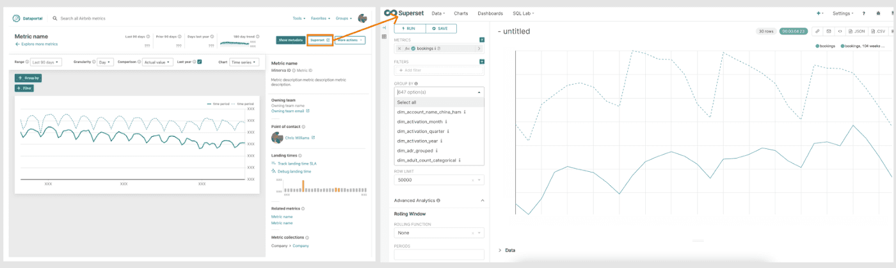
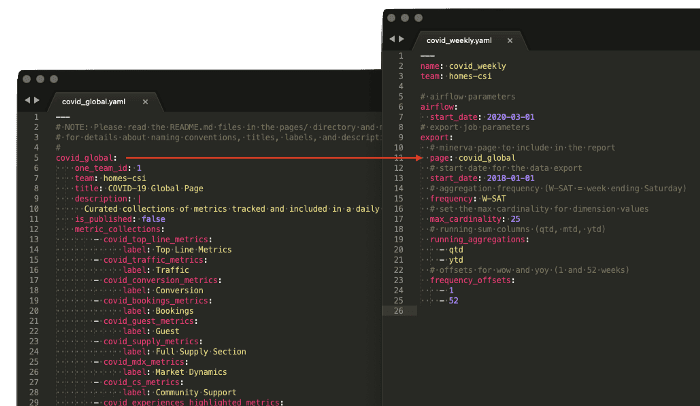
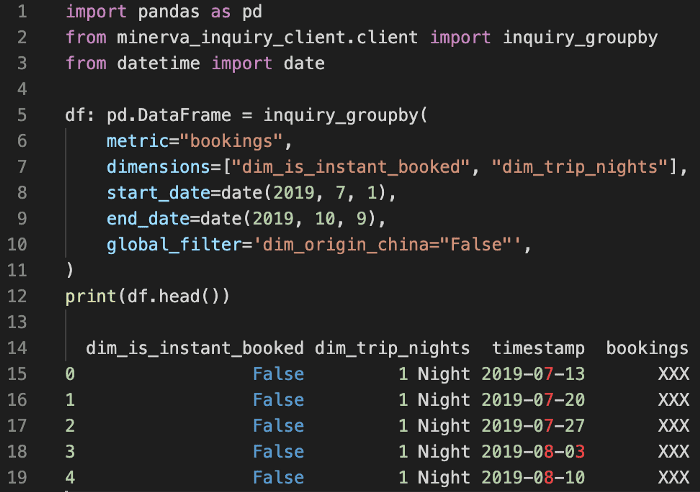
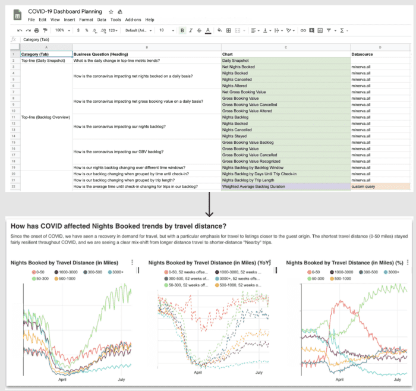

{{ page.description }}

# Minerva 1 - Metric Consistency

## Introduction

Airbnb는 중요한 의사결정을 할때 데이터를 본다. product idea를 randomized controlled experiment를 통해 검증하고, 비즈니스 성과를 트래킹한다. 이런 것들을 하기 위해서 Airbnb는 유저들의 end-to-end를 충족시키는 **robust data platform**을 만들어야 했다.

이전에 공유했던 포스팅들에서 어떻게 데이터가 warehouse로 들어오는지([Scaling Spark Streaming for Logging Event Ingestion](https://medium.com/airbnb-engineering/scaling-spark-streaming-for-logging-event-ingestion-4a03141d135d)), 어떻게 직원 스스로가 contextual data를 분석하게 하는지([Supercharging Apache Superset](https://medium.com/airbnb-engineering/supercharging-apache-superset-b1a2393278bd)) 설명했고, 이번엔 그 사이를 메꾸는 "어떻게 데이터를 정확하고 분석가능한 데이터셋으로 모델링하고 트랜스폼하는지에 대해 아직 자랑안했다.

이 포스팅에서는 airbnb에서 전사적으로 분석, 리포팅, 실험등을 위한 SSOT로 사용되는 metric platform minerva를 만든 경험에 대해서 자랑할거다. 특히 이게 왜 필요했는지, minerva ecosystem의 core feature, minerva가 생긴 이후의 임팩트에 대해 자랑할거다. 다음 포스팅에서는 minerva 구현에 대해([How Airbnb Standardize Metric Computation at Scale](https://medium.com/airbnb-engineering/airbnb-metric-computation-with-minerva-part-2-9afe6695b486)) 딥다이브할거다. 니들도 할수있으면 해봐라 ㅋㅋㅋㅜㅜㅜㅜㅜ(By publishing this series, we hope our readers will appreciate the power of a system like Minerva and be inspired to create something similar for their organizations!)

## A Brief History of Analytics at Airbnb

2010년의 airbnb는, 한명의 data analyst가 있었고 이 사람의 노트북이 data warehouse로 쓰였다.. 쿼리들은 직접 prod db에서 돌아갈때도 있어서 무거운 쿼리하나로 인해 서버에 장애가 생길때도 있었다. 이런 문제점들이 있었지만 data warehouse를 구축하지 않아서 그 시간동안 비즈니스가 성장 하는데 시간을 썼다.

2010년 초에 airbnb가 성장함에 따라, 더 많은 data scientist들이 회사에 들어왔고([At Airbnb, Data Science Belongs Everywhere](https://medium.com/airbnb-engineering/at-airbnb-data-science-belongs-everywhere-917250c6beba)), 데이터는 볼륨과 variety 모두다 증가했다. 이때쯤에 우리는 데이터 인프라를 업그레이드,안정화([Data Infrastructure at Airbnb](https://medium.com/airbnb-engineering/at-airbnb-data-science-belongs-everywhere-917250c6beba))를 하였다. Chronos에서 workflow orchestration을 위해 자체개발한 opensource인 Airflow([Airflow: a workflow management platform](https://medium.com/airbnb-engineering/airflow-a-workflow-management-platform-46318b977fd8))로 옮겨갔고, `core_data` 라고 불리는 중요 데이터 테이블 셋을 구축했다.

`core_data` 가 베이스가 되면서, 분석이 활성화가 되었다.

1. 실험 플랫폼([Expermental Reporting Framework](https://medium.com/airbnb-engineering/experiment-reporting-framework-4e3fcd29e6c0), [Scaling Airbnb's Experimentation Platform](https://medium.com/airbnb-engineering/experiment-reporting-framework-4e3fcd29e6c0))을 구축해서 ab testing 문화를 도입했다.
2. 데이터를 문서화 하기위해 in house data catalog인 Dataportal([Democratizing Data at Airbnb](https://medium.com/airbnb-engineering/democratizing-data-at-airbnb-852d76c51770))를 만들었다.
3. 사용자들이 데이터를 독립적으로 분석할수있는 오픈소스 프로젝트인 Superset([Superset: Airbnb's data exploration platform](https://medium.com/airbnb-engineering/democratizing-data-at-airbnb-852d76c51770))을 만들었다.
4. Data scientist들이 아닌 사람들에게도 데이터를 분석할 수 있도록 Data University([How Airbnb Democratizes Data Science With Data University](https://medium.com/airbnb-engineering/how-airbnb-democratizes-data-science-with-data-university-3eccc71e073a))를 런칭하여 교육시켰다.

## Growing Pains

`core_data`를 점진적으로 발전시킨것은 많은 노력없이는 불가능했다. 데이터를 사용하는 사람들과 유즈케이스가 많아질수록 data producer와 consumer 모두가 큰 문제를 느끼고 있었다.

첫번째로, `core_data` 를 많이 사용하는것으로 더 많은 producer들이 분석,예측,실험에 이 데이터를 쓰기를 원했다. 새로운 테이블들은 `core_data`에 기반해서 매일매일 직접 생성되고 있었지만(디펜던시가 점점 늘어남), 비슷한 테이블이 이미 있는지 알수 있는 방법이 없었다. 이런 복잡도는 점점 커졌고 data lineage는 트래킹하기 어려울정가 되었다. upstream data issue가 발견되어서 고쳐지면, downstream job이 고쳐지는것을 보장하지 못했다. 따라서 data scientist와 data engineer는 많은 시간을 data discrepancy를 해결하기 위해 쏟았고, 이런 사고가 일어나는것이 생산적이지 못하고 demotivation을 가져왔다.

- core_data 로부터 파생된 테이블들에서 생기는 삽질

data consumer들로부터, 간단한 비즈니스 퀘스천에 대한 서로 다른 숫자가 나오지만 어떤 숫자가 맞는지 알 방법이 없었다는 불만을 들었다. 예를들면, 어떤 도시가 전주에 비해서 부킹이 많은지 묻게 된다면, data scientist와 finance팀은 약간 다른 테이블/메트릭/비즈니스로직을 사용해서 서로 다른 답을 내놓는 상황이었다. 시간이 지나면서 data scientist조차 자신의 데이터를 추측하게되면서 data quality는 떨어지고 의사결정권자에게 데이터의 신뢰를 떨어트리게 됐다.

## Overcoming Our Growing Pains with Minerva

위와같은 문제들로인해 airbnb는 data quality를 높은 수준으로 향상시키기 위해 data warehouse를 완전히 바꾸기를 시작했다. data engineering 팀은 몇개의 중요 비즈니스 데이터 모델에 대해 불필요한 조인을 하지 않는 certified, lean, normalized table을 맨바닥부터 다시 만들었다.

또한 위와같은 테이블들로부터 인사이트를 만들기 위해, prgrammatic하게 조인하여 분석하기 편한 데이터셋을 만드는것, 비즈니스 로직이 바뀔때마다 데이터를 백필하는것, 다양한 data tool에서 consistent하고 correct한 데이터를 보여주는것이 필요했다.

이것이 airbnb의 metric platform인 Minerva다.. Minerva는 fact와 dimension table을 인풋으로 받아 data denormalization을 수행하고, aggregated data를 downstream application으로 서빙한다. Minerva API는 upstream data와 downstream consumption의 갭을 풀어주어, DE팀이 여러 downstream consumer들을 서포트하면서 core table을 수정할 수도 있는 유연성을 제공해준다. 이 API는 airbnb의 warehouse architecture에서 중요한 역할을 한다.

- Minerva는 data warehouse architecture에서 중요한 역할을 한다.

현재 Minerva에는 12000개 이상의 메트릭, 4000개 이상의 디멘전이 있고, 다양한 기능..(Data, Product Management, Finance, Engineering)과 팀(Core Product, Trust, Payments)에 걸쳐있다. Minerva는 대부분의 팀이 분석, 리포팅, 실험등에서 사용하는 프레임워크가 되었다.

- Minerva를 도입한 다른 사내 서비스

## Data Production in Minerva

Minerva는 오픈소스로 만들어져있다. Minerva에서 workflow orchestration은 airflow, compute engine은 hive와 spark, consumption은 presto와 druid를 쓰고있다. 메트릭을 생성하는 것에서 computation, serving, consumption, deprectaion까지 Minerva는 메트릭의 전체 lifecycle을 커버한다.

- Minerva는 메트릭의 전체 lifecycle을 관리한다

- **Metric Definition**: Minerva는 전사원이 업뎃할수있는 git repo에서 key business metric, dimension, dimension, 다른 metadata를 정의한다.
- **Validated Workflow**: Minerva의 개발과정은 code review, static validation, test run등 data engineering best practices를 강제하고 있다.
- **DAG Orchestration**: Minerva는 data reuse와 intermediat joined result를 최대한 활용해서 효율적으로 데이터를 denormalize한다
- **Computation Runtime:** Minerva는 job 실패후 자동으로 회복할수있고, data quality를 보장하는 built-in check가 있는 정교한 computation flow를 가지고 있다.
- **Metrics / Data Serving**: Menierva는 aggregated metric과 raw metric을 온디맨드로 제공하는 unified data API가 있다
- **Fliexible Backfills**: Minerva는 data definition에 대해 버전관리를 하고있어, dataset에 대한 major change는 자동적으로 tracking, backfill되고 있다.
- **Data Management**: Minerva는 cost attribution, GDPR 제거, data access control, auto-deprecation 정책등의 기능을 제공한다.
- **Data Retention**: Minerva는 usage-base retention, GC를 만들어서 비싼 데이터지만 잘 쓰지 않는 dataset들을 제거한다.

위와같은 기능들은 metric creation, data computation, data delivering을 표준화 할수 있게 해줬다.

## Data Consumption in Minerva

Minerva의 비전은 유저들이 "metric을 한번 정의하면 어디서든 쓸 수 있도록" 만들자이다. 즉 Minerva에서 생성된 metric은 다양한 툴에서 쉽게 접근가능해야한다. 데이터 팀은 다른 팀과 협업해서 Minerva위에 이와 같은 니즈를 충족하는 생태계를 만들었다.

### Data Cataloging

Analytics product team과 협업해서 모든 Minerva metric, dimension을 인덱싱하는 airbnb의 data cataloging service인 Dataportal을 만들었다. 유저가 metric을 검색하면 Minerva metric이 검색결과에서 가장 높게 나온다. Dataportral은 certification status, ownership등의 contextual info를 제공하여 유저가 metric의 중요도를 인지할 수 있다. 대부분 비개발 직군에게 Dataportal은 Minerva metric을 접근하는데 큰 도움을 주고 있다.

### Data Exploration

Dataportal의 검색결과에서 metric을 누르면, 바로 쓸 수있는 Metric Explorer를 보여준다. 이 페이지에선 유저는 group by나 filter등으로 데이터를 쪼개보거나 드릴다운 할 수 있다. 데이터를 더 깊게 들여다보고싶으면 superset 버튼을 클릭하면 된다. 또한 Metric Explorer는 metric owner, historical landing time, metric description을 제공해준다. 이런 이점은 개발직군, 비개발직군 모두 데이터를 쉽게 까볼 수 있는 이점을 제공한다.

### A/B Testing

그동안 Airbnb의 Experimentation Reporting Framework(ERF)는 `metric repo` 라고 불리는 자신만의 expreiment metrics repository를 가지고 있었다. `metric repo`로 실험과 결과 비교를 위해 비즈니스 metric을 추가할 수 있었다. 하지만 이 metric repo는 실험이 아닌 usecase에는 쓸 수 없어서, ERF를 Minerva와 통합하여 모든 ab test를 위한 이벤트들을 Minerva에서 정의하고 서빙하도록 했다. 실험과 분석 데이터가 같은 소스에 있어서 data scientist들이 어떻게 실험이 주요 비즈니스 metric에 영향을 미치는지 이해하기 쉽게 만들었다.

### Executive Reporting

airbnb는 비즈니스 성과를 매주, 매월, 매분기 리뷰하며 리더들은 비즈니스의 상황에대해 토론한다. 이런 미팅들은 high-level이며 간결한 executive report를 필요로 한다. 데이터는 aggregated되고, 트렌드는 그래프로 그려지고, metric은 월단위 집계나, YoY같은 식으로 보여진다.

이런 리포팅을 위해 eXecutive Reporting Framework(XRF)를 만들었다. XRF는 Minerva metric과 dimension을 선택하면, 이 데이터들을 타임시리즈로 aggregation하여 리포트형태의 결과물을 준다. XRF는 많은양의 수작업들을 자동화했고, 분석과 실험에 쓰이던 Minerva metric을 그대로 사용하므로 높은 신뢰도의 리포트를 만들어 준다.

### Data Analysis

Minerva API를통해 R, Python client로 Minerva data를 쉽게 조회할 수 있고 노트북 환경에서 쉽게 사용할 수 있도록 만들어 준다. 여기서 중요한것은, 노트북 환경의 데이터는 다른 data tool과 똑같은 일관성을 주어 data scientist가 분석의 난이도에 따라 적절한 툴을 선택할 수 있는 것이다.

## How We Responded To the COVID-19 Crisis with Minerva Data

마지막 섹션에서는 covid-19 crisis에서 Minerva가 어떤 역할을 했는지 예시를 보여줄것이다.

2020년 3월애 국제 여행은 covid-19로 인해 완전히 셧다운되었다. 거의 하룻밤사이에 대부분의 예약은 급감하고 취소는 급증했다. 이 상황은 airbnb에겐 두려웠고, 많은 비즈니스 퀘스천을 만들었다. "어떻게 코로나 바이러스가 예약에 영향을 미치는가?" "점유율에 어떤 영향을 미치는가?" "취소가 증가하는것으로 재정의 영향은 어떻게 됐는가?" "코로나가 여행거리 관점에서 어떻게 여행의 수요를 변화시켰는가?" 우리는 이런 퀘스천들을 빠르고 정확하게 알아야 했다.

이런 질문이 쏟아지면서 데이터 팀은 질문들을 모으고 어떻게 데이터를 활용하여 답을 얻을지 논의했다. 결정적으로 supply, demand, finance, customer support등 대부분의 주요 비즈니스 metric, dimension은 이미 Minerva에 있었다. central analytics 팀은 executive dashboard를 만들수 있었고, 며칠내에 초기 버전의 대시보드를 만들 수 있었다. covid-19 대시보드는 빠르게 SSOT로 자리잡았고 리더들의 면밀한 리뷰를 받았다. 그래서 이 대시보드는 11000뷰와 1500명의 viewer를 찍었으며 2020년에 superset에서 가장 많이 본 대시보드로 기록됐다.

또한 Minerva에서 만들어진 인사이트는 빠르게 바뀌는 상황을 정확하게 파악할 수 있게 해주었다. 예를 들면 local travel이나 long-term stay같은 수요 이동을 빠르게 포착하였다. 위기의 순간에서 인사이트를 발견하고 많은 비즈니스 질문에 대해 결과를 보일수 있는것은 어떤것보다 중요했다.

## Closing