{{ page.description }}

# Minerva 2 - Design Principles for Standardized Metric

## Introduction

두번째 포스팅에선 Minerva의 computing infrastructure에 대해 딥다이브 할것이다. 특히 어떻게 declarative configuration을 통해 dataset definition을 표준화했는지, 어떻게 data versioning이 cros-dataset consistency를 보장하는지, 어떻게 zero downtime으로 data backfill을 하는지 보여줄것이다.

## Minerva's Design Priciples

- **Standardized**: Data는 single place에 명시적으로, 난해하지 않게 정의되어야 한다. 어느 누구나 definition을 보고 명백하게 이해할수 있어야한다.
- **Declarative**: 유저는 "어떻게"가 아닌 "무엇"을 정의해야 한다. 어떻게 메트릭을 계산할지, 저장할지, 서빙할지는 end user로부터 숨겨져야 한다.
- **Scalable**: Minerva는 computing과 operation 측면에서 둘다 scalable해야 한다.
- **Consistent**: data는 언제나 consistent해야한다. 만약 definition이나 비즈니스 로직이 바뀌면, backfill은 자동적으로 수행되고, data는 up-to-date해야한다
- **High available**: 기존 데이터셋은 downtime없이 바로 바뀔수 있고, data consumption에대해 최소한의 interruption이 생기도록 replace되어야 한다
- **Well tested**: 유저는 데이터 변경에 대해 prod에 붙이기 전에 변경사항을 프로토타이핑하고 검증할수 있어야 한다

아래 섹션에선 각각의 design principle에 대해 자세히 설명하고 이런 design principle을 구현해내기위해 infrastructure component를 볼것이다.

## Minerva is Standardized

첫번째 포스팅에서 봤듯 `core_data` 를 많은 곳에서 쓰는것은 양날의 검이었다. 장점은 `core_data`가 table consumption을 표준화했고, 유저들이 만들 테이블을 빠르게 식별할 수 있다. 단점은 `core_data`가 중앙집중식 data engineering은 부담이 됐다. 또한 `core_data`의 downstream으로 만들어진 파이프라인들은 다양하면서 중복된 메트릭을 만들고 있었다 — 즉 너무 많아서 뭐가뭔지 모르는.. — 이런 상황으로인해서 테이블 표준화는 충분하지 않고, metric level의 표준화가 신뢰도높은 data consumption을 만들어 줄것이다라는것을 알게되었다. 현재 유저들은 table을 쓰지않고, metric/dimension/report를 사용한다.

Minerva는 table과 column이 아닌 metric과 dimension에 집중했다. Minerva에서 metric이 정의되면, author들은 어느 누구나 metric을 잘 이해할 수 있게 ownership, lineage, metric description등의 metdata를 작성해야 했다. Minerva 이전에 이런 모든 메타데이터는 문서하되지 않았고, 여러 data tool에서 chart definition정도로만 작성되어 있는것이 대부분이었다. Minerva에선 모든 definition은 version-controlled code로 관리된다. config file의 수정은 무조건 리뷰를 거친다.

Minerva config system의 핵심은 event source, dimension source인데. 이것은 star schema의 fact와 dimension에 해당한다.

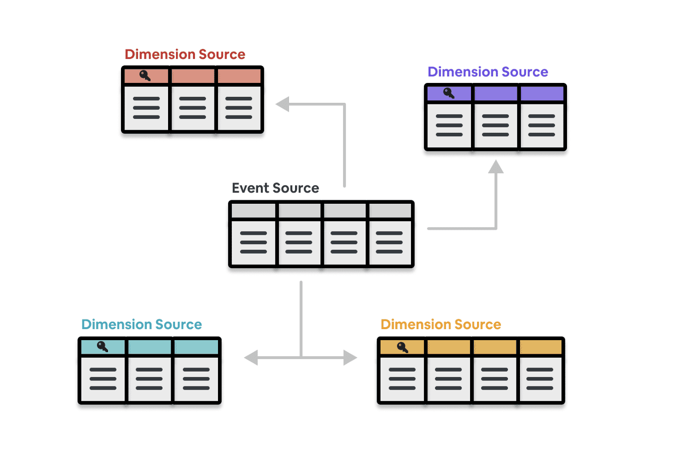

- Event Source: metric이 구성되는 atomic event를 정의
- Dimension Source: metric과 같이 쓸 수 있는 attribute들 정의

event source와 dimension source는 metric과 dimension을 정의하고, 트래킹하고, 문서화하는데 쓰인다.

## Minerva is Declarative

Minerva 이전에 insightful한 분석이나 신뢰도가높고 data에 대한 반응성이 높은 대시보드를 만드는건 어려웠다. product이 바뀌고, 쿼리 성능 요구사항을 맞추고, metric divergence를 방지하는것은 각 팀에게 큰 업무 부담이 되었다. Minerva의 key value중 하나는 이와같은 시간이 오래걸리고 지루한 consuming workflow를 단순하게 만들어 유저가 빠르게 데이터를 얻어 액션가능 한 인사이트를 만드는것이었다

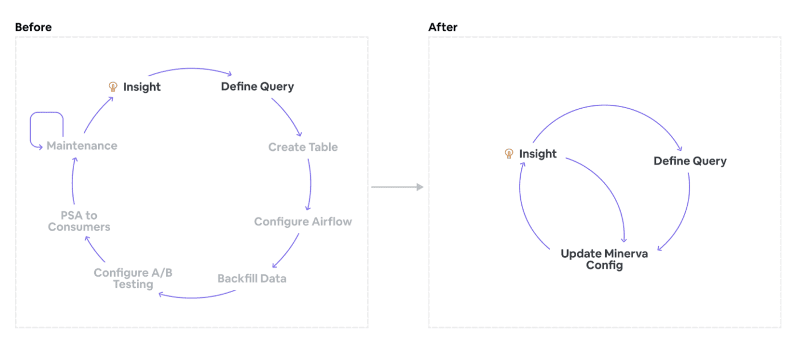

유저는 Minerva의 metric과 dimension으로부터 join된 분석하기 편한 데이터셋이나, dimension set을 쉽게 정의할수 있다. ad-hoc으로 생성된 dataset과 달리, dimension set은 아래와같은 특징을 가지고 있다.

- 유저는 "무엇"에 대해서 정의할뿐, "어떻게"는 고려하지 않는다. 모든 구현 디테일이나 복잡도는 유저로부터 숨겨진다.
- 이런 방식으로 생성된 dataset은 DQ check, join, backfill등의 best data engineering practice를 따르고, 모든것이 효과적 이고 cost-effective하게 제공된다.
- data는 효율적으로 저장되고 query time을 줄이는데 최적화 되어있으며, downstream dashboard에도 반영된다.
- Minerva에서 dataset이 투명하게 공개되어있으므로, metric을 재사용하기 쉽고, duplication이 줄어든다

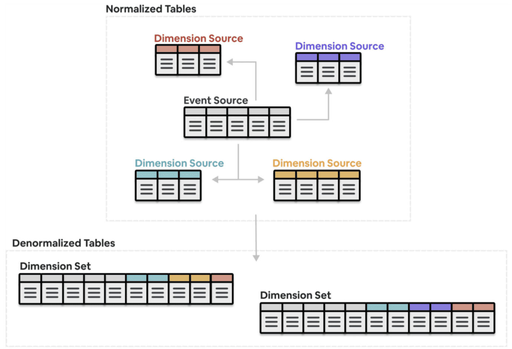

"어떻게"가 아닌 "무엇"에 집중하는것으로 Minerva는 유저 생산성을 향상시키고, 유저가 데이터를 통해 수행하려던 원래 목적 (트렌드를 보거나, 인사이트를 만들거나, 실험을 하거나)에 집중 할 수 있게 만들어준다. 이 덕분에 Minerva는 꾸준히 지속적으로 다른 service와 연동될 수 있었다.

## Minerva is Scalable

현재 Minerva는 80개 이상의 팀, 수백명의 유저들이 만든 5천개 이상의 dataset을 서빙하고 있으며, cost와 maintenance overhead 또한 최우선적으로 관리되고 있는 확장성있는 서비스이다.

Minerva의 computation은 DRY(Do not Repeat Yourself)를 염두해두고 만들어졌다. 즉 쓸모없는 연산을 최소화하고 consistency를 보장하기 위해 가능한한 meterialized data를 재사용하게 된다. 이런 Computational flow는 아래 4가지 stage로 쪼개어 볼 수 있다

- **Ingestion Stage**: partition sensor가 uptstream data를 기다리고, data가 Minerva로 들어온다.
- **Data Check Stage**: upstream data가 malformed인지 확인하는 DQ check가 동작한다.
- **Join Stage**: Dimension Set을 만들기 위해 Data는 join key들을 통해 자동적으로 join된다.
- **Post-processing and Serving Stage**: joined output은 aggregate되고, derived data는 downstream usecase를 위해 가상화된다. (Airbnb는 table, column이 아닌 metric과 dimension을 보여주므로, 이것에 맞추어 변환한다는 의미인듯

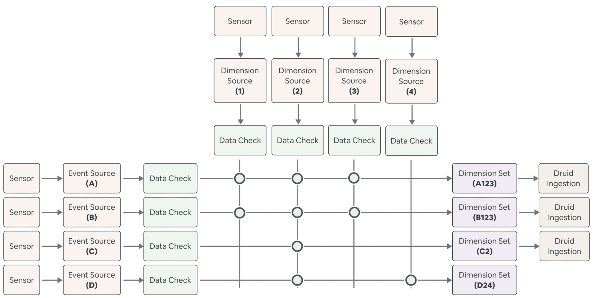

**Ingestion Stage**에서, Minerva는 uptsream table data가 내려올때까지 기다리고, 이 데이터를 static Minerva tables로 넣는다. 이 데이터들은 source-of-truth가 되고, 이 데이터들을 수정하려면 Minerva config를 수정해야만한다.

**Data Check Stage**는 processing이 수행되기 전에 source data가 malformed가 아님을 확인한다. 크게 아래와같은 조건들을 확인한다

- source data가 empty가 아니어야함
- timestamp는 not null이고, ISO standard여야 함
- PK는 unique해야함
- dimension value는 우리가 예측한 값과 일치해야함 — dimension value가 가질수있는 값의 범위들을 미리 정의해둔곳이 있는것같다 —

**Join Stage**에선 다른 dimension set에서 참조하는 같은 data(event source, dimension source)가 같은 transformation logic을 통해 sourcing, computing, join된다. 위와같은 centralized computation은 어떻게 Minerva가 consistency와 efficiency를 만족하는지 보보여준다.

**Post-processing and Serving Stage**에서 data는 end-user의 query performance를 위해 더 최적화되고, derived data는 가상화된다. 이 내용에 대해선 세번째 포스팅서 자세하게 다룰 것이다.

Minerva는 scalable할 뿐만 아니라, operation관점에서도 효율적으로 작동한다. 특히 self-healing, automated backfill, intelligent alert에 대해 소개할 것이다.

**Self-healing**은 Minerva가 아래와 같은 상황에서 gracfull하고 자동적으로 데이터를 복구 할 수 있도록 해준다.

- pipieline이나 platform code에 버그가 있을때
- cluster나 scheduler 장애처럼 인프라가 불안정할때
- upstream data가 SLA를 만족시키지 못해 timeout이 발생할 때

self-healing을 만들기 위해서 Minerva는 data-aware해야 한다. job이 시작할때마다, Minerva는 과거 데이터에 누락된 데이터가 있는지 확인한다. 누락건이 확인되면 Minerva는 자동적으로 현재 job run에 누락 데이터를 채우기 위한 job도 포함시킨다. 즉 single run이 dynamic하게 computation window를 결정하고 backfill한다. 유저는 dag run이 실패했을때 직접 task를 reset할 필요가 없다.

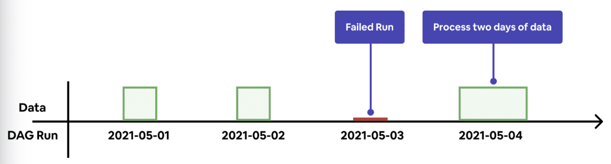

self-healing logic은 automated backfill을 하게된다. Minerva가 해당 data version에 대해 data가 없음을 확인하게 되면, 자동적으로 upstream dataset에서부터 data를 생성한다.

만약 backfill window가 엄청 크다면 (몇년) long-running query를 만들게 된다. 하지만 computation engine은 무거운 쿼리도 동작할만큼 scalable해야하는데 한 쿼리가 매우 긴 runtime을 가지는건 computation engine에게는 리스크가 된다. long-running query는 일시적인 인프라 장애를 만들 수 있고 복구하기가 힘들고, 리소스 사용랑에 스파이크를 칠 수 있다. 그렇다고 몇년 데이터를 backfill해야 하는데 backfill window를 1일단위처럼 작게 잡는다면 너무 느리게 동작하게된다. scalability를 높이고, runtime을 줄이고, recoverable하게 만들기위해 Minerva는 batched backfill을 도입했다.

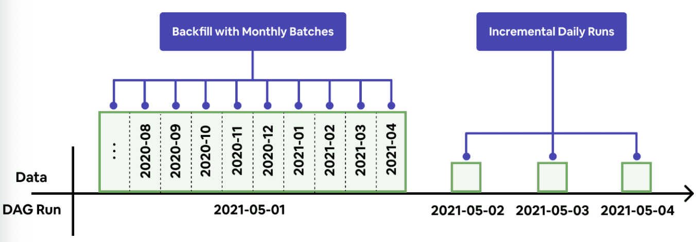

Batched backfill은 long backfill window를 가진 job을 몇개의 date range로 쪼갠다. 예를들어 Minerva는 2년데이터 backfill에 대해 24개의 1개월 backfill로 바꾸고 병렬적으로 수행시킨다. 실패한 batch는 자동적으로 next run에 재시도된다.

위와같은 automated dataset management는 각 팀에 책임을 나눠줄수 있게 했다. 인프라 이슈는 플랫폼 팀만 관여하면되고, 데이터 이슈는 각각 product이나 data science팀에서 관리하게 된다.

또한 dataset들은 서로 다른 escalation level을 가지기때문에, Minerva는 data에 문제가 생기면 error 종류에따라 alert을 팀으로 보내고, downstream consumer에게 data delay가 생기는것을 알려준다. intelligent alert은 data의 root cause를 해결하기에 적합한 각각의 팀에 책임을 부여하고 운영 부하를 전사적으로 분산시킨다.

Self-healing, autmoated batched backfill, intelligent alert은 Minerva가 적은 유지보수, 운영비용 감소, resilient system을 만드는데 기여했다.

## Minerva is Consistent

Minerva의 metric repository는 많은 유저에의해 자주 바뀌고, 매우 빠르게 변화한다. 이런 변경들을 잘 제어하지 않으면 metric과 dimension은 쉽게 여러 버전의 데이터들이 난립할것이다. 어떻게 Minerva에서 생성된 dataset이 언제나 consistent하고 up-to-date할 수 있는지 말할것이다.

솔루션은 config file에 있는 주요 필드들을 hash한 값인 data version을 활용하는것이다. data 생성에 영향을 주는 필드가 바뀌게 되면, data version은 알아서 업데이트 된다. 각 dataset은 unique data version이 있고, data version이 업데이트되면 새 dataset은 자동적으로 backfill된다. 아래 그림은 이 메커니즘이 어떻게 동작하는지 보여준다.

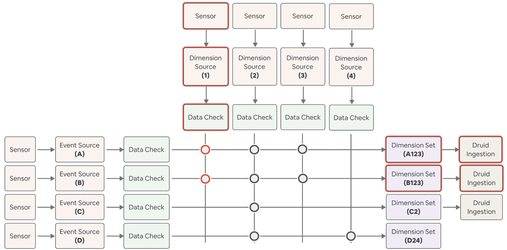

- 이 시나리오에선 Dimension source 1이 업데이트 된다.
- 이 dimension source를 사용하는 dimension set `A123, B123`에 대한 data version은 업데이트된다.
- data version이 업데이트 되면, 두개 dimension set에 대한 backfill이 동작한다.
이것이 dataset들을 consistent하게 만드는 키이다.

위와같은 메커니즘은 upstream change가 모든 downstream dataset에 반영되도록 하며, Minerva dataset이 SSOT를 지키게 해준다.

## Minerva is Highly Available

위 내용에선 backfill rate과 user change 빈도의 딜레마가 있다. 이 섹션에선 어떻게 미네르바가 data versioning을 data consistency를 위해 사용하는지 설명할 것이다. 실제로 backfill은 user change를 따라가지 못할때가 있고, 특히 change가 많은 dataset에 영향을 줄때 자주 일어난다. Minerva가 언제나 data를 일관적이고 up-to-date하게 보여주기 위해선, 빠르게 dataset이 바뀌는건 backfill이 지속적으로, 큰 data downtime을 만들수 있다.

Minerva는 staging environment를 구성해서 병렬 컴퓨팅 환경을 만들었다. staging은 유저의 production를 복제하여 merge되었지만 production data에 반영되지 않은 config 수정을 반영하는 환경이다. production에 반영하기 전에 shared environment에서 backfill을 자동으로 수행하여, 여러개의 배포되지않은 변경사항을 한개의 backfill로 만든다. 이로인해 유저는 팀간의 변경사항과 backfill을 coordinate할 필요가 없고, data consumer들은 downtime없이 사용할 수 있다.

staging의 data flow는 아래와같다

1. local environment에서 변경사항을 테스트한다
2. staging environment에 변경사항을 merge한다
3. staging environment는 prod config가 반영되어있는 staging config를 보고 변경된 dataset에 대해 backfill을 수행한다
4. backfill이 끝나면 staging config는 prod로 merge된다
5. prod environment는 바로 새 definition을 보고, consumer들에게 그 data를 제공한다

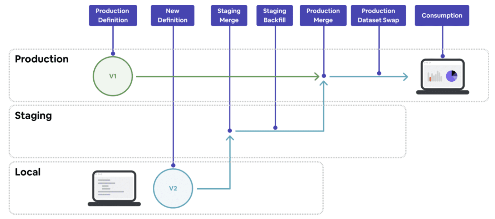

staging environment로 주요 비즈니스 metric에 대해 consistency와 availability을 제공하며, 많은 업데이트가 있을때에도 문제없이 동작한다. 많은 data migration project들을 이 시스템위에서 간편하게 끝낼 수 있었다.

## Minerva is Well Tested

metric과 dimension을 정의하는 것은 매우 반복적인 작업이다. 유저는 raw data가 이상한것을 찾거나, data source가 어떻게 생성됐는지 더 파봐야 할 때도 있다. 하지만 Minerva는 유저가 data correctness를 확인하거나, data에대한 상황을 확인하거나, iteration cycle을 돌리는데에 있어 유저의 생산성을 높여줘야 한다

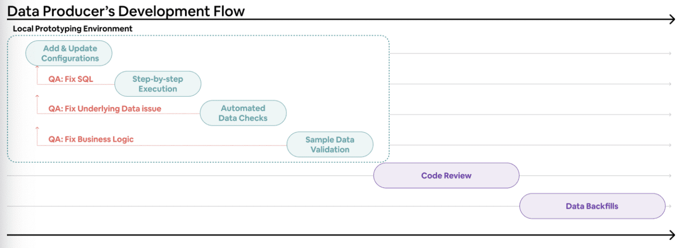

이를위해 production으로 read-only로만 동작하는 guided prototyping tool을 만들었다. staging environment처럼 이 툴은 Minerva execution logic을 활용해 유저의 변경사항에 대해 로컬에서 빠르게 샘플 data를 생성할 수 있도록 해준다. 따라서 유저는 data에 대한 가정이나 기존 data와 비슷한지 등을 sample data를 통해 data quality check를 편하게 할 수있다.

prototyping tool은 Minerva pipeline의 단계별 연산과 생성된 아웃풋을 보여준다. Minerva의 연산 로직에 대한 visiblity를 제공하고 유저가 직접 디버깅하는데 도움이 된다.

또한 유저가 설정한 date range, sampling을 받아 테스트되는 data size에 대한 제약을 걸어 execution time을 빠르게 하고, dataset을 만드는 시간을 줄이고, dataset이 검증에 필요한 statistical property를 유지할 수 있게 해준다.

## Putting It Together: A COVID-19 Case Study

이 섹션은 Minerva의 시스템이 어떻게 동작하는지 보여주기 위해 case study를 설명한다. 그동안 Airbnb는 도시와 시골에 대한 수요를 거의 균등하게 나누었다. covid가 시작될때, 한 분석가는 여행하는 사람이 다른 사람들과 적게 닿을 수 있는 대도시를 피할 것이라 가설을 세웠다.

가설을 확인하기 위해, 분석가는 `nights_booked` metric을 `dim_listing_urban_category` dimension 기준으로 분석하기로 했다. `nights_booked` metric이 이미 Minerva에 있고, 전사적으로 중요한 metric이었지만, `listing` dimension은 사용하기 어려웠다. 분석가는 팀에서 [Global Rural-Urban Mapping Project](https://sedac.ciesin.columbia.edu/data/collection/grump-v1) 와 [GPW v4 World Population Density Data](https://sedac.ciesin.columbia.edu/data/collection/gpw-v4)를 활영하여 새 metadata로 모든 `listing` 에 태깅하고 새 dataset을 만들기 위해 Minerva dimension을 수정한다.

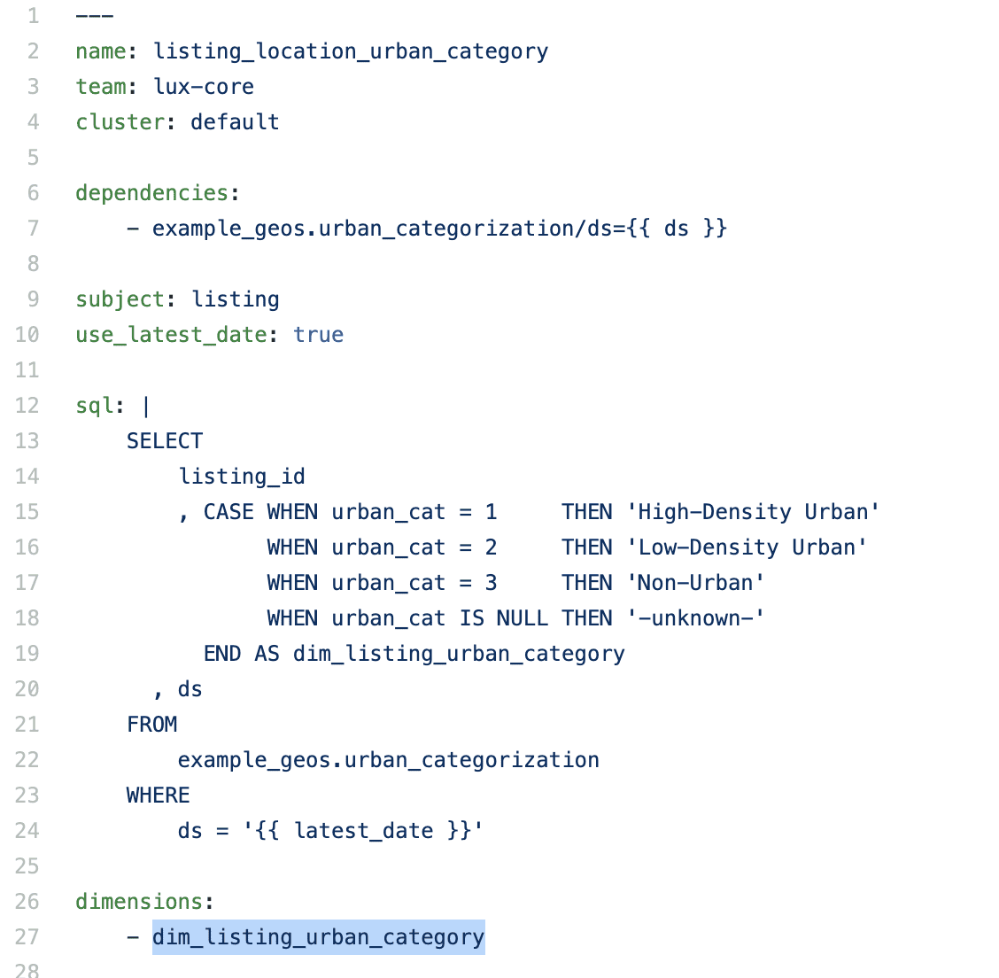

- 분석가는 dimension source에 새 dimension을 추가했다

분석가는 몇개 전사적으로 사용하는 covid-19 효과 트래킹을 위해 쓰이는 dimension set에 새 dimension을 포함시켰다.

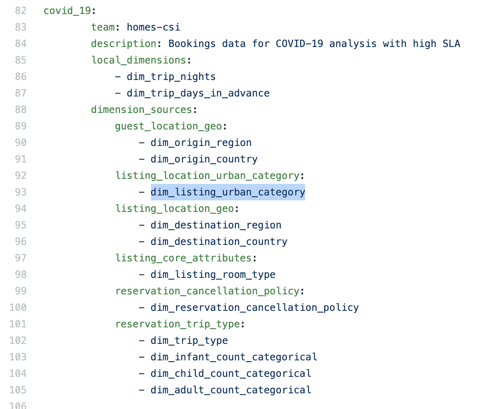

- 분석가는 다른팀이 오너인 COVID SLA dimension set에 새 dimension을 추가했다

Minerva에서 새 dimension을 검증하기 위해, 분석가는 prototyping tool을 사용하여 새 dimension에 대한 샘플 데이터를 뽑아서 추가한 config가 valid하고 data도 정확하게 나오는것을 확인했다.

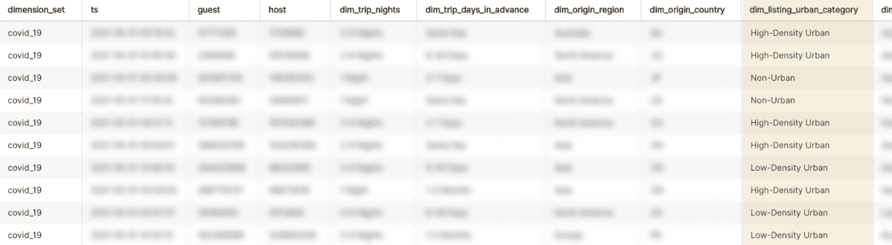

- prototyping tool을 활용해 몇분이면 변경한 config에 대해 샘플결과를 볼 수 있다

data를 검증하고 분석가는 모든 `listing` metadata를 관리하는 팀에 PR을 올렸다. PR은 실행로그, 추정된 연산비용, 리뷰를 쉽게 하기 위한 샘플 data link가 자동으로 붙게된다. approve를 받으면 변경사항을 staging environment에 merge한다.

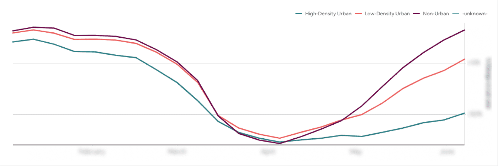

- 결과로 여행이 반등함에 따라 수요 변화를 볼 수 있었다.

새로 생성된 dataset을 활용해서 회사는 유저행동에서 위와같은 수요 이동을 트래킹하기 시작했다. 또한 주요 성과 지표에대한 변경사항은 유저의 새 여행 패턴에 맞게 product page를 개편하는 계획을 만들었다.

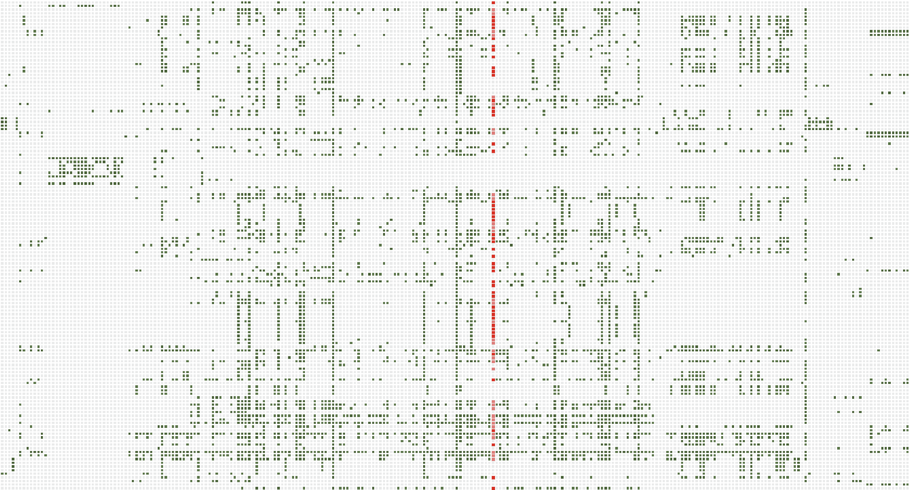

- 새 dimension source (빨강색)이 전체 event source(Y축)에 적용되어있다

위의 작업을 통해 분석가는 새 dimension을 정의하고, 기존에 존재하는 metric에 추가하고, domain owner로부터 approve를 받고, 며칠내에 많은 주요 dataset에 반영될 수 있었다. 모든 작업은 yaml config에 몇십줄을 추가하는것만으로 끝낼 수 있었다.

## Closing

