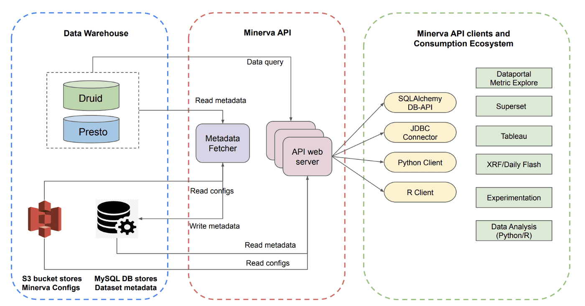
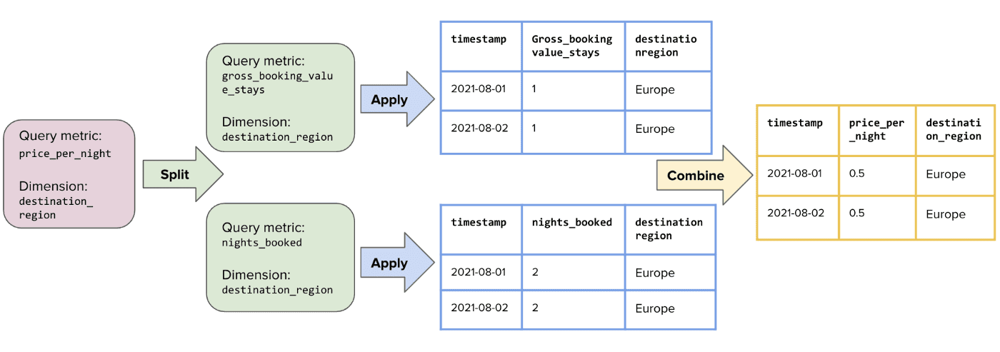
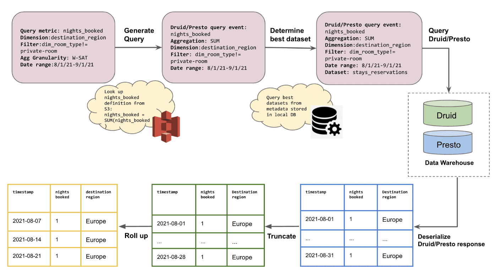
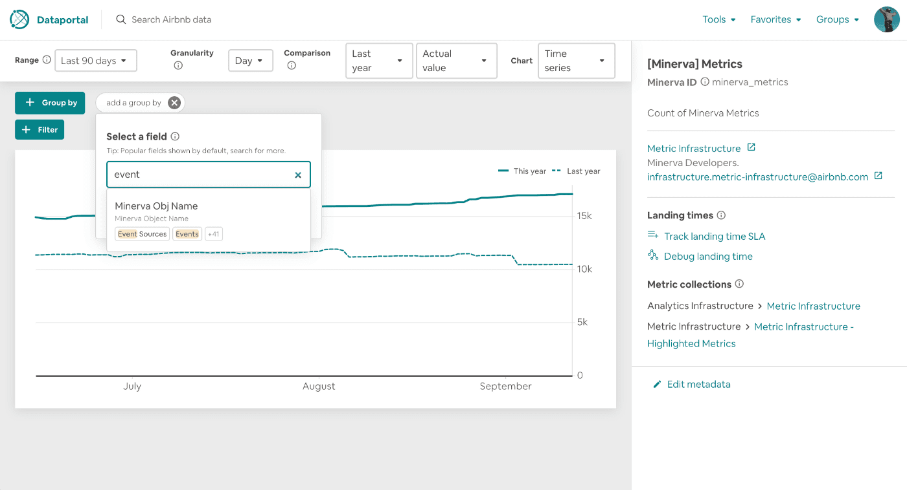
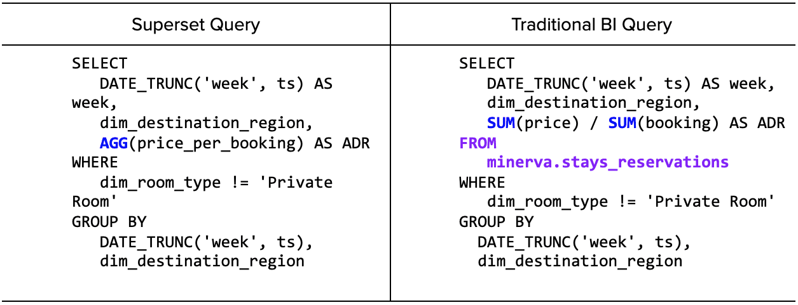
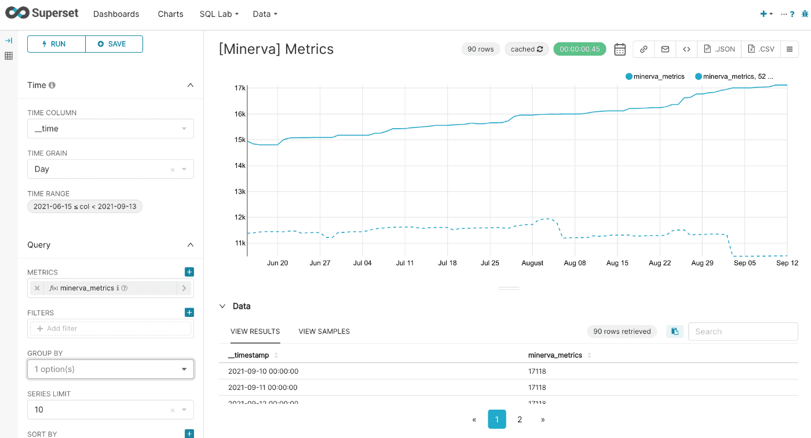
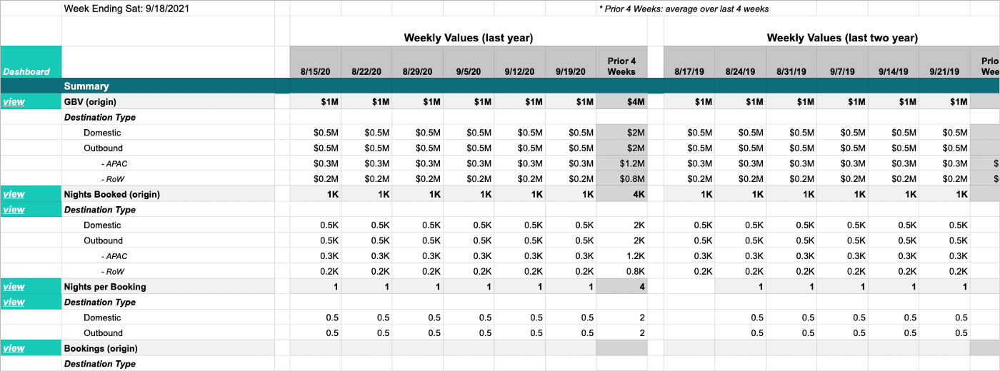
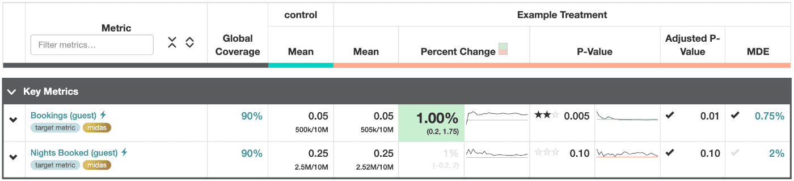
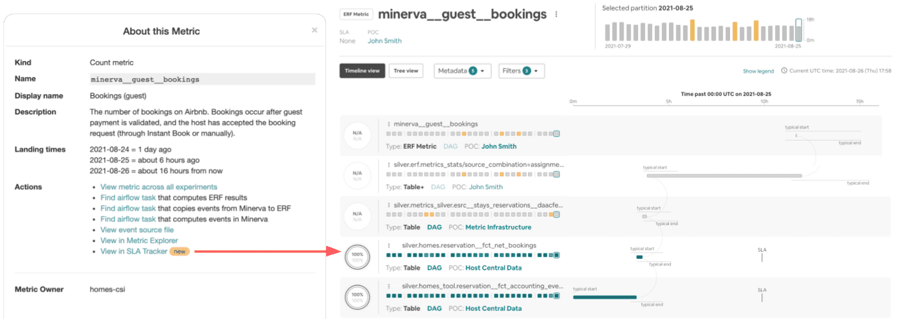

# Minerva 3 - Consistent Data Consumption

## Introduction

이번 포스팅에선 어떻게 미네르바가 유저들이 data consumption을 단순하게 할 수 있도록 만들어줬는지 소개할 것이다. 특히 Minerva API(a unified metric layer)가 어떻게 각 유저들에게 맞춘 다양한 data consumption을 제공하는지 보여줄것이다.

## A Metric-Centric Approach

data consumer가 data를 이용하여 business question을 만들때, 일반적으로 metric과 dimension의 관점에서 생각한다. 예를들면 business leader는 장기 숙박(dimension)에 따른 예약 비율(metric)을 궁금해한다. 분석가는 쿼리할 테이블들(where)을 찾고 조인/필터를 하여(how), 결과를 aggregation(how)한다.

많은 BI tool들은 이러한 작업들을 추상화하려 하지만, 여전히 대부분의 data-serving logic은 유저가 where와 how를 찾아내는데에 달려있다. Airbnb는 더 나은 유저 경험을 만들려고 노력했다. 유저는 단순히 metric과 dimension cut에 대한 질문을 던지면, where나 how에대한 고려없이 결과를 볼 수 있도록 말이다. metric-centric approach라는 비전은 어려운 엔지니어링 문제로 다가왔다.

### Challenge One: The "Where"

모든 data warehouse에서 data는 table로 구성된다. 즉 질문에대한 답을 위해 BI tool은 metric과 dimension을 physical table과 연결해야 한다. 그러나 같은 metric과 dimension 조합에 대해 답을 제공할 dataset이 많을 수 있다. 이 table들은 서로다른 data quality와 correctness guarantee를 가지고있어 data를 제공할 적절한 table을 선택하는것이 힘들어진다.

### Challenge Two: The "How"

where뿐만아니라, how를 담당하는 data serving logic에도 여러 뉘앙스가 있다. 처음엔 여러가지 metric type들이 있다

- simple metric은 한개의 event로 구성되어있다. (예: bookings)
- filtered metric은 dimension value에 따라 필터된 metric이다. (예: bookings in china)
- derived metric은 한개 이상의 non-dervied metric으로부터 생긴다. (예: search-to-book rate)
- 많은 metric은 additive하기도 하고, (예: bookings)
- 다른 많은 metric은 additive하지 않기도 하다. (예: count, distincts, percentiles, point-in-time snapshot은 각 이벤트를 단순하게 합쳐서 계산할 수 없다)

모든 시나리오에 맞추어 다양한 metric type을 일관적으로 계산하는것은 큰 어려움이다.

### Challenge Three: Integration With Downstream Applications

 마지막 문제점은, data-driven decision을 하기 위해선 data는 다양한 context, application, tool에 사용되어야 한다. metric이 더 널리 퍼지고 중요해질수록 더 많은곳에서 사용할 가능성이 크다. 예를들어 gross booking value (GBV), nights booked, revenue는 Airbnb에서 가장 빈번하게 사용되는 metric이다. 이 metric들은 비즈니스 성과를 트래킹하거나, randomized controlled experiments를 위한 guardrail metric(떨어져서는 안되는 metric들, app crash, unsubscribe rate등) 계산, ML feature로 사용된다. 유저가 적절한 방식으로 사용하도록 contextual information을 주면서 다양한 usecase에 이런 metric들을 서빙하는것또한 매우 중요한 챌린지이다.

### Our Solution

Airbnb는 upstream data model과 downstream application의 interface 역할을 하는 metric service layer인 Minerva API를 만들어서 이런 챌린지들을 해결했다. Minerva API에서 downstream application은 data가 어디에 저장되어있는지나 어떻게 metric이 계산되는지에 대한 인지 없이 일관적이고 정확하게(consistently and correctly) data를 서빙 할 수 있다. 중요한점은 Minerva API는 "what"과 "where"를 연결하는것을 통해 "how"의 역할을 한다.

## Minerva API

Minerva API Server는 API webserver와 metdata fetcher application으로 구성되고, Client Library들은 Superset, Tableau, Python, R에 연결된다. 이런 컴포넌트들은 downstream application에  native nosql과 sql metric query를 제공한다.

- Minerva API는 consumer와 data asset간의 interface 역할을 한다



### Metadata Fetcher: Abstracting the "Where"

유저는 Minerva에게 "where"에 대한 인지 없이 metric과 dimension cut을 물어볼 수 있어야한다. data request가 들어오면, Minerva는 request를 처리하기 위해 어떤 dataset을 사용하는지 결정하는 로직이 중요하다.

내부적으로 Minerva는 최적의 data source를 선택하기 전에 몇가지 factor를 고려한다. 이중 가장 중요한것은 data completeness이다. 즉 query를 서빙하기위해 선택된 data source는 유저의 query request에 대한 모든 컬럼들을 포함해야 하고, query request가 필요로하는 time range를 커버해야 한다.

이 목표를 위해 Airbnb는 15분마다 data source metadata를 fetch하고 MySQL에 캐싱하는 Metadata Fetcher 서비스를 만들었다.

1. Metadata Fetcher는 Druid에 있는 모든 valid Minerva data source 리스트를 얻기 위해 주기적으로 S3에서 Minerva configuration을 가져온다.
2. 각 data source마다 Druid broker를 찔러서 data source의 이름과 연관된 metric, dimension list를 가져온다. 또한 Druid broker로부터 missing data를 확인하기 위해 min date, max date, count of distinct date도 가져온다.
3. 새 information들을 가져올때마다 source of truth를 유지하기 위해 MySQL에 업데이트한다.

Metadata Fetcher를 통해 언제나 가장 적절한 data source를 사용하여 data request를 처리할 수 있다.

### Data API: Abstracting the "How"

2021년 8월에 각 주마다, destination region 별로 Average Daily Price(ADR)를  private room을 제외한 trend를 보려고 한다고 생각해보자, 예시 request의 spec은 아래와같이 나온다.

```json
{
	"metric": "price_per_night",
	"groupby_dimension": "destination_region",
	"global_filter": "dim_room_type!=\"private-room\"",
	"aggregation_granularity": "W-SAT",
	"start_date": "2021-08-01",
	"end_date": "2021-09-01",
	"truncate_incomplete_leading_data": true,
	"truncate_incomplete_trailing_data": true
}
```

Minerva가 이 request를 받으면, data를 가져올 table을 결정하는것 뿐만아니라, result를 만들기 위해 어떻게 filter, combine, aggregate 할지도 필요하다. 이것은 data analysis에서 일반적으로 사용되는 [Split-Apply-Combine paradigm](https://www.jstatsoft.org/article/view/v040i01)을 strategy으로 사용한다.

- `price_per_night`메트릭에 대한 Split-Apply-Combine



### Step 1: Split the Request into Atomic Metric Requests

Minerva API가 query request를 받으면 subquery set을 만들어 derived metric들을 Minerva atomic metric으로 쪼개진다. 당연히 request가 Minerva atomic metric을 요청한다면 아무일도 하지 않는다.

예시: `price_per_night`은 atomic metric들에 의해 표현되는
( `gross_booking_value_stays / nights_booked` ) derived metric 이다. Minerva API는 이 request를 2개의 sub request로 쪼갠다.

### Step 2: Apply and Execute Each Subquery

Minervasms step 1의 atomic metric을 이용해 S3에 저장된 metric configuration을 활용하여 metric expression과 metadata를 extrapolate하여 subquery를 생성한다.

예시: Minerva data API는 `gross_booking_value_stays` 에 대해 metric definition을 보고 SUM aggregation임을 확인한다. `nights_booked` 도 마찬가지다. 두개 request에 대해 `dim_room_type != "private-room"` 필터를 추가한다.

- Average Daily Price(ADR) metric에 대한 Split-Apply-Combine 적용



Minerva API는 각 atomic metric에 대해 subquery가 생성되면 Druid나 Presto로 쿼리를 던진다. 만약 resource limit에 걸리면, time range를 쪼개서 쿼리하여 결과를 합친다. 또한 aggregation granularity에 맞게 dataframe을 rolling하기 전에 incomplete leading/trailing data를 잘라낸다

예시: 8월 29~31일이 일~화 요일이면 이 날짜들을 잘라냄

### Step 3: Combine Atomic Metric Results Into a Single Dataframe

각 atomic metric에 대해 dataframe들을 roll up하면, timestamp 컬럼을 이용하여 atmoic metrice들에 대한 result dataframe을 한개의 single data frame으로 만든다. 마지막으로 post-aggregation과 ordering, limit등을 적용하고, json format으로 serialize하여 최종 결과를 리턴한다.

## The Data Consumption Experience

Airbnb 내의 다양한 data consumer를 염두에 두고, 다양한 persona와 usecase에 적합한 툴을 만들기 시작했다. Minerva API를 통해 consistent, coherent한 data consumption을 제공하는 다양한 user interface를 만들었다, 첫번째 포스팅에서 말한것처럼, 4개의 주요 endpoint가 있으며 각각은 data consumer들에게 다른 툴들을 지원한다.

- Data Analysis: Python, R 사용, 대부분 advanced data analytics 목적
- Data Exploration: [Superset](https://medium.com/airbnb-engineering/supercharging-apache-superset-b1a2393278bd##c576), Tableau 사용, insight를 보고싶은 데이터에 대해 잘 아는 분석가들이 사용
- Reporting: XRF(eXecutive Reporting Framework), 비즈니스의 현재 상태를 보기위한 C-level
- Experimentation: ERF(Expermentation Reporting Framework), A/B테스트를 수행하려는 data scientiest, engineers, PM

이 기능들을 만들때 언제나 consistency, flexibility, accessibility에 대해 고려했다. Metric Explorer는 비개발직군의 사람들이 사용하므로 flexibility보단 consistency와 accessibility에 집중했다. Metric Explorer는 유저가 잘못 행동하지 않도록 막고, paved path만 사용하도록 제한하는등 엄격한 guardrail을 강제했다.

R, Python client는 data scientist들이 주로 사용하므로 flexible하게 만들었다, 유저는 custom analysis나 visualization을 위해 client API를 복잡하게 사용할수도 있다.

### Integration with Metric Explorer

data에대한 전문성없이 어느누구나 사용할수있게 만들어진 Metrice Explorer는 data를 활용하여 결정을 내릴 수 있도록 도와준다. 많은 target audience가 있으므로 Metric Explorer는 flexibility보단 accibility와 consistency에 집중했다.

- Metric Explorer는 high level business question에대해 답을 찾기 위한 비개발직군 사람들이 사용하기 좋은 툴이다



Metric Explorer의 모든 metric, dimension과 관련 metadata는 Minerva metric repository에서 데이터를 퍼담은 ES의 데이터를 사용한다. Metadata는 오른쪽 사이드바에 보여진다.

유저가 group by나 filter같은 기능을 사용할때, Metric Explorer는 ranked order로 dimension들을 보여주어 business context를 모르는 유저들도 dimension value에대해 미리 알 필요 없이 쉽게 drill down할 수 있다.

유저가 data를 잘라볼떄 Minerva API는 자동적으로 어떤 조합이 valid한지 결정하고 보여준다. metric question의 source가 되는 physical table에 대한 인지 없이도 유저는 질문에 대한 답을 찾아갈 수 있다.

### Integration with Apache Superset

Superset은 좀더 data를 복잡하게 쪼개어보고싶은 유저들이 사용한다. Superset은 Airbnb에서 만들어져서 전사적으로 사용되고있음을 감안하면, Minerva가 널리 사용되기 위해 Superset같은 SQL-like integration을 제공하는것이 필요헀다.

Minerva API로 만들어진 많은 앱들이 RESTful API를 통해 통신하지만, Superset과 Tableau같은 BI tool을 위한 interface는 더 복잡하다. 일반적으로 BI tools은 HTTP request보단 SQL을 사용한다. 즉 Minerva API도 OLAP query structure를 따르는 SQL-like interface를 제공해야했다. 이런 interface를 만들기 위해 [SQL parser](https://pypi.org/project/sqlparse/)를 만들었고, SQL parser에서 AST로 변환한뒤 validate 후에 HTTP request로 바꾸었다.

또한 client, server간 database wire api를 정의하는 [Apache Calcite Avatica](https://calcite.apache.org/avatica/)를 활용했다. Minerva API는 Avatica HTTP server가 되고, superset에서는 SQLalchemy dialect driver, Tableau에서는 avatica가 제공하는 JDBC connector를 통해 client를 만들었다.

tool안에서 custom business logic이 구현되는기존 BI tool과 다르게, Minerva는 AGG라는 metric function을 통해 모든 로직을 통합하고 난독화시켰다.



왼쪽 쿼리에서 유저는 metric이 어떤 테이블에 있는지, 어떤 aggregation function을 써야 적절한지 알 필요가 없다. 디테일한 것들은 Minerva안으로 숨겨져있다

마지막으로 Minerva엔 12000개의 metric과 5000의 dimension이 있어 모든 metric-dimnesion 조합이 존재하진 않는다. 예를들어 host 지역에따른 active listing은 있지만, guest가 어디서 왔냐에 따른 listing은 존재하지 않는다. 따라서 적합한 metric-dimension 조합만 왼쪽 pane에 표시된다. 이는 data에 대해 찾아가는 부하를 줄이고 간소화시켰다.



### Integration with XRF - eXecutive Reporting Framework

1편에서 말한것처럼 XRF는 c-level을 위해 간결하면서도 high-fidelity인 businiess critical report를 생성해야한다. 이 framework는 Minerva에서 구성되고 Minerva API를 통해 동작한다.

- XRF는 반복 수작업을 자동화하여 높은 신뢰도의 리포트를 표준화시켰다



XRF report를 만들려면 유저는 reporting config를 정의하고 필요로하는 business metric, dimension cut, global filter를 설정한다. 또한 유저는 metric이 어느 aggregation(MTD, QTD, YTD)로 계산되어야하는지, growth rate (YoY, MoM, WoW)등 도 설정한다. 이 config가 만들어지면 Minerva API는 aggregation을 수행하고 report를 만들어낸다

XRF의 data output은 Google Sheet로 생성된다. XRF를 활용하여 일관적인 presentation을 만들어낼 수 있었다.

### Integration with ERF - Experimentation Reporting Framework

실험 usecase는 metric이 start point가 되므로 특별한 케이스이다. 적절한 인과 추론을 하기 위해 통계적인 실험 결과 비교에 사용되기 전에 metric은 experiment assignment data와 join되어야한다.

Minerva는 raw event를 ERF로 제공한다. analysis나 randomization 단위에 따라 Minerva data는 다른 subject key를 활용하여 assignment log와 join되어 각 event에 연결된 subject와 experiment group이 붙도록 한다. 그 다음 means, percent changes, p-value 같은 Summary statistics가 계산되고 ERF scorecard에 표시된다.

- ERF scorecard는 실험에대한 summary statistics를 보여준다



또한 Experimentation UI는 연관된 Minerva metadata도 보여준다. 유저는 Minerva event에대한 description과 owner등을 볼 수있다. ETA가 overlay된 lineage view에선 유저는 ERF metric에대한 data timeliness를 볼 수 있다.

- ERF는 data lineage와 timeliness를 보여주는 SLA tracker 링크를 보여준다



Minerva와 다양한 integration은 유저가 reporting에서 metric을 쉽게 추적하고, 실험으로 인한 movement를 확인하고, 예측되지 않은 변경사항들을 파악한다. 이 모든 것이 data가 correct하고 consistent한 확신이 있기때문에, insight를 도출하는데 쓰는 시간을 크게 줄이고, data에 대한 신뢰도를 높이며, data driven decision을 만드는데 큰 도움이 된다.

