{{ page.description }}

# Democratizing Metrics at Airbnb: Minerva 2.0 and Beyond

## Minerva 1.0 Challenges
(스샷의 화질이 안좋은건.. 영상화질이 안좋기때문)
### Precomputation

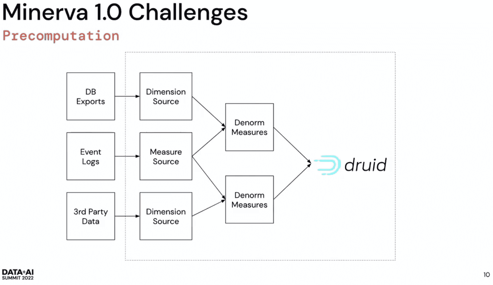

### Denormalization

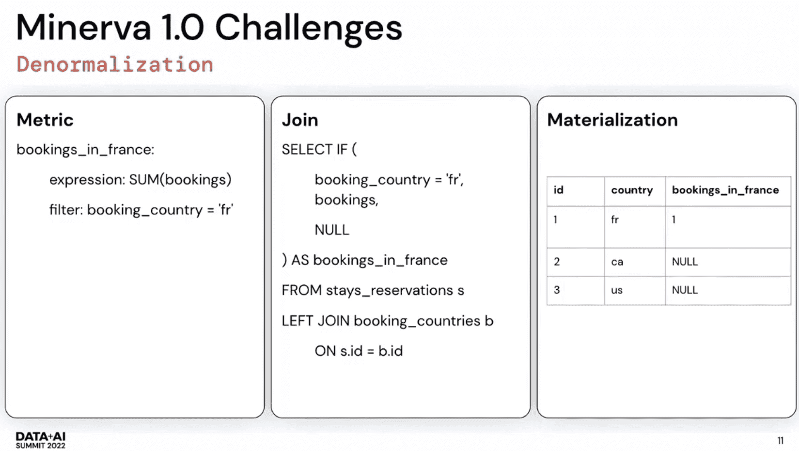

denormalize를 했던 이유

druid가 broadcast join을 할때 right side(dimension)이 무조건 memory에 들어가야만 한다

### Cubing

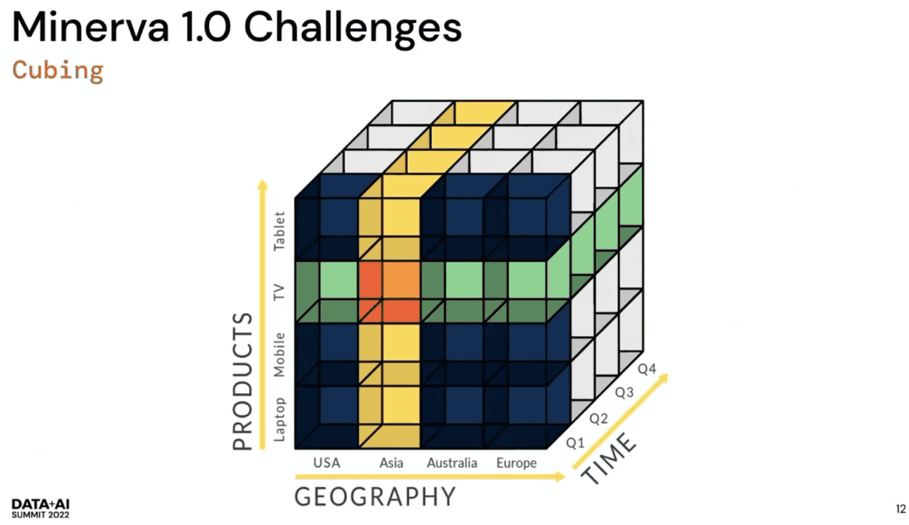

druid의 roll-up feature를 활용했다. druid는 모든걸 precompute해두어 쿼리속도는 빠르지만 high cardinality일때 exponential cost가 필요하게 된다

### Precomputation is inflexible

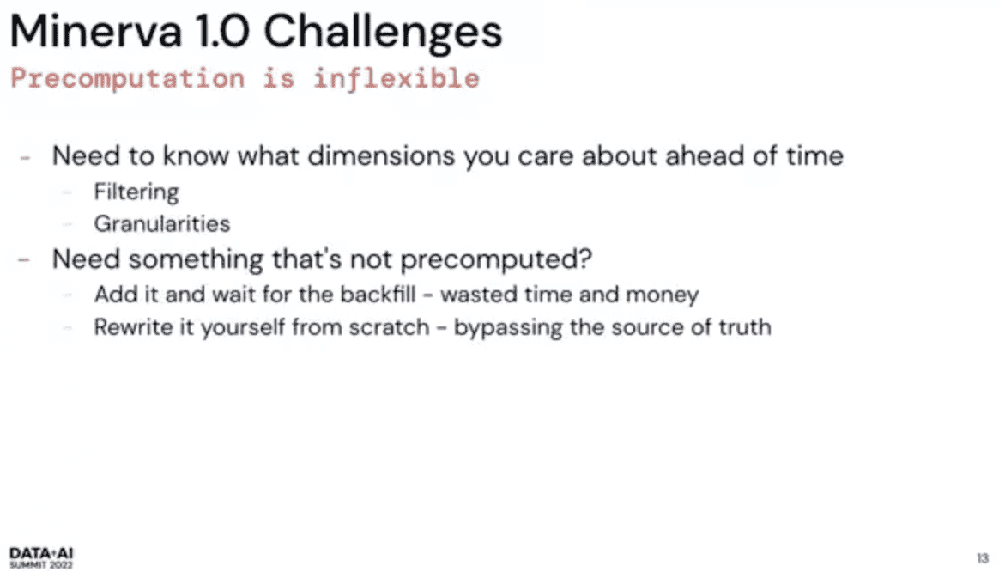

뭔가를 하기전에 다 precompute해야만 함. analysis라는게 이것저것 들여다 봐야 하는건데 맞지 않음. 
minerva에 추가하면 되는건 맞는데, 며칠동안 backfill되고 consistent한지 확인된뒤에야 쓸 수 있음. 
minerva는 multi tenant이므로 모든 숫자가 맞아야지만 보여줌
backfill은 돈도 털리고 시간도 버린다. 누군가는 backfill을 기다리기 싫어서 다시 맨바닥부터 만들게 되니 SSOT를 못지키게 됨

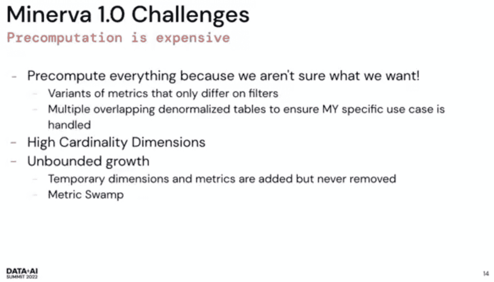

내가 원하는걸 미리 알 수 없으니 99%의 precomputed data는 실제로 쓰이지 않게된다.

같은 metric에 대한 아주 많은 variant가 생긴다(bookings in china, bookings in france, …). 어떤 cut에 대해 알고싶어하고 이런것들을 predefine해야만 한다.

denormalization은 exponential cost가 든다. 모든 dimension을 한 테이블에 넣지만 그중 일부 subset만 필요로 한다.

유저들은 서로가 필요로하는것만 “predefine” 하고, 지우지 않으니 minerva는 무한정 커지게된다. governance가 있고 cleaning을 해도 계속 커진다.

## Minerva 2.0: Flexibility and Performance

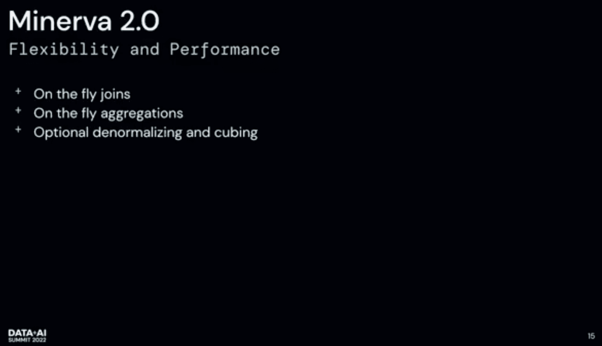

 user에게 성증 저하 없이 fliexibility를 주는게 큰 목적이다.

- On the fly joins
- On the fly aggregations (preaggregation 안함)

join, aggregation은 비쌈. 따라서 denormalizing, cubing을 옵셔널로 지원. 어떤 dashboard가 매우 짧은 latency를 요구하고 cost가 중요하지 않다면 쓸 수 있다. 

### On the fly joins and aggregations

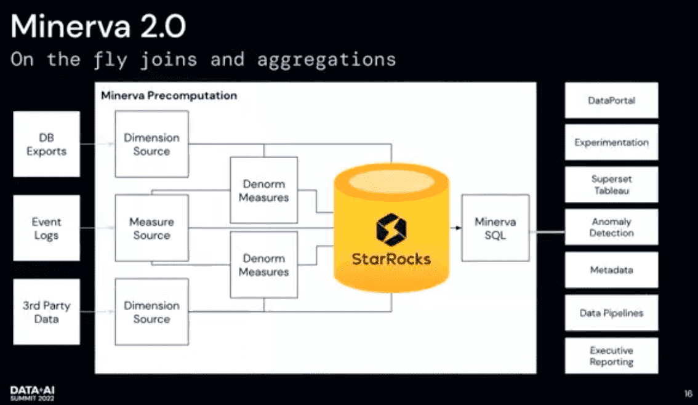

- Druid에서 StarRocks로 전환
    - StarRocks: MPP Platform, kappa와 비슷한느낌?
    raw event에 대한 full query를 실행하는것에 집중함
    adhoc으로 large data set join 가능
    druid의 pre-aggregated query와 비슷한 시간으로 aggregation가능 (ㄷㄷ)
    colocation을 통해 join할때 shuffle이 필요없는 구조
    cost optimizer로 한 measure source에 많은 dimension을 붙일때 어떤 순서로 join해야 성능이 좋아지는지 계산해서 유저가 join ordering을 하지않아도됨
- denormalized measure말고, raw dimension/ measure source도 ingest함
- druid ingestion에서 Minerval SQL로 전환
MinervaSQL로 StarRocks말고 Druid, Presto, Spark in S3 데이터도 쿼리가능

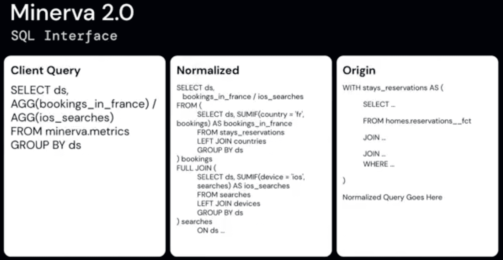

Minerva 1.0에서는 JSON REST API 였음
SQL은 JSON보다 user-friendly하고, 많은 BI tool이 SQL로 동작함

왼쪽의 Client Query를 던지면, minerva가 normalized query로 바꿔줌 (AGG(booking_in_france)가  subquery가 된듯)
만약 measure source를 직접참조하면 raw data도 바라보게됨 (Origin)

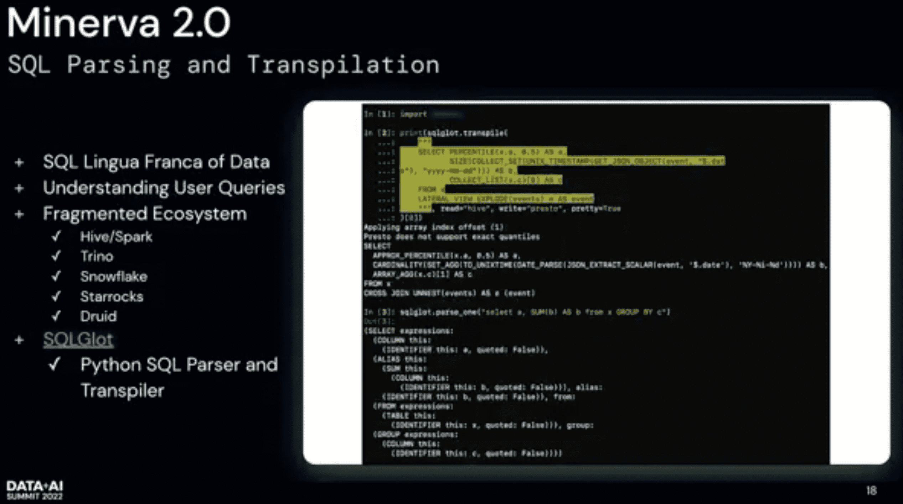

SQLGlot: SQL transpiler (dialect변환느낌)
유저가 hive query를 presto에서 돌리면 동작하지 않을것임 SQL glot은 hive syntax를 presto syntax로 바꿔줌.

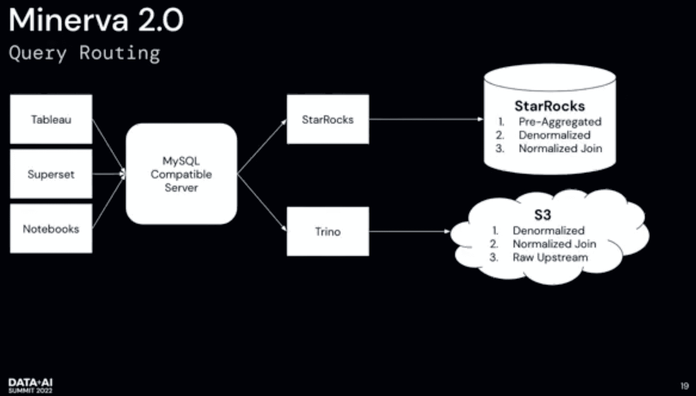

Tableau, Supertset을 쓰는 유저들은 결과를 빠르게 보고싶어한다. notebook을 쓰는 data scientist들은 latency는 크게 중요하지 않고 복잡한 쿼리를 돌리거나, 많은 데이터를 퍼가서 ML model을 돌린다.
minerva 2.0은 쿼리를 받아 유저들이 원하는 요구사항을 이해하고 routing한다(뭐대충 client 종류보나..). 
tableau, superset을 쓴다면 starrocks에서 빠르게 전달하고 preaggreagation을 쓴다(이건 미리정의해야겠지만)
data scientist는 aggregate가 필요없고 모든 raw data를 받는게 중요하다. usecase에 따라 spark/preseto로 route한다.

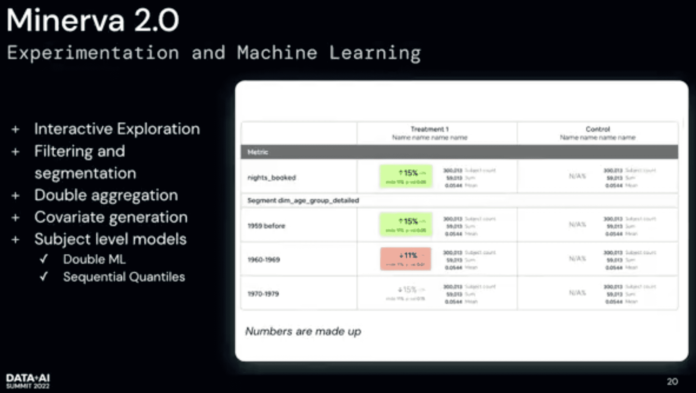

Minerva는 아까도말했지만 druid에서 퍼오지 않고, SQL을 쓴다.

exprementation은 business analytics에서 많이 다른 면을 가지는데, “어제 얼마나 많은 booking이 있는가”가 아니고 더 robust한 stat이 필요하다. randomization unit단위 aggregation을하고 유저단위 avg를 내리는등 double aggregation이 들어간다. minerva는 cmoplex sql을 작성하면 된다.
convariate generation도 지원함, 이전 experiment activity에 기반한 유저를 찾는등도 지원. (예시 heavy broker인 유저가 이전에도 heavy broker인지 확인), (난잘모르겠다 ㅋㅋ)

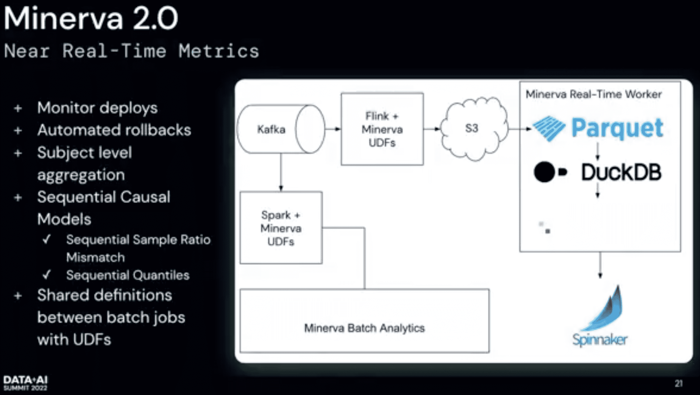

 real time metric

배포를 빈번히 하고, crash를 보고싶지않고, 나쁜 UX를 주기 싫다.
realtime으로 배포하고 모니터링하고 자동화된 rollback을 원한다
배포가 성공했는지는 비즈니스에서 중요시하는 metric을 본다 datadog등으로.. 하지만 복잡한 쿼리를 지원못하고, 우리 metric들 대다수는 bot같은 skew가 존재한다.
전체적으로 얼마나 많은 crash가 발생했는가와, 특정 crash를 얼마나 많은 유저들이 겪었냐는 아주 다른 질문이고, 더 stable해야한다
near realtime metric pipeline을 만들어서 rollback 할지말지를 결정해준다.

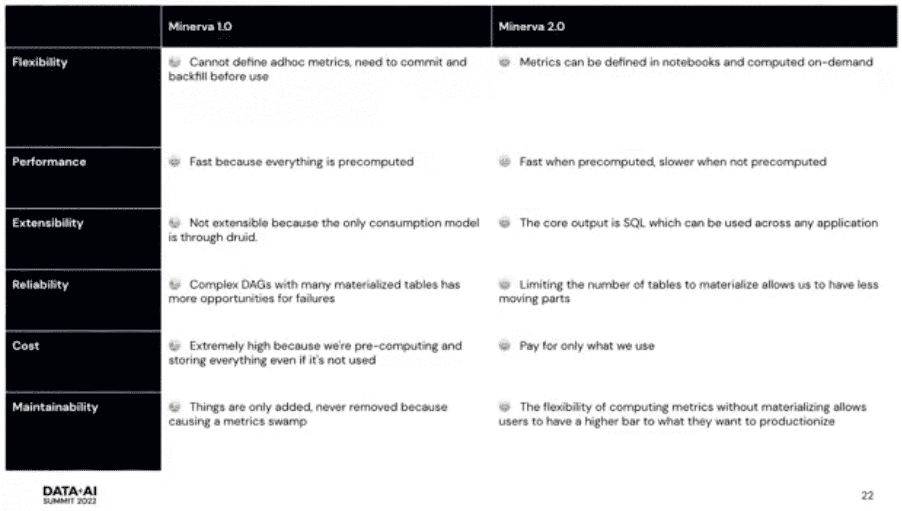

2.0은 ingestion tool이 아닌 sql generator이다.

