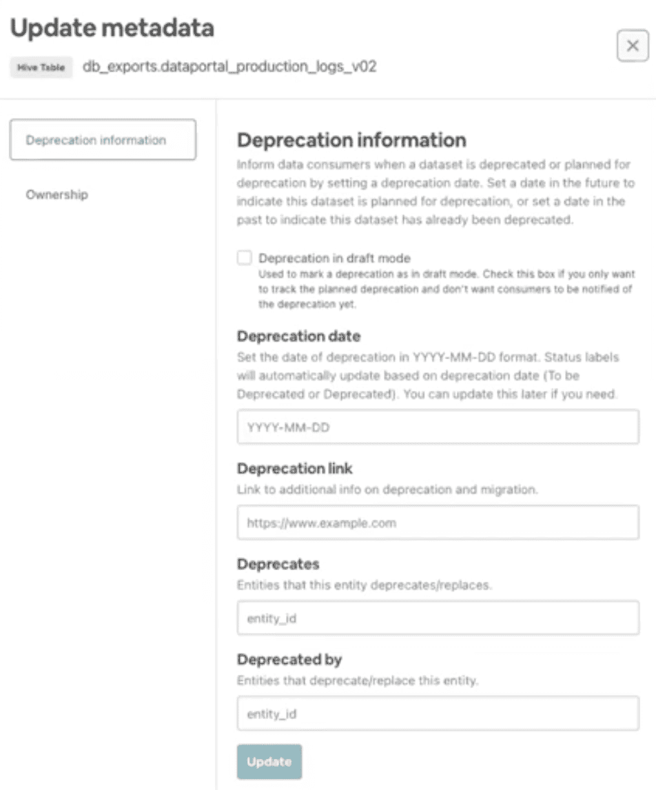

{{ page.description }}

# Toward High Quality Data

영어자막 [https://drive.google.com/file/d/1cGTbBZViB42vlTBR2YZRlejaX4QSZQit/view?usp=sharing](https://drive.google.com/file/d/1AB6E4vAM7tKIwNo-LASvsJ-Eyl-6TZVD/view?usp=sharing)

원본 [https://fb.watch/8BTQ2zVGvv/](https://fb.watch/8BTQ2zVGvv/)

(앞내용과 중복인게 많아서 대충써놨다.)

## Airbnb's Data Quality Initiative

### What is Data Quality

- Accuracy
- Completeness
- Consistency
- Timeliness

### Symptoms of Poor Data Quality

- dataset에 버그가 있음 - data에 대한 신뢰도가 낮아짐
- data가 business의 요구사항을 보여주지 못함
- Poor SLA performance - data가 없거나 제때 data가 들어오지 않음
- data에 문제가 생겼을때 누구에게 물어야할지 모름

### History of Airbnb's Data Warehouse

- 2020~2013: data scientiest 4명, mysql에서 분석함
- 2014: DE 4명 채용, star schema도입
- 2015~2016: DE team이 12명이 됨, product team에 DE 포함시킴
- 2017~2018: decentralized DE, software engineer들이 data pipeline까지 해야할것 같다는 생각이 들어 software engineer들에게 data engineering을 교육시킴
- 2019: critical data가 유지보수가 잘안되고, SLA miss가 발생했다. data에 대한 신뢰도가 낮아짐

### Key Problem Areas

- **Organization**: data science와 software engineering 사이의 역할이 모호함. 누가 data pipeline을 관리해야하는가? data manage를 하는것에 대한 책임이 두번쨰로 밀려남(다른것들에 비해). 따라서 오너십도 모호해짐
- **Architecture/Best Practices**: 시간이 지날수록 data model이 복잡해짐. data pipeline에 delay가 점점 생김, 잘 알지못하면 디버그가 어려워짐. 각 팀마다 각각의 방식으로 pipeline을 구현하여 통일시키기 어려움
- **Governance**: quality, accountability에대한 기준을 강제하는 절차가 없음

### The Data Quality Initative (Rebuild Airbnb's Foundational Data)

 Tenets

- Clear Ownership
- Data always meets SLAs
- High quality standard
- Data is routinely validated for correctness
- Well-documented and easily discoverable

### How did we get there?

#### **Organization**

2019년

- **Software Engineer**: log data를 만들고, data warehose table과 pipeline을 관리하였음
- **Data Scientist**: 거의 모든것을 다했음

현재

- **Software Engineer**: log, production data 생성
- **Data engineer**: product team에 속해있고 Software Engineer와 협업함
대부분 table과 pipeline을 관리함
- **Analytics Engineer**: DE와 기존 data science의 간극을 메우는 역할. business concept과 data engineering requirements를 맞춤, metric 표준화, dimension 정의
Analytics Engineer 통해 data에대한 모호함을 없애게 됨, Data Scinetist가 가졌던 일들을 많이 줄일 수 있게됨
- **Data Scientist**: 본래의 일에 집중

Building the Community

- Accelerated Hiring
- Communication Channels
- Monthly All Hands
- Quaterly Data Quality Forum
- Data Warehouse Archituecture Working Group
- Data Engineering Leadership Group

#### Architecture / Best Practices

- **Data Model**
    - Star schema일때 디펜던시가 엮여있었음 data modeling 작업은 어려웠다. dataset간의 디펜던시를 최소화하는 normalize를 진행
    - Data는 logical subject area단위 그룹으로 묶이고(data mesh), 각 subject area는 한 팀에서 오너십을 가짐
- **Technical Standards**
    - Pipeline은 Spark나 Sputnik(Spark wrapper)에서 동작해야 함
    - Integration Test, DQ check, Anomaly detection, SLA, Page duty
- **Documentation**
    - 모든 dataset은 문서화됨

#### Governance

- **Midas**
    - Midas process를 거친 데이터는 certified됨
- **Bug, SLA tracking**
    - bug, SLA에 대한 리포팅 기능 향상
    - bug, SLA에 대한 주간리뷰
    - team level metrices
- **Data Strategy Team**
    - 분기단위 모든 팀과 Midas meeting
    - certified data consumption을 트래킹하기 위한 metric 개발
    - Legacy data에서 Midas data로 migration하기위한 툴 생성

## Powering End-to-End Quality

### Midas Process

### The Key Step: Data Model Design Spec

- Metric Definition, Data Architecture등이 들어간 technical documentation
- 구현을 위한 Technical Contract
- 표준화된 subsection이 들어간 문서 템플릿
- Documentation library - 쉽게 찾아볼 수 있음

#### 예시: Active Listings

### Skills Required to Up-level Data Quality

- Data systems design
- Data architectures & data pipeline implementation
- Domain expertise on business metrices and dimensions
- Expertise on metric design practices

### Analytics Engineer

- **Minerva Experts**: ****Design, implement, validate, maintain metric and dimension definitions
- **Data Asset Owners**: Create and support broadly-used business-critical dashboards, reports, datasets
- **Data Tool Power Users and influencers**: Represent data consumers in design of offline data architecture and tooling
- **Data Modeling and Domain Experts**: Translate cross-functional business needs in there domain into data models and their data assets

## Minerva - Airbnb's Single Source of Truth Metric Platform

### Data Quality

- Accuracy
- Completeness
- Consistencey
- Timeliness

### Airbnb's Warehouse Architecture

### Minerva Output

- Table
    - Accuracy Through Automation
    - Consistency Through Versioning
    - Timeliness through Staging
- Metric & Dimension
    - Consistency through Centralization
    - Timeliness through Redundancy

## Driving the Consumption of High-Quality Data: A Platform Approach

### Data LifeCycle

### Understanding consumption

위 그림에 나온것같은 정보들을 모두 수집함

### How do we driver consumption of Midas data?

1. 유저가 Midas data를 발견
2. Midas data 사용
3. old data를 deprecate

### What are the challenges for players in the data ecosystem

- Data producer
    - dataset을 새로 만들었다고 공지를해도 누가 쓰려하는지 알기어려움(대부분 무시하므로)
    - complicated, unknown dependencies
    - last-minute escalation: deprecate시켰더니 다시복구해달라함..
- Data Consumer
    - Many datasets: which to use?
    - borken dashboards, pipelines from deprecations
    - What's the replacement?

### An integrated Solution

-