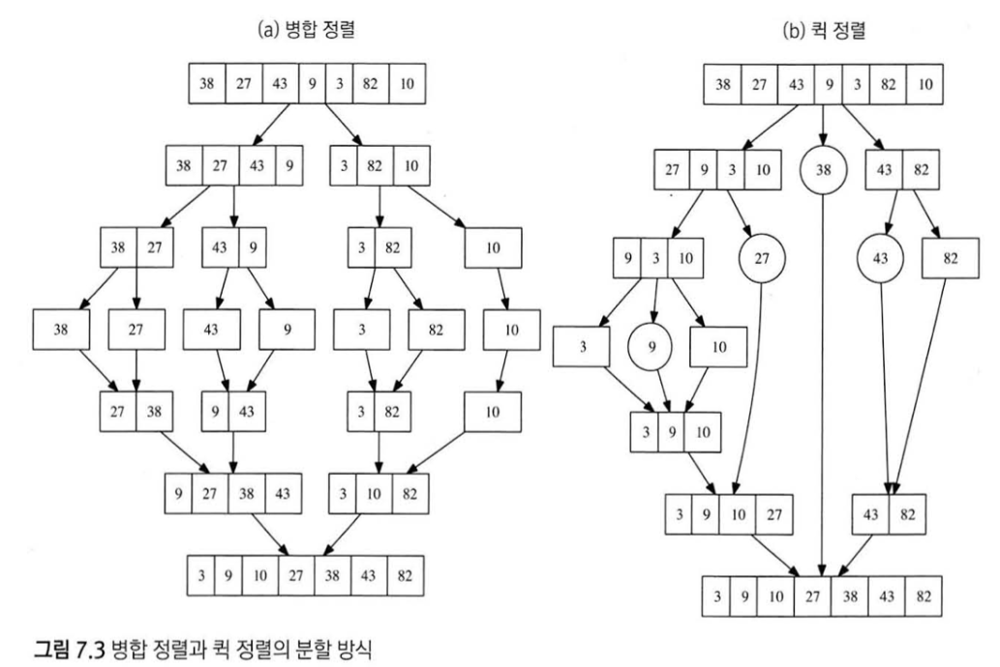

# 종만북

# 2. 문제해결 개괄

## 2.2문제 해결 과정

- 문제를 읽고 이해하기: 이해를 제대로 하지 않으면 테스트케이스를 다 해결하지 못한다, 문제 대충보고 예시 케이스보고 바로 풀려하지 마라
- 재정의와 추상화: 내가 아는 용어로 재정의해라. 그리고 문제를 단순하게 추상화해라.
- 계획 세우기: 어떤방식으로 문제를 풀지 결정하고, 사용할 알고리즘,자료구조를 선택해라. (2.3절)
- 계획 검증하기: 요구조건에 맞춰 수행되는지 검증하고, 수행에 걸리는 시간/메모리가 제약조건내에 들어가는지 확인해야 한다 (4장, 5장)
- 계획 수행하기: 코딩 (3장)
- 회고하기: 자신이 문제를 해결한 과정을 돌이켜보고 “개선”하자. 문제를 한번 보는것보다 두번볼때 더 효율적인 알고리즘을 찾거나, 아니면 알고리즘을 유도하는데 더 직관적인 방법이 떠오를 수 있다. 가장 좋은방법은 문제를 풀때 코드와, 경험을 남겨두고, 해법을 찾는데 가장 결정적이었던 깨달음을 기록해두자.
틀렸을 경우 오답의 원인을 적어두자. 이런 과정을하면 해법을 찾는 패턴이 보이고, 자주 틀리는부분을 빠르게 파악할수있을거다. 다른사람코드보고 분석하는것도 좋다

### 문제를 풀지 못할때

너무 오래붙잡지말고 “내 자신이 정한 일정 시간”이 지난 뒤에는 다른사람의 소스코드,풀이를 참고하자. 그리고 풀이를 보면서 복기를 하면서 왜 이 해법을 생각하지 못했는지 고민해보자. 여러번 비슷한 해법을 보게되면 비슷한 문제를 봤을때 해법을 떠올릴수도있다.

## 2.3 문제 해결 전략

### 직관과 체계적인 접근

직관은 알고리즘이 대략적으로 어떤 형태를 가질 지 짐작할 수 있게 해준다. 직관을 발달시키기 위해선 얼핏 보기에 막막한 문제들을 해결하면서 경험을 쌓아야 한다. 막막한 문제는 체계적으로 접근할 수 있다.

### 체계적인 접근을 위한 질문들

앞에 있을수록 general하며, 뒤로갈수록 specific하다

- 비슷한 문제를 풀어본적 있는가?
이전에 적용했던 방법과 비슷하게 할 수 있다. 문제를 많이풀어야한다. 근데 문제를 많이푼다해도 비슷하다고 느끼려면 원리를 완전히 이해하고 변형할 수 있어야 한다.
철도망 위에서 두 도시를 잇는 가장 짧은 경로를 찾는문제 - 단순한 최단경로문제이다
- 한 도시를 두번 방문하지 않으면서 가장 긴 경로 찾기
- 기차를 네번 이하로 갈아타면서 가장 짧은 경로 찾기
- 역간 운행 거리중 가장 긴 구간이 가장 짧은 경로를 찾기
- 역간 운행 거리중 가장 짧은 구간이 가장 긴 경로 찾기
- 가장 긴 구간과 가장 짧은 구간의 길이차이가 가장 적은 경로 찾기
위 문제들중 어떤것은 최단경로로 풀리지만 어떤것은 풀리지 않는다. 즉 최단 경로 알고리즘을 알고있는것 뿐만 아니라 동작과정과 원리를 제대로 이해해야한다.
- 단순한 방법에서 시작할수 있는가?
brute force 가능? → 너무 복잡하게 생각해서 어렵게 푸는 실수를 예방한다. 컴은 생각보다 빠르다.
모든 문제가 brute force로 풀리진 않지만 효율적인 알고리즘은 단순한 알고리즘을 기반으로 만들어져있는게 대부분이다.
단순한 방법을 생각하는건 “효율성의 기준선을 정해주는 효과"를 만든다.
- 내가 푸는 문제과정을 수식화할수있는가?
예제 입력을 손으로 직접 해결해보기. 해결과정을 공식화해서 알고리즘을 만들 수 있고, 그렇지 않더라도 구현해야할 알고리즘이 고려해야할 것들을 생각하게 만들어준다.
- 문제를 단순화할 수 없을까?
문제의 제약조건을없애거나, 계산하는 변수의 수를 줄이거나, 다차원 문제를 1차원으로 줄일수도있다. 이런식으로 푼 뒤의 해법이 원래 문제에 대한 직관을 제공해줄수있다.
- 그림으로 그려볼수있는가?
- 수식으로 표현할수있는가?
- 문제를 분해할 수 있는가?
제약조건을 분해해서 더 단순한 형태를 갖는 조건을 만들어보자
- 뒤에서부터 생각해서 문제를 풀수있을까?
- 순서가 없는 문제에 순서를 강제할수있을까?
- 특정 형태의 답만 고려할 수 있을까?

# 3. 코딩과 디버깅

## 3.2 좋은 코드를 짜기 위한 원칙

- 간결한 코드 작성
- 코드 재사용: 여러번 호출되는 경우는 함수로 빼는게 가장 좋다
- 표준 라이브러리 공부
- 항상 같은 형태로 코딩
    - 처음엔 비슷한 해결방식을 여러가지 (while대신 do-while 등)로 써보다가, 나중에가면 이런방식이 실수를 만들게 되므로 “검증하는데 시간이 오래 걸리게 됨"
- 일관적이고 명료한 네이밍
    - `judge(y, x, cy, cx, cr)`  → `isInsideCircle(y, x, cy, cx, cr)`
- 모든 data structure를 정규화해서 저장
    - 실무에선 timezone을 utc로만 쓰는것이 가장 대표적인 예시, encoding
- 코드와 데이터 분리
    - month name list같이 const로 선언해야하는것들

## 3.3 자주 하는 실수

- 산술 오버플로우 (3.5절)
- 인덱스 오버플로우
- 일관되지 않은 범위 표현: half-open interval 사용 `[lo, hi)`
- Off-by-one error: `<` 와 `<=` 헷갈리는 케이스
- 컴파일러가 잡아주지 못하는 상수 오타
    - january를 jaunary로 쳤다던지 등 << 눈으로 검사해야한다
    - 자주 쓰이는 `% 100000007`
- stack overflow: recursion 일때
- 다차원 배열 인덱스의 순서
- 잘못된 비교 함수 작성: 이건 책 확인..
- 최소, 최대 예외: 코드마다 많이 다르다
- 연산자 우선순위
    - `b & 1 == 0` → 이건 우선순위상 ==이 먼저이므로 `(b & 1) == 0` 으로 써야한다
- 변수 초기화 문제: 전역변수 쓸때 특히

## 3.4 디버깅, 테스팅

- 코테문제들은 디버깅에 쓰기 부적합하다 (짧은코드이며, recursion은 디버깅하기 어려움)
    - 작은 입력에 대해 제대로 실행되는지 확인하기
    - assertion 사용하기
    - 코드 중간중간 결과를 출력하기
- 테스트
    - skaffold→ test set을 생성해주는 코드 자동으로 생성해서 검증하기
        - sort를 구현한다고 했을때, stl.sort와 내 구현을 비교하기
        - 실제로는 비교할 대상(stl.sort)이 없을거임
        - 그렇다면 “작은 입력에서만 동작하는 느린 알고리즘 으로 비교하기"

## 3.5 변수 범위

- 산술 오버플로우
- 너무 큰 결과 (32bit → 64bit)
- 너무 큰 intermediat value
    - 최소공배수 `lcm(a,b)` 는 a*b에 최대공약수 `gcd(a, b)` 를 나눈 값 이다
    근데 a*b가 엄청 크다면?
- 너무 큰 무한대 값
    - 무한대를 2^32 -1 로 해놓고 이 값에 1이상을 더해버리는경우 음수가 된다
- 자로형 프로모션
    - unsigned, signed를 섞어쓰면 unsigned로 가게 된다.
- 실수
    - decimal 사용
    - 오차 한도를 정해두기
    - relative error 사용 `|a-b| / max(|a|,|b|)`

# 5. 알고리즘의 정당성 증명

## 수학적 귀납법

- 단계 나누기: 증명하고 싶은 사실을 여러 단계로 나눈다.
- 첫 단계 증명: 첫 단계에서 증명하고 싶은 내용이 성립함을 보인다
- 귀납 증명: 다음 단계에서도 성립함을 보인다.

## 반복문 불변식

반복문의 내용이 한번 실행될때마다 중간 결과가 우리가 원하는 답으로 가는 길 위에 잘 있는지 명시하는 조건..?

1. 반복문 진입시에 불변식이 성립함을 보인다.
2. 반복문 내용이 불변식을 깨뜨리지 않음을 보인다
3. 반복문 종료시에도 불변식이 성립한다.

binary search의 loop-invariant

```python
# 불변식 1: lo < hi
# 불변식 2: A[lo] < x <= A[hi]
# 불변식은 이 라인에서 성립해야 한다
while lo + 1 < hi:
  mid: int = (lo + hi) // 2
  if A[mid] < x:
    lo = mid
  else:
    hi = mid
  # 불변식은 여기서도 성립해야 한다
```

위 불변식이 계속 성립한다면 마지막 줄에서

- `lo + 1 = hi`
- `A[lo] < x <= A[hi]` 가 성립한다

### **근데 불변식은 어떻게 찾는가? 찾는게 아니고 loop에 있는것을 검증하는 과정인걸까?**

assertion을 이용해서 invariant가 지켜지고있음을 확인하면 테스트할떄 빨리 알아차릴수있음

## 귀류법

원하는 조건과 반대되는 상황을 가정해서 그 결론이 잘못됐음을 증명하기, “알고리즘에선 어떤 선택이 항상 최선임을 증명하고자 할때 사용”. 선택한 답안보다 더 좋은 답안이 있다고 가정한 뒤, 그 가정이 틀림을 증명.

# 6. 완전 탐색

## 레시피

1. 완전탐색은 케이스가 나오는 경우의 수와 비례한다 (아마 같을듯). 즉 모든 경우의 수를 계산하는 time complexity가 제한시간내에 해결될수 있어보여야 한다.
2. 모든 답의 후보를 만들때 여러 선택으로 나눈다 (즉 두갈래길이라면 두 길 모두다 선택지다)
3. 길이 막혀있는 케이스같은 것은 base case이다. base case는 recursion에서 가장 먼저 처리한다

## 많이 등장하는 완전 탐색 유형

1. 모든 순열 만들기
2. 모든 조합 만들기
3. $2^n$ 가지 경우의 수 만들기

# 7. 분할 정복

분할 정복의 구성 요소

- Divide: 문제를 더 작은 문제로 분할하는 과정
- Merge: 각 문제에 대해 구한 답을 원래 문제에 대한 답으로 병합하는 과정
- Base case: 더이상 답을 분할하지 않고 바로 풀 수 있는 문제

필요조건

- 둘 이상의 부분 문제로 나누는 **자연스러운** 방법이 있어야한다
- 부분문제의 답을 조합해 원래문제의 답을 계산하는 **효율적인** 방법이 있어야 한다.

Merge sort, quick sort 비교



# 8. 동적 계획법

중복되는 부분 문제

점화식

메모이제이션 (메모이제이션을 적용하려면 참조적 투명성을 가져야 한다)

메모이제이션 구현 패턴

- base case를 먼저 처리한다
- cache에 값이 없으면 계산, 아니면 바로 리턴

메모이제이션 시간복잡도

- 존재하는 부분문제 수 x 한 부분문제에 필요한 반복문 수

동적계획법 레시피

1. **완전 탐색을 이용해 해결**
2. 중복된 부분 문제에 메모이제이션 적용

최적 부분 구조

- 지금까지 어떤 경로로 이 부분 문제에 도달했던지 상관없이 남은 부분 문제는 항상 최적으로 풀어도 상관없다

최적화 문제 동적 계획법

1. 모든 답을 만들어보고 그중 최적해의 점수를 리턴하는 완전 탐색 알고리즘 구현
2. 전체 답의 점수를 리턴하지 않고, 앞으로 남은 선택들에 해당하는 점수만을 반환하도록 부분 문제의 정의를 변경
3. 재귀호출의 인풋에 이전 선택에 관련된 정보가 있다면 (캐싱하기 용이하지 않으므로), 최대한 줄인다. 최적 부분구조가 성립한다면 이전 선택 정보를 없앨 수 있다. “가능한 한 많은 중복 부분 문제를 만드는 것”이 목표다
4. 입력이 배열이거나 문자열인 경우 최대한 바꾸는게좋다
5. 메모이제이션 적용

경우의 수 계산하기

1. 모든 답을 직접 만들어서 세어보는 완전 탐색 구현. 이때 경우의 수를 제대로 세려면 재귀의 각 단계에서 아래 속성이 성립해야 한다
    1. 모든 경우는 이 선택지들에 포함됨
    2. 어떤 경우도 두개 이상의 선택지에 포함되지 않음
2. 이전에 결정한 요소들이 인풋으로 들어있으면 줄여야한다
3. 메모이제이션 적용

마코프 체인

- 유한개의 상태가 있다
- 매 시간마다 상태가 변경된다
- 상태 a에서 상태 b로 옮겨갈 확률은 현재 상태 a에 의해서만 좌우된다. 시간정보나 이전 정보는 영향을 주지 않는다. → DP를 쓸수있다