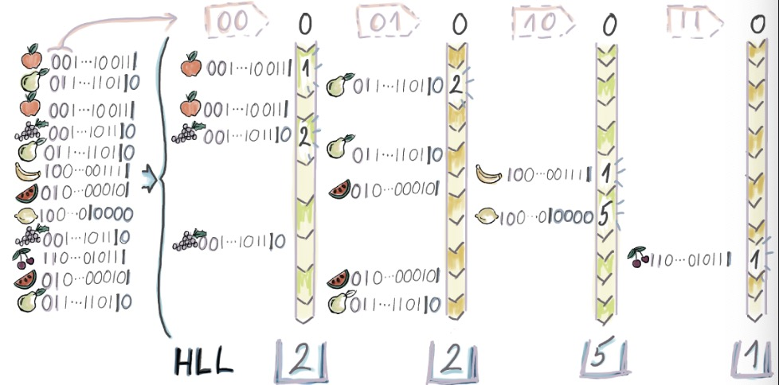

**{{ page.description }}**
<!-- TOC start (generated with https://github.com/derlin/bitdowntoc) -->

- [HyperLogLog](#hyperloglog)
   * [1. count distinct의 동작](#1-count-distinct-)
   * [2 HyperLogLog를 보기전 천천히 이해해보자](#2-hyperloglog-)
      + [2.1 직관](#21-)
   * [3 확률론적 평균화](#3-)
   * [4 LogLog](#4-loglog)
      + [4.1 LogLog의 필요 저장공간, 왜 이름이 LogLog?](#41-loglog-loglog)
   * [5 HyperLogLog](#5-hyperloglog)
   * [6 Trino 지원 함수](#6-trino-)

<!-- TOC end -->

<!-- TOC --><a name="hyperloglog"></a>
## HyperLogLog

<!-- TOC --><a name="1-count-distinct-"></a>
### 1. count distinct의 동작

`SELECT COUNT(DISTINCT col) FROM table`

정렬되어있지 않은경우, 정렬이 필요함. 정렬 후 데이터를 순차적으로 읽어 중복을 제거할 수 있음.

이 문제를 [Element distinctness problem](https://en.wikipedia.org/wiki/Element_distinctness_problem) 이라 하는데, 정렬이 아닌 다른 방식으로도 해결될 수 있지만 시간 복잡도는 $\Theta(nlogn)$ 이라고 함.

해시테이블을 쓰려고 해도 distinct element 수 $k$ 는 실제 element 수 $n$까지 증가할 수 있으므로 해싱을 사용하기 부적합함

<!-- TOC --><a name="2-hyperloglog-"></a>
### 2 HyperLogLog를 보기전 천천히 이해해보자

- $a_1, a_2, ..., a_n$: 원본 데이터 (이중 distinct element $k$개)
- $h_1, h_2, ..., h_n$: $a_i$의 해시값

$\rho_i$: (위 $h_i$ 에서 연속적으로 0으로 끝나는 0의 개수) + 1

- $h_1$ = 1111 이면, $\rho_1$ = 1
- $h_2$ = 1000 이면, $\rho_2$ = 4

$\rho_{max} = max(\rho_1, \rho_2, ... \rho_n)$

카디널리티 추정값 $E$ = $2^{\rho_{max}}$


- 이 예시에서 element 수 는 12, distinct element 수는 7
- $\rho_{max} = 5$, $E = 2^5 = 32$
- 실제 값 7과의 격차는 아직 크다

<!-- TOC --><a name="21-"></a>
#### 2.1 직관
- k개의 bit array가 uniform random 할때
- 마지막 bit가 0으로 끝날 확률은 $k/2$, 1로 끝날 확률도 $k/2$, 그리고 00, 01, 10, 11로 끝날 확률은 $k/{2^2}$

따라서 
- $\rho_i = 1$ (해시값이 1로 끝나는 경우) 인 해시를 생성할 확률은 $1/2$
- $\rho_i = 2$ (해시값이 10으로 끝나는 경우)일 확률은 $1/4$
- $\rho_i = j$ (해시값의 $10^{j-1}$로 끝나는경우)일 확률은 $1/2^{j}$
- => $1/2^j$ 의 확률이 발생하려면 평균적으로 $2^j$ 의 반복이 필요하므로, $\rho_{max}$가 생겼다는것은 $2^{\rho_{max}}$의 카디널리티가 존재한다고 생각할 수 있음
- 10% 주문서를 성공하려면 10개 주문서를 사두면 성공할것이라는 기대를 가지는것과 같은 맥락

어찌됐건 확률의 평균적인 행동을 가지고 기대값을 만든것이므로 실제와 다를 수 있음.

<!-- TOC --><a name="3-"></a>
### 3 확률론적 평균화

1.2 에서 기대값 $E = 2^{\rho_{max}}$ 인데, 이게 2의 지수이므로 실제 카디널리티와 가까워지기 힘듦

따라서 여러 버킷으로 쪼개어서 각 버킷에 대해 확률적 계산을 수행해보자.

- 각 해시값 $h_i$ 에서 처음 $b$개의 bit를 가지고 버킷을 선택 ($m=2^b$ 개의 버킷이 존재)
- 그리고 1.2의 $\rho_i$ 를 계산, 그러면 $m$개의 bucket에서 $\rho_{max}$ 값 $m$개가 생김 -> $\rho_{i,max}$
- 위 $m$개의 b버킷에서 산술평균을 계산하면, $A = \frac{\Sigma_{i=1}^{m}\rho_{i,max}}{m}$
- 그리고 산술평균으로 "평균 버킷 추정", $E_{bucket} = 2^{A}$
- "평균" 버킷 추정이므로 전체로 확장하면, $E = m * E_{bucket} = 2^{\frac{\Sigma_{i=1}^{m}\rho_{i,max}}{m}}$


- 위 예시에서 $b=2, m=4$
- 각 4개 버킷의 $\rho_{i, max}$ 는 각각 $2, 2, 5, 1$
- $A = \frac{2+2+5+1}{4} = 2.5$
- $E_{bucket} = 2^{A} = 2^{2.5} \approx 5.66 $ 
- $E = m * E_{bucket} = 4 * 5.66 = 22.64$
- 1.2에서는 32, 실제 카디널리티는 7. 아직 값이 부정확하지만 이전보다 정확해졌음

<!-- TOC --><a name="4-loglog"></a>
### 4 LogLog

LogLog 는 1.3의 확률론적 평균화에서 정규화상수 $\~a_m$ 을 사용함

$\~a_m$ 은 버킷 수 m에서부터 생성되는 상수, $\~a_m \sim 0.39701 - \frac{2\pi^2+(ln2)^2}{48m}$
- 통상적으로 $m >= 64$ 일때 $\~a_m = 0.39701$을 사용함

그리고 확률론적 평균화의 카디널리티 추정값 $E = m * E_{bucket}$ 에서 $\~a_m$ 을 곱한 값을 카디널리티 추정값으로 사용

$E = \~a_m * m * E_{bucket}$

- 1.3의 예시에서 m=4이므로, $\~a_m = \~a_4 = 0.39701 - \frac{2\pi^2+(ln2)^2}{48*4} = 0.292$
- $E = \~a_m * m * E_{bucket} = 0.292 * 4 * 5.66 \approx 6.6$
- 실제 값과 매우 가까워지게 됨

<!-- TOC --><a name="41-loglog-loglog"></a>
#### 4.1 LogLog의 필요 저장공간, 왜 이름이 LogLog?

LogLog의 relative error는 $1.3/\sqrt{m}$ 에 가깝다고 함.

$m=2^{14}$ 로 설정한다면 (해시값에서 앞 14개의 bit사용, 2^14=16384 개 버킷), "데이터 셋의 크기"에 관계없이 $1.3/\sqrt{2^{14}} = 1.01%$ 의 relative error를 기대할 수 있음

- 한 버킷에서 버킷카운터 값 한개 $\rho_{i,max}$ 만 유지하면 되므로, 이걸 8byte인 long 으로 설정한다면 $2^3*2^{14} = 131072$ = 130KB 만 필요함

실제 버킷 카운터의 비트 수를 계산해보자..
1. 카디널리티의 최대값이 $k_{max}$ 이면
    - 예시) 30일 MAU를 구한다고 했을때 이 값의 상한은 그동안 가입한 모든 유저 수가 될것
    - $k_{max}$ 를 5천만이라고 해보자 `10 1111 1010 1111 0000 1000 0000`
2. 해당 카디널리티까지 구분하기 위한 해시 길이는 $O(log_2k_{max})$ 여야 함
    - 카디널리티의 최대값에 $log_2$를 씌우면 최대값이 가진 비트 개수가 됨
    - 5천만개 경우의수 전부를 해시를 한다면 해시의 최대 범위는 5천만이면 된다. 즉 5천만을 담을 수 있는 비트만 필요함
    - $log_250000000 = 25.575$, 26개의 bit
3. 그리고 버킷의 최대 값 저장을 위해선 $O(mlog_2{log_2k_{max}})$ 개의 비트가 필요하다
    - 버킷 카운터 값 $\rho$ 는 연속된 0의 개수 + 1이므로 $log_2k_{max}$ = 26 이라는 값을 담을 수 있는 bit면 됨
    - 즉 버킷 카운터 공간은 5bit 만큼만 있으면 됨
    - 그리고 버킷이 $m$개가 있으므로 $5 bit * 2^{14} = 81920$ 약 81KB
    - $k_{max}$를 long max인 2^64로 한다고 해도 $2^{14}*log_2{log_2{2^{64}}}=98304$, 98KB

<!-- TOC --><a name="5-hyperloglog"></a>
### 5 HyperLogLog

1.4 LogLog 에서 버킷의 산술평균 대신 조화평균을 사용해보자

$E_{bucket}=\frac{m}{\Sigma_{i=1}{m}2^{-\rho{i,max}}}$

최종 카디널리티 계산은 

$E = \alpha_m*m*E_{bucket}=\frac{\alpha_mm^2}{\Sigma_{i=1}{m}2^{-\rho{i,max}}}$

편항 보정계수는 LogLog와는 다른 값을 사용함

$\alpha_m=\frac{1}{2ln2(1+\frac{1}{m}(3ln2-1)+O(m^{-2}))}$

1.3의 예시에 조화평균 적용
$E_{bucket}=\frac{4}{(1/2)^2 + (1/2)^2 + (1/2)^5 + (1/2)^1} = \frac{4}{33/32} \approx 3.88$

$\alpha_4=0.541$ 이므로 $E = 0.541 * 4 * 3.88 = 8.39$

- LogLog 에선 6.6이 나왔고, HyperLogLog에서는 8.39가 나와서 정답 7 보다는 더 멀어졌지만, 데이터셋이 커질수록 HyperLogLog의 편향과 상대오차가 적다고 함
- HyperLogLog의 상대오차는 $\frac{1.04}{\sqrt{m}}$ 이하이므로, LogLog의 상대오차 $\frac{1.3}{\sqrt{m}}$ 보다 작음

<!-- TOC --><a name="6-trino-"></a>
### 6 Trino 지원 함수

HyperLogLog에서 계산한 데이터들 자체를 저장해두고, 버킷 크기 $m$이 같은 HyperLogLog 두개를 합칠 수 있음

https://trino.io/docs/current/functions/hyperloglog.html

> `approx_set(x) → HyperLogLog`
> Returns the HyperLogLog sketch of the input data set of x. This data sketch underlies approx_distinct() and can be stored and used later by calling cardinality().
>
> `cardinality(hll) → bigint`
> This will perform approx_distinct() on the data summarized by the hll HyperLogLog data sketch.
>
> `empty_approx_set() → HyperLogLog`
> Returns an empty HyperLogLog.
>
> `merge(HyperLogLog) → HyperLogLog`
> Returns the HyperLogLog of the aggregate union of the individual hll HyperLogLog structures.

예시) 매일 최근 30일 MAU 구하기

- count distinct를 사용하게 되면 -> 매일 30일 범위의 데이터를 스캔해야함
  - 30일동안 매일 MAU를 계산한다면 30*30 = 900일치 데이터에 대한 연산이 생기는것
- HLL을 사용하면, 매일 1일 범위의 HLL 데이터를 생성하고, 30일 범위의 HLL 데이터를 스캔해서 merge 후 카디널리티 계산
  - 30일동안 매일 MAU를 계산한다면 30 + 29(첫날 기준 이전29일 데이터에 대해 HLL 미리 생성 필요)일의 HLL 생성과, 저장된 HLL 데이터를 merge하기 위해서 추가적인 스캔(매우작음) 필요.

데이터 생성할때
```sql
INSERT INTO sketch AS
SELECT
    "2024-05-01" AS date,
    CAST(
        approx_set(user_id) -- HLL sketch 생성
    AS VARBINARY) AS hll -- 저장할땐 VARBINARY type으로 저장
FROM logs
WHERE time >= "2024-05-01" AND time < "2024-05-02"
```

계산할때
```sql
SELECT
    CARDINALITY(
        MERGE(
            CAST(hll AS HyperLogLog) -- VARBINARY 에서 HyperLogLog로 캐스팅
        ) -- HLL structure들을 병합
    ) AS approx_distinct_count -- 병합된 HLL에서 카디널리티 계산
FROM sketch
WHERE date >= "2024-05-01" AND date < "2024-06-01"
```
