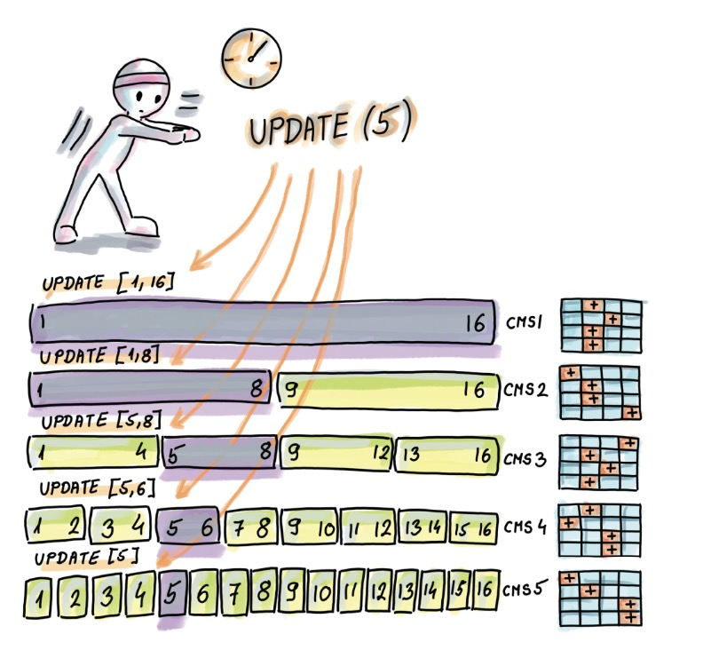
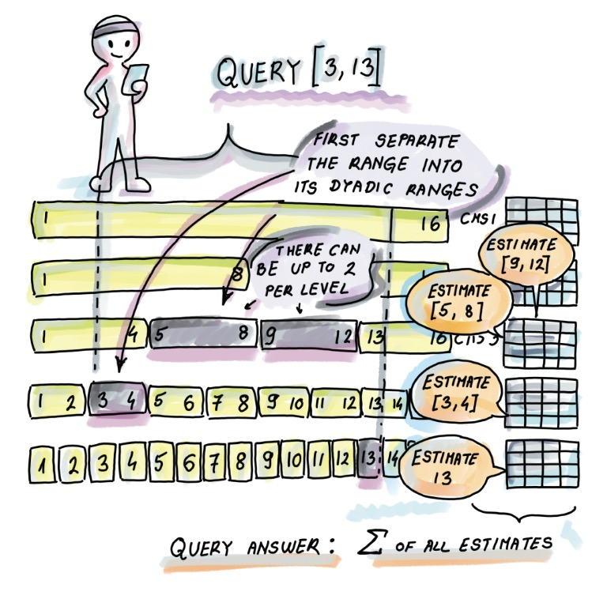

<!-- TOC --><a name="probabilistic-data-structures-2"></a>
# Probabilistic data structures - 2

<!-- TOC start (generated with https://github.com/derlin/bitdowntoc) -->

  * [1. Count-Min Sketch](#1-count-min-sketch)
    + [1.1 Update](#11-update)
    + [1.2 Estimate](#12-estimate)
    + [1.3 Count-Min Sketch의 오차 vs 공간](#13-count-min-sketch-vs-)
    + [1.4 Count-Min Sketch의 Range Query](#14-count-min-sketch-range-query)
        - [1.4.1 Update](#141-update)
        - [1.4.2 Estimate](#142-estimate)
  * [2. Bloom Filter](#2-bloom-filter)
    + [2.1 Bloom Filter 작동 방식](#21-bloom-filter-)
        - [2.2 Insert](#22-insert)
    + [2.3 Lookup](#23-lookup)
    + [2.4 사용 사례](#24-)
    + [2.4.1 Squid: web proxy cache](#241-squid-web-proxy-cache)
  * [2.5 Bloom Filter 구성](#25-bloom-filter-)
  * [2.6 단점](#26-)
  * [3. Quotient Filter](#3-quotient-filter)
    + [3.1 Quotienting](#31-quotienting)
    + [3.2 Metadata bit](#32-metadata-bit)
    + [3.3 Insert](#33-insert)
    + [3.4 Lookup](#34-lookup)
    + [3.5 Resize](#35-resize)
    + [3.6 Bloom Filter와 비교실험](#36-bloom-filter-)

<!-- TOC end -->


<!-- TOC --><a name="1-count-min-sketch"></a>
## 1. Count-Min Sketch

data stream에서 각 id마다 count를 유지해야한다면?
그 key가 엄청나게 많다면? (베스트셀러 아이템 찾기)

빈도의 총합(N)이 아닌, Distict element (n)에 비례하는 문제이다.

Operations
- Update: 입력 쌍 $(a_t, c_t)$ 에 대해 $a_t$의 빈도를 수량 $c_t$ 만큼 증가시킨다.
- Estimate: $a_t$ 의 estimated frequency를 리턴 (과대추정은 가능하지만, 과소추정되지 않는다)

$d$개의 행과 $w$개의 열을 가진 정수 카운터 행렬 $CMS[1..d][1..w]$ 로 표시됨. 모든 카운터는 처음에 0으로 설정. $d$개의 독립적인 해시함수 $(h_1, h_2, ..., h_d)$ 가 존재함. 각 해시함수의 범위는 $[1..w]$.

<!-- TOC --><a name="11-update"></a>
### 1.1 Update

$d$ 개의 해시함수를 사용해 $a_t$ 에 대해 ($t$는 time stream t) $d$ 개의 해시를 계산하고, 각 해시값 $h_j(a_t)$을 $c_t$ 만큼 증가시킨다. 


<!-- TOC --><a name="12-estimate"></a>
### 1.2 Estimate

각 hash value중에서 min 값을 리턴한다. 하지만 해시충돌이생길경우 과대추정이 가능하다.


<!-- TOC --><a name="13-count-min-sketch-vs-"></a>
### 1.3 Count-Min Sketch의 오차 vs 공간

Count-Min Sketch의 오차
- $\epsilon$: 과대추정 범위
- $\delta$: 실패 확률

시간 슬롯 $t$까지 생성된 스트림 S ($S = (a_1, c_1), (a_2, c_2), ..., (a_t, c_t)$) 에서 관찰된 빈도의 총 합을 N ($N = \Sigma_i^t = 1C_t$) 으로 정의하면, 과대 추정 오차 $\epsilon$ 은 **어떤 항목의 실제 빈도를 초과하는 N의 백분율** 로 표현. 즉, 요소 $x$와 그 실제 빈도 $f_x$ 가 있을때, Count-Min Sketch는 적어도 **$1-\delta$의 확률**로 빈도 $f_{est}$를 추정한다. 

$f_x <= f_{est} <= f_x + \epsilon N$

- $f_x$: 실제 빈도
- $f_{est}$: 추정된 빈도
- $\epsilon$: 과대추정된 비율
- $N$: 전체 빈도 수 ($\Sigma_{i=1}^tc_i$)


일반적으로 실패확률 $\delta$ 는 작은 값(0.01) 로 설정함. 이로 인해 과대추정 오차가 높은 확률로 예상하는 범위 내에 머무르도록 한다 (99.9%확률). CMS에서 과대추정이 무한대로 발생할가능성은 있긴 한것임.

블룸필터처럼 CMS를 더 정확하게 조절할 수 있지만, 그럴경우 **공간**이 많이 필요함. 애플리케이션에서 원하는 $(\epsilon, \delta)$ 값이 어떻게 설정하던지간, CMS의 dimension을 $w=e/\epsilon, d = ln(1/\delta)$ 로 구성해야한다. 따라서 CMS의 공간복잡도는 $e*(ln(1/\delta))/\epsilon$ 이다. 

$1-\delta$ 의 확률로 최대 $\epsilon N$의 과대추정을 얻기 위한 조건
- $w$(hash값의 범위) $=e/\epsilon$: 과대추정비율의 역수 * 자연로그 $e$
- $d$(hash function 수) $=ln(1/\delta)$


CMS의 공간복잡도는 데이터셋 크기에 의존하지 않지만, 에러가 데이터셋 크기의 고정된 비율일경우에만 그렇다.
 - 오차 범위를 N*0.3% 로 고졍한경우, N을 두배로 증가시켜도 CMS의 크기는 그대로로 만들수있지만, 과대추정범위는 두배가 된다. 즉 N의 두배로 증가하면 과대추정오차도 두배를 "허용" 해줘야 하는거다. 

하지만 CMS에서 과대추정 오차가 개별요소의 빈도와는 관계없이 총 빈도 합 N에 대해서만 민감하다는것. 따라서 오차범위는 각 element의 빈도를 볼경우 크게 차이가 날 수 있음.
- 최대 과대 추정이 $\epsilon N = 200$ 인 경우, 10000의 빈도를 가지는 요소와, 빈도가 10인 요소에도 동일한 과대추정을 예상할수 있음. **후자의 경우 추정치가 실제 빈도보다 20배 이상 늘어날 수 있음.**


<!-- TOC --><a name="14-count-min-sketch-range-query"></a>
### 1.4 Count-Min Sketch의 Range Query
이항 구간 (Diadic intervals)와 각각의 CMS를 두자

이항 구간


<!-- TOC --><a name="141-update"></a>
#### 1.4.1 Update


<!-- TOC --><a name="142-estimate"></a>
#### 1.4.2 Estimate



<!-- TOC --><a name="2-bloom-filter"></a>
## 2. Bloom Filter

실제 존재하는지는 확실하지 않지만, 부재 하다는 것은 확실하게 알 수 있음

Cassandra의 SSTable (LSM Tree), 50개의 SSTable과 corresponding bloom filter가 있음.
첫 bloom filter lookup에서 not present이면 다음 bloom filter로 라우팅.
만약 present라고 뜨면 disk를 읽어서 실재하는지 확인, 없으면 또 다음 bloom filter로 라우팅

공간 (*m*), 항목 수(*n*), 해시 함수(*k*), false positive rate (*f*)


<!-- TOC --><a name="21-bloom-filter-"></a>
### 2.1 Bloom Filter 작동 방식

모든 슬롯은 초기에 0 으로 설정되어있는 bit array이다. $A[0..m-1]$
$k$ 개의 독립적인 해시 함수 $h_1, h_2, ..., h_k$ 이고, 해시함수의 결과는 $[0,m-1]$ 범위에 uniform random하게 매핑됨


<!-- TOC --><a name="22-insert"></a>
#### 2.2 Insert
element $x$ 를 넣는다면, 모든 해시 함수의 결과를 계산해서 어레이에 저장

```py
hashes: List[Callable[[Any], int]]
k: int = len(filter_functions)

def insert(e) -> None:
    for i in range(k):
        A[hashes[i](e)] = 1
```

insert(x)를 할때 $h_1(x) = 1, h_2(x) = 5$ 라면, 배열의 1,5번째 index에 1을 저장

insert(y)를 할때 $h_1(y) = 4, h_2(y) = 6$ 이라면, 배열의 2, 6 번째 index에 1을 저장.

따라서 배열의 값은 `0 1 0 0 1 1 1 0` 이 된다.

시간복잡도: O(k), 대체적으로 12개 이하

<!-- TOC --><a name="23-lookup"></a>
### 2.3 Lookup

```py
def lookup(e) -> bool:
    for i in range(k):
        if A[hashes[i](x)] == 0:
            return False # not present
    return True # present
```

lookup(x) 를 한다면 $h_1, h_2$ 의 결과는 각각 1, 5 이고 둘다 배열에 1이 들어있으므로 true 리턴.

lookup(z) 를 할때 $h_1, h_2$ 의 결과가 각각 4, 5 가 나온다면 둘다 배열에 1이 들어있어서 true를 리턴, 하지만 실제 값은 없으므로 false positive임

시간복잡도: worst O(k)인데, 존재하지않으면 대체적으로 k회만큼 조회하진 않음.

<!-- TOC --><a name="24-"></a>
### 2.4 Usecases

<!-- TOC --><a name="241-squid-web-proxy-cache"></a>
### 2.4.1 Squid: web proxy cache
web proxy는 cache를 이용해서 data copy를 유지해서 웹 트래픽을 줄임.
각각의 proxy가 이웃 proxy의 cache를 저장하거나, bloom filter를 활용해서 이웃 proxy에 데이터가 존재하는지도 저장해둠.

유저의 요청이 web proxy A 에 도착하면.
1. A는 자신의 cache에 데이터가 존재하는지 확인
2. cache에 데이터가 없으면, Bloom Filter를 통해서 인접한 proxy B, C, D에 해당 요청에 대한 데이터가 존재하는지 확인
3. Bloom Filter에서 proxy D에 데이터가 존재하는것으로 확인되면 D에 요청을 forward함
다만 데이터는 stale해질수도 있으므로 (D에 실제 존재했지만 D에서 데이터를 제거하는경우) false positive는 더 발생할 수 있음.

### 2.4.2 Spark: Bloom filter join

[[#SPARK-32268] Bloom Filter Join](https://issues.apache.org/jira/browse/SPARK-32268)

[Row-level Runtime Filters in Spark.docx](https://docs.google.com/document/d/16IEuyLeQlubQkH8YuVuXWKo2-grVIoDJqQpHZrE7q04/edit#heading=h.4v65wq7vzy4q)


[What's new in Apache Spark 3.3 - joins](https://www.waitingforcode.com/apache-spark-sql/what-new-apache-spark-3.3-joins/read)

<!-- TOC --><a name="25-bloom-filter-"></a>
## 2.5 Bloom Filter 구성
- $n$: 넣을 element 수
- $f$: false positive rate
- $m$: bloom filter의 비트 수
- $k$: hash function 수

- 식 3.1 - false positive rate을 결정하는 공식

$f \approx (1 - e^{-(nk/m)})^k$

위 식을 시각적으로 이해해보자

$m/n$ (element 수 당 bit의 비율), $k$ (hash function 수)에 따른 false positive rate을 보여주는 그래프.


실제 application에선 $m/n$을 일정하게 가져간다. 대체적으로 [6, 14]의 범위면 false positive rate이 낮아진다.

$m/n$ 을 크게 키울수록 공간이 많아지므로 false positive rate이 내려감.

$m/n$ 을 고정했을때 $k$를 증가시킨다고해서 무조건 false positive rate이 무조건 낮아지는건 아님 (hash value 경우의 수가 늘어나므로)

최적의 $k$ 값은 위의 false positive 공식을 미분하면 알아낼 수 있음

- 식 3.2 - 최적의 $k$ 결정
$k_{opt} = m/n*ln2$ 

$m/n = 8$ 일때 $k_{opt} = 5.545$


$k_{opt}$를 사용하면 false positive rate이 같아진다

- 식 3.3 - 최적의 $f$ 결정

$f_{opt} = (1/2)^k$.

$k_{opt}$ 식을 FPR 공식에 대입하면 나온다.


bloom filter를 생성할땐 $n$, $f$를 입력받아서 $m$, $k$를 생성하는데, $k_{opt}$ 가 정수가 아닐경우 반올림을 하게되니 정확한 $f_{opt}$가 달라진다.
하지만 $f_{opt}$ 공식을 활용해서 생기는 오차는 크지 않으며, 반올림보다는 계산하는 hash function의 수를 불이기 위해 값을 내리는게 낫다. (즉 5.545에서 5 선택)

또한 $f_{opt}$를 보면 동전던지기와 비슷한데 k개의 연속된 1이 발생하면 false positive가 발생한다. 따라서 bloom filter에 0/1 skew가 크게 있으면 잘 동작하지 않을 것이다.

Bloom filter에서 주어진 parameter가 있을때 남은 parameter를 구하는 예시

예제 1) m, n, k 에서 f 계산: 처음에 1M개의 element를 저장하도록 만들었지만, element수를 10배로 늘릴경우 기존 bloom filter의 FPR을 구해보자.
m=3MB=3*8*10^6, n=1M -> 10M=10^7, k=2 이다.

$f = (1-e^{-nk/m})^k = (1 - e^{-2*10^7/(3*8*10^6)})^2 = (1-(1/e)^{5/6})^2 = 32%$

예제 2) n, m 에서 f, k 계산: 1M개의 element를 저장하는 bloom filter 만들기.
- $m=1MB=8*10^6$
- $k_{opt} = m/n*ln2 = 8*10^6/10^6*ln2 = 5.54$

<!-- TOC --><a name="26-"></a>
## 2.6 단점

- 삭제 불가능
- 크기 조정이 어려움
- input 자체가 random하지 않으면 문제가 생김
  - 현실은 대부분 zipfian distribution 이므로 frequent element에서 FPR이 올라가면 전체적으로 FPR이 올라감.

<!-- TOC --><a name="3-quotient-filter"></a>
## 3. Quotient Filter

- linear probing hash table 이라고 보면됨
- 슬롯에 key를 저장하는 대신 hash를 저장함
- bloom filter보단 정확하지만, hash table보다 부정확함
  - key를 구분할수 없지만, 해시를 구분할 수 있다?
  - 긴 해시 -> 공간을 더차지하지만, FPR을 줄일수 있음
  - 삭제도가능, 필터 병합도 가능. - 분산시스템에서 유용함

- slot 수 -> 최대로 가질수 있는 element 수, util이 높아질수록 느려진다
- remainder size -> FPR ?

<!-- TOC --><a name="31-quotienting"></a>
### 3.1 Quotienting

- 각 항목의 해시를 quotient / remainder로 나누기
  - quotient: bucket index
  - remainder: slot에 저장

- $h$: hash bit size
- $m=2^q$: 테이블 크기
- 앞쪽 $q$ bit가 quotient
- 나머지 $r = h - q$


예시
- $h=11, q=5, m=2^q=32$
- 앞쪽 5bit quotient가 됨

충돌이 발생하지 않으면 (즉, quotient가 중복x일때) 모든 remainder는 각각 자신만의 버킷 $b$ 를 가짐.

버킷 인덱스 $b$ 와 각 버킷에 저장된 remainder 값을 통해 hash를 다시 알아낼 수 있음. 따라서 quotienting을 사용해서 슬롯당 $q=5$ bit를 절약하게 됨

반면 bloom filter는 어떤 element가 어떤 hash를 가졌는지 재구성할수 없다.

해시충돌은 linear probing으로 해결 -> 근데 이거쓰면 quotient + remainder 관계가 풀릴텐데? 이걸 해결하기 위해 metadata bit를 쓰자. 

<!-- TOC --><a name="32-metadata-bit"></a>
### 3.2 Metadata bit

- run: 어떤 quotient 값
- cluster: 하나 이상의 run sequence
- anchor slot: 원래 quotient 자리의 버킷(슬롯))
.

- is_occupied: linear probing을할경우 해시되지않은값이 들어올수있으므로 해당 버킷에 해시값이 있는지 여부 저장, 있으면 1 없으면 0, 
- is_continued: 이 버킷에 저장된 remainder가 직전 버킷과 동일한 quotient를 가졌는지 여부
- is_shifted: 이 버킷에 저장된 remainder가 원래 있어야할 위치에 있는지, 이동된것인지 여부. 시작지점을 찾는데 쓰임.

<!-- TOC --><a name="33-insert"></a>
### 3.3 Insert

$h=9, q=3$


1. Insert A, `h(A) = 001.000101`
    - 해당 버킷이 비어있으므로 `is_occupied = 1`
    - remainder `000101` 저장

|0|1|2|3|4|5|6|7|8|9|
|-|-|-|-|-|-|-|-|-|-|
||**`1\|0\|0`**|
||**`000101`**|


2. Insert B, `h(B) = 001.111000`
    - 버킷 1에 값이 있고 `is_occupied = 1` 임.
      - 저장되어있는 remainder값이 넣으려는 값보다 작음. 다음버킷 2로
    - 버킷 2가 비어있음, remainder 저장 `is_continued = 1, is_shifted = 1` 설정

|0|1|2|3|4|5|6|7|8|9|
|-|-|-|-|-|-|-|-|-|-|
||`1\|0\|0`|**`0\|1\|1`**|
||`000101`|**`111000`**|


3. Insert C, `h(C) = 001.010101`
    - 버킷 1에 값이 있고 `is_occupied = 1` 임.
      - 저장되어있는 remainder값이 넣으려는 값보다 작음. 다음버킷 2로
    - 버킷 2에 값이 있고 `is_continued = 1, is_shifted = 1` 이므로 나와 같은 run임.
      - 근데 여기 들어있는값 `111000` 보다 넣으려는 값 `010101` 이 더 작음. `010101`을 여기에 넣고 `111000`을 들고 다음 버킷 3으로
    - 버킷 3이 비어있음, remainder `111000` 저장, `is_continued = 1, is_shifted = 1` 설정 (더있다면 값을 끝까지 더 밀어내야..)

|0|1|2|3|4|5|6|7|8|9|
|-|-|-|-|-|-|-|-|-|-|
||`1\|0\|0`|`0\|1\|1`|**`0\|1\|1`**|
||`000101`|**`010101`**|**`111000`**|


4. Insert D, `h(D) = 001.110011`
    - 버킷 1에 값이 있고 `is_occupied = 1` 임. 저장되어있는 remainder값이 넣으려는 값보다 작음. 다음버킷 2로
    - 버킷 2에 값이 있고 `is_continued = 1, is_shifted = 1` 이므로 나와 같은 run임.
      - 저장되어있는 remainder값이 넣으려는 값보다 작음. 다음버킷 3으로
    - 버킷 3에 값이 있고 `is_continued = 1, is_shifted = 1` 이므로 나와 같은 run임.
      - 근데 여기 들어있는값 `111000` 보다 넣으려는 값 `110011` 이 더 작음. `110011`을 여기에 넣고 `111000`을 들고 다음 버킷 3으로
    - 버킷 3이 비어있음, remainder `111000` 저장, `is_continued = 1, is_shifted = 1` 설정 

|0|1|2|3|4|5|6|7|8|9|
|-|-|-|-|-|-|-|-|-|-|
||`1\|0\|0`|`0\|1\|1`|`0\|1\|1`|**`0\|1\|1`**|
||`000101`|`010101`|**`110011`**|**`111000`**|

5. Insert E, `h(E) = 011.000011`
    - 버킷 3에 값이 있고 `is_occupied = 0, is_continued = 1, is_shifted = 1` 이므로 나와 다른 Run의 값임.
      - 이 run 3 에 값이 있다는걸 알려야하므로 `is_occupied = 1` 로 설정.
      - 여기서 이전 버킷 2로 가야함. 연속적인 element가 있을때, 어느 run에 해당하는지 찾아내기 위해서 가는것임
    - 버킷 2에 값이 있고 `is_occupied = 0` 임. 버킷2,3은 같은 run
    - 버킷 1에 값이 있고 `is_occupied = 1, is_continued = 0`임. 버킷 1,2,3이 같은 run인걸 알수있음.
    - 버킷 0에는 값도 없고 (`is_continued = 0, is_shifted = 0`), `is_occuupied = 0` 이므로 아에 비어있음. 즉 [1,3]까지 run 1에 해당한다는걸 알수있음
    - 이제 버킷 4를 보면(run 3의 다음 시작지점), `0|1|1` 임. 얘도 run 1출신. 다음 버킷으로
    - 버킷 5는 `0|0|0` 이므로 여기에 remainder를 저장
      - 이 remainder가 run의 시작지점이므로 `is_continued`는 설정안하고, 다른 슬롯에 넣는것이므로 `is_shifted = 1` 로 설정

|0|1|2|3|4|5|6|7|8|9|
|-|-|-|-|-|-|-|-|-|-|
||`1\|0\|0`|`0\|1\|1`|**`1`**`\|1\|1`|`0\|1\|1`|**`0\|0\|1`**|
||`000101`|`010101`|`110011`|`111000`|**`000011`**|

6. Insert F, `h(F) = 011.000001`
   - E와 같은 run이므로 3 -> 2 -> 1 -> 0 -> 4 까지는 동일
   - 버킷 5에 값이 있고, `is_continued = 0, is_shifted = 1` 임.
     - 얘가 연속된 sequence에서 두번째 run걸 알 수 있고, 뒤에서 스캔했다가 돌아왔기때문에 이 값이 run 3 인걸 알 수있음. 그럼 같은 run이므로 remainder를 비교하자
     - 저장된 Remainder `000011`이 넣으려는 remainder `000001` 보다 큰 값이므로. `000001`을 여기에 넣고, `000011`을 빼서 저장하러가자
   - 버킷 6은 아에비어있으므로 여기에 저장. metadata는 `0|1|1`

|0|1|2|3|4|5|6|7|8|9|
|-|-|-|-|-|-|-|-|-|-|
||`1\|0\|0`|`0\|1\|1`|`1\|1\|1`|`0\|1\|1`|`0\|0\|1`|**`0\|1\|1`**|
||`000101`|`010101`|`110011`|`111000`|**`000001`**|**`000011`**|


7. Insert G, `h(G) = 010.111000`
  - 버킷 2에 값이 있고 `is_occupied = 0`이므로 1로 업데이트.
  - 그리고 1 -> 0 까지 가서 왼쪽끝을 확인한다음 3으로 가자 ([1,2] 는 run 1의 데이터인걸 확인)
  - 버킷 3에 `is_occupied = 1, is_continued = 1` 이므로 run 3이 있지만, 데이터는 run 1의 것임을 알수 있음. 다음 버킷으로
  - 버킷 4는 `is_occupied = 0, is_continued = 1` 이므로 현재 이 sequence에는 run 1,3이 있고. 값은 아직 run 1의 값임
  - 버킷 5는 `is_continued = 0`이므로 run 3의 값 시작지점인걸 알수있음 -> 들어가려는 run이 2이므로, 이 자리에 값을 넣고 run 3의 값들은 전부 shift right 해준다

|0|1|2|3|4|5|6|7|8|9|
|-|-|-|-|-|-|-|-|-|-|
||`1\|0\|0`|**`1`**`\|1\|1`|`1\|1\|1`|`0\|1\|1`|**`0\|0\|1`**|**`0\|0\|1`**|**`0\|1\|1`**|
||`000101`|`010101`|`110011`|`111000`|**`111000`**|**`000001`**|**`000011`**|

<!-- TOC --><a name="34-lookup"></a>
### 3.4 Lookup

Insert와 비슷한과정

1. Lookup run 5
  - `is_ocupied = 0` 이므로 검색해볼 필요없음

2. Lookup run 2
  - `is_ocupied = 1` 이므로 값은 있는데 .. `is_continued = 1` 이므로 run 2의 값이 아님
  - 이 sequence에 붙어있는 run들이 얼마나 있는지 찾기 위해서 왼쪽으로 값이 비어있을때까지 계속 가보고, run 1, 2가 있는것을 일단 확인
  - 버킷3, run3이 존재한다는것도 확인 (`is_ocupied = 1`). 근데 값은 또 run 1의 값임 (`is_continued = 1`)
  - 버킷4, run 1의 값인걸 확인
  - 버킷5, run 2의 값인걸 확인.!
    - 실제로는 run을 찾는게아니고 특정 값을 찾는것이므로 여기서부터 `is_continued = 0` 을 만날때까지 값을 찾으면됨 
    - run 3의 값을 만난다면 run2의값은 모두스캔한것이므로.


<!-- TOC --><a name="35-resize"></a>
### 3.5 Resize

bloom filter는 이런거 못함


<!-- TOC --><a name="36-bloom-filter-"></a>
### 3.6 Bloom Filter와 비교실험


- random insert: quotient filter에서 빠르지만 quotient filter 특성상 많이 채우게되면 성능이 급락함. 하지만 resize가 가능하다

- failed lookup: BF가 전체적으로 좋음, quotient filter는 이래저래 돌아다님

- successful lookup: bloom filter는 hash 계산을 여러개 하므로

