**{{ page.description }}**

# AWS Networking Fundamental

[AWS Networking Fundamentals](https://youtu.be/hiKPPy584Mg)

## Default VPC

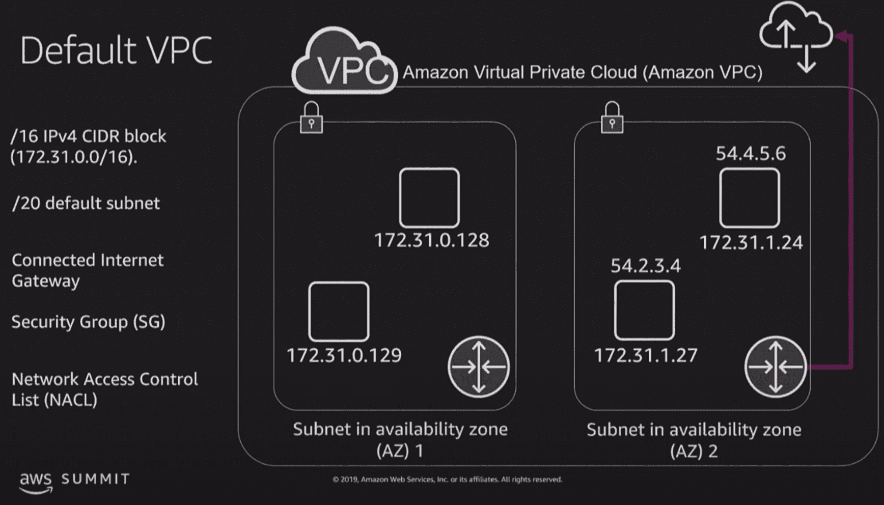

Default VPC로 제공해주는것들

- /16 cidr range
- /20 subnet
- nat: internet route
- sg: network access list

이 영상의 목적은 직접 VPC를 만드는것.

- IP addressing, Creating subnet, routing in VPC, security

## Choosing an IP address range

- Choosing an IP Addres range for your VPC
    - 172.31.0.0/16: default VPC에 붙은것
        - RFC 1918 range 규격: `10.0.0.0/8, 172.16.0.0/12, 192.168.0.0/16`
        default VPC는 172.16.0.0/12 에 속함
        - cidr range를 정할땐 시스템이 얼마나 커질지 고려하면 된다

## Creating subnets in a VPC

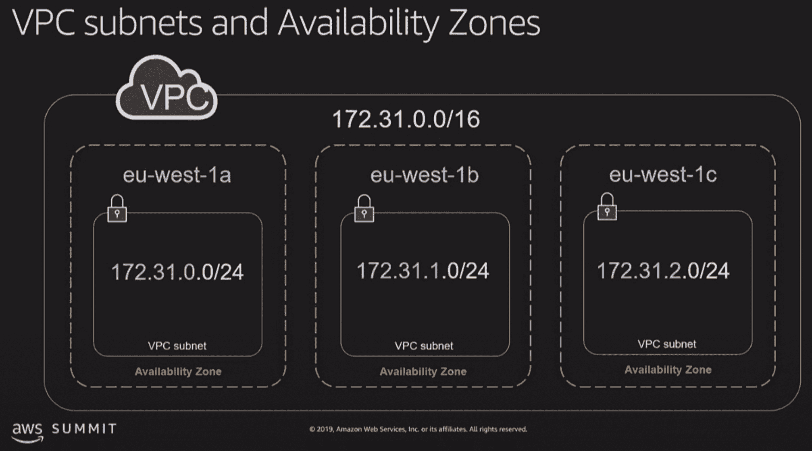

3개의 az가 있으면 다른 az들끼리 통신할수 있도록 각각 subnet을 생성해야함

이 케이스에서는 `0.0/24, 1.0/24, 2.0/24` 3개의 subnet을 만듦

IPv6은 알아서 aws에서 매핑해주기때문에 모든 instance는 IPv4, IPv6 address 둘다 가짐

## Routing in a VPC

Route table은 package이 어디로 갈지 정하는 rule을 저장한다

VPC는 default route table을 가지고 있는데, 직접 route table을 설정할수있다

- default route table: 내 vpc의 cidr range에 있는 모든 ip는 내 vpc내부로 들어온다

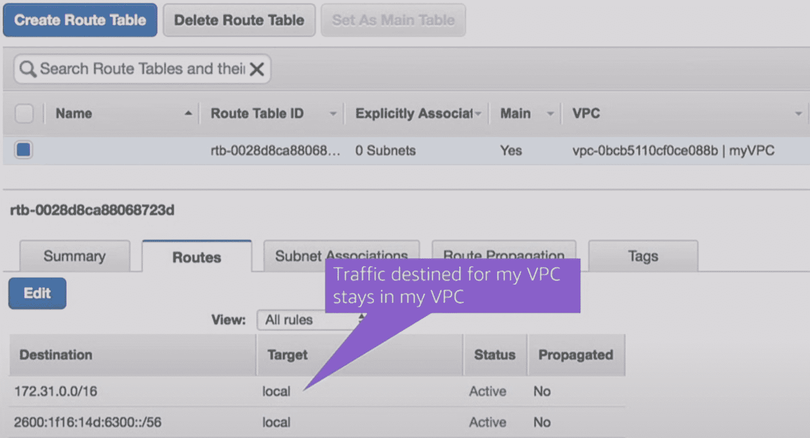

## Internet과 연결

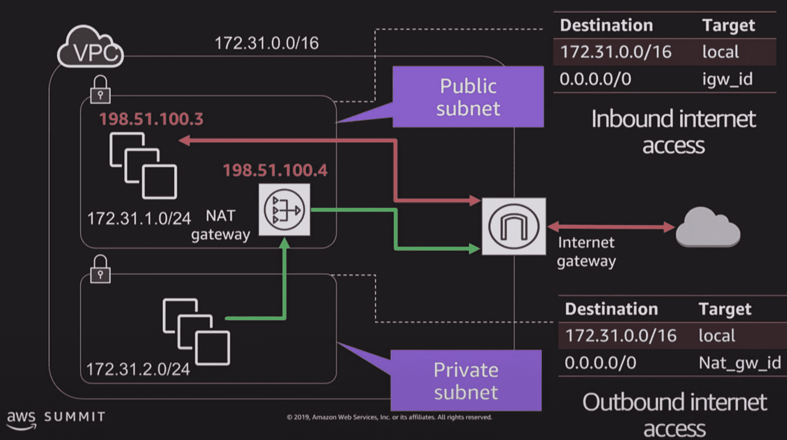

### IN/OUT bound internet access 만들기

1. Public address가 필요해
VPC내에 Public Subnet 생성
instance를 띄우면 private ip address 를 받지만
public subnet이면 public IP address도 받음 `198.51.100.3`
2. internet과 연결할 커넥션이 필요해
IGW(Internet Gateway)를 생성하고, 내 VPC와 연결
3. IGW와 연결될 route가 필요해
`0.0.0.0/0 igw_id` 를 default route로 설정
subnet에 있는 모든것은 default로 subnet 내부 ip address가 아니면 IGW를 통해 바깥으로 나간다

### OUT bound only 만들기

1. Private subnet 만들기
여긴 public address는 받지않는다 
2. NAT gateway 만들기
internet으로 나가는 트래픽은 허용, 들어오는 트래픽은 “request에 대한 response만 가능”
3. `0.0.0.0/0 nat_gw_id` 를 default route로 설정

## Network Security

### Security Groups (Firewall)

stateful인데 즉 → a request that comes from one direction automatically sets up permissions for the response to that request from the other direction (request를 바깥 ip로 보냈을때, response가 다른 ip address 에서 들어와도 allow된다 라는 말인듯!) → inbound, outbound access 에 대한 룰을 생성하는데 쓰는 노가다시간을 줄여준다

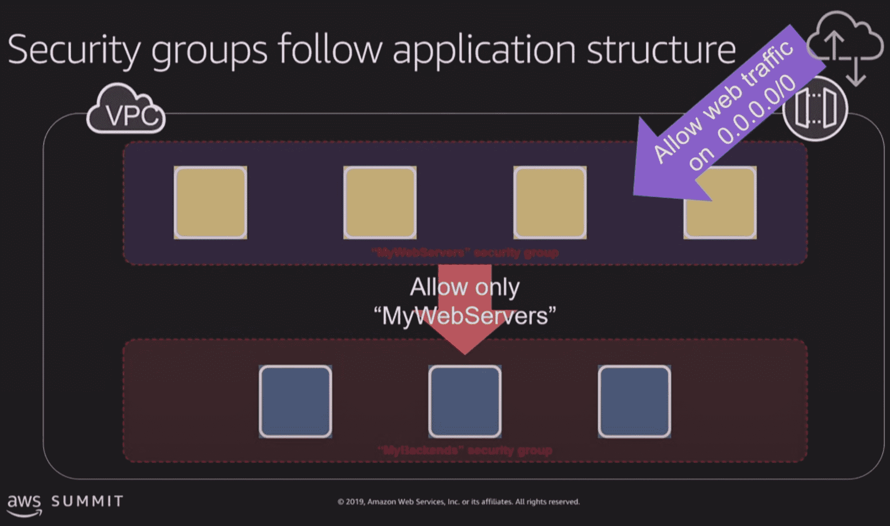

VPC에 4개는 web server, 3개는 backend일때 4개 3개를 각각 webserver sg, backend sg로 만들자

- SG “MyWebServers”: `0.0.0.0/0` inbound 허용
- SG “MyBackends”: SG “MyWebServers” 만 inbound 허용 (cidr range 필요없이 sg로 설정가능)

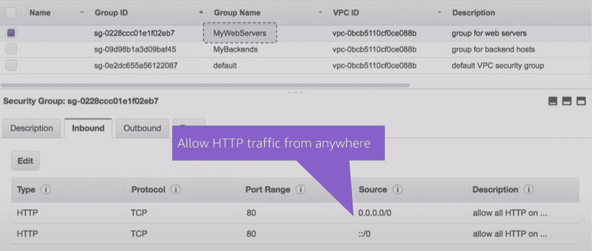

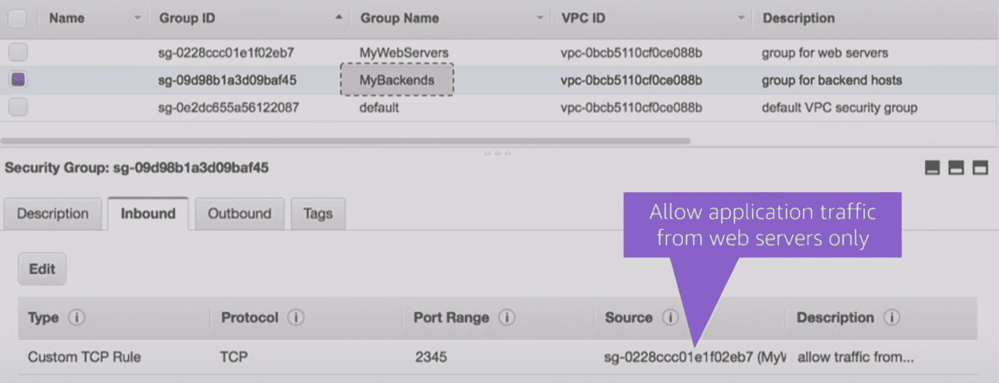

### Network Access Control List (NACLs)

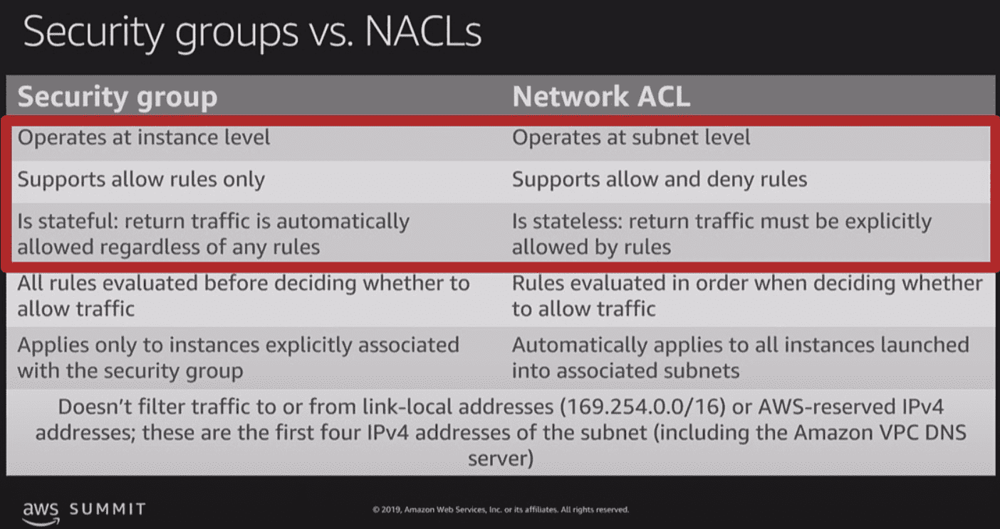

SG와 달리 NACL은 subnet단위 (coarse-grained control)

stateless임 → you’ve allowed traffic in one direction doesn’t mean that the traffic in the other direction is permitted (같은 요청이더라도 ip기반으로 allow가 동작한다)

### Flow Logs

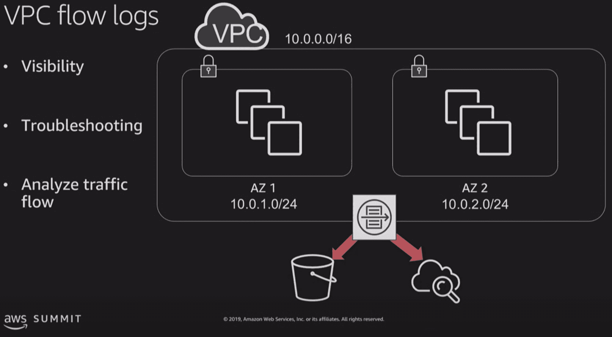

flow logs는 VPC, subnet, instance level 모두에서 동작, s3이나 cloudwatch로 볼수있음
packet payload를 담고있진 않고 m만etadata 가지고있다

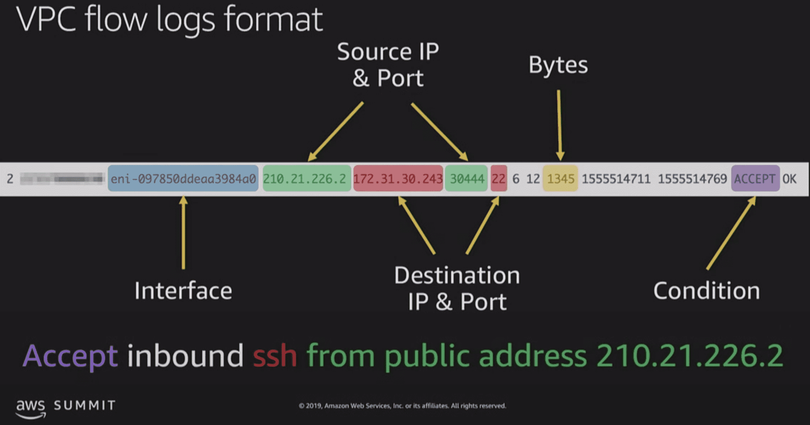

### VPC DNS Options

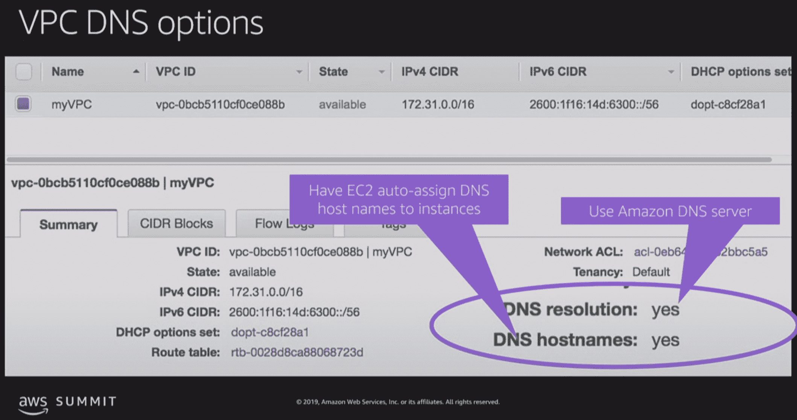

DNS resolution: public이나 VPC address를 resolution할수있도록 허용
DNS hostnames: instance에 대한 dns host name 설정

## Conneccting to other VPCs

### VPC Peering

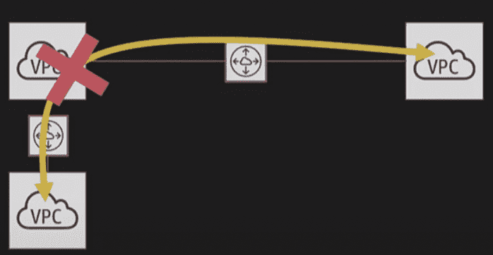

VPC peering은 1:1 관계이므로, 오른쪽 vpc에서 아래 vpc로 알아서 routing을 해주지않음

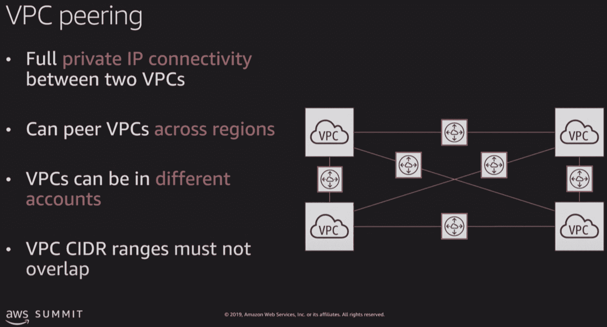

private connection이며, region, account 상관없이 되는데, **********************CIDR range 가 겹치면 안됨**********************

peering을 하면 이렇게 보임 

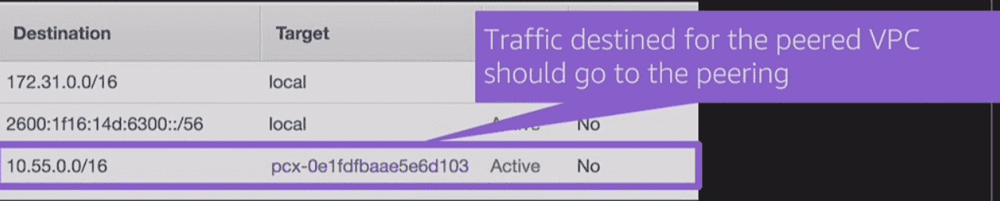

### Transit Gateway

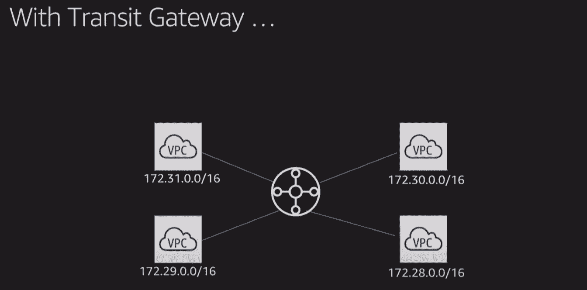

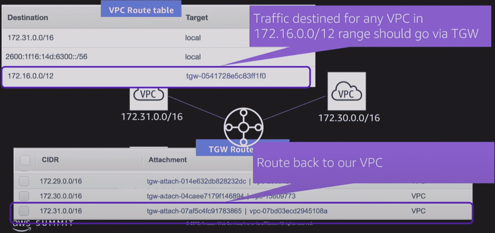

VPC route table에서는 transit gateway에 대한 cidr range가 설정되고, transit gateway는 하위 vpc를 리스팅 해준다

region, account상관없이 private ip connection을 만들수있음
(영상은 옛날거라 단일 region만 되지만 Multi-region지원함)

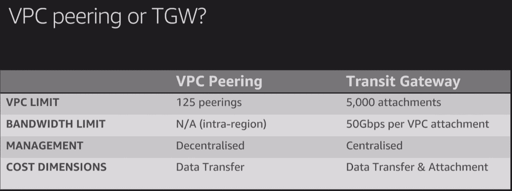

125 peer 이상을 만든다면 transit gateway, traffic이 많으면 vpc peering

## VPN, Direct Connect

on-premise랑 VPC랑 묶어주는것 (온프렘 볼일이없어서패스)

## VPC sharing

VPC는 account에 속하고, 모든 resource도 해당 account에서 배포해야한다, 근데이걸 multi account로 확장해줌

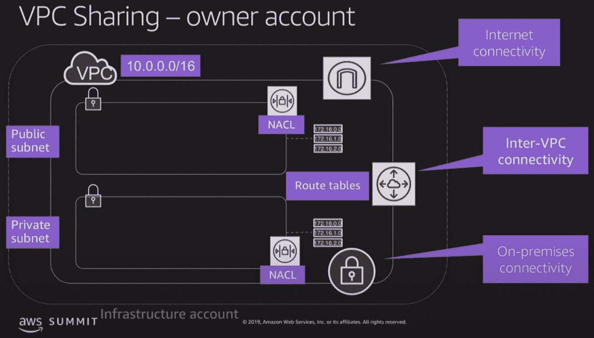

인프라팀에서는 vpc, nacl, subnet, route table 등등을 설정하고

subnet 내부는 다른 팀 account에서설정 - security group도 직접설정

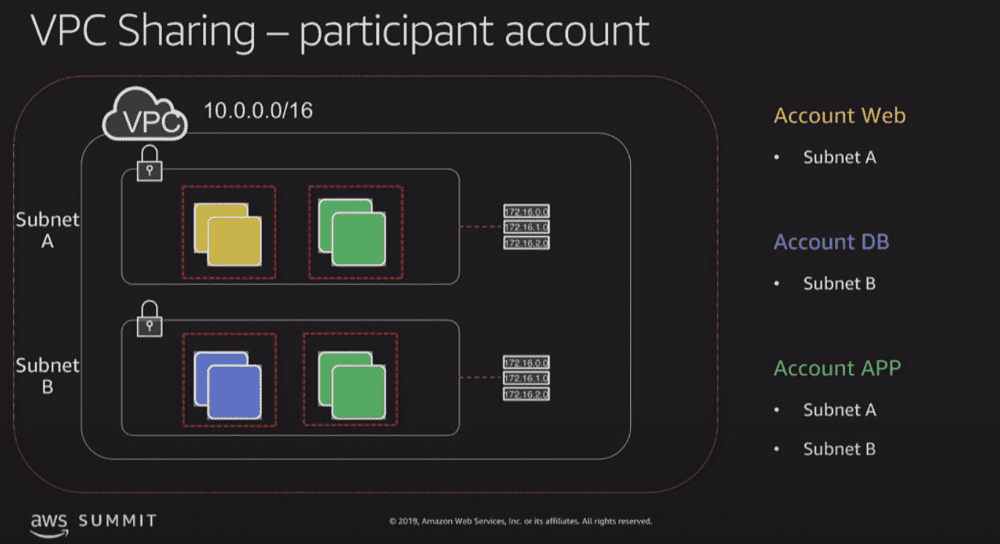

장점 

- VPC를 적게만드니 IP space를 절약할수있음
- VPC peering 필요없어짐 - 같은 AZ에선 같은 VPC 이므로 data transfer비용이 사라진다
- 역할분리가 된다

## VPC endpoints

### Gateway VPC endpoints

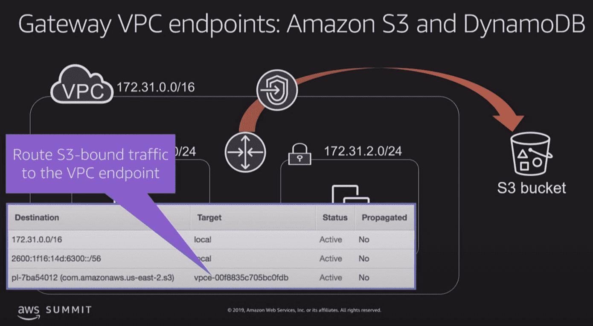

S3과 dynamoDB를 public안타고 VPC 내부에서 접근할수있음

### Interface VPC Endpoints

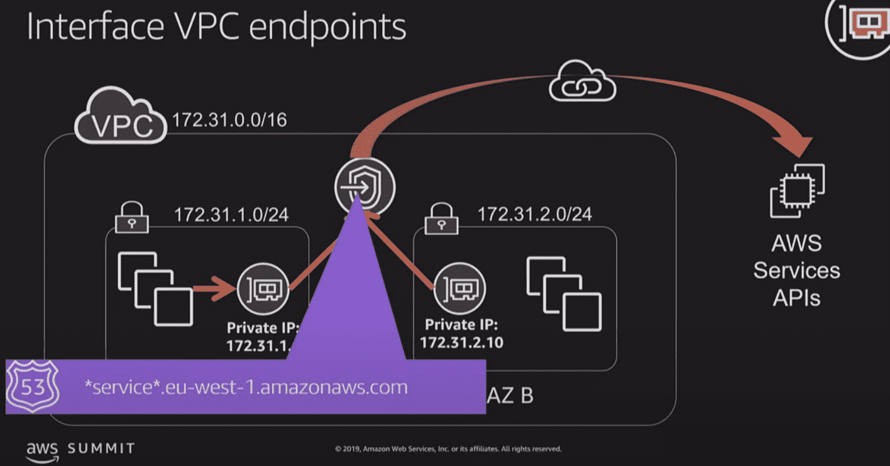

s3, dynamoDB 말고 다른 모든 service를 AWS Services API를 통해 VPC 내부에서 접근가능

### AWS Private Link

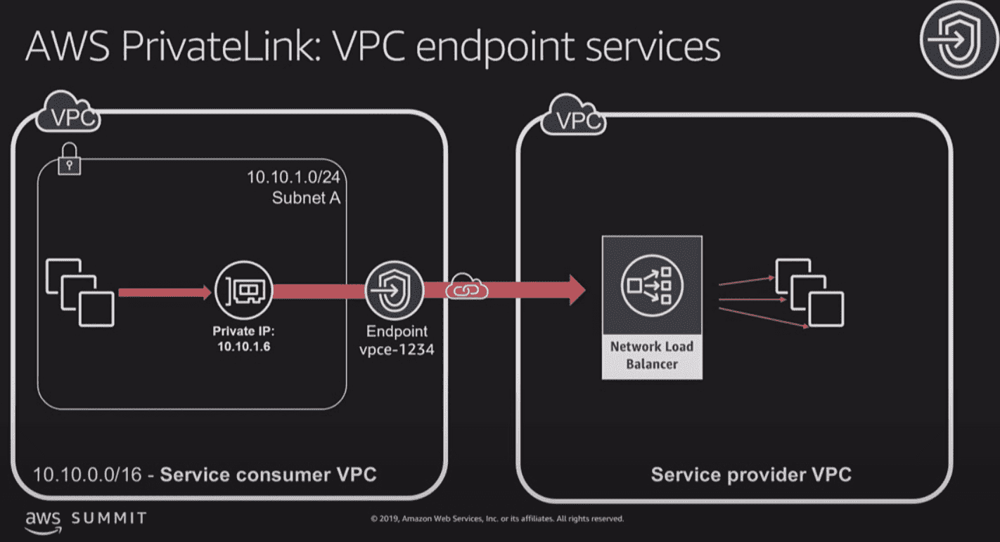

특정 서비스의 port만 열어줄 수 있는 기능, connectivity도 단방향임 (consumer service가 provider로는 찌를수있어도 역방향 안됨), IP address 신경안써도됨

## Amazon Global Accelerator

public service인데 global하게 availability, performance를 향상시키기 위함, TCP/UDP 지원

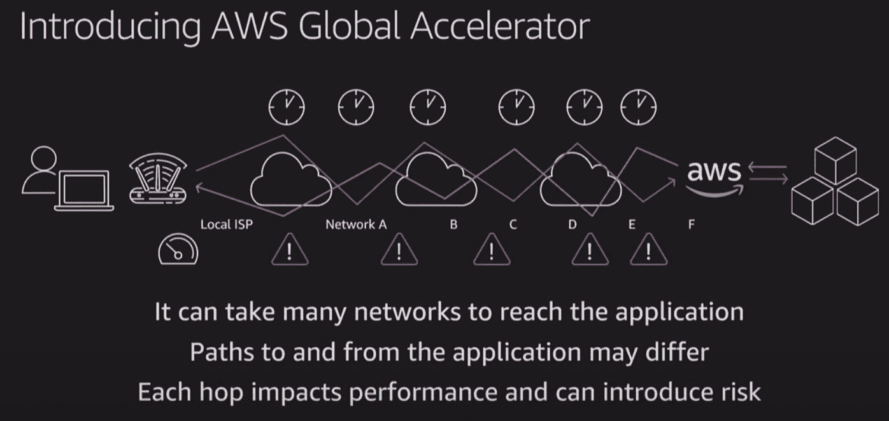

원래는 여러 network provider를 거치면서 latency나 connecitivity issue가 생길수있음

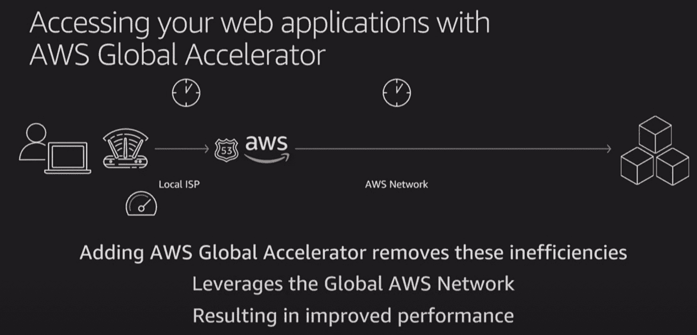

user와 가까운 곳에서부터 AWS dedicated line을 타고 감 (비싸겠당)