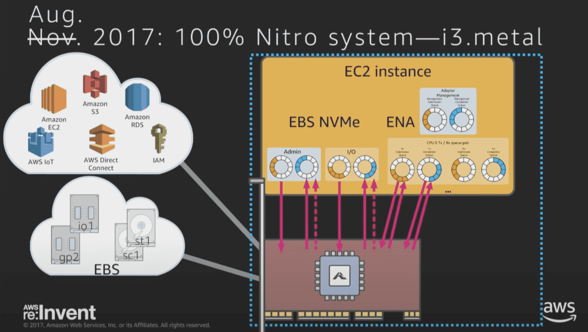
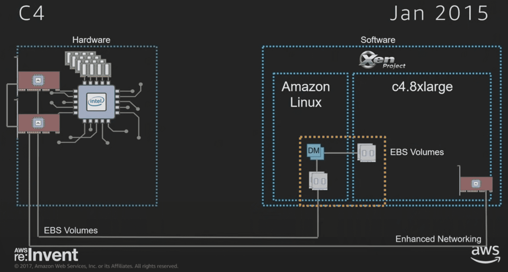
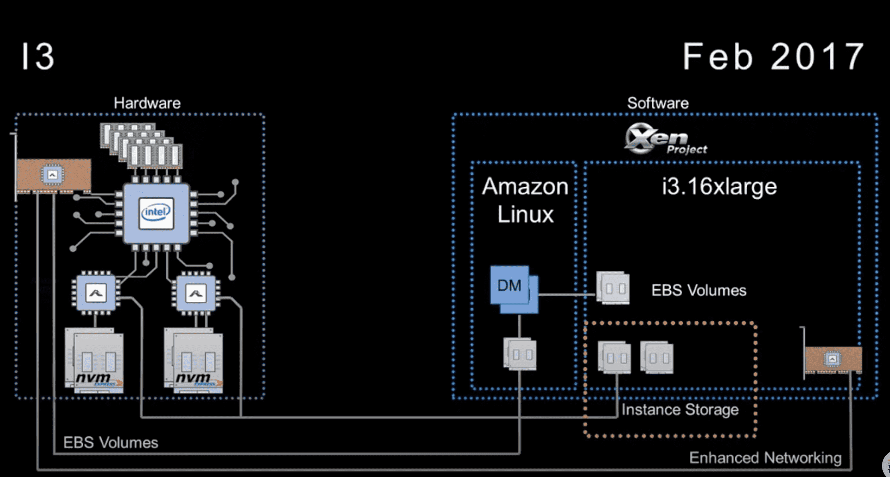

**{{ page.description }}**

# ****AWS re:Invent 2017: NEW LAUNCH! Amazon EC2 Bare Metal Instances (CMP330)****

[AWS re:Invent 2017: NEW LAUNCH! Amazon EC2 Bare Metal Instances (CMP330)](https://www.youtube.com/watch?v=o9_4uGvbvnk)

ec2 instance를 baremetal로 만들었음 (re:invent 2017 tuesday night live에 highlight가 있다, 여기는 디테일) 

goal: customer workload가 system resource를 전부다 활용하고 baremetal과 구분못하는 수준이되는것. (2013년에시작한프로젝트)

hardware feature를 이용해 hypervisor를 bypass하고싶다. 4년전에 인텔의 directed IO에 대한 virtualization인 VT-d와 PCI에 대한 SR-IOV를 사용해서 hypervisor를 bypass하고 여러 instance간 device sharing을 하려 했다.  

 시장에 많은 network offload card가(그림의 초록색 칩) 있었고 대다수는 hardware loadbalancer를 목적으로 사용했다. 이걸 로 network processing과 VPC software-defined network를 dedicated hw (network card)에 오프로딩 할수있었다. 하지만 이건 SR-IOV를 지원하지않았다. 따라서 intel의 10G인 82599 NIC을 붙여야했다. offload card는 bump-on-the-wire (네트워크용어..)의 역할을 하고, 82599 chip의 virtual function이 끝까지 전달된다(뭔뜻..). networking offloaded hardware와 hypervisor bypass는 3개의 instance가 20%의 network bandwidth를 더쓰했고, 50%의 latency개선이 생겼다.

다음 스텝은 EBS를 가상화하는건데, 당시 network offloading은 일반적이었지만, native block storage interface를 제공하는게 없었다. I-SCSI처럼 EBS volume을 network protocol을 타도록 만들 수도 있었고, 2008년에 나온 I-SCSI for EBS가 있지만, EBS가 block device로 동작하며 불필요한 I-SCSI initiator설정이나 network stack overhead가 없길 바랬다.

native block storage interface를 제공할 수 있는 hw를 찾다가 fabless seminconductor 회사인 annapurna labs를 만났다. 이회사의 칩은 networking, storage 둘다 처리가능하며 SR-IOV도 지원했다. vmware나 annapurna labs는 묻기도전에 우리의 니즈를 알고있었다. 안나푸르나로 2세대 nitro offload card를 만들기로했다. 

안나푸르나는 NVMe의 얼리어답터였다. nvme는 flash storage를 PCI-E로 직접연결하는 것이다. 안나푸르나 칩은 nvme storage device가 network interface로 동작하게 하는거였는데 이게 우리가 EBS offloading을 위해 필요로 하던 것이었다. NVMe는 CPU단위 dedicated queue를 가져서 단일 CPU가 IO를 할수있고, IO가 끝나고 나서 다른 CPU들로 재분배할 필요가 없다. interrupt가 많아도 networking의 multi queue처럼 scale out이가능하다. NVMe for EBS로 소비자들에게 common block device interface를 제공할 계획을 했다.

2015년도에 만든 C4 instance에서 EBS가 어떻게 연결되는지 그림이다. networking은 안나푸르나 칩을 통해 2013년과 비슷하게 만들었다. 또한 c4 instance가 82599 chip 기반의 향상된 networking을 지원한다. NVMe interface가 EC2에서 unified storage interface의 미래이지만, NVMe로 EBS를 노출할 준비는 안되어있었고, NVMe를 지원하는 driver와 customer AMI도 필요했다. dom0라고 부르는 management VM을 실행하는 linux kernel part는 EBS volume을 접근하기 위해 NVMe driver를 이용하고, Xen 위에서 동작하는 EC2 instance는 block/network device를 접근할때 virtual split driver model을 활용한다. dom0는 EC2 instance로부터 shared ring을 통해 request를 받고, request를 복사해서 nvme request로 바꾸고 요청이 완료되면 response를 shared ring에 리턴한다. EBS server와 통신하기 위해 필요한 모든 프로세싱과 EBS encrypted volume에 필요한 암호화 연산은 nitro card에서 수행한다. 즉 더 많은 리소스를 ec2 instance에게 제공할 수 있다. C4의 가장 큰 인스턴스에서 12%의 향상이 있었다. dom0에서 EBS traffic을 처리하기 위해 dedicated core가 필요없어졌기 때문이다.

다음은 local nvme storage다. 안나푸르나 칩은 nvme stroage를 network device로 만들어 EBS offloading하기 짐지하만마 lac la saa storage로도 사용할수 있다. 하지만 storage 발전으로 capacity가 점점 늘어나는데, intel core에서 동작하는 softare기반의 virtualization으로는 다음세대 storage device의 capability를 다 활용할수 없게될것이다. cpu를 엄청쓰는 작업이 될것이다. 

nitro network card를 통해 network와 storage를 보호할수있따 (firmware command 등이 막혀있음). 또한 모든 customer data를 암호화한다. key는 local nvme nitro card에만 있다. 안나푸르나 SoC 를 통해 hw encyrption을 한다. key는 flash에 저장되지 않는다. instance가 종료되면 key를 제거해서 데이터를 접근불가능하게한다. 이로써 nvme가 scalable building block이 되었다. 8개 nvme device로 3M iops를 처리할수있으며, FPGA instance에선 더 작은 local storage device도 제공한다

i3 instance는 많은양의 데이터를 빠르게 전달할수있는 network가 필요하다. i3은 25gbps ethernet이 필요하다. 하지만 intel 82599 chip은 10gbps까지만 지원한다. 그래서 안나푸르나와 같이 새 networking interface를 만들었다. Elastic Network Adapter(ENA)는 NVMe와 비슷하게 multiple queue 컨셉을 가지고 있다. ENA는 25gbps 이상을 지원한다.

i3, r4, x1, f1같은 instance들은 enhanced networking을 가졌다. intel 82599 chip을 없앴고 비용이 줄어들었다. 이 instance들은 ENA interface는 nitro card를 통해 HW를 direct로 지원한다.

다음 스텝은 dom0에서 동작하는 나머지 software를 제거하는 것이다. c5는 nitro에서만 동작하고 intel host resource를 사용하는 dom0 VM을 없앴다. VPC를 설정하면 network overlay를 배포하고, 모니터링으로 cloud watch metric도 쏜다.

i3.metal은 100% nitro system을 사용하는 instance

2개의 intel processor가 QPI(Quick Path Interconnect)로 연결, 512GiB RAM, 8개의 1.9TiB NVMe SSD, nitro card는 network/EBS storage 두개를 위해 각각 회선 한개씩연결, nvme local storage를 지원하기 위해 여러 nitro card가 연결됨(가운데 aws chip인가). host processor 도움없이 encyprtion, monitoring등을 하게됨(성능향상요인).

firmware, malware로부터 어떻게 보호하는가? security chip은 메인보드와 직접연결된다. 모든 bus traffic은 이 칩을 통과한다(이쪽은 지식이 없어서패스..)

`lspci -q -d 1d0f:* | grep -v bridge`

- Ethernet controller: ENA controller
- Serial controller: output log, gate console output API에서 조회가능
- nvme controller
    - Device 0061: EBS volume
    - 나머지: local NVMe storage

`sudo nvme list | cut -cl-78`

- /dev/nvme0n1: EBS
- 나머지: Local

# AWS re:Invent 2017: C5 Instances and the Evolution of Amazon EC2 Virtualization

[AWS re:Invent 2017: C5 Instances and the Evolution of Amazon EC2 Virtualization (CMP332)](https://www.youtube.com/watch?v=LabltEXk0VQ)

위 instruction은 privileged라서 trap이 발생한다.

모든 modern processor는 multiple privilege level을 가진다.

processor가 virtualizable 하기 위해선 1) unprivileged mode에서 privileged instruction을 실행하면 trap이 발생해야하고, 2) privileged software가 trap을 발생시킬수 있어야한다. 

Trap은 VMM(Virtual Machine Monitor)로 전달된다. VMM은 해당 instruction을 emulate한다. STI는 special register를 수정하고 결과를 push하는건데, VMM은 이 명령을 받아 가짜 register에 넣고 stack에넣고를 수행한다. 그럼 다음 명령이 수행된다.

VMM은 hypervisor의 가장 중요한 파트이다. 거의 대다수의 instruction이 emulate이 아닌 native로 동작하게될경우를 virtualization이라 정의한다. 현대 hypervisor는 million~billion instruction중 한개정도가 emulate이다. 거의 대다수가 baremetal로 실행되므로 이런 virtualization platform은 좋은성능을가진다. VMM은 거의 대부분을 수행하지만 모든걸 수행하는건아니다. 이게 nitro system이 동작하는방식이다. 

in 명령은 hw와 상호작용하는 케이스다, VMM은 device와 상호작용하는 명령을 software로 구현한다. 대다수 hypervisor는 virtual hardware에서 직접 수행하지 않는다(이해x..)

현대 hypervisor는 VMM과 많은 device model로 구성된다. 가장 복잡한 부분은 device model이다. hypervisor엔 scheduler, memory manager, monitoring, logging 등도 있다. 이게 1974년도에 에 나온 VM paper내용이다.

2006년, trap을 수행하지 않는다 HW가 효율적으로 수행하지않기때문. 그리고 대부분 linux 를 사용하고 trap되지 않은 명령의 위치를 찾아 trap을 수행하는 hypervisor와의 상호작용으로 바꿔 virtualization을 구현한다. 이것을 paravirtualization이라 부른다.

trap을 적게 수행할수록 성능이 좋아진다. 현재는 paravirtualization based guest를 지원하지않는다. 이것보다 hw 기반으로 하는게 더 빠르다. 

업계 표준이었던 software 기반 hypervisor보다 더 빠르게 할 수 있을까?

device simulation(device models)도 봐야한다. VMM은 low-touch(접점이적다?)인데, modern virtualization hw는 trap해야하는 instruction 수가 매년 줄어고 hw가 점점 처리한다. 반면 device model은 챌린징하다. 많은 device model과 software를 구현해야하는 복잡도도 있고, instance resource와 직접 경쟁해야 한다.

hypervisor를 쪼개서 high-level view를 보고 component들을 재배치해서 성능을 높일 방법을 생각했다.

customer resource와 경쟁해야 한다. 여기선 instance가 hw device를 직접 접근하는 경우가 없다. 즉 모든 packet, device, io가 CPU에서 동작하는 software를 통하는것이다. 

c3은 enhanced networking을 가짐, 특히 jitter(hw jitter를 말하나봄)에서 향상이 있었다. card를 한개 더 추가했다. c3는 hardware와 직접 통신한다(오른쪽밑)

안나푸르나 랩이 remote storage를 nvme device로 보이도록 하는 칩을 만들었다. c4 instance의 block front device는 실제로 management partition에서 nvme device로 보인다. nvme 앞에 Device model을 그대로 둔 이유는(software를 거친 이유) 여러 os에 걸친 drive echosystem도 있고, 생각할시간도 필요했다 (nvme가 신기술인데 device model을 떼는게 나은건지 아닌지). 중요한건 대부분의 무거운 작업들은 dedicated hw로 넘어갔고, management partition에서 EBS를 지원하기 위해 resource 경쟁을 할필요가없어졌다. 따라서 CPU를 고객에게 더 제공할수 있었다.

x1은 ENA 들어감, ENA는 ec2를 위해 디자인했다. 

으흠 첫영상내용이랑 중복된게많아서 영상 그만보기로

# The Nitro Project: Next-Genration EC2 Infrastructure

[The Nitro Project: Next-Generation EC2 Infrastructure - AWS Online Tech Talks](https://www.youtube.com/watch?v=eWFEJmsddV0)

두번째영상이랑 같은내용..

instant storage 도입, 근데 device model이 다시필요해짐, 물론 offload를 할 수 있다 → 다음세대

이전세대 i2는 8개 ssd로 385KIOPS를 찍는다.

nitro ASIC을 통해 offload, is instance와 nvme가 직접 통신한다.

VMM은 instruction emulation만 수행하면된다. 

full nitro architecture. managment partition이 존재하지 않는다. software device model을 없앴기때문, c5 18x instance에 72 vcpu가 있는데 이 전체 resource를 고객이 쓸 수 있다. 메모리도 다쓴다.

KVM은 VMM component를 떼어내기 좋은 구조였다. nitro nypervisor는 vmm만 있다. trap emulation만 수행한다. 

i3.metal은 nitro security processor가 들어갔다

# AWS re:Invent 2018: Powering Next-Gen EC2 Instances: Deep Dive Into the Nitro System

[AWS re:Invent 2018: Powering Next-Gen EC2 Instances: Deep Dive into the Nitro System (CMP303-R1)](https://www.youtube.com/watch?v=e8DVmwj3OEs)

- Nitro Cards
    - VPC Networking
    - Amazon EBS
    - Instance STorage
    - System Controller
- Nitro Security Chip
    - Intergrated into motherboard
    - Protects hardware resources
    - Hardware Root of Trust
- Nitro Hypervisor
    - Lightweight hypervisor
    - Memory & CPU allocation
    - Bare Metal-like performance

이 4개 카드 (Nitro Card for VPC, Nitro Card for EBS, Nitro Card for Instant Storage, Nitro Controller)는 서로 다른 칩들이다. 하지만 같은 ASIC 기반이다. 

OS는 normal network adapter처럼 보인다. 고객은 network 사양을 높이려면 instance type을 바꾸기만하면된다. ntiro card for VPC는 VPC data plane이므로 VPC내의 다른 instance와 통신할수있게해준다. security group은 data origin에 최대한 가깝도록 card에 자체에 구현되어있다. 따라서 instance의 config에 의존하지 않는다. 같은 instance type이면 어떤 node에서든지 일관된 network성능을보여준다. 

nvme interface를 network traffic으로 보여줌. hw based encryption이므로 성능문제를 신경쓰지않아도됨 

1G시절에는 hdd 여러개를 써서 성능을 높여야했는데, 10g가 되니 storage performance도 감당가능해져서 remote storage를 도입할수있게됨. 근데또 nvme가 나오면서 bandwidth가 엄청필요해짐, 어떤 인스턴스에선 128gbps까지도 필요하다. nvme의 장점은 터지지않는다??(hdd는 터지나..?), 단점은 wear out이 있다. wear out이 일어나면 application performance가 저하되는데 이건 고객이 모니터링하지않는다. nitro card for instance storage에서 wear를 모니터링한다. “모니터링을 위해 hypervisor에 의존하지않는다”

ec2의 control plane 

hypervisor는 hw와 다른 guest os간 isolation을 제공해줘야한다. 

Firecracker는 virtualization과 serverless를 연결해준다.

security, isolation, consistency VS speed, flexibility, performance

- security가 가장 중요, 근데 간단해야함 → firecracker는 serverless app을 실행하기 위한 최소한의 것만 가지고있다, 다른건 없다 (alpine image같은 컨셉을 말하는걸까)
- speed: 500ms 동안 동작하는 앱을 lambda에 띄울때 init하는 10초를 기다리고싶진않을것이다.
- scale ←→ efficiency: 한개 서버에 200개정도의 vm이 돌아감, 근데 lambda는 최소 128mb를 필요로한다. 따라서 firecracker는 memory footprint를 최소화해야함, 4k firecracker vm을 띄우면 실제로는 image당 5mb정도만쓴다

오픈소스화했당

- latency critical workload가 돌아가는데 GC로 인해 stop-the-world가 발생하면 안된다 → rust는 GC가 없다
- firecracker는 lambda, fargate에서 사용중

# ****AWS re:Invent 2018: Amazon EC2 Instances & Performance Optimization Best Practices (CMP307-R1)****

[AWS re:Invent 2018: Amazon EC2 Instances & Performance Optimization Best Practices (CMP307-R1)](https://www.youtube.com/watch?v=W0PKclqP3U0)

c5_m5_checks_script.sh 를 이용하면 nvme, ena, fstab 볼수있음

ami가 ena-support인지 확인가능

[Configure your Amazon Linux instance](https://docs.aws.amazon.com/AWSEC2/latest/UserGuide/Configure_Instance.html)

[New C5n Instances with 100 Gbps Networking | Amazon Web Services](https://aws.amazon.com/blogs/aws/new-c5n-instances-with-100-gbps-networking/)

HPC나 ML에서 100gbps network bandwidth 가능

C5n (compute짱), P3dn(ML tarining 짱) + Elastic Fabric Adapter for HPC

`lstopo-no-graphics --of ascii -rect`

thread per core, L1 L2 L3 cache, data cache,  main memroy 등.

lscpu, cat /proc/cpuinfo 는 base frequency기반, turbostat은 실제 frequency를볼수있다

htop굿

nethogs, 모든 bandwidth가 어디로가는지 볼수있다

이 밑 영상들은 중복인게 많다

[AWS re:Invent 2019: Powering next-gen Amazon EC2: Deep dive into the Nitro system (CMP303-R2)](https://www.youtube.com/watch?v=rUY-00yFlE4)

[AWS re:Invent 2020: Powering next-gen Amazon EC2: Deep dive on the Nitro System](https://www.youtube.com/watch?v=e1_UJTgyFqM)

[AWS re:Invent 2021 - Powering next-gen Amazon EC2: Deep dive on the Nitro System](https://www.youtube.com/watch?v=2uc1vaEsPXU)

[AWS re:Invent 2022 - Powering Amazon EC2: Deep dive on the AWS Nitro System (CMP301)](https://www.youtube.com/watch?v=jAaqfeyvvSE)