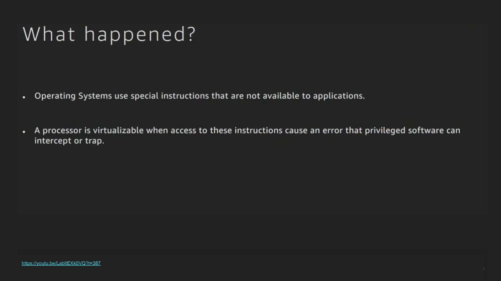
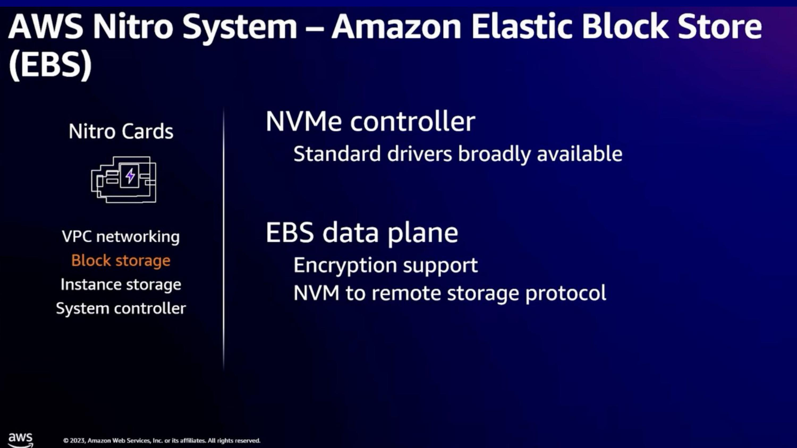
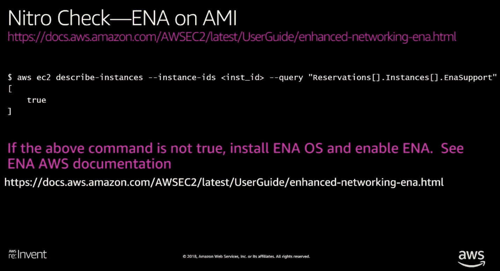

**{{ page.description }}**

 틀린 내용이 있을 수 있습니다. 정정해주시는 코멘트를 남겨주신다면 감사하겠습니다.

## Hypervisor

<em><a href="https://www.starwindsoftware.com/blog/type-1-vs-type-2-hypervisor-what-is-the-difference">Hypervisors: Type 1 vs Type 2. [PART 1]</a></em>

- Type 1 Hypervisor
  - Host OS 없이 동작하는 hypervisor
  - 이 글에서 나오는 Hypervisor는 Type 1임
- Type 2 Hypervisor
  - VirtualBox 같이 Host OS위에서 애플리케이션으로 돌아가는 hypervisor

## Virtualization

<em><a href="https://youtu.be/LabltEXk0VQ?t=252">https://youtu.be/LabltEXk0VQ?t=252</a></em>

Virtualization이란 무엇인가? 갑자기 instruction level로 가보자.. (슬라이드에서 instruction을 이해할 필요는 없습니다)

어떤 명령(instruction)은 그냥 실행이 가능한 반면, 어떤 명령은 불가능하다.

<em></em>

`sti` instruction은 process 스스로 실행이 불가능함.

linux application으로 virtualization 없이 이런 instruction을 실행한다면 crash가 발생하게될 것

이런 instruction을 privileged instruction이라고 함

<em></em>

모든 processor들은 multiple privileged level을 가짐

Virtualizable 조건중 하나: unprivileged mode에서 privileged instruction을 수행할때 trap이 발생해야 한다.

<!-- 여기서 processor가 이런 privileged instruction에 대해 에러를 발생시켜 privileged software(hypervisor)가 emulate해줄 수 있다면. -->

<em></em>

`sti` 같은 instruction을 unprivileged mode에서 실행한다면 error를 발생시키고 이 instruction을 VMM(Virtual Machine Monitor)에게 전달.

VMM은 instruction을 받아 emulate해줌

- `sti`는 특정 register 하나를 변경하고 결과를 stack push함
- VMM은 이 역할을 가짜로 수행해서 stack push함

<em></em>

Virtualization의 요구사항
- 대다수의 instruction이 native(unprivileged)로 동작해야한다.
  - modern hypervisor는 10억개중에 1개정도의 instruction만이 emulate됨

하지만 VM은 대부분을 처리하지만, 모든걸 처리해주진 못함. 어떤 hardware와 엮여있느냐에 따라서도 달라짐

<em></em>

Hypervisor는 VMM과 device model(device를 emulate하거나, 연결하는데 사용)들, scheduler, memory manager, logging등으로 구성됨

hypervisor의 성능을 올리기 위해, 수행하는 대부분의 작업은 device model에 존재하며, 이게 hypervisor를 복잡하게 만듦.

<em><a href="https://youtu.be/LabltEXk0VQ?t=764">https://youtu.be/LabltEXk0VQ?t=764</a></em>

EC2가 처음 출시된 2006년, 70년대부터 존재한 virtualization이었지만, 당시 intel/amd processor들은 trap을 잘 처리하지 못했음.

HW가 trap을 효율적으로 처리하지 못하니 virtualization이 인기가 없어 지원하지 않았던것임.

하지만 Xen에서 이 문제를 다른 방식으로 해결했는데, guest OS를 수정해서 trap을 수행하는 대신 직접 VMM을 호출하도록 변경 (Paravirtualization)

<em><a href="https://www.cl.cam.ac.uk/research/srg/netos/papers/2003-xensosp.pdf">Xen and the art of virtualization (SOSP '03)</a></em>

Full virtualization

- guest OS를 수정하지 않고 trap이 발생하면 해당 instruction을 보고 필요한 행동을 수행, 성능이 저하되는 원인

Paravitualization (Xen)
- guest OS를 수정해서 Full virtualization에서 수행하던 translation을 제거 -> 오버헤드 감소
- Dom0라 불리는 special guest OS만이 device와 직접 통신하고, 다른 guest OS들은 device호출을 Dom0에게 요청하는 형태
- hypervisor가 L0의 privileged level을 가지고, guest OS는 L1, user application은 L3

## Toward Nitro System

<em><a href="https://youtu.be/LabltEXk0VQ?t=905">https://youtu.be/LabltEXk0VQ?t=905</a></em>

2012년 AWS의 고민

- software로만 동작하는 (Xen) Hypervisor보다 더 좋은 성능을 낼 방법 필요
- Hypervisor는 guest OS와 CPU/memory usage를 공유하고 있는 상황, 성능 모두를 guest OS가 쓰게 해줄 수 없음
- (당시) 대부분의 hypervisor는 hw agnostic이지만, AWS는 datacenter를 가지고 있으므로 수직 최적화가 가능함

<em><a href="https://youtu.be/LabltEXk0VQ?t=1003">https://youtu.be/LabltEXk0VQ?t=1003</a></em>

Nitro가 없던 시절 인스턴스

Xen을 사용하고 있었으므로, dom0역할을 하는 OS내에 storage, EBS, network에 해당하는 Device model 존재

따라서 모든 device 요청은 dom0를 통해 수행되며, 이때마다 user instance (guest OS)와 리소스를 두고 경쟁할수밖에없음

<em></em>

network를 HW로 offloading한 첫 인스턴스

당시 시장에 나와있는 network card로 network processing, VPC를 offloading 할 수 있었음.

하지만 SR-IOV(Single Root IO Virtualization)를 지원하는 card는 없었는데, 이는 PCIe device를 가상으로 노출시켜주는 기능임. network card를 한개 꽂고 멀리 있는 storage를 EBS로 노출시킨다거나 하는데 필요함

이를 해결하기 위해 intel 82599 chip을 nitro card와 연결했고, network device model을 guest os가 직접 접근할 수 있도록 수정

<em></em>

EBS offloading을 보여주기 위해 NVMe에 대한 간단한 소개.

NVMe는 PCIe에서 ssd를 연결하기 위해 만들어짐. 따라서 EBS offloading이 가능. cpu마다 dedicated submission/completion queue가 있어 각 cpu가 io를 직접할수있음

<em></em>

Nitro card에서 network interface로 NVMe를 지원하게 만들었음.

network와 달리 완전히 offloading하진 않고 Device model을 유지했는데, 당시 NVMe는 새 기술이었고 여러 guest OS에 적용하기엔 시기상조였으므로 호환성을 위해서 Device model을 유지함

하지만 EBS를 guest OS가 쓰기 위해서 dom0가 ebs를 관리하던것들은 모두 nitro card로 offloading 되었음

<em></em>

ENA(Elastic Network Adapter) 도입과 함께 완전한 nitro card 를 도입.

이전세대의 nitro card는 SR-IOV를 위해 intel 82599 chip을 필요로 했으나, 이 chip은 10gbps만 지원하므로 bandwidth에 한계가 있었음.

Nitro card에서 NVMe의 컨셉을 따라서 network를 지원하게 만들고, SR-IOV도 내장시켜 intel 82599 chip은 제거하여 25gbps까지 가능해짐

<em></em>

i3에선 (Local) instance storage offloading도 하였음.

nitro card가 ebs에서 쓰이던 암호화 연산을 하는것을 instance storage에서도 활용하고, dom0의 device model은 제거하며 guest OS가 직접 instance storage와 통신하게됨

<!-- 

<em></em>

지워도될것같다. -->

<em><a href="https://youtu.be/eWFEJmsddV0?t=1259">https://youtu.be/eWFEJmsddV0?t=1259</a></em>

EBS device model을 제거 - NVMe에 시장에 안착된것과 여러 OS에서 지원하고있으므로

또한 device와 통신하기 위해서 존재하던 dom0가 제거되며, Xen Hypervisor도 오로지 VMM 역할만 하는 Nitro Hypervisor로 변경됨

따라서 Hypervisor가 device와 통신하는 부분을 software로 관리하던 모든 컴포넌트 (dom0)가 사라지고, nitro card로 offloading되어 baremetal에 가까운 성능을 낼 수 있게 됨

<em><a href="https://youtu.be/Cxie0FgLogg?t=362">https://youtu.be/Cxie0FgLogg?t=362</a></em>

이전까지 나왔던 내용의 요약. Nitro 이전
- Xen 위에서 실행
- Dom0 VM이 디바이스와 통신을 담당

<em><a href="https://youtu.be/Cxie0FgLogg?t=362">https://youtu.be/Cxie0FgLogg?t=362</a></em>

Nitro가 모두 도입된 그림
- Xen hypervisor는 사라지고 Nitro hypervisor (privileged instruction만 처리)
- Device model은 Nitro card로 offloading되었음
- User instance는 SR-IOV를 통해 Nitro card와 직접 통신

## VPC Networking

<em><a href="https://youtu.be/Cxie0FgLogg?t=574">https://youtu.be/Cxie0FgLogg?t=574</a></em>

- Nitro card 에서 제공해주는 4개 기능중 하나인 VPC networking에 대한 소개
- 이중 ENA Express, EFA에 적용된 SRD를 봐보자.

## SRD (Scalable Reliable Datagram)

<em><a href="https://youtu.be/Cxie0FgLogg?t=593">https://youtu.be/Cxie0FgLogg?t=593</a></em>

- TCP는 single path만 사용하지만 datacenter network는 multipath가 가능하다
- 또한 multipath라면 congestion에 대해 더 빠른 대응이 가능하다
- SRD가 multipath를 활용해서 패킷을 전달
- HPC workload의 경우 P50 latency가 괜찮더라도, tail latency가 느리다면 전체적으로 느려진다

<em><a href="https://youtu.be/Cxie0FgLogg?t=660">https://youtu.be/Cxie0FgLogg?t=660</a></em>

- SRD를 적용했을때, 선형적인 성능향상이 나온다.
- TCP는 congestion으로 인해 goodput이 떨어짐

<em><a href="https://youtu.be/Cxie0FgLogg?t=739">https://youtu.be/Cxie0FgLogg?t=739</a></em>

- TCP는 link failure가 생기게 되면 backoff를 시도하고, timeout까지 기다린다.
- timeout이 발생하면 커넥션을 다시생성해야 하므로 오버헤드가 크다.
- TCP는 out of order packet을 잘 처리하지 못하기때문에 multipath를 쓰기 힘들다.

<em><a href="https://youtu.be/Cxie0FgLogg?t=739">https://youtu.be/Cxie0FgLogg?t=739</a></em>

- 하지만 SRD는 여러 경로를 사용하고 backoff 대신 reroute를 하게 됨

<em><a href="https://assets.amazon.science/a6/34/41496f64421faafa1cbe301c007c/a-cloud-optimized-transport-protocol-for-elastic-and-scalable-hpc.pdf">A Cloud-Optimized Transport Protocol for Elastic and Scalable HPC</a></em>

| | 패킷 전달 보장 | 패킷 순서 보장 |
|-|-|-|
| UDP | X | X |
| SRD | O | X |
| TCP | O | O |

- TCP: latency-sesnitve하지않다, lost packet처리가 느림
- RoCE(RDMA over Converged Ethernet) - Infiniband
  - priority flow control을 켜야함 - large scale network에선 키면 head-of-line blocking, congestion spreading, deadlock 생길수있음
- multipath loadbalancing
  - 모든 경로에 uniform하게 뿌림, hotspot을 피하고 suboptimal path를 찾기위함
  - srd를 안쓰는 legacy traffic과 동작할수있어야함 -> RTT를 통해 정보를 수집
  - Link failure -> unavailable해지면 network-wide routing update를 기다리지 않고 reroute -> 이게훨씬빠르고 connection re-establish필요없음
- out of order delivery
  - reordering: 비싸다, scalability이슈도있음. drop생기면 latency증가, 대부분 패킷은 drop과는 관계없으므로 delay는 불필요함,
  - out-of-order packet을 버리면 latency가 증가하고 network bandwidth도 낭비됨
  - 그대신 order정보를 윗 레이어에게 전달한다.
    - 윗 레이어가 바뀐 message semantic을 맞추어서 사용해야한다
- consgestion control
  - incast problem (특정 network device에 패킷이몰려서 buffer가 꽉차는현상)이 receiver network adapter에서 발생하기쉬움
  - 모든 경로에서 queueing를 줄여야한다.
  - minimum in-flight bytes 를 유지하며 bandwidth를 fair-share 해야함. congestion detection보단 preventing에 초점, in-flight byte limit이 있음
  - incoming ack packet의 타이밍 + RTT 변화 + 최근 transmission rate을 기반으로 connection의 현재 transmission rate을 업데이트
  - 대부분의 경로에서 RTT가 올라가거나, estimated rate이 낮아지면 congestion으로 판단

## EBS

<em><a href="https://youtu.be/Cxie0FgLogg?t=923">https://youtu.be/Cxie0FgLogg?t=923</a></em>

EBS도 SRD 활용

## Nitro SSD

<em><a href="https://youtu.be/Cxie0FgLogg?t=1019">https://youtu.be/Cxie0FgLogg?t=1019</a></em>

Nitro SSD에 대한 소개 전, SSD의 간단한 내부 구조 (SSD가 주 토픽은 아니니 짧게만 설명합니다)
- SSD는 block단위 erase, page단위 read/write해야하는 NAND의 특징
- 또한 erase로 인한 수명 이슈
- @@@ 좀더 알려줄수있잖아
- 이로 인해 FTL/GC/Wear leveling등의 테크닉이 필요함.
- GC는 request stall을 발생시킨다

- 하지만 여러 SSD를 같이 사용하게되면 예측불가능한 상황들이 많음 (특히 GC)
 - heterogeneous도 문제지만 homogeneous도 lifecycle이 다르다
- 이를 해결하기 위해 Nitro card에 FTL을 구현하고, 여러 Nand가 같은 FTL에서 관리되도록 함

## Graviton 3 System

<em><a href="https://youtu.be/Cxie0FgLogg?t=1698">https://youtu.be/Cxie0FgLogg?t=1698</a></em>

- 대부분 서버가 2 socket이지만 얘는 3socket
  - graviton3가 저전력이라 rack에 붙은 전력들을 더 사용가능하므로 socket을 추가했다
  - (근데 graviton4는 다시 2개다 https://youtu.be/T_hMIjKtSr4?t=1016)
- 각 3개 socket은 baremetal/virtual 상관없이 Nitro card에 의해 독립적인 lifecycle을 가짐

## Boot process

<em><a href="https://youtu.be/Cxie0FgLogg?t=1785">https://youtu.be/Cxie0FgLogg?t=1785</a></em>

부팅 과정
1. Control plane에서 Nitro controller에게 부팅 요청
2. Nitro Controller는 Hypervisor에게 요청을 전달
3. Hypervisor가 instance resource 할당 (한개 Nitro host에 여러 VM이 들어갈 수 있음)
4. 셋업이 완료되면 Nitro card에게 device attach 명령
5. Nitro card가 ENA/EBS/Local storage등을 attach함
6. 인스턴스 시작 명령
8. EBS volume을 보고 boot code 실행

baremetal instance인 경우 부팅하는 주체가 CPU가 아닌 Nitro card가 됨 (Hypervisor가 없으므로)

## Mac Instance (Baremetal)

<em><a href="https://youtu.be/Cxie0FgLogg?t=1931">https://youtu.be/Cxie0FgLogg?t=1931</a></em>

mac instance
- ENA와 EBS는 붙지만 local storage는 없음
  - 맥에 내장된 ssd를 아에 안쓰는것일지도
- Nitro card는 PCIe이지만 mac mini엔 PCIe socket이 없으므로 thunderbolt를 통해서 연결
- Nitro controller는 머신 부팅을 위해 부팅스위치와 연결
- 이런 방식으로 다른 baremetal machine들도 연결 가능

# References
[Hypervisors: Type 1 vs Type 2. [PART 1]](https://www.starwindsoftware.com/blog/type-1-vs-type-2-hypervisor-what-is-the-difference)

[AWS re:Invent 2017: NEW LAUNCH! Amazon EC2 Bare Metal Instances (CMP330)](https://www.youtube.com/watch?v=o9_4uGvbvnk)

[AWS re:Invent 2017: C5 Instances and the Evolution of Amazon EC2 Virtualization (CMP332)](https://youtu.be/LabltEXk0VQ)

[The Nitro Project: Next-Generation EC2 Infrastructure - AWS Online Tech Talks](https://www.youtube.com/watch?v=eWFEJmsddV0)

[AWS re:Invent 2020: Powering next-gen Amazon EC2: Deep dive on the Nitro System](https://www.youtube.com/watch?v=e1_UJTgyFqM)

[AWS re:Invent 2023 - Deep dive into the AWS Nitro System (CMP306)](https://www.youtube.com/watch?v=Cxie0FgLogg)

[AWS re:Invent 2023 - AWS Graviton: The best price performance for your AWS workloads (CMP334)](https://youtu.be/T_hMIjKtSr4)

[Take a look inside the lab where AWS makes custom chips](https://www.aboutamazon.com/news/aws/take-a-look-inside-the-lab-where-aws-makes-custom-chips)

[Xen and the art of virtualization (SOSP '03)](https://www.cl.cam.ac.uk/research/srg/netos/papers/2003-xensosp.pdf) ([Slides](https://cseweb.ucsd.edu/~yiying/cse291-fall22/reading/Para-Virtualization.pdf))

[A Cloud-Optimized Transport Protocol for Elastic and Scalable HPC (IEEE Micro '20)](https://assets.amazon.science/a6/34/41496f64421faafa1cbe301c007c/a-cloud-optimized-transport-protocol-for-elastic-and-scalable-hpc.pdf)

[Everything I know about SSDs](https://kcall.co.uk/ssd/index.html)

<!-- # **AWS re:Invent 2017: NEW LAUNCH! Amazon EC2 Bare Metal Instances (CMP330)**

[AWS re:Invent 2017: NEW LAUNCH! Amazon EC2 Bare Metal Instances (CMP330)](https://www.youtube.com/watch?v=o9_4uGvbvnk)

ec2 instance를 baremetal로 만들었음 (re:invent 2017 tuesday night live에 highlight가 있다, 여기는 디테일) 

goal: customer workload가 system resource를 전부다 활용하고 baremetal과 구분못하는 수준이되는것. (2013년에시작한프로젝트)

hardware feature를 이용해 hypervisor를 bypass하고싶다. 4년전에 인텔의 directed IO에 대한 virtualization인 VT-d와 PCI에 대한 SR-IOV를 사용해서 hypervisor를 bypass하고 여러 instance간 device sharing을 하려 했다.  

시장에 많은 network offload card가(그림의 초록색 칩) 있었고 대다수는 hardware loadbalancer를 목적으로 사용했다. 이걸로 network processing과 VPC software-defined network를 dedicated hw (network card)에 오프로딩 할수있었다. 하지만 이건 SR-IOV(Single Root I/O Virtualization, single PCIe device를 여러개의 logical devic    e로 보이게 하는것)를 지원하지않았다. 따라서 intel의 10G인 82599 NIC을 붙여야했다. offload card는 bump-on-the-wire (네트워크용어..)의 역할을 하고, 82599 chip의 virtual function이 끝까지 전달된다(뭔뜻..). networking offloaded hardware와 hypervisor bypass는 3개의 instance가 20%의 network bandwidth를 더 쓸수있게 해주고, 50%의 latency개선이 생겼다.

다음 스텝은 EBS를 가상화하는건데, 당시 network offloading은 일반적이었지만, native block storage interface를 제공하는게 없었다. I-SCSI처럼 EBS volume을 network protocol을 타도록 만들 수도 있었고, 2008년에 나온 I-SCSI for EBS가 있지만, EBS가 block device로 동작하며 불필요한 I-SCSI initiator설정이나 network stack overhead가 없길 바랬다.

native block storage interface를 제공할 수 있는 hw를 찾다가 fabless seminconductor 회사인 annapurna labs를 만났다. 이회사의 칩은 networking, storage 둘다 처리가능하며 SR-IOV도 지원했다. vmware나 annapurna labs는 묻기도전에 우리의 니즈를 알고있었다. 안나푸르나로 2세대 nitro offload card를 만들기로했다. 

안나푸르나는 NVMe의 얼리어답터였다. nvme는 flash storage를 PCI-E로 직접연결하는 것이다. 안나푸르나 칩은 nvme storage device가 network interface로 동작하게 하는거였는데 이게 우리가 EBS offloading을 위해 필요로 하던 것이었다. NVMe는 CPU단위 dedicated queue를 가져서 단일 CPU가 IO를 할수있고, IO가 끝나고 나서 다른 CPU들로 재분배할 필요가 없다. interrupt가 많아도 networking의 multi queue처럼 scale out이가능하다. NVMe for EBS로 소비자들에게 common block device interface를 제공할 계획을 했다.

2015년도에 만든 C4 instance에서 EBS가 어떻게 연결되는지 그림이다. networking은 안나푸르나 칩을 통해 2013년과 비슷하게 만들었다. 또한 c4 instance가 82599 chip 기반의 향상된 networking을 지원한다. NVMe interface가 EC2에서 unified storage interface의 미래이지만, NVMe로 EBS를 노출할 준비는 안되어있었고, NVMe를 지원하는 driver와 customer AMI도 필요했다. dom0라고 부르는 management VM을 실행하는 linux kernel part는 EBS volume을 접근하기 위해 NVMe driver를 이용하고, Xen 위에서 동작하는 EC2 instance는 block/network device를 접근할때 virtual split driver model을 활용한다. dom0는 EC2 instance로부터 shared ring을 통해 request를 받고, request를 복사해서 nvme request로 바꾸고 요청이 완료되면 response를 shared ring에 리턴한다. EBS server와 통신하기 위해 필요한 모든 프로세싱과 EBS encrypted volume에 필요한 암호화 연산은 nitro card에서 수행한다. 즉 더 많은 리소스를 ec2 instance에게 제공할 수 있다. C4의 가장 큰 인스턴스에서 12%의 향상이 있었다. dom0에서 EBS traffic을 처리하기 위해 dedicated core가 필요없어졌기 때문이다.

다음은 local nvme storage다. 안나푸르나 칩은 nvme stroage를 network device로 만들어 EBS offloading하기도 하지만 local flash storage로도 사용할수 있다. 하지만 storage 발전으로 capacity가 점점 늘어나는데, intel core에서 동작하는 softare기반의 virtualization으로는 다음세대 storage device의 capability를 다 활용할수 없게될것이다. cpu를 엄청쓰는 작업이 될것이다. 

nitro network card를 통해 network와 storage를 보호할수있따 (firmware command 등이 막혀있음). 또한 모든 customer data를 암호화한다. key는 local nvme nitro card에만 있다. 안나푸르나 SoC 를 통해 hw encyrption을 한다. key는 flash에 저장되지 않는다. instance가 종료되면 key를 제거해서 데이터를 접근불가능하게한다. 이로써 nvme가 scalable building block이 되었다. 8개 nvme device로 3M iops를 처리할수있으며, FPGA instance에선 더 작은 local storage device도 제공한다

i3 instance는 많은양의 데이터를 빠르게 전달할수있는 network가 필요하다. i3은 25gbps ethernet이 필요하다. 하지만 intel 82599 chip은 10gbps까지만 지원한다. 그래서 안나푸르나와 같이 새 networking interface를 만들었다. Elastic Network Adapter(ENA)는 NVMe와 비슷하게 multiple queue 컨셉을 가지고 있다. ENA는 25gbps 이상을 지원한다.

i3, r4, x1, f1같은 instance들은 enhanced networking을 가졌다. intel 82599 chip을 없앴고 비용이 줄어들었다. 이 instance들은 ENA interface는 nitro card를 통해 HW를 direct로 지원한다.

다음 스텝은 dom0에서 동작하는 나머지 software를 제거하는 것이다. c5는 nitro에서만 동작하고 intel host resource를 사용하는 dom0 VM을 없앴다. VPC를 설정하면 network overlay를 배포하고, 모니터링으로 cloud watch metric도 쏜다.

i3.metal은 100% nitro system을 사용하는 instance

2개의 intel processor가 QPI(Quick Path Interconnect)로 연결, 512GiB RAM, 8개의 1.9TiB NVMe SSD, nitro card는 network/EBS storage 두개를 위해 각각 회선 한개씩연결, nvme local storage를 지원하기 위해 여러 nitro card가 연결됨(가운데 aws chip인가). host processor 도움없이 encyprtion, monitoring등을 하게됨(성능향상요인).

firmware, malware로부터 어떻게 보호하는가? security chip은 메인보드와 직접연결된다. 모든 bus traffic은 이 칩을 통과한다(이쪽은 지식이 없어서패스..)

`lspci -q -d 1d0f:* | grep -v bridge`

- Ethernet controller: ENA controller
- Serial controller: output log, gate console output API에서 조회가능
- nvme controller
    - Device 0061: EBS volume
    - 나머지: local NVMe storage

`sudo nvme list | cut -cl-78`

- /dev/nvme0n1: EBS
- 나머지: Local

# AWS re:Invent 2017: C5 Instances and the Evolution of Amazon EC2 Virtualization

[AWS re:Invent 2017: C5 Instances and the Evolution of Amazon EC2 Virtualization (CMP332)](https://www.youtube.com/watch?v=LabltEXk0VQ)

위 instruction은 privileged라서 trap이 발생한다.

모든 modern processor는 multiple privilege level을 가진다.

processor가 virtualizable 하기 위해선 1) unprivileged mode에서 privileged instruction을 실행하면 trap이 발생해야하고, 2) privileged software가 trap을 발생시킬수 있어야한다. 

Trap은 VMM(Virtual Machine Monitor)로 전달된다. VMM은 해당 instruction을 emulate한다. STI는 special register를 수정하고 결과를 push하는건데, VMM은 이 명령을 받아 가짜 register에 넣고 stack에넣고를 수행한다. 그럼 다음 명령이 수행된다.

VMM은 hypervisor의 가장 중요한 파트이다. 거의 대다수의 instruction이 emulate이 아닌 native로 동작하게될경우를 virtualization이라 정의한다. 현대 hypervisor는 million~billion instruction중 한개정도가 emulate이다. 거의 대다수가 baremetal로 실행되므로 이런 virtualization platform은 좋은성능을가진다. VMM은 거의 대부분을 수행하지만 모든걸 수행하는건아니다. 이게 nitro system이 동작하는방식이다. 

in 명령은 hw와 상호작용하는 케이스다, VMM은 device와 상호작용하는 명령을 software로 구현한다. 대다수 hypervisor는 virtual hardware에서 직접 수행하지 않는다(이해x..)

현대 hypervisor는 VMM과 많은 device model로 구성된다. 가장 복잡한 부분은 device model이다. hypervisor엔 scheduler, memory manager, monitoring, logging 등도 있다. 이게 1974년도에 에 나온 VM paper내용이다.

2006년, trap을 수행하지 않는다 HW가 효율적으로 수행하지않기때문. 그리고 대부분 linux 를 사용하고 trap되지 않은 명령의 위치를 찾아 trap을 수행하는 hypervisor와의 상호작용으로 바꿔 virtualization을 구현한다. 이것을 paravirtualization이라 부른다.

trap을 적게 수행할수록 성능이 좋아진다. 현재는 paravirtualization based guest를 지원하지않는다. 이것보다 hw 기반으로 하는게 더 빠르다. 

업계 표준이었던 software 기반 hypervisor보다 더 빠르게 할 수 있을까?

device simulation(device models)도 봐야한다. VMM은 low-touch(접점이적다?)인데, modern virtualization hw는 trap해야하는 instruction 수가 매년 줄어고 hw가 점점 처리한다. 반면 device model은 챌린징하다. 많은 device model과 software를 구현해야하는 복잡도도 있고, instance resource와 직접 경쟁해야 한다.

hypervisor를 쪼개서 high-level view를 보고 component들을 재배치해서 성능을 높일 방법을 생각했다.

customer resource와 경쟁해야 한다. 여기선 instance가 hw device를 직접 접근하는 경우가 없다. 즉 모든 packet, device, io가 CPU에서 동작하는 software를 통하는것이다. 

c3은 enhanced networking을 가짐, 특히 jitter(hw jitter를 말하나봄)에서 향상이 있었다. card를 한개 더 추가했다. c3는 hardware와 직접 통신한다(오른쪽밑)

안나푸르나 랩이 remote storage를 nvme device로 보이도록 하는 칩을 만들었다. c4 instance의 block front device는 실제로 management partition에서 nvme device로 보인다. nvme 앞에 Device model을 그대로 둔 이유는(software를 거친 이유) 여러 os에 걸친 drive echosystem도 있고, 생각할시간도 필요했다 (nvme가 신기술인데 device model을 떼는게 나은건지 아닌지). 중요한건 대부분의 무거운 작업들은 dedicated hw로 넘어갔고, management partition에서 EBS를 지원하기 위해 resource 경쟁을 할필요가없어졌다. 따라서 CPU를 고객에게 더 제공할수 있었다.

x1은 ENA 들어감, ENA는 ec2를 위해 디자인했다. 

으흠 첫영상내용이랑 중복된게많아서 영상 그만보기로

# The Nitro Project: Next-Genration EC2 Infrastructure

[The Nitro Project: Next-Generation EC2 Infrastructure - AWS Online Tech Talks](https://www.youtube.com/watch?v=eWFEJmsddV0)

두번째영상이랑 같은내용..

instant storage 도입, 근데 device model이 다시필요해짐, 물론 offload를 할 수 있다 → 다음세대

이전세대 i2는 8개 ssd로 385KIOPS를 찍는다.

nitro ASIC을 통해 offload, is instance와 nvme가 직접 통신한다.

VMM은 instruction emulation만 수행하면된다. 

full nitro architecture. managment partition이 존재하지 않는다. software device model을 없앴기때문, c5 18x instance에 72 vcpu가 있는데 이 전체 resource를 고객이 쓸 수 있다. 메모리도 다쓴다.

KVM은 VMM component를 떼어내기 좋은 구조였다. nitro nypervisor는 vmm만 있다. trap emulation만 수행한다. 

i3.metal은 nitro security processor가 들어갔다

# AWS re:Invent 2018: Powering Next-Gen EC2 Instances: Deep Dive Into the Nitro System

[AWS re:Invent 2018: Powering Next-Gen EC2 Instances: Deep Dive into the Nitro System (CMP303-R1)](https://www.youtube.com/watch?v=e8DVmwj3OEs)

- Nitro Cards
    - VPC Networking
    - Amazon EBS
    - Instance STorage
    - System Controller
- Nitro Security Chip
    - Intergrated into motherboard
    - Protects hardware resources
    - Hardware Root of Trust
- Nitro Hypervisor
    - Lightweight hypervisor
    - Memory & CPU allocation
    - Bare Metal-like performance

이 4개 카드 (Nitro Card for VPC, Nitro Card for EBS, Nitro Card for Instant Storage, Nitro Controller)는 서로 다른 칩들이다. 하지만 같은 ASIC 기반이다. 

OS는 normal network adapter처럼 보인다. 고객은 network 사양을 높이려면 instance type을 바꾸기만하면된다. ntiro card for VPC는 VPC data plane이므로 VPC내의 다른 instance와 통신할수있게해준다. security group은 data origin에 최대한 가깝도록 card에 자체에 구현되어있다. 따라서 instance의 config에 의존하지 않는다. 같은 instance type이면 어떤 node에서든지 일관된 network성능을보여준다. 

nvme interface를 network traffic으로 보여줌. hw based encryption이므로 성능문제를 신경쓰지않아도됨 

1G시절에는 hdd 여러개를 써서 성능을 높여야했는데, 10g가 되니 storage performance도 감당가능해져서 remote storage를 도입할수있게됨. 근데또 nvme가 나오면서 bandwidth가 엄청필요해짐, 어떤 인스턴스에선 128gbps까지도 필요하다. nvme의 장점은 터지지않는다??(hdd는 터지나..?), 단점은 wear out이 있다. wear out이 일어나면 application performance가 저하되는데 이건 고객이 모니터링하지않는다. nitro card for instance storage에서 wear를 모니터링한다. “모니터링을 위해 hypervisor에 의존하지않는다”

ec2의 control plane 

hypervisor는 hw와 다른 guest os간 isolation을 제공해줘야한다. 

Firecracker는 virtualization과 serverless를 연결해준다.

security, isolation, consistency VS speed, flexibility, performance

- security가 가장 중요, 근데 간단해야함 → firecracker는 serverless app을 실행하기 위한 최소한의 것만 가지고있다, 다른건 없다 (alpine image같은 컨셉을 말하는걸까)
- speed: 500ms 동안 동작하는 앱을 lambda에 띄울때 init하는 10초를 기다리고싶진않을것이다.
- scale ←→ efficiency: 한개 서버에 200개정도의 vm이 돌아감, 근데 lambda는 최소 128mb를 필요로한다. 따라서 firecracker는 memory footprint를 최소화해야함, 4k firecracker vm을 띄우면 실제로는 image당 5mb정도만쓴다

오픈소스화했당

- latency critical workload가 돌아가는데 GC로 인해 stop-the-world가 발생하면 안된다 → rust는 GC가 없다
- firecracker는 lambda, fargate에서 사용중

# **AWS re:Invent 2018: Amazon EC2 Instances & Performance Optimization Best Practices (CMP307-R1)**

[AWS re:Invent 2018: Amazon EC2 Instances & Performance Optimization Best Practices (CMP307-R1)](https://www.youtube.com/watch?v=W0PKclqP3U0)

c5_m5_checks_script.sh 를 이용하면 nvme, ena, fstab 볼수있음

ami가 ena-support인지 확인가능

[Configure your Amazon Linux instance](https://docs.aws.amazon.com/AWSEC2/latest/UserGuide/Configure_Instance.html)

[New C5n Instances with 100 Gbps Networking | Amazon Web Services](https://aws.amazon.com/blogs/aws/new-c5n-instances-with-100-gbps-networking/)

HPC나 ML에서 100gbps network bandwidth 가능

C5n (compute짱), P3dn(ML tarining 짱) + Elastic Fabric Adapter for HPC

`lstopo-no-graphics --of ascii -rect`

thread per core, L1 L2 L3 cache, data cache,  main memroy 등.

lscpu, cat /proc/cpuinfo 는 base frequency기반, turbostat은 실제 frequency를볼수있다

htop굿

nethogs, 모든 bandwidth가 어디로가는지 볼수있다

이 밑 영상들은 중복인게 많다

[AWS re:Invent 2019: Powering next-gen Amazon EC2: Deep dive into the Nitro system (CMP303-R2)](https://www.youtube.com/watch?v=rUY-00yFlE4)

[AWS re:Invent 2020: Powering next-gen Amazon EC2: Deep dive on the Nitro System](https://www.youtube.com/watch?v=e1_UJTgyFqM)

[AWS re:Invent 2021 - Powering next-gen Amazon EC2: Deep dive on the Nitro System](https://www.youtube.com/watch?v=2uc1vaEsPXU)

[AWS re:Invent 2022 - Powering Amazon EC2: Deep dive on the AWS Nitro System (CMP301)](https://www.youtube.com/watch?v=jAaqfeyvvSE) -->