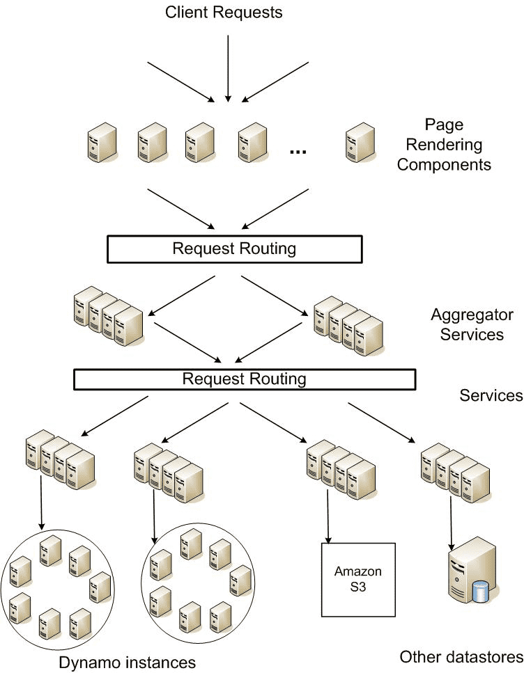
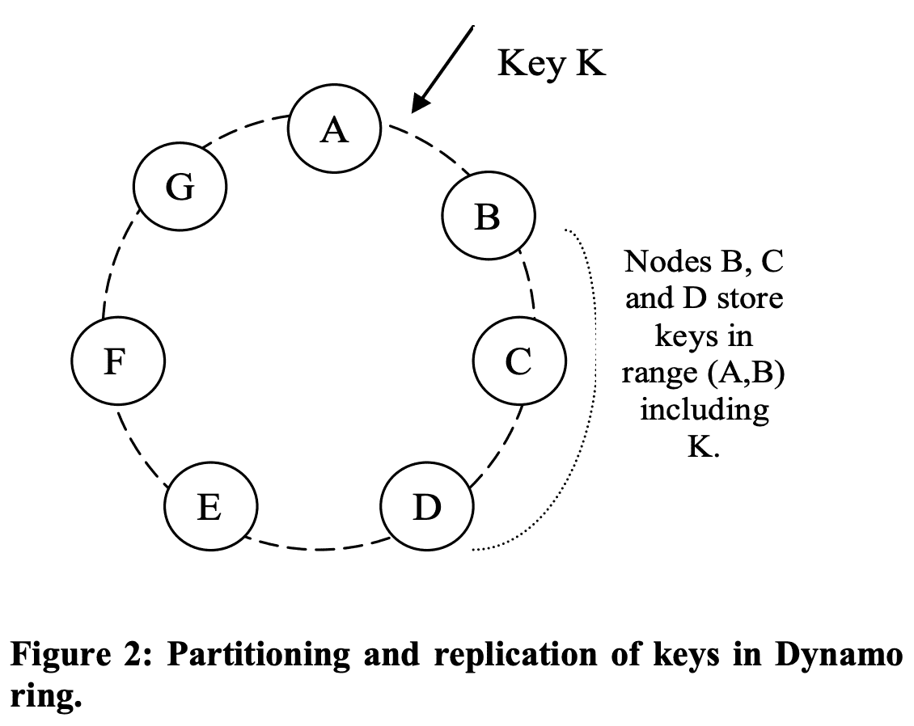
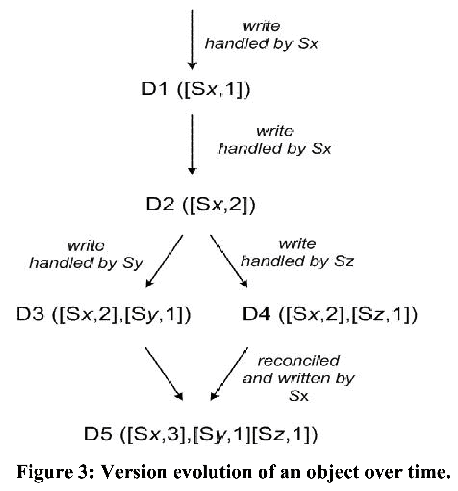
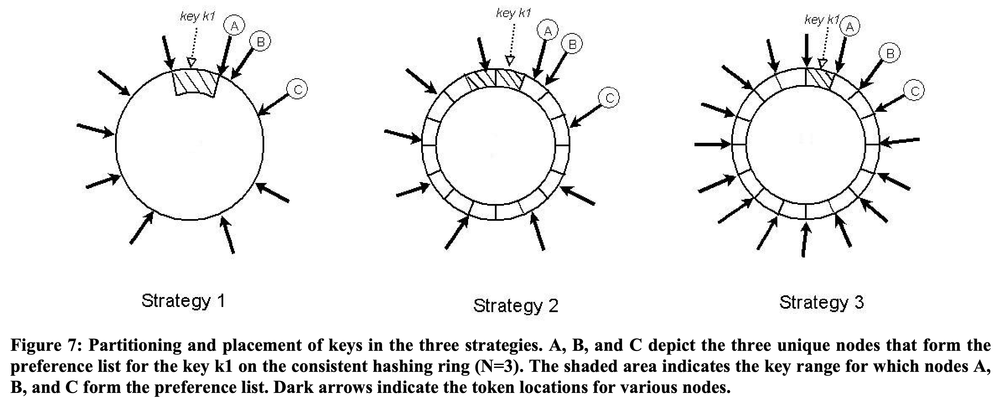

**{{ page.description }}**

# Dynamo (OSDI ‘07)

- sloppy quorum
    - [https://jimdowney.net/2012/03/05/be-careful-with-sloppy-quorums/](https://jimdowney.net/2012/03/05/be-careful-with-sloppy-quorums/)
- weakening consistency
    - [https://www.cs.princeton.edu/courses/archive/fall15/cos518/studpres/bayou.pdf](https://www.cs.princeton.edu/courses/archive/fall15/cos518/studpres/bayou.pdf)
    - [https://www.cs.princeton.edu/courses/archive/fall15/cos518/studpres/eiger.pdf](https://www.cs.princeton.edu/courses/archive/fall15/cos518/studpres/eiger.pdf)

## 1. Introduction

## 2. Background

대부분 aws e-commerce platform의 서비스들은 PK로 데이터를 R/W 하기만 하지 RDBMS가 제공하는 복잡한 쿼리는 필요없었다. 또한 RDBMS는 availability보다 consistency를 중요시하기떄문에 scaleout, partitioning이 쉽지 않다.

### 2.1 System Assumptions and Requirements

***Query Model***: unique key로 r/w, data는 blob형태, relational schema없음, multiple data를 조회할 필요 없음, 1MB이하의 작은 data

***ACID Properties***: weaker consistency with high availiability, isolation 보장없음

***Efficiency***: latency, performance 중요

### 2.2 SLA

- amazon의 service oriented architecture (아마도 e-commerce)

한 요청이 들어올떄 수많은 서버를 거치므로 SLA가 중요하다. 어떤 서비스는 자신의 state를 저장하고, aggregator service는 대부분 stateless, caching을 한다.

SLA metric은 99.9 percentile을 쓴다. 일반적으로 많은 히스토리를 가지는 유저는 더 많은 computation time이 필요하기 때문에 average, median(당시엔 이게 defacto였나봄?)로는 부족하다(wow..). 특히 business logic이 별로 없는 서비스인 경우 storage system의 SLA는 매우 중요해진다. Dynamo의 design consideration중 하나는 “서비스가 functionality, performance, cost-effectivness의 trade off를 선택하게 해주는 것이다"

### 2.3 Design Considerations

strong consistency와 high availibility를 둘다 만족할 수 없다. availability는 background로 change를 전달하는것같은 방법등의 optimistic replication으로 가능하다. 하지만 change가 충돌나는경우에 이것을 감지하고 해결하는게 어렵다. dynamo는 eventually consistent data store로 디자인 되어 모든 update는 모든 replica에 eventual하게 반영된다.

언제 update conflict을 해결 할 것인가? 기존 data store는 read를 단순하게가져가고 write에서 conflict을 해결했다. 이런애들은 절반이상이나 모든 replica에 data가 저장되지않으면 reject가 된다. 하지만 dynamo는 “always writable” data store를 지향한다(write에 대해 highly available). 소비자가 요청하는 update를 실패하게되면 소비자 경험이 나빠지기 때문이다. 따라서 read에서 conflict resolution을 하고 write는 절대로 reject되면 안된다.

누가 upcate conflict을 해결 할 것인가? data store아니면 app이 해야한다. data store가 한다면 policy가 단순할수 밖에 없다 (last write wins 같은..). 하지만 app이 한다면 app이 알고있는 data schema에 맞춰서 conflict resolution이 가능해진다.

*Incremental scalability**:*** dynamo는 system에 최소한의 부담을 주면서 한번에 한 node씩 scale out가능해야 한다.

*Simmetry*: Dynamo의 모든 node는 같은 responsibility를 가져야 한다. master node는 없다. symmetry는 provisioning, maintenance를 쉽게 해준다.

*Decentralization*: centralized control은 장애가 나기 쉽다, 반면에 decentralized이면 scalable, available해지기 쉽다.

*Heterogeneity*: heterogeneous infra에서 동작해야 한다.

## 3. Related Work

### 3.2 P2P

### 3.3 Distributed File Systems and Databases

### 3.3 Discussion

Dynamo는 1) always writeable을 추구한다. 2) trusted doamin 안에서 동작하는것을 가정한다. 3) app은 hiehrarchical namespace(filesystem같은것)을 필요로하지 않는다. 4) 99.9 percentil에서 100ms정도의 latency를 요구한다. multi-hop이 latency를 증가시키므로 routing을 하지않는게 필요하다.

## 4. System Architecture

List of techniques & advantages

| Problem | Technique | Advantage |
|---------|-----------|-----------|
| Partitioning | Consistent Hashing | Incremental Scalability |
| High Availability for writes | Vector clocks with reconcilation during reads |Version size is decoupled from update rates |
| Temporary Failures | [Sloppy Quorum](https://jimdowney.net/2012/03/05/be-careful-with-sloppy-quorums/) and hinted handoff | high availibility & durability guarantee when some of replicas are not available
| Recovering | Anti-entropy using merkle tree | Synchronizes divergent replicas in the background
| Membership & fraud detection | gossip-based | Symmetry & avoid centralized registry for storing membership and node liveness

### 4.1 System Interface

$get(key)$는 $context$와 conflicting version에 대한 object들을 리턴한다. $put(key,\ context,\ object)$는 object를 저장한다. $context$는 object에 대한 metdata가 들어있다. context는 object와 같이 저장되어 system이 object에 대한 validity를 확인하게 된다. 또한 key에 md5 hash를 먹여서 128bit으로 만들어 node가 key에 대한 object를 찾을때 쓰게 된다.

### 4.2 Partitioning Algorithm

partitioning shceme은 consistent hashing을 써서 여러 node에 load를 분산한다. hash function의 range는 ring (largest value와 smallest value가 겹침)의 data structure를 가진다. 각 node는 ring의 random value에 할당되어 position을 가진다. key에대한 object는 hash(key) 값을 position에서부터 clockwise walking을 통해 나오는 첫 node에 할당된다. 각 node는 ring에서 이전 node 사이의 position에 대한 data를 담당하게 된다. 이 ring의 이점은 근처 node에게만 영향을 주고 다른놈들은 영향받지 않는것이 있다.

challenge는 1) 각 node 할당을 random으로 하면 non-uniform distribution이 나타난다는 것과 2) heterogeneity를 무시하는 알고리즘이라는 점이다. 따라서 dynamo는 consistent hashing의 variant를 쓴다. node를 ring의 한 position에 매핑하는것이 아닌 여러 position에 매핑하여 virtual node를 유지하는 것이다. virtual node는 ring에서 single node처럼 보이지만, 실제 node는 여러 virual node를 가진다. 새 node가 system에 들어오면 multiple position (tokens)을 가진다.

- node가 unavailable해지는경우 이 node로 들어오던 load는 evenly distribute될 것이다.
- node가 다시 available해지거나 새 node가 들어오면 다른 node들과 비슷한 정도의 load를 받게 된다.
- virtual node 갯수를 조절해서 heterogeneous 하게 만들 수 있다.

### 4.3 Replication

configurable한 N($per\text{-}instance$)개 host에 replicate된다. key $k$는 coordinator node에게 할당되는데, coordinatior노드는 N-1의 clockwise로 successor node에할당시킨다. 따라서 각 node기준으로는 N개의 prececessor를 커버한다. 특정 key에 대한 data를 책임지는 node list를 $preference\ list$라 부른다. 모든 node 각각이 특정 key에 대해 어떤 node로 routing할수 있는지 알아야 한다. 만약 virtual node로 preference list를 유지하면 N개미만의 physical node에 할당되므로 availability가 떨어진다. 따라서 preference list는 **distinct physical sucessor node list**가 된다.

### 4.4 Data Versioning

dynamo는 eventual consistency를 제공한다. $put()$은 모든 replica에 업데이트 되기전에 caller에게 리턴하므로, 리턴하자마자 $get()$을 호출하면 latest value를 받아오지 못할 수 있다. failure가 없을땐 propagation time만큼 기다리면 반영이 되지만, failure에서는 한참동안 모든 replica에게 update가 전달 되지 않을 수 있다.

amazon의 application은 이런 inconsistency에 tolerant하며 대처할 수 있도록 만들어져있다. $Add\ to\ cart$ operation은 reject되지 않도록 구현되어있다. 만약 최신 버전의 data가 unavailable하면 유저는 old version에서 change를 만들텐데, $Add\ to\ cart$에서 이런 change는 old version이어도 의미있는 결과를 보여줘야한다. 따라서 유저가 latest version이 unavailable해도 old version으로 item이 추가되고, 추후에 reconcile 해야 한다.

이를 위해 dynamo는 modification result를 immutable versioned data로 관리해서, 특정 시간에 한 Object에 대해 여러 veresion이 있도록 한다. 대부분 new version은 old version을 포함하고, 시스템은 스스로 authoritative version을 결정 할 수 있다(syntactic reconciliation). 하지만 failure와 concurrent update가 동시에 일어났을때에 version branching이 생기면 conflicting version이 생기게 된다. 이때 system은 multiple version을 reconcile할 수 없고 client가 reconcile(collapse)을 수행해야 한다(semantic reconcilation). 유저 쇼핑카트의 여러 버전을 합치는 것이 collaps operation의 한 예다. 이런 reconcilation을 통해 add to cart는 lost가 생기지 않는다. 하지만 delete from cart 같은경우 item이 다시 생길 수 있다.

특정 failure상황에서 3개이상의 version이 생길수 있다. network partition, node failure에서 update는 여러 version이 생기게 하고 system이 미래에 reconcile해줘야 한다. 따라서 application이 이런 multiple version conflict을 해결해주는 것이 필요하다 (eventual consistency로 고성능을 얻으려면 어쩔수 없는 일..? 다른 eventual consistency system은 어떤지 궁금해짐..)

Dynamo는 서로 다른 version간 causality를 확인하기 위해 vector clock [[Time, clocks, and the ordering of events in a distributed system](https://lamport.azurewebsites.net/pubs/time-clocks.pdf)]을 쓴다. vector clock은 <node, counter>의 list이다. One vector clock is associated with every version of every object (뭔소리여). vector clock 으로 두 version이 parallel branch를 가지는지 또는 causal ordering을 가지는지 알 수 있다. 한 object clock의 counter가 다음 clock에서 모든 node의 counter보다 작거나 같다면, 첫번째 것은 두번째것이전에 발생한것이므로 없애도 된다. 만약 더 크다면 두 change는 conflict으로 보고 reconcilation을 해야 한다.

client가 object update를 원하면 version도 명시해야한다. 이건 이전 read operation에서 들어온 context에 포함되어있다. dynamo는 read request를 처리할때 syntactically reconcile 되지않은 branch를 보면 모든 object와 context에 version정보를 넣어 리턴한다. 이 context를 쓰는 update는 여러 version branch를 합쳐준다고 보고, branch는 single new version으로 다시 합쳐진다.

`D1, D2, ... D5` 는 한 object에 대한 서로 다른 version, `[Sx, 1]`의 Sx 요청을 처리하는 node,  1은 vector clock이다.

1. client가 새 object를 만들었다. system은 object `D1`과 `[(Sx, 1)]` 을 가진다.
2. client가 update를 했다. system은 `D2`와 `[(Sx, 2)]` 를 가진다. D2는 D1의 descendant이고 D1을 overwrite한다. 이 때, D2까지 만들지 못한 replica들 (즉 D1을 가짐)이 남아 있을 수 있다.
3. client가 update를 했는데 요청을 server `Sy`가 받았다. 이렇게 되면 system은 `D3` 과 `[(Sx, 2), (Sy, 1)]` 를 가진다 (lamport clock에서 각 node는 각각 monotonic increased clock을 가지므로 server `Sy` 는 clock `1` 을 가짐).
4. 다른 client가 D2를 읽어서 update를 시도한다(D3이 아직 모든 replica에 반영되지 않음). 그리고 다른 server `Sz` 가 요청을 받으면, D2의 descendant인 `D4`와 `[(Sx, 2), (Sz, 1)]` 이 생긴다. D2까지만 알고있는 node가 D4를 받는경우는 문제없지만, D3을 알고있는 node가 D4를 받으면 D3과 D4간의 causality가 없다는 것을 알게 된다. 따라서 D3, D4는 object를 읽는 client에게 보여주여 semantic reconciliation을 하도록 해야 한다.
5. client가 read request를 보내면, system은 D3, D4와 clock summary인 `[(Sx, 2), (Sy, 1), (Sz, 1)]`을 리턴한다. client가 reconcilation을 하고 node `Sx` 가 write를 수행하면 `D5`와 `[(Sx, 3), (Sy, 1), (Sz, 1)]` 이 된다.

vector clock의 이슈는 한 object에 대해 많은 server가 write를 하게되면 vector clock size가 증가하는 것이다 (size = node * clock). 실제로는 preference list의 top N node중 한개만 write를 수행하므로 빈번한 일은 아니다. network partition, multiple server failure에서 preference list의 top N node가 아닌 node가 write를 수행하면 size는 커지게 된다. 이를 위해 Dynamo는 clock truncation scheme을 쓴다. <node, counter> pair와 해당 node가 마지막으로 update한 timestamp를 저장한다. 한 object의 vector clock에서 pair가 threshold (10)을 넘어가면 oldest pair는 지워진다. 이 truncation scheme이 reconcilation을 정확하게 하지 못해줄 수도 있는데 (동시에 10개의 branch가 생기는 경우), production system에서 아직까지 보인적은 없었다.

### 4.5 Excution of get() and put() operations

모든 node가 key에 관계없이 요청을 받을 수 있다. get/put operation은 http를 쓰는 request processsing framework를 통해 invoke된다. 1) LB가 load에따라서 node로 request를 route 하거나, 2) partition-aware client lib이 적절한 coordinator node로 route한다. 전자는 client가 더 가벼워지고 후자는 low latency의 이점이 있다.

opreation을 받은 node는 $coordinator$라 부른다. 일반적으로 preference list의 top N node가 coordinator node로 설정된다. request는 ring의 random node로 가는데, 그 node가 이 request key에 대한  preference list의 top N node가 아니라면 coordinate하지 않고, top 1 node로 forward한다 (1 hop 추가).

consistency를 보장하기 위해 quorum system과 비슷한 consistency protocol을 쓴다. $R$: read operation에 필요로하는 최소 node 수, $W$: write operation에 필요한 최소 node 수 일때, $R +W >N$으로 설정하면 quorum-like system이 된다 ($N$은 replication factor). get/put operation의 latency는 replica중 가장 느린 replica의 latency가 된다. R/W는 low latency를 위해 N보다 작게 설정한다.

put()을 받으면 coordinator는 new version으로 vector clock을 만들고 local에 version을 write 하고, new version, vector clock을 N highest-ranked reachable node에 전달한다. $W\text{-}1$ node가 response를 보내주면 write는 성공한것이다 (1은 coordinator자신0

get()을 coordinator가 N highest-ranked reachable node에서 모든 existing version을 요청하고, R개의 response를 받을때까지 기다린 뒤 client에게 리턴한다. coordinator가 data에 대해 multiple version을 받으면 causally unrelated인 모든 version (4.4참조)을 리턴한다.

### 4.6 Handling Failures: Hinted Handoff

Dynamo가 server failure, network partition에서 unavailable해진다면, durability는 떨어졌을 것이다. Dynamo는 strict quorum membership 대신 sloppy quorum을 쓴다. 모든 r/w operation은 preference list의 first N healty node에서 수행되고, ring을 walk할때 언제나 first N node를 보게 되는것은 아니다.

N=3이라고 했을때, node A가 write동안 unreachable해지면 A가 가지고있던 replica는 D로 가게 된다. 이 replica는 이전에 어떤 node가 받았어야 했는지 metadata에 대한 hint가 있다 (이 케이스에선 A). hinted replica를 받은 node는 separate local db에 replica를 저장한다. A가 복구된것을 확인하면 D는 replica를 A로 보내주고, 이 replica를 지울수 있게 된다. 따라서 hinted handoff를 통해 r/w operation이 temporal failure에서도 실패하지 않게 해준다.

### 4.7 Handling permanent failures: Replica synchronization

hinted handoff는 temporal failure에서는 잘 동작하지만, original replica node가 복구되기전에 hinted replica도 unavailable해지는 상황을 해결해주진 못한다. 따라서 anti-entropy(replica synchronization) protocol을 활용한다.

Dynamo는 replica간 inconsistency를 찾고 transferred data를 줄이기 위해 merkle tree를 쓴다. merkle tree는 hash(key)를 leaf로 가지는 hash treee이다. 부모 노드는 자식 노드들의 hash이다. merkle tree의 이점은 tree의 각 branch를 전체 tree 정보를 확인할 필요없이 check가능하다는 점이다. 두 tree의 root가 가지는 hsah value가 같으면, 두 tree의 leaf node도 동일하고 두 tree를 가지는 두 node는 sync할 필요가 없는것을 확인하는 것이다. hash value가 다르면 replica가 다르다고 알 수 있다. 그리고 children hash value를 계속 비교해가면서 sync가 필요한 leaf를 찾아낸다. merkle tree는 sync에 필요한 data 양과 anti-entropy process동안의 disk read 횟수를 최소화한다.

Dynamo에서 각 node는 각 key range(virtual node가 커버하는 key 범위)에 대한 merkle tree를 가진다. 두 node는 겹치는 key range에 해당하는 merkle tree의 root를 비교하고 위의 tree traversal scheme으로 diff를 찾아낸다. 이 방식의 단점은 node가 system에 들어오거나 나갈때 key range가 바뀌므로 tree가 재계산되어야 한다는 점이다. 이문제는 Section 6.2의 refined partitioning scheme에서 해결한다.

### 4.8 Membership and Failure Detection

#### 4.8.1 Ring Membership

node들은 언제나 장애가 날 수 있으므로 dynamo ring에 node를 추가/제거 할 explicit mechanism이 필요하다. membership change 요청을 받은 node는 persistent store에 요청과 시간을 저장해서 history를 만든다. gossip-base protocol은 membership change도 eventually consistent하게 전달한다. 각 node는 1초마다 random peer와 연결해서 membership change history를 주고받는다.

node가 시작될때 node는 token(consistent hash space의 virtual node)를 선택하고, node to token set mapping을 만들어 disk에 저장한다. mapping은 reconcile을 통해 node들과 주고받는다. partitioning에 대한 정보도 gossip-based protocol로 전달되고 각 storage node는 peer가 처리하는 token range를 알게 된다. 따라서 각 node가 r/w operation을 받으면 바로 coordinator node로 forward할 수 있게 된다.

#### 4.8.2 External Discovery

#### 4.8.3 Failure Detection

Dynamo ring에 inter-node communication을 만드는 client 요청이 주기적으로 들어온다면, 다른 node가 응답을 주지 않을때 failure로 간주하고, 해당 partition을 접근하는 다른 node에 요청을 보낸다. 두 node간 communication을 만드는 요청이 들어오지 않는다면 두 node는 서로가 reachable한지 알 수는 없게 된다.

### 4.9 Adding/Removing Storage Nodes

node X가 system에 추가되면 ring에 뿌려진 token을 할당받는다. node X에 할당된 key range들에 대해, 이미 해당 범위에 대해 처리를 하고있던 node (≤ N)가 있을 것이다. node X가 추가되어서 일부 기존 node는 더이상 key range 일부를 유지할 필요가 없고 X로 전달해줘야 한다.

X가 system에 들어올때 `(F, G], (G, A], (A, X]` 의 key를 저장한다고 하자. 그러면 node B, C, D는 위 범위와 겹치는 range를 저장할필요가 없다 (B는 F가 coordinate하는 key, C는 G의 key, D는 A의 key). 따라서 B, C, D는 필요없는 key range를 X로 보낸다. node가 지워질때에도 비슷하다.

이 방식은 uniform access를 만들었고 latency requirement를 맞추고 fast bootstrapping이 가능하게 해줬고, duplicate transfer또한 발생하지 않는다 (key range가 겹치지 않으므로).

## 5. Implementation

딱히 볼게없음

## 6. Experiences

대표적으로 아래 패턴들이 많이 쓰였다.

- Business logic specific reconcilation: divergent version은 client가 reconcile한다.
- Timestamp based reconcilation: last write wins로 reconcile을 수행한다.
- High performance read engine: update 비중이 굉장히 작고 read가 많이 필요한 서비스. R=1, W=N으로 설정하면, dynamo는 read scalability를 올려준다.

dynamo의 큰 이점은 N, R, W를 튜닝해서 필요로하는 performance, availability, durability를 맞추는 것이다. N은 durability를 결정한다. W와 R은 availability, durability, consistency를 결정한다. W=1이면 system은 write request를 언제나 성공시키지만, replica에게 잘 전달됐는지 보장을 하지 않으므로 inconsistency를 만들 수 있다. 또한 write가 일부 node에만 성공했음에도 불구하고 client에게 성공했다고 보여주게 되는 durability에 대한 vulnerability window 개념을 만들었다.

과거에는 hand-in-hand로 durability, availability를 맞췄지만 필수적인것이 아니게 됐다. W를 높일수록 vulnerability window는 낮아지고, request가 실패할 가능성 (availability 감소)은 높아진다. 따라서 (N,R,W) 를 조정해서 필요로하는 performance, durability, consistency, availability를 맞춘다.

### 6.1 Balancing Performance and Durability

### 6.2 Ensuring Uniform Load Distribution

dynamo는 uniform key distribution에서 uniform load distribution을 제공하지만, skey된 key도 어느정도의 볼륨이 있으므로 그것들이 여러 node로 퍼지게 되므로 (virtual node + replication factor) uniform load distribtuion이 나타난다고 가정한다. 이 섹션에서는 load imbalance와 load distribution에 대한 partitioning strategy를 볼 것이다.

- **Strategy 1: $T$ random tokens per node and partition by token value**
Section 4.2에서 설명하였음. default strategy이다. token이 ramdom으로 선택되므로 key range도 달라진다. node가 들어오고 나갈때 token set과 key range도 바뀐다. 각 node에서 membership을 유지하기 위한 space는 node 수가 증가할수록 커진다. 이 strategey의 문제점중 하나는 새 node가 들어올때 다른 node에서 key range를 “steal” 해야한다. 기존 node는 새 node에게 key range만큼의 data를 전달하기 위해 local storage를 스캔해야 한다. scan은 tricky하며(원래 key로만 접근가능하므로), resource intensive operation이고, customer request performance에 영향을 주지 않도록 background로 동작해야한다. 따라서 낮은 우선순위로 동작할 수 밖에 없다. 하지만 node가 바쁠때 이 bootstrapping process는 엄청 느려지고 하루가 걸릴때도 있었다. 다른 문제점은 node가 들어오거나 나갈때 많은 node의 key range가 바뀌고 새 range에 대해merkle tree를 재연산해야하는 큰 부담이 있다. 또한 key range에 randomness가 있어 전체 key space를 snapshot찍는게 쉽지 않고 archive를 하는것이 복잡해진다. 그래서 archive할때 각 node마다 따로따로 key range만큼 조회하게 되는데 너무 비효율적이다.
가장 큰 문제는 partitioning, placement가 얽히는 것이다. 예를들어 request load를 더 키우기 위해 여러 node를 추가한다고 할때, data paritioning에 영향을 주지않고 node를 추가하는건 불가능하다.
- **Strategy 2: $T$ random tokens per node and equal sized partitions**
hash space는 고정 사이즈 $Q$ 의 partition, range로 쪼개지며, 각 node는 $T$ random token을 가진다. $Q$는 $Q\texttt{>>}N$, $Q\texttt{>>}S*T$ 가 되도록 설정한다($S$: \# of node). token은 hash space의 value (virtual node)를 ordered node list에 매핑하는데 쓰이고, partitioning에는 쓰이지 않는다. partition은 first N unique node가 된다. 그림에서 k1을 포함하는 pratition은 A, B, C 이다. 이점은 1) partitioning과 placement의 분리, 2) runtime에 placement scheme을 바꿀 수 있는 점이 있다.
- **Strategy 3: $Q/S$ tokens per node, equal-sized partitions**
Strategy 2와 비슷한데 node는 $Q/S$개 token을 가진다. node가 system에서 나가면 token은 남아있는 node들에게 random하게 뿌려진다. node가 들어오면 기존 node들에게서 token을 가져간다.

Strategy 3은 partition range가 고정이므로 partition을 separate file로 저장할 수 있다. 따라서 특정 item을 찾기 위해 random access를 하는게 아닌 file전송을 통해 partition을 relocate할 수 있다. 따라서 bootstrapping, recovery나 archive에서도 이점이 있다. 그대신 node membership이 바뀔때 위에 설명한 coordination이 필요하다.
