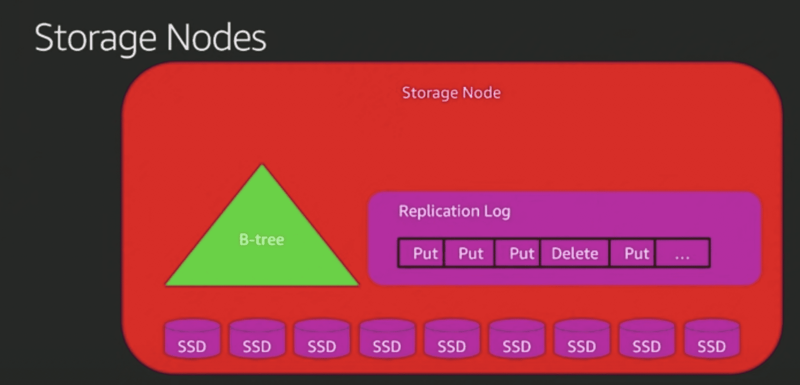
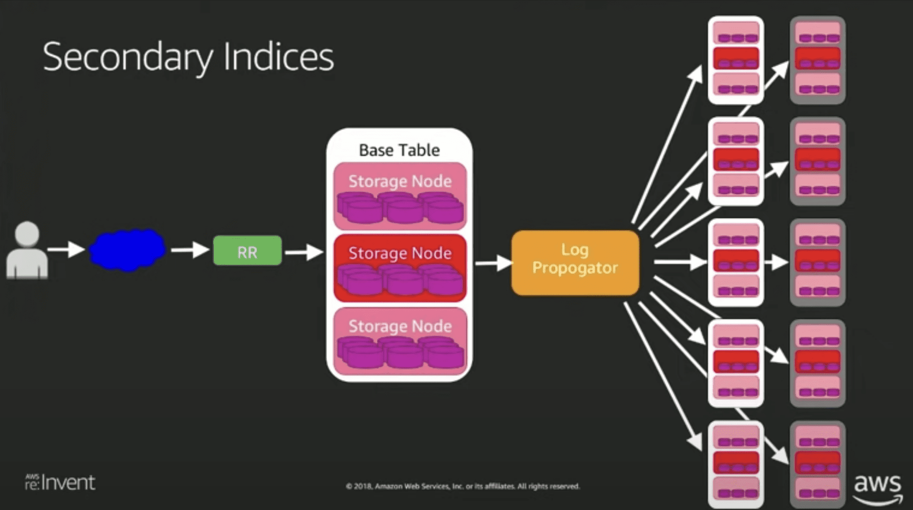
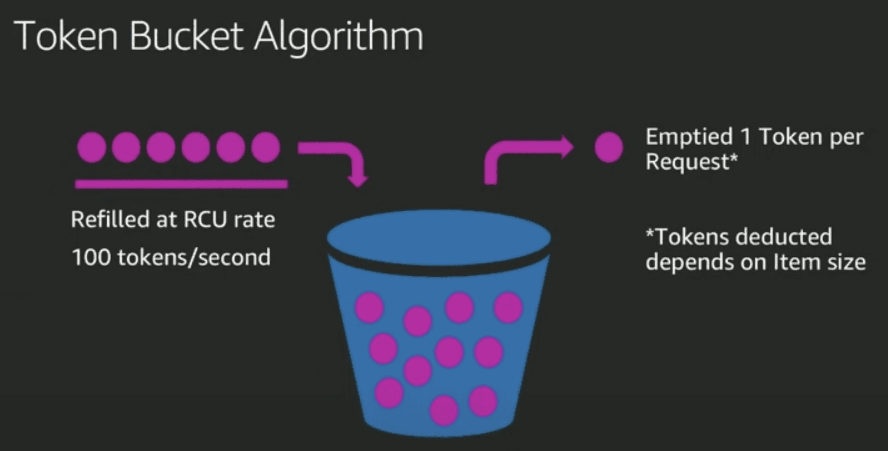

**{{ page.description }}**

# [DynamoDB Under the Hood: How We Built a Hyper-Scale Database](https://www.youtube.com/watch?v=yvBR71D0nAQ)

[HN comments](https://yahnd.com/theater/r/youtube/yvBR71D0nAQ/)

write

- 나자신한테 쓰고 한개 replica가 ack 받으면 유저에게 sucess전달 (low latency를 위해서)
strong consistency라면 replica 모두에게 write할때까지 기다리면 될듯 하다

- dynamo paper 에있던 quorum안씀
- paxos사용 아마도 partition 단위로 paxos group이 있는 spanner와 비슷한 방식?
- request router: metadata에서 table, key 보고 storage node(3개)중 master node에게 operation 전달

storage node는 btree(아마도 range ke 기준일듯?), replication log 저장
btree라고 말하는 것을 보니 아직 innodb이지 않을까

secondary index (아마도 GSI)

- replication log를 읽어서 replay시켜줌 → eventual consistency만 가능한 이유

- 근데 GSI는 hash key가 다른놈이므로, 만약 그 hash key에 대해 put을하면 partition두개를 바꿔야함
- 대충 {”primary_key”:1, “value”:2, “gsi_key”:3} 레코드를 가질때
    - gsi_key를 2로 업데이트 해버리면..
    - gsi_key 3인걸 제거하고, gsi_key2를 put하게됨
    - gsi를 최대 5개까지만들수있으니 최악의경우 11개의 partition을 건드림

LSI (추정)

- 그냥 partition 더 추가하면됨, b tree로 되어있으므로 range key만 다른 애들로 사용 하면 문제 없을듯함근데 이 방식은 strong consistency를 지키기 어려워진다
- 같은 Partition key에 대해 replica들이 별도의 btree를 소유하고 있는 방식일 수도 있음

provisioning

- partition이 RCU를 엔빵해서 가짐
- 사실상 그냥 수익모델 아닌가..? 왜필요한지는 잘 몰겠음 →
→ 전체적인 시스템의 availabiility를 위해서? table을 만든다고 해서 전용 인스턴스를 할당해서 쓰는 구조가 아니므로 이게 맞을듯 함, region 전체에서 관리되는 한개나 엔지니어들이 매뉴얼로 만드는 dynamodb cluster일것같음

- daptive capacity로 hot parittion problem을 좀 완화해주긴함
    - PID controller 이용

- 오토스케일링
    - 내부프로덕에서도 cloudwatch sns를 꾸역꾸역 쓰네..
    지들이 이러니 뭐만하면 람다에 뭐에 붙이라 하는거였군

- conflict resolution
    - last write wins
