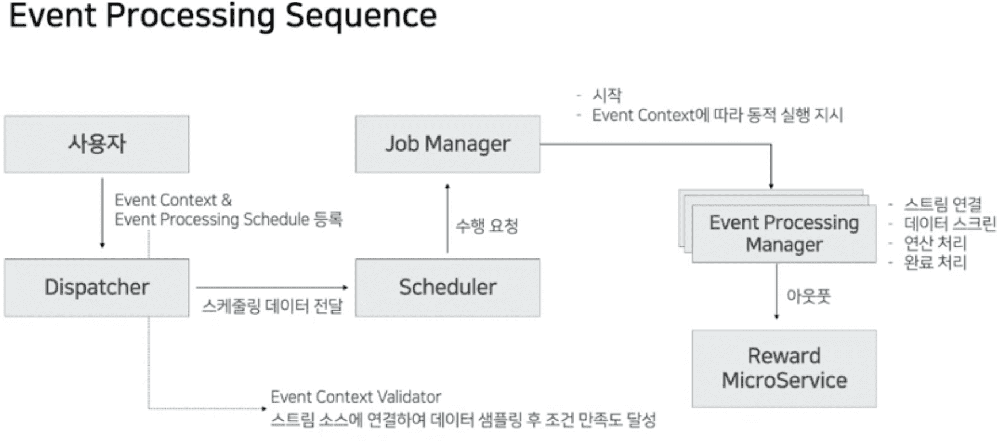
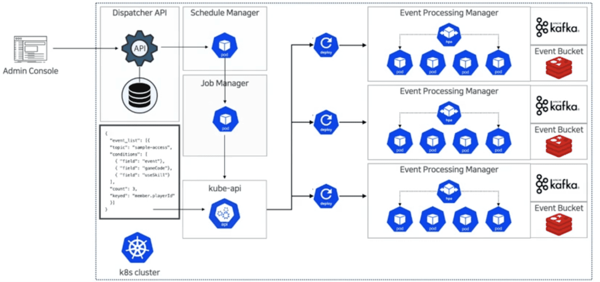
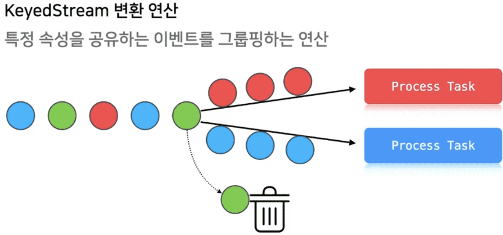
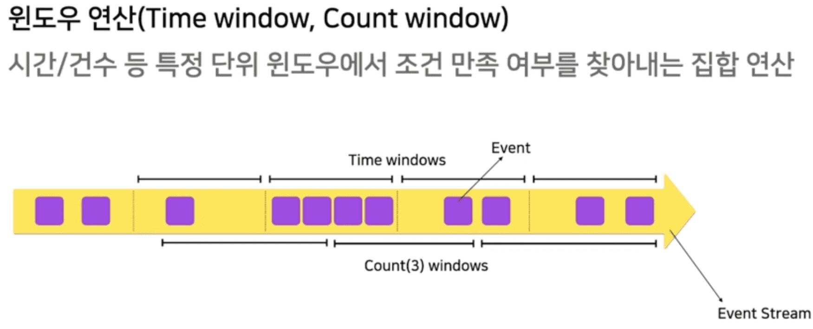

{{ page.description }}

# [devsisters] data driven으로 서비스운영 자동화 (spark)

## Log

### high quality log의 조건

1. schema를 정의하고 지킬것
2. QA시 log 검수단계를 포함
3. 개발 할때 logging을 고려한 설계
4. log 수집할때 자동화된 schema check + transformation

### Log 활용

보상 - 미션 topology는 일반화 가능

- 레벨3을 달성하면 보석100개
- 로그인 할때마다 하트 10개
- 제빵소 3개를 지으면 고기젤리 5개
- PVP 5번 승리하면 보석30개

→ Event를 N회 발생 시, Reward를 M개 지급

또한 log를 json으로 만들면 비교연산의 결합으로 만들 수 있음

```yaml
game_id == "kingdom" && event == "level_up" && level == 3
```

**Schema가 있는 Log dataset은 조건처리연산에 쓸 수 있다**

### Automation 조건

1. log기반으로 동작
2. near-realtime event processing
3. 대량 트래픽 커버
4. 동적 이벤트 태스킹
5. event task scheduling 자동화

## Dynamic CEP(Complexed Event Processing)

== event driven architecture + stream processing

### Event Driven Architecture

특정 이벤트의 반응으로 동작

- Event Emitter: 이벤트를 받아 event channel로 던짐
- Event Channel: 가공 후 consumer에게 전달
- Event Consumer: 필요한 연산을 하고 output을 만듦

#### 이벤트 처리 방식

- SEP(Simple Event Processing): 단일 이벤트 단위로 처리, 추출
- ESP(Event Streaming Processing): SEP + continuous query, 이벤트의 연속적인 흐름을 추적하는 경우
- CEP(Complexed Event Processing): 여러 이벤트를 프로세싱, 각 이벤트간의 관계등을 고려함, SEP에 패턴추론이나 다른 event를 엮는경우 CEP
- OLEP(OnLine Event Processing)

### Stream Processing

입력이 무한함, 전체 실행시간은 중요하지 않음, 빠른속도로 이벤트처리 및 결과제공, Latency와 Throughput이 중요함

토폴로지 확장(from apache storm, kafka streams)
+ 태스크 매니징 컴포넌트 분산구조(from apache flink)
+ Context(from apache spark streaming)
+ Kafka Streams
= Dynamic CEP Application

## DCEP App in K8s

### DCEP

- Dispatche API
    - admin console의 입력을 받는 API server
    - event context를 정의하기 위한 데이터 관리
    - event processing schedule 생성
    - scheduler manager와 communication
- Schedule Manager
    - event plan에 따라 schedule 관리
    - 정해진 시각에 job manager 호출하여 event 실행
    - 시간이 완료되면 stream app으로 종료 요청
- Job Manager
    - worker의 master 역할
    - event context 생성
    - worker managing
- Worker(Event Processing Manager)
    - worker group - worker
    - event와 worker group은 1:1
    - 여러개의 event process가 schedule에따라 동시에 실행됨
        - 관심있는 message를 여러 worker group들이 구독..
- Event Context
    - event를 trigger하기 위한 내용을 작성
        - stream topic, keyedstream 연산 대상 필드, event 내용, type information

        ```yaml
        event_list:
        - topic: sample-access
        	conditions:
          - field: event
            value: kill
            type: string
            operator: equals
          - field: gameCode
            value: 1302
            type: integer
            operator: equals
          - field: useSkill
            value: true
            type: bool
            operator: equals
          count: 3
          keyed: member.playerId
        ```






### DCEP 핵심 기능

#### KeyedStream 변환연산



쏟아지는 많은 로그중 필요한 정보만 필터해서 process task로 던져줘야함

효율적으로 동작해야지 성능에 악영향을 미치지 않음

#### Flexible Topology

토폴로지 모델링: 모든 조건을 if ~ then 으로 변환

- 특정 이벤트 N회 수행 → 특정 로그 N회 발견
- 특정 로그 N번 발견 → 매핑된 프로시저 호출

A로그 N번 && B로그 M번 && C로그 K번 → 프로시저 호출

**조건을 일반화 해야만 함**

#### Window (Time Window, Count Window)



native하게 window를 지원해줘야만 함

#### Stream Replaying

과거의 스트림 시점부터 replay

processing이 빠를경우 현재 레코드 속도를 따라잡아서 reatime processing에 붙을 수 있어야 함

#### Aggregation & Output

### Dynamic Event

정적이벤트: 코드정의

동적이벤트: 런타임에 결정되는 stream processing topology (개발자의개입없이)

미션: 순차적 미션 달성 판단 (transaction처럼?), window연산

### 순서가 보장되지 않는 분산큐에서 어떻게 메시지 순서를 보장할것인가

- 로그 데이터에 실제 이벤트시간을 무조건 포함 (근데 초단위 쓰네?)
    - 모든 스테이지마다 timestamp를 기록함.
    - 순서가 바뀌어도 복구가능
- Event Processing bucket
    - unbounded event stream → bounded set으로 치환하는 객체
    - PSA(portable service abstraction) 패턴 적용시 여러가지로 변환가능
        - Linked List - 분산처리 불가능
        - DBMS Table - 분산처리 가능하지만 부하
        - Redis SortedSet - 분산처리가능하지만 persistence 문제 (물론지원함)
- 조건이 두개인경우 event bucket활용
    - 레벨30달성 뒤 던전 클리어
        - level30달성 12분, 던전클리어 15분 → 미션 달성
        - 던전클리어 15분, level30달성 20분 → 미션 실패
- 조건이 3개이상인경우 event bucket + event buffering
    - 데이터를 event bucket에 버퍼링, 워터마크 범위에 따라 연산
    - event bucket안에서 순서대로 재정렬됨
    - watermark: max(lag) / (throughput/s)

#### Window 연산을 어떻게 구현해야 하는가

- event buffering과 유사하므로 event processing bucket으로 처리가능

#### 대량의 로그를 near-realtime으로 처리

- 이벤트 프로세싱 매니저를 k8s node에 분산
- stream batch unit 을 늘려서 throughput상승, 병렬 연산처리하여 Latency 감소
- processing sequence의 앞쪽에 cardinality가 높은 조건을 배치하여 filter out
- 동시에 여러 event processing을 핸들링하면 bin packing 필요