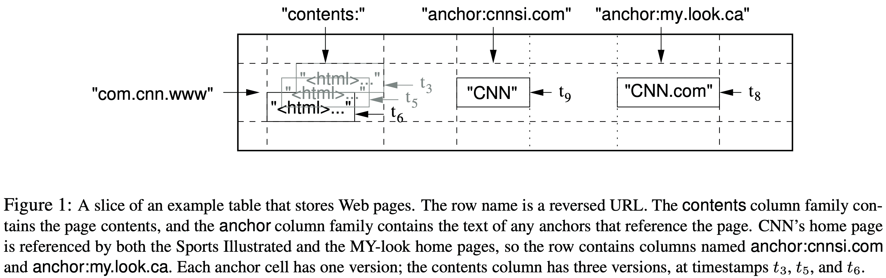
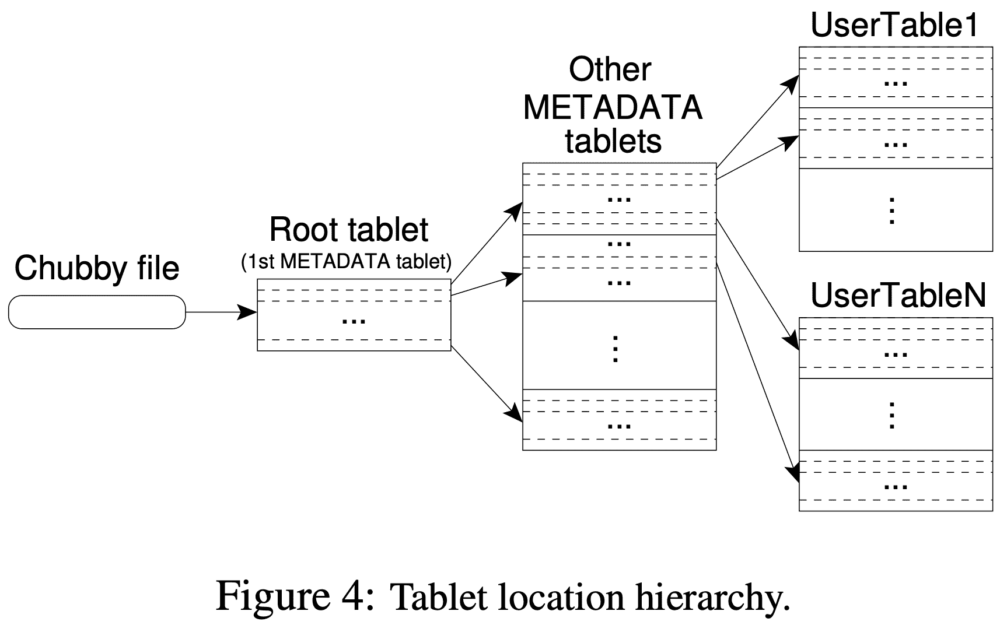
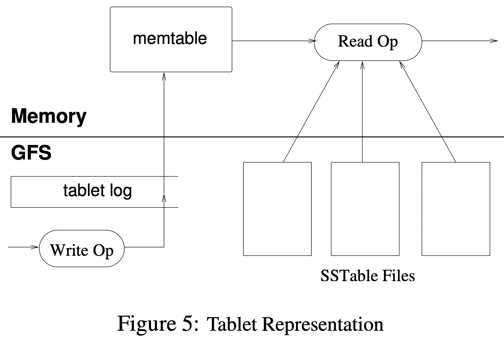

{{ page.description }}

# Bigtable (OSDI ‘06)

## 1. Introduction

Bigtable은 wid applicability, scalability, high performance, high availability를 목표로 한다. high throughput 이 필요하거나, latency-sensitive한 workload에서 쓴다. Bigtable은 relational data model을 지원하지 않고 client가 data layout, format등을 직접 제어한다. data는 row, col로 indexing되며 bigtable에서  data 자체를 interpret하진 않는다. client는 schema에따라 locality를 제어할 수 있다.

## 2. Data Model

Bigtable은 sparse, distributed, persistent multi-dimensional sorted map이다. map은 row key, column key, timestamp로 indexing 된다. value는 uninterpreted string이다.

$(row:string,\ column:string,\ time:int64)\rightarrow string$

web page의 copy와 관련 정보를 저장하는 webtable에서는, URL이 row key, web page 안의 특정한 key들을 column key, value를 web page content, timestamp는 fetch시각으로 쓴다.

### Rows

row key는 최대 64kb, 일반적으로 10~100b 정도로 쓴다. single row key에 대한 r/w는 col key가 몇개인지에 관계없이 atomic해서 concurrent update에 용이하다. 또한 lexicographic order이며 row range는 dynamic partitioned된다. 각 row range는 $tablet$이라 부르며 distribution, load balancing의 단위가 된다. show row range에 대한 read는 일부 node만 communication하므로 효율적이다. client는 row key를 locality에 활용할 수 있다. 예를들어 URL host를 뒤집어서 (`maps.google.com/index.html` → `com.google.maps/index.html`) row key로 쓰면 같은 도메인에 대한 locality가 생긴다.

### Column Families

column key는 $column\ family$로 grouping되고, column family는 access control에 쓰인다. 한 column family에 속한 모든 data는 같이 압축된다. column family는 column key에 해당하는 data를 쓰기 전에 먼저 생성해야 한다. \# of distinct column family는 적은 수 (최대 100개정도), family는 거의 변하지 않는 usecase에서 쓰는것을 의도했다. 하지만 table의 column 갯수 제한은 없다.

column key는 $family:qualifier$ 의 syntax를 가진다. webtable의 column familiy 예시는 anchor가 있다. anchor family의 각 column key는 single anchor를 표현한다. qualifier는 refer site로 쓰고있다, value는 link text이다.

### Timestamps

각 cell은 같은 data에 대해 여러 version을 가진다. 이 version은 int64 timestamp로 indexing된다. timestamp value는 client application 직접 넣거나 bigtable이 만들어 실제 시각을 microsecond로 표현할 수 있다. data 충돌을 피하려면 application이 unique timestamp를 넣어줘야 한다. 저장은 decendant order로 되므로 최신 version이 먼저 read된다.

versioning data관리를 위해 cell version을 GC할 수 있게 column family단위로 1) last n version 만 저장되도록 하는것, 2) recent n days 만 저장되도록 하는 두가지 방식을 지원한다. webtable에서 column key `contents:` 는 한 page당 3개까지만 저장하도록 해준다.

## 3. API

## 4. Building Blocks

Bigtable은 GFS를 쓰고, 다른 distributed application과 mahcine resource를 공유한다. 또한 $SSTable$ file format을쓴다. SSTable은 persistent, ordered immutable map이며 k/v는 string으로 취급한다. lookup은 특정 key나 keyrange로 가능하다. SSTable은 block sequence를 가진다 (default block size는 64KB). SSTable 끝에 저장되는 block index는 block을 찾을때 쓴다. index는 SSTable을 open할때 메모리에 올라간다. lookup은 in-memory index에서 binary search를 통해 block location을 찾아 disk에서 읽으므로 한번의 disk read만 생긴다. 또한 SSTable 전체를 memory에 올려 disk read 없이 lookup하는것도 제공한다.

(chubby는 전체적으로 zookeeper와 비슷한듯) Bigtable은 Chubby라는 distributed lock service를 쓴다. Chubby는 5개의 active replica가 있고, 이중 하나는 master가되어 request를 받는다. replica중 절반 미만까지 failure가 발생해도 active하며, Paxos를 replica consistency를 유지한다. chubby는 directory나 small file로 구성되는 namespace를 제공해주는데, 각 directory/file은 lock으로 쓰일 수 있으며, atomic r/w를 제공한다. chubby client는 chubby file에 대한 caching을 지원하고 각 client는 service와 연결되는 session을 가진다. session은 lease expiration time이내에 갱신하지 못하면 expire된다. session expire가 되면 client가 들고있던 lock, open handle은 모두 끊어진다. 또한 directory/file에 대한 callback을 등록해서 변경이 생기거나 session expiration에 대해 노티를 받을 수 있다.

Bigtable은 system에 하나의 master만 존재하도록 보장하고, bigtable data에 대해 bootstrap location을 저장하고 (Section 5.1), tablet server를 관리하고 (Section 5.2), 각 table의 column faimily에 대한 schema를 저장하고, ACL을 저장할 때 chubby를 쓴다. chubby가 unavailable해지면 bigtable도 unavailabe해진다.

## 5. Implementation

Bigtable은 client library, master server, tablet server로 구성된다. tablet server는 cluster에 추가되거나 지워질 수 있다. master는 tablet server에게 tablet을 할당하고, tablet server에 대해 load balancing을 하고, GFS file에 대해 GC를 수행한다. 또한 table이나 column family같은 schema change도 처리한다. tablet server는 일반적으로 10~1000개의 tablet을 가지며, r/w request를 처리하고, tablet이 너무 커질때 split을 수행한다.

다른 single master distributed storage system처럼 client data는 master와 주고받지 않고 tablet server와 직접 주고받는다. bigtable client가 tablet location에 대해 master와 통신하지 않으므로 대부분 client는 master와 통신할 일이 없다. 따라서 master의 load는 크게 생기지 않는다.

### 5.1 Tablet Location

tablet location information은 B+ tree와 비슷한 3 level hierarchy를 가진다. chubby file은 root tablet location을 가진다. root table은 METDATA table의 모든 tablet location을 저장하고 있고, 각 METADATA tablet은 여러개의 user tablet location을 가지고 있다. root tablet은 METADATA table의 첫번째 tablet이며 3 level hierarchy를 유지하기위해 절대로 split되지 않는다.

The METADATA table stores the location of a tablet under a row key that is an encoding of the tablet’s table identifier and its end row (그림으로 안그려진다..).

client library는 tablet location을 caching해두고, cache되지 않은 tablet location이나 incorrect한경우 tablet location hierarchy에서 recursive하게 올라가며 location을 찾는다. cache가 없는경우 3 round trip이 필요하다. 1)chubby file, 2)METADATA tablets(root tablet포함됨),  3) UserTable. stale cache인 경우 최대 6 round trip이 필요하다(cache miss일때만 stale cache를 알 수 있으므로, METADATA table은 자주 바뀌지 않는다는 가정, 그래도 왜 6까지 필요한지 모르겠음). tablet location이 in-memory에 저장되므로 GFS access가 필요없지만, tablet location을 prefetch하는 방식으로 cost를 더 줄였다. 또한, tablet과 관련된 모든 event log를 METADATA의 secondary info로 저장한다.

### 5.2 Tablet Assignment

한 tablet은 한 tablet server에만 할당 될 수 있다. master는 live tablet server와 tablet assignment를 트래킹한다. unassign tablet은 available tablet server에게 tablet load request를 보내 tablet을 할당한다.

tablet server가 시작할때 특정 chubby directory밑에 file을 만들고 lock을 얻는다. master는 이 directory를 보면서 tablet server를 찾아낸다. tablet server는 chubby session이 끊어지면 lock을 잃고 tablet serving을 하지 못하게 된다. tablet server는 만들어둔 file이 계속 존재하면 lock을 다시 얻으려고 시도한다. file이 사라지만(누가 없애는거지?) tablet server는 shutdown된다. 또한 tablet server를 제거하는 요청이 들어와서 shutdown되는경우 lock을 풀고 master가 tablet을 reassign한다.

master는 주기적으로 tablet server에게 lock status를 물어보고, tablet server가 lock을 잃거나 network partition이 생긴경우 master가 해당 tablet server의 lock을 얻으려고 시도한다. master가 lock을 얻게되면 chubby는 active한 상황이며 tablet server가 죽었거나 network partition이 일어났다고 인지하고 tablet server가 tablet을 서빙할수 없는 상태로 판단하여 해당 lock file을 제거한다. tablet server의 file이 삭제되면 master는 이 tablet server에 속한 tablet을 다른 server로 옮긴다. Bigtable cluster가 master - chubby간 network 이슈가 생기는 것에 대해 더 robust하기 위해 master는 chubby session이 끊어지면 shutdown을 한다.

master가 시작될때 tablet assignment를 바꾸기 전에 현재 tablet assignment에 대해서 알아야 한다(bootstrap time). (1) unique master lock을 걸어서 동시에 2개이상의 master가 생기지 않도록 하고, (2) server directory를 스캔해서 live tablet server를 찾고, (3) live tablet server들과 통신해서 각 server가 가진 assigned tablet을 확인하고 (4) METADATA table을 읽으면서 unassign tablet을 찾으면 별도의 set으로 관리하여 추후에 tablet assignment 를 할 수 있게 한다.

위 프로세스의 문제점은 METADATA tablet을 할당하기 전에 METADATA “table” scan을 할 수 없다는 것이다(뭔소리여). 따라서 scan하기 전에(step 4), step 3에서 root tablet assignment를 찾지 못하면 root tablet을 unassigned tablet set에 추가한다. 이건 root tablet이 할당되는것을 보장한다. root tablet이 모든 METADATA tablet name을 가지므로 master는 root tablet scan을 통해 모든 METADATA tablet 정보를 알 수 있다.

tablet은 table이 생성,삭제 되거나, 두 tablet이 한개의 tablet으로 합쳐지거나, 한 tablet이 두 tablet으로 쪼개질때에 변경이 일어난다. tablet server가 tablet을 쪼개고 나머지는 모두 master가 수행한다. tablet server는 METADATA table에 새 tablet 정보를 써서 split을 commit한다. commit되면 master에게 noti가 간다. split noti가 사라지는경우 (tablet server나 master가 죽었을때), master는 쪼개진 tablet을 load하도록 tablet server에 요청할때, tablet server가 split되었다는 것을 master에게 알려준다.

### 5.3 Tablet Serving

tablet은 GFS에 저장된다. update는 log commit이후에 commit된다. update도중 commited change는 $memtable$이라 불리는 in-memroy sroted buffer에 저장된다. older update는 SSTable들로 저장된다. tablet을 복구하려면 tablet server는 METADAT table에서 metdata를 읽으면 tablet과 redo point set(commit log의 pointer)으로 이루어진 SSTable list를 찾을 수 있다. tablet server는 SSTable의 index를 memory로 읽어온 뒤, redo point 이후에 commit된 update들을 모두 apply쳐서 복구한다.

write operation이 들어오면 tablet server는 request가 well-formed인지 확인하고 client는 authorization을 진행한다. authorization은 chubby file에 permitted writer로 등록되어있는지 확인한다(대부분 client cache hit으로 해결). tablet sevalid mutation은 commit log로 써지고 memtable에 insert된다. performance를 위해 group commit도 가능하다.

tablet server가 read를 받으면 tablet server는 well-formed인지 확인, client또한 authorization을 한다. valid read operation은 SSTables와 memtable의 merged view에서 실행된다. SSTable과 memtable이 lexicographically sorted data structure 이므로 merged view는 효율적으로 구성된다 (key에 대해 memtable과 최신 SSTable 시간 역순대로 읽으면 되니까 효율적이란건가?).

tablet이 split/merge 되는 시점에도 read/write operation은 available하다.

### 5.4 Compactions

write가 일어나면 memtable 크기는 증가한다. memtable 크기가 threshold를 넘으면 freeze 시킨 뒤 SSTable로 만들어 GFS에 저장하고 새 memtable을 생성한다. 이 minor compaction process는 tablet server의 memory usage를 줄이고, recovery때 읽어야 할 commit log 수를 줄인다. compaction 동안에도 r/w는 available하다.

minor compaction 할때마다 새 SSTable을 만들게 된다. 계속 SSTable을 만들면 read 할때 많은 SSTable에 대해 merged view를 보여줘야 한다. 따라서 주기적으로 background에서 merging compaction(major compaction)을 진행해서 SSTable이 많이 생기지 않도록 한다. merging compaction은 SSTable과 memtable을 읽어서 merged SSTable로 만든 뒤 기존 SSTable과 memtable은 discard된다 (discard라고 표현한게 실제로 아직 지우지는 않는다인건가?).

minor compaction에서 생성된 SSTable은 아직 live 상태이지만 이전 SSTable에서 지워진 data에 대해 read를 막는 special deletion entry가 생기게 된다. major compaction에서는 deletion info나 deleted data는 포함되지 않는 single SSTable이 생성된다. Bigtable은 모든 tablet에 대해 주기적으로 major compaction을 수행한다. 이를 통해 resource reclaim을 할 수 있고, deleted data를 제거할 수 있다.

## 6. Refinements

### Locality groups

client는 column family들을 locality group으로 묶을 수 있다. tablet에서 각 locality group마다 분리된 SSTable이 만들어진다. 함께 access되지 않는 column family를 별도의 locality group으로 묶으면 efficient read가 가능하다. 또한 locality group을 in-memory로 선언해서 SSTable이 tablet server memory에 올라갈 수있다(lazy load). 이건 자주 access되는 small data를 읽는데 효율적이다.

### Compression

Client는 locality group을 압축할지 말지 선택할 수 있다. 유저가 설정하는 compression format은 SSTable block에 적용된다. block단위로 압축하면 space efficiency는 떨어지지만 SSTable 전체 파일을 decompress 하지 않고 일부분을 읽을수 있게 된다. 압축은 2단계인데 첫번째는 long common string 압축, 두번째는 fast compression algorithm 사용이다. 일반적으로 row name이 비슷한 data들이 위치되도록 설정하므로 compression ratio가 좋아진다(비슷한 data이므로 1pass에서 common string을 많이발견). 또한 비슷하게 versioning의 압축률도 좋다.

### Caching for read performance

tablet server는 2 level caching을 한다. Scan Cache는 higher level cache로서 SSTable에서 읽은 KV pair를 caching한다. Block Cache는 lower level cache로서 GFS에서 읽은 SSTable block을 caching한다. Scan Cache는 같은 data를 여러번 읽을때 좋고, Block Cache는 sequential read나 같은 locality group의 다른 column을 읽는데 좋다.

### Bloom filters

read operation은 모든 SSTable을 읽어 up-to-date state(merged view)를 만들어 리턴해줘야한다. SSTable이 memory에 없으면 disk access를 해야만 한다. Bigtable의 client는 특정 locality group의 SSTable에 대해 bloom filter를 만들도록 server에게 요청해서 disk access를 줄인다. bloom filter는 SSTable이 특정 row/column pair에 대해 data를 가지고 있는지 확인하는데 쓰인다. tablet server에서 bloom filter를 위해 쓰는 작은 memory는 disk access를 크게 줄인다. 또한 bloom filter는 존재하지 않는 row/column 에 대해 disk access를 하지 않도록 만들어준다.

### Commit-log implementation

tablet 단위로 별도의 commit log file이 생기면 너무 많은 file을 GFS에 써야 하고, GFS server가 phsyical log file을 찾기위해 disk seek을 많이 하게 만들며, group commit이 비효율적으로 동자갛게 한다. 따라서 tablet server당 single commit log를 만들어  여러 tablet에 대한 mutation들을 한 physical log file에 쓴다.

tablet server당 1개의 log는 평소엔 성능이 좋지만 recovery때는 복잡하다. tablet server가 죽으면 tablet들은 다른 tablet server로 옮겨진다. 각 server는 이전 server의 tablet에서 일부만을 가져간다. tablet을 복구하려면 새 tablet server는 이전 tablet server가 쓴 commit log에서 mutation을 reapply해야 한다. 하지만 여기엔 다른 tablet의 commit log도 섞여있다.

bigtable은 commit log entry를 `<table, row name, log sequence number>` 로 정렬해서 duplicated log read를 없앤다. 특정 tablet에 대한 모든 mutation은 continuous하게 바뀌므로 sequential read로 해결할 수 있다. parallelized sorting을 위해 log file을 64MB segment로 쪼개고, 여러 tablet server에서 sort를 진행한다. master가 mutation을 recover해야 하는 상황에 sorting process를 시작한다.

GFS에 commit log를 쓰는게 GFS 내부 문제로 unavailable 해질 수도 있는데, 이를 위해 각 tablet server는 2개의 log writing thread를 가지고 둘다 각각 별도의 log file을 write하며, 둘중하나만 active하게 쓰인다. active log file의 성능이 나오지 않으면 다른 thread의 log file을 active하게 쓴다. log sequence number는 log switching process동안 duplicated log를 만들지 않도록 하기 위해 쓰인다 (switching process가 진행되면 output log file이 before after로 2개가 생긴다는건가?).

### Speeding up tablet recovery

master가 tablet을 다른 tablet server로 옮길때 source tablet server는 minor compaction을 진행해서 recovery time을 줄인다. compaction이 끝나면 source tablet server는 해당 tablet에 대해 서빙을 멈춘다. tablet을 내리기 전에 minor compaction을 한번더 해서 이전 minor compaction동안 들어온 uncompacted state를 제거한다. 두번째 minor compaction은 당연히 빠르게 끝난다. 그후 target tablet server로 recovery 없이 tablet이 올라간다.

### Exploiting immutability

immutable SSTable로 인해 SSTable을 읽을때 filesystem과 별도의 sync가 필요엇ㅂ다. 따라서 row에 대한 concurrency control이 단순하게 구현된다. mutable data structure는 memtable 뿐이다. memtable을 읽을때 contention을 줄이기 위해 row단위 CoW를 해서 r/w가 parallel로 진행되도록 한다.

또한 deleted data를 실제로 제거하는것은 SSTable에 대한 GC로 해결가능하다. 각 tablet의 SSTable은 METADATA table에 등록되고, master는 mark-and-sweep GC로 obsolete SSTable을 지운다.

또한 tablet 분리도 빠르게 해준다. 각 child tablet에서 새 SSTable set을 생성하는게 아닌, child tablet이 parent tablet의 SSTable을 공유하도록 하면 된다 (CoW).

## 7. Performance Evaluation

## 8. Real Applications

## 9. Lessons