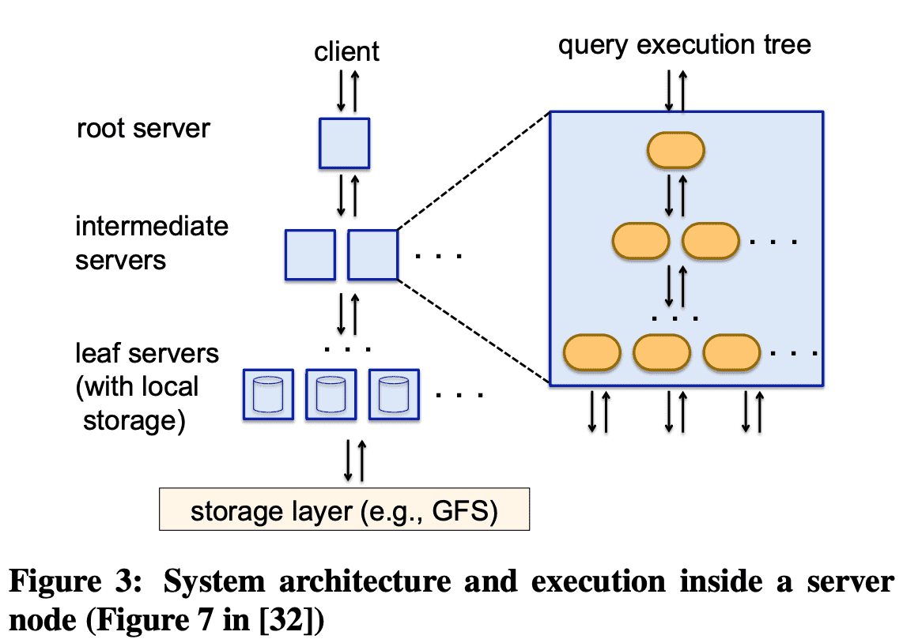
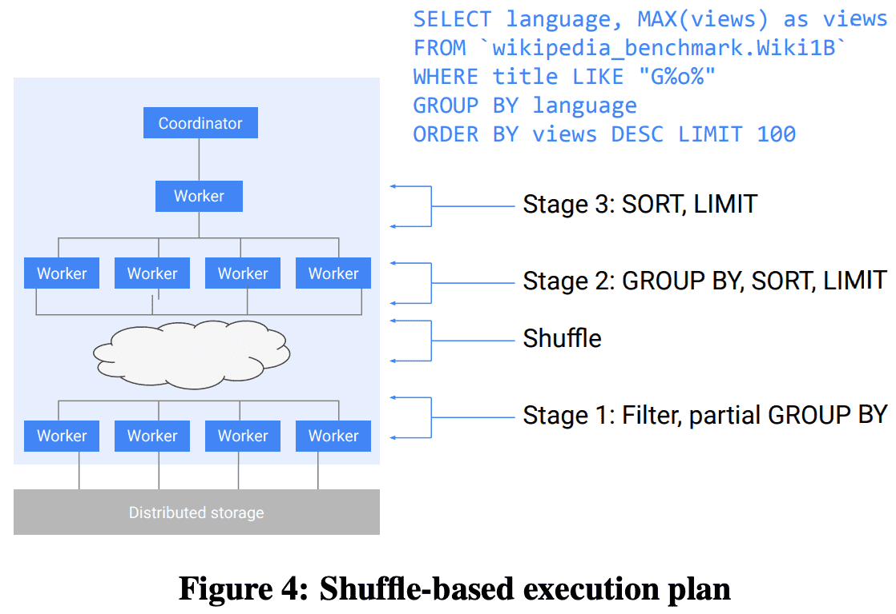
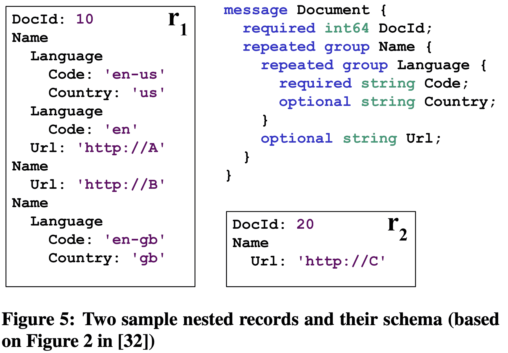
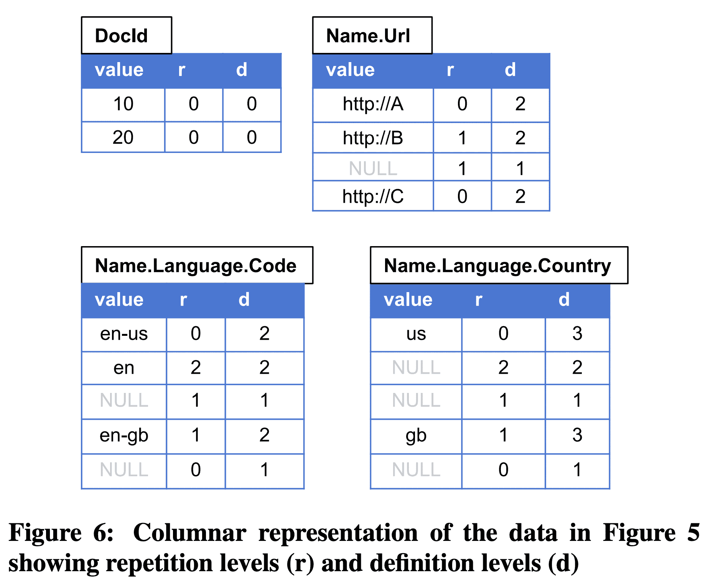
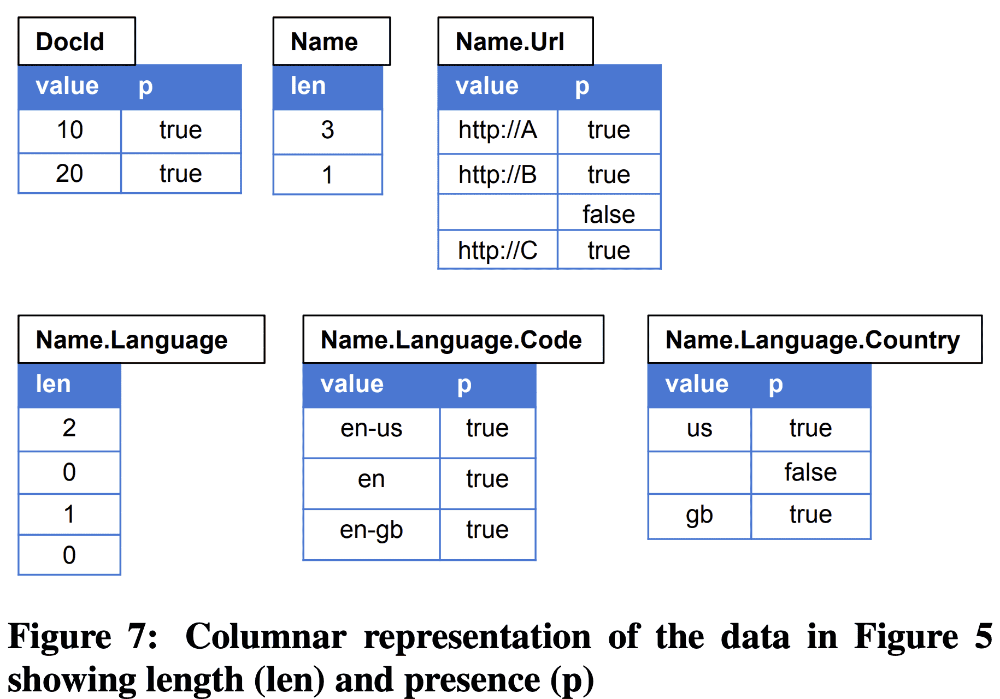
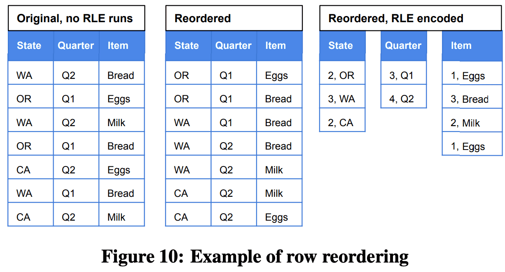
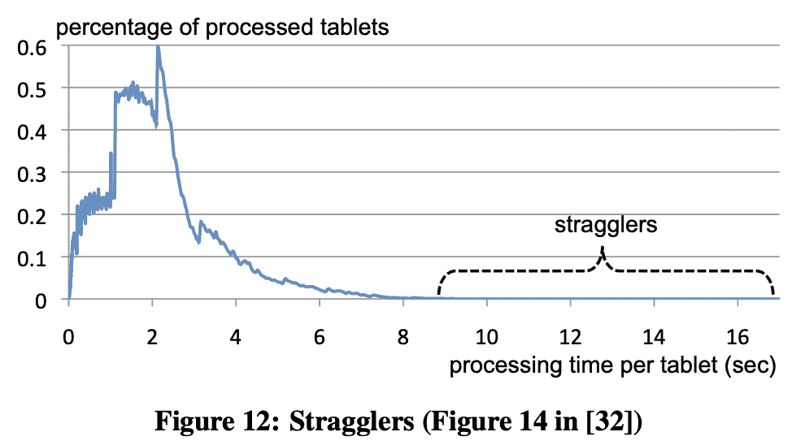

{{ page.description }}

# Dremel (VLDB ‘10)

[conference](https://static.googleusercontent.com/media/research.google.com/ko//pubs/archive/36632.pdf)

[journal](https://storage.googleapis.com/pub-tools-public-publication-data/pdf/37217.pdf)

[Dremel: A Decade of Interactive SQL Analysis at Web Scale](http://www.vldb.org/pvldb/vol13/p3461-melnik.pdf)

[An Inside Look at Google BigQuery](https://cloud.google.com/files/BigQueryTechnicalWP.pdf) - mapreduce/bigquery 비교

## 1. Introduction

web data는 nested인 경우가 많아서 dremel은 nested를 지원하고, MapReduce같은 쿼리를 짧은 시간 내에 처리할 수 있다.

## 2. Background

$common\ storage\ layer$로 GFS를 사용한다.

$shared\ storage\ format$은 columnar이다. 


## 3. Data Model


protobuf임

## 4. Nested Columnar Storage

parquet에 대한 내용

## 5. Query Language

dremel은 nested result도 만든다.

## 6. Query Execution

### Tree Architecture

Dremel은 Figure 9의 serving tree로 쿼리를 실행한다. serving tree를 써서 query scheduling, aggregation을 병렬화화고 fault tolerance를 얻는다

root server가 query를 받으면 table metadata를 읽고 serving tree의 다음 level로 쿼리를 전달한다. leaf server는 storage layer나 local disk에서 데이터를 읽는다.


`SELECT A, COUNT(B) FROM T GROUP BY A` query가 root server로 가게되면 `T` 를 구성하는 모든 tablet을 결정하고 query를 아래처럼 바꾼다.
`SELECT A, SUM*=(c) FROM$R_1^1$UNION ALL...$R_n^1$) GROUP BY A`
Table $R_1^1...R_n^1$ 은 serving tree에서 level 1의 node 1, ..., n으로 가는 쿼리이다. 즉, $`R_i^1$= SELECT A, COUNT(B) AS c FROM$T_i^1$GROUP BY A`

$T_i^1$은 level 1의 server $i$가 처리하는 T에 속한 tablet의 disjoint partition이다. 각 serving level에서는 이와 비슷한 rewriting을 수행한다. 쿼리는 leaf level까지 내려갈 것이고, leaf는 T의 tablet을 병렬로 스캔한다. leaf에서 올ㄹ올때는 partial result를 aggregate한다. 이런 방식은 aggregation이나, approximate result에서 잘 동작한다.

### Beyond One-Pass Aggregation

- large partitioned table과 small table을 조인할 때 small table을 모든 leaf로 카피하는 broadcast join을 수행한다.
- repartition(shuffle)이 효율적으로 동작한다. (어떻게는 안나옴)
- SELECT-INTO operation으로 쿼리 결과를 DFS에 저장 가능하다.

### Query Dispatcher

dremel은 multi-tenant이다. query dispatcher는 load balancing + priority를 바탕으로 쿼리를 스케줄링한다. 또한 특정 서버가 느리거나, unreachable한 경우에도 fault-tolerant하다.

각 쿼리에서 처리되는 데이터 양은 slot(processing unit 수)보다 클 수 있다. slot은 leaf server의 execution thread이다. 3k leaf server가 8thread가 있으면 24k slot이다. 따라서 100k tablet이 있는 table은 각 slot에 5개 tablet을 할당해서 처리할 수 있다. execution동안 query dispatcher는 긴 runtime을 가지는 process를 찾아 다른 서버로 reschedule한다. 일부 tablet은 여러번 redispatch될 수 있다.

leaf server는 columnar로 nested data를 읽고 각 stripe의 block은 async로 prefetch된다. tablet은 일반적으로 3중화 되어있으므로 특정 tablet replica에서 접근하지 못하면 다른 replica에서 가져온다.

각 server는 internal execution tree를 가진다. internal tree는 physical query execution plan이다. 이 plan에서 scalar function에 대한 optimized code도 생성된다. project-select-aggregate query에 대한 execution plan은 lockstep에서 input column을 스캔하고, aggregation/scalar function의 결과를 뱉으며 record assembly를 하지 않는다.


# **[Dremel: A Decade of Interactive SQL Analysis at Web Scale](http://www.vldb.org/pvldb/vol13/p3461-melnik.pdf)**

## 1. Introduction

dremel의 key idea와 architectural principle에 대해 볼것이다.

- SQL: 모든 data platform이 SQL style API를 채택했다.
- In situ analysis: dremel이 DFS와 shared data acess util을 사용하는건 다른 data procesing system이 SQL-based analysis와 결합될수 있도록 했다.
- Serverless computing: 시장에서 provisioned의 대체재로 elasticity를 위해 on-demand resource를 쓰고있다. dremel은 fully managed로 만들어졌으며 bigquery는 pay-per-use 모델이다.
- Columnar storage: dremel은 nested data에 대한 encoding과, columnar store에서 nested data를 활용하는법을 만들었다.

## 2. Embracing SQL

dremel은 big data analysis에 SQL을 다시 도입했다. 만들고 디버그하고 실행시키는데 몇시간이 걸리던 analysis job은 몇초만에 실행할 수 있게 되었으며 paradigm shift를 가져왔다. 

dremel의 SQL은 structured data를 처음으로 지원했다. google은 protobuf를포함해 log record도 structured (nested+repeated)로 표현하는데, dremel은 이런 데이터를 쉽게 쿼리할수 있게 해줬다.

기존 쿼리는 많은 테이블과 조인을 썼지만, dremel은 join을 줄여서 scalable하고 빠른 실행을 하게 해줬다. google dataset은 denormalized되어있고, nested record로 저장한다. hierarchical schema는 이런 데이터를 flatten, duplicate할 필요가 없게 해줬으며 storage,processing cost를 줄이게 되었다.

암튼 sql로 시장에 많은것들을 다시 돌려놨다는 내용.

## 3. Disaggregation

### 3.1 Disaggregated storage

처음 dremel은 수백개의 shared-nothing server 였다. 각 server는 local disk에 disjoint subset을 가지고 있었다. 시간이 지나면서 analytical system에서 성능을 내려면 dedicated hardware + direct-attached disk를 쓰는것이었다. dremel에서 동작하는 workload가 커지면서 이 방식은 관리하기 점점 어려워졌다.

dremel은 2009년에 borg(kubernetes 선조)라는 cluster management system으로 migrate했다. managed cluster로 옮기는건 workload가 커지면서 utilization을 올리기 위해 필수였다. 하지만 shared resource를 사용하는건 챌린지였다. 따라서 repliated storage organization으로 바꾸었다. 데이터는 3중화 되었고 독립된 서버로 managed되었다.

managed cluster와 replicated storage의 조합은 scalability, speed를 증가시켰고, petabyte size, trillion record도 가능하게 하였다. local disk에 replicated data를 저장하는것은 storage와 processing이 coupling되는것을 의미했다. coupling은 새 feature를 만들때 모든 알고리즘이 replication을 인지해야 하고, data를 옮기지 않으면 serving system이 resize할 수 없고, storage를 키우는것도 추가적인 서버를 붙이거나 cpu를 높여야 하고, data가 server에 묶여 다른 방법으로 접근 불가능한 문제점을 만든다. 이런 문제들은 해결할 수는 있지만 미래 솔루션은 GFS와 유사하게 보였다.

google의 storage, networking 향상으로 인해 shared-nothing architecture를 다시 고려했다. 하지만 data access latency를 줄이는게 가장 중요하다. 첫번째는 GFS-based dremel system을 만들었는데 성능이 너무 느렸다. 수십만개의 tablet으로 이루어진 테이블을 스캔하는건 GFS에서 수많은 파일을 접근해야해서 시간이 오래 걸려 query response time이 증가했따. 또한 dremel에서 사용되는 metdata format은 network roundtrip보단 disk seek를 타겟으로 디자인되었다.

query latency를 줄이기 위해 storage format, metadata representation, query affinity, prefetching등을 수정했다. 그 결과 disaggregated storage 기반의 dremel은 local보다 latency,throughput이 뛰어나게 되었다.

disaggregated storage는 또 다른 이점이 있다. 첫번째로 GFS는 fully managed internal service이므로 dremel의 SLO, robustness를 높였다. 두번쨰로 GFS의 sharded table을 dremel local disk로 옮기는 initial step이 제거됐다. 세번째로 data load를 위해 클러스터 크기를 바꿀 필요가 없어졌다. GFS는 single master model이었지만 추후 colossus[[GFS: Evolution on Fast-forward](https://queue.acm.org/detail.cfm?id=1594206)]라는 distributed multi-master model로 옮겨지면서 scalability, robustness를 더 얻었다.

### 3.2 Disaggregated Memory

Dremel은 $shuffle$ primitive를 통한 distributed join을 지원한다. dremel은 local RAM, disk를 sorted intermediate result를 저장하기 위해 사용했다. 그러나 compute node와 intermediate shuffle storage의 tight coupling은 scalability 이슈를 만들 수 있다.

- data producer, consumer가 증가함에따라 shuffle operation이 quadratic으로 증가하는 특징을 효율적으로 대처할 수 없다.
- coupling은 resource fragmentation으로 이어지고 isolation을 제공하지 못한다. 즉 service usage가 커질수록 scalability, multi-tenancy에 병목이 셍기게 된다.

따라서 colossus를 이용해서 disagregated shuffle을 만들었다. 새 shuffle에서 RAM, disk resource는 distributed transient storage system에서 따로 매니징되는 intermediate shuffle data를 저장할때 필요하다. in-memory shuffle은 shuffle latency를 줄이고, larger shuffle을 지원할 수 있게 되고, resource cost를 20%이상 줄였다. in-memory shuffle primitive는 여러 data analytics platform에 영향을 미쳤다.


### 3.3 Observations

- Economics of scale: storage disaggregation은 RAID, SAN, DFS에서 warehose scale computing까지 포함되게 되었다.
- Universality: Storage disagregation은 analytical, transactional system까지 수용하게 되었다.
- Higher-level APIs: storage access는 block IO API에서 멀어지고 access control, encryption등을 할수있게되었다.
- Value-added repackaging: raw resource는 service가 되었다.

## 4. In Situ Data Analysis

in situ data processing은 load, transformation 없이 원래 위치에서 데이터에 접근하는 것이다 (ELT). 유의미한 metadata가 있는 data access layer는 data independence를 위한 중요요소이다.

data management는 data warehousedptj datalake oriented architecture로 바뀌고 있다. data lake는 다양한 data source를 쓸 수 있고, OLTP에서 warehouse로 보내는 ETL based를 없앨 수 있고, 다양한 compute engine을 활용 할 수 있다.

### 4.1 Dremel’s evolution to in situ analysis

### 4.2 Drawbacks of in situ analysis

1. user가 언제나 secure하게 관리하려고 하진 않는다.
2. in situ analysis는 storage layout이나 compute statistics를 최적화 할 수 없다는 것을 의미한다. dremel query의 대부분이 처음 본 데이터(처리한적없는)로 실행되므로 일반적인 최적화가 불가능하다. 또한 standalone file에서 DML update, delete, schema change도 할 수 없다.

이런 문제들은 BigQuery Managed Storage를 만들게 되었다.

## 5. Serverless Computing

### 5.1 Serverless roots

dremel이 만들어질때쯤 대부분의 data warehouse는 dedicated server였다. 그 당시 MapReduce, Hadoop은 VM, container를 활용하는 더 유연한 deployement pattern을 가질수 있었지만 여전히 single-tenant resource provisioning을 하고 있었다.

하지만 google 내부 직원들이 low latency로 ad-hoc query를 날리려면 multi-tenant이면서 on-demand resource provisioning이 가능해야 했다. 따라서 server-less analytics를 위해 아래와 같은 goal을 만들었다.

1. **Disaggregation**: compute, storage, memory를 disaggregate하면 storage와 독립적으로 scaling하거나 compute resource를 공유 할 수 있어 낮은 비용으로 system을 운영할 수 있다. Section 3에서 말한것처럼 dremel은 2009년에 compute resource / storage를 분리했고 2014년에 memory도 분리했다.
2. **Fault Tolerance and Restartability**: dremel의 query execution은 compute resource가 slow, unavailable할 수 있다는 가정으로 만들었다. 따라서 query runtime, dispatching logic에서도 이에대한 대응을 했다.
    1. query의 각 subtask는 failure에서도 deterministic, repeatable해야하고 실패한 일부분을 재실행하는것으로 query를 성공 시킬 수 있다.
    2. query task dispatcher는 unavailable worker에 대응하기 위해 같은 task에 대해 multiple copy dispatch를 지원한다 (같은 task를 여러 work에 중복으로 할당?)
    
    위의 방식은 scheduling logic이 쉽게 특정 query에대한 resource를 cancel이나 reschedule하는 방식으로 조정할 수 있게 해준다.
    
3. **Virtual Scheduling Units**: Dremel의 scheduling logic은 특정한 machine type에 의존하지 않고 compute, memory를 slot이라는 abstract unit으로 동작하게 했다. 이건 Borg(k8s) compute environment에서 잘 동작한다. slot은 BigQuery에서 resource management의 core concept으로 자리잡았다.

dremel paper에서 만든 위 3개 아이디어는 많은 serverless data analytics system의 building block이 되었다. disaggregation은 industry, academia에서 넓게 쓰이고 있다. virtual resource unit은 snowflake와같은 다른 provider가 적용했다. industry는 cloud storage에서 data를 분석할때 elastic compute service를 활용하는 data lake architecture로 수렴했다. presto, athena, snowflake는 on-demand analytics, auto scaling을 적용했다.

### 5.2 Evolution of serverless architecture

dremel은 serverless를 계속 발전시켜서 BigQuery로 만들었다. original dremel paper의 approach들은 아래의 새로운 idea로 바뀌었다.

**Centralized Scheduling**



System architecture and execution inside a server node

dremel은 2012년에 centralized scheduling으로 바꿔 fine-grained resource allocation과 reservation을 가능하도록 했다 (특정 유저에게 processing capacity를 할당). centralized scheduling은 original dremel paper에서 intermediate server들의 resource distribution을 책임지는 “dispatcher”를 대체했다. 새 scheduler는 scheduling decision을 위해 전체 cluster state를 이용해서 더 나은 utilization, isolation을 제공한다

**Shuffle Persistence Layer**

shuffle과 distributed join functionality는 original dremel paper의 idea이다. 초기 shuffle 구현에서 현재 architecture는 query의 stage마다 scheduling과 execution을 분리하는 방향으로 진화했다. query execution state의 checkpoint로 shuffle result를 써서 scheduler는 worker를 preempt하는 유연성을 가지고, computing resource에 제약이 있을때 다른 workload를 수행하기 위해 resource allocation을 줄인다.

**Flexible Execution DAGs**

Figure 3에 나온 original dremel paper에서 fixed execution tree(root - intermediate - leaf 구조)는 aggregation에서 잘 동작했지만 더 복잡한 query plan에서는 이상적이지 않았다. centralized scheduling과 shuffle persistence layer를 도입하면서 이 architecture는 아래처럼 바뀌었다.

- query coordinator는 query를 받는 첫 node이다. query coordinator는 query plan을 query execution tree의 DAG 형태로 만들고 query execution orchestration을 담당한다.
- worker는 predefined structured 없이 pool에 할당된다. coordinator가 execution DAG를 만들면 worker에게 read-to-execute local query plan(tree)을 전달한다. leaf stage의 worker는 storage layer에서 read하고, shuffle persistence layer로 write한다. 전체 query가 끝나면 final result는 shuffle persistence layer에 저장되고 query coordinator는 이 result를 client로 전달한다.



Shuffle-base execution plan

위 예시는 wikipedia table의 top-k view 를 뽑는 query이다. query는 아래와 같은 순서로 진행된다.

1. stage 1 (leaf)의 worker들은 distributed storage에서 data를 읽고, filter를 적용하고, partial pre-aggregation을 적용 한 뒤, language field에 따라 hash partitioning을 하는 방식으로 shuffle한다.
2. data가 aggregation key로 shuffle되므로 stage 2의 worker는 final GROUP BY aggregation을 한다. 그 뒤 sort, limit을 적용하고 다음 stage로 result를 전달한다.
3. stage 3은 한개의 worker만 존재한다. shuffle persistence layer에서 온 input을 읽고 final ordering, truncation을 한 뒤 result를 shuffle layer에 저장한다.
4. query coordinator는 shuffle persistence layer에서 마지막 100개 record를 읽어 client로 전달한다.

dremel의 query는 shuffle persistence layer를 통해 다양한 수의 worker에서 실행될 수 있다.

**Dynamic Query Execution**

data shape에 따라 query engine에 적용할 수 있는 다양한 optimization이 있다. 예를들어 join strategy를 boradcast로 할건지, hash로 할건지가 있다. broadcast join은 shuffle을 필요로 하지않으므로 probe side(previous stage)에서 빨라진다. 하지만 build side(next stage)의 memory에 들어갈만큼 충분히 작아야 한다.

일반적으로 query planning에서 정확한 cardinality를 추정하는것은 어렵다. dremel은 query execution동안 수집된 통계를 바탕으로 다이나믹하게 query execution plan을 바꾼다. 이 방식은 shuffle persistence layer와 centralized query orchestration이 있어서 가능했다. broadcast vs hash 케이스에서 dremel은 두 data를 모두 hash join하는 plan으로 시작하다가, 한쪽 data가 빨리 완성되고 그 data size가 brodcast data size threshold보다 작으면 dremel은 second shuffle을 멈추고 broadcast join으로 전환한다.

## 6. Columnar Storage for Nested Data

columnar storage는 잘 알려져있었지만 dremel paper가 semistructured data에 대한 columnar storage를 제안했다. nested data를 위한 많은 opensource columnar format이 개발되었다. 2013년에 twitter, cloudera는 parquet을 공개했고, facebook과 hortonworks는 ORC를, 2016년에는 Apache Arrow가 나왔다.

위 포맷들은 모두 nested, repeated data를 지원하지만 조금씩 다르게 동작한다. Dremel paper는 repeated, optional field를 트래킹하기 위해 각각 $repetion$(repeated)과 $definition$(optional) level의 개념을 제안했다. repetiion level은 각 ancestor record가 append되어야하는지, 새 value로 시작해야 하는지 표현하고, definition level은 어떠 ancester record가 optional field가 없을 경우 absent처리되어야 하는지 표현한다. parquet은 이 encoding을 그대로 도입했따.

ORC는 repeated field의 length(parent안에서 occurrence 수)를 트래킹하고, optional field에 대해 boolean attribute를 쓰는 방식이다. Arrow는 ORC와 비슷하지만 repeated field를 offset으로 트래킹한다. offset을 사용하면 direct access가 가능하고 in-memory format에서 유용해진다. length를 쓰면 disk format compression이 좋아진다.



Two sample nested records and their schema



Columnar representation of the data in Figure 5 showing repetition levels (r) and definition levels (d)

위 approach들을 비교하기 위한 example을 가져왔다 (Figure 5). repetion, definition level을 이용한 encoding은 Figure 6이다. `Name.Language.Country` 는 다음와 같이 encoding된다: path(`Name, Language`)에 2개의 repeated field가 있으므로 max repetition level은 2이다. 또한 path(`Name, Language, Country`) 에 3개의 repeated or optional field가 있으므로 max definition level은 3이다. record $r_1$에서부터 보면 record의 시작이므로 언제나 repetition level은 0이고, value ‘us’ 를 가지고 있으므로 path(`Name, Language, Country`)까지 모든 값이 존재하므로 defintion level은 3이다. 다음 value를 봐보면 Country 값이 없지만, `Name, Language`가 정의 되어있으므로 definition level은 3가 된다. repetiion level은 path에서 변경된 repated field를 표현한다. Name은 같지만, Language 밑이 변경되었으므로 repetition level은 2이다.



Columnar representation of the data in Figure 5 showing length (len) and presence (p)

length와 presense encoding은 Figure 7이다. `Name.Language` 는 각 Name record에 Language가 몇개 가지고 있는지를 저장한다. `Name.Language.Country` 는 length 수만큼의 데이터를 저장하고 있다.

repetition, definition level encoding을 쓰기로한 결정은 모든 structure information을 column 자신에 넣어 다른 ancestor field를 읽지 않도록 하기 위함이었다. 또한 non-leaf node가 저장될 필요도 없어진다 (dremel에서 `Name.Language` 는 저장되지 않음). 하지만 이 scheme은 common ancestor일때도 child가 같은 정보를 저장해야 하므로 redundant storage를 차지한다. structure가 깊고 넓어질수록 redundancy는 높아진다.

서로 다른 encoding에서 analytical query를 처리하는 algorithm도 달라진다. repetition/definition level은 query하려는 column만 읽으면 모든 정보를 담고 있으므로 충분하다. 2014년에 google은 repetition/definition encoding에 서 동작하는 compute, filter, aggregate algorithm을 publish했다. length/presense encoding에서는 query대상 column의 모둔 ancestor를 읽어야만 한다. 따라서 추가적인 i/o가 발생한다. 또한 array boundary를 찾는 알고리즘은 여러 level의 count를 봐야한다.

2014년에 capacitor라는 새 columnar format으로 migration을 시작했다. capacitor는 original dremel paper를 기반으로 새 feature들을 붙였다. 이중 일부를 아래에서 소개한다.

### 6.1 Embedded Evaluation

filtering을 효율적으로 만들기 위해 capacitor data access library에 내장시켰다. library는 SQL predicate을 evaluate하는 mini query processor가 들어있다. 이 design choice는 capacitor를 이용할때 효율적인 filter를 제공한다. capacitor는 BigQuery뿐만 아니라 F1, Procella, Flume, Map Reduce에서도 쓰인다. capacitor는 filtering을 효율적으로 만들기 위해 아래 방식을 적용했다.

- **Partition and predicate pruning**
각 컬럼의 값에 대한 다양한 통게를 유지하고 있다. 이것들은 matching row에 해당하지 않는 partition을 제외하거나, 동일한 filter를 제거해서 filter를 단순화시킨다.
예를들어 `EXTRACT(YEAR FROM date) = 2020` 은 `date BETWEEN '2020-01-01' AND '2020-12-31` 로 바뀌고, 해당 date range 밖의 partition은 모두 제외된다.
`ST_DISTANCE(geo, constant_geo) < 100` 은 해당 constant object에 대해 100미터 이내의 value만 리턴한다. 이때 [S2 covering](https://s2geometry.io/devguide/s2cell_hierarchy.html)을 이용한다.
- **Vectorization**
columnar storage에선 columnar block-oriented vectorized processing을 할 수 있다. capacitor의 query evaluator는 [Integrating Compression and Execution in Column-Oriented Database (SIGMOD ‘06)](https://web.stanford.edu/class/cs245/win2020/readings/c-store-compression.pdf) 의 방식을 이용한다.
- **Skip-indexes**
filter predicate은 selective한 경향이 있다. 15%의 쿼리는 data를 리턴하지 않고, 25%의 쿼리는 전체 data의 0.01%만 리턴하고, 50%의 쿼리는 1%미만의 data만 리턴한다. 이런 high selectivity는 predicate에 해당하지 않는 record를 빠르게 skip해야 한다. 이를 위해 capacitor는 write time에 column value를 segment로 합치며 segment는 독립적으로 compression이 이루어진다. column header는 segemnt의 시작 offset을 indexing하고 있다. selective filter가 들어오면 capacitor는 index를 활용해서 segment를 skip하게된다.
- **Predicate reordering**
기존에 잘 쓰이던 predicate reordering은 predicate의 selectivity, cost를 바탕으로 동작하지만 이것들은 추정하기 어렵다. capacitor는 filter reordering decision을 위해 dictionary usage, unique value cardinality, null density, expression complexity등을 고려한 여러 heuristic을 이용한다.
예를들어 filter `p(x) AND q(y)` 에서 x는 dictionary가 아니고 많은 unique value가 있고, y는 dictionary이고 unique value가 적다면, `q(y)` 가 `p(x)` 보다 훨씬 복잡한 expression이라 하더라도 적은 수의 dictionary value만 비교하면 되므로 `q(y)` 를 수행한 다음 `p(x)` 를 수행한다

### 6.2 Row Reordering



Example of row reordering

### 6.3 More Complex Schemas

protocol buffer는 recursive message schema를 정의하게 해준다. 이건 common data structure를 모델링하기에 좋다. 예를들어 tree는 아래와 같이 정의할 수 있다.

```jsx
message Node {
  optional Payload value:
  repeated Node nodes;
}
```

그런데 주어진 dataset에서 사용하고 있는 maximal recursion depth를 미리 알 수 없다는 문제가 있다. dremel은 arbitrary depth를 지원하지 않지만 capacitor는 지원한다.

또 다른 문제는 JSON같이 strict schema 없는 message를 지원하는 것이다. protocol buffer는 proto3에서 지원하고 있다. 중요한 문제는 new column이 모든 row에 나타나지만, 같은 이름을 가진 column이 message마다 다른 type을 가질 수 있다는 것이다.

## 7. Interactive Query Latency Over Big Data

disaggregation, in-situ processing, serverless의 design principle은 interactive query latency를 만들기 어렵게 한다. processing과 data를 같이 두면 data acess latency를 줄이지만 disaggregation을 하지 못한다. storage layout을 최적화하는것은 in-situ processing과는 반대되는 것이다. dedicated machine은 serverless보다 당연히 성능이 더 좋다. 이 섹션에서는 dremel에서 구현한 latency-reducing technique을 소개할 것이다.

### **Stand-By Server Pool**

distributed SQL execution engine을 쓰면 query를 submit하자마자 처리할 수 있도록 만들 수 있다. 즉 machine allocation, startup latency가 사라진다.

### **Speculative Execution**

query가 수백대의 machine에서 동작할때 slowest worker는 평균보다 수천배 느릴 수 있다. 이것을 대응하지 않으면 end-to-end query latency는 수천배 느려지게 된다. 따라서 dremel은 query를 수천개의 작은 task로 쪼개고 worker가 task를 가져간다. 따라서 slow mahcine은 적은 수의 task를 가져가고 fast mahcine은 많은 수의 task를 가져가게 된다. 또한 long tail latency를 줄이기 위해 Dremel은 slow task에 대해 duplicate task를 만들어서 end-to-end latency를 줄이게 된다.

### Multi-level Execution Tree

수초 내에 한 query를 수백대의 mahcine에서 동작시키려면 coordination이 필요하다. Dremel은 leaf - intermediate - root server라는 tree architecture를 사용했다. 이 모델은 dispatch와 query result를 모으는데 잘 동작한다.

### Column-oriented Schema Representation

Dremel의 storage format은 self-describe하도록 디자인됐다(data partition은 embededded schema를 저장하고 있음). google에서 이런 schema에는 수천개의 field가 있는 경우도 있다. 이럴 때 schema를 파싱하는 것은 data를 읽는것보다 오래걸리기도 한다. 이를 위해 Dremel은 columnar format 안에 internal schema representation을 넣게 되었다.

### **Balancing CPU and IO with lightweight compression**

columnar format을 쓰면 비슷한 값들이 sequential하게 저장되므로 효과적인 compression을 하게 된다. 즉 storage layer에서 적은 data만 읽을 수 있으므로 query latency가 감소한다. 반면에 decompression은 CPU를 더 많이 쓰므로 query latency를 높일 수 있다. CPU와 IO사이의 tradeoff를 잘 맞추는것이 중요하다.

### Approximate Results

많은 분석은 100% accuracy를 요구하지 않으므로 tok K나 count-distinct같은 케이스에 approx algorithm을 쓰면 latency를 줄일 수 있다. Dremel은 multi-level execution tree architecture에서 잘 동작하는 one-pass algorithm을 사용한다. 또한 user들에게 processing할 data의 비율을 결정할수 있게 해준다 (정확도같은것?). straggler effect(slow machine때문에 end-to-end query latency가 느려지는상황)를 고려했을때 98의 data를 처리한 뒤에 return하면 latency는 2-3배 빨라진다(Figure 12).



Stragglers

### Query Latency Tiers

shared server pool의 utilization을 최대로 활용하기 위해 dremel은 동시에 여러 query를 issue할 수 있도록 해야 했다. 일부 query는 1초 미만으로 끝나기도 하고, 어떤것들은 몇십초가 넘게 걸리기도 한다. 작은 query들이 빠르게 동작하고, large query에 의해 blocking되는것을 막기 위해 dremel은 공평하게 resource를 스케줄링하는 intermediate server의 dispatcher를 이용했다. dispatcher는 이전 user가 수백개의 query를 동시에 수행시켜서 resource를 독점하고 잇을때에 새 user의 query가 동작하도록 만들기 위해선 task를 preempt할수 있도록 해야했다. 또한 한 user안에서도 query마다 priority가 다른 경우도 신경써야한다.

### Reuse of File Operations

수 초 이내에 한 query에 대해 수십만개의 file을 처리하는것은 DFS에 큰 부하가 생긴다. 따라서 수천대의 dremel worker가 file system master에게 metadata를 요청하고, chunk server(GFS) 에게 open, read operation을 요청하는것에 병목이 생기게 된다. 이를 위해 root server는 filesystem에서 가져온 metadata를 execution tree를 통해 실제로 data를 읽을 leaf server로 전달한다. 또한 더 적은 수의 file을 생성 (즉 더 큰 크기의 file)하여 metadata를 줄였다.

### Guaranteed Capacity

Section 5의 centralized scheduler에서 제공하는 reservation은 latency를 줄이는데에도 도움이 됐다. 예를들어 customer가 latency-sensitve workload를 돌리기 위해 미리 reserve하는 케이스이다. guaranteed capacity가 underutilized이면 resource는 다른 사람들이 쓸수 있게 해주지만, reserve해둔 user가 요청하면 바로 해당 resource를 쓸수 있게 해준다. Dremel worker는 custom thread scheduler가 있어 요청이 들어오는 즉시 non-reserved workload를 멈추고 reallocate할 수 있다.

### Adaptive Query Scaling

Section 5의 flexible execution DAG는 workload가 많아지고 다양해질수록 latency를 향상시크는데 중요한 부분이 됐다. execution DAG는 query plan마다 개별적으로 만들어진다. `COUNT, SUM` 같은 global aggregation을 생각해보면, fixed aggregation tree일때 query는 intermediate server를 무조건 거쳐야만 한다. 하지만 flexible DAG라면 leaf에서 바로 root로 던져줄 수 있다. 또한 `ORDER BY ... LIMIT` 같은 top K query에서 leaf의 각 worker는 많은 record를 생성하고 root node가 혼자서 많은 record를 가지고 final aggregation을 해야하니 병목이 생긴다. 반면에 Dremel은 input size에 따라 tree depth가 달라지는 aggregation tree를 만들어준다.

## 8. Conclusion

10년동안, dremel에서 dissaggregation, on-demand serverless execution, nested columnar stoarge는 업계의 best practice로 자리잡았다. In situ data analysis는 warehouse에서 data lake architecture로 바꾸게 만들었다. 또한 NoSQL tool을 쓰던 추세에서 Big data를 위해 SQL을 쓰는 추세로 바꾸었으며, large dataset에서 interactive query를 할 수 있는것은 당연해졌다.

하지만 static aggregation tree 대신 안정적이고 빠른  fast shuffle layer의 필요성, in-situ analysis를 위한 storage option은 더 발전이 필요하다.