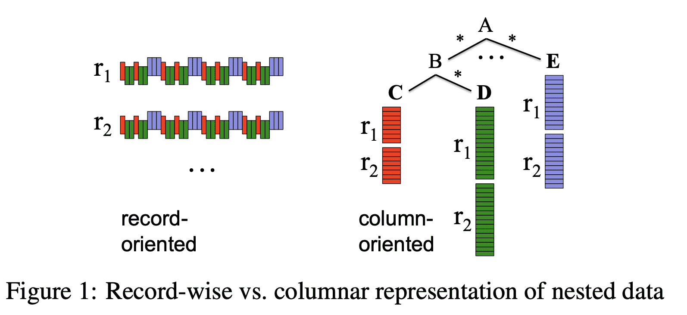

{{ page.description }}

# Dremel (VLDB ‘10)

[Journal](https://storage.googleapis.com/pub-tools-public-publication-data/pdf/37217.pdf)

## 1. Introduction

web data는 nested인 경우가 많아서 dremel은 nested를 지원하고, MapReduce같은 쿼리를 짧은 시간 내에 처리할 수 있다.

### 2. Background

$common\ storage\ layer$로 GFS를 사용한다.

$shared\ storage\ format$은 columnar이다.

## 3. Data Model

protobuf임

## 4. Nested Columnar Storage

parquet에 대한 내용

## 5. Query Language

dremel은 nested result도 만든다.

## 6. Query Execution

### Tree Architecture

Dremel은 Figure 9의 serving tree로 쿼리를 실행한다. serving tree를 써서 query scheduling, aggregation을 병렬화화고 fault tolerance를 얻는다

root server가 query를 받으면 table metadata를 읽고 serving tree의 다음 level로 쿼리를 전달한다. leaf server는 storage layer나 local disk에서 데이터를 읽는다.

`SELECT A, COUNT(B) FROM T GROUP BY A` query가 root server로 가게되면 `T` 를 구성하는 모든 tablet을 결정하고 query를 아래처럼 바꾼다.
`SELECT A, SUM*=(c) FROM$R_1^1$UNION ALL...$R_n^1$) GROUP BY A`
Table $R_1^1...R_n^1$ 은 serving tree에서 level 1의 node 1, ..., n으로 가는 쿼리이다. 즉, $`R_i^1$= SELECT A, COUNT(B) AS c FROM$T_i^1$GROUP BY A`

$T_i^1$은 level 1의 server $i$가 처리하는 T에 속한 tablet의 disjoint partition이다. 각 serving level에서는 이와 비슷한 rewriting을 수행한다. 쿼리는 leaf level까지 내려갈 것이고, leaf는 T의 tablet을 병렬로 스캔한다. leaf에서 올ㄹ올때는 partial result를 aggregate한다. 이런 방식은 aggregation이나, approximate result에서 잘 동작한다.

### Beyond One-Pass Aggregation

- large partitioned table과 small table을 조인할 때 small table을 모든 leaf로 카피하는 broadcast join을 수행한다.
- repartition(shuffle)이 효율적으로 동작한다. (어떻게는 안나옴)
- SELECT-INTO operation으로 쿼리 결과를 DFS에 저장 가능하다.

### Query Dispatcher

dremel은 multi-tenant이다. query dispatcher는 load balancing + priority를 바탕으로 쿼리를 스케줄링한다. 또한 특정 서버가 느리거나, unreachable한 경우에도 fault-tolerant하다.

각 쿼리에서 처리되는 데이터 양은 slot(processing unit 수)보다 클 수 있다. slot은 leaf server의 execution thread이다. 3k leaf server가 8thread가 있으면 24k slot이다. 따라서 100k tablet이 있는 table은 각 slot에 5개 tablet을 할당해서 처리할 수 있다. execution동안 query dispatcher는 긴 runtime을 가지는 process를 찾아 다른 서버로 reschedule한다. 일부 tablet은 여러번 redispatch될 수 있다.

leaf server는 columnar로 nested data를 읽고 각 stripe의 block은 async로 prefetch된다. tablet은 일반적으로 3중화 되어있으므로 특정 tablet replica에서 접근하지 못하면 다른 replica에서 가져온다.

각 server는 internal execution tree를 가진다. internal tree는 physical query execution plan이다. 이 plan에서 scalar function에 대한 optimized code도 생성된다. project-select-aggregate query에 대한 execution plan은 lockstep에서 input column을 스캔하고, aggregation/scalar function의 결과를 뱉으며 record assembly를 하지 않는다.

# [Dremel: A Decade of Interactive SQL Analysis at Web Scale](http://www.vldb.org/pvldb/vol13/p3461-melnik.pdf)

## 1. Introduction

dremel의 key idea와 architectural principle에 대해 볼것이다.

- SQL: 모든 data platform이 SQL style API를 채택했다.
- In situ analysis: dremel이 DFS와 shared data acess util을 사용하는건 다른 data procesing system이 SQL-based analysis와 결합될수 있도록 했다.
- Serverless computing: 시장에서 provisioned의 대체재로 elasticity를 위해 on-demand resource를 쓰고있다. dremel은 fully managed로 만들어졌으며 bigquery는 pay-per-use 모델이다.
- Columnar storage: dremel은 nested data에 대한 encoding과, columnar store에서 nested data를 활용하는법을 만들었다.

## 2. Embracing SQL

dremel은 big data analysis에 SQL을 다시 도입했다. 만들고 디버그하고 실행시키는데 몇시간이 걸리던 analysis job은 몇초만에 실행할 수 있게 되었으며 paradigm shift를 가져왔다.

dremel의 SQL은 structured data를 처음으로 지원했다. google은 protobuf를포함해 log record도 structured (nested+repeated)로 표현하는데, dremel은 이런 데이터를 쉽게 쿼리할수 있게 해줬다.

기존 쿼리는 많은 테이블과 조인을 썼지만, dremel은 join을 줄여서 scalable하고 빠른 실행을 하게 해줬다. google dataset은 denormalized되어있고, nested record로 저장한다. hierarchical schema는 이런 데이터를 flatten, duplicate할 필요가 없게 해줬으며 storage,processing cost를 줄이게 되었다.

암튼 sql로 시장에 많은것들을 다시 돌려놨다는 내용.

## 3. Disaggregation

### 3.1 Disaggregated storage

처음 dremel은 수백개의 shared-nothing server 였다. 각 server는 local disk에 disjoint subset을 가지고 있었다. 시간이 지나면서 analytical system에서 성능을 내려면 dedicated hardware + direct-attached disk를 쓰는것이었다. dremel에서 동작하는 workload가 커지면서 이 방식은 관리하기 점점 어려워졌다.

dremel은 2009년에 borg(kubernetes 선조)라는 cluster management system으로 migrate했다. managed cluster로 옮기는건 workload가 커지면서 utilization을 올리기 위해 필수였다. 하지만 shared resource를 사용하는건 챌린지였다. 따라서 repliated storage organization으로 바꾸었다. 데이터는 3중화 되었고 독립된 서버로 managed되었다.

managed cluster와 replicated storage의 조합은 scalability, speed를 증가시켰고, petabyte size, trillion record도 가능하게 하였다. local disk에 replicated data를 저장하는것은 storage와 processing이 coupling되는것을 의미했다. coupling은 새 feature를 만들때 모든 알고리즘이 replication을 인지해야 하고, data를 옮기지 않으면 serving system이 resize할 수 없고, storage를 키우는것도 추가적인 서버를 붙이거나 cpu를 높여야 하고, data가 server에 묶여 다른 방법으로 접근 불가능한 문제점을 만든다. 이런 문제들은 해결할 수는 있지만 미래 솔루션은 GFS와 유사하게 보였다.

google의 storage, networking 향상으로 인해 shared-nothing architecture를 다시 고려했다. 하지만 data access latency를 줄이는게 가장 중요하다. 첫번째는 GFS-based dremel system을 만들었는데 성능이 너무 느렸다. 수십만개의 tablet으로 이루어진 테이블을 스캔하는건 GFS에서 수많은 파일을 접근해야해서 시간이 오래 걸려 query response time이 증가했따. 또한 dremel에서 사용되는 metdata format은 network roundtrip보단 disk seek를 타겟으로 디자인되었다.

query latency를 줄이기 위해 storage format, metadata representation, query affinity, prefetching등을 수정했다. 그 결과 disaggregated storage 기반의 dremel은 local보다 latency,throughput이 뛰어나게 되었다.

disaggregated storage는 또 다른 이점이 있다. 첫번째로 GFS는 fully managed internal service이므로 dremel의 SLO, robustness를 높였다. 두번쨰로 GFS의 sharded table을 dremel local disk로 옮기는 initial step이 제거됐다. 세번째로 data load를 위해 클러스터 크기를 바꿀 필요가 없어졌다. GFS는 single master model이었지만 추후 colossus[[GFS: Evolution on Fast-forward](https://queue.acm.org/detail.cfm?id=1594206)]라는 distributed multi-master model로 옮겨지면서 scalability, robustness를 더 얻었다.

### 3.2 Disaggregated Memory

Dremel은 $shuffle$ primitive를 통한 distributed join을 지원한다. dremel은 local RAM, disk를 sorted intermediate result를 저장하기 위해 사용했다. 그러나 compute node와 intermediate shuffle storage의 tight coupling은 scalability 이슈를 만들 수 있다.

- data producer, consumer가 증가함에따라 shuffle operation이 quadratic으로 증가하는 특징을 효율적으로 대처할 수 없다.
- coupling은 resource fragmentation으로 이어지고 isolation을 제공하지 못한다. 즉 service usage가 커질수록 scalability, multi-tenancy에 병목이 셍기게 된다.

따라서 colossus를 이용해서 disagregated shuffle을 만들었다. 새 shuffle에서 RAM, disk resource는 distributed transient storage system에서 따로 매니징되는 intermediate shuffle data를 저장할때 필요하다. in-memory shuffle은 shuffle latency를 줄이고, larger shuffle을 지원할 수 있게 되고, resource cost를 20%이상 줄였다. in-memory shuffle primitive는 여러 data analytics platform에 영향을 미쳤다.

### 3.3 Observations

- Economics of scale: storage disaggregation은 RAID, SAN, DFS에서 warehose scale computing까지 포함되게 되었다.
- Universality: Storage disagregation은 analytical, transactional system까지 수용하게 되었다.
- Higher-level APIs: storage access는 block IO API에서 멀어지고 access control, encryption등을 할수있게되었다.
- Value-added repackaging: raw resource는 service가 되었다.

## 4. In Situ Data Analysis

in situ data processing은 load, transformation 없이 원래 위치에서 데이터에 접근하는 것이다 (ELT). 유의미한 metadata가 있는 data access layer는 data independence를 위한 중요요소이다.

data management는 data warehousedptj datalake oriented architecture로 바뀌고 있다. data lake는 다양한 data source를 쓸 수 있고, OLTP에서 warehouse로 보내는 ETL based를 없앨 수 있고, 다양한 compute engine을 활용 할 수 있다.

### 4.1 Dremel’s evolution to in situ analysis

### 4.2 Drawbacks of in situ analysis

1. user가 언제나 secure하게 관리하려고 하진 않는다.
2. in situ analysis는 storage layout이나 compute statistics를 최적화 할 수 없다는 것을 의미한다. dremel query의 대부분이 처음 본 데이터(처리한적없는)로 실행되므로 일반적인 최적화가 불가능하다. 또한 standalone file에서 DML update, delete, schema change도 할 수 없다.

이런 문제들은 BigQuery Managed Storage를 만들게 되었다.

## 5. Serverless Computing

### 5.1 Serverless roots