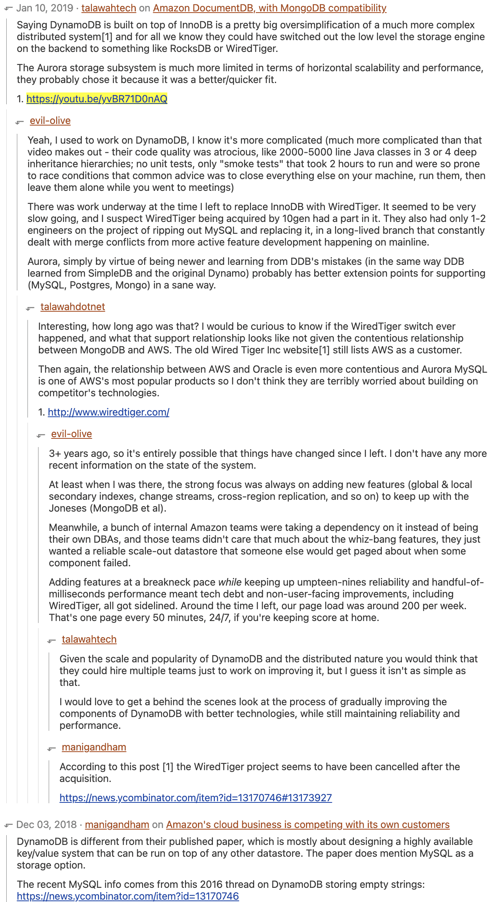

# DynamoDB

[https://www.youtube.com/watch?v=yvBR71D0nAQ](https://www.youtube.com/watch?v=yvBR71D0nAQ)

[https://yahnd.com/theater/r/youtube/yvBR71D0nAQ/](https://yahnd.com/theater/r/youtube/yvBR71D0nAQ/)

- [https://webcache.googleusercontent.com/search?q=cache:uNPnWDBTf7gJ:https://yahnd.com/theater/r/youtube/yvBR71D0nAQ/+&cd=1&hl=ko&ct=clnk&gl=kr](https://webcache.googleusercontent.com/search?q=cache:uNPnWDBTf7gJ:https://yahnd.com/theater/r/youtube/yvBR71D0nAQ/+&cd=1&hl=ko&ct=clnk&gl=kr)

write

- 나자신한테 쓰고 한개 replica가 ack 받으면 유저에게 sucess전달 (low latency를 위해서)
strong consistency라면 replica 모두에게 write할때까지 기다리면 될듯 하다

- dynamo paper 에있던 quorum안씀
- paxos사용 아마도 partition 단위로 paxos group이 있는 spanner와 비슷한 방식?
- request router: metadata에서 table, key 보고 storage node(3개)중 master node에게 operation 전달

storage node는 btree(아마도 range ke 기준일듯?), replication log 저장
btree라고 말하는 것을 보니 아직 innodb이지 않을까

secondary index (아마도 GSI)

- replication log를 읽어서 replay시켜줌 → eventual consistency만 가능한 이유

- 근데 GSI는 hash key가 다른놈이므로, 만약 그 hash key에 대해 put을하면 partition두개를 바꿔야함
- 대충 {”primary_key”:1, “value”:2, “gsi_key”:3} 레코드를 가질때
    - gsi_key를 2로 업데이트 해버리면..
    - gsi_key 3인걸 제거하고, gsi_key2를 put하게됨
    - gsi를 최대 5개까지만들수있으니 최악의경우 11개의 partition을 건드림

LSI (추정)

- 그냥 partition 더 추가하면됨, b tree로 되어있으므로 range key만 다른 애들로 사용 하면 문제 없을듯함근데 이 방식은 strong consistency를 지키기 어려워진다
- 같은 Partition key에 대해 replica들이 별도의 btree를 소유하고 있는 방식일 수도 있음

provisioning

- partition이 RCU를 엔빵해서 가짐
- 사실상 그냥 수익모델 아닌가..? 왜필요한지는 잘 몰겠음 →
→ 전체적인 시스템의 availabiility를 위해서? table을 만든다고 해서 전용 인스턴스를 할당해서 쓰는 구조가 아니므로 이게 맞을듯 함, region 전체에서 관리되는 한개나 엔지니어들이 매뉴얼로 만드는 dynamodb cluster일것같음

- daptive capacity로 hot parittion problem을 좀 완화해주긴함
    - PID controller 이용

- 오토스케일링
    - 내부프로덕에서도 cloudwatch sns를 꾸역꾸역 쓰네..
    지들이 이러니 뭐만하면 람다에 뭐에 붙이라 하는거였군

- conflict resolution
    - last write wins

# Transaction

[https://www.usenix.org/conference/fast19/presentation/terry](https://www.usenix.org/conference/fast19/presentation/terry)

- predictable performance 중요, rdbms는 predictable하지 않다
- nosql database에 transaction없음 (complexity, deadlock, starvation, interference, cost)
    - availbility를 떨어트림

## Transaction Goals

- execute **set of operations**
- **atomically** and **serializably**
- for **any items** in any tables
- with **predictable** performance
- and **no impact** on non-transactional workloads

## Standard Approach

다안씀

- two-phase locking
deadlock, starvation
→ availability, SLA 악영향
- multi-version concurrency control
dynamodb가 multiversion store가 아니라서 안쓰므로 도입하기엔 너무 비용이 큼
- explicit multi-step transactions
시스템이 begin과 commit사이에 얼마나 많은 시간이 걸릴지 알 수 없음
dynamoDB는 multi-tenent system이므로 특정한 operation이 많은 시간을 점유하게 두고싶지 않았음
transaction을 통해 모든 operation을 쓰는게 표준이 되면 성능저하가 뚜렷
→ 뭐만하면 txbegin, txcommit을 남발하는경우

## One shot transaction

여러 테이블에 걸쳐서 가능.

- [Sinfonia: a new paradigm for building scalable distributed systems](http://www.sosp2007.org/papers/sosp064-aguilera.pdf)

### Limitation

transaction중간에 값을 가져와서 저장하려면 오른쪽처럼 바꿔야함

## Transactions Architecture

transaction coordinator

- transaction을 받고, transaction을 wip상태로 ledger에 저장,
    - ledger: persistent하며 dynamodb table로 사용중
- thw phase protocol로 수행
    - prepare step: coordinator가 check condition을 물어봄
    - commit step: write수행

### Fault-Tolerance

- storage node failure는 이미 잘 되어있음, Request router - storage node간 상황이랑 똑같으니
- coordinator가 죽는다면

- recovery manager: ledger를 스캔해서 일정시간내에 complete 되어야 하는데 되지 않은 transaction을 찾아서 새 transaction coordinator에 할당
    - 이 상황에서는 무조건 commit step만 다시하면된다
    1에서 fail인경우 abort return을 내리면 되니까 ? - client가 재시도 한다는 뜻?

### Timestamp Ordering

위까지 보면 isolation을 제공하지 않아서 write시점에 여러 transaction이 일어날 수 있음

timestamp ordering

- transaction에 timestamp 할당해서 timestamp ordering수행
- coordinator
    - current clock 읽어서 transaction에 timestamp 할당
    - storage node에 timestamp를 같이 전달
    - storage node는 in order로 execution되는것을 보장

두 coordinator의 clock이 조금씩 다를텐데 같은 data에 대해 write을 하는경우

clock synchronization이 timestamp ordering에 영향을 미치지 않는다 (아마 lamport clock같은걸 이야기하나본데 정확히 명시하진않음)

그래도 시간차이가 커지면 문제가 될수있으니(?) time sync를 사용, 몇ms이내로 오차를 보정

### Write Transaction

TxC2까지 완료됐는데 TxNew가 들어오는 경우

- timestamp가 realtime이 아니고, coordinator가 할당한 시간이므로 늦게들어오는애가 생김

- indenpendent serializability
각 node는 독립적으로 accept/reject 여부를 결정함 (coordinator가 하지 않는다)

1. tx1 complete을 했는데 txnew가 이전 timestamp로 들어온경우, 이 그림은 realtime이 아니고 coordinator time임!!
    1. 기본적으로는 Reject될것임
    2. 하지만 tx1이 unconditional하다면 txnew는 no-op로 accept가능
    tx1이 unconditional operation이므로 txnew를 무시할 수 있음
2. tx1 complete 이후 시점에 들어오면
    1. txnew의 condition에 따라 accept/reject결정

(몇ms정도의 오차 내에서 먼저들어온넘이 늦게인식된다면 걔는 그냥 버리는듯?)

lock이 없으므로 concurrency, performance 영향을 주지않음

1. txnew가 tx1 complete, tx2 accept사이에 오는경우 (txnew가 tx2보다 늦게들어옴)
    1. tx1가 저장한 값에 txnew 조건이 부합하지 않으면 reject
    2. 조건이 부합한데
        1. tx2가 unconditional하다면 no-op으로 accept
        2. tx2가 conditional하다면 reject
2. txnew가 tx2 accept 이후에 들어온다면
    1. tx2 조건에 따라 accept/reject 결정, 즉 accept되면 commit step에서 값을 저장할거기때문에 선반영?, commit은 어찌됐건 보장이 됨 (recovery manager)

tx1의 put b=1이 늦게들어오면 그냥 무시하게됨

+1같은 operation이면 idempotent하지 않으므로 일정시간 기다린다고함

### Read Transaction

tx1 complete, tx2 accept가 이미 진행됐는데 txnew가 늦게들어온경우

- tx1 complete 이전: reject (MVCC가 아니므로 과거데이터를 볼 수 없음)
wiredtiger가 mvcc를 지원하는데 wiredtiger를 쓰진않음
- tx1 complete, tx2 accept 사이: tx1 complete 직후와 동일하므로 읽어감
- tx2 accept 이후: tx2의 값에 따라서 달라질수있으므로 reject하거나, tx2 complete까지 wait 할 수도 있지만 근데 아마 app이 retry할것이므로 reject하는게 더 나음

결과적으로 contention없이 진행가능 (다만 availability는 좀 떨어질듯? accpet-complete 사이에서는 reject됨)

### Non-transactional Operations

tx와 non-tx request는 서로 독립적으로, 영향을 주지않으면서 실행해야된다

non-tx request는 일단 timestamp가 없이 들어옴, 요청을 storage node가 current clock을 사용함

tx1 complete 시점 이후에 put timestamp가 찍혔다면

- 조건 없이 accept가능

tx1 complete, tx2 accept 사이에 put timestamp가 찍혔다면 (tx2 accept은 이미 accept 된 상태)

- put이 tx2에 영향주지 않으면 accept

tx2 accept, tx2 complete 사이에 put timestamp가 찍혔다면

- tx2가 put에 영향주지 않으면 accept

실제 amazon application에서 non tx put, tx put을 동시에 쓰는 케이스는 못봤지만 아무튼 잘 됨

Non-transactional Read

dynamoDB는 dirty data를 가지지 않음(accept시점에 데이터를 저장하지 않고 있다는 뜻?)

그래서 그냥 언제나 get은 성공함

### Benefits of Timestamp Ordering

- easily correct serializability
- Independent serializability

timestamp ordering으로 lock을 쓰지않는다는게 너무나도 큰 장점

transaction동안 storage node는 다른 애들과 통신하지 않음

배포가 너무 쉬워짐, manual execution이 없고 lock이 없으니 stateless임

latency도 아이템 갯수에 비례 + transaction overhead 정도로만 증가함

- write contention이 많을수록 delay되는 시간이 더 길어지는것은 아닌가? 너무 예외케이스일지도

- transaction안에서 read/write를 같이 할수 있도록 지원해주지 않는 이유는?
    - 가능하긴한데 복잡해진다, api도 복잡해진다 → 클라가 개복잡해진다구요..
    - client lib에서 이런 기능을 넣어줄수는 있다 → 아직도 안넣었네요..