**{{ page.description }}**

# Transactions and Scalability in Cloud Databases—Can’t We Have Both?

- predictable performance 중요, rdbms는 predictable하지 않다
- nosql database에 transaction없음 (complexity, deadlock, starvation, interference, cost)
    - availbility를 떨어트림

## Transaction Goals

- execute **set of operations**
- **atomically** and **serializably**
- for **any items** in any tables
- with **predictable** performance
- and **no impact** on non-transactional workloads

## Standard Approach

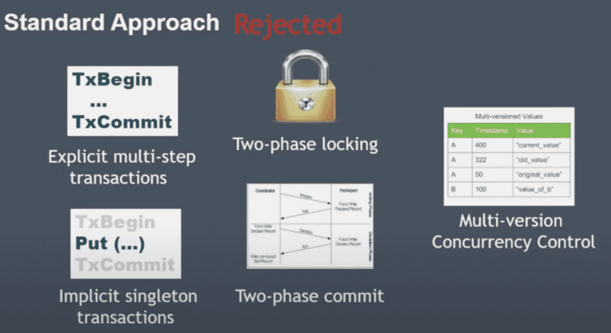

다안씀

- two-phase locking
deadlock, starvation
→ availability, SLA 악영향
- multi-version concurrency control
dynamodb가 multiversion store가 아니라서 안쓰므로 도입하기엔 너무 비용이 큼
- explicit multi-step transactions
시스템이 begin과 commit사이에 얼마나 많은 시간이 걸릴지 알 수 없음
dynamoDB는 multi-tenent system이므로 특정한 operation이 많은 시간을 점유하게 두고싶지 않았음
transaction을 통해 모든 operation을 쓰는게 표준이 되면 성능저하가 뚜렷
→ 뭐만하면 txbegin, txcommit을 남발하는경우

## One shot transaction

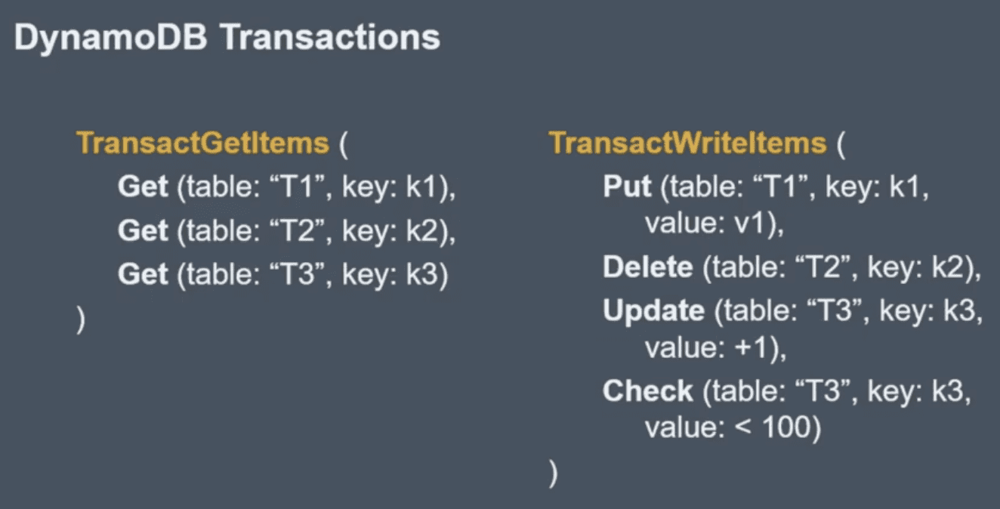

여러 테이블에 걸쳐서 가능.

- [Sinfonia: a new paradigm for building scalable distributed systems](http://www.sosp2007.org/papers/sosp064-aguilera.pdf)

### Limitation

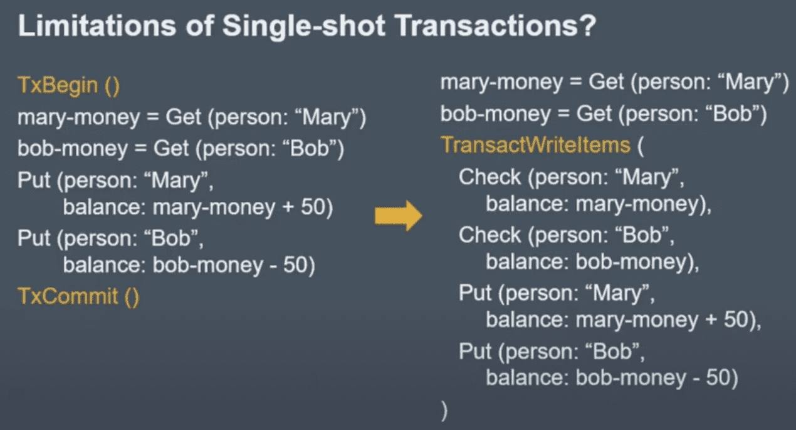

transaction중간에 값을 가져와서 저장하려면 오른쪽처럼 바꿔야함

## Transactions Architecture

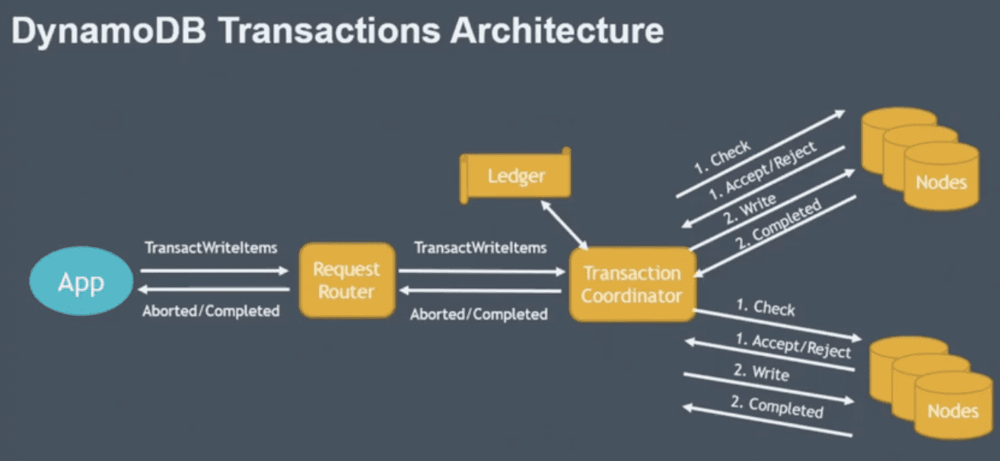

transaction coordinator

- transaction을 받고, transaction을 wip상태로 ledger에 저장,
    - ledger: persistent하며 dynamodb table로 사용중
- two phase protocol로 수행
    - prepare step: coordinator가 check condition을 물어봄
    - commit step: write수행

### Fault-Tolerance

- storage node failure는 이미 잘 되어있음, Request router - storage node간 상황이랑 똑같으니
- coordinator가 죽는다면

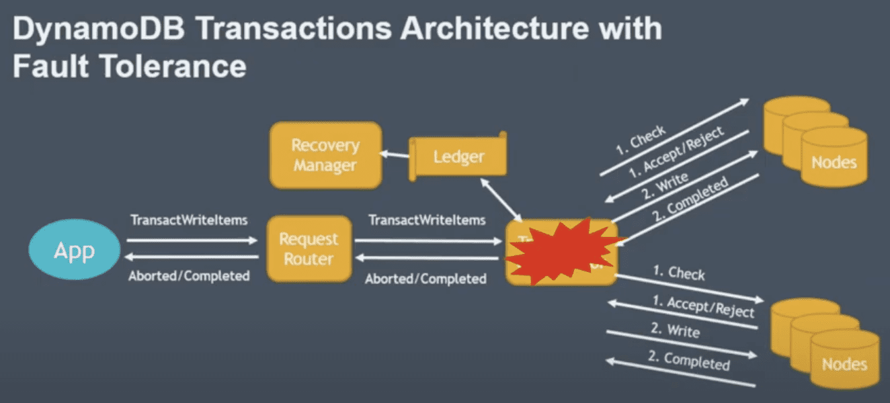

- recovery manager: ledger를 스캔해서 일정시간내에 complete 되어야 하는데 되지 않은 transaction을 찾아서 새 transaction coordinator에 할당
    - 이 상황에서는 무조건 commit step만 다시하면된다
    1에서 fail인경우 abort return을 내리면 되니까 ? - client가 재시도 한다는 뜻?

### Timestamp Ordering

위까지 보면 isolation을 제공하지 않아서 write시점에 여러 transaction이 일어날 수 있음

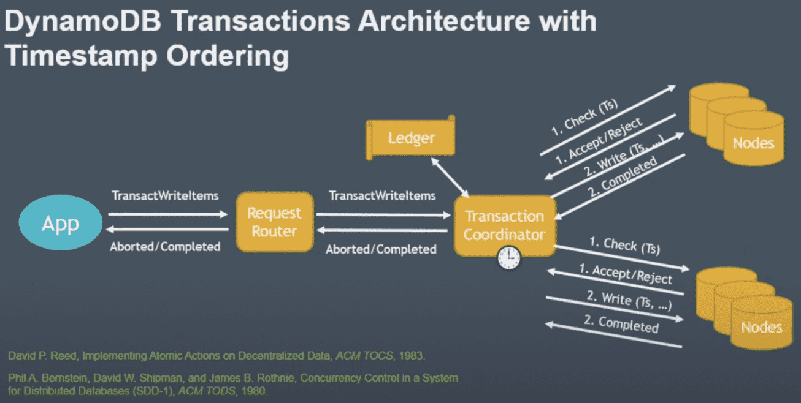

timestamp ordering

- transaction에 timestamp 할당해서 timestamp ordering수행
- coordinator
    - current clock 읽어서 transaction에 timestamp 할당
    - storage node에 timestamp를 같이 전달
    - storage node는 in order로 execution되는것을 보장

두 coordinator의 clock이 조금씩 다를텐데 같은 data에 대해 write을 하는경우

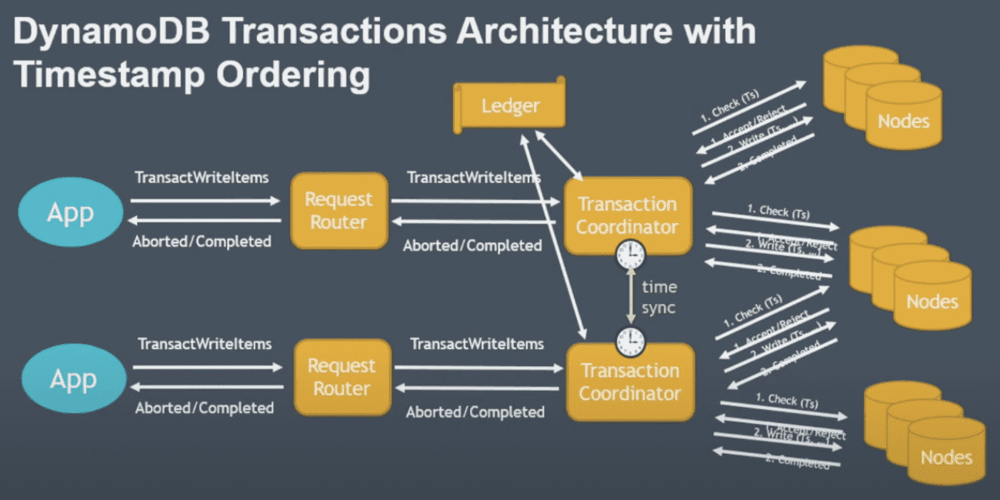

clock synchronization이 timestamp ordering에 영향을 미치지 않는다 (밑에 내용 나옴)

그래도 시간차이가 커지면 문제가 될수있으니(?) time sync를 사용, 몇ms이내로 오차를 보정

### Write Transaction

TxC2까지 완료됐는데 TxNew가 들어오는 경우

- timestamp가 realtime이 아니고, coordinator가 할당한 시간이므로 늦게들어오는애가 생김

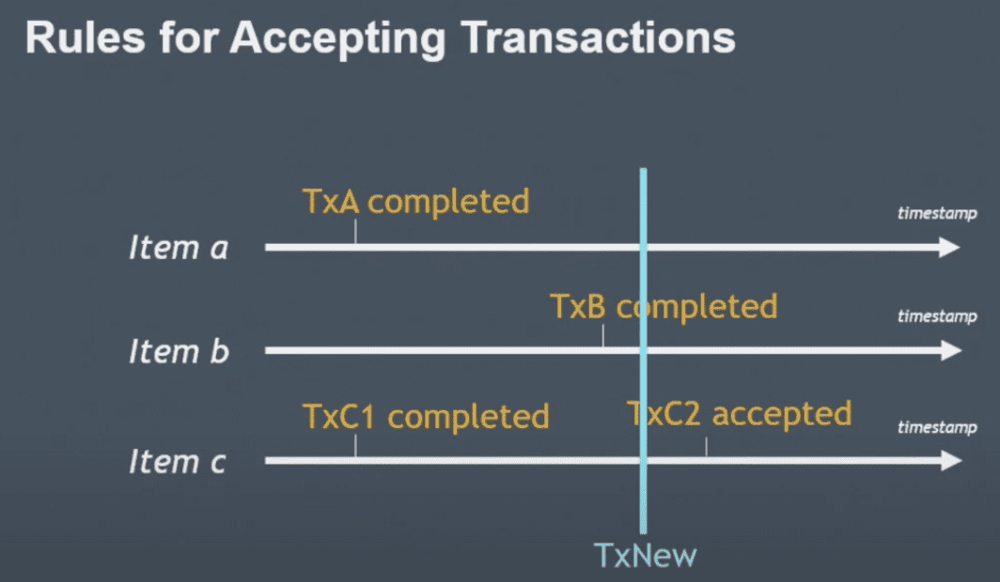

- indenpendent serializability
각 storage node는 독립적으로 accept/reject 여부를 결정함 (coordinator가 하지 않는다)

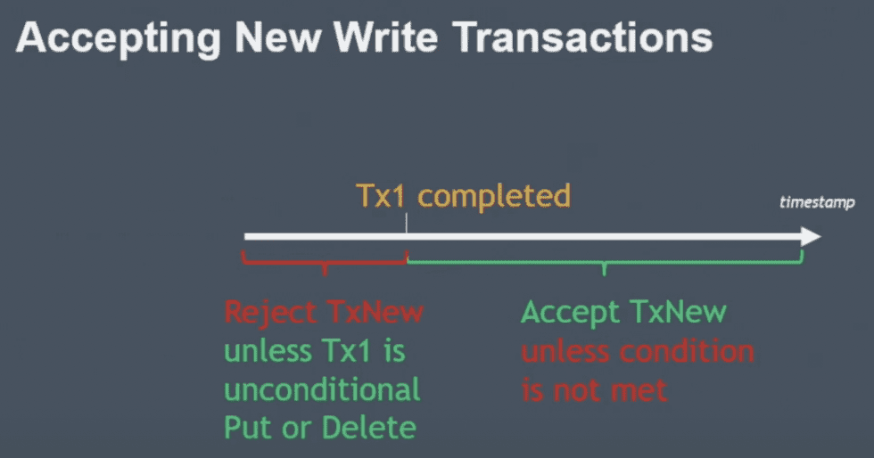

1. tx1 complete을 했는데 txnew가 이전 timestamp를 들고 들어온경우 (coordinator time임)
    1. 기본적으로는 Reject될것임
    2. 하지만 tx1이 unconditional하다면 txnew는 no-op로 accept가능
    tx1이 unconditional operation이므로 txnew를 무시할 수 있음
2. tx1 complete 이후 timestamp를 들고 들어오면
    1. txnew의 condition에 따라 accept/reject결정

(몇ms정도의 오차 내에서 먼저들어온넘이 늦게인식된다면 걔는 그냥 버리는듯?)

lock이 없으므로 concurrency, performance 영향을 주지않음

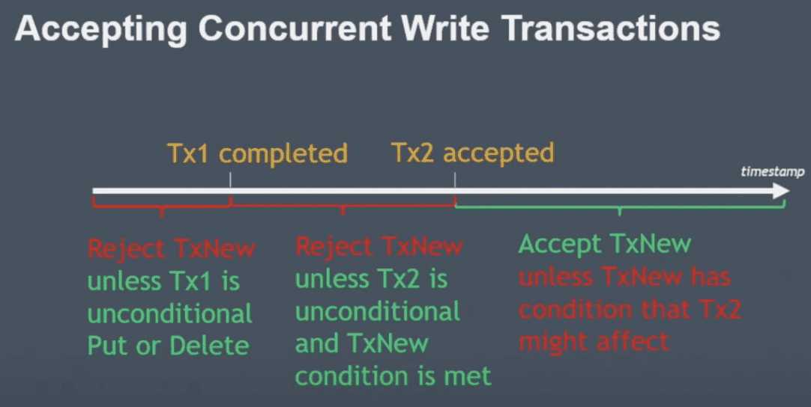

1. txnew가 tx1 complete, tx2 accept사이의 timestamp를 들고 오는경우
    1. tx1가 저장한 값에 txnew 조건이 부합하지 않으면 reject
    2. 조건이 부합한데
        1. tx2가 unconditional하다면 no-op으로 accept
        2. tx2가 conditional하다면 reject (tx2는 이미 accept됨)
2. txnew가 tx2 accept 이후 timestamp로 들어온다면
    1. tx2 조건에 따라 accept/reject 결정, 즉 accept되면 commit step에서 값을 저장할거기때문에 선반영?, commit은 어찌됐건 보장이 됨 (recovery manager)

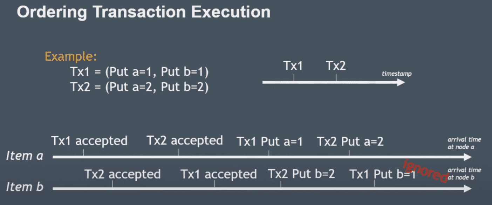

tx1의 put b=1이 늦게들어오면 그냥 무시하게됨. tx2가 timestamp상으로 더 뒤이고, last write win이므로.

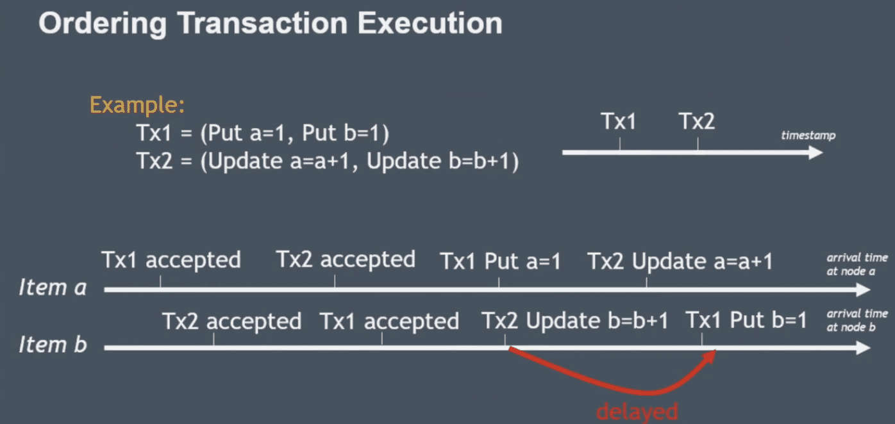

+1같은 operation이면 idempotent하지 않으므로 일정시간 기다린다고함

### Read Transaction

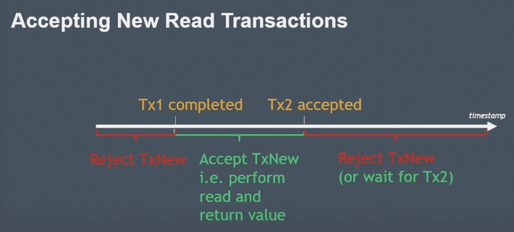

tx1 complete, tx2 accept가 이미 진행됐는데 txnew가 늦게들어온경우

- tx1 complete 이전: reject (MVCC가 아니므로 과거데이터를 볼 수 없음)
wiredtiger가 mvcc를 지원하는데 wiredtiger를 쓰진않음
- tx1 complete, tx2 accept 사이: tx1 complete 직후와 동일하므로 읽어감
- tx2 accept 이후: tx2의 값에 따라서 달라질수있으므로 reject하거나, tx2 complete까지 wait 할 수도 있지만 근데 아마 app이 retry할것이므로 reject하는게 더 나음

결과적으로 contention없이 진행가능 (다만 availability는 좀 떨어질듯? accpet-complete 사이에서는 reject됨)

### Non-transactional Operations

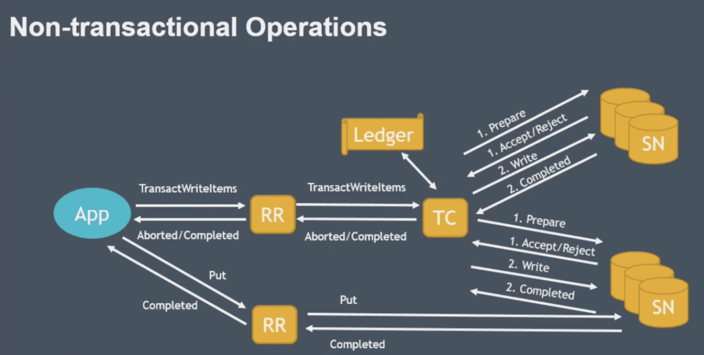

tx와 non-tx request는 서로 독립적으로, 영향을 주지않으면서 실행해야된다

non-tx request는 일단 timestamp가 없이 들어옴, 요청을 storage node가 current clock을 사용함

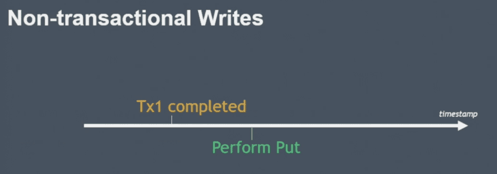

tx1 complete 시점 이후에 put timestamp가 찍혔다면

- 조건 없이 accept가능

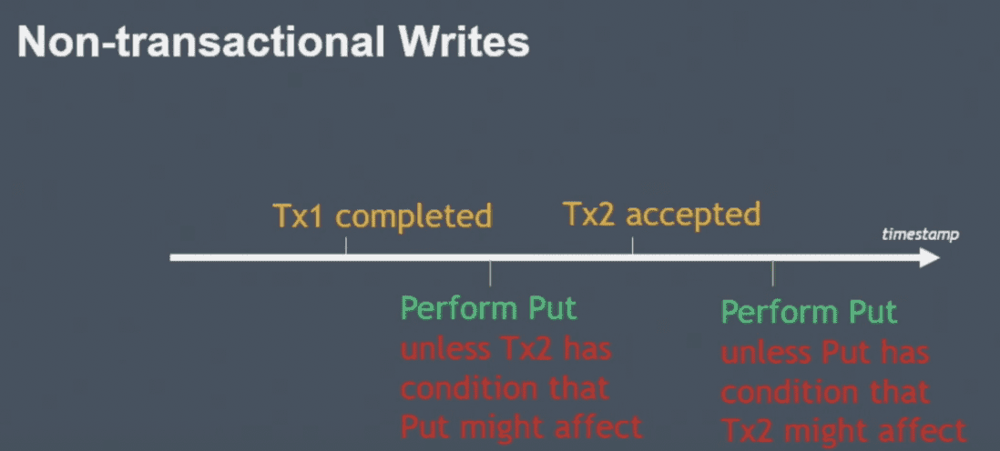

tx1 complete, tx2 accept 사이에 put timestamp가 찍혔다면 (tx2 accept은 이미 accept 된 상태)

- put이 tx2에 영향주지 않으면 accept

tx2 accept, tx2 complete 사이에 put timestamp가 찍혔다면

- tx2가 put에 영향주지 않으면 accept

실제 amazon application에서 non tx put, tx put을 동시에 쓰는 케이스는 못봤지만 아무튼 잘 됨

Non-transactional Read

dynamoDB는 dirty data를 가지지 않음(accept시점에 데이터를 저장하지 않고 있다는 뜻?)

그래서 그냥 언제나 get은 성공함

### Benefits of Timestamp Ordering

- easily correct serializability
- Independent serializability

timestamp ordering으로 lock을 쓰지않는다는게 너무나도 큰 장점

transaction동안 storage node는 다른 애들과 통신하지 않음

배포가 너무 쉬워짐, manual execution이 없고 lock이 없으니 stateless임

latency도 아이템 갯수에 비례 + transaction overhead 정도로만 증가함

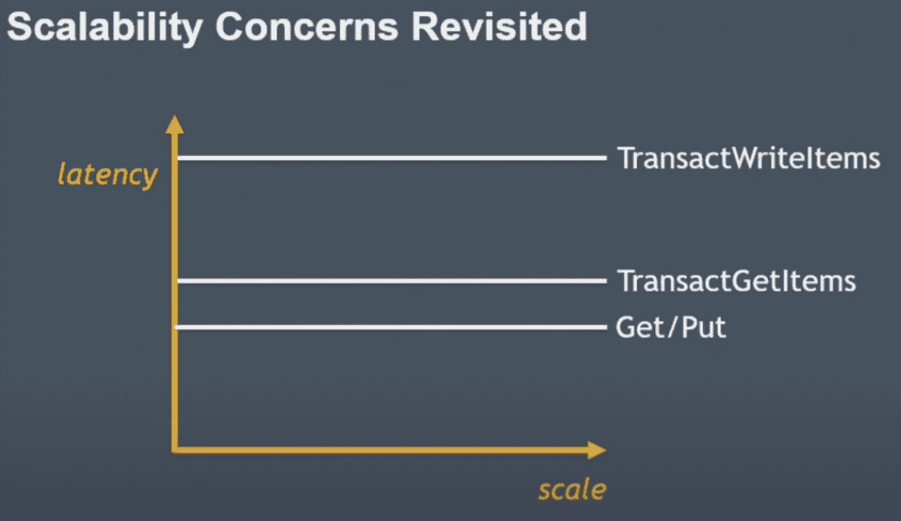

- write contention이 많을수록 delay되는 시간이 더 길어지는것은 아닌가? 너무 예외케이스일지도

- transaction안에서 read/write를 같이 할수 있도록 지원해주지 않는 이유는?
    - 가능하긴한데 복잡해진다, api도 복잡해진다
    - client lib에서 이런 기능을 넣어줄수는 있다
