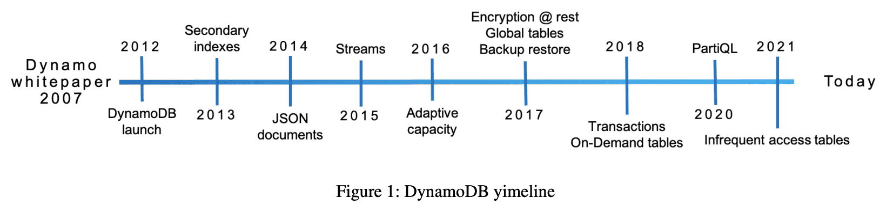
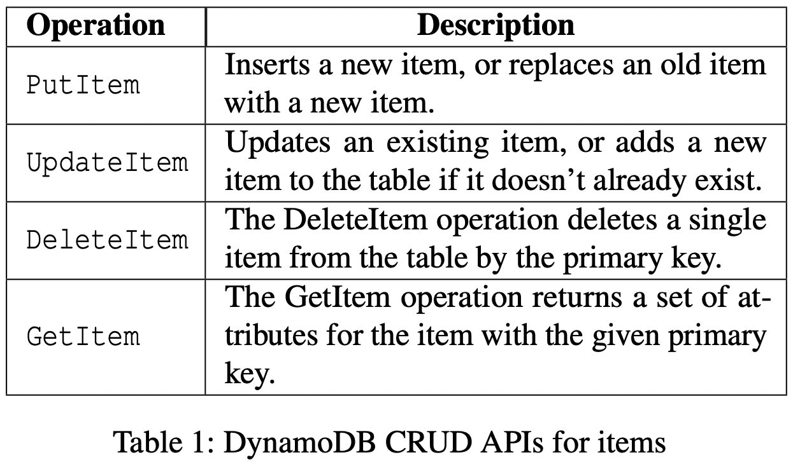
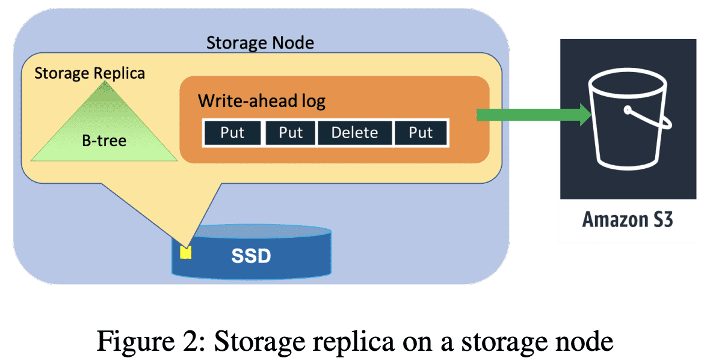
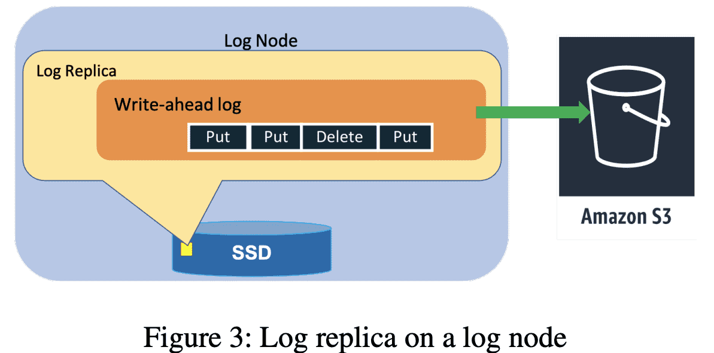
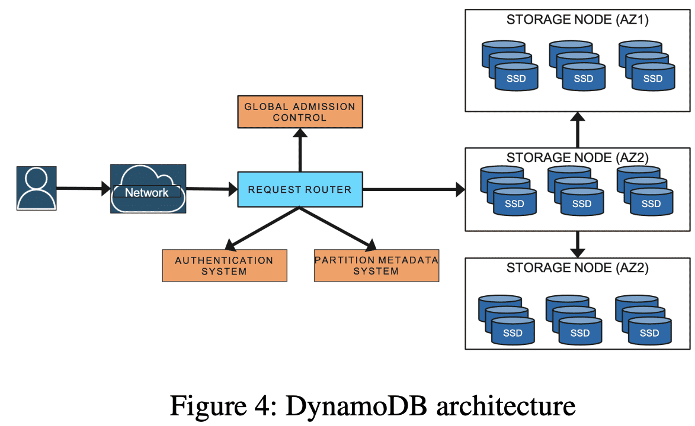

{{ page.description }}

# Amazon DynamoDB: A Scalable, Predictably Performant, and Fully Managed NoSQL Database Service (ATC ‘22)

[HN Comments](https://news.ycombinator.com/item?id=32094046)

## 1. Introduction

DynamoDB의 design goal은 “모든" request를 10ms 이내로 완료하는 것이다. 10년동안 operational requirements에 영향을 주지 않으면서 기능을 추가하는것은 key challenge였다. DynamoDB는 아래 fundamental system propertey를 따른다.

DynamoDB Timeline

***DynamoDB is a fully managed cloud service.***

DynamoDB API를 통해 appalication은 DynamoDB가 어떻게 관리되고, 저장되는지 신경쓰지않고 사용한다. DynamoDB는 resource provisioning을 수행하고, failure로부터 자동으로 복구하고, data encryption, software upgrade, backup을 수행하는등 fully-managed service에 필요한 모든것을 수행한다.

***DyanmoDB employs a multi-tenant architecture.***

DynamoDB는 높은 resource utilization을 유지하기 위해 같은 physical machine에 서로 다른 유저의 data를 저장해서 비용을 절감한다. resource reservation, tight provisioning, monitored usage는 co-resident table의 workload들이 있어도 isolation을 제공한다.

***DynamoDB achieves boundless scale for tables.***

각 table이 저장할 수 있는 data 양에 제한이 없다. table은 application의 요구에 맞춰 커지게 된다. DynamoDB는 table에서 사용되는 resource를 필요에 따라 스케일 할 수 있다. data를 더 많은 서버로 뿌려서 throughput requirements가 올라가도 대응할 수 있다.

***DynamoDB provides predictable performance.***

$GetItem,\ PutItem$ operation은 consistent low latency로 응답한다. 같은 region에 속하는 application data는 1KB item에 대해 10ms 미만의 average server-side latency를 가진다. 또한 예측가능하다. table이 수백 terabytes까지 커져도 DynamoDB가 가지는 distributed nature, request routing algorithm으로 안정적인 latency를 가진다. DynamoDB는 horizontal scaling과 자동적인 partition, re-partition을 통해 어떤 수준의 traffic도 처리할 수 있다.

***DynamoDB is highly available.***

DynamoDB는 여러 AZ로 replicate 하고, availability, durablity를 맞추기 위해 disk/node failure에서 알아서 re-replicate한다. 유저는 disaster recovery를 위해 geo-replicated가 되는 global table을 만들 수 있으며, 어디서든지 low latency를 제공한다. DynamoDB의 availability SLA는 일반 테이블에서 99.99이고, global table에서 99.999 이다.

***DynamoDB supports flexible use cases.***

DynamoDB는 개발자가 특정한 data model이나 consistency model을 사용하도록 강제하지 않는다. table은 fixed schema가 아니라 다양한 type으로 수많은 attrubute를 가지는 아이템을 저장할 수 있다. 개발자들은 한 table에서 item을 읽을 때, strong/eventual consistency를 선택할 수 있다.

수년동안 아래와같은 lesson을 얻었다.

- traffic pattern에 따라 table의 physical partitioning scheme을 재구성하는건 customer experience를 향상시켰다.
- 사용되지 않는 data를 지속적으로 검증하는것은 hardware failure, software bug를 막기 위한 좋은 방법이다.
- system이 커지는것에 따라 high availability를 유지하는것은 조심스런 operation을 필요로한다. 복잡한 알고리즘 검증, game day, upgrade/downgrade test, deployement safety같은 메카니즘은 correctness를 깰것이라는 두려움을 없애주고 안정적으로 코드를 적용하게 해준다.
- efficiency보다 predicatbility를 목표로하는 시스템 디자인은 시스템을 stable하게 만든다. cache같은 컴포넌트가 성능을 향상시키지만, cache가 사라지는 경우에 해야하는 일들이 숨겨두지 않아야 시스템이 예측되지않은 상황을 언제나 잘 처리 하도록 보장할 수 있다.

## 2. History

Dynamo(SOSP ‘07)는 single tenant system이고 self-managed DB라 운영하는데 어렵다. 

SimpleDB는 amazon의 첫번째 database-as-a-service 였다. 개발자 개입없이 high availbility, durability를 제공했다. 하지만 SimpleDB는 테이블의 throughput, capacity가 제한적이었으며, r/w가 unpredictable했다. 모든 table attribute가 인덱싱되어 모든 write에 index가 update되어야 했기 떄문이다. 이 점은 개발자들이 table을 더 쪼개도록 하여 또다른 operational overhead를 만들었다.

따라서 Dyanmo Design의 좋은점 (incremental scalabilyt, predictable high performance)와 Simple DB의 좋은점 (운영 쉬움, consistency, KV store보다 더 나은 table-based data model)을 합치기로 했다.

## 2. Architecture

primary, sort key 구성, uniqueness (primary + sort), 1개 이상의 secondary index가능. scalability, availability, performance를 유지하면서 ACID transaction 가능.

DynamoDB CRUD APIs for items

table은 throughput, storage requirements를 맞추기 위해 여러 partition으로 쪼개진다. table의 각 partition은 table의 primary key range를 disjoint/continuous part로 나눠 가진다. 각 partition은 high availability/durablity를 위해 여러 AZ에 걸쳐 여러 replica를 가진다. partition에 대한 replica들은 replication group을 만들고, replicagion group은 Multi-Paxos로 consensus를 이룬다. 모든 replica는 election round를 시작할 수 있다. leader가 뽑히면 replica는 leadership lease가 주기적으로 갱신되기 전까지 leadership을 가진다.

leader replica만 write와 strongly consistent read request를 받는다. write request를 받으면 key에 대한 replication group의 leader는 WAL record를 만들고 replicas에게 전달한다. quorum(n/2+1)이 log record를 local WAL에 저장하면 client에게 ack를 보낸다. 모든 replica는 eventually consistent read를 수행한다.  leader는 lease mechanism을 통해 leadership을 연장한다. replica들이 leader failure가 감지하면, 자신이 leader가 되기 위한 election을 시작한다. 새 leader는 이전 leader의 lease가 끝나기 전까지 write나 consistent read를 수행할 수 없다. (이러면 latency가 어떻게 될까?)

Storage replica on a storage node

Log replica on a log node

replication group은 WAL log와 key-value data를 저장하기 위한 B-Tree를 저장하는 storage replica이다 (Figure 2). availability, durability를 위해 WAL entry만 저장하는 replication group(Log Replica)도 있다(Figure 3). Log replicas는 Paxos의 acceptor와 비슷한 역할을 한다. Section 5,6 에서 어떻게 Log replica가 avilability, durability를 향상시키는지 보여줄것이다.

DynamoDB Architecture

DynamoDB는 수십개의 microservice로 구성된다. core service는 Metadata Service, Requets Routing Service, Storage Node, Autoadmin Service이다.

- Metadata Service: table, index, key의 replication group에 대한 라우팅 정보를 저장한다.
- Request Routing Service: authroization, authentication과 각 요청을 적절한 서버로 라우팅하는 역할을 한다. 모든 read, update request는 storage node로 라우팅된다. Request Router는 Metadata Service에서 routing information을 조회한다. resource를 생성,업뎃하거나 data definition에 대한 요청은 Autoadmin service로 라우팅한다.
- Storage Service: storage node에 data를 저장한다. 각 storage node는 여러 partition에 대한 replica를 저장한다.
- Autoadmin Service: Fleet health, Partition health, table scaling, control plane request를 책임진다.
Autoadmin service는 모든 partition의 health를 모니터링하고 unhealthy일때 replica를 교체한다. 또한 DynamoDB의 모든 core components의 health를 모니터링하고 failure가 발생할시 하드웨어를 교체(?)한다. 예를들어 storage node가 unhealthy이면, recovery process를 실행시켜 해당 node에서 동작하는 replica를 교체해서 정상으로 돌아오게 만든다.

다른 service는 point-in-time restore, on-demand backup, update stream, global admission control, global tables, global secondary indexes, transactions등이 있다.

## 4. Journey From Provisioned to On-demand

처음 DynamoDB release때, table이 필요로하는 RCU, WCU를 명시 했다. 1초에 1 RCU에서 4KB item까지 strongly consistent read request를 보낼 수 있고, 1 WCU에서는 1KB까지 write를 수행할 수 있다. RCU, WCU를 합쳐 provisioned throughput이라 부른다. 기존 system은 table을 partition으로 나누어 테이블이 여러 storage node에 뿌려지도록 하고, node들의 available space, performance에 매핑되었다. 바뀌는 요구사항에 따라 partition은 더 split, migrate된다. partition abstraction은 DynamoDB에서 가장 주요한 디자인으로 평가된다. 하지만 capacity와 performance를 각 partition으로 커플링 시킨건 또다른 문제를 야기했다.

DynamoDB는 storage node가 overload되어 co-resident table partition에 영향을 주지 않도록 admission control을 쓰고, throughput limit을 설정했다. Admission control은 한 테이블이 모든 storage node에 대한 책임을 공유하는 것이었다. Storage node는 저장된 partition에 따라 독립적으로 admission control을 수행한다. storage node가 여러 table의 partition을 가지면, 각 partition의 allocated throughput은 workload마다 격리된다. DynamoDB는 한 partition에 할당되는 maximum throughput 제한을 강제하고, 한 storage node에 있는 모든 partition의 전체 throughput이 node가 가지는 storage drive에 따라, maximum allowed throughput보다 작거나 같도록 한다.

partition에 할당된 throughput은 table throughput이 변경되거나, partition이 child partition으로 쪼개질때 조정된다. partition이 size에 의해 쪼개지면 parent partition의 allocated throughput은 여러 child partition으로 동등하게 나뉜다. partition이 throughput에 의해 쪼개지면 새 partition은 table의 provisioned throughput을 기반으로 throughput을 할당받는다.

예를들어, partition이 1000 WCU까지 받을수 있을 때, table이 3200WCU를 가지면 DynamoDB는 4개 partition을 각각 800WCU로 생성한다. table의 provisioned throughput이 3600WCU로 바뀌면 900 WCU씩 가진다. table이 6000WCU로 바뀌면 partition들은 8개의 child partition으로 나뉘고 각각 750WCU씩 가진다. 여기서 table이 5000WCU로 줄어들면 각 partition은 675WCU씩 가진다.

throughput의 uniform distribution은 partition이 uniform access parttern을 가지는것을 가정한다. 하지만 실제로 application workload는 시간이나 key range에서 non-uniform access pattern을 가지는경우가 많았다. table의 request rate이 non-uniform이면 hot partition을 나누고, 나눈만큼 균등하게 throughput을 가져가는 것은 partition을 나누기 이전보다 availability가 떨어진다. throughput이 static하게 할당되고 partition level에서 강제되다보니 non-uniform workload는 total provisioned throughput이 충분함에도 불구하고, throttling이 걸리게 된다. 

따라서 application은 Hot Partition, Throughput Dilution문제를 만나게 된다. Hot Partition은 application이 지속적으로 테이블의 일부 아이템만 접근할떄 생긴다. hot item은 stable partition set에 속할수도 있고(무슨 의미.?), 시간이 지나면서 다른 partition으로 옮겨갈수도 있다. Throughput Dilution은 partition이 size에 의해 나누어질때 생긴다. size로 partition을 나누면 throughput을 두개의 partition이 절반씩 나뉘어 가지므로 partition당 throughput은 떨어지게된다.

유저 관점으로 보면 두 케이스는 application이 예측한대로 동작하고 있다 하더라도(RPS는 그대로) throttling이 생겨 unavailable해진다. 유저는 provisioned throughput을 늘리고 모든 capacity를 쓰지 않는 방식으로 대처한다. 따라서 over-provisioned하는 경향이 생긴다. 그들이 필요로하는 성능을 얻지만, table에 대한 적절한 performance provisioning을 추정하기 어려워서 나쁜 경험을 만든다.

### 4.1 Initial improvements to admission control

Hot Partition, Throughput Dilution은 각 partition에 performance allocation이 커플링되어있고 partition split때 performance allocation도 따라 나뉘어지는것에서 기인한다. distributed admission control의 복잡성을 피하기 위해 각 partition level에서 performance allocation을 강제했지만 이것만으론 부족했다. DynamoDB 런칭 이후 이런 문제를 해결하기 위해 Bursting, Adaptive capacity를 도입하였다.

**4.1.1 Bursting**

partition이 non-uniform access pattern을 가질때, 해당 node에 있는 모든 partition이 allocatd throughput을 동시에 사용하지 않는 것을 봤다. 따라서 partition level에서 temporal spike를 버티기 위해 bursting을 도입했다. bursting은 application이 best-effort로 partition level에서 unused capacity를 활용하는 것이다. DynamoDB는 partition의 unused capacity의 비율을 들고있다가 이후 spike에서 최대 5분까지 burst로 동작해서 최대 provisioned capacity까지 throughput을 사용할수 있도록 했다. 이 unused capacity를 burst capacity라 부른다.

DynamoDB는 node level에서 unused throughput이 있는경우에 partition이 burst를 수행할수있도록 보장하해서 여전히 workload isolation(burst로 인해 다른 application에 영향을 주면안됨)을 쓰고있다. storage node에 capacity는 multiple token bucket으로 관리한다. 각 partition에대한 2개의 bucket(allocated, burst)와 node에대한 1개 bucket이 있다. r/w request가 storage node에 들어올 때 partition의 allocated token bucket에 token이 있다면 request를 처리하고, partition/node level bucket에서 token이 차감된다. partition이 모든 provisioned token을 소비하면, request는 node level token bucket과 burst token bucket에 둘다 token이 존재할때만 burst로 동작가능하다. Read request는 local token bucket을 기반으로 accept되고, write request는 partition의 다른 member replica의 node-level token bucket에 대한 burst capacity를 추가적으로 확인해야한다. partition의 leader replica는 주기적으로 각 member의 node-level bucket을 수집한다. Section 4.3에서 burst를 위해 추가적인 알고리즘을 도입했는지 알수있다.

**4.1.2 Adaptive Capacity**

DynamoDB는 burst capacity로도 부족한 long lived spike도 처리할수 있도록 adaptive capacity를 도입했다. Adaptive capacity는 DynamoDB가 skewed access pattern을 가지는 workload도 처리할수 있도록해준다. Adaptive capacity는 모든 table의 privisioned, consumed capacity를 모니터링한다. table이 throttling에 걸리고 table level throughput이 초과되지 않으면 proportional control algorithm을 통해 자동적으로 해당 table에서 throttlling이 걸린 partition에 대한 allocated throughput을 boost시킨다. table이 provisioned capacity보다 더 많이 consuming하면 boost를 받은 partition의 cpaiacity는 줄어든다. autoadmin system은 boost를 받은 partition이 increased throughput을 처리할 수 있는 적절한 node로 relocate시킨다. bursting처럼 adpative capacity도 skewed access pattern의 99.99% 이상 throttling을 없애주지만, best-effort로 동작한다.

### 4.2 Global Admission Control

DynamoDB가 bursting, adaptive capacity로 non-uniform access에서 throughput 문제를 매우 크게 감소시켰지만 한계점은 있다. Bursting은 short-lived spike에서 의미가 있고 node가 bursting을 지원할 만큼의 throughput이 있어야 한다. Adaptive capacity는 throttling 문제가 생겨야지만 동작한다. 즉 application이 unavilable한 상황을 겪게된다. partition level의 admission control을 제거하고 worload isolation을 제공하면서 partition이 언제나 burst로 동작하는것이 훨씬 이점을 가질수 있다.

이 문제를 해결하기 위해 DynamoDB는 GAC(Global Admission Control)과 함께 adaptive capacity를 갈아끼웠다. GAC는 token bucket과 비슷하게 만들어졌다. **GAC service**는 token에 대한 table의 total consumption을 트래킹한다. 각 request router는 admission decision을 위해 local token bucket을 유지하고 GAC와 통신해서 주기적으로(몇초마다) token을 다시 채운다. GAC는 client request를 on-the-fly로 처리하는 ephemeral state를 유지한다. 각 GAC server는 다른 서비스에 영향을 주지않고 멈추거나 재시작할 수 있다(이전에 ephemeral state가 logging이 된다는 의미?). 각 GAC server는 독립적으로 1개이상의 token bucket을 트래킹한다. 모든 GAC server는 independent hash ring의 일부이다(Dynamo에서 본 hash ring과 비슷?). application으로부터 request가 도착하면 request router는 token을 감소시킨다. 결과적으로 request router는 token을 소비하거나 expiry로 token을 다 소모한다. 여기서 request router가 token을 쓰려고하면 GAC로부터 token을 더 요청한다. GAC instance는 client에서 제공하는 정보를 이용해 global token consumption을 추정하고, 다음 time unit에 사용가능한 token을 “전체 token”중 해당 client의 몫으로 전달한다. 따라서 non-uniform workload는 maximum partition capacity까지 throughput을 올릴 수 있다.

또한 partition level token bucket도 사용중이다. partition level token bucket capacity는 한 application이 해당 storage node의 거의 대다수를 쓰지 못하도록 막는 역할을 한다.

### 4.3 Balancing Consumed Capacity

DynamoDB는 다양한 hardware instance type에서 동작하며 서로 다른 throughput, storage를 가진다. storage node의 최신 세대는 수천개의 partition replica를 가진다. single storage node에 있는 partition들은 서로 연관이없고 다른 table에 속한다. 한 storage node에 여러 table의 replica들을 호스팅하는것은 다른 customer들이 다른 traffic pattern을 가지므로, replica들이 availabilty, predictable performance, security, elasticity같은 중요한 property를 위반하지않고 안전하게 co-exist할 수 있도록 결정하는 allocation scheme도 잘 정의해야 한다.

colocation은 provisioned throughput table에서는 명확한 문제이다. colocation은 provisioned mode에서 partition이 static하므로 쉽게 관리 가능하다. bursting, adaptive capacity없는 provisioned table 케이스에서 allocated capacity를 기반으로 partition을 찾으면 된다. partition은 allocated capacity보다 더많은 트래픽을 허용하지 않으므로 다른것을 고려할게 없다. storage node의 모든 partition은 해당 instance에 모든 capacity를 사용하려 하지않는다. workload가 바뀔때 대응하기 위한 bursting은 storage node가 prescribed capacity를 넘어가므로 colocation은 더 복잡한 문제가 된다. 따라서 node의 전체 provisioned capacity보다 더 큰 capacity를 가지는 replica set을 storage node로 묶는다. DynamoDB는 tightly packed replica에서 생기는 availability risk를 완화하기 위해 적극적으로 throughput consumption, storage를 바탕으로 storage node간 할당된 partition을 밸런싱한다. 각 storage node는 독립적으로 자신이 가진 replica의 전체 throughput, data size를 모니터링한다. throughput이 node maximum capacity의 일정 비율 이상을 넘어가게되면, autoadmin service로 해당 node에서 옮겨야 될 것같은 candidate partition replica list를 전달한다. autoadmin service는 같은 AZ (만약없다면 다른 AZ)에서 새 storage node(같은 replica를 가지고있지않아야 함)를 찾는다.

### 4.3 Splitting for Consumption

GAC와 partition이 언제나 burst로 동작하지만 table은 traffic skew가 있을때 throttling에 걸릴 수 있다. 따라서 DynamoDB는 자동적으로 consumed throughput을 기반으로 partition을 scale out 시킨다. partition의 consumed throughput이 threshold를 넘어가면 partition은 consumption 기반 split을 진행한다. split point는 해당 partition의 key distribution을 보고 결정한다. key distribution은 application access pattern의 proxy 역할을 해서 key range를 절반으로 쪼개는 것보다 더 효과적으로 동작한다. partition split은 일반적으로 몇분 내에 완료된다. 하지만 split을 하고도 문제가 계속 생길 수 있다. 예를들어 partition이 한 item에만 트래픽이 높거나, key range를 sequential하게 접근한다면 그 이점을 얻지 못한다(후자는 애초에 provisioned capacity를 넘은것같음). DynamoDB는 이런 access pattern을 감지하고 partition split을 하지 않게된다.

### 4.5 On-demand Provisioning

DynamoDB로 migration한 application들은 이전에 self-hosted나 on-premise로 동작했다. 이런 상황에서 application developer는 provisioning을 해야 했다. DynamoDB는 단순한 serverless operational model과 RCU,WCU라는 새로운 provisioning model을 제공한다. capacity unit의 컨셉이 customer에게 새로운 것이므로 provisoined throughput을 예측하는것이 새로운 문제가 되었다. 이전에 언급한것처럼 customer는 over-provisioning으로 낮은 utilization을 경험하거나, under-provisioning으로 throttle을 겪게된다. 따라서 spike workload에서도 사용자 경험을 향상시키기 위해 on-demand table을 도입했다. On-demand table은 customer가 적절한 provisioning을 설정하는 부담을 없애준다. DynamoDB는 r/w 요청을 수집하는 consumed capacity를 기반으로 on-demand table을 provisioning하고 즉각적으로 table이 이전 peak traffic기준 2배의 provisioning capacity를 가지게 한다. application이 이전 peak기준 2배보다 더 큰 트래픽을 필요로하면 workload의 throttling을 막기 위해 자동적으로 더 많은 capacity를 할당한다. On-demand는 table을 consumption 기반 partition split을 통해 scaling을 수행한다. GAC는 DynamoDB가 한 application이 많은 resource를 사용하는것을 모니터링하고 막는다. consumed capacity에 기반한 밸런싱은 효과적으로 on-demand table의 partition이 node level limit까지 throughput을 사용하지 않도록 만들게 된다.

## 5. Durability and Correctness

Data는 commit된 이후 사라져선 안된다. 실제로 data loss는 hardware failure, software bug, hardware bug때문에 발생할 수 있다. DynamoDB는 어떤 potential data loss던지 예방하고, 감지하고,고칠 수 있는 mechanism을 통해 high durability를 제공한다.

### 5.1 Hardware Failures

대부분 DBMS 처럼 DynamoDB는 WAL을 durability, recovery를 위해 주로 쓰인다. WAL은 partition의 3개 replica 모두에 저장한다. 높은 durability를 위해 WAL은 주기적으로 11 nines durability를 제공하는 S3에 저장한다. 각 replica는 archive를 기다리는 recent WAL을 저장하고 있는다. unarchived logs는 일반적으로 수백MB정도 된다.

large service에서 memory, disk failure는 일반적이다. node failure에서 failed node에 있는 모든 replication group은 unavailable해지고 다른 node들에 있는 2 copy만 available해진다. storage replica를 복구하는 프로세스는 B-Tree, WAL을 복제해야 하므로 몇분정도 소요된다. unhealthy storage replica를 찾으면 replication group의 leader는 durability문제가 생기지 않도록 log replica를 추가한다 (2 copy인데 혹시모르니 추가?). log replica를 추가하는건 healthy replica로부터 B-Tree는 빼고, 최근 WAL만 복제하면 되므로 몇초밖에 걸리지 않는다. 따라서 log replica를 이용해 replicagion group을 복구하는건 대부분의 recent write에서 높은 Durability를 가진다.

### 5.2. Silent Data Errors

일부 hardware failure는 잘못된 data가 저장될 수 있다. 경험상 이런 에러는 storage, CPU, memory에서 일어난다. 불행히도 이런 문제를 감지하는건 어렵고 시스템의 어느 부분에서든지 발생 가능하다. DyanmoDB는 이런 silent error를 감지하기 위해 checksum을 사용한다. 모든 log entry, message, log file에서 checksum을 유지해서 2개 node간 모든 data transfer에서 data integrity를 검증한다. checksum을 통해 다른 system으로 error가 퍼지는 것을 막게 된다. 예를들어 checksum은 node, component간의 모든 message를 계산하고 검증한다. checksum이 없으면 어떤 layer에서든지 silent error가 발생할 수 있다.

S3에 저장되는 모든 log file은 log file에 저장된 data에 대한 log, table, partition, start/end marker 정보를 저장하는 manifest를 가진다. log file을 S3으로 아카이빙 시키는 역할을 하는 agnet는 data를 업로드 하기전에 다양한 검증을 수행한다. correct table, partition의 것이 맞는지 보장하기 위해 모든 log entry를 검증하고 silent error를 감지하는 checksum을 확인하고, log file에 sequence number가 consecutive한지 확인하는 검증을 한다. 모든 check를 통과하면 Log file과 manifest는 archive된다. Log archival agent는 replication group의 3개(모든) replica에서 실행한다 (왜지). agent중 하나가 archive를 완료하면 agent는 uploaded file을 받아서 local WAL과 비교하여 data integrity를 검증한다. 모든 log file, manifest file은 S3에 content checksum과 함꼐 저장된다. content checksum은 S3의 put operation떄 검증되어 S3에 전송되는동안 error가 생기는것을 막는다. 

### 5.3 Continuous Verification

DynamoDB는 지속적으로 기존 data를 검증한다. 목표는 모든 silent data error와 bit rot을 감지하는 것이다. continuouse verification system의 예시는 scrub process이다. scrub의 목표는 bit rot처럼 예상하지 못하는 에러를 감지하는 것이다. scrub은 replication group의 모든 3 copy가 같은 data를 가지도록 하고, archived WAL entry를 이용해 offline으로 만들어지는 replica copy와 일치하도록 한다. archived log를 이용해 replica를 만드는것은 Section 5.5에 나온다. 검증은 live replica의 checksum을 계산하고, S3에 저장된 Log entry에서 생성된 snapshot과 매칭한다. scrub mechanism은 live storage replica와 archive log에서 만들어진 replica간의 divergence를 감지하는 방패역할을 한다. 이런 check들은 system을 운영하는데 자신감을 준다. global table의 Replica들을 검증할때도 continuous verification과 비슷하게 활용한다. 몇년간 저장된 데이터의 continuous verification이 hardware failure, silent data corruption, software bug등을 찾는데 가장 안정적인 방법임을 확인했다.

### 5.3 Software Bugs

DynamoDB는 복잡한 시스템을 가지는 key-value store이다. 복잡성은 design, code, operation에서 human error의 가능성을 높인다. system error는 data가 사라지거나 corruption이 발생하거나, API를 위반할 수도 있다. replication protocol의 correctness를 보장하기 위해 [formal method](https://cacm.acm.org/magazines/2015/4/184701-how-amazon-web-services-uses-formal-methods/fulltext)를 사용한다. 코어 Replication protocol은 TLA+를 이용해 명세를 만든다. replication protocol에 영향을 미치는 새 feature가 더해지면 TLA+로 spec에 추가되고 model check를 수행한다. model checking은 production 배포 전에 durability, correctness issue를 만들 수 있는 버그를 잡는다. S3같은 다른 서비스도 model check를 수행한다.

또한 failure injection testing과 stress testing을 수행하여 배포된 software의 모든 곳에 correctness를 검증한다. data plane에서 replication protocol을 테스트하고 검증하는것 말고도 formal method는 control plane과 distributed transaction같은 기능의 correctness를 검증한다.

### 5.5 Backups and Restores

DyanmoDB는 customer application에서 생기는 bug로 인한 logical corruption을 막기위한 backup, restore도 제공한다. backup, restore는 S3에 archive되는 WAL을 이용하므로 table의 performance, availability에 영향을 미치지 않는다. backup은 여러 partition에서 초단위까지 consistent하다. backup은 table full copy이고 S3 bucket에 저장된다. backup된 data는 아무때나 table로 복구할 수 있다.

또한 point-in-time restore를 제공한다. point-in-time restore를 통해 customer는 같은 Region의 다른 table로 최근 35일내에 존재하는 table content를 복구할 수 있다. point-in-time restore를 켜면 table에 속하는 partition snapshot을 주기적으로 S3에 업로드한다. partition이 snapshot되는 주기는 partition에 쌓이는 WAL 양에 의해 결정된다. WAL과 함께 snapshot은 point-in-time restore에 사용된다. point-in-time restore 요청이 들어오면 요청한 시점의 가장 가까운 snapshot을 찾아, 요청시점까지의 log를 반영하고 table snapshot을 생성한다음 복구한다.

## 6. Availability

High availability를 위해 table은 한 region의 여러 AZ로 분산되고 replicate된다. DynamoDB는 주기적으로 node, rack, AZ failure의 resiliency를 테스트한다. 예를들어 전체 service의 availability, durability를 테스트하기 위해 power off 테스트도 수행한다. 실제와 비슷한 simulated traffic을 이용해 random node는 job scheduler에 의해 power offehlsek. power off test의 마지막에 test tool은 DB에 저장된 data가 valid하고 corruption이 없는지 확인한다.

### 6.1 Write and Consistent Read Availbility

partition의 write availability는 leader와 write quorum이 healthy한지 여부에 따라 결정된다. DynamoDB의 healthy write quorum은 다른 AZ의 3개 replica중 2개가 있으면 된다. partition은 write quorum에 충분한 healthy replica가 있고, healthy leader가 있으면 available하다. partition은 minimum quorum에 필요한 replica가 unavailable하면 write에 대해 unavailable해진다. replica중 하나가 응답이 없으면 leader는 log replica를 replication group에 추가한다. log replica를 추가하는것은 group의 write quorum을 만족시키기 위한 가장 빠른 방법이며, unhealthy write quorum으로 인한 write unavailability를 최소화한다. leader replica는 consistent read를 처리한다. log replica를 넣는것은 system에 큰 변화였고, Paxos 구현을 formal method로 검증한 것은 더 높은 avilability를 위해 system을 변경하고 실험할 수 있도록 자신감을 준다. log replica가 있는 region에서 수백만개의 paxos group을 실행시킬 수 있다. evenutally consistent read는 어떤 Replica에서도 처리가능하다. leader replica failure에서 다른 replica는 failure를 감지하고 consistent read unavailability를 최소화하기 위해 leader election을 시작한다.

### 6.2 Failure Detection

새로 선출된 leader는 traffic을 받기전에, 이전 leader의 lease expiry를 기다려야만 한다. 몇초밖에 걸리지 않지만 elected leader는 write, consistent read를 받지 못하므려 unavilability가 발생한다. highly available system의 가장 critical한 component는 leader의 failure detection이다. unavailability를 최소화하기 위해 failure detection은 빠르고 robust해야한다. failure detection의 false positive는 old leader lease를 기다려야 하므로 unavailability를 만든다. failure detection은 replica group의 모든 replica가 leader와의 connection이 끊어지는 시나리오에서 잘 동작한다. 하지만 node는 gray network failure를 겪을 수 있다. gray network failure는 leader, follower의 communication issue나 front-end router가 leader와의 communication issue로 생길 수 있다. gray failure는 failure detection의 false positive를 만들어서 unavailbility를 발생시킨다. 예를들어 leader로부터 heratbeat를 받지 못한 replica는 leader election을 시도하므로 unavilability를 발생시킨다. gray failure로 인한 availability 문제를 해결하기 위해 follower는 replicaion group의 다른 replica로 failover message를 보내 leader와 통신하고 있는지 확인한다. replica가 healthy leader message를 보내주면 follower는 leader election을 시도하지 않는다. DynamoDB에서 사용하는 failure detection algorithm은 system의 false postivie 수와 가짜 leader election을 현저하게 줄여준다.

### 6.3 Measuring Availability

DynamoDB는 global table은 5 nines, regional table은 4 nines의 availability를 목표로한다. Availability는 5분마다 DynamoDB에서 처리 성공한 요청 비율로 계산된다. availbility goal을 맞추기 위해 지속적으로 service, table level의 availability를 계산한다. availability data는 customer가 인지하는 availability trend를 분석하는데 쓰고, customer가 threshold를 넘는 에러를 보면 alarm을 만든다. CFA(Customer Facing Alarm)의 목표는 availability와 연관된 문제를 리포팅하고 자동적으로나 operation을 통해 적극적으로 완화하기 위한것이다. real-time tracking말고도 system은 매일 customer단위로 availability data에대한 aggregation을 수행한다. aggregation 결과는 S3에 저장된다.

DynamoDB는 client side에서 보이는 availability를 측정하고 알람을 만든다. customer가 인지하는 availability를 측정하는데 쓰이는 client는 크게 두가지다. DynamoDB를 쓰는 internal Amazon service는 해당 service에서 수집한 availability metric을 공유한다. 두번째는 DynamoDB canary applciation이다. 이건 region의 모든 AZ에서 동작하고 DynamoDB에게 알려준다. 이런 real application traffic을 통해 customer가 보는 DynamoDB의 availability, latency를 추정하고 gray failure를 감지하게 된다. 

### 6.4 Deployments

전통적인 DB와 달리 DYnamoDB는 maintenance window없이 deploy 하고, performance, availability에 영향을 미치지 않는다. 종종 배포는 많은 service update를 수반한다. DynamoDB는 regular cadence로 software update를 수행한다. 배포는 software를 어떤 state에서 다른 state로 변경하는 것이다. 배포되는 software는 test cycle을 통해 correctness를 가지게 된다. 몇년간 많은 배포로 DynamoDB는 end state와 start state만 중요한것이 아니라는것을 배웠다. 새로 배포된 software가 동작하지 않고 rollback이 필요할 수 있다. rollback state는 software의 초기 상태와 다르다. rollback은 종종 testing을 하지않아 customer에 영향을 미칠 수 있다. DynamoDB는 모든 배포 전에 component level의 upgrade/downgrade test를 를 수행하고, software는 rollback되고 functional test를 수행한다. 이런 프로세스가 rollback하기 어렵게 만드는 문제를 찾는데 유용한것을 확인했다.

single node에 배포하는 것은 여러 node에 배포하는것과 다르다. distributed system의 배포는 어느때던지 atomic하지 않아 일부 node는 old code, 다른 node는 new code를 가진다. distributed deployment의 또다른 챌린지는 new code에서 old code가 이해하지 못하는 새 종류의 message나 protocol 변경이 있을 수 있다. DynamoDB는 이런 change를 read-write 배포로 핸들링한다. read-write 배포는 multi step process이다. 첫번째 step은 새 message formant이나 protocol을 읽는 code를 배포한다. 모든 node가 배포완료되면, 새 message를 보내는 update를 배포한다. read-write 배포는 두개 타입의 메시지가 동시에 존재할수 있돌고 보장한다. rollback에서도 system은 두 타입의 메시지를 읽을 수 있다.

모든 배포는 전체 node에 반영하기전에 일부 node에 먼저 반영한다. 이 전략은 장애를 내는 배포의 가능성을 줄인다. DynamoDB는 avilability metric에 대한 alarm을 설정한다. error rate이나 latency가 배포동온 threshold를 넘으면 system은 자동적으로 rollback한다. storage node에 대한 배포는 avilability영향을 최소화하도록 설계된 leader failover를 트리거한다. leader replica는 leadership을 포기하고 replication group의 새 leader는 old leader lease를 기다릴 필요가 없다.

### 6.5 Dependencies on External Services

High availability를 보장하기 위해 DynamoDB request path에 속하는 모든 서비스는 DynamoDB보다 available해야한다. 그게 아니면 DynamoDB는 의존성이 있는 서비스에 문제가 생겨도 동작할 수 있어야 한다. 예를 들어 DynamoDB는 AWS IAM, AWS KMS에 의존성을 가진다. 이 서비스들은 highly available하지만, DynamoDB는 이런 시스템이 고장나더라도 security를 희생하지 않고 동작하도록 설계되어있다.

IAM과 KMS 케이스에서 DynamoDB는 의존성에 문제가 생겨도 시스템이 동작하는 [statically stable design](https://aws.amazon.com/ko/builders-library/static-stability-using-availability-zones/)을 채택했다. 어쩌면 system은 의존성이 문제가 생겼으므로 의존성이 전달해야 하는 updated information을 보지 못할 수도 있다. 하지만 의존성에 문제가 생기기 전의 모든것은 문제가생긴뒤에도 잘 동작한다. DynamoDB는 request router에 IAM, KMS의 결과를 캐싱해서 모든 request의 authentication을 수행한다. DynamoDB는 일정 주기마다 비동기적으로 cached result를 갱신한다. IAM이나 KMS가 unavailable해지면 router는 미리 정의된 extended period동안 cached result로 동작한다. cached result가 없는 request router에 요청을 보낸다면 해당 client는 영향을 받게 된다. 하지만 실제로 KMS, IAM에 장애가 생겼을때 최소한의 영향만 생겼다. 게다가 cache는 response time을 향상시켜 load가 높을때 유용했다.

### 6.6 Metdata Availability

request router가 필요로하는 metadata중 가장 중요한것들중 하나는 table의 primary key에서 storage node를 매핑하는 테이블이다. 초창기엔 metadata를 DynamoDB 자체에 저장했다. routing information은 table의 모든 partition과 각 parttition의 key range, partition을 호스팅하는 storage node로 구성된다. request router가 이전에 보지 못한 table에 대한 요청을 받으면 전체 table의 routing 정보를 받아 local에 캐싱해둔다. partition replica에대한 정보가 거의 바뀌지 않으므로 cache hit rate은 99.75%정도 나온다. caching의 단점은 bimodal behavior이다. request router가 empty cache에서 cold start를 하면 모든 DynamoDB request는 metadata lookup을 수행하니 service는 scale해야만 한다. 이건 새 capacity가 request router fleet에 추가될때 실제로 일어났다. 때때로 metdata service traffic은 75%만큼 spike가 생겼다. 따라서 새 request router를 도입하는건 성능에 영향을 주고 unstable해지는 것을 보았따. 또한 ineffective cache는 [cascading failure](https://aws.amazon.com/ko/message/5467D2/)를 일으켰다.

따라서 latency에 영향을 주지 않으면서 request router와 다른 metadata client에 대한 local cache 의존도를 줄이기를 원했다. request를 받을때 router는 request에 대한 key를 호스팅하는 partition 정보만 필요하다. 따라서 전체 table에 대한 routing 정보를 받는건 불필요했다. cost-effective하게 metadata scaling과 availability risk를 완화하기 위해 MemDS라는 in-memory distributed datastore를 만들었다. MemDS는 memory에 모든 metadata를 저장하고 MemDS fleet에 정보를 복제한다. MemDS는 DynamoDB의 request rate에 맞추기 위해 horizontal scaling한다. MemDS는 Data를 압축하고 Patricia tree, Merkle tree를 합친 Perkle data structure로 저장한다. Perkle tree는 key와 연관된 value를 full key나 key prefix로 저장되게 한다. 또한 key가 sorted oreder로 저장되므로 range query도 지원한다. MemDS perkle tree는 floor, ceiling을 지원하는데, floor는 해당 key보다 작거나 같은 key를 리턴한다. ceiling은 크거나 같은 key를 리턴한다.

새 partition map cache는 기존 request router cache의 bi-modality를 피하기 위해 각 request router host에 배포되었다. 새 cache에서 cache hit은 cache를 Refresh하기 위해 async call을 만든다(hit 될때마다 async로 받아온다는건가). 따라서 새 cache는 MemDS fleet이 언제나 cache hit ratio와 관계없이 일정하게 Traffic을 제공해준다. MemDS로 가는 일정한 traffic은 cache hit ratio에 따라 traffic이 생기던 이전 cache와 비교했을때, metadata fleet에 load를 발생시킨다. 하지만 cache가 ineffective해질때 cascading failure를 막는다 (traffic spike가 생기지 않으므로).

storage node는 가장 중요한 partition membership data이다. partition membership은 storage node에서 MemDS로 전달된다. 각 partition membership update는 모든 MemDS node로 전달된다. MemDS의 partition membership이 stale해지면 잘못 요청을 받은 storage node가 최신 membership을 알고있다면 전달해주고, 그렇지 않다면 error code를 리턴해 request router가 MemDS lookup을 수행하도록 한다.