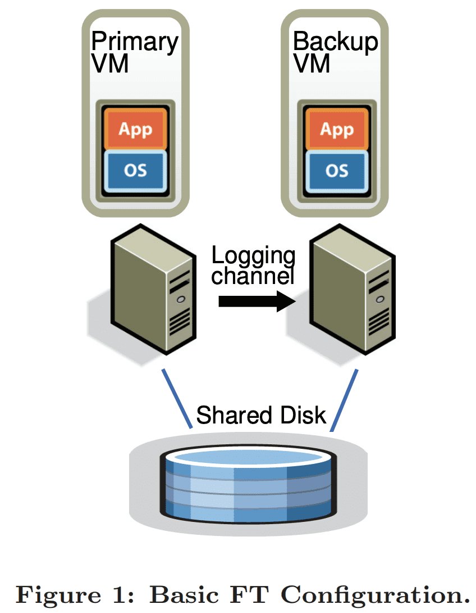
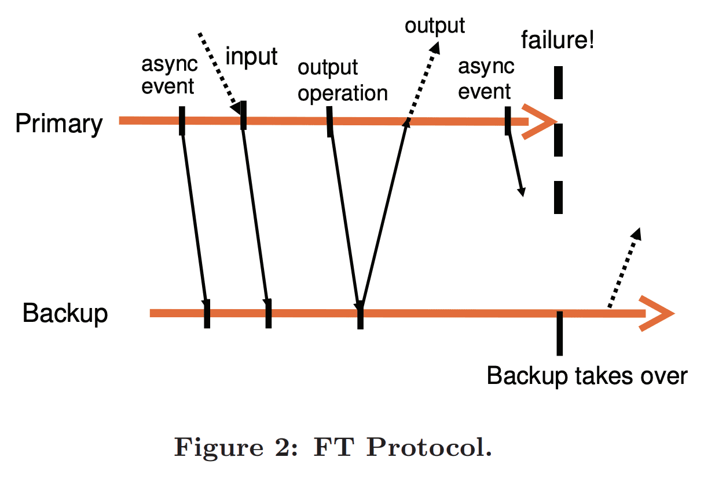
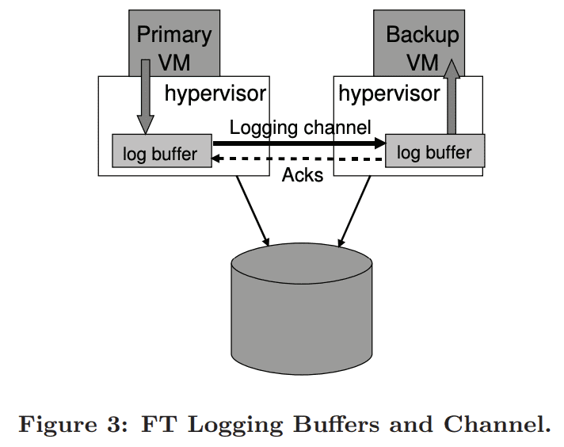
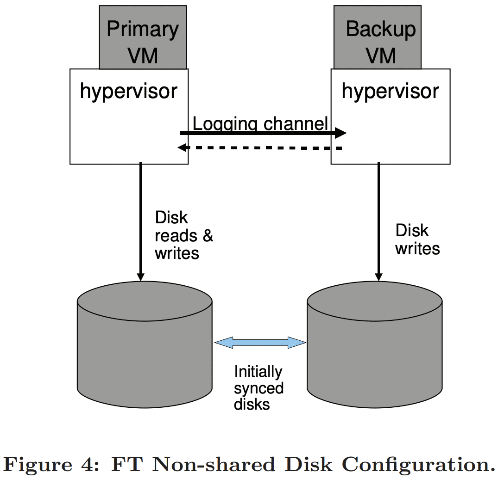

{{ page.description }}

# Fault-Tolerant VM (SIGOPS ‘10)

## 1. Introduction

fault tolerant server를 구현하는 일반적인 방식은 primary/backup 이다. backup server는 primary server가 fail할때 바로 take over할 수 있게 언제나 available하다. 언제나 backup server state는 primary server와 같아야 한다. 따라서 backup server는 primary server에 failure가 발생했을때 즉시 take over 할 수있다. 이 방식은 failure가 외부 client에게 숨겨지도록 하고 data loss도 생기지 않는다. backup server로 state를 복제하는 방식중 하나는CPU, mem, IO device 등 primary state 에 대한 모든 change를 지속적으로 backup에게 전달한다. 그러나 특히 memory같이 state를 전달하기 위한 bandwidth requirement가 매우 크다.

더 낮은 bandwidth를 쓰는 다른 방식은 state machine이다. server를 deterministic state machine으로 만드는것이다. backup과 primary는 같은 initial state에서 시작해서 같은 input을 같은 순서대로 받는것을 보장하는 것이다. 대부분 서버가 non-deterministic operation을 가지기 때문에 state sync를 유지하려면 extra coordination이 무조건 필요하다. 하지만 primary와 backup간 sync를 위한 extra information의 양은 이전 방식보다 훨씬 적다.

physical server의 deterministic execution을 보장하기 위한 coordination을 구현하는것은 어렵다. 반면에 hypervisor 위에서 동작하는 VM은 state-machine approache를 구현하기에 좋은 platform이다. VM은  state machine의 operation이 virtualized되는 well-defined state machine이라 볼 수 있다. physical server로서 VM은 non-deterministic operation (clock을 읽거나 interrupt를 던지거나)을 가지고, extra information은 in-sync를 유지하기 위해 backup으로 보내져야만 한다. hypervisor가 VM execution에 대해 input delivery를 포함한 모든 control이 가능하므로 hypervisor는 primary VM에서 생기는 non-deterministic operation에 대한 모든 정보를 캡쳐할 수 있고, 이 operation들을 backup VM에서 replay할 수 있다.

따라서 state-machine approach는 hardware를 바꿀 필요 없이 VM에서 구현 할 수있다. 게다가 state-machine approach가 bandwidth를 적게 쓰므로 physical separation을 더 멀리 할 수 있다. 예를들어 replicated VM은 다른 datacenter에 위치시켜 더 reliable 해진다.

primary/backup approach로 fault-tolerant VM을 VMware vSphere 4.0 에서 구현했다. VMware vSphere 4.0은 virtualized x86 VM을 실행시킬 수 있으므로, 모든 x86 OS를 fault tolerant 하게 만든다. 또한 deterministic replay를 통해 primary execution을 레코딩하여 backup이 primary execution과 똑같이 수행하도록 보장한다. VMware vSphere FT (Fault Tolerance)는 deterministic replay를 기반으로 하지만 fault-tolerant system을 만들기 위해 extra protocol, functionality를 추가했다. hardware fault-tolerance 뿐만 아니라 system은 local cluster에서 새 backup VM을 실행시키는 것으로 failure 이후에 redundancy를 자동적으로 복구한다.

## 2. Basic FT Design

Figure 1은 fault tolerant VM setup이다. primary VM을 fault tolerant 하게 만들기 위해 in-sync를 유지하고 lag이 잠깐 발생해도 primary VM과 동이랗게 실행하는 backup VM을 다른 physical server에 띄운다. 위와 같은 셋업을 한 두 VM이 $virtual\ lock\text{-}step$에 있다고 말한다. 두 VM과 연결된 virtual disk는 shared storage에 있고, 두 VM이 I/O를 통해 접근 할 수 있다. (Section 4.1에서 non-shared virtual disk 케이스를 설명할것이다). primary VM만 network상에 자신의 존재를 알려주므로 모든 network input은 primary VM으로 온다 (backup VM은 network input을 받지않는다). 다른 Input(keyboard 등)도 동일하다.

primary VM이 받는 모든 input은 $logging\ channel$이라는 network connection을 통해 backup VM으로 보내진다. server workload에서 가장 주된 input traffic은 network와 disk 이다. backup VM이 non-deterministic operation을 primary VM과 똑같이 실행시키는것을 보장하기 위해 additional information을 전달하는것도 필요하다(Section 2.1). 따라서 backup VM은 언제나 primary VM과 동일하게 실행된다. 하지만 backup VM의 output은 hypervisor에 의해 drop되므로 primary만 client에게 output을 전달해주게 된다. 두 VM은 primary failure에서도 data loss가 생기지 않도록 보장하기 위해 backup VM의 explicit ACK를 포함한 전용 protocol을 쓴다(Section 2.2)

primary나 backup이 failure인지 확인하기 위해 system은 서로 엮인 서버들간에 heartbeat와 logging channel traffic을 monitoring한다. 또한 primary와 backup이 connection이 끊어질때에도 primary, backup이 execution을 take over해야 한다.

### 2.1 Deterministic Replay Implementation

server execution을 replicate하는것은 deterministic state machine을 replicate하는 것으로 모델링 할 수 있다. 만약 두 deterministic state machine이 같은 initial sate에서 시작하고  같은 순서로 같은 input을 받으면, 두 state machine은 같은 state sequence를 가지며 같은 output을 만든다. VM은 network package, disk read, keyboard, mouse같은 다양한 input을 가진다. interrupt처럼 non-deterministic event와 clock cycle counter를 읽는것처럼 non-deterministic operation 또한 VM state에 영향을 미친다. 이것들은 VM execution을 replicate하는데 세가지 요구사항을 보여준다. 1) backup VM에 deterministic execution을 보장하기 위해 모든 input과 non-deterministism을 캡쳐해야 한다. 2) input과 non-deterministism을 backup VM에 적용해야 한다. 3) performance 저하가 최소화 되어야 한다. 또한 x86의 많은 complex operation가 undefined이므로 non-deterministic하다. 같은 state를 만들기 위해 undefined side effect를 캡쳐하고 replay하는것은 다른 challenge를 만든다.

VMware deterministic replay는 VMware vSpheere 위의 x86 VM에서 위와같은 functionality를 제공한다. deterministic replay는 VM input과 VM execution과 연관된 모든 가능한 non-deterministism을 stream에 레코딩하여 log file로 write한다. VM execution은 backup VM이 log file을 읽는 것으로 정확히 replay될 수 있다. non-deterministic operation에서 additional information은 operation이 같은 state change와 output으로 reproduce되기 위해 log로 남긴다. timer나 IO completion interrupt같은 non-deterministic event에 대해서는 event를 발생시킨 instruction 또한 레코딩된다. replay동안에 event는 instruction stream 안에서 primary와 같은 point에 deliver된다. VMware deterministic replay는 효율적인 event recording과 event delivery machanism을 구현했다. [Hypervised fault-tolerance](https://www.cs.cornell.edu/fbs/publications/vft.sosp.pdf) 에서는 VM execution을 non-deterministic event가 epoch 끝에서만 deliver되므로 epoch까지 내려갔다. epoch의 개념은 event를 발생시킨 정확한 instruction에 interrupt를 전달하는것은 비싼 비용이 들기 떄문에 batching을 쓰는것으로 보였다. 하지만 event delivery mechanism은 VMware deterministic replay가 epoch를 쓸 필요가 없을만큼 충분히 효율적이다. 각 interrupt는 발생하는 시점과 함께 레코딩 되고 replay되는 동안 적절한 instruction에 deliver된다.

### 2.2 FT Protocol

VMware FT는 log entry를 만들고 log를 disk에 쓰지 않고 logging channel을 통해 backup VM에 전달하기 위해 deterministic replay를 쓴다. backup VM은 realtime으로 log를 replay해서 primary VM과 똑같이 만든다. 하지만 fault tolerance 를 보장하기 위해 log entry에 strict FT protocol이 필요하다.

- **Output Requirement**: backup VM이 primary failure이후에 take over 할때 backup VM은 primary VM이 외부로 전달하던 모든 output을 consistent하게 지속해야 한다.

$failover$ 이후에 backup VM은 execution에서 많은 non-deterministic event가 발생하면 primary VM이 진행하던것과 조금 틀어진 상태로 시작 할 수 있다. 그러나 backup VM이 Output Requirement를 만족한다면, failover때 바깥으로 보이는 state나 data가 사라지지 않고 client는 interupption이나 inconsistency가 발생하지 않게 된다.

Output Requirement는 backup VM이 특정 output operation의 replay에 필요한 모든 정보를 받을때까지 external output(일반적으로는 network packet)을 delay시키는 것으로 보장 할 수 있다. backup VM은 output operation 이전의 모든 log entry를 받아야만 하는 필요조건이 있다. 이 log entry는 backup VM이 마지막 log entry 시점까지 모두 실행할 수 있게 해준다. 하지만 primary가 output operation을 실행한 직후 발생하는것을 가정해보자. backup VM은 이 시점에 발생한 가장 최근의 output operation까지 replay를 하고 “go live” (replay를 멈추고 primary VM으로부터 take over하는것, Section 2.3) 해야한다. backup VM이 output operation이전 시점에서 go live 해버리면 non-deterministic event는 output operation이 발생하기 전에 execution path를 바꿔버릴 지도 모른다.

위와같은 조건에서 Output Requirement를 만족시키는 가장 쉬운 방법은 각 output opreation마다 special log entry를 생성하는 것이다. 따라서 Output Requirement는 아래 Output rule에 의해 만족된다.

- **Output Rule**: primary VM은 backup VM이 output을 만드는 operation과 연관된 log를 받고 ack하기 전까지 output을 client로 던지지 않는다.

backup VM이 모든 output-producing operation과 연관된것을 포함한 모든 log entry를 받으면 backup VM은 해당 output point에서 primary VM이 만든 state로 repoduce 할 수 있고, primary가 죽어도 backup은 output에 대해 consistent state를 가지게 된다. backup VM이 모든 log entry를 받지 못하고 take over하면 backup VM의 state는 inconsistent해진다. Output Rule은 log가 disk로 write되기전까지 externally synchronous IO를 버퍼링 해두는 [Rethink the Sync](https://www.cs.utexas.edu/users/dahlin/Classes/GradOS/papers/syncio.pdf) 와 비슷하다.

Output Rule은 primary VM의 execution을 멈추도록 하지는 않는다. 그저 output을 보내는것을 delay 시키고 VM 자신은 계속 실행되게 한다. OS가 completion을 위해 non-blocking network와 disk output에 async interrupt를 하므로 VM은 execution을 계속 할 수 있고, output을 delay시키는것에 대해 즉시 영향을 받지는 않게 된다. 반면에 previous work는 primary VM이 멈춰야만 했다.

Figure 2는 FT protocol의 Output Requirement에 대한 예시로 primary, backup Vm의 event timeline을 그렸다. primary에서 backup으로 가는 화살표는 log entry전송을 나타내고, backup에서 primary로 가는 화살표는 ack를 나타낸다. async event와 input, output operation에 대한 정보는 log entry로 보내지고 ack가 와야만 한다. 위의 그림처럼 외부로 나가는 output은 primary가 backup으로부터 ack를 받기 전까지 delay된다. Output Rule에따라 backup Vm은 primary가 보낸 last output과 consistent한 state에서 시작한다.

failover 상황에서 모든 output이 exactly-once로 생성되는것을 보장하지는 않는다. primary가 output을 보낼때 two-phase commit이 들어간 transaction을 쓰지 않고는 failover할때 backup이 output을 보내기 전인지, 후인지 알 수 없다. 운좋게도 network infra (일반적으로 TCP)는  lost packet이나 duplicate package에 대해 처리하도록 디자인 되어있다. primary로 오는 incoming packet은 primary failure에서 사라질 수 있고 따라서 backup으로 전달되지 않게된다는 점이 있다. 하지만 incoming packet은 server failure와 관계없는 여러 이유로 사라질 수 있으므로 network infra, os, application은 모두 lost packet을 보장하도록 만들어져있다.

### 2.3 Detecting and Responding to Failure

위에서 말한것 처럼 primary, backup VM은 다른 VM이 failure가 발생할 수 있으므로 최대한 빠르게 응답해야 한다. backup VM failure에서 primary VM은 $go\ live$(log entry 보내는것을 멈춰 recording mode를 끔)가 되고 normal start를 한다. primary VM failure에서 backup VM은 $go\ live$와 비슷하지만 더 복잡한 일을 한다. execution lag때문에 backup VM은 많은 log entry가 있게 되지만, backup VM이 실행하기에 적절한 지점에 닿지 때문에 아직 log를 consume하지 않았다. backup VM은 Log entry에서 last log entry를 consume할때까지 replay 해야 한다. 그 이후 backup VM은 replaying mode를 멈추고  normal VM으로 시작하여, backup VM은 primary VM으로 승격된다. 이제 더이상 backup VM이 없으므로 primary VM은 output을 외부로 보낸다. normal mode로 변경되는 동안 device-specific operation이 적절히 발생하도록 output을 보내는것을 필요로한다. 특히 networking에서 VMware FT는 새 primary VM의 MAC address를 network에 알려서 physical network switch가 새 primary VM의 위치를 알게 만든다. 또한 새 primary VM은 일부 disk IO를 다시 해야 할 수 있다 (Section 3.4).

primary, backup VM의 failure를 감지하는 여러 방법이 있다. VMware FT는 failure를 감지하기 위해 fault-tolerant VM을 실행하는 server간 UDP heratbeat를 쓴다. 또한 Vmware FT는 logging traffic을 모니터링한다. regular timer interrupt때문에 logging traffic 또한 regular하며 멈추지 않는다. 따라서 log entry와 ack의 흐름이 끊기는것으로 VM failure를 감지한다. heartbeating이나 logging traffic이 특정 timeout보다 긴 시간동안 멈춰있으면 failure로 선언한다.

그러나 failure detection은 network failure같은 split-brain problem에서 취약하다. backup server가 primary server로부터 heartbeat를 받지 못하는경우 primary failure이거나, primary는 살아있어도 network가 끊기는 경우일 수 있다. backup VM이 primary이 여전히 동작하는데에도 $go\ live$가 되면 data corruption과 client communication에 문제가 생길 수 있다. 따라서 failure가 감지될때 primary, backup중 단 한개의 VM이 $go\ live$가 되어야 한다. split-brain problem을 피하기 위해 VM의 virtual disk를 저장하는 shared storage를 사용한다. primary나 backup이 $go\ live$가 되길 원할때 각 VM은 shared storage에 atomic test-and-set operation을 수행한다. 이 operation이 성공하면 그 VM은 $go\ live$가 된다. operation이 실패하면 다른 VM이 이미 $go\ live$가 되었으므로 현재 VM은 종료하게된다. VM이 atomic operation을 수행할때 shared storage에 접근하지 못하면 가능할때까지 기다린다. shard storage는 storage network상에서 failure로 인해 접근하지 못하게 되면 VM은 할 수 있는 일이 없다. 따라서 split-brain problem을 해결하기 위해 shared storage를 쓰는것은 다른 unavailability가 발생하게된다.

failure가 발생하고 VM중 하나가 $go\ live$가 되면 VMware FT는 redundancy로 복구해서 새 backup VM을 다른 Host에 실행시킨다(Section 3.1).

## 3. Practical Implementations of FT

Section 2는 FT의 design, protocol을 보여줬지만, usable, robust, automatic system을 만들기 위해 많은 다른 component들이 design되어야 한다.

### 3.1 Starting and Restarting FT VMs

additional component중 하나는 primary VM과 같은 state로 backup VM을 시작하는 메커니즘이다. 이 메커니즘은 또한 failure에서 backup VM을 재시작 할때 사용될 수 있다. 이 메커니즘은 ㄴstarting up state뿐만 아니라 arbitrary state에 있는 running primary VM실행하는데 쓸 수 있어야 한다. 또한 이 메커니즘이 client에 악영향을 주지 않기 위해 primary VM의 execution을 최대한 방해하지 않도록 해야한다.

VMware FT는 VMotion functionality를 적용했다. VMware VMotion은 한 서버의 running VM을 최소한의 disruption으로 다른 server로 migrate해준다. remote server VM의 Running copy를 생성하는 VMotion에서 local server VM을 없애는 로직을 제거했다. 이 $FT\ VMotion$은 한 VM을 migration하는것이아니고 clone하게 된다. FT VMotion은 또한 logging channel을 생성하고 source VM이 primary로서 logging mode로 동작하도록 하며, dest VM이 backup으로서 replay mode로 동작하게 한다. 기존 VMotion처럼 FT VMotion은 1초 이내로 primary VM의 실행을 멈춘다. 따라서 running VM에 FT를 켜는것은 쉬우며 non-disruptive하다.

backup VM을 시작할때 고려해야할 것은 어떤 server에서 실행하는가 이다. Fault-tolerant VM은 shared storage를 접근하는 cluster에서 실행되므로 모든 VM은 cluster의 모둔 서버에서 실행할 수 있다. 이 flexibility는 VMware vSpheere가 1개 이상의 서버가 failure일때에도 FT redundancy를 복구할 수 있게 해준다. VMware vSphere는 resource를 관리하는 clustering service가 있다. failure가 발생하고 primary가 새 backup VM을 만들려고 할때 primary VM은 clustering service에게 알린다. clustering service는 server resource와 다른 제약조건들을 바탕으로 어떤 서버에서 backup VM을 실행시킬지 결정하고, FT VMotion을 실행해 새 backup VM을 만든다. 따라서 VMware FT는 fault-tolerant VM의 실행을 방해하지 않고도, server failure 상황에서 VM redundancy를 다시 만들 수 있다.

### 3.2 Managing the Logging Channel

hypvervisor는 logging entry를 위한 large buffer를 유지한다. primary VM이 실행될때 log entry를 log buffer로 보내고, backup VM은 log buffer에서 log entry를 consume한다. primary log buffer의 content는 모두 바로 logging channel로 flush되고, log entry는 backup log buffer로 도착하자마자 바로 읽힌다. backup VM은 log entry들을 읽자마자 primary에게 ack를 보낸다. ack는 VMware FT가 output이 Output Rule에 따라 delay되도록 해준다.

backup VM이 log entry를 읽으려 할때 empty log buffer를 보면, 새 log entry가 생길때까지 실행을 멈춘다. backup VM이 외부와 통신하지 않으므로 다른 client에게 영향을 주지는 않는다. 비슷하게 primary VM이 full log buffer를 볼때 log entry가 flush될때까지 실행을 멈춘다. 이것은 primary VM이 log entry를 만드는 속도를 늦추기 위한 flow-control mechanism이다. 하지만 log buffer에 log를 쓸수 있을때까지 primary VM이 완전히 멈추고 unresponsible하기때문에 client에 악영향을 미치게된다. 따라서 primary log buffer가 꽉찼을때 이 상황을 최소화 하도록 구현해야 한다.

primary log buffer가 꽉차는 이유중 하나는 backup VM이 너무 느리게 실행되어 log entry를 천천히 읽는것이다. 일반적으로 backup VM은 primary VM이 recording하는것과 같은 속도로 execution을 replay할 수 있어야 한다. 다행히 VMware deterministic replay에서 recording과 replaying의 overhead는 거의 같다. 하지만 backup VM이 동작하는 server가 다른 VM에 의해 load가 생기면 hypervisor의 VM scheduler가 best effort를 하더라도 backup VM은 충분한 CPU, memory 를 가지지 못할 수 있다.

또한 primary VM failure에서 backup VM은 모든 acked log entry를 replay하여 primary 를 “catch up”해야한다. replay를 끝내는 시간은 기본적으로 failure시점에 execution lag time과 동일하므로 backup이 $go\ live$가 되는 시간은 failure detection time + execution lag time이 된다. 이것은 failover time을 길게 만들지 않기 위해 execution lag time이 길어지면 안된다 라는것을 말한다.

따라서 backup VM의 state가 너무 멀어지지 않도록 primary VM을 slow down 하기 위한 추가적인 mechanism을 만들었다. log buffer protocol에서 realtime execution lag을 감지하는 추가적인 정보를 보낸다. 일반적으로 execution lag은 100ms 미만이다. backup VM이 큰 execution lag을 가지고 시작하면, VMware FT는 hypervisor scheduler에게 적은 CPU를 할당하도록 해서 primary VM을 느리게 한다. slow feedback loop를 통해 backup VM이 primary execution과 같아지도록 하는 primary VM에 대한 CPU limit을 찾아낸다. backup VM의 lag이 지속되면 primary VM의 CPU limit을 점점 낮춘다, backup VM의 lag이 사라지면 primary VM의 CPU limit을 backup VM이 아주 작은 lag을 가질때까지 limit을 올린다. primary VM의 slowdown mechanism은 system이 큰 부하를 받을때에만 실행된다.

### 3.3 Operation on FT VMs

primary VM에 적용할 다양한 control operation에 대해 대처하는것도 중요하다. 예를들어 primary VM이 power off하면 backup VM은 $go\ live$하는게 아니라 멈춰야한다. 다른 예로 primary의 resource change가 일어나면 backup에도 반영되어야 한다. 이런 종류의 operation은 backup에도 반영되도록 하기 위하여 logging channel을 통해 special control entry로 전송된다.

일반적으로 VM의 대부분 operation은 primary VM에서 초기화된다. 그다음 VMware FT는 control entry를 backup VM에 반영하기 위해 전달한다. backup과 primary에 독립적으로 적용될 수 있는 operation은 VMotion뿐이다. VMotion은 primary, backup 각각 서로 다른 host로 향한다. VMware FT는 두개의 VM이 모두 다른 서버로 이동하지 않도록한다. 이 상황은 fault-tolerance를 만들수 없기 때문이다.

primary VM의 FT VMotion은 backup VM이 source primary와 disconnect하고 destination primary VM과 reconnect해야한다. 또한 backup VM의 FT VMotion도 비슷하다. 기존 VMotion에서 VMotion에서 final switchover가 발생하는 즉시 모든 outstanding disk IO는 complete되어야 한다. primary VM에서 이런 quiescing은 physical IO가 complete될때까지 기다리면된다. 하지만 backup VM은 primary VM의 execution을 replay하면서 IO를 complete해야하므로, 모든 IO가 complete될때까지 기다릴 방법이 없다. primary VM은 normal execution이 진행되는동안 언제나 disk IO를 발생 시킬 수 있다. 하지만 VMware FT는 이 문제를 해결할 방법이 있다. backup VM이 VMotion에서 final switchover에 다다르면, logging channel을 통해 primary VM이 잠깐 모든 IO를 멈추도록 한다. 따라서 backup VM의 IO는 자연스레 complete된다.

### 3.4 Implementation Issues for Disk IOs

disk IO와 관련한 자잘한 implementation issue가 있다. 첫째로 disk operation이 non-blocking이고 parallel로 동작하고, 여러 disk operation이 같은 disk location에 접근하는것은 non-deterministism을 만든다. 또한 disk IO의 구현은 VM의 memory를 DMA로 사용하므로 동시에 발생하는 여러 disk operation이 같은 memory page를 접근하는것또한 non-deterministism을 만든다. 해결책은 이와같이 아주 가끔 발생하는 IO race를 감지하고 racing disk operation을 primary와 backup에 sequential하게 수행시키는것이다.

두번째로 disk operation은 VM의 OS나 app에서 DMA를 통해 disk operation이 memory를 접근하므로 memory access에 대한 race가 발생할 수 있다. 예를들어 VM의 app이 disk operation이 읽는 memory block을 읽을때 non-deterministic result가 발생할 수 있다. 이상황또한 드물긴 하지만, 이상황이 발생하는것을 감지하고 대처해야한다. 방법중 하나는 disk operation이 접근하는 page에 대해 잠시 page protection을 설정하는것이다. page protection은 VM이 해당 page를 접근하려 할때 trap에 걸리게 만들고 VM은 disk operation이 끝날때까지 멈추게 된다. MMU의 page protection을 바꾸는것은 어렵기때문에 $bounce\ buffer$를 이용한다. boucne buffer는 disk operation이 접근하는 memory와 같은 사이즈를 가지는 temporary buffer이다. disk read operation은 bounce buffer의 특정 data를 읽도록 수정되고, data는 IO completion을 전달할때 guest memory로 카피된다. 비슷하게 disk write operation에서 data는 bounce buffer로 복사되고, disk write는 bounce buffer로 write되도록 수정된다. bounce buffer는 disk operation을 느리게 할 수 있지만, 눈에 띄는 성능저하를 보이진 않았다.

세번째로 failure가 발생하여 backup이 take over할때 새 primary의 outstanding(not completed) disk IO에 대한 이슈가 있다. 새 primary VM이 issue된 disk IO가 complete됐는지 확인할 방법이 없다. 또한 disk IO가 backup VM에서 issue되지 않으므로, 새 primary VM이 실행할때 IO completion을 받을 방법이 없어 VM의 guest OS가 abort가 되거나 procedure를 초기화하게될 수 있다. IO가 완료되면 error event를 리턴하는게 가능하므로 각 IO가 실패했음을 알리는 error completion을 전달할 수 있다. 하지만 guest OS가 local disk로부터 온 error에 대해 잘 응답하지 않을 수 있다. 그래서 backup VM의 $go\ live$동안 pending IO를 재발행한다. 모든 race를 없애고 모든 IO가 접근할 memory, disk block을 직접 지정하므로 disk operation이 idempotent해져 complete IO이더라도 re-issue가 가능하다.

### 3.5 Implementation Issues for Network IO

VMware vSphere는 VM networking에 대한 성능 최적화를 제공한다. 이런 최적화는 VM network device의 state를 async로 update하는 hypervisor가 있어서 가능하다. 예를들어 receive buffer는 VM이 실행되는동안 hypervisor가 직접 update가능하다. 하지만 이런 async update는 non-deterministism을 만든다. 따라서 primary와 backup으 instruction stream의 특정 시점에 모든 update 실행이 보장되더라도, backup execution은 primary와 달라질 수 있다.

Fault-tolerance를 위해 networking emulation code수정중 가장 큰것은 이런 async network optimization을 disable한 것이다. incoming packet에 대한 VM ring buffer를 async update하는 코드는 guest가 hypervisor를 trap하게 강제하도록 수정된다. 그리고 hypervisor는 update에대한 log를 남기고 VM에 update를 반영한다. 비슷하게 fault tolerance를 위해 packet을 trasmit queue에서 async로 가져오는 코드도 disable되고, hypervisor를 trap하는것으로 transmit을 끝낸다.

network device는 async update 제거와 Section 2.2에 나온 sending packet을 delay시키는것이 network 성능이슈를 만들게 된다. FT가 동적하는 동안 VM network 성능을 올리기위해 두가지 방법을 쓴다. 첫번째로 VM trap과 interrupt를 감소시키기 위해 clustering optimization을 구현했다. VM이 충분한 bit rate으로 data를 streaming할때 hypervisor는 packet group당 한 transmit trap을 수행한다. best case는 hypervisor가 VM의 새 packet을 수신의 일부로 packet을 전송할 수 있으므로 trap을 하지 않을 수 있다. 비슷하게 hypervisor는 VM에게 가는 interrupt를 packet group으로 interrupt를 하여 줄일 수 있다.

두번째 network 성능최적화는 trasmitted packet의 delay를 줄이는것이다. hypervisor는 backup에게서 ack를 받을때까지 transmitted packet을 딜레이시켜야한다. trasmit delay를 줄이는 방법은 log message를 backup VM에게 전달하고 ack를 받는 시간을 줄이는것이다. log entry를 던지고, ack를 받는것은 thread context switch 없이 완료시킬 수 있다. VMware vSphere hypervisor는 TCP data를 받을때마다 deferred-execution context라고 불리는 TCP stack에 등록하는 function을 추가할 수 있다. 이건 backup VM에서 incoming log message, primary가 받는 ack를 context switch 없이 빠르게 핸들링할 수 있게 해준다. 또한 primary VM이 trasmit packet을 enqueue할때 deferred-execution context를 스케줄링하여 output log entry를 즉시 flush시킨다.

## 4. Design Alternatives

### 4.1 Shared vs Non-shared Disk

primary, backup VM은 virtual disk를 공유한다. 따라서 shared disk의 content는 correct하고 failover에서도 available하다. shared disk는 또한 primary, backup VM 바깥에 있어 shared disk로 write하는것은 external world로 통신하는것으로 볼 수 있따. 따라서 primary VM만 실제 disk로 write를 수행하고, shared disk에 대한 write는 Output Rule에 따라 delay되어야한다.

primary backup VM에 대한 alternative design은 non-shared virtual disk를 가지는 것이다. 이 디자인에서 backup VM은 모든 disk write를 자신의 virtual disk로 수행하여 primary VM의 virtual disk와 in-sync하게 만든다. Figure 4가 이것을 보여준다. non-shared disk 케이스에서 virtual disk는 각 VM의 internal state로 볼 수 있다. 따라서 primary의 disk write는 Output Rule에따라 delay될 필요가 없다. non-shared design은 shared storage가 unavailable하거나 비싸거나 하는경우에 유용하다. non-shared design의 단점은 2 copy의 virtual disk가 fault-tolerance를 위해 in-sync를 유지해아 한다는 것이다. 또한 disk는 failure 이후에 sync가 되지 않을 수 있어 failure이후에 backup VM이 재시작할때 resync되어야 한다. 즉 FT VMotion은 primary, backup VM의 상태를 sync할뿐만아니라 disk도 해야한다.

non-shared disk configuration에서 split-brain 상황을 해결해야한다. system은 두 server와 communicate하는 다른 tiebreaker를 써야할 수 있다. 2개 node보다 많은 cluster에 있다면 system은 cluster membership에 기반한 majority algorithm을 쓸 수 있다.

### 4.2 Executing Disk Reads on the Backup VM

backup VM은 virtual disk를 읽지 않는다. disk read가 input으로 표현되므로, disk read 결과는 logging channel을 통해 backup VM으로 간다.

backup VM의 alternative design은 backup VM이 disk read를 수행하여 disk read에 대한 log entry를 제거하는 것이다. 이 방식은 많은 disk read가 있는 workload의 logging channel traffic을 감소시킨다. 하지만 backup VM execution을 느리게 한다.

또한 failed disk read operation을 대처하기 위해 몇가지 작업이 필요하다. primary에서는 성공했지만 backup에선 실패한 disk read가 있으면 backup의 disk read가 성공할떄까지 재시도해야한다. 역으로 primary가 실패하면 memory content는 logging channel을 통해 backup으로 전달되어야 한다.

마지막으로 primary VM이 특정 disk location을 읽고 바로 그 위치를 write할때, 이 disk write는 backup VM이 disk read를 할때까지 기다려야한다. 이 Dependency는 핸들링 할 수 있지만 구현에 복잡도가 생긴다.
