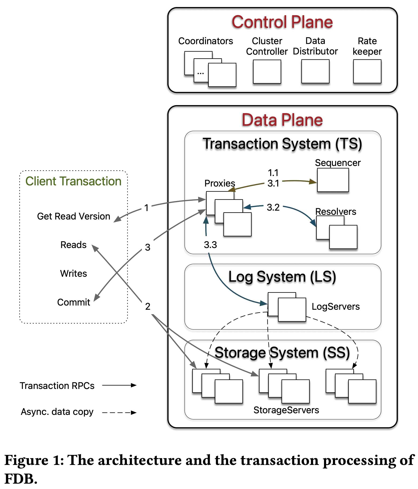
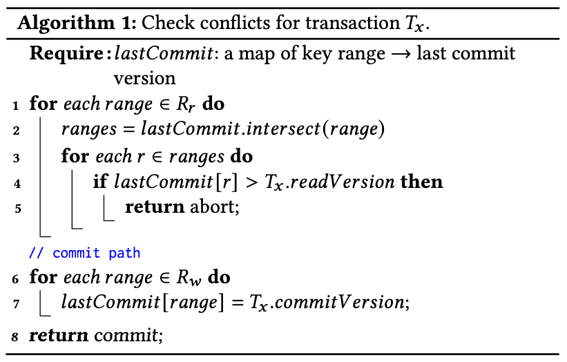
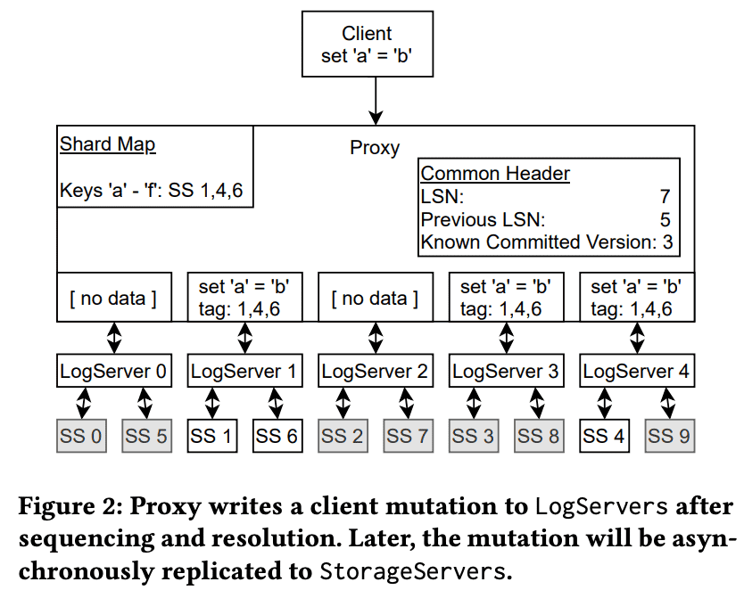
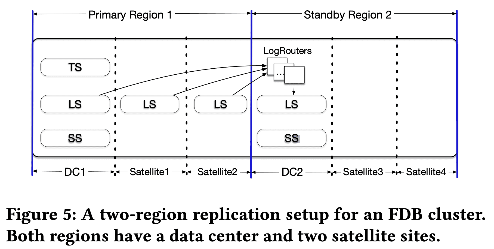
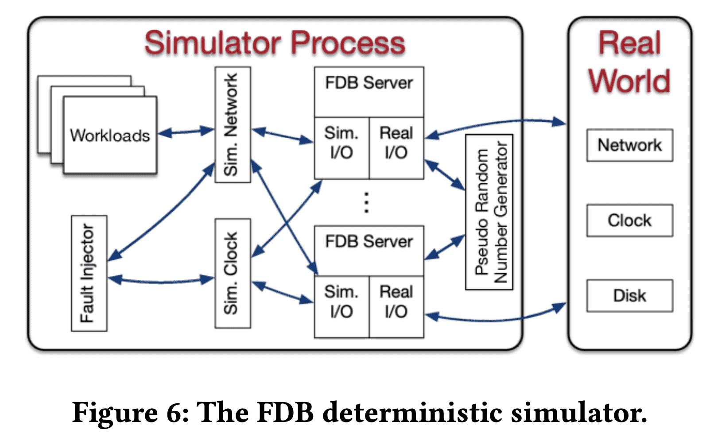

**{{ page.description }}**

[https://www.foundationdb.org/blog/fdb-paper/](https://www.foundationdb.org/blog/fdb-paper/)

# FoundationDB: A Distributed Unbundled Transactional Key Value Store (SIGMOD ‘21)

## 1. Introduction

NoSQL에 transaction을 얹었다. consistent secondary index, referential integrity check를 지원한다. FoundationDB는 전체 key space에서 serializable transaction을 지원하는 ordered, transactional, key-value store이다. 기존 DB가 storage engine, data model, query language를 한꺼번에 제공하는 반면 FDB는 modular approach로 접근했다. FDB는 최소한의 기능만 넣어서 highly scalable한 transaction storage engine을 제공한다. transactional db에서 제공하는 structured semantic, query language는 없고, data model, schema management, secondary index는 제공한다.

FDB가 open source로 성장할수 있었던건 FDB가 foundation에만 집중했기 때문이다. 이를 통해 다른 종류의 storage system이 필요했던 application에서 FDB를 쓸수 있었다. 실제로 최근 몇년간 FDB위에 올라가는 많은 layer 생겼다. [FoundationDB Record Layer](https://arxiv.org/pdf/1901.04452.pdf) 는 기존 유저가 RDB에서 필요로 하던것들을 추가했다. CouchDB 첫 NoSQL인데 Foundation DB 기반으로 재작성되었다.

distributed system을 테스트, 디버그하는건 이 system을 만드는 것 만큼이나 어렵다. unexpected process, network failure, message reordering과 다른 non-determinism은 버그를 만들고, 코드에 있던 implicit한 가정들을 깨버리는데 이런것들은 디버깅이나 reproduce가 어렵다. 또한 DB의 stateful nature는 버그가 생겼을때 data corruption이 생길 수 있고 몇개월동안 발견하지 못할 수도있다. Model checking은 distributed protocol의 정확성을 확인할 수 있지만, 실제 구현을 확인하기는 어렵다. 특정 시퀀스에서 multiple crash/restart가 발생할때 생기는 [Deep bugs](https://www.usenix.org/system/files/conference/osdi14/osdi14-paper-leesatapornwongsa.pdf) 는 end-to-end testing infra에서도 문제가 된다. FDB는 DB를 개발하기 전에 process들이 상호작용하는 network와 disk, process, network, request-level failure/recovery등 모든것을 하나의 physical process에서 simulate하는 deterministic DB simulation framework를 만들었다. 이를 통해 FDB가 stable하고 개발자들이 쉽게 새 feature를 추가할 수 있었다.

FDB는 control plane과 data plane으로 구성되는 [unbundled architecture](https://database.cs.wisc.edu/cidr/cidr2009/Paper_53.pdf)를 적용했다. control plane은 cluster의 metadata를 관리하고 HA를 위해 Active Disk Paxos를 쓴다. data plane은 update를 책임지는 transaction management system과 read request를 받는 distributed storage layer로 구성된다. transaction management system과 distributed storage layer는 독립적으로 scale-out 가능하다. FDB는 OCC(Optimistic Concurrency Control)과 MVCC(Multi-Version Concurrency Control)을 조합하여 strict serializability를 제공한다. lock-free architecture(OCC+MVCC 이므로) 외에도 다른 DB와 구분되는 feature중 하나는 failure를 처리하는 방식이다. FDB는 failure를 처리하기 위해 quorum을 쓰지 않고 reconfiguring을 통해 eager하게 failure를 찾고 recover하려 시도한다. 이건 훨씬 더 적은 resource로 fault tolerance를 제공해준다. FDB는 $f + 1$개의 replica가 있을때 $f$ failure까지 tolerant하다 (다른 distributed system은 $f$ failure까지 tolerant하려면 quorum때문에 $2f+ 1$개 replica가 필요함). 이 방식은 도시단위의 deployment에서 적합하다. WAN deployment에서 FDB는 data loss없이 region간 automatic failover를 제공하면서도 cross-region write latency를 피한다.

## 2. Design

### 2.1 Design Principles

- Divide-and-Conquer
FDB는 transaction management system (write path)와 distributed storage (read path)를 분리하고 각각을 독립적으로 scale in/out할 수 있게 했다. transaction management system의 process들은 transaction management, conflict detection, logging, timestamp management, accepting commit 등의 다양한 role을 할당받는다. 또한 overload control, load balancing, failure recovery같은 cluster-wide task도 heterogeneous role로 나누어진다.
- Make failure a common case
distributed system에서 failure는 일반적이다. FDB의 transaction system은 모든 failure에 대해, 가능한 모든 failure scenario에 대응하는게 아니라 recovery path를 통해 처리한다. 따라서 모든 failure는 well-tested code path인 recovery operation 하나만으로 처리된다. 이런 에러 핸들링 방식은 recovery가 빠르게 일어나줘야하고 normal transaction processing도 단순해야 한다.
- Fail fast and recover fast
availability를 높이기 위해 FDB는 failure를 감지하고부터 transaction management system을 shutdown시킨뒤 recover할때까지의 MTTR(Mean Time To Recovery)을 최소화하는데 집중했다. production cluster에서 MTTR은 대략 5초 이내이다 (Section 5.3)
- Simulation testing
FDB는 correctness test를 위해 randomized, deterministic simulation framework를 사용한다. simulation test는 [deep bugs](https://www.usenix.org/system/files/conference/osdi14/osdi14-paper-leesatapornwongsa.pdf)를 잡을뿐만아니라 FDB의 개발 생산성, 코드 퀄리티를 높인다.

### 2.2 System Interface

FDB는 $get(), set(), getRange(), clear()$ 메소드를 제공한다. $clear()$는 특정 key prefix를 가지는 모든 KV pair를 삭제한다.
FDB transaction은 특정 version의 DB snapshot을 보고 수정하고, transaction이 commit될때만 change를 DB에 반영한다. transactional write ($set(), clear()$)는 $commit()$이 호출되기 전까지 FDB client에 buffer되고, read-your-write semantic은 transaction안에서 DB를 조회한 결과와 transaction의 uncommitted write를 합쳐서 유지한다. 성능을 위해 Key는 10KB, Value는 100KB까지 가능하다. Transaction size는 모든 write된 key value의 크기와, read/write이 conflict range에 속하는 모든 key의 크기를 포함해서 최대 10MB이다.

### 2.3 Architecture

FDB cluster는 cluster-wide orchestration과 system metadata를 관리하는 control plane과, transaction processing과 data plane을 담당하는 data plane으로 구성된다.

**2.3.1 Control Plane**

control plane은 $Coordinators$에서 critical system metadata를 관리한다. $Coordinators$는 Disk Paxos Group을 형성하고 singleton $ClusterController$를 선택한다. $ClusterContoller$는 cluster의 모든 서버를 모니터링하고, singleton인 $Sequencer, DataDistributor, Ratekeeper$를 할당하고, 얘네들이 fail/crash가 생기면 다시할당한다. $Sequencer$는 transaction에 read, commit version을 할당한다. $DataDistributor$는 failure를 모니터링하고, $StorageServer$간 data balancing을 담당한다. $Ratekeeper$는 cluster의 overload protection을 담당한다.

**2.3.2 Data Plane**

FDB는 read가 주로 발생하지만 r/w가 적게발생하여 low contention을 가지지만 scalability가 필요한 OLTP workload를 타겟으로 한다. FDB는 [unbundled architecture](https://database.cs.wisc.edu/cidr/cidr2009/Paper_53.pdf) 를 선택했다. $TS$(Distributed Transaction Management System)은 in-memory transaction processing을 수행하고, $LS$(Log System)은 $TS$의 Write-Ahead-Log를 저장하고, $SS$(Distributed Storage System)은 data를 저장하고 read를 처리한다.
$TS$는 transaction processing을 제공하고 $Sequencer, Proxies, Resolvers$로 구성되며 이 셋 모두 stateless process이다. $LS$는 여러 $LogServers$로 구성되고, $SS$는 많은 $StorageServers$가 부튼ㄴ다.

$Sequencer$는 read version과 commit version을 각 transaction에 할당하고 $Proxies, Resolvers, LogServers$를 만드는 역할을 한다. $Proxy$는 MVCC read version을 client에게 전달하고, transaction commit orchestration을 수행한다. $Resolver$는 transaction conflict check을 수행한다. $LogServer$는 각 queue가 $StorageServer$에 WAL를 저장하는 replicated, sharded, persistent queue 역할이다.

$SS$는 많은 client read를 서빙하는 $StorageServer$로 구성되고 각 $StorageServer$는 연속된 key range같은 data shard를 저장한다. $StorageServer$는 system에서 가장 많은 process 수를 차지하고 함께 distributed B-Tree를 형성한다. 현재 각 $StorageServer$의 storage engine은 SQLite에서 defer deletion, async programming을 지원하고, range clear를 빠르게 한 커스텀 버전을 쓰고 있다.

**2.3.3 Read-Write Separation and Scaling**

FDB의 process는 서로 다른 role을 할당받고 DB는 각 role에 해당 하는 process 수를 늘리는 것으로 scale out한다. 이건 write scaling과 read scaling을 분리할수 있게 해줬다. client는 $StorageServer$로 직접 read 요청을 넣으므로 read scale은 $StorageServer$수와 비례한다. write는 $TS, LS$의 $Proxies, Resolvers, LogServers$의 수와 비례한다. MVCC를 쓰지 않는 write scaling이 $StorageServer$와 독립적으로 돌도록 하기 위해서 MVCC data는 $SS$에 저장된다. control plane의 singleton process($Cluster Controller, Sequencer$ 등)과 $Coordinators$는 metadata operation만 수행하므로 병목이 생기지 않는다

**2.3.4 Bootstrapping**

FDB는 다른 서비스등의 external dependency가 없다. 모든 user data와 대부분 system data(`0xFF` prefix로 시작하는 key들이 system data)는 $StorageServer$에 저장된다. $StorageServer$에 대한 metadata는 $LogServer$에 저장된다. $LogServer$의 metadata는 모든 $Coordinators$에 저장된다. $Coordinators$를 Disk Paxos Group으로 사용하므로 server들은 $ClusterController$가 없을경우 $ClusterController$로 승격하는것을 시도한다. 새로 선출된 $ClusterController$는 새 $Sequencer$를 할당하고 $Sequencer$는 $Coordinator$에 저장된 old $LS$ config를 읽고 새 $TS, LS$를 생성한다. old $LS$에서 $Proxies$는 모든 $StorageServer$와 관련된 정보 등의 system metadata를 복구한다. $Sequencer$는 new $TS$가 recovery를 끝낼때까지(Section 2.4.4) 기다리고, new $LS$ config를 모든 $Coordinators$에게 전달한다. 이게 완료되면 new transaction system은 ready상태가 된다.

**2.3.5 Reconfiguration**

$TS,LS$에 failure가 발생하거나 DB config change가 생길때마다 reconfiguration process는 $TS$가 새 config, 즉 clean state가 되도록 한다. 특히 $Sequencer$ process는 $Proxies, Resolvers, Logservers$의 healthy check을 한다. 위 process들이 fail하거나 DB config가 바뀌면 $Sequencer$ process는 종료된다. 그럼 $ClusterController$는 $Sequencer$의 failure를 감지하고 new $Sequencer$를 할당하여 위의 bootstrapping process를 거쳐 new $TS, LS$ instance를 만든다. 이 방식으로 transaction processing은 여러 epoch로 나뉘고, 각 epoch는 고유한 $Sequencer$ process가 있는 $TS$의 세대를 나타낸다 (뭔말..)

### 2.4 Transaction Management

**2.4.1 End-to-end Transaction Processing**

Figure 1에 나온것처럼 client transaction은 read version(timestamp)를 얻기 위해 $Proxies$중 하나와 통신하면서 시작한다. $Proxy$는 $Sequencer$에게 이전 transaction의 commit version보다 큰 read version을 물어보고 그 값을 client에게 리턴한다. client는 $StorageServers$로 read version과 함께 read요청을 1+회 날린다 (물론 안날릴수도있음). Client write은 cluster와 통신하지 않고 client buffer에 남긴다. commit시점에 client는 read write set(key range)을 포함한 transaction data를 $Proxies$중 하나에 보내고 $Proxy$가 commit/abort 응답을 줄때까지 기다린다. transaction이 commit될수 없으면 client는 처음부터 transaction을 다시 시작할 수 있다.

$Proxy$는 client transaction을 커밋할때 3가지 스텝을 거친다. 첫쨰로 $Sequencer$에게 transaction data에 있는 read version(read요청할때 $StorageServers$가 리턴?)이나 commit($Sequencer$가 transaction 시작할때 발급해준것)버전보다 더 큰 commit version을 요청한다. $Sequencer$는 최대 1M versions per sec의 속도로 commit version을 올린다. $Proxy$는 transaction 정보를 range-partitioned $Resolvers$에게 전달한다(여러 partition에 접근하면 여러 $Resolvers$가 참여). $Resolver$는 FDB의 $read-write$ conflict를 확인하는 것으로 optimistic concurrency control을 수행한다. 모든 $Resolvers$가 no conflict을 리턴하면 transaction은 final commit stage로 갈 수 있지만 conflict이 하나라도 생기면 $Proxy$는 transaction을 abort처리한다. 마지막으로 committed transaction은 persistence를 위해 $LogServers$로 전달된다. transaction은 모든 $LogServers$가 $Proxy$에게 응답하고 $Proxy$가 $Sequencer$에게 committed version을 알려주고(다음 transaction이 이 commit이후의 read version을 가지도록 하기 위함) client에게 리턴하면 commit이 완료된다. 동시에 $StorageServers$는 지속적으로 $LogServers$로부터 mutation log를 받아 disk에 update를 수행한다.

FDB는 $read-write\ tranasaction$뿐만아니라 $read-only\ transactions$와 $snapshot\ reads$도 지원한다. FDB의 read-only transaction은 serializable(특정 read version으로 읽기)하며 MVCC로 성능도 나쁘지 않으며, client는 DB와 통신 없이 이 transaction들을 commit할 수 있다. 특히 대부분의 transaction이 read-only로 동작하기 때문에 read-only transaction은 많이 쓰인다. Snapshot read는 conflict을 줄이는것(concurrent write이 snapshot read와 conflict이 발생하지않음)으로 isolation을 완화한다.

**2.4.2 Support Strict Serializability**

FDB는 OCC와 MVCC를 합쳐서 SSI(Serializable Snapshot Isolation)을 구현했다. Transaction $T_x$는 read version과 commit version을 $Sequencer$로부터 받아오는데 read version은 $T_x$가 시작할때의 committed version보다 큰 값을 보장하고, commit version은 기존의 read/commit version보다 큰 값이다. commit version은 transaction에 대한 serial history가 되고 LSN(Log Sequence Number)의 역할을 한다. $T_x$가 모든 이전 committed transaction의 결과를 보게 되므로 FDB는 strict serializability를 만들 수 있다. LSN간 gap이 없도록 하기 위해 $Sequencer$는 commit버전과 직전 commit version (previous LSN)을 함께 리턴한다. $Proxy$는 LSN과 previous LSN을 $Resolver$와 $LogServers$에게 전달하여 LSN의 순서에 따라 transaction을 serial하게 처리할수 있도록 한다. $StorageServers$는 $LogServers$로부터 로그를 받을때도 LSN순서대로 받는다.

Algorithm 1은 $Resolvers$의 lock-free conflict detection algorithm을 보여준다. 각 $Resolver$는 committed transaction이 최근에 수정한 key range에 대한 $lastCommit$ history와 commit version을 유지한다. $T_x$에 대한 commit request는 modified key ranges인 $R_w$와 read key range인 $R_r$로 구성된다. line 1-5에서 read set $R_r$이 각 range에 대해 concurrent committed transaction과 충돌이 생겼는지(line4) 확인한다. line 6-7에서 read-write conflict이 없으면 $Resolvers$는 commit을 수락하고 write set $R_w$의 modified key range에 대해 commit version을 업데이트한다. 실제로 $lastCommit$은 version을 활용한 probabilistic SkipList structure를 가진다.

$write-snapshot \ isolation$ ([eurosys ‘12](https://dl.acm.org/doi/10.1145/2168836.2168853))에서  $R_r$을 확인한뒤에 timestamp를 할당하는것과 다르게 FDB는 conflict detection이전에 commit version을 결정한다. 이건 FDB가 version할당과 conflict detection을 batch로 쓸수있게 해준다.

전체 key space는 $Resolvers$로 쪼개지므로 read-write conflict detection algorithm은 병렬로 수행된다. transaction은 모든 $Resolvers$가 transaction을 수락 해야 commit할 수 있다. aborted transaction은 일부 $Resolvers$에서 수락 될 수 있고 $lastCommit$ history에 반영될 수 있는데 이건 다른 transaction들이 conflict이 생기게 만든다(false positive, 타이밍 이슈로 sequencer가 어떤 resolver에선 accept한뒤 다른 resolver에선 reject되는 commit version을 준 경우? 이 transaction의 commit version은 accept된이후에 날아가니까..). 실제로 production에서는 발생하진 않았는데 transaction key range가 일반적으로 한 $Resolver$에게만 가기 때문이다. 또한 모든 modified keys는 MVCC window가 지나면 expire되므로 false positive는 MVCC window time(5s)이내에서만 생긴다. 또한 $Resolvers$의 key range는 load balancing에 의해 동적으로 조정된다.

위와 같은 OCC design은 lock을 얻고 반납하는 복잡한 로직을 피해서 $TS, SS$간 interaction을 간단하게 만든다. 물론 여기서 $Resolvers$에 commit history를 남겨야하는 trade off는 있다. 다른 단점은 transaction이 commit되는걸 보장하지 못하는 것이 있다. multi-tenant production workload 특성상 transaction conflict는 1%미만이고 OCC는 잘 동작한다. conflict이 일어나면 client는 transaction을 다시 시작하기만 하면 된다. (client입장에서 tail latency관리가 좀 힘들어질듯한?)

**2.4.3 Logging Protocol**

$Proxy$가 transaction commit을 처리한 뒤 log message는 모든 $LogServers$로 broadcast된다. Figure 2에서 $Proxy$는 갖아 처음 in-memory shard map에서 modified key range에 해당하는 $StroageServers$를 찾는다. 그 다음 $Proxy$는 $StorageServer$ `1, 4, 6`에 mutation tag를 남긴다(각 $LogServer$는 preferred $StorageServer$가 있다). mutation은 preferred $LogServers$ (`1, 4`)와, $LogServer$ `3` 은 replication requirement를 맞추기 위해 전달된다. 나머지 $LogServers$는 empty message body를 받는다(던질 필요가 있나..). log message header는 LSN, previous LSN과 $Proxy$의 KCV(Known Commited Version)을 포함한다. $LogServers$는 log data가 durable해지면 $Proxy$에게 응답을 보내고, $Proxy$는 모든 $LogServers$에게 응답을받으면 자신의 KCV를 이 transaction의 LSN으로 업데이트한다.

$LS$에서 $SS$로 redo log를 전달하는건 commit path에서 하지않고 background로 진행한다. $StorageServers$는 $LogServers$에서 redo log가 durable해지기 전부터 aggressive하게 redo log를 가져오는데, 이건 multi-version read에 대한 서빙을 low latency로 하기 위한 선택이다. production cluster에서 12시간동안 $LogServers$와 $TimeServers$의 time lag은 avg가 4ms정도이다. lag이 작으므로 client의 read request를 $StorageServers$로 보낼 때 requested version (latest committed data)는 대부분 $StorageServer$에 이미 도착해있다. 만약 delay로 data가 unavailable하면 client는 기다리거나, 다른 replica로 요청을 보낸다 ([The Tail at Scale](https://cseweb.ucsd.edu/classes/sp18/cse124-a/post/schedule/p74-dean.pdf)). 두번째 요청도 timeout이 생기면 client는 retryable error를 받고 transaction을 재시작 한다.

모든 log data가 $LogServers$에서 durable하므로 $StorageServers$는 update를 in memory buffer에 담아두고 longer delay로 data를 batch write해서 IO efficiency를 얻을 수 있다. agressive하게 redo log를 가져오는것은 semi-committed update를 의미한다. 즉 recovery동안 aborted transaction의 mutation은 rollback시켜줘야한다 (주로 $LogServers$ failure때문, Section 2.4.4).

**2.4.4 Transaction System Recovery**

기존 DBMS는 period, coarse-grained checkpoint, WAL기반의 ARIES transaction protocol을 쓴다. recovery동안 기존 DBMS는 last checkpoint에서 red log record를 가져와서 data page에 re-apply시킨다. 이건 database가 point of failure에서 consistent state를 가지게 하고, crash때의 in-flight transaction은 undo log를 통해 rollback하게 해준다.

FDB에서 recovery는 저렴하게 만드는걸 목표로 했다. checkpoint가 없고, recovery동안 redo/undo log를 re-apply할필요도 없다. transactional database의 principle을 엄청 단순화해서 redo log processing이 normal log forward path에서 진행되므로 가능할수 있었다. $StorageServers$는 언제나 $LogServers$에서 log를 받아 background로 apply를 하므로 redo log processing과 recovery를 디커플링 시켰다. recovery process는 failure를 감지하는것으로부터 시작해서, new transaction system을 띄운 뒤 old $LogServers$가 더이상 필요없어지면(log를 다 받으면?) 종료된다. new transaction system은 old $LogServers$에 모든 data가 있어도 transaction을 수락할수 있는데, recovery가 redo log의 끝 지점을 찾고 $StorageServers$에의해 log가 re-apply 되기때문에 가능하다. (이해x)

각 epoch(여기서 Epoch는 failure와 다음 failiure 사이, 즉 MTBF)에서 $Sequencer$는 몇개 스텝으로 recovery를 실행한다. 첫째로 $Sequencer$는 $Coordinators$로부터 previous transaction system state(config)를 읽고, 다른 $Sequencer$ process가 동시에 recovery를 하지 못하도록 락을 건다. 그 다음 $Sequencer$는 모든 old $LogServers$에대한 정보를 포함하고있는 previous transaction system state를 복구하고 old $LogServers$가 transaction을 받는것을 멈추게 한 뒤, new $Proxies, Resolvers, LogServers$를 띄운다. preivous $LogServers$가 멈추고 new transaction system이 띄워지면 $Sequencer$는 coordinated state를 current transaction system state에 write한다. 마지막으로 $Sequencer$가 new transaction commit을 받게된다.

$Proxies,Resolvers$가 stateless이므로 얘네들의 recovery는 할일이 없다. 하지만 $LogServers$는 committed transaction에 대한 log를 저장하므로 모든 previous committed transaction이 $StorageServers$에서 durable, retrievable 하게 보장해야 한다. 즉 $Proxies$가 commit response를 받은 transaction에 대해, 이 transaction의 log는 여러 $LogServers$에 replicated되어야 한다 (config에따라서)

An illustration of RV and PEV. On the left, a Proxy sends redo logs to LogServers with a 𝐾𝐶𝑉 and the 𝐿𝑆𝑁, and LogServers keep the maximum 𝐾𝐶𝑉 received. On the right, recovery uses the maximum of 𝐾𝐶𝑉 s and the minimum of 𝐷𝑉 s on a set of LogServers as 𝑃𝐸𝑉 and 𝑅𝑉 , respectively

old $LogServers$의 recovery는 redo log의 끝 지점(RV, Recovery Version)을 결정하는 것이다. undo log를 rollback하는것은 old $LogServers,StorageServers$에서 RV이후의 data를 버리는 것이다. Figure 4는 어떻게 $Sequencer$가 RV를 결정하는지 보여준다. 이전에 나온것처럼 $Proxy$가 $LogServers$에 KCV(Known Committed Version, 즉 maximum LSN)을 piggyback한다. 각 $LogServer$는 받은 maximum KCV와 maximum persisted LSN인 DV(Durable Version)를 유지한다. recovery동안 $Sequencer$는 $m$개의 old $LogServers$를 멈추려고 시도하고, old $LogServers$는 각각의 DV, KCV를 response로 던진다. $LogServers$의 replication degree는 $k$라고 하자. $Sequencer$가 $m-k$개를 초과하는 $LogServer$로부터 reply를 받으면, previous epoch가 가진 committed transaction은 response로 받은 모든 KCV의 max값까지 임을 알 수 있다. 이 값이 PEV(Previous epoch’s End Version)이 된다. 이 version 이전의 data는 fully replicated되어있다. 현재 epoch에서 start version은 $PEV+1$이고 $Sequencer$는 respones로 받은 모든 DV의 min값을 RV로 설정한다. $[PEV+1,RV]$ 범위에 속하는 log는 $LogServer$ failure에 대해 replication degree를 맞추기 위해, prev epoch의 $LogServers$에서 copy해온다. 여기서 copy overhead는 몇초간의 log data만을 포함하므로 매우 적다

이후 $Sequencer$가 new transaction을 수락하면, $StorageServers$에게 RV보다 높은 값을 가지는 data를 rollback하도록 RV를 알려주는 special recovery transaction을 먼저 실행한다. 현재 FDB storage engine은 unversioned SQLite B-Tree와 in-memory multi-versioned redo log data로 구성된다. MVCC window가 지난 mutation은 SQLite로 write된다. rollback은 단순하게 in-memory multi-versioned data만 버리게 된다. 그 뒤 $StorageServers$는 new $LogServers$로부터 PEV보다 높은 data를 pull하게 된다.

### 2.5 Replication

FDB는 $f$ failure에서도 tolerant하기 위해서 여러 replication strategy를 섞었다.

- **Metadata Replication**
control plane의 system metadata는 Active Disk Paxos를 이용해서 $Coordinators$에 저장된다. $Coordinator$ quorum이 살아있는한 metadata는 fault-tolerant하다.
- **Log Replication
$Proxy$**가 $LogServers$로 log를 던질 때, 각 shareded log recored는 $k=f+1\ \ LogServers$로 synchronoously replicate된다. 모든 $k\ LogServers$가 log저장에 성공한 경우에만 $Proxy$가 client에게 commit response를 보낼 수 있다. $LogServer$ failure가 생기면 transaction system recovery가 동작한다 (Section 2.4.4)
- **Storage Replication
모든 shard는 $k=f+1\ \ Storage Servers$**로 asynchronously replicate된다. 이 replicate되는 shared들을 $team$이라 부른다. $StorageServer$는 일반적으로 많은 shard를 가져서 data가 많은 team에 evenly-distributed된다.  $StorageServer$ failure는 $DataDistributer$가 failure가 생긴 team에서 다른 helaty team으로 data를 옮기도록 트리거한다.

storage team abstraction은 [Copyset](https://www.usenix.org/system/files/conference/atc13/atc13-cidon.pdf) policy (**[Copysets and Chainsets: A Better Way to Replicate](https://hackingdistributed.com/2014/02/14/chainsets/)**)보다 정교하다. Copyset은 k-process groups로 shard를 할당하는것으로 동시에 여러 process failure에서 data loss가 생길 가능성을 줄인다. 그렇지않으면 k-process failure는 data loss가능성이 높아진다. FDB에서 team은 여러 dimension으로 볼 수있다. 각 replica group은 같은 시간에 여러 제약을 만족해야 한다. 예를들어 cluster는 여러 host를 가지고, host는 여러 process를 실행한다. 즉 failure가 host level에서 일어나면 여러 process에게 영향을 미친다. 따라서 replica group은 같은 host의 process들로 들어가선안된다. 일반적으로 이런 placement는 replica group에 최대 하나의 process가 $fault \ domain$(rack이나 AZ)에 놓일 수 있도록 보장해야 한다.

따라서 FDB는 simultaneous failure에서 data loss를 줄이기 위해 hierarchical replication policy를 만들었다. 특히 host와 process level의 replica set을 만들고 각 process group이 fault domain requirement에 만족하는 host group에 속하도록 보장한다. 이 방식은 특정 host group의 모든 host가 동시에 fail할때만 data loss가 생길 수 있다. 즉 여러 fault domain에서 concurrent failure가 발생해야 한다. fault domain중 하나만 available하면 team마다 최소 하나의 process가 살아있게 되므로 data loss가 없다.

### 2.6 Other Optimizations

**Transaction Batching**

transaction commit을 amortize하기 위해 $Proxy$ 는 client에서 받은 여러 transaction을 한 batch로 그루핑시키고 $Sequencer$로부터 single commit version을 받아오고, 이 batch를 conflict detection을 위해 $Resolver$에게 전달한다. 그 다음 $Proxy$는 batch로 묶인 committed transaction을 $LogServers$에 write한다. transaction batching은 $Sequencer$에서 commit version을 가져오는 횟수를 줄여 $Proxies$가 $Sequencer$성능에 영향을 받지 않고 초당 수만개의 transaction을 처리할 수 있게 해준다. 또한  load가 적을때 commit latency를 줄이기 위해 batching degree가 줄어들고, load가 많을때 commit throughput을 높이기위해 batching degree를 동적으로 늘릴 수 있다.

**Atomic Operations**

FDB는 atomic add, bitwise “and”, compare-and-clera, set-versionstamp같은 atomic operation을 지원하므로 transaction이 value를 읽지 않고도 data를 write해서 $StorageServeres$와의 RTT를 줄인다. 또한 같은 data를 접근할때 생기는 $read-write$ conflict을 없앤다 ($write-read$ conflict만 발생). conflict이 줄어들기때문에 key-value pair를 counter로 쓰는것처럼 자주 update되는경우에 좋다. set-versionstamp는 key나 value를 transaction의 commit version으로 업데이트한다. 이건 client application이 추후에 commit version을 다시 읽어서 client-side caching으로 성능향상을 얻을 수 있다.

FDB Record Layer에서 aggregate index는 atomic mutation을 사용하여 concurrent, conflict-free update가 가능하고, set-versionstamp operation은 index synchronization에서 contention을 적게 만들어준다.

## 3. Geo-Replication and Failover

regional failure에서도 HA를 제공하는건 perforamance와 consistency 사이의 tradeoff이다. sync cross-region replication은 strong consistency를 얻지만 high latency가 된다. async replication은 primary region에만 저장하면 되므로 latency가 줄어들지만 failover시 data loss가 생길 수 있다. FDB는 sync, async를 선택할 수 있다. 하지만 같은 region에서도 failure indenpendency가 높은 AZ를 이용하면 regional failure를 피할 가능성이 높다. FDB의 design은 1) async replication을 통해 cross-regional write latency 줄이고, 2) region의 모든 AZ에서 failure가 발생하지않는다면 sync replication같은 transactional durability를 제공하고, 3) region간에 빠르고 자동적으로 failover를 하고, 4) 거의 생기지 않는 total regional failiure일때는 maunal하게 failover를 하도록 하고 (Durability는 상대적으로 낮다고 볼수있음), 5) primary, secondary region에서 main AZ에서만 full replica가 필요하도록 (다른 AZ는 full replica일 필요 X) 한다.

위 그림은 two-region replication을 보여준다. 두 region은 2개이상의 AZ(하나는 main, DC, 나머지는 satellite)이다. satellite는 log replica(redo log suffix)만 저장하면 되므로 resource 는 상대적으로 적게 쓰이고, data center는 primary DC일경우 $TS, LS,SS$, secondary DC일 경우 $LS, SS$를 띄워야 한다. control plane replica는 3개 이상의 failure domain에 띄우며 일반적으로 최소 9개의 replica를 띄운다. quorum에 의존하는것은 control plane이 one site failure에도 tolerant하게 해준다

read는 primary, secondary DC에서 모두 서빙 가능하지만, consistent read는 primary DC에서만 가능하다. 모든 client write는 primary DC의 $Proxies$로 가고, $Proxies$는 primary DC와 다른 AZ(같은 region)의 $LogServers$에 sync persist해서 cross-region WAN latency를 피한다. update는 async로 secondary DC의 $LogServers$에게 간 뒤 $StorageServers$로 저장된다. $LogRouters$는 cross-region data transfer 역할을 하며 redundant corss-region transfer를 피하기 위한 목적이다. primary DC의 $LogServers$가 각 log entry를 $LogRouters$에게 한번만 전달하고, $LogRouters$는 secondary DC의 여러 $LogServers$에게 전달한다(같은 AZ에서 redundancy를 가지게 됨).

primary DC가 unavailable해지면 자동으로 secondary region에서 failover한다. failover가 생기면 DC2는 log suffix를 가지지 않게 되고 (뭔의미??), primary region의 남은 $LogServers$에서부터 복구를 시작하게된다.

primary region의 DC1이 unavailable해지면 $Coordinators$는 failure를 감지하고 DC2에 새 TS를 띄운다. 또한 DC2의 Satellite에 새 $Logservers$가 띄워진다 (region replication policy에 따라). recovery동안 DC2의 $LogRouters$는 잠시동안 primary satellite에서 로그를 받아야 한다. recovery 이후 primary region failure가 회복되면 DC1이 higher priority(설정에따라)로 main이 될수있고, 회복하지못하면 secondary region이 main이 된다.

## 4. Simulation Testing

분산시스템에서 testing, debugging은 어려우면서 비효율적이다. 특히 FDB는 strong concurrency control contract가 있고, 에러가 발생하면 윗 layer에 corruption이 생길 수 있다. 따라서 FDB 개발을 시작할때 end-to-end testing을 도입했다. DB는 randomized synthetic workload, fault injection등을 할수 있는 deterministic discrete-event simulation위에서 동작하게된다. 이 simulation environment는 DB의 버그를 빠르게 만들어내고, deteminism을통해 모든 버그가 재현가능하고 고칠 수 있도록 한다.

### Deterministic Simulator

FDB는 testing이 가능하도록 작성되었다. 모든 DB code는 deteministic하고 multithreaded concurrency는 없다(db node가 core단위로 배포되므로). 위 그림은 FDB의 simulation process를 나타낸다. 모든 non-determinsm과 communication은 abtract되어있다 (network, disk, time, pseudo random number generator). FDB는 [Flow](https://github.com/apple/foundationdb/tree/main/flow)라는 CPP에 async/await like concurrency primitive를 더한 extension으로 작성되었다. Flow는 Actor programming model을 제공해서, FDB server process의 action들을 Flow runtime library가 스케줄링하는 actor들로 추상화한다. simulator process는 여러 FDB server를 띄워 single discrete-event simulation 안의 simulated network를 통해 여러 FDB server들이 서로 통신하게 된다.  simulator는 여러 workload를 실행시키는데, fault injection instruction, mock application, db config change, direct intenral db invocation 등을 수행한다.

### Test Oracles

FDB는 simulation에서 failure를 찾기 위해 다양한 test oracle을 사용한다. 대부분의 synthetic workload는 contract를 검증하기 위한 assertionr과 DB property이다. assertion은 code base 전체를 검사하고, recoverability같은 db properties는 failure가 발생하는 환경에서부터 복구가능한상태로 되돌리고(network가 죽었따 살아난다던지), cluster가 복구되는지 확인한다.

### Fault Injection

FDB simulator는 machine, rack, DC level 의 failure, rebooting과 network fault, partition, latency와 disk corruption, randomized event time등을 inject할 수 있다. 따라서 DB가 특정 fault에서 resilency를 테스트하고, 다양한 simulation을 할 수 있다. FDB는 buggification이라 하는 high level fault injection을 통해 simulation과 cooperate한다(test코드와 target코드가 상호작용.?).

[Swarm testing](https://www.cs.utah.edu/~regehr/papers/swarm12.pdf)은 simulation의 다양성을 최대로 하기위해 사용된다. 각 run에서는 cluster size, config, worload, fault injection parameter, tuning parameter등등을 random으로 실행한다. (오픈소스 [https://github.com/FoundationDB/fdb-joshua](https://github.com/FoundationDB/fdb-joshua))

conditional coverate macro는 simulation의 효과를 평가하고 튜닝한다. 예를들어 개발자가 가끔호출되는 코드를 추가하는경우 simulation result는 얼마나 많은 distinct simulation run이 해당 조건을 들어갔는지 확인한다. 숫자가 너무 적으면 buggification, workload, fault injection등을 더해서 코드가 테스트되도록 할 수 있다.

### Latency **to Bug Discovery**

discrete-event simulation은 simulation의 CPU util이 낮을때 다음 event가 발생되도록 clock을 움직여서 빠르게 실행될 수 있도록한다. 많은 분산시스템의 버그는 실행되는데 시간이 걸리고, 낮은 CPU에서 실제보다 더 많은 버그를 찾을 수 있다. 또한 여러 simulation을 동시에 돌려서 버그를 더 빠르게 찾을 수 있다. 

### Limitations

performance issue같은건 안정적으로 감지할수없다. third party library, dependency나 Flow로 작성되지 않은 코드도 감지불가능하다. 따라서 외부 시스템을 최대한 적게 쓰고있다.

## 6. Lesson Learned

### 6.1 Architecture Design

storage layer에서 transaction system을 분리한건 compute, storage resource를 독립적으로 scaling할수있는 이점을 제공해준다. 또한 operators는 다른 instance type에서 heterogeneous role을 가지므로 성능이나 비용최적화에 유리하다 (coordinator같은애들은 더 적은 resource사용). storage layer가 독립적으로 있으므로 현재는 SQLite를 버리고 RocksDB를 도입하려 하고있다. 최근의 성능향상 포인트는 각각 분리된 Role에 타겟을 맞추고있다. $Sequencer$에서 $DataDistributor, Ratekeeper$ 분리, storage cache추가, $Proxies$를 get-read-version proxy, commit proxy로 분리 등.

### 6.2 Simulation Testing

예전엔 zookeeper를 썼는데 Simulation Testing으로 버그를 잡아낸 뒤 Paxos를 직접구현했다.

### 6.3 Fast Recovery

fast recovery는 availability를 향상하기도하지만 upgrade나 config change를 더 빠르게 해준다. 기존엔 distributed system을 rolling upgrade를 해야하는게 일반적이었다. rolling upgrade는 최소 한시간에서 며칠이 걸리기도한다. 하지만 FDB는 모든 process를 재시작하는것으로 업그레이드하고 몇초밖에걸리지않는다. 또한 upgrade path는 다른 version에 대한 protocol호환성을 단순하게 해준다. disk data호환성만 맞추면된다. RPC protocol등을 검증할 필요는 없다.

또한 fast recovery는 자동적으로 잠재적인 버그에서 회복한다. $Sequencer$에서 $DataDistributor$를 분리했을 때, $DataDistributor$에서 알려지지 않은 버그들을 찾았다.

### 6.4 5s MVCC Window

FDB는 transaction system, storage servers의 memory usage때문에 5s MVCC window를 선택했다. multi-version data는 $Resolver, StorageServers$에서 5초간 유지되며 이것때문에 transaction size도 제한하고있다. 경험상 5s window는 OLTP usecase에서 충분하다. transaction이 time limit을 넘어가게되면 이건 client application이 비효율적으로 동작하는경우가 대다수였다(read를 병렬로하지않고 순차적으로한다던지).

일부 transaction은 5s이상 걸리기도하는데 대부분은 smaller transaction으로 쪼갤수 있다. continuous backup은 key space를 스캔하고 key range에 대한 snapshot을 만든다. 5s limit때문에 scanning process는 더 작은 Range로 실행되어 5s이내에 완료되도록한다. 실제로도 common pattern인데 한 Transaction은 여러 job을 만들고 각 job이 transaction을 쪼개어 실행한다. FDB는 이런 패턴을 $TaskBucket$이라는 abstraction으로 만들었고 backup system이 사용하고 있다.