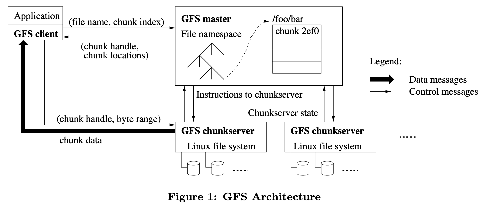
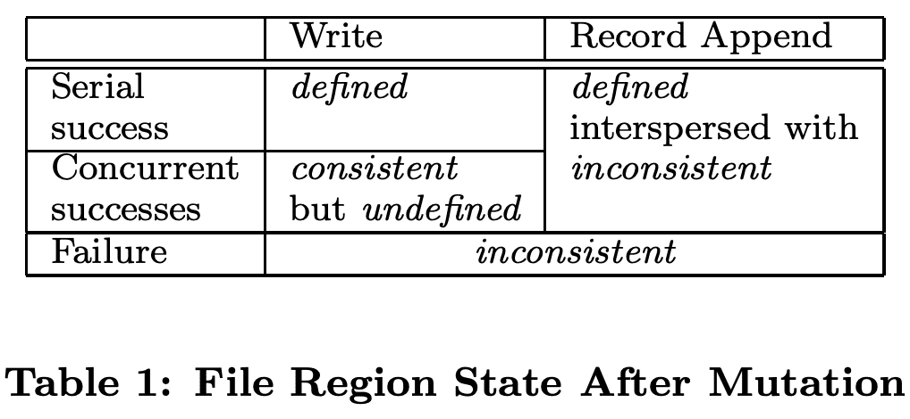
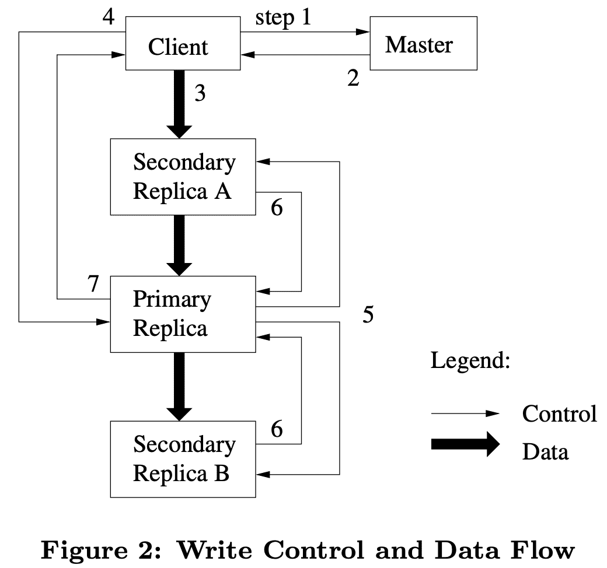

# GFS (SOSP ‘03)

[https://static.googleusercontent.com/media/research.google.com/ko//archive/gfs-sosp2003.pdf](https://static.googleusercontent.com/media/research.google.com/ko//archive/gfs-sosp2003.pdf)

# 요약

1. assumptions, GFS의 design principle
    1. 시스템에서 component(disk, server, rack, switch, …) failure는 무조건 일어난다고 생각해야 한다, -> monitoring, tolerance, recovery는 필수
    2. 대용량의 파일들을 저장한다, 대부분 100mb이상이 일반적이므로 효율적으로 관리해야됨, 작은file도 지원하지만 optimize 할필요는없다
    3. app(GFS client)은 large streaming read 위주로 동작(client에서는 file을 seq하게 읽는게 일반적), small random read 케이스는 미리 정렬한다음 offset을 seq로 읽도록 바꿈
    4. 여러 client가 동시에 append하는것을 효율적으로 구현해야됨. write된 직후 read하는게 많음
    5. low latency보다 high bandwidth가 중요.
2. interface
    1. create, delete, open, close, read, write, record append, snapshot 지원
    2. record append는 atomic하게 데이터를 append함, snapshot은 copy-on-write으로 카피
3. Operation log (WAL)
    1. master나 다른 replica들은 state변경에 대한 일을 하기전에 failure에 대비하기 위해 operation log를 남김
4. consistency model
    1. 여러 client가 같은 chunk에 동시에 write를 했을때 일부는 반영되지 않을 수 있는데, 아무튼 consistency를 가지게 될 수 있음
    2. 내건 반영안될수있지만 consistent하다를 undefined but consistent
    3. 내것까지 모두 반영되는경우를 defined (이때는 당연히 consistent함)
5. Architecture (*figure 1*)
    1. master: primary master, shadow masters로 구성
        1. primary: 모든 metadata직접관리(in-memory), chunkserver와 주기적으로 통신, GC(delete marking된 파일 제거), 주기적으로 체크포인팅, operation log모두남김(WAL),
        2. shadow: read-only master임, metadata는 master로부터 받아옴
    2. chunkserver: 파일을 64mb단위로 쪼갠 chunk들을 관리,
        1. client가 직접 chunkserver와 통신함
        2. 캐싱은 직접하지 않음, 왜냐면 linux buffer cache가 LRU manner로 돌고있으므로 linux에 의존
6. *write (figure 2)*
    1. master에게서 replica 들고있는 chunkserver 주소를 받아옴, master는 저중 하나를 primary replica로 설정(primary replica는 mutation order를 결정함), (mutation: file의 content나 metadata 수정하는 것)
    2. client가 chunkserver 중 하나한테 content전달, chunkserver가 다른 chunkserver에게 handoff 방식으로 전달 (1 to N으로 모두에게 전달하면 full bandwidth를 쓰지못함)
    3. primary replica에게 write request를 내림, primary는 여러 요청이 들어온것을 ordering하고(master에게서 lease를 받은 replica, primary replica만 가능) write함, 그리고 다른 secondary Replica들에게 mutation order와 같이 write명령전달, (primary에서 에러가나면 바로 client로 리턴)
    4. secondary replica가 mutation을 수행하고 primary에게 완료를 알림
    5. secondary중 일부에서 에러가 발생하면 클라에게 에러를 전달, 이때 일부 replica와 다른 Replica간 inconsistent해짐, client는 재시도를 통해 consistent하게 만듦
7. read
    1. replica 여러개로 full bandwidth를 이용 ㄱㄴ
8. *atomic append*
    1. 원래 write request는 (offset, content) 를 던지면서 이 offset에 write해달라 이지만, atomic append는 content만 던지고, offset은 primary replica가 결정해줌
    2. replica는 file이 아닌 chunk 단위이므로 append하려는 data가 chunk size를 넘기게되면 곤란.. 그래서 이경우 chunk에 패딩을 넣어서 64mb를 꽉채우고 client에게 재시도하라고 에러를 리턴
9. *snapshot* (copy-on-write)
    1. primary master가 가진 in-memory metadata 에서 복제함, 실제로는 같은 chunk를 바라보고 있는것임
    2. client가 복제된 chunk에 대해 write를 하려는경우 이때 chunk를 복제하고 write를 하게 됨
10. Master: master namespace management
    1. path를 key로 하고 metadata를 value로 하는 mapping table을 관리함, 기존 filesystem의 tree structure가 아님, key는 압축해서 사용
    2. path `/a/b/c/d` 에 대해서 write하려고할떄 (`d` 는 file이나 directory 상관없음)
        1. `/a, /a/b, /a/b/c` 에 대해 read lock
        2. `/a/b/c/d` 에 대해 write lock
        3. 이렇게하면 같은 directory `/a/b/c` 에대해 여러 file을 생성할때 read lock만 잡으므로 contention이 없어짐
11. Master: chunk replica placement
    1. 여러 서버로 분산시키긴 하지만 rack failure도 대비해야하므로 chunk replica는 서로 다른 rack의 서버에 들어가게 됨, network bandwidth를 먹는 tradeoff는 있음
    2. disk space utilization이 평균 미만인 쪽에 할당, 전체적인 disk space util이 고르게 퍼짐
    3. chunkserver에 recent chunk creation 수가 제약이 있음, 왜냐면 한번 write하고나서 read가 바로 생기므로 write는 곧 Read가 발생할거라는 implication임, 한번에 많이 write를 하면 bandwidth saturation발생가능성높음
    4. re-replicate: min replica 밑으로 내려가면 replicate을 또 하게됨.
    5. rebalance: load balancing을 위해 replica를 옮김, 삭제되는 replica는 delete marking만 함
12. Master: Garbage Collection
    1. delete marking 3일 이상된 chunk를 master가 주기적으로 삭제명령을 chunkserver에게 보냄,
    2. chunkserver는 master와 주기적으로 heartbeat를 주고받는데 이때 metadata들을 전달해줌 (얘 삭제처리된지 2일됐어요~)
    3. GC단점: 삭제마킹이라서 실제 삭제가 아니라서 space를 먹게됨, 따라서 실제 삭제할수있게 기능도 열어줌
13. Data integrity
    1. chunkserver에서 data corruption을 확인하기 위해 checksum을 유지함

# 1. Introduction

google의 data processing needs를 만족하기 위해 GFS를 design, implement했다. GFS는 이전 DFS와 같이 performance, scalability, reliability, availability같은 목표를 가진다. 하지만 GFS의 design은 이전의 file system design과는 많이 다른, google의 application workload, technological environment 등에서 본것들로부터 만들어졌다. GFS는 과거 DFS의 choice를 재조사하고 design에 대한 선택지에서 매우 다른 지점들을 찾아냈다.

첫번째로 component failure는 exception이 아니라 norm이다. file system은 수백 수천개의 storage machine으로 구성되고, 엄청나게 많은 client machine에서 접근한다. 따라서 일부 component는 특정 시간에 동작하지 않을수도 있고, failure에서 복구되지 않는 상황이 생길 수 밖에 없다. 또한 application/OS bug, human error, hardware failure 문제들도 있다. 따라서 monitoring, error detection, fault tolerance, automatic recovery는 system에 포함되어야한다.

두번째로 file은 몇 gb file이 일반적일정도로 크다. 점점 커지는 dataset을 처리하면서 아주 작은 size의 file을 관리하는건 힘들다. 따라서 IO operation과 block size같은 design assumption과 parameter에 대해 다시 고려해봐야 한다.

세번째로 대부분 file은 기존 file을 overwrite하지 않고 새 데이터를 append하는것으로 mutate된다. file에서 random write는 없다고 볼 수 있다. 즉 한번 write되면 file은 sequential read가 일반적이다. 다양한 data는 이런 특징을 보인다. 많은 file에 대한 access pattern에서 appending은 cache뿐만아니라 성능 최적화와 atomictiy를 보장하는 타겟이 된다.

네번째로 application과 filesystem API를 같이 디자인하면 전체 시스템에 이득이 있다. 예로 application에 부담을 주지 않으면서 filesystem을 단순화하기 위해 GFS의 consistency model을 완화했다. 또한 atomic append operation을 만들어 여러 client가 그들끼리 sync mechanism을 가지지 않고서도 동시에 file에 append할 수 있다.

# 2. Design Overview

## 2.1 Assumptions

- system은 일부가 실패하는 수많은 저렴한 machine에 올라간다. failure가 일반적인 상황에서 monitoring, detection, tolerance, recovery는 필수적이다.
- system은 대용량 파일들을 저장한다. 수백만개의 파일은 일반적으로 100mb 이상이다. 몇gb가 되는 file또한 일반적이므로 효율적으로 관리되어야 한다. 작은 file또한 지원해야 하지만, optimize할필요는 없다.
- workload는 주로 2가지 타입의 read를 한다. large streaming read는 각 operation이 수백kb나 1mb정도의 data를 읽는다. 한 client가 던지는 operation들은 file을 sequential하게 읽는 경우가 생긴다. small random read는 random offset에 대해 몇kb 만큼의 data를 읽는다. 고성능을 요구하는 application은 때때로 small read를 미리 정렬해서 offset을 sequential하게 읽는다.
- workload는 file에대해 large, sequential write (즉 append)를 한다. write operation의 size는 read와 비슷한 경우가 많다. 한번 write된 file은 다시 수정되지 않는다. random overwrite는 지원은 하지만 효율적으로 동작하지 않는다.
- system은 여러 client가 동시에 같은 file을 append하는 semantic을 효율적으로 구현해야한다. file은 때때로 producer-consumer queue나 multi-way merge에 사용될 수 있다. 수백개의 producer는 동시에 file에 append를 할것이다. atomicity의 overhead는 작아야 한다. file은 후에 read되고, consumer는 file을 동시에 읽을 것이다.
- 지속적으로 높은 bandwidth는 low latency보다 중요하다. application의 대부분은 대량의 data를 높은 속도로 처리하고, 개별 read write call에 low latency를 요구하는 경우는 거의 없다.

## 2.2 Interface

GFS는 file system interface와 비슷하게 제공하지만 POSIX같은 standard api를 구현하지 않는다. file은 directory 계층구조를 가지고, path name으로 식별된다. GFS는 $create, delete, open, close, read, write$를 지원한다

또한 $snapshot, record\ append$ operation을 지원한다. Snapshot은 file이나 directory copy를 낮은 비용으로 만든다. record append는 여러 client가 동시에 같은 file에 대해 atomic append하도록 해준다. 이건 multi-way merge나 producer-consumer queue를 추가적인 blocking없이 구현할 수 있어 쓸모가 있다. 이런 종류의 File은 large distributed application을 만들때 매우 유용하다.

## 2.3 Architecture

GFS cluster는 single $master$와 multiple $chunkserver$로 구성되어있고 많은 $client$가 접근한다. 머신의 resource가 남아있으면 chunkserver와 client를 같은 머신에서 실행할 수 있고, flaky application code를 실행해서 생기는 failure는 허용된다.

Flie은 fixed-size $chunk$로 쪼개진다. 각 chunk는 immutable하고, unique id인 64bit chunk handle은 chunk가 생성될때 master가 할당해준다. chunkserver는 chunk를 local disk에 저장하고 chunk handle과 byte range로 chunk data를 read/write 한다. Reliability를 위해 각 chunk는 여러 chunk server로 복제된다. 기본값으로는 3개의 replica를 가지고 유저는 replication level을 설정할 수 있다.

master는 모든 file system metadata를 관리한다. metadata는 namespace, access control, file to chunk mapping, chunk location등이 포함된다. 또한 chunk lease management, GC for orphaned chunk, chunk migration같은 system-wide activity를 컨트롤한다. master는 주기적으로 instruction을 내리고 state를 가져오기 위해 $HeartBeat$ message를 통해 각 chunkserver와 통신한다.

GFS client는 master, chunkserver와 통신해서 data를 read/write 한다. client는 master에게 metadata를 가져오고, data에 관한것은 chunkserver와 통신한다.

client와 chunkserver는 data를 cache하지 않는다. 대부분 application이 large file을 처리하거나, 캐싱하기에 너무 큰 data이므로 cache에 큰 이점이 없다. cache가 없는것은 client와 system이 cache coherence issue를 겪지 않게 해준다. (하지만 client에서 metadata를 cache 한다). chunkserver는 chunk가 local file로 저장되어있어 Linux buffer cache가 자주 접근하는 데이터를 in memory로 cache하므로 별도의 cache를 하지 않는다.

## 2.4 Single Master

single master를 가지는것은 design을 단순하게 해주고, master가 global knowledge를 이용해 정교한 chunk placement 와 replication decision을 하게 해준다. 하지만 bottleneck이 발생하지 않도록 read,write에서 master의 critical path를 최소화 해야한다. client는 절대로 master를 통해서 data를 접근하지 않는다. client는 master에게 어떤 chunkserver와 통신하면 되는지 물어보고, 이 정보를 일정기간 cache하고, chunkserver와 직접 통신한다.

Figure 1은 read할때의 interaction을 보여준다. 첫째로 fixed chunk size를 이용해서 client는 application에서 정의해둔 (file name, byte offset) 에서 file의 chunk index르 변환한다. (머 대충 $chunk\_index=byte\_offset\ \%\ fixed\_chunk\_size$). 그리고 master에게 (file name, chunk index)를 던진다. master는 replica에 대한 (chunk handle, chunk location)를 리턴해준다. client는 key를 (file name, chunk index), value를 (chunk handle, chunk location)으로 캐싱한다.

client는 replica중 물리적으로 가까운 Replica에게 (chunk handle, byte range)로 요청을 던진다. 같은 chunk에대한 read는 캐시가 있으므로, cache expiration이나 file reopen이 안생긴다면 client-master간 interaction은 필요없다. 실제로 client는 같은 request에 여러 chunk를 담고, master는 여러 chunk에 대한 response를 전달해준다. 이런 extra information은 미래에 client-master interaction이 필요 없게 만들어준다.

## 2.5 Chunk Size

Chunk size는 key design parameter중 한개이다. GFS는 64MB로 설정했는데, 일반적인 filesystem block size보다 한참 크다. 각 chunk replica는 chunkserver에 linux file로 저장되고, 필요한경우 extend된다. lazy space allocation은 internal fragmentation으로 인한 space낭비를 피한다. internal fragmentation is the greatest objection against such a large chunk size.

large chunk size는 몇몇 이점을 준다.

1. 같은 chunk에 대한 read, write가 한번의 request만 필요로 하므로, client가 master와의 interaction을 줄여준다. 이건 google의 application들이 large file을 sequential read/write 하므로 큰 성능 향상을 보여준다. small random read에서도 client는 모든 chunk location information을 몇TB의 working set(memory용어)에 캐싱할 수 있다.
2. large chunk이므로 client는 한 chunk에 대해 더 많은 operation을 하게 되고,  장기간동안 chunkserver와 persistent TCP connection을 유지해서 network overhead를 줄이게 된다.
3. master의 metadata size를 줄여준다. 따라서 metadata를 memory에 올릴 수 있게 해주고 in-memory data structure(section 2.6.1)을 만들수 있게 해줬다

반면에 large chunk size는 lazy space allocation이 있어도 단점이 있다. small file은 작은 수의 chunk로 구성되어있고 한개일수도 있다. 이런 chunk를 저장하는 chunkserver는 많은 client가 같은 file에 대해 접근하면 hot spot이 된다. 하지만 실제로는 google의 application들이 large file을 sequential하게 읽는게 대부분이라 hot spot은 큰 이슈까지는 아니다.

그러나 hot spot은 GFS가 batch-queue system에서 사용될때 점점 문제가 되었다. executable이 GFS에 single chunk file로 write되고 수백개의 machine에서 실행됐다. 이런 executable을 저장하는 chunkserver는 동시에 수백개의 리퀘스트를 받게된다. 이 문제를 높은 Replication factor로 설정하고 batch queue system의 시작 시간에 bias를 넣어 해결했다. 이런 상황에서long-term solution중 하나는 client가 다른 client에서 data를 읽게 하는 것이다.

## 2.6 Metadata

master는 3종류의 metadata를 저장한다. file과 chunk namespace(file에서 chunk로의 매핑)와 각 chunk replica의 location이다. 모든 metadata는 master의 메모리에 올라간다. 또한 file, chunk namespace는 변경사항을 master의 locatl disk에 $operation\ log$로 남기고 remote machine에 복제하여 persistent하게 유지한다. $operation\ log$는 master crash에서 incosistency가 날 리스크를 없애줘서 master state를 simple,reliable하게 update 하도록 해준다. master는 chunk location을 persistent하게 저장하지 않고, master가 시작할때나 chunkserver가 cluster로 들어올때마다 chunkserver에서 가져온다.

### 2.6.1 In-Memory Data Structure

metadata가 in-memory로 저장되므로 master operation이 빨라진다. 또한 master가 주기적으로 master의 전체 state를 background로 스캔하는게 쉬워진다. 이런 periodic scanning은 아래와 같은곳에 쓰인다

- chunk GC
- chunkserver failure가 생길때 re-replication
- load와 disk usage를 balancing하기 위한 chunk migration

in-memory에서 고려사항은 chunk 갯수와 이에 따른 전체 시스템의 capacity가 master memory size에 제약이 걸린다는 점이다. 이건 심각한 제약까지는 아니다. master는 64MB chunk에 64bytes 미만의 metadata를 유지한다. large file을 많이 쓰므로 대부분 chunk는 꽉차있어 마지막 chunk만 partially filled이다. 비슷하게 file namespace도 file name을 preix compression을 이용해서 저장하므로 file당 64byte 미만이다.

large file system을 지원해야 한다면 master에 extra memory를 넣는것이 simplicity, reliability, performance, flexibility를 고려한다면 값싼 비용이다.

### 2.6.2 Chunk Locations

위에서 말했듯, master는 chunk replica location을 persistent하게 저장하지 않는다. master는 시작할때 chunkserver에게 요청해서 얻어온다. master는 그 이후부터는 모든 chunk location을 관리하고 chunkserver status를 heartbeat로 모니터링 하므로, chunk replica location을 up-to-date하게 유지할 수 있다.

처음에 master에서 chunk location information을 persistent하게 저장해봤으나 startup time에 chunkserver에서 data를 가져오는게 훨씬 단순하다는것을 봤다. 이건 master와 chunkserver 사이에서 생기는 consistency 문제(chunkserver에서 join, leave할때, name이 바뀔때, fail, restart할때)가 생기지 않게 해줬다. 수백개의 서버가 있는 cluster에서 이런 event는 자주 일어나기 때문이다.

### 2.6.3 Operation Log

operation log는 metadata change에 대한 historical record이다. metadata에 대한 persistent record뿐만아니라 concurrent operation을 ordering하기 위한 logical time line 으로도 쓸 수 있다. File, Chunk와 얘네들의 version은 생성된 logical time(Lamport Clock관련용어.?)에 따라 unique하게 식별된다.

operation log가 매우 중요하므로 reliable하게 저장해야하고, metadata change가 persistent하기 전까지 client에게 보여줘서는 안된다. 그렇지않으면 operation log가 날아가는 경우에 chunk는 있더라도 전체 filesystem이나 client operation이 사라질 수 있다. 따라서 operation log를 remote machine에 replicate하고 log record를 disk로 (replica포함) flush 된 후에 client에게 응답을 준다. master는 flush하기전에 log record들을 배치처리하여 flush, replication으로 인한 성능 하락을 막는다.

master는 operation log를 replay하여 master state를 복구한다. startup time을 줄이기 위해 operation log를 작게 유지해야만 한다. master는 log가 특정 사이즈를 넘길때마다 state를 checkpointing하여 local disk에서 latest checkpoint를 읽고 checkpoint 이후의 일부 레코드만 replay하여 복구할 수 있다. checkpoint는 memory에 직접 매핑할 수 있는 compact B-tree 형태이고 추가적인 parsing없이 namespace lookup에 쓸 수 있어 recovery가 빨라지고 availability가 올라간다.

checkpoint를 만드는데 시간이 걸릴 수 있으므로 master의 internal state는 새 checkpoint가 incoming mutation을 delay 시키지 않고 생성하도록 되어있다. master는 새 log file로 switch하고 새 checkpoint를 다른 thread에서 생성한다. 새 checkpoint는 switch 이전의 모든 mutation을 포함한다. 수백만개 파일이 있는 클러스터일때도 1분정도면 checkpoint가 생성된다. 생성되고나면 replica로도 복제된다.

Recovery는 latest complete checkpoint와 그 후의 log file만 필요로 한다. 이전의 checkpoint와 log file은 지울 수 있지만 혹시모르니 좀더 남겨두고있다. checkpointing동안 failure가 발생하는건 recovery에서 incomplete checkpoint를 skip하므로 correctness에 영향을 미치지 않는다.

## 2.7 Consistency Model

GFS는 distributed system에서 상대적으로 구현하는데 쉽고 효율적인  **relaxed consistency model** 이다.

### 2.7.1 Guarantees by GFS

file namespace mutation (e.g., file creation)은 atomic하다. mutation은 master에서 별도로 핸들링된다. namespace locking은 atomicity와 correctness를 보장하고 (Section 4.1), operation log는 이런 operation의 global total order를 가지고 있다 (section 2.6.3).

data mutation이후 file region의 상태는 mutation type, 성공/실패 여부, concurrent mutation이 있는지에 따라 달라진다. Table 1은 summary이다. file region은 모든 client가 어떤 replica에서 읽던지 상관없이 같은 data를 볼 수 있으면 $consistent$ 이다. region은 file data mutation 이후에 region이 consistent해지면 $defined$ 이다. 그리고 client는 mutation이 만든 모든 내용을 볼 수 있게 된다.

- mutation이 concurrent write의 방해없이 성공하면, 해당 Region은 $defined$ (implication consistent)이다. 즉 모든 client는 mutation이 write한 내용을 볼 수 있다.
- concurrent successful mutation이 생기면 region은 $undefined$이지만 $consistent$ 이다. 모든 client가 같은 data를 보지만 한 mutation이 write한 결과를 반영한 것은 아니기 때문이다. 일반적으로는 여러 mutation이 섞인 결과이다.
- failed mutation은 region을 $inconsistent, undefined$ 로 만든다. 서로 다른 client가 다른 시간에 다른 데이터를 보게 된다.

아래엔 어떻게 application이 undefined region에서 defined region을 구분 할 수 있는지 보여줄것이다. application은 다른 종류의 undefined region을 구분 할 필요가 없다.

Data mutation은 $write,\ record \ append$ 두가지이다. write는 data가 application이 요구하는 file offset에 write하는 operation이다. record append는 concurrent mutation이 있을때에도 data(record)가 at-least-once로 atomic하게 append되게 한다. 다만 offset은 GFS가 결정한다(Section 3.3) (반면에 regular append는 client가 end of file이라고 믿는 offset에 쓰는것이다). offset은 client로 리턴되고 record를 포함하는 defined region의 시작을 마킹한다(???뭔말). 또한 GFS는 padding을 넣거나 사이에 duplicate record를 넣을 수 있다. 이것들은 inconsistent하다고 보는 영역을 차지하고, user data 크기에 비해 작다(왜 생기는지 궁금..).

successful mutation들이 발생한 후 mutated file region은 $defined$  되고, last mutation이 쓴 data도 포함하도록 보장된다. GFS는 이것을 (a) 한 chunk에 모든 replica에서 같은 순서로 mutation들을 반영하고(Section 3.1) (b) chunkserver가 down하고있을땐 missed mutation이 생기므로, chunk version number를 이용해 stale해지는 replica를 찾아내어 보장해준다 (Section 4.5). stale replica는 mutation을 반영하거나, client가 chunk location을 요청할때 master가 client에게 stale replica를 포함시키지 않는다. stale replica는 GC대상이 된다.

client가 chunk location을 캐싱하므로 refresh되기 전에 stale replica에서 data를 읽을 수 있다. 물론 cache timeout, file open(cache invalidation)으로 한정된다. 게다가 대부분 file이 append-only이므로 stale replica는 outdated data보다는 chunk의 premature end를 리턴한다. client가 재시도하거나 master와 통신할때는 현재의 chunk location을 받게 된다.

successful mutation이 된 한참 뒤에도 component failure는 data를 corrupt, destroy 시킬 수 있다. GFS는 master와 chunkserver간 regular handshake를 통해 failed chunkserver를 식별하고, checksum을 통해 data corruption을 찾아낸다(Section 5.2). 문제를 찾아내면 data는 valid replica에서 최대한 빨리 복구된다(Section 4.3). chunk는 GFS가 반응하기 전 짧은 시간내에 모든 Replica가 날아가면 삭제될 수있다. 하지만 이럴때에도 corrupt data를 받아서 문제를 알수없는건 아니고, error를 받아서 문제를 인지 할 수 있다.

### 2.7.2 Implications for Applications

GFS application은 relaxed consistency model을 다른 목적(overwrite대신 append사용, checkpointing, writing self-validating/identifying records)에서 이미 필요로하는 몇개 테크닉을 활용해 accomodate 할 수 있다.

거의 대부분 google application은 overwriting 대신 appending으로 file을 mutate한다. 다라서 writer는 file을 시작에서부터 끝까지 생성하게 된다. writer는 data를 모두 쓴 이후나, successfully written을 얼마나 했는지 checkpoint 한 직후에 atomic하게 file을 persistent name으로 rename한다. client checkpoint는 application level checksum도 포함할 수 있다. reader는 defined state라고 할 수 있는 last checkpoint 까지의 file region을 검증, process한다. consistency, concurrency문제와 관계없이 이 방식은 큰 도움이 된다. appending은 random write보다 application이 efficient, resilient하게 해준다. Checkpointing은 writer가 incremental하게 재시작 할 수 있게 하고, reader가 application 관점에서 아직 불완전한 data를 처리하지 못하게 한다.

다른 usecase에선 많은 writer들은 merged result를 만들거나 producer-consumer queue를 위해 동시에 file에 append한다. record append의 append-at-least-once semantic은 각 writer output을 유지하게 해준다. reader는 padding, duplicate의 케이스를 대처한다. 각 record는 checksum같은 정보를 포함시켜 validity를 확인한다. reader는 checksum을 이용해서 extra padding, record fragments를 식별하고 버린다. 만약 duplicate(예를들면 non-idempotent operation을 호출하는 경우 발생 가능)을 허용 할 수 없으면 record의 unique id(web document같이 뭐가됐던지 식별할수있는거면 됨) 를 이용해 filter out시킬 수 있다.

# 3. System Interactions

모든 operation에서 master의 개입을 최소화 하도록 시스템을 디자인 했다.

## 3.1 Leases and Mutation Order

mutation은 write, append로 chunk의 metadata나 content를 수정하는 operation이다. 각 mutation은 모든 chunk replica에서 수행된다. GFS는 replica간 consistent mutation order를 유지하기 위해 [lease](https://en.wikipedia.org/wiki/Lease_(computer_science)) 를 쓴다. master는 replica 중 한개(primary)에게 chunk lease를 grant한다. primary는 chunk에 대해 모든 mutation을 ordering(serialization)한다. 모든 replica는 mutation들을 적용할때 이 order를 따른다. 따라서 global mutation order는 첫번째로 master가 선택한 lease grant order, 그 다음으로 lease 내에서 primary가 설정해준 serial number로 정의된다.

lease mechanism은 master의 managing overhead를 최소화하기 위해 디자인되었다. lease는 60초의 initial timeout을 가지지만, chunk가 mutate되는동안 primary는 master에게 lease를 무한정으로 연장을 요청 할 수 있다. 이 extension request와 grant response는 chunkserver와 master간 주고받는 $HeartBeat$ message에 piggyback된다. master는 때때로 lease가 expire되기전에 revoke한다(master가 파일 이름이 바뀌는것을 disable로 설정하는경우 등). 또한 master가 primary와 통신이 끊어지더라도 old lease를 expire시키고 다른 replica에게 new lease를 준다.

Figure 2는 lease process를 나타낸다.

1. client는 master에게 어떤 chunkserver가 lease를 들고있는지, 다른 replica의 location은 무엇인지 요청한다. master는 lease를 받은 replica가 없으면 master는 한 replica에게 grant한다.
2. master는 primary id와 secondary replica location을 보내준다. client는 future mutation을 위해 이 data를 캐싱한다. primary가 unreachable하거나, lease를 갖고있지 않게되면 master와 다시 통신한다.
3. client는 data를 out-of-order로 모든 replica에게 전달한다. 각 chunkserver는 data가 used나 aged out되기전까지는 internal LRU buffer cache에 data를 저장할것이다. data flow와 control flow를 디커플링하는것으로, 어떤 chunkserver가 primary인지 관계없이 network topology를 바탕으로 expensive data flow를 scheduling해서 성능을 향상시켰다.(Section 3.2)
4. 모든 replica가 data를 받고난뒤 ack를 던지면, client는 primary에 write request를 보낸다. 이 request는 이전에 모든 replica에게 보냈던 data를 식별한다. primary는 1+개의 client로부터 받은 모든 mutation에 대해 consecutive serial number를 할당한다(ordering). 그리고 serial number order에 따라 mutation을 적용한다.
만약 primary가 도중에 에러가나면 아래를 수행하지 않고 error를 client에게 전달한다.
5. primary는 write request를 secondary replica들에게 forward한다. secondary replica는 같은 serial number order로 mutation을 수행한다.
6. secondary replica는 primary에게 모든 Operation을 수행했음을 알린다.
7. primary는 client에게 리턴한다. secondary replica에서 생긴 error는 client에게 전달된다. error가 발생하면 write는 primary와 일부 secondary replica에서는 성공한것이다. client request는 failed라고 보고 modified region은 inconsistent state로 남아있게 된다.
client는 이와 같은 failed mutation에 대해 retry를 한다. retry는 3~7 과정을 여러 회 재시도한다.

application의 write가 크거나, 여러 chunk boundary에 걸쳐있으면 GFS client는 write를 여러 write operation들로 쪼갠다. write operation들은 위의 control flow에따라 처리되지만, 다른 client의 concurrent operation에 의해 interleave되거나 overwrite될 수있다. 따라서 개별 operation이 같은 순서로 완료되므로 replica는 consistent하지만, shared file region은 서로 다른 client들에 의해 fragmentation이 생긴다. 따라서 file region은 consistent 하지만 undefined하다(Section 2.7).

## 3.2 Data Flow

GFS는 network effciency를 위해 control flow와 data flow를 디커플링했다. control flow는 client에서 primary, primary에서 모든 secondary로 가지만, data flow는 pipeline처럼 chunkserver chain에따라 linear하게 흐른다. 목표는 각 머신의 network bandwidth를 최대한 utilize하고, network bottleneck과 high latency link를 피하고, 모든 data를 push하는 latency를 최소화 하는 것이다.

각 머신의 network bandwidth를 최대한 utilize하기 위해 data는 tree같은 data flow가 아닌 chunkserver chain으로 linear하게 흐른다. 따라서 각 머신의 outbound bandwidth는  여러 recipient들로 쪼개지는게 아닌, 최대한 data를 전송하는데 쓰인다.

network bottleneck, high latency link를 피하기 위해, 각 머신은 data를 network topology상에서 (data를 아직 받지않은) closest machine으로 forward한다. network topology는 IP address로부터 거리를 추정할 수 있어 closest를 결정하는건 쉽다.

GFS는 TCP를 통한 data 전송을 pipelining(CPU에서 쓰는 그 용어)하여 latency를 최소화한다. chunkserver가 data를 받자마자 바로 forward를 시작한다. pipelining은 google이 full-duplex link인 switched network를 쓰고있어, data를 받자마자 바로 전송해도 receive rate이 감소하지 않는다. network congestion이 없을때 $B$ bytes를 $R$ replica로 전송하는 idela elapsed time은 $B/T +RL$ 이다 ($T$는 network throughput, $L$은 latency). google의 network link는 100 Mbps $(T)$, $L$ 은 1 ms 미만이다. 따라서 1 MB는 80 ms 정도면 된다.

### 3.3 Atomic Record Appends

GFS는 $record\ append$라는 atomic append operation을 제공한다. traditional write에서 client는 data가 쓰여질 offset을 설정했었다. 하지만 같은 region에 대한 concurrent write는 serializable하지 않는다. region은 여러 client로부터 write된 data fragment를 가지기 때문이다. 하지만 $record\ append$에서 client는 offset없이 data만 던져준다. GFS는 data를 file에 atomic하게 write한다. 이때 blob은 continous sequence를 가지며, offset은 GFS가 결정하고, client에게 이 offset을 리턴한다. 이건 concurrent writer가 race condition 없이 unix의 `O_APPEND`로 write 하는 것과 비슷하다.

$re cord\ append$는 서로 다른 머신에 있는 많은 client가 동시에 같은 file에 append하는 distributed application에서 많이 쓰인다. 반면 traditional write에선 client는 distributed lock manager와 같이 복잡한 synchronization을 필요로 한다. $record\ append$를 쓰는 file은 multiple producer/single consumer queue 또는 여러 client가 만든 merged result를 포함하는 케이스에 자주 쓰인다.

$record\ append$는 mutation이므로 Section 3.1의 flow와 primary에서 추가적인 extra logic을 수행한다. client는 모든 file의 last chunk를 가진 모든 replica로 data를 전달하고, primary에게 mutation request를 보낸다. primary는 현재 chunk가 append를 하기에 충분한 용량을 가지고 있는지 (64MB를 초과하지않는지) 확인한다. append할 공간이 충분하다면 (일반적인케이스) primary는 data를 append하고 secondary replica에게 data를 write할 offset을 알려 secondary replica가 해당 영역에 write한다(즉 secondary replica는 append가 아닌 write를 수행한다). append할 공간이 부족하다면 **남은 공간을 pad처리하여 꽉 채우고 (secondary replica에게도 전달) client에게 재시도를 통해 append를 다시 하라고 응답한다.** 또한 $record\ append$는 worst fragmentation을 최소화 하기 위해, 한번에 maximum chunk size의 최대 1/4 만큼만 할 수 있도록 제약을 둔다.

$record\ append$가 한 replica에서 fail이 일어나면 client는 재시도를 한다. 따라서 같은 chunk에 대해 replica는 아마도 같은 record에 대한 duplicate을 포함하는 다른 data를 가질 수 있다. GFS는 모든 replica가 byte단위로 identical하다고 보장하지는 않고, data가 atomic unit에서 at least once로 write되는것을 보장한다. 이후에 다른 replica가 primary가 되어도 future record는 higher offset이나 different chunk에 write될것이다(overwrite가 일어나지 않는다). consistency guarantee관점에서 successful $record\ append$ operation이 data를 쓴 region은 defined(with consistent)이고, intervening region은 incosistent (with undefined)이다. inconsistent region을 어떻게 처리하는지는 Section 2.7.2에서 말했다.

## 3.4 Snapshot

snapshot operation은 ongoing mutation에 대한 interruption을 최소화하면서 file이나 directory tree를 거의 바로 copy를 만든다. user들은 huge data set에 대해 branch copy를 빠르게 만들기 위해 쓰거나, 현재 상태를 checkpoint 하기 위해 쓴다.

Andrew File System 처럼 snapshot을 만들때 copy-on-write technique을 쓴다. master가 snapshot request를 받으면 file의 chunk들에 대해 granted lease를 모두 revoke한다. 이것은 subsequent write가 lease holder를 찾기 위해 master와 통신을 하도록 만들고, master에게 chunk의 copy를 생성할 수 있게 해준다.

lease가 revoke (or expire) 되고나면 master는 disk로 operation log를 남긴다. 그리고 log recrod를 source의 metadata를 복제하는것으로 in-memory state에 적용한다. 새로 생성된 snapshot file은 source file과 같은 chunk를 가리킨다.

client가 snapshot을 만든 chunk $C$에게 write를 하려 하면, client는 master에게 current lease holder를 요청한다. master는 chunk $C$에 대한 reference count를 올린다. master는 client request 응답 미루고, 새 chunk handle $C'$를 선택한다. 그리고 각 $C$의 replica를 가진 chunkserver에게 $C'$을 만드라고 요청한다. 같은 chunkserver에서 새 chunk를 생성하는것을 통해 data가 network를 타지 않고 local에서 copy되도록한다. 이 이후부터는 다른 write operation과 동일하다. client는 $C'$가 $C$로부터 생성된것을 알지 못한다.

# 4. Master Operation

master는 모든 namespace operation을 수행하고, chunk replica를 관리한다. placement decision, chunk와 replica 생성, chunk를 fully replicate 시키기 위한 coordination, chunkserver의 load balancing, unused storage에 대한 reclaim등을 한다.

## 4.1 Namespace Management and Locking

master operation의 수행시간은 대부분 길다. 예를들어 snapshot operation은 snapshot에 포함되는 모든 chunk의 lease를 회수해야한다. 이런것들이 실행되는동안에 다른 master operation이 delay되면 안된다. 따라서 여러 operation이 active하도록 하고, 적절한 serialization을 보장하기 위해 namsepace의 region단위 lock을 써야 한다.

다른 file system들과 다르게 GFS는 directory data structure를 가지지 않는다. file, directory에 대한 alias(hard/symbolic link)를 지원하지 않는다. GFS는 namespace를 lookup table (full pathname to metadata)로 표현한다. prefix compression을 통해 lookup table은 메모리에서 효율적으로 관리된다. 각 namespace tree (absolute file/directory name)의 각 node는 associated read-write lock을 가진다.

각 master operation은 실행하기전에 path에 속한 directory들의 lock을 모두 잡는다. 만약 `/d1/d2/.../dn/leaf` 에 대해서 operation을 하면, read-lock은 `/d1, /d1/d2, ..., /d1/d2/.../dn` directory에 대해 read-lock을 잡고, `/d1/d2/.../dn/leaf` 에서 read-lock이나 write-lock을 잡는다(`leaf` 는 operation 대상 file/directory 이다).

어떻게 locking mechanism이 `/save/user` 에서 `/home/user`로 snapshot을 만드는 동안 `/home/user/foo` file을 생성하지 못하도록 막는지 설명할것이다. snapshot snapshot operation은 `/home, /save` 에 read-lock, `/home/user, /save/user` 에 write-lock을 잡는다. file 생성은 `/home, /home/user` 에 read-lock, `/home/user/foo`에 wrirte-lock 을 잡는다. `/home/user` 에 대한 lock을 잡는데 충돌이 일어나므로 두 operation은 serialize 될 것이다. file 생성 operation은 directory를 가지지 않으므로(lookup table 이므로) parent directory에 대해 write-lock을 필요로 하지 않고, read-lock만 있으면 parent directory 가 삭제되지 않도록 막을 수 있다.

이 locking scheme의 이점은 같은 directory에 대해 concurrent mutation을 허용한다는 점이다. 예를들어 여러 파일생성은 같은 Directory에서 동시에 일어날 수 있다($inode$를 생각해보면 directory에 metadata를 써야하므로 동시에 일어나기 힘들다). 각 mutation은 directory에 read-lock, file에 write-lock을 하면 된다. directory에 read-lock을 하는것은 directry가 delete, rename, snapshot 되는것을 막는다. file에 write-lock을 하는것은 같은 file name을 두번 생성하는 시도를 serialize시켜준다.

namespace가 많은 node를 가지므로 read-write lock은 lazy하게 할당되고, 사용하지 않으면 삭제된다. lock 획득은 deadlock을 막기 위해 consistent total order로 수행된다. path level순서, 같은 level에 대해서는 사전순서로 lock을 얻는다.

## 4.2 Replica Placement

GFS cluster는 highly distributed이다. 많은 machine rack의 수백개 chunkserver를 가진다. 따라서 chunkserver는 같은 rack이나 다른 rack의 수백개 client에서 접근한다(chunkserver에서 workload를 실행해야 network bandwidth를 적게 잡아먹으므로). 다른 rack의 두 machine이 통신하는 것은 1개 이상의 network switch를 거치게 된다. 또한 rack으로 들어오거나 나가는 bandwith는 rack 안에 속한 모든 machine의 bandwith 합보다 작다. multi-level distribution(machine을 rack으로 묶고, switch로 묶고 등등 IDC구조)에서data를 scalability, reliability, availability를 분산시키는 것은 어렵다.

chunk replica placement policy는 두개의 목적을 가진다. 1) data reliability, availability 극대화와 2) network bandwith 극대화 이다. 둘다를 만족시키기 위해선 machine간에 replica를 만드는것은 disk나 machine failure만 막을 수 있고, 각 network machine의 bandwidth만 활용 할 수 있어 이것으로는 부족하다. 따라서 chunk replica를 여러 rack으로 분산시켜야 한다. 이것은 전체 rack이 offline일때에도 일부 chunk의 일부 replica는 살아있도록 해준다. 또한 read에서는 traffic을 여러 rack의 bandwidth를 같이 쓸 수있다. 하지만 write traffic이 여러 rack에 걸치긴 한다, 하지만 availibility를 높이기 위해 가질수밖에 없는 tradeoff이다.

## 4.3 Creation, Re-replication, Rebalancing

chunk replica는 chunk creation, re-replication, rebalancing을 위해 생성된다.

master가 chunk를 $create$할때 empty replica(chunk 생성이므로 data가 없음) 를 어디에 둘지 결정한다. 이건 몇가지를 고려해야 한다.

1. average 밑의 disk space utilization을 가지는 chunkserver에 새 replica를 놓기를 원한다. 시간이 지날수록 모든 chunkserver간 disk space utillization은 비슷해진다.
2. 각 chunkserver에 “최근에” creation된 숫자를 제한하고싶다. creation이 저렴한 operation이지만, 그 뒤로 heavy write traffic이 온다고 예상 할 수 있다. chunk는 write 한 뒤에 append-once-read-many workload가 필요로 하는 경우가 많다.
3. Section 4.2에서 말한것처럼 여러 rack에 걸쳐 분산되어야 한다.

master는 user가 설정한 replication goal 밑으로내려가는 즉시 chunk를 $re{\text -}replicate$ 한다. chunkserver가 unavailable해지거나,  replica가 corrupt해지거나, disk에 error가 생기거나, replication goal이 올라가거나 할때 re-replicate한다. re-replicate이 필요해진 chunk는 아래와 같은 factor를 바탕으로 prioritized된다.

1. replication goal보다 얼마나 부족한가. 예를들어 2 replica가 죽었고 한개만 남아있으면 higher priority를 가진다.
2. live file의 chunk가 최근에 삭제된 file의 chunk(Section 4.4)보다 먼저 re-replicate되는게 좋다.
3. running application에 악영향을 미치지 않으려면 client progress를 차단하는 chunk의 priority를 높여야 한다. (read할때 full bandwidth를 쓰는 경우??)

master는 highest priority chunk를 선택하고 replica를 가진chunkserver에게 chunk data를 copy해오도록 하여 “clone” 한다. 많은 client traffic에서 clone traffic을 유지하려면 mater는 cluster와 각 chunkserver에 active clone operation의 수를 제한해야 한다. 또한 각 chunkserver는 source chunkserver에 read 요청을 throttling하면서 clone operation이 쓰는 bandwidth를 제한한다.

마지막으로 master는 주기적으로 replica를 $rebalance$한다. 현재 replica distribution을 보고 replica를 disk space + load balancing을 위해 옮긴다. 또한 이를 통해 master는 새 chunkserver에 데이터를 점진적으로 채우게되어 새 chunkserver로 load가 옮겨간다. master는 또한 제거할 existing replica를 선택해야 한다. 일반적으로 평균 미만의 free space를 가지는 chunkserver의 replica를 제거한다.

### 4.4 Garbage Collection

file이 지워진 후에 GFS는 즉시 physical storage를 reclaim하지 않는다. chunk level에 대해 주기적인 GC를 통해 삭제한다.

### 4.4.1 Mechanism

app이 file을 삭제하면 master는 deletion operation log를 남긴다. 하지만 바로 resource를 reclaim하는것보단 file은 hidden name으로 바뀌면서 deletion timestamp를 설정한다. master가 file system namespace를 scan할때 master는 3일 이상 된(configurable) hidden file을 삭제한다. 삭제되기 전까지 file은 읽을 수 있고, normal name으로 바꾸어 undelete할 수 있다. hidden file에 namespace에서 삭제되면 in-memory metadata도 지워져 모든 chunk에 대한 link를 끊게 된다.

chunk namespace에 대한 regular scan에서 master는 orphaned chunk(어느 file에서도 접근하지 않는 chunk)를 찾아내고 chunk의 metadata를 제거한다. $HeartBeat$ message을 주기적으로 master와 주고받을때, 각 chunkserver는 자신이 가진 chunk의 subset을 리포팅하고, master는 이중 metadata에 없는 chunk를 알려주어 chunkserver가 replica를 삭제하게 된다.

### 4.4.3 Discussion

GFS는 쉽게 chunk에 대한 모든 reference를 식별한다. master가 관리하는 file-to-chunk mapping에 reference가 있다. 또한 모든 chunk replica도 쉽게 식별가능하다. 각 chunkserver의 designated directory 에 linux file로 존재한다. master가 알고있지 않은 replica는 “garbage” 가 된다.

storage reclamation을 위해 GC를 하는건 eager deletion에 비해 몇가지 이점이 있다.

1. component failure가 일반적인 large-scale distributed system에서 GC는 단순하면서도 reliable하다. chunk creation은 일부 chunkserver에서 성공하고 일부는 실패해서 master가 알지 못하는 replica로 남을 수 있다. replica deletion messsage도 사라질 수 있으니 master는 error가 발생하더라도 다시 보내야 한다.
2. GC는 store reclamation을 master의 regular background activity(namespace scan, chunkserver의 $HeartBeat$)로 합친다. 따라서 batch로 동작하고 비용이 감소한다. 게다가 GC는 master가 상대적으로 free할때 수행된다. master는 client request에 즉시 답해야 할 수도 있다.
3. reclaming storage에 delay를 주는것은 accidental, irreversible deletion에서도 복구 할 수 있다.

GC의 주요 단점은 떄때로 user가 storage가 부족한경우에 usage를 fine tuning하려할때를 방해하는 것이다. 주기적으로 temp file을 생성/삭제하는 application은 바로 storage를 재사용하지 못할 수 있다(delete가 늦게일어나므로 actual storage를 차지하고있음). GFS는 deleted file이 explicit하게 다시 삭제되면 storage reclaim을 바로 처리하여 application이 storage를 재사용 할 수 있게 해준다. 또한 user가 namespace의 여러 부분에 서로 다른  replication, reclamation policy를 적용할 수 있게 해준다. 예를들어 user는 어떤 directory의 모든 file의 chunk가 replication 없이 저장되도록 하거나, delete file이 즉시 filesystem에서 삭제되도록 할 수 있다.

## 4.5 Stale Replica Detection

chunk replica는 chunkserver가 fail하고 mutation을 반영하지 못하면 stale 하다고 볼 수 있따. 각 chunk마다 master는 $chunk\ version\ number$를 들고있어서 up-to-date과 stale replica를 구분한다.

master가 chunk에 대해 lease를 줄때마다. chunk version number를 증가시키고 up-to-date replica에게 알려준다. master와 replica들은 새 version number를 persistent state에 기록한다. 이건 client가 master로부터 리턴을 받기전에 일어나고 따라서 chunk에 write를 시작하기 전에 반영된다. 만약 다른 replica가 unavailable해지면 chunk version number는 올라가지 않을것이다. chunkserver가 재시작하고 master에게 chunk set과 version number를 리포트하고, master는 stale replica를 가지는지 확인한다. master가 자신이 가진 version number보다 더 큰 version number를 (chunkserver를 통해) 발견하면 master는 lease를 줄때 실패했다고 보고 더 높은 version을 up-to-date 으로 설정한다.

master는 regular GC를 통해 stale replica를 삭제한다. GC 전에는 client가 chunk 정보를 요청할때 stale replica는 없는 데이터로 본다. master가 client에게 어떤 chunkserver가 lease를 가졌는지 알려주거나, cloning operation에서 chunkserver가 chunkserver에게 chunk를 읽도록 명령할때 master는 chunk version number를 포함시킨다. client나 chunkserver는 operation을 수행할때 version number를 검증하여 언제나 up-to-date data를 접근하도록 한다.

# 5. Fault Tolerance and Diagnosis

GFS design에 가장 큰 도전은 빈번한 compontent failure에 대응하는 것이다. component의 quality, quantity는 이 문제를 exception이 아닌 일반적인 일로 보게 만든다. machine을 완전하게 믿을 수 없고, disk또한 믿을 수 없다. component failure는 unavilable system이 되게하고 나쁘면 data corruption이 일어난다.

## 5.1 High Availability

GFS cluster에 수백대의 server간에 일부는 특정시간에 unavailable하다. GFS는 간단하면서도 효과적인 방식으로 전체 시스템을 highly available 하도록 한다.

### 5.1.1 Fast Recovery

master와 chunkserver는 각각의 state를 복구하고, 어떻게 종료되었든지간에 몇초이내로 시작하도록 설계되었다. 실제로 GFS는 normal, abnormal termination을 구분하지 않는다. server는 process kill을 통해 당연히 shutdown된다. client와 다른 server는 처리되지않은 요청에 timeout을 보고, 재시작된 서버를 다시 연결하고 재시도할때 약간의 시간이 걸린다.

### 5.1.2 Chunk Replication

각 chunk는 다른 rack의 여러 chunkserver에 replicate된다. user는 file namespace의 다룬 부분에 다른 replication level을 적용할 수 있다. master는 chunkserver가 offline이 되거나 corrupted replica를 찾으면(Section 5.2) chunk를 fully replicated로 유지하기 위해 clone을 수행한다. replication이 도움을 주지만 증가하는 read-only stroage requirements를 위해(checksum은 read가 많아서 bandwidth먹으니?) parity나 erasure code같은 cross-server redundancy의 다른 형태를 고려하고 있다. 이건 챌린징하지만 google의 트래픽이 small random write이 아닌 append와 read 위주이므로, GFS의 loosely copuled system에서 더 복잡한 redundancy scheme을 구현할 수 있다.

### 5.1.3 Master Replication

master의 operation log, checkpoint는 reliability를 위해 여러 machine으로 replicate된다. state mutation은 log record가 local과 master replica disk에 flush되면 commit된 것으로 본다. 단순함을 위해 한개 master process는 GC같은 background 활동과, 모든 mutation 을 담당한다. master failure가 생기면 즉시 재시작 가능하다. machine이나 disk failure가 발생하면 GFS 바깥의 monitoring infra가 replicated operation log를 가진 다른 machine에서 새 master process를 시작한다. client는 master의 DNS alias인 canonical name을 사용하므로 master가 relocate되오도 문제없다.

게다가 “shadow” master는 primary master가 내려가도 filesystem에 대한 read-only access를 제공한다. 얘네들은 mirror는 아니기때문에 약간 지연될 수 있다. 활동적으로 mutate하지 않는 file이나 slightly stale result를 허용하는 application에게 read availbility를 높여준다. 실제로는 file content는 여러 chunkserver에서 읽히기 때문에, application은 stale file content를 보지 않는다. 짧은 시간 내에서 stale해질 수 있는건 directory내용이나 access control같은 metadata이다.

shadow master는 growing operation log의 replica를 읽고, primary가 수행한것 처림 같은 순서로 change를 적용한다. primary처럼 shadow는 chunkserver가 시작할때 polling하고(이후에는 가끔씩), 상태를 모니터링 하기 위해 handshake message를 주고받는다. shadow는 primary가 replica를 생성,삭제하는 결정에서 생기는 replica location update에 대해서만 primary에 의존한다.

## 5.2 Data Integrity

각 chunkserver는 data corruption을 찾기위해 checksum을 이용한다. GFS cluster는 수백대의 machine에서 수천대의 disk가 있으므로 disk failure가 data corruption이나 data loss를 만드는것은 당연하다(Section 7). GFS는 다른 chunk replica를 써서 corruption을 복구 할 수 있지만, corruption을 찾기 위해 모든 chunkserver의 replica를 비교하는것은 cost가 크다. 또한 다양한 replica가 생길 수 있다. GFS mutation의 semantic, 특히 atomic record append는 identical replica를 보장하지 않는다. 따라서 각 chunkserver는 독립적으로 replica에 대해 checksum을 유지하여 검증한다.

chunk는 64KB block으로 쪼개진다. 각 block은 32bit checksum을 가진다. 다른 metadata처럼 checksum은 memory에 유지되고, logging으로 persistency를 가지며 user data와 분리되어있다.

read를 위해 chunkserver는 client나 다른 chunkserver의 요청에 의해 읽으려는 data block의 checksum을 검증한다. 따라서 chunkserver는 다른 machine으로 corruption을 전달하지는 않는다. block이 recorded checksum과 맞지 않으면 chunkserver는 requester(client나 다른 chunksever)에게 error를 리턴하고 master에게 mismatch를 알린다. requester는 다른 replica에서 데이터를 읽고 master는 다른 replica에서 chunk를 clone한다. 새 valid replica가 생기면 master는 chunksver에게 mismatched chunk를 삭제하라고 지시한다.

checksum은 read performance에 큰영향을 미치지 않는다. 대부분 read가 여러개 block에 걸쳐있으므로, 검증을 위해 상대적으로 적은양의 data를 읽고 checksum을 수행해야 한다. GFS client는 checksum block boundary로 read를 align하여 이 overhead를 감소시킨다. 게다가 checksum lookup과 comparison은 I/O를 발생시키지 않고 끝낸다. checksum 연산은 I/O와 겹칠 수 있다(???)

checksum 연산은 (많은 workload에서 쓰이는) chunk의 끝에 append하는 write를 위해 최적화 되어있다.  last partial checksum block에 대해 checksum을 incremental하게 update하고, append에 의해 새로 생긴 blcok에 대해 새 checksum을 계산한다. last partial checksum block이 corrupted이고 이것을 detect하는데 실패하더라도, 새 checksum value는 stored data와 일치하지 않으므로 다음 read에서 block을 읽을때 corruption이 감지된다.

반면에 기존 chunk에 대해 overwrite가 생기면 overwrite할 처음, 마지막 block을 읽고 검증하고 write를 수행하고, 새 checksum을 계산한다. overwrite 전에 처음, 마지막 block을 검증하지 않으면 새 checksum이 overwrite하지 않는 영역에 존재하는 corruption을 숨기게 된다.

idle시간동안 chunkserver는 inactive chunk에 대해 scan, verify한다. 이건 드물게 읽히는 chunk의 corruption을 찾아준다. corruption을 찾으면 master는 uncorrupted replica를 생성하고 corrupted replica를 삭제한다. 이건 inactive 이지만 corrupt된 chunk replica가 master에게 valid하다고 보이는 상황을 방지하게 된다.

## 5.4 Diagnostic Tools

딱히 novel한것없어서 패스