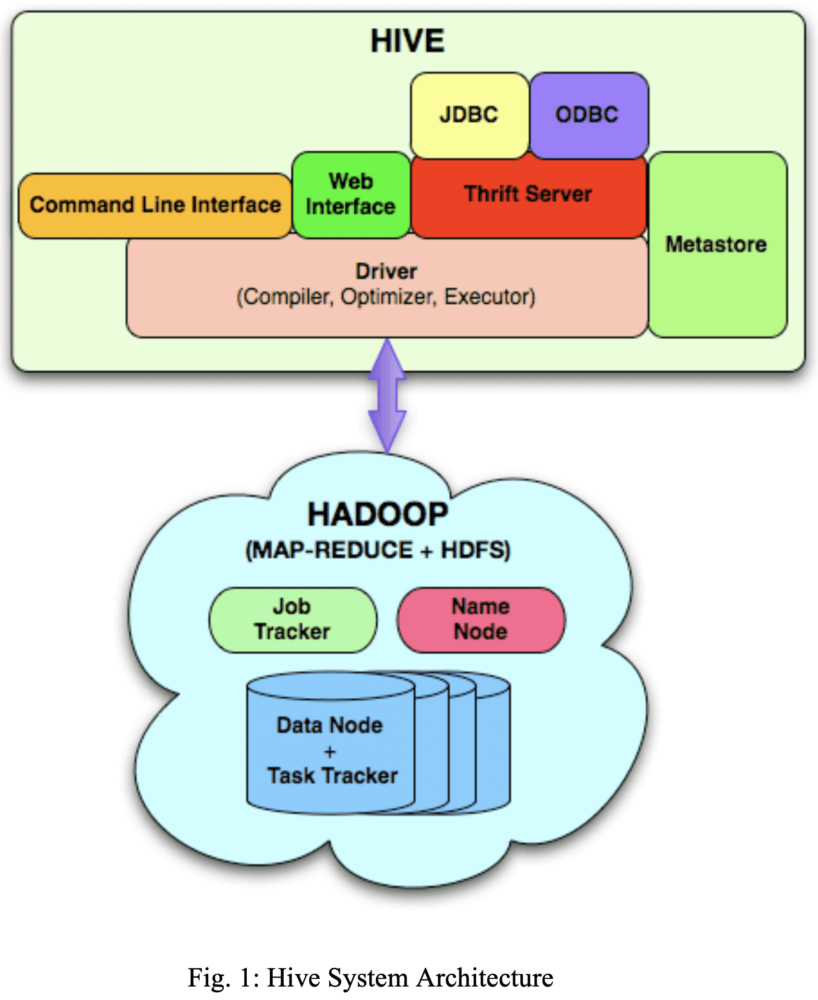

{{ page.description }}

# Hive (ICDE ‘10)

## 1. Introduction

map-reduce를 해주는 Hadoop은 생산성이 낮았다. 유저가 코드를 다 작성해야 했다. SQL로 map-reduce를 할수 있게 해주면어떨까?

## 2. Data Model, Type System and Query Language

하둡 쿼리 소개라서 생략

## 3. Data Storage, SerDe and File Formats

하둡 쿼리 소개라서 생략

## 4. System Architecture and Components

- Metastore: table, column, partition 등에 대한 metadata와 system catalog 저장
- Driver: HiveQL statement의 lifecycle관리, session handle과 통계 유지
- Query Compiler: HiveQL을 DAG로 변환(map/reduce task)
- Execution Engine: DAG order에 맞게 task 수행하면서 Hadoop과 통신
- HiveServer: thrift interface와 JDBC/ODBC 제공
- CLI, web UI
- SerDe, ObjectInspector, UDF, UDAF(User Defined Aggregate Function)에 대한 interface

driver는 CLI, web UI, trhift, JDBC, ODBC 를 통해 HiveQL을 받는다. Metastore에 저장된 metadata로 쿼리 파싱+검사를 한 뒤 compiler에게 전달한다. compiler는 rule base optimizer를 통해 logical plan을 만든다. map/reduce task, hdfs task들의 DAG로 구성된 logical plan이 생성된다. execution engine은 Hadoop에서 task를 수행한다.

### A. Metastore

table, partition, schema, column, type, table location등을 저장한다. 실제로 metadata는 RDBMS에 저장되고 metastore는 application이다. low latency를 위해서 hdfs를 db로 쓰지 않는다.

metastore가 죽으면 안되니까 주기적으로 백업하고, replica server도 띄워둔다. 또한 scalability도 좋아야 한다. user query를 받는게 중요하므로, map/reduce task에서 metastore를 찌르지 않도록 한다. map/reduce task는 plan에서 metadata를 받게 된다.

### B. Query Compiler

query compiler는 metadata를 받아서 execution plan을 만든다.

1. Parse
query에 대한 AST를 만든다.
2. Type checking and Semantic Analysis
metastore로부터 input/output table에 대한 정보들을 가져와서 logical plan을 만들때 쓴다. type compatibility나 semantic error도 확인한다. AST에서 DAG로 변환하는건 Query Block Tree라는 intermediate representation을 거친다. compiler는 nested query를 QB Tree의 parent-child relationship으로 바꾼다. QB Tree 변환을 통해 operator DAG로 변환하기 쉬훈 형태가 된다.
3. Optmization
optimization은 transformation chain으로 구성된다. 새 optmization logic을 넣고싶으면 transformation을 구현하면 된다. transformation은 DAG가 condition/rule에 부합하면 action을 하는 형태이다. transformation에는 Node, GraphWalker, Dispatcher, Rule, Processor라는 5개의 primary interface가 있다. operator DAG의 `node` 는 Node interface를 구현해서 operator DAG가 위의 5개 interface를 이용해 manipulate되게 한다.
transformation은 모든 Node를 방문하면서 Rule에 만족하면 Rule에 해당하는 Processor를 호출한다. Dispatcher는 Rule - Processor 매핑을 들고 Rule matching을 수행한다. Node를 방문하는 동안 적절한 Processor를 쓰도록 GraphWalker에게 전달된다.
optmization stage에선 아래 transformation을 거친다.
    1. Column Pruning
    query processing에 필요한 컬럼만 projection되도록 한다.
    2. Predicate Pushdown
    processing 전에 row를 filter할 수 있다면 predicate이 scan으로 내려가도록 한다.
    3. Partition Pruning
    partitioned column에 대한 predicate이 필요한 partition만 포함시키도록 한다.
    4. Map Side Joins
    small table이 모든 mapper에 replicate시켜서 다른 table에 join되도록 한다.
    query에서 hint를 넣을 수도 있다
    5. Join Reordering
    큰 테이블이 reducer에서 stream으로 들어가고, 작은 테이블이 in-memory로 유지되도록 해서 join operation이 reducer에서 memory를 효율적으로 쓰게 만든다

    user hint

    1. GROUP BY skew에 대한 repartitioning
    GROUP BY로 들어가는 데이터가 power law distribution을 따르는 경향이 있다. 즉 대부분의 데이터가 극히 일부의 reducer에 가게 만든다. 이경우엔 두개의 map/reduce stage로 aggregation하는게 더 좋다. 첫 stage에서 data는 randomly distributed로 reducer들에게 들어가고 reducer들은 partial aggreagation을 만든다. partial aggregation은 두번째 stage에서 GROUP BY column으로 분산된 reducer들에게 뿌려진다. 따라서 partial aggregation 수는 전체 dataset보다 훨씬 적어져 더 나은 성능을 보인다.
    2. Hash based partial aggregations in the mappers
    Hash base partial aggregation은 mapper에서 reducer로 data를 보내는 양을 줄일 수 있고, sorting, merging시간을 줄이게 된다. 따라서 많은 성능 향상을 만들 수 있다.
4. Generation of the Physical Plan
optimization phase 마지막에 생성된 logical plan은 여러 map/reduce나 hdfs task로 생성된다. 예를들어 skewed data를 group by 하는건 2개의 map/reduce task와 result를 저장하는 final hdfs task를 만든다.

### C. Execution Engine

map/reduce 돌림