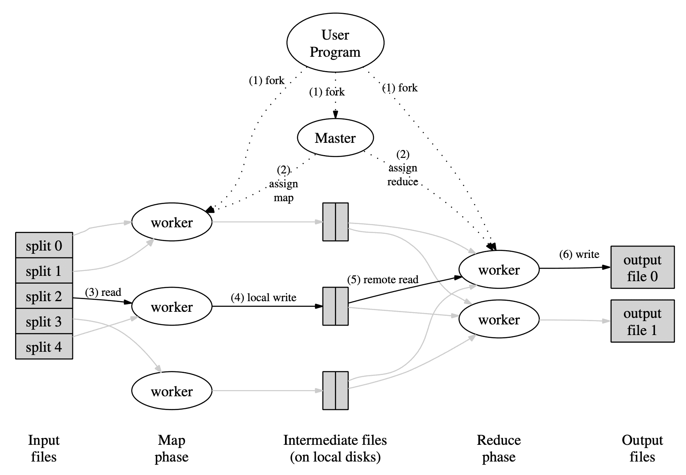

**{{ page.description }}**

# MapReduce (OSDI ‘04)

## 요약

1. user는 Map, Reduce 함수를 작성, map worker 수 M과, reduce worker 수 R을 predefine한상태로 mapreduce 실행
    1. Input file은 logical하게 M개 machine으로 분할됨, M개 워커가 읽어야하므로,
    2. physical하게는 GFS가 optimal io size를 16~64MB로 걸어두고 있으므로 요사이즈로 쪼갬
2. scheduler machine이 assign되고 scheduler가 M+R개 worker를 할당함
    1. 스케줄링할떄 user file이 올라간 GFS와 phsically 가장 가까운 지점 (같은머신 >> 같은 스위치 >> … )으로 할당함, 즉 storage와 computing instance가 같은 머신에 물림
3. map worker는 user file을 local read (or remote read)
4. map worker가 읽은 File로 map operation을 수행한후 local write를 함
    1. reduce worker가 optimal하게 읽어갈 수 있도록 output file을 hash(key) 기준으로 R개 파티션으로 쪼갬
    2. 또한 word count예시를 생각했을때 stop word같은것들은 output record에 `<the, 1>` 이 졸라 많음, 이런것들은 Combiner 라는 함수를 작성해서 `<the, 100>` 으로 압축가능
    3. 완료되면 master에게 완료되었다고 알려주고, file location을 같이 전달함
    4. master는 reduce worker에게 file location을 알려줌
5. reduce worker는 remote read를 통해, M개 파일에서 내 파티션에 해당하는 파일을 읽음
    1. 이미 map worker가 write할떄 파티셔닝을 해놨으므로 sequential read를 하게됨 (이때는 하드디스크임을 명심..)
6. reduce worker는 파일을 읽으면서 user reduce 함수를실행, output은 총 R개 파일로, GFS에 write함
    1. 이때 key 순서로 ordering해서 write하여 final output file이 key를 기반으로 random-access를 할 수 있게 해줌

fault-tolerance

- map worker가 in-progress상태나 complete 상태인데, machine failure가 발생하면 재실행함
    - in-progress는 당연히 재실행하는건 당연하지만,
    - complete상태는 operation이 완료 됐지만 reduce worker가 file을 읽어야하는데 failure상황이니 재실행해야됨
- reduce worker는 in-progress일때 Failure발생하면 재실행함
    - reduce worker의 outputfile은 GFS로 write하는데, GFS는 3중 redundancy를 가지므로 stable함
- master failure는 주기적으로 checkpointing을해서 만약 터지면 그 checkpoint부터 다시시작함

map operation이 deterministic한경우는 문제없다, 그런데 non-deterministic할때는??

- 특정 map worker “A” 가 첫번째 실행하고 완료됨,
- reduce worker 1이 완료된거보고 remote file을 모두다 성공적으로 읽음
- reduce worker 2가 remote file을 모두다 읽으려고 했으나 그중간에 “A”가 failure가 발생해서 읽은거 다버리게됨 ..
- “A”는 재실행을 하는데 문제는 map operation이 non-deterministic하다는점.
- 이런 상황이 오는경우 sequential execution과 output이 같을 수 있음을 보장해주지 않음
    - 왜냐면 reduce worker 1 은 이전의 result를 읽었고 redulce worker 2는 이후의 result를 읽게 되므로..
    - (reduce worker 모두를 재실행 하지 않는 이유는 너무 느려지니까?, 다시한번 이 페이퍼는 HDD밖에없던시절임을상기)

## Abstract

MapReduce는 large dataset을 처리,생성하기 위한 programming model이자 구현체이다. User는 kv pair받아 kv pair로 만드는 $Map$ function, 같은 key를 가지는 value들을 merge하는 $Reduce$ function을 사용한다.

functional하게 작성되는 program은 유저의 개입 없이 알아서 large cluster에서 병렬로 수행된다. runtime system은 input data partitioning, execution scheduling, machine failure 대응, inter-machine communication을 수행한다. 따라서 유저가 분산시스템에 대한 경험 없이도 분산시스템의 리소스를 활용할 수 있다.

## 1. Introduction

그간 google은 inverted index, graph structure, summary, frequent query set등 다양한 종류의 많은 양의 raw data를 처리할 수 있는 수백가지의 프로그램을 만들었다. 이 프로그램들은 직관적이다. 하지만 input data가 크고 적당한 시간내에 연산을 끝내려면 분산되어 있어야만 한다. 어떻게 병렬처리하고 data를 분산하고 faliure를 핸들링하려면 원래의 코드를 복잡하게 만들 수밖에 없다.

이런 복잡도를 처리하기 위해 google은 비즈니스 로직을 구현하지만 parallization, fault-tolerance, data distribution, load balancing을 숨겨주는 abstraction을 만들었다. abstraction은 Lisp에 있는 $map$, $reduce$ primitive에서 영감을 받았다. 많은 compuation이 각 input record를 kv pair로 변환시키는 $Map$과, 같은 key를 가지는 모든 value들을 적절하게 합쳐주는 $Reduce$로 구성된다는것을 알게되었다. user-specified map, reduce를 가지는 functional model을 쓰면 large computation을 병렬화하고, fault-tolerance를 위해 재실행 할 수 있다.

이 paper의 주요 contribution은 automatic paralleization, distribution of large-scale computation을 해줄 수 있는 단순하면서 강력한 interface이다.

## 2. Programming Model

computation은 input kv pair set을 받고 output kv pair set을 생성한다. MapReduce 사용자는 computation을 $Map, Reduce$ 로 표현한다.

$Map$ 은 한 input kv pair를 받아 kv pair set을 생성한다. 같은 key를 가지는 value들을 같이 grouping해서 $Reduce$에 전달한다.

$Reduce$는 key와 value set을 받고, 더 작은 value set으로 merge한다. 일반적으로 $Reduce$ 호출 한번에 0/1 개의 output value가 생성된다. value는 iterator를 통해 유저가 작성한 reduction function에 전달된다. 이건 많은 양의 data를 memory에 넣을 수 있게 해준다.

### 2.1 Example

word count를 생각해보자. 유저는 아래와 비슷한 코드를 작성할 것이다.

```
map(String key, String value):
  for each word w in value:
    EmitIntermediate(w, "1");

reduce(String key, Iterator value):
  int result = 0;
  for each v in values:
    result += ParseInt(v)
  Emit(AsString(result));
```

$Map$ function은 각 단어(key)와 발생횟수(value, 1)를 emit하고, $Reduce$는 word마다 count sum을 emit한다.

### 2.2 Types

이전의 pseudo-code 가 string으로 써지긴했지만 개념적으로는 유저가 설정한 type을 맞추면 된다.

```
map    (k1, v1)       -> list(k2, v2)
reduce (k2, list(v2)) -> list(v2)
```

map의 output과 reduce의 input은 같은 type이고, reduce의 output type은 input의 value type과 동일하다.

### 2.3 More Examples

- **Distributed Grep**: $Map$은 특정 pattern과 매치되는 line을 emit하고, reduce는 data를 output으로 보낸다.
- **Count of URL Access Frequency: $Map$**은 web page request log를 보고 `<URL, 1>` 을 emit하고, $Reduce$는 같은 URL에 대한 count `<URL, total count>`를 emit한다
- **Reverse Web-Link Graph**: $Map$은 `<target, source>` pair를 emit하고, reduice는 `<target, list(source)>` 를 emit한다.
- **Term-Vector per Host**: term vector는 document에서 가장 중요한 단어를 `<word, prequency>` pair로 만든다. $Map$은 `<hostname, term vector>` 를 emit하고, $Redu ce$는 document에 대한 term vector를 merge해서 (infrequent term은 버림) `<hostname, term vector>` 를 emit 한다.
- **Inverted Index**: $Map$은 document를 파싱해서 `<word, document ID>` set을 emit하고, $Reduce$는 word에 대한 document ID를 정렬해서 `<word, list(document ID)>` 를 emit한다. 모든 output pair는 inverted index가 된다.
- **Distributed Sort**: $Map$은 각 record에서 key를 추출해서 `<key, record>` pair를 만들고, $Reduce$는 모든 pair를 그대로 emit한다.

## 3. Implementation

### 3.1 Execution Overview

$Map$ 호출은 input data를 자동적으로 partitioning해서 $M$개의 split으로 만들어 여러 머신에 분산된다. input split은 서로 다른 머신에서 병렬적으로 처리된다. $Reduce$ 호출은 intermediate key space를 $R$ 개로 partitioning 한다(e.g., `hash(key) % R`). \# of partitions $R$과 partitioning function은 user가 결정한다.



위 그림은 MapReduce의 flow를 나타낸다. user가 $MapReduce$ function을 호출하면 아래와 같은 순서에 따라 동작한다.

1. $MapReduce$ library는 input file을 $M$ 개로 쪼개고, cluster에 copy를 올려 시작한다.
2. $M$개 copy중 한개는 master이다. 나머지는 master에 의해 worker로 할당된다. $M$개의 map task와 $R$개의 reduce task가 할당된다. master는 idle worker에 map, reduce task를 할당한다.
3. map task를 받은 worker는 input split을 읽고 kv pair로 파싱하여 user-defined $Map$ function에 전달한다. intermediate kv pair는 메모리에 buffer된다.
4. 주기적으로 bufferd pair는 $R$ 개의 region으로 쪼개진 local disk로 flush된다. local disk의 buffered pair의 위치는 master에게 전달되고, reduce worker에게 뿌려진다.
5. reduce worker가 location을 받으면 RPC를 통해 map worker의 local disk에서 buffered data를 읽어온다. reduce worker가 모든 data를 읽으면 같은 key를 그룹으로 만들 수 있도록 key 기준으로 정렬한다. 서로 다른 많은 키들이 같은 reduce task로 들어가므로 정렬이 필요하다. data size가 크면 external sort를 한다.
6. reduce worker는 정렬된 data를 iterate하면서, unique key를 보게되면 key와 set of values를 user-defined $Reduce$ function에 전달한다. $Reduce$의 output은 reduce partition에 output file로 append 된다.
7. 모든 mak task와 Reduce task가 끝나면 mater는 user program을 깨우고, user program의 $MapReduce$ call은 리턴한다.

완료된 후에 mapreduce execution의 output은 $R$개의 output file에 있다. 일반적으로 유저는 output file들을 한개로 합칠 필요는 없다. MapReduce output을 다른 distributed application으로 보내기 때문이다.

### 3.2 Master Data Structures

map, reduce task에 대해 master는 task의 state(idle, in-progress, completed)와 worker machine id를 들고있다. 또한 master는 map에서 reduce로 file location을 전달하기 위한 수단이 되므로 map task가 끝나면 master는 map task worker에 있는 $R$개의 file region의 location과 size를 저장해둔다.

### 3.3 Fault Tolerance

#### Worker Failure

master는 주기적으로 worker에 핑을 날린다. 어느정도 시간 내에 worker로부터 response가 오지 않으면 master는 worker를 failed 처리를 한다. failed worker가 완료시킨 map task를 idle state로 리셋시켜 worker에 스케줄링 될 수 있도록 한다. 비슷하게 failed worker에서 in-progress 였던 map/reduce task도 idle state로 바꾼다.

failed worker에서 완료된 map task가 재실행되는 이유는 result가 failed worker의 local machine에 있어 access가 불가능하기 때문이다. 완료된 reduce task는 output이 global file system에 저장되므로 재실행 할 필요가 없다.

map task가 worker A에서 실행되고, A가 Failed되고, 추후 worker B에서 실행될때, reduce task를 실행하는 모든 worker는 reexecution을 하라는 명령을 받는다. worker A에서 data를 다 읽지 못한 reduce worker들은 worker B에서 data를 읽게 된다.

MapReduce는 large-scale worker failure에서도 resilient하다. 많은 machine이 다운되어도 단순하게 failed worker의 task들을 재실행하면 되고 MapReduce operation은 eventually complete된다.

#### Master Failure

master가 master data structure를 주기적으로 checkpointing한다. master task가 죽으면 last checkpointed state에서 새로 시작된다.

#### Semantics in the Presense of Failures

map/reduce operator가 input value에 대해 deterministic하다면, MapReduce system은 실패가 없는 sequential execution과 같은 output을 만든다.

이를 만족시키기 위해서 output을 atomic commit한다. 각 in-progress task는 output을 private temporary file로 wrtie한다. reduce task는 1개의 temporary file을 만들고, map tasksms $R$개의 temporary file을 만든다. master가 완료된 map task에게서 완료 메시지를 받으면 $R$개의 file location을 master data structure에 저장한다. 만약 message가 중복으로 오는경우에는 메시지를 무시한다.

reduce task가 완료되면 reduce worker는 atomic하게 temporal output file을 final output file로 rename한다. 같은 reduce task가 여러 mahcine에서 실행되면 multiple rename call은같은 final output file에 대해 실행하게 된다. MapReduce는 final filesystem state가 하나의 reduce task에서 생성되는 data만 포함시키는것을 보장하기 위해 filesystem이 제공하는 atomic rename operation에 의존성을 가진다.

많은 map/reduce operator는 deterministic하고 sequential execution과 동일하게 수행하므로 프로그램의 행동을 쉽게 이해할 수 있다. 하지만 map/reduce operator가 non-deterministic할땐, deterministic할때보단 약하지만 합리적인 semantic을 제공한다. non-deterministic operator가 있을때는 sequential execution과 동일함을 보장 할 수 없다.

map task $M$과 reduce task $R_1$, $R_2$가 있고, $e(R_i)$는 commit된 $R_i$ execution(exactly-once)라 하자. $e(R_1)$이 $M$에 의해 생성된 output을 읽고, $e(R_2)$가 다른 $M$의 execution이 일어날때 weaker semantic이 생긴다. 즉 $M$이 complete되었지만 machine failure가 발생한경우에 $R_1$은 실패 직전에 데이터를 모두 읽었지만, $R_2$는 데이터를 읽지못해 $M$이 다시 실행될때의 output을 읽는경우이다.

### 3.4 Locality

network bandwidth는 전체 컴퓨팅환경에서 bottleneck이 생기는 구간이다. 따라서 GFS에 의해 매니지되는 local disk를 활용해서 nerwork bandwidth사용을 줄인다. GFS는 각 file을 64mb block으로 쪼개고 다른 머신에 3중화를 한다. MapReduce master는 input file의 location을 받고 map task를 input data replica를 가지는 machine에 스케줄한다. 이게 실패하면 input data replica와 가장 가까운 machine(같은 network switch를 가지는경우)으로 스케줄한다. cluster에 있는 worker들중 대부분에서 large MapReduce를 실행할때는 대부분 input data는 local에서 읽고 network bandwidth를 쓰지 않는다.

### 3.5 Task Granularity

위에서 설명했듯 map를 $M$개로 쪼개고, reduce를 $R$개로 쪼갠다. 이론적으로 $M, R$은 전체 워커 머신의 갯수보다 많아야 한다. 각 worker가 많은 task들을 수행하도록 하면 dynamic load balancing이 향상되고, worker failure에서도 복구속도가 빨라진다. 완료된 map task들은 다른 모든 worker machine으로 분산 될 수 있기 때문이다.

master가 $O(M+R)$의 scheduling decision을 해야하고, $O(M*R)$의 state를 메모리에 올려둬야 한다. 또한 $R$은 유저가 output file을 몇개로 쪼갤거냐에 따라서 제약이생긴다 . 실제로 $M$은 각 task에게 input data가 16~64MB를 가지도록 쪼개는 반면, $R$은 작게 쓴다.

### 3.6 Backup Tasks

MapReduce의 실행시간을 느리게 만드는 주 원인은 straggler이다. 전체 computation에서 극히 일부 task는 긴 시간을 가진다. 예를들어 bad disk를 가지는 machine은 error correction으로 인해 read performance가 30배 느려진다. cluster scheduling system이 다른 task들을 같은 machine에 스케줄링하므로 MapReduce는 CPU, memory, disk, network등에서 경쟁상황이 생겨 더 느려진다.  따라서 straggler문제를 풀기위한 mechanism이 필요하다.

MapReduce operation이 끝날때쯤에 master는 남아있는 in-progress task들의 backup execution을 실행한다. task는 primary나 backup execution이 완료되면 complete으로 된다. 리소스를 많이쓸수있지만, 특정비율 이하로 쓰도록 설정할 수 있다. 이렇게 하면 large MapReduce operation의 실행시간을 크게 줄일 수 있다.

## 4. Refinements

### 4.1 partitioning Function

reduce task갯수만큼 데이터를 분산시키기위해 partitioning function이 필요하다.

### 4.2 Ordering Guarantees

kv pair가 incresing key order로 process되는것을 보장한다. 이 ordering guarantee는 sorted output file을 생성하게 되어 output file이 random access가 가능하도록 만들어준다.

### 4.3 Combiner Function

각 map task에 의해 생성되는 key들에 반복이 생기고, $Reduce$ function이 commutative, associative인 케이스가 있다. word count를 생각해보면 word frequency는 Zipf 분포를 따르기때문에 map task output의 상당수에는 `<the, 1>` 이 있다. 모든 count는 network를 통해 single reduce task로 들어가고 $Reduce$ function이 한개의 숫자로 합친다. 이를 user가 $Combiner$ function을 정의해서 network를 타기 전에 partial merging을 하게 해준다.

$Combiner$ function은 map task를 수행하는 머신에서 실행된다. 일반적으로 combiner 와 reduce 코드는 같다. 하지만 reduce의 output은 final output file이고, combiner는 map task의 output에 쓰여진다. 따라서 partial combining을 통해 network 사용량을 줄여 MapReduce의 실행속도를 빠르게 했다.

### 4.4 Input and Output Types

interface와 관련된 부분이므로 생략

### 4.5 Side-effects

유저가 MapReduce과정에서 추가적인 output file을 생성하는 경우가 있는데, reduce가 atomic rename을 실행하지만, 여러 output file에 대해 two-phase commit을 지원하지는 않는다. 따라서 여러 file간 consistency가 필요한경우 추가적인 file을 만드는것은 deterministic해야한다.

### 4.6 Skipping Bad Records

user code의 버그에서 $Map, Reduce$ function이 특정 레코드에서 crash가 발생하게 만드는 경우가 있는데 문제는 MapReduce 전체 실행을 멈추게 만든다. 따라서 crash가 나는경우 record skip을 해주는 기능을 제공한다.

### 4.8 Status Information

### 4.9 Counters