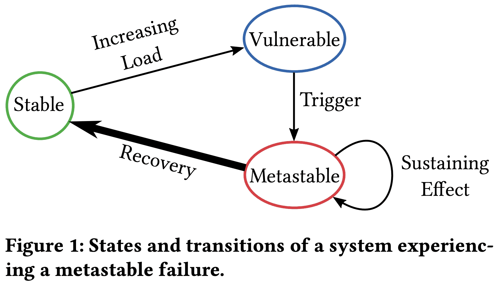
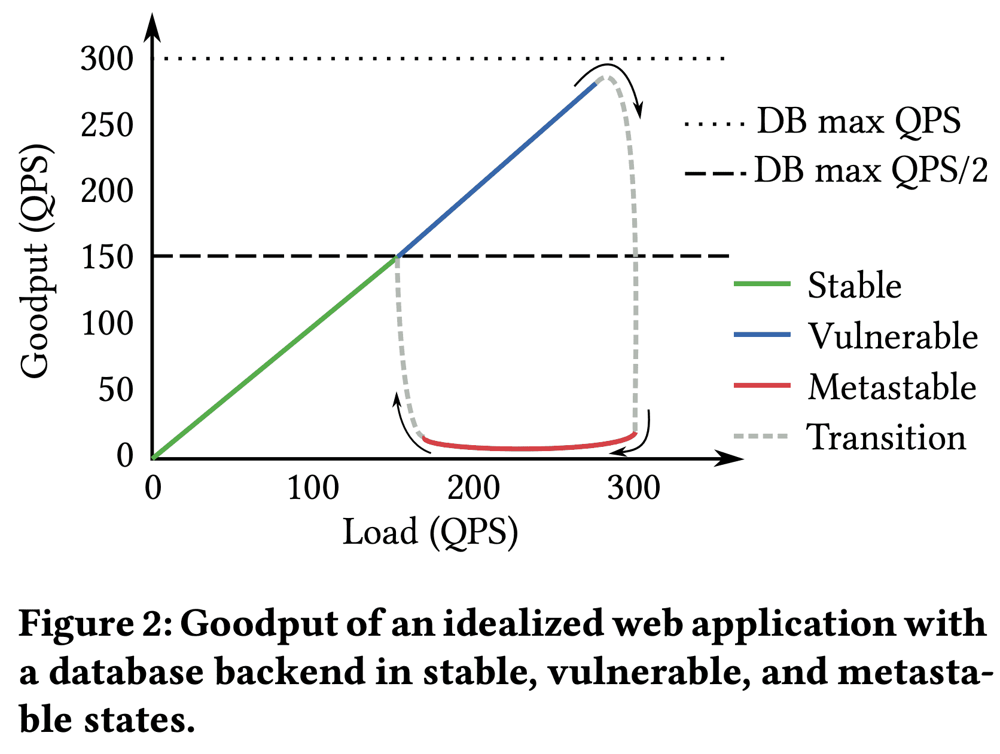
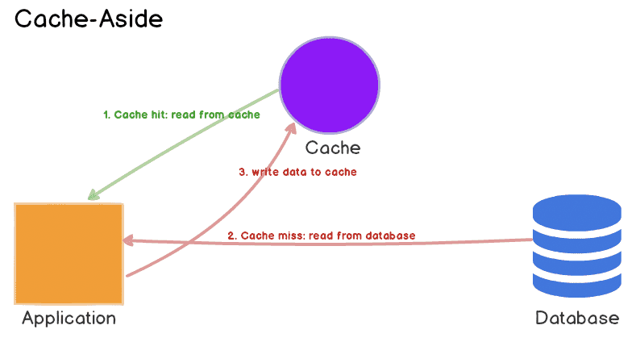
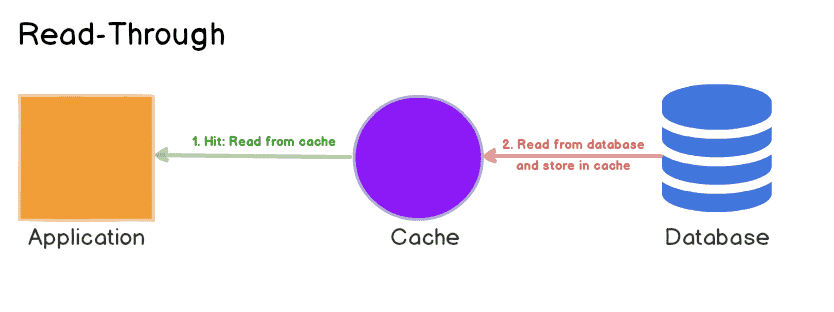

**{{ page.description }}**

# Metastable Failures in Distributed Systems (hotos ‘21)

[youtube](https://www.youtube.com/watch?v=7w47SGaLsSw&list=PLl-7Fg11LUZe_6cCrz6sVvTbE_8SEobNB&index=29)

osdi22 paper [https://www.usenix.org/system/files/osdi22-huang-lexiang.pdf](https://www.usenix.org/system/files/osdi22-huang-lexiang.pdf)

blogs

[https://slack.engineering/slacks-incident-on-2-22-22/](https://slack.engineering/slacks-incident-on-2-22-22/)

[http://charap.co/metastable-failures-in-distributed-systems/](http://charap.co/metastable-failures-in-distributed-systems/)

[https://brooker.co.za/blog/2021/05/24/metastable.html](https://brooker.co.za/blog/2021/05/24/metastable.html)

[https://www.usenix.org/publications/loginonline/metastable-failures-wild](https://www.usenix.org/publications/loginonline/metastable-failures-wild)

[http://charap.co/metastable-failures-in-the-wild/](http://charap.co/metastable-failures-in-the-wild/)

## Abstract

metastable failure는 분산시스템의 failure pattern이다. metastable failure는 balck swan event이다. 과거에 이런 failure가 발생할 가능성이 아에 없는 outlier라서 아주 큰 장애를 일으키고, 예측하는것보다 장애가 난뒤 설명하는것이 훨씬 쉽다 (예측이 너무 어렵다?). metastable failure들은 서로 다르게 보이지만 이 paper에서 같은 framework에서 동작하는것을 보여줄것이다. 또한 framework을 몇년동안 distributed system에서 본 사건들로 적용해보고, known metastable failure에 대해 resilent한 시스템을 만들기 위한 adhoc technique을 만들었다. 여전히 unknown metastable failure는 문제이긴하다.

## 1. Introduction

robustness는 distributed systems에서 중요한 목표이지만 여전히 많은 failure가 발생한다. 10년간 hyperscale distributed system를 운영하면서 겪은 것들을 보며 (어디서본거지..) hardware, config, software bug 등이 아닌 다른 error를 찾았다. 이런 $metastable\ failure$는 몇분에서 몇시간동안 시스템을 failure로 만든다. 아이러니하게도 metastable failure의 원인은 “시스템의 효율성이나 안정성을 향상시키는 feature가 원인”이다.

이 paper에서는 metastable failure pattern을 정의하고, 현실의 예시와 일반적인 metastable fiailure의 특징을 보고, metastability를 대처하기 위한 업계의 practice를 조사하고, systematic하게 metastable failure를 대응하기 위한 방향을 제시한다.

Metastable failure는 특정한 Load롤 system이 bad state에 빠지고 load를 발생시킨 trigger가 사라지더라도 bad state에 계속 남아있는다. 이 때 goodput (유의미한 throughput?)은 아주 낮고, work amplification이나 efficiency가 낮아지는 $sustaining\ effect$로 인해 system이 bad state에서 빠져나오지 못한다. 물리학의 metastability의 정의를 착안하여 이런 bad state를 metastable failure state라고 부르기로 했다. denial-of-service attack, limplock, livelock같이, trigger가 사라지면 바로 해결되는 failure는 metastable인건 아니다. metastable failure에서 벗어나려면 재부팅하거나 load를 엄청나게 줄이는 행동을 해야한다.

States and transitions of a system experiencing a metastable failure.

Metastable failure의 lifecycle은 3개 Phase를 가진다. system은 $stable\ state$에서 시작한다. load가 implicit, invisible하게 특정 threshold를 넘으면 system은 $vulnerable\ state$로 들어간다. vulnerable system은 healthy하지만 어떤 $trigger$로 인해 복구불가능한 metastable state로 빠질 수 있다. vulnerable state는 overloaded state가 아니기때문에 몇개월이나 몇년동안 vulnerable state로 동작하고, 추가적인 load증가없이 metastable failure로 들어간다. **실제로 많은 production system은 stable state보다 vulnerable state가 더 높은 효율성을 가지기때문에 vulnerable state에서 system이 돌아가도록 한다.** 여러 potential trigger중 하나가 system을 metastable state로 빠지게한다. metastable state는 failure에 계속 머무르게하는 $feedback\ loop$라서 아주 강력한 액션을 취하기 전까지는 system이 failure state를 가진다. 대부분 심각한 장애에서 feedback loop은 전염성이 있어 trigger를 받지 않은 system의 다른부분을 failure state로 함께 빠트리게 된다. metastable failure와 관련된 장애는 처음 trigger가 원인일 수 있지만 root cause는 “sustaining effect”이다.

Metastable failure는 hyperscale distributed system에 불균형적인 효과를 불러온다. sustaining effect는 shard, cluster, datacenter까지도 문제가 퍼지도록 만든다. scale이 커짐에따라 feedback loop는 강해지므로(시스템이 복잡하니까?), 엄격한 testing, deployment regime에도 놓칠 수 있다. trigger와 sustaining effect의 차이점으로 인해 정공법을 찾기 힘들고 복구시간이 느려진다. corrective action으로 load를 줄여버리면(5xx를 내버린다던지 등) user experience에 악영향을 준다.

이 paper는 single metastable failure가 큰 임팩트를 주는 distributed system에 포커싱하지만 다른곳에서도 충분히 일어날 수 있다. lock에서 convoy phenomenon은 standalone system에서 생기는 metastable failure이다. distributed system은 fail-stop hardware failure, fail-slow hardware failure, scalability failure, software bug 등의 장애 발생시 reliability를 위한 로직이 많이 들어있다. 하지만 우리 경험상 metastable failure를 인지하고 이해할 수 있는 framework를 제안한건 안보였다. SRE에서 이런 failure와 해결책에 대해 논의하지만 대처법은 특정 failure에 한정되어있다. 더 중요한건 이런 large scale failure에 대한 연구는 acacemia에서 하지 않고있다(인——————정). 이 paper의 목표는 1) metastable failure를 failure의 한 종류로 정의하고, 2) metastable failure의 특징을 분석하고, 3) metastable failure를 식별하고, 막고, 복구하는 방향을 제시하는 것이다.

## 2. Metastable Failure Case Studies

Metastable failure는 다양하게 시작되지만, sustaining effect는 대부분 특정 resource exhaustion과 엮여있다. resource exhaustion과 연관된 feedback loop는 steady state에서 efficiency, reliability를 향상시키기 위해 생긴 feature들이 많다(즉 effieciency, reliability를 향상시키는게 sustaining effect를 일으키게 된다).

이 섹션은 production에서 보인 많은 metastable fiailure중의 대표적인 예시를 간단하게 설명한다. 이런 케이스들은 회고하기는 쉬운데 어느누구도 미리 알아채지 못하고, 해결되기 전 몇년동안 똑같은 이슈가 여러번 반복된것도 있다.

### 2.1 Request Retries

가장 일반적으로 sustaining effect를 만드는 것은 $request\ retries$이다. failed request에 대한 retry는 transient issue를 해결하기 위해 쓰이지만, $work\ amplification$을 일으켜 또다른 failiure를 만들기도 한다.

DB로 쿼리를하는 stateless web app을 생각해보자. DB는 300 QPS 미만일때 100ms 미만의 query latency를 가지지만 높은 Load에서 latency는 몇초를 넘기게 된다. user request는 DB에 쿼리를 날리고, 1초내에 리턴이 오지않으면 retry를 한다. 

280 QPS를 받으면서 web app이 정상동작하고, 10s outage가 app - DB간 network switch에 영향을 준다고 가정해보자. connection이 복구되면 outage동안 손실된 모든 network request는 재전송되고, 여기에는 10초동안에 생긴 retry reqeust도 포함된다. 이렇게 급증한 request는 DB에 overload를 만들어 latency가 늘어나게 된다. high latency에서 client query는 재시도로 560 QPS를 가지게 되어 DB가 복구되지 못하게 한다. 이 상태에서 web app은 모든 DB query가 timeout이 나므로 “goodput”이 거의 없게 되며, metastable failure state로 본다. 이 상태는 load가 급격하게 감소하거나 retry policy를 바꿔야지만 해소할 수 있다.

Goodput of an idealized web application with a database backend in stable, vulnerable, and metastable states.

위 그림은 web app load에 따른 goodput을 보여준다 (x축이 timeline이 아니고 load임!). system은 150QPS 이하에서 stable state이다. stable state에서 trigger는 metastable failure state로 가지 않는다 (retry로 인해 300QPS까지 늘어날 수 있지만, DB가 300QPS까지는 안정적으로 처리가능). 하지만 150QPS가 넘은 vulnerable state에서 trigger로 인해 metastable failure state로 갈 수 있다. metastable state에서 복구하려면 load를 150QPS 미만으로 유지하거나 retry를 20QPS 미만(280QPS였으니)으로 바꿔야한다.

request retry와 비슷한건 $request\ failover$이다. request가 healthy replica로만 라우팅되도록 하는 로직을 생각하면 된다. failover는 request amplifcation이 생기지 않지만, cascading failure를 발생시킨다.

### 2.2 Look-aside Cache

caching 또한 sustained outage를 만들기 쉽고, 특히 look-aside cache가 그렇다. Section 2.1의 예시에서, web app이 db result caching을 위해 memcached같은 look-aside cache를 이용한다고 생각해보자. 문제를 쉽게 생각하기 위해 retry는 없다고 하자. 90%의 hit rate을 가정한ㄷ나면, web app은 3000QPS까지 감당가능하다(2700QPS는 캐싱, 300QPS는 DB). 하지만 300QPS 이상의 load가 생기면 vulerable state이다 (300QPS가 DB로 가버리면 trigger가 되기 때문). vulnerable state에서 cache content가 사라지면 DB는 overload를 받게된다. 또한 web app이 cache를 저장해야할 책임이 있지만 DB timeout으로 fail이 생기므로 cache는 계속 비어있게 된다 (sustaining effect). 따라서 system은 metastable failure state로 들어오게 된다. low cache hit rate은 DB latency를 늘어지게 해서 cache를 채우지 못하게 한다. 따 라  9의% cache hit rate을 잃으면 10배의 query amplication이 발생하게 된다.

### 2.3 Slow Error Handling

metastable failure state는 failure state에서 비효율적인 request processing으로 발생하기도한다. performance-critical app의 success path는 아주 잘 최적화 되어있다. fast path는 RAM access만 필요로 하기도 한다. 반면에 failure path는 쉽게 디버깅할수있도록 되어있다. 즉 stack trace를 찍고(CPU cycle필요), DNS lookup을 통해 client name을 얻고(thread blocking), local disk에 log message를 쓰거나 centralized logging service에 로그를 남기기도 한다.

trigger가 발생하면 fail path로 가는 request 비중이 급격하게 늘어날거고, fail path에 필요한 resource가 부족해지게 되면, error handling은 outage를 더 크게 만들게 된다. 어찌됐건 해결책은 load를 줄이는 것이다.

### 2.4 Link Imbalance

Metastable failure는 여러 implementation들이 연결되는 지점에서 발생하기때문에 쉽게 찾아내기 어려워 문제가 발생한 후에도 원인파악이 힘들 수 있다.

Facebook의 [Solving the Mystery of Link Imbalance: A Metastable Failure State at Scale](https://engineering.fb.com/2014/11/14/production-engineering/solving-the-mystery-of-link-imbalance-a-metastable-failure-state-at-scale/) 가 이런 예시이다. read-through cache server cluster와 db server cluster 사이의 network hop은 aggregated link를 사용한다. aggregated link는 같은 pair switch에 여러 physical cable을 연결하는 식으로 bandwidth를 늘리는건데, TCP connection은 source/dest의 IP/port 기반 hash를 통해 특정한 cable에 deterministic하게 할당된다. connection 수가 많아지면 load는 분산된다.

하지만 이 상황은 모든 traffic이 하나의 link로 할당된다면 vulnerable state로 가게 된다. 한 link는 트래픽을 받기에 충분한 bandwidth를 갖지 못해서 packet loss가 생기고 unavailability가 발생한다. 영향 받은 cluster에 따라 impact는 local에서만 발생할 수도 있고, 시스템 전체로 퍼지기도 한다.

표면적으로 이런 상황은 불가능하다. switch는 hash 기반으로 한 link로 할당되는것이라 특정한 link에 traffic이 가도록 강제할 수 없다. port는 hash function과 무관하게 무작위로 선택되므로 host가 특정 link를 선택할 수도 없다. 하지만 실제로는 congested link의 resource exhaustion가 future request에 영향을 미쳐 더 큰 congestion을 일으키는 상황이 생긴다.

이때 cache server cluster에서 cache miss spike가 생길 수 있다. 각 cache server는 DB connection에 대한 dynamic pool을 가지고 각각은 한번에 한개 query를 실행한다. incoming cache miss는 각각의 connection을 통해 single cache server에서 병렬적으로 single db server로 전달된다. 이건 race를 만드는데, network link중 하나가 congest라면 그 link를 통해 전달되는 query는 마지막에 끝나게 된다. 그리고 connection pool에서 MRU policy는 다음 query에서 가장 최근에 쓰인 connection을 고르려 한다. 따라서 spike는 connection pool에서 highest-latency link가 connection pool에서 더 많이 쓰이게 만든다. concurrent miss 수가 miss spike일때보다 steady state일때 훨씬 낮으니 대부분의 future query는 congested link로 라우팅 될 것이다. 이런 상황은 feedback loop를 만들게 된다. link group중 하나에서 queueing delay가 생기면, 모든 트래픽은 congested link로 가게 되어 overload를 만든다.

이런 metastable failure는 2년이상의 기간동안 원인을 파악하지 못했고 여러번 장애가 발생했다. 이 문제는 표면적으로 보이던 많은 trigger의 진짜 원인인지 파악하지 못하고 장애가 날때마다 단순한 trigger를 고쳐서 장애가 끝났다고 생각했었다. switch를 다른 vendor로 바꾸고 firmware에서 dynamic hash를 적용하는걸 추가하기도 했다. 근본 원인을 해결하려면 stack상의 여러 엔지니어들이 같이 협업해야 했다. network를 interface로 보는 app layer에서는 이 문제를 이해할수 없고 network layer에서도 app을 interface로 바라보니 이해할 수 없다. 이런 metastable failure를 파악하기 너무 어렵지만 고치는건 connection pool policy 한줄만 바꾸면 된다…

## 3. Approaches to Handling Metastability

이 섹션에서 outage를 일으키는 known metastable failure를 막는 방법을 공유할것이다.

### Trigger vs. Root Cause

metastable failure에 대한 root cause는 “trigger”가 아닌, sustaining feedback loop이다. 많은 trigger가 특정한 failure state를 만들수 있어서 sustaining effect를 해결하는것이 미래의 outage를 막을 수 있다.

### Change of Policy during Overload

feedback loop를 없앨(또는 약하게 할) 방법은 overload인 상황에서도 goodput이 높게 유지되도록 하는것이다. overload동안 routing, queueing policy를 변경하는것으로 가능하다. 예를들어 failover/retry를 끄기, [retry budget](https://sre.google/sre-book/addressing-cascading-failures/)(in google SRE book)을 설정하기, LIFO scheduling으로 일부 requet가 deadline이내에 끝나게 하기, internal queue size를 줄이기, overload동안 priority를 강제하여 high prioirty request를 성공시키기, request중 일부를 reject하여 부하를 줄이기, circut breaker pattern 사용하기 등이 있다.

retry나 failover에 대한 결정은 client가 하기 때문에, adaptive policy에서 중요한건 coordination이다. best decision은 client-server의 전체적인 정보로 만들어지지만, 추가적인 통신이 필요해 새로운 sustaining effect를 만들 수 있다.

또한 load spike에서 sustaining effect가 동작하는 지속적인 overload를 정확히 식별하는것도 문제이다. Codel[[Controlling queue delay](https://dl.acm.org/doi/pdf/10.1145/2208917.2209336)] 에서 처럼 server의 internal work queue에선, slinding window에서 minimum queueing latency를 측정하는것이 효과적이라는것은 확인했다. small value는 특정 window에서 queue가 drain되는것을 의미하고, queue가 커져도 spike를 감당할 수 있을 것이다. minimum queueing latency가 전체 window에서 큰값을 가지게 되면, goodput을 높이고 overload에 대한 정보를 response에 담아 리턴하도록 만드는 policy로 전환할 수 있다.

### Prioritization

resource exhaustion에서 efficiency를 유지하는 다른 방법은 priority를 이용하는것이다. 예를들어 Section 2.1의 retry case에서 retried query에 낮은 priority를 준다면 미래의 non-retry인 user query가 우선되어 성공하고 retry가 사라지게되므로 feedback loop를 끊을 수 있다.

이런 priority의 챌린지는 system의 일부 resource에 대해서만 가능하고(victim이 필요), policy가 high work aplification을 만들어 버릴 수도 있는 문제점이 있다 (잘못동작하면 feedback loop을 악화시킬 수 있음). 예를들어 geo-distributed system에서 steady state의 reliability를 높이기 위해 retry, failover를 하는경우 work amplification이 100배 넘게 늘어날 수도 있다. memory, cpu, thread, networking resource까지 보는 end to end priority system이 동작한다해도 일부 request에 의해 victim request가 metastable failure를 만들 수 있다. (즉 실제로 구현하기 너무 까다롭다)

가장 중요한건 모든 architecture가 priority system을 적용할 수 없다는 것이다. Section 2의 look-aside cache에서 metastable state일때 cache를 채우는 것은 client 요청을 처리하는것보다 높은 priority를 가져야 한다. 하지만 look-aside cache에선 강제할 수 없지만 read-through cache에선 가능하다 ([read-through, look-aside cache 차이](https://codeahoy.com/2017/08/11/caching-strategies-and-how-to-choose-the-right-one/)). read-through cache는 db query에 대해 긴 timeout도 처리 가능하다. web app이 request를 끊는다고 해도 cache는 계속 채워질 수 있어 시간이 지나면 hit rate이 올라가며 stable state로 돌아갈 수 있다.

software가 implicit priority를 가진다는 문제도 있다. 예를들어 processing하기 전에 가능한한 많은 request를 deserialize하는 staged processing architecture라면, processing하는 것보다 deserialize하는게 중요해진다 (kafka batch consumer 생각하면 될듯). 하지만 overload가 발생할 때 goodput을 유지하기 위해선 processing이 우선시 되어야 한다.

### Stress Tests

replica에 stress test를 하는건 작은 scale에서 metastable failure를 찾아내는데 유용하다. 하지만 feedback loop의 강도는 scale에따라 달라질 수 있다. small scale test는 large scale에서도 잘 동작할것이라는 confidence를 주지는 못한다. 대체재로 infra에 stress testfmf dnlgo production traffic을 적절히 Rebalancing하고 문제가 생기면 엔지니어가 개입하는 방식을 쓸 수 있다([Kraken OSDI ‘16](https://www.usenix.org/system/files/conference/osdi16/osdi16-veeraraghavan.pdf)). 이런 production stress testing을 지원하기 위한 툴을 만드는건 어려운 작업이지만 한번 적용하게되면 metastable failure가 일어날경우 해당 cluster를 안정적으로 drain할 수 있다.

### Organization Incentives

일반적인 상황에 대해서만 optimization을 하는것 (retry 같은것 말하는건가)은 vulnerable state로 가는 threshold보다 더 높은 multiple을 가지게 되므로 feedback loop를 악화 시킨다 (retry를 2에서 3으로 늘린다면 150에서 100으로 vulnerable state threshold가 내려감). 예를들어 avg db load를 줄이기 위한 cache eviction algorithm은 db resource reclamation을 하는것을 유도한다. 이런방식은 측정하기 쉽지만 cache loss로부터 system이 아에 복구되지 못하는 false economy이다 (ㅋㅋㅋ). 반면에 cold cache miss를 줄이도록 변경하게되면 load가 줄어들지 않으므로 유의미한 최적화가 될 것이다.

### Fast Error Paths

success path 최적화는 널리 쓰이고 있다. 하지만 distributed system에선 error path도 optimized되어야 한다. error handling을 격리하는 pattern으로 failure를 bounded size lock-free queue를 통해 dedicated error logging thread에서 처리하는 방식을 쓸 수 있다. queue overflow가 생기면 error는 counter에만 반영되고 failure가 많이 발생해도 overhead는 더 증가하지 않을것이다. stacktrace도 throttle 할수 있다. 많은 에러가 생길떄엔 sampling을 하는것으로도 충분하다.

### Outlier Hygiene

metastable failure를 조사할때, 같은 root cause가 latency outlier나 cluster error로 ‘먼저’ 나타나는것을 보았다. feedback loop가 문제를 발생시킬만큼 강해지지 않더라도 trigger가 작용할 수 있다. (즉 몇번 워닝울리면 무시하지말고 원인을 좀 파악해라)

### Autoscaling

elastic system은 metastable failure state에 취약하지만 scale up은 vulnerability를 낮춰준다.

## 4. Discussion and Research Directions

*Can you predict the next one of these “metastable failures” rather than explan the last one?*

많은 production system은 efficiency를 위해 vulnerable state로 운영되므로 metastability를 이해하고 adhoc으로 failure를 대처할 수 있는게 중요하다. 따라서 1) system이 efficient하게 돌아가면서도 metastable failure를 피하도록 설계하고, 2) metastable failure가 발생할 수밖에 없다면, 가능한한 빨리 metastable failure에서 복구하는 mechanism을 만들어야 한다. 첫번째는 vulnerable state와 sustaining effect를 일으키는 potential failure를 줄이는 방식이 필요하다. vulnerable state를 찾는것은 시스템에 영향을 미치는 모든 process를 찾아야하기 때문에 어렵다. failure를 예측하는것도 vulnerable state를 잘 식별하고 potential trigger를 예측해야하기 때문에 어렵다. Section 3에 나온 방식들은 work amplication과 sustaining effect를 줄이는데 초점을 맞춘다. 하지만 이런 방식은 failure가 발생한뒤의 대응이고, system간 자동적으로 적용하기는 어렵다.

첫 목표는 failure를 피하는 것을 시도하기이다. 두번째는 clean up이다. 빠르게 failure로부터 복구하고, metastable failure를 식별하고, load를 줄이는 방식을 만드는것이 한 방법이 될 수 있다. 또한 failure state에서 goodput을 높이는건 복구를 빠르게 할 수 있다. failure를 재현하는것은 추가적인 정보를 얻어 문제를 고치는데 도움을 줄 것이다.

*어떻게 metastable failure를 피하는 시스템 디자인을 할 수 있을까? 정확히는 우리가 문제가 생긴 feedback loop를 만드는것을 불가능하게 하거나, 최소한 찾을수라도 있게하는 프레임워크를 만들 수 있을까?* (hot os답다 ㅋㅋ)

### Work Amplification

metastable failure state에서 일반적으로 sustaining effect가 work amplification을 포함한다 (retry같은것). metastable failure 를 피하도록 시스템을 만드려면 work amplifcation이 얼마만큼 크게 생길수 있는지 이해해야한다. 이상적으로는 system이 work amplification에 대한 upper bound를 넣어주는 설계를 할 수 있다.

### Feedback Loops

복잡한 시스템에서 많은 feedback loop가 있지만 일부만 문제를 일으킨다. feedback loop의 강도는 cache hit rate과 같은 constant factor에 의해 좌우된다. 모든 Feedback loop를 제거할 필요 없이 강한 feedback loop를 약하게 만들면 된다.

*기존 시스템에서 vulnerabilty를 정확히 식별할수 있는 방법이 있을까?*

### Characteristic Metric

metastable failure를 분석할때 trigger에 의해 영향을 받고 metastable failure가 해결될떄 정상으로 돌아오는 metric들이 있는데 이걸 charachteristic metric이라 부르고 정상 범주를 크게 벗어나는것이 unsafe dimension으로 보이도록 시각화 해야한다. retry와 look-aside cache에서 db latency와 request timeout이 characteristic metric이다. 위 두개 metric은 request가 급증하면 spike를 치고 network outage를 일으키고 metastable failure가 해결될때까지 복구되지 않을것이다. characteristic metric은 feedback loop의 상태를 직간접적으로 이해하는데 도움을 준다.

production에서 본 characteristic metric은 queueing delay, request latency, load level, working set size, cache hit rate, page fault, swapping, timeout rates, thread counts, lock contention, connection counts 등이다. 우린 system의 characteristic metric과 unknown metastable failure를 찾는 systematic way가 있을거라 생각한다. queueing delay같은 metric은 QPS같은것보다 더 resilient하다.

*metastable failure가 일어날 것인지에 대한 확률을 추정할수있을까?*

### **Warning SIgns**

characteristic metric이 식별되면 safe value의 범위를 식별할 수 있다. 해당 범위를 벗어나면 알람을 만들고 자동화된 개입을 할 수도 있다. 새로운 방법은 아니지만 major outage를 피하는데 유용할 것이다.

### Hidden Capacity

hidden capacity는 stable, vulnerable state사이의 경계이다. stable state에서 trigger가 문제를 일으키지만 trigger가 제거되는 즉시 문제가 해결될 것이다. hidden capacity는 system이 self-healing할 수있는 limit을 의미한다. 반면에 advertised capacity는 system이 vulnerable state에 있을 수 있는 limit을 말한다. hidden capacity는 failure state에 있을때의 resource usage등에 의해 결정되므로 일반적인 상황에서 측정하기는 어렵다. look-aside cache에서 webapp의 advertized capacity는 3000QPS, hidden cacpacity는 300QPS이다. cache server가 죽으면 DB server가 최대 300QPS까지만 정상동작하기 때문이다.

characteristic metric은 실험적으로 hidden capacity를 찾아낼때 쓸 수 있다. stress test를하면서 trigger가 characteristic metric에 spike를 만들고 system이 외부개입없이 stable로 돌아간다면 hidden capacity 밑에 있다고 알 수 있다. 또한 hidden capacity는 metastable state에서 work amplifcation을 측정하는것으로 추정할 수도 있다.

### Trigger Intensity

system의 vulnerable state는 gray하다. feedback loop를 만드는 trigger는 다양하다. 예를들어 retry case에서 system은 299 QPS(advertissed capacity근처)보다 151QPS(hidden capacity근처)일때 더큰 spike가 생기더라도 복구가능할 수 있다. small trigger는 large trigger보다 자주발생할것이므로 trigger size와 chracteristic metric의 관계를 이해할 필요가 있따. distributed system에서 max advertised capaicty 근처에서 시스템을 운영하는건 어렵다. 약한 Triggerd에서도 시스템이 failure를 발생시키기 떄문이다.

*elastic cloud infrastructure를 활용해서 metastable failure를 해결할 수 있을까?*

### Reconfiguration Cost

on-demand로 extra capacity를 쓰게해주는 elastic system은 client load를 줄이는것과 비슷한 효과를 줄 수 있다. 하지만 stateful system이 elasticity를 제공하지 못한다면 reconfiguration이 단기적으로는 capacity를 줄일 수 있을것이다.

*어떻게 실제환경이나 spec 없이도 metastable failure를 모델링하고 재현할 수 있을까?*

Section 2.4에서 metstability의 원인은 abtraction에 의해 찾지 못할수도 있어서 단순한 모델로는 부족하다. distributed system은 ssd io scheduler에서부터 network queue까지 많은 queue로 구성되는데 small scale에서 이런 queue도 줄어들어야한다. 즉 small-scale reproduction은 어렵다.

## 5. Conclusion

common case의 optmization에서 기인하는 Metastable failure는 distributed system에 outage를 일으킨다. metastable failure는 test로 잡을 수 있는 버그가 아니다. 따라서 드물게 발생하지만 아주 큰 영향을 준다. 이 paper가 metastabile failure를 이해하고 unknown metastable failure에서도 robust한 시스템을 만들 수 있기를 바란다.