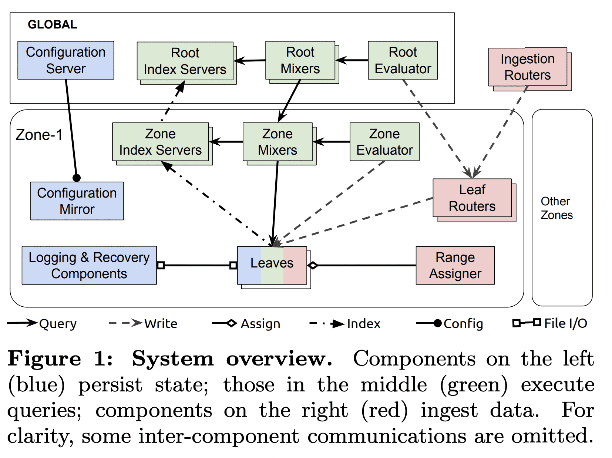
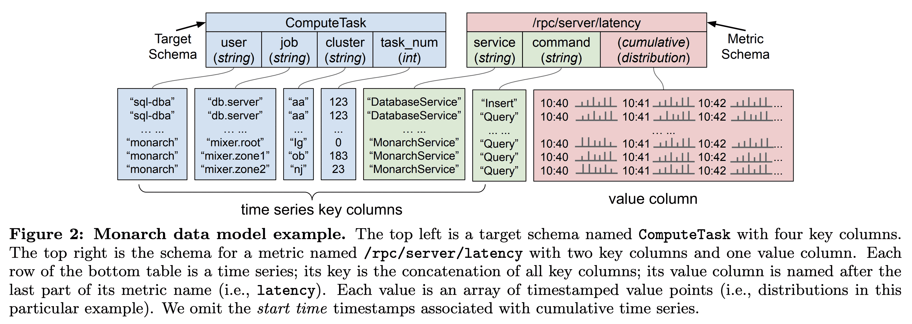
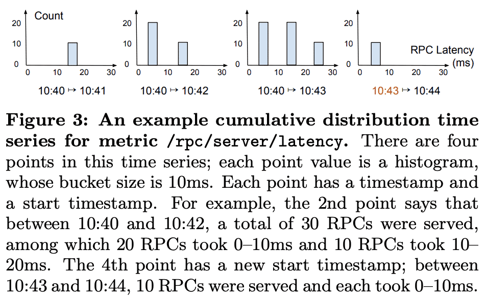
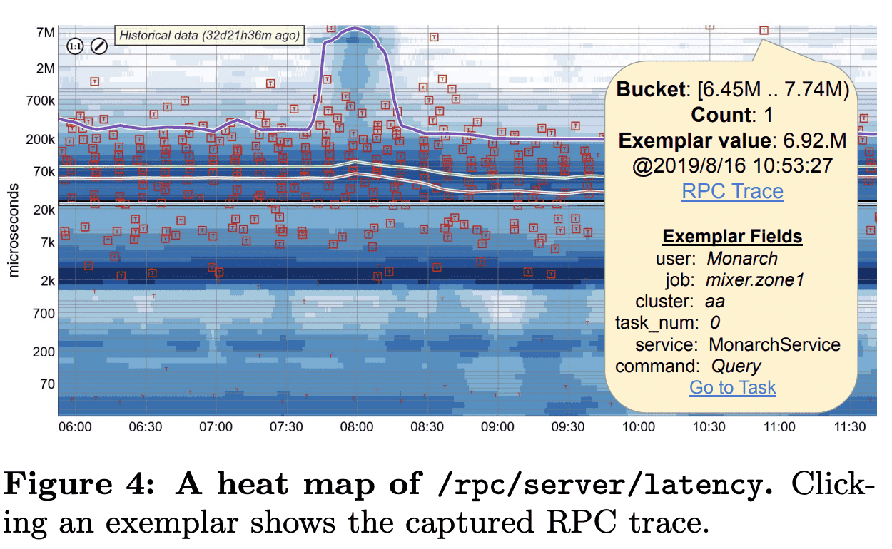
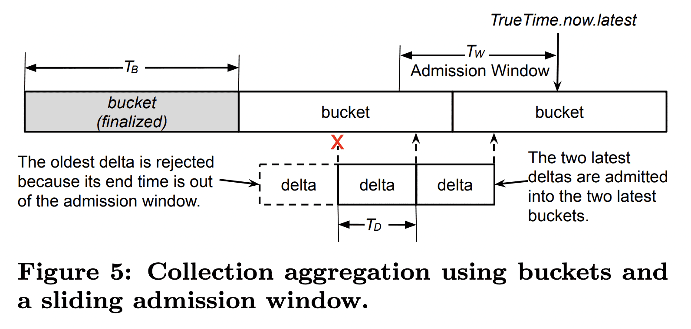
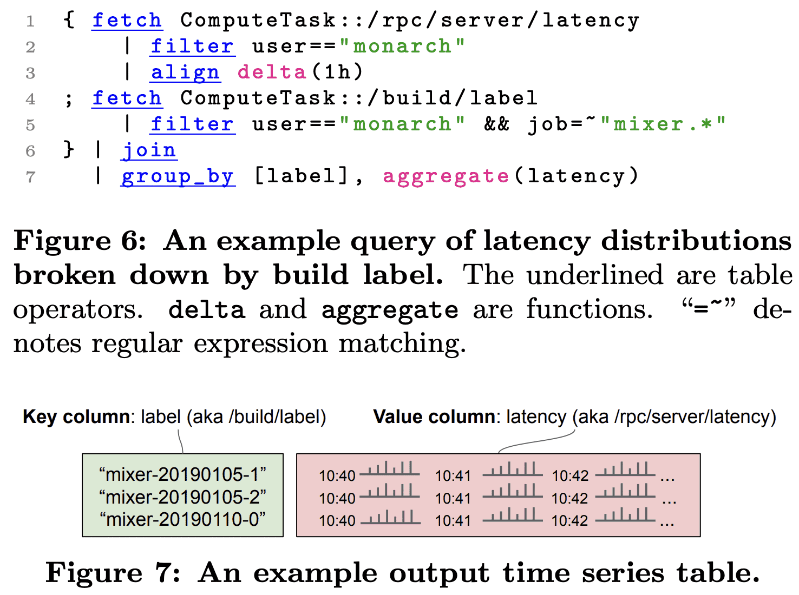

**{{ page.description }}**

# Monarch: Google’s Planet-Scale In-Memory Time Series Database

## 1. Introduction

google은 아주 거대한 computer system monitoring이 필요하다. 수천개의 팀이 user-facing service를 운영하거나(youtube, gmail, google maps등) 이런 서비스에 대한 infra(spanner, borg, f1 등)를 제공한다. 각 팀은 다양한 entity에 대한 모니터링을 해야하며 이런 entity에서 메트릭이 수집되고, time series로 저장되고, query가능해야 한다. 대표적인 usecase는 1) 서비스가 정상적으로 동작하지 않을때를 감지하고 얼럿을 보내기, 2) service state나 healthy에 대한 대시보드, 3) 문제나 서비스상태를 파악하기 위한 adhoc query가 있다.

borgmon은 google에서 internal application, infrastructure를 모니터링하기 위한 첫번째 시스템이었다. borgmon은 사람들이 metric timeseries 컬렉션을 만들고 user들이 각자의 필요성에맞게 쿼리를 할수있도록하여 monitoring, alerting에 대한 혁신을 만들었다. 2004년부터 2014년이 되면서 bormon은 점점 scale up되어가면서 여러 한계를 부딪혔다. 

- borgmon architecture는 각 팀이 직접 borgmon instance를 관리하는 decentralized operational model이라, 충분한 전문성이 없는 많은 팀들에게 큰 운영 부담을 안겼다. 또한 유저들은 이슈를 파악하기 위해 application과 infra 경계를 넘나들면서 monitoring data를 봐야 했다. 따라서 많은 팀들이 각각 borgmon을 운영하는건 불가능하다고 판단했다.
- borgmon이 dimesion과 metric value에 대해 schema를 만들수 없어 query에서 semantic ambiguity가 생기고 분석과정에서 expressiveness에 제약이 생겼다.
- borgmon은 distribution value type(histogram같은)을 지원하지 않았다.
- borgmon을 쓰려면 유저가 여러 bormon instance에서 모니터링 되는 많은 entity를 직접 샤딩해하고 query evaluation tree를 설정해야 한다.

monarch는 2010년부터 운영한 borgmon다음 세대의 large-scale monitoring system이다. monarch는 usecase 확장과 traffic 성장에도 scalable하며 단일 서비스로 모든 팀에게 multi-tenant monitoring을 제공하여 운영부담을 최소화한다. monarch는 복잡한 쿼리를 지원하는 schematized data model을 가지고 distribution-typed time seriese도 지원한다.

## 2. System Overview

monarch는 monitoring, alerting을 위해 설계되었다. 따라서 consistency대신 high availability, partition toelarnce를 중요시한다. spanner처럼 strongly consistent하게 되면 blocking이 일어나는데, monarch는 mean-time-to-detction, mean-time-to-mitigation이 중요하므로 채택할 수 없다. alert을 바로 전달하기 위해 monarch는 timely fashion으로 가장 최근의 데이터를 서빙해야 한다. 즉 monarch는 필요하다면 delayed write을 버리고 partial data를 리턴할 수 있다. network partition에서도 유저의 monitoring, alerting을 지원하되 incomplete/inconsistent한 상태를 알려준다. 또한 monarch는 alerting과정에서 최소한의 dependency를 가져야한다. dependency를 줄이기 위해 monarch는 높은 비용이 들더라도 in-memory에 데이터를 저장한다. Bigtable, Colossus, Sapnner, Blobstore, F1을 포함한 대다수의 google storage system은 monarch를 monitoring을 위해 쓰고있으므로, monarch는 circular dependency를 피하기 위해 alerting path에 저런 storage sysetm이 들어가선 안된다. 따라서 monarch를 timeseries database로 사용하는 non-monitoring application (quota service 등)은 약한 consistency위에서 동작할 수 밖에 없다.

monarch는 global managment, query가 합쳐진 regional zone단위의 local monitoring system이다. local monitoring은 monarch가 data가 수집되는 곳에서 가깝게 data를 유지하게 해주고, 전송 비용, latency, reliability issue를 줄이고, zone 밖의 다른 component와 독립적으로 monitoring을 하게 해준다. global management, query는 전체 system에 대한 unified view를 제공해준다.

각 monarch zone은 strongly network-connected region에 속하는 독립적인 failure domain의 cluster 집합으로 구성된다. zone의 component는 reilability를 위해 여러 cluster에 걸쳐서 replicate된다. monarch는 in-memory로 data를 저장하고 각 hard dependency를 피하므로 한 zone이 다른 zone, global component, storage system등의 일시적인 outage에서도 동작할 수 있게 해준다. Monarch의 global component는 geographically replicate되며, localicty를 위해 closest replica를 이용하여 zone에 속하는 component와 통신한다.

monarch component는 3가지 종류로 구분된다.

**Hoding State**

- Leaves 는 moitoring data를 in-memory time-series store에 저장한다.
- Recovery Logs 는 leave처럼 monitoring data를 받아 long-term time series repository인 disk에 저장한다.
- global configuration server와 zonal mirror는 spanner에 configuration data를 저장한다

D**ata Ingestion**

- Ingestion router는 time series key를 활용해 적절한 monarch zone에 해당하는 leaf router로 data를 전달한다.
- Leaf router 는 zone에 저장될 data를 받고 leaves로 전달한다.
- Range Assigner는 leaves으 로드밸런싱을 위해  leaves에 대한 data 할당을 관리한다.

**Query Exeuction**

- Mixer 는 query를 subquery로 쪼갠다. subquery는 leaves로 전달되어 실행되고, Mixer가 query result를 받아 합친다. Query는 root level(root mixer)가 받거나 zone level (zone mixer)가 받는다.
- Index Servers 는 zone, leaf에 대한 data를 인덱싱하고 distributed query execution에 관여한다.
- Evaluators 는 standing query를 주기적으로 실행시켜 결과를 leaves에 저장한다

## 3. Data Model

Monarch는 schematized table에 timeseries data를 저장한다. 각 table은 여러 time series key인$key\ columns$와, time series의 특정  point인 $value\ column$으로 구성된다. key column은 $fields$라고도하며, $targets,\ metrics$ 라는 두개의 source를 가진다.

### 3.1 Targets

Monarch는 $targets$를 source (monitored) entity와 각 time series를 연관짓는데 사용한다. 예를들어 time series를 생성하는 VM이나 process가 될 수 있다. 각 traget은 monitored entity를 나타내고 target schema에 맞춰진다. Figure 2는 ComputeTask라는 target schema인데, 각 ComputeTask target은 Borg cluster의 running task를 `user, job, cluster, task_num` 으로 식별하게 해준다.

Monarch는 locality를 위해 data가 생성되는 곳과 가까운곳에 data를 저장한다. 각 target schema는 $location$이라는 한개의 field를 가진다. location field의 값은 timeseries가 저장되는 특정한 Monarch zone을 가진다. 예를들어 ComputeTask의 location field는 `cluster` 이다. 각 borg cluster는 가까운 한개의 Monarch zone과 매핑된다. 또한 location field는 쿼리 최적화를 위해 쓰인다 (Section 5.3).

각 zone에서 Monarch는 같은 target에 대한 timeseries data가 같은 entity를 가지고 같이 쿼리될 가능성이 높기 때문에 같은 leaf에 저장한다. 또한 tagets을 겹치지 않는 target range $[S_{start},S_{end})$로 쪼갠다. $S_{start},S_{end}$는 각각 **target string** 의 시작, 종료 string이다. target string은 target schema의 필드 순서에따라 schema name과 각각의 field value를 이어붙인다. Figure 2에서 target string `ComputeTask::sql-dba::db.server::aa::123` 가 한 borg task를 나타낸다. Target range는 lexicographic sharding이나 leaves간 load balancing에 사용해서 query에서 인접한 target에 대해 효율적인 aggregation을 하도록 도와준다 (Section 5.3).

### 3.2 Metrics

metric은 task가 서빙한 RPC 수나 VM의 memory util등등을 측정한다. target과 비슷하게 $metric\ schema$가 있어 time series value type과 metric field들을 정의한다. Metric은 file처럼 네이밍된다. Figure 2에서 서버의 RCP latency는 `/rpc/server/latency` 로 네이밍된다. `service, command` 라는 metric fields를 통해 RPC를 구분한다.

value type은 `boolean, int64, double, string, distribution, tuple` 이 가능하다. disttribution은 많은 수의 double value를 컴팩트하게 표현한다. distribution은 여러 double values를 $buckets$이라는 subset으로 쪼개어 mean, count, stddev 같은 통계로 summarize하는 historgram도 포함된다. bucket boundary는 data granularity와 storage cost사이의 trade-off를 조절할 수 있도록 직접 설정가능한 옵션이다. 

위 그림은 `/rpc/server/latency` 의 distribution-typed time series 예시이다(fixed bucket size는 10ms).  time series의 distribution-typed point는 여러 bucket boundary를 가질 수 있다. 다른 bucket boundary까지 걸쳐지는 쿼리에서 interpolation을 해서 쓴다. distribution은 많은 양의 sample을 summarize하는데 효과적이다. mean latency만으로 충분하지 않기때문에 99th, 99.9th percentile같은 stat도 필요하다. 따라서 histogram type을 지원하는건 무조건 필요했다.

**Examplars.**

한 distribution의 각 bucekt은 해당 bucket에 대한 value examplar를 포함할 수 있다. `/prc/server/latency` RPC metric의 examplar는 [Dapper](https://storage.googleapis.com/pub-tools-public-publication-data/pdf/36356.pdf) RPC Trace를 넣어 high RPC latency를 디버깅할때 유용하다. 또한 examplar에 해당하는 target, metric field value를 포함한다. 이 정보는 aggregation에서도 유지되어 유저가 쉽게 outlier examplar를 통해 문제가 생긴 task를 식별 할 수 있다. Figure 4는 distribution-typed time series의 heat map과 slow RPC의 examplar를 보여준다.

**Metric Types.**

metric 은 gauge이거나 cumulative이다. gauge time series의 각 point는 queue lenth같이 해당 timestamp에 대한  순간적인 측정이다. cumulative time series는 start time 에서부터 해당 timestamp까지의 accumulation이다. 예를들어 Figure 3의 `/rpc/server/latency` 는 cumulative metric인데, 각 point는 start time에서부터 모든 RPC의 latency distribution이다. cumulative metric은 각 point가 같은 start time을 가지는 이전 point에 대한 모든 데이터가 반영되어있으므로, 일부 point가 사라져도 robust하다는 이점이 있고, distributed system에서 job scheduling이 매우 빈번하므로 data point가 restart동안 사라지는게 일반적인데 이런 문제점에서도 사용하기 좋다.

## 4. Scalable Collection

Monarch는 real time으로 많은 양의 time series data를 ingest하기 위해 2 level divide-and-concquer와 collection을 할때 data aggregation을 통한 최적화를 한다.

### 4.1 Data Collection Overview

Figure 1의 빨강색 부분이 collection path이다. ingestion router, leaf router는 2 level divide-and-conquer를 수행한다. $ingestion\ router$는 $location\ fields$에 따라 time series data를 zone으로 보낸다. $leaf\ router$는 $range\ assginer$에 따라 data를 leaves로 분산시킨다. 

— Section 3에서 말한것처럼 각 time series가 target과 연관되고, target fields중 하나가 location field을 생각ㅎ

time series data는 아래와 같은 step으로 흘러간다.

1. client는 인접한 ingestion router중 하나에 data를 전송한다. ingestion router는 모든 cluster에 존재한다. client는 Monarch의 instrumentation libarry를 사용하여 retention policy를 맞추는데 필요한 적절한 frequency로 data를 쓴다 (Section 6.2.2)
2. ingestion router는 target의 location field 값에 따라 destination zone을 찾고 해당 zone의 leaf router로 data를 forward한다. location-to-zone mapping은 ingestion router의 config에 정의되며 dynamic하게 업데이트가능하다.
3. leaf router는 data를 target range를 저장하는 leaves로 forward한다. 각 zone에서 time series는 target string에 따라 lexicographical sharding된다. 각 leaf router는 지속적으로 업데이트되는 $range\ map$을 유지한다. $range\ map$은 target range에 대해 3개의 leaf replica를 매핑한다. leaf router는 range assigner 대신 $range\ map$에서 업데이트를 가져온다. 또한 target ranges는 전체 string을 겹쳐서 커버한다. 새 target은 range assigner의 개입 없이 자동적으로 선택되므로, range assigner에서 transient failure가 생겨도 data collection에는 문제 없다.
4. 각 leaf는 data를 in-memory로 저장하고 recover log를 write한다. in-memory time series는 1) timestamp를 효율적으로 인코딩하고 같은 target에 대한 time series의 timestamp sqeuence를 공유하고, 2) distribution과 tuple같은 복잡한 type의 time series value에 delta, run-length encoding을 하고, 3) 빠른 read, write, snapshot을 지원하고, 4) query를 처리하거나 target range가 바뀌는동안에도 계속 data를 저장하고, 5) memory의 fragmentation, allocation churn을 최소화한다. CPU와 memory를 적절하게 사용하기 위해 in-memory store는 위의 timestamp sharing, delta encoding같은 간단한 압축만 수행한다. timestamp sequence는 일반적으로 10개의 time series에서 공유되므로 timestamp sharing은 효율적이다.

leaves는 range당 $recovery\ logs$를 write할때 ack를 기다리지 않는다. leaves는 log를 colossus에 저장하고 log healthy를 독립적으로 판단해서 failover를 수행한다. 하지만 Monarch는 모든 colossus instacne가 unavailable하더라도 동작해야 하므로 log에 쓰는것이 최선이다(뭔말..). recovery log는 background process에서 fast read를 위해 compaction하고(leaves가 log를 쓸때는 write-optimized이다), long-term repository에 합친다. 모든 log file은 availability를 위해 async로 replicate한다.

leaves의 data collection은 query fanout을 제한하기 위해 사용되는 zone/root index server가 업데이트 되도록 트리거한다 (Section 5.4).

### 4.2 Intra-zone Load Balancing

zone에서 lexicographic sharding은 taget schema의 key columns만 사용하고 metric schema의 key columns는 사용하지 않는다. 이건 ingestion fanout을 줄여주게 되는데, 한개 write message에서 target은 수백개의 metric에 대해 한 time series point를 전달할 수 있어서, target에 대한 모든 time series(수백개의 metric?)를 가지는것은 write를 하는것이 3개의 leaf replica만 있으면 된다. 이건 leaf node를 추가하는것만으로도 zone이 horizontal scale-out을 가능하게 해주고, 대부분의 쿼리들이 작은 수의 leaf nodes만 접근하게 해준다. 또한 query path에서 일반적으로 사용되는 intra-target join은 leaf-level로 push down되어 query가 더 빠르게 동작할 수 있다.

Monarch는 유저에게 heterogeneous replication policy(1개에서 3개 replica)를 제공해서 유저는 availability와 storage cost의 trade off에서 선택할 수 있다. 각 traget range의 replica는 같은 boundary를 가지지만 data size와 cpu load는 다를 수 있다. 한 유저는 첫 replica에만 finer time granularity를 유지하고, 다른 유저는 3개의 replica에 coarse granularity를 유지한다면 data size, cpu load는 달라진다. 따라서 range assginer는 각 target range replica를 개별적으로 할당시킨다. 당연히 leaf는 한 range에 대해 여러 replica로 할당되진 않는다. 일반적으로 Monarch zone은 여러 failiure domain에 leaves를 두고, assigner는 여러 failure domain에 걸쳐 replica들을 할당한다.

Range assigner는 [Slicer](https://www.usenix.org/system/files/conference/osdi16/osdi16-adya.pdf)와 비슷한 방식으로 load balancing을 수행한다. 각 zone에서 range assginer는 cpu, memory load에 대처하기 위해 target range를 쪼개거나, 합치거나, 옮기는 작업을 한다. range assignment가 바뀔때 data collection은 recovery log를 이용하여 seamless하게 동작한다. 예를들어 range assigner가 source leaf에서 load를 줄이기 위해 $R$이라는 range를 옮길때 아래와 같은 일이 일어난다.

1. range assigner는 load가 낮은 destination leaf를 선택하고 $R$을 destination leaf에 할당한다. destination leaf는 leaf router에게 $R$의 assign이 바뀌는것을 알려주어 $R$의 data를 수집하여 time series data를 저장하고 recovery log를 쓴다.
2. source leaf에 의해 data가 log를 쓴지 1초 뒤에(ack를 안받으니 1초를 기다림), destination leaf는 $R$에 대한 old data 복구를 시작한다. 복구는 최신데이터부터 과거순으로 진행한다.
3. destination leaf가 $R$의 데이터를 모두 복구하면 range assigner에게 알리고, range assigner는 $R$에서 source leaf를 unassign한다. source leaf는 $R$에 대한 수집을 멈추고 in-memory에서 data를 제거한다.

이를 통해 source, destination leves는 같은 data를 동시에 수집,저장,로깅한다. 이건 range assigner가 아닌 leaves의 job이 range assignment에 대해 leaf router를 최신상태로 유지시킨다. 그 이유는 1) leaves는 data가 저장되는 source of thruth이고, 2) transient range assigner failure를 감내할 수 있기 때문이다.

### 4.3 Collection Aggregation

일부 monitoring scenario에서 time series data를 client가 원하는대로 정확히 저장하는 것이 많은 비용이 생길 수 있다. 수백만개의 disk server의 disk IO를 모니터링 할때 각 IO operation은 수만명의 유저중 한명이 수행한다. 즉 수백억개의 time series를 만들어 단순하게 저장하는건 매우 비싸진다. 하지만 클러스터의 모든 disk server에 걸쳐 유저단위 IO operation으로 aggregation할 수 있다. $Collection\ aggregation$은 data ingestion에서 생기는 위와같은 문제를 해결해준다

**Delta time series.**

일반적으로 client가 missing point가 허용되는 cumulative time series를 사용하는것을 추천한다. 하지만 다양한 start time 기준의 cumulative value를 aggregation하면 의미가 없어진다. 따라서 collection aggregation은 인접한 cumulative point간 $delta$를 write하기 위해 original target을 필요로한다. 예를들어 각 disk server는 $T_D$초마다 최근 $T_D$초간 생긴 per-user IO operation count를 write한다. $leaf\ routers$는 write를 받고 user에 대한 모든 write를 같은 leaf replica로 forward한다. $delta$는 client나 leaf router에서 pre-aggregate 될 수 있고, leaves에서 final aggregation을 수행한다.

**Bucketing.**

collection aggregation동안 leaves는 Figure 5처럼 delta의 end time에 따라 deltas를 연속적인 time bucket에 넣는다. bucket length $T_B$는 output time series의 주기이고 client가 설정할 수 있다. bucket boundary는 load-smearing을 위해 output time series와 독립적으로 align된다. 각 bucket의 deltas는 user가 선택한 reducer에 따라 한 point로 aggregate된다. 예를들어 disk IO는 $sum$ reducer로 모든 disk server에서 한 user가 발생한 IO 횟수를 더한다.

**Admission window.**

각 leaf는 sliding admission window를 유지해서 window length $T_W$보다 이전의 delta는 reject한다. 따라서 older bucket은 immutable해지고 delta/run-length encoding을 통해 효율적으로 저장될 수 있는 finalized point를 생성한다. 또한 admission window는 Monarch가 network congestion에서 빠르게 복구할 수 있게 해준다. 그렇지 않으면 leaves가 traffic으로 인해 최근 data를 받지 못할 수 있고 중요 alert을 보내지 못할 수 있다. 실제로 rejected write은 전체 traffic에서 극히 일부이다. bucket의 end time이 admission window를 넘어가면 bucket은 finalize되어 aggregated point가 in-meory store와 recovery log로 만들어진다.

또한 clock skew를 처리하기 위해 TrueTime을 사용한다. ingestion traffic volume과 time series accuracy의 trade off를 위해 delta period $T_D$는 10초로 설정한다. admission window의 길이는 다음처럼 결정된다.

$T_W=T_D+TT.now.latest-TT.now.earlist$

bucket length $T_B$는 $[1s, 60s]$로 client가 설정한다. bucket finalization을 하려면 $T_B +T_W$만큼의 시간이 필요해서 recovery log는 일반적으로 최대 70s($T_B$가 60s일경우)까지 기다린다. range movement동안 $T_B$의 값이 70s면 load balancing이 너무 길어지므로, 잠시동안 1s로 변경한다.

## 5. Scalable Queries

### 5.1 Query Language

위의 Figure 6의 query는 Figure 7의 결과를 뱉는다. build label(binary version)에 따라 task들의 RPC latency distribution에 대한 쿼리이다. 이 쿼리는 high RPC latency를 만드는 abnormal release를 감지하기 위한 것이다.

Line 1의 `fetch` 는  Figure 2의 time series table을 읽는다. Line4의 `fetch`는 time series value가 특정 target에 대한 build label string을 가지며, Line1의 테이블과 동일한 target schema, metric을 가지는 table을 읽는다. `filter` 는 predicate의 역할이다. Line 2는 `user` field에 대한 equality field predicate이고, Line 5처럼 여러 predicate을 엮을수도 있다. 

`align` 은 같은 start time에서 시작해서 동일한 일정한 간격으로 timestamp를 가지는 table을 생성한다. `delta` window operation은 aligned output point와 1시간 이전 point 동안의 latency distribution을 계산한다. aligned input은 `join, group_by` 같이 time series를 합치는 operation에서 중요하다. `align`은 (다음 테이블인) /build/label 에 대해 필요한경우 자동으로 적용된다.

`join` 은 table들을 key column으로 inner join을 해서 2개의 value point(latency distribution과 build label)을 가지도록 한다. output은 두개의 input time series와 매칭되는 common key column들이다. inner join뿐만아니라 left, right, full outer join도 된다.

`group_by` 는 `label` column만 가지도록 하고 `latency` 기준으로 aggregate한다.

Figure 6같은 쿼리 뿐만 아니라, top n time series나, 다른 time series들에 대한 aggregation, schema나 key/value column에 대한 remapping, union 등등의 기능을 제공한다.

### 5.2 Query Execution Overview

쿼리는 $ad\ hoc, stading$ 으로 나뉘어진다. adhoc query는 user가 실행하고, standing query는 주기적으로 meterialized view를 만들어 다시 monarch로 저장된다. 유저들은 미리 materialization을 통한 빠른 쿼리나 비용을 절감하거나, alert을 만들기 위해 standing query를 사용한다. standing query는 regional zone evaluator나 global root evaluator가 evaluate한다. zone evaluator를 쓸지, root evaluator를 쓸지는, query를 정적분석 결과와 query가 사용하는 table schema를 같이 고려한다. 대부분 standing query는 zone evaluator가 수행하고, query를 zone mixer로 보낸다음 결과를 해당 zone에 저장한다. 이런 query는 network partition에도 resilient하다. zone/root evaluator는 standing query hash로 샤딩되어 수백만개의 standing query도 처리가능하다.

**Query tree**
global query는 3 level의 hierarchy를 거친다. $root\ mixer$는 query를 받고 $zone\ mixer$들로 전달하고, 각 $zone\ mixer$는 zone의 $leaf$들로 fan out한다. zonal standing query는 바로 zone mixers로 간다. fanout을 줄이기 위해 root mixers와 zone mixers는 query와 잠재적으로 $relevant$한 subset(query subset?)에 대해  $index\ servers$를 참조한다(그래서 index server가 어떤 일을?). leaf와 zone은 field hint index가 query와 연관된 data를 가지고 있다면 $relevant$하다고 판단한다.

**Level analysis**
node가 query를 받을 때, 각 query opertion이 수행되는 level을 결정하고 lower level에서 실행되는 부분은 전달한다. 또한 execution tree의 root에서는 security, access control check을 수행하고, static optimization을 위한 query rewrite도 한다. query가 실행될때는 lower-level node는 output time series를 higher level node로 전달하고 higher level node는 결과를 합친다. higher level node는 child의 network latency를 고려하여 buffer space를 할당하고 [token-based flow control algorithm](http://nns.cs.tsinghua.edu.cn/paper/eurosys16_jz.pdf)을 통해 streaming rate을 조절한다.

**Replica resolution**
data replication이 configurable가능하므로 replica는 서로 다른 duration, frequency로 data를 가지게 된다. 또한 target range가 변경되므로 일부 replica는 recovery상태에 incomplete data를 가질 수 있다. time bounds, density, completeness관점에서 가장 높은 퀄리티의 data를 가진 leaf를 선택하기 위해, zonal query는 data를 처리하기 전에 replica resolution process를 시행한다. 관련 leaf들은 matched target과 quality summary를 리턴하고, zone mixer는 target range로 샤딩하고, quality를 바탕으로 각 range에 맞는 single leaf를 선택한다. 그 다음 각 leaf는 할당된 target range에 대해 table operation을 evaluate한다. range assigner가 target 정보를 가지고 있지만, replica resultion은 각 leaf에서만 수행된다. 따라서 range assigner의 dependency가 없고, overloading을 피한다. query를 처리하는동안 leaf에서 range movement나 retention expirration으로 인해 일부 data는 제거될 수 있는데 이를 막기 위해 leaf는 query가 끝날때까지 input data에 대한 snapshot을 만들어둔다.

**User isolation**
Monarch는 shared service로 운영된다. query가 실행되는 node의 resource도 서로 다른 유저들이 실행한 query들이 공유한다. user isolation을 위해서 query가 사용하는 memory를 트래킹하고 너무 많은 memory를 쓰면 cancel시킨다.  query thread는 per-user cgroup으로 들어가며 각각은 같은 cpu time을 받게 된다.

### 5.3 Query Pushdown

Monarch는 가능한한 source data와 가깝게 query를 pushdown한다. pushdown은 schema definition을 이용해 query operation을 완료시킬 수 있는 level을 결정한다. 이 level의 각 node는 해당 operation에 대한 disjoint한 output time series subset을 제공한다. 이건 그 다음 query operation이 해당 level에서 수행될 수 있게 해준다. query pushdown은 evaluation이 lower level에서 진행되어 더 많은 concurrecny를 얻고, lower level의 aggregation을 통해 higher level node가 받는 data의 크기가 줄어들게 되므로, query latency를 줄이고 query evaluation에 대한 scale을 높여준다.

**Pushdown to zone**
data는 location target field의 value에 따라 zone으로 route된다. 즉 특정 location에대한 data는 한 zone에만 조냊한다. output time series가 single zone의 input time series들로 생성가능하다면 operation은 zone level에서 완료된다. 예를들어 location field를 가지는 output time series keys에 대한`group_by` 와 공통된 location field를 가지는 두 input에 대한 `join` 은 zone level에서 완료된다. 따라서  1) 일부 input data가 regionless zone(location field가 없음) 이거나, 2) 다른 zone에서 top n operation 을 수행하거나 input time series에서 location field를 떨군것처럼 zone간 data 집계가 필요한 경우에만 root evaluator가 standing query를 실행하게 된다. 실제로 standing query의 95% 는 zone level에서 수행되어 network partition에 tolerant하다. 또한 cross region write도 피해서 latency도 줄여준다.

**Pushdown to leaf**
Section 4.2에서 말한것처럼 data는 target range에 따라 leaf들로 샤딩된다. 따라서 leaf는 target에 대한 data를 전부 가지거나, 가지지 않으므로 target에 대한 operation은 leaf level에서 완료될 수 있다. 예를들어 모든 target field를 가지고 있는 `group_by` 와 input으로 모든 target field를 가지는 `join` 은 leaf level에서 완료된다. Intra-target join은 monitoring workload에서 일반적이다. Figure 6의 query에서 `join`은 leaf에서 완료되고 `/build/label` 은 새 binary version이 생길떄만 바뀌므로 target의 metadata(또는 property)로 간주된다. 또한 target range는 consecutive target을 가지므로, leaf는 일반적으로 query가 가져가려 하는 여러 target을 가지고 있게 된다. aggregation은 leaf level에서 전부다 끝낼수 없다 해도 가능하다면 pushdown된다. leaf는 co-located target들의 time series를 aggregate하고 결과를 mixer로 전달한다.  예시 query의`group_by` 는 3개 level 전부 다에서 수행된다. 얼마나 많은 input time series가 있던지 관계없이 node는 각 group에서 한 time series만을 뱉는다 (이 예시에서 한 time series는 build label이다).

**Fixed Fields**
일부 field는 query나 schema에 대한 static analysis를 통해 constant로 바뀔 수 있으며 더 많은 query가 pushdown된다. 예를들어 특정 cluster에 대한 time series를 뽑을때 global aggregation은 input time series가 한 zone에서만 저장되므로 zone level에서 완료된다.

### 5.4 Field Hint Index

Monarch는 scalability를 위해 query에 대해 input data를 가지고 있지 않은 children을 skip해서, children으로 가는 query fanout을 줄일 수 있도록, index server에 저장되는 FHI(Field Hint Index)를 사용한다. FHI는 모든 children의 time series field value에대해 지속적으로 업데이트되는 index이다. FHI는 query의 field predicate을 분석하여 무관한 children을 skip하고, field value를 iterate하지않고 regex predicate으로 효율적으로 처리한다. FHI는 memory에 들어가게 작은 size를 유지하면서 10억개의 time series key와 1만개 이상의 leaf에서도 동작한다. FHI는 Bloom Filter이므로 False Positive가 존재한다. 즉 FHI는 무관한 children을 리턴할 수 있다. FP는 무관한 children이 추후에 replica resolution을 통해 무시되므로 correctness에 영향을 미치지 않는다

field hint의 대다수는 trigram이다. `monarch` 가 있을때 trigram은 `^^m, ^mo, mon, ona, nar, arc, rch, ch$, h$$` 가 생성된다. field hint index는 field hint의 fingerprint로 hint를 포함하는 subset을 찾을 수 있는 multimap으로 구현되어있다. fingerprint는 input hint(schema name, field name, trigram) 로부터 생성된 int64값이며 deterministic하다.

query가 pushdown될때 root(or zone) mixer는 query에서 field hints를 뽑아 destination zone(or leaf)에 대한 root(or zone) FHI에서 조회한다. Figure 6의 query에서 `mixer.*` predicate은 `^^m, ^mi, mix, ixe, xer` 이 된다. predicate과 매칭되는 children은 무조건 이 trigram을 가지고 있을것이므로 `FHI[^^m] && FHI[^mi] && FHI[mix] && FHI[ixe] && FHI[xer]` 인 children만 query가 날아간다.

Monarch는 secondary stroage system에 장애가 났을때에도 FHI size가 memory에 들어가므로 계속 동작할 수 있다. 또한 in-memory로 빠른 update, lookup도 가능하다. 하지만 작은 index size로 accuracy는 낮아진다. FHI는 짧은 string인 trigram만 저장해서 unique hint 수를 줄였다 (lower case letter만 사용한다면 $26^3$개의 uniqe trigram만 존재). Figure 6 query에서 `mixixer` 라는 target job도 relevant하다고 판단하게 된다(false positive). 또한 FHI는 각 field를 독립적으로 처리해서 여러 field에 대한 prediciate이 들어있는 query가 false positive가 생긴다. `user:monarch, job:leaf` 와 `user:foo, mixer.root` 는 `user=='monarch' && job=~'mixer.*'`  predicate에서 매칭된다. (&&이더라도 매칭됨).

FHI가 작은 크기이지만 (몇GB이내), zone level query의 fanout을 99.5% 줄이고, root level은 80%만큼 줄이게된다. 또한 아래와같은 feature가 들어있다.

1. trigram indexing은 FHI가 regexp-based field predicate을 쓸수있게 해준다. Monarch는 regexp predicate을 매칭하기 위해 FHI의 trigram을 lookup하고 식을 evaulate하기만 하면 된다.
2. FHI는 다른 excerpt를 사용해 index accuracy와 size의 tradeoff를 조정할수있다. 예를들어 ISBN같은 small character set을 가진 string field는 fourgram이나 string 전체도 추가할수 있다.
3. Monarch는 static analysis와 FHI를 합쳐서 join query의 fanout을 줄인다. Figure 6 query에서 2개 filter predicate이 모두 만족하는 leaf에게만 query가 전달된다. 이 방식은 nested join에도 적용되었다.
4. metric name도 full string으로 indexing되고 `:metric` field의 값으로 처리된다. 따라서 FHI는 field predicate 없이도 fanout을 줄여준다

Figure 1에서 FHI는 index server가 bottom-up으로 빌드한다. FHI size는 작으므로 persistent하게 저장할 필요가 없고 index server가 시작할때 live leaf로부터 받아온다. zone index server는 long-lived streaming RPC를 통해 zone의 모든 leaf의 FHI update를 받는다. root index server도 비슷하게 모든 zone으로 부터 root가 필요로하는 FHI update를 받는다. field hint update는 network에서 높은 우선순위를 가져서, root FHI에 반영되지 않은 update는 zone의 unavailbility에 대한 indicator가 된다.

**Similar Index Within Each Leaf**
FHI는 index server에 저장되어 query가 연관된 leaf로 가게 만들어준다. 각 leaf에서도 leaf가 소유한 많은 target에서 연관된 target을 찾아가도록 해주는 index가 있다. 전체 과정을 요약하자면 query는 root에서 시작해서 root level FHI를 통해 연관된 zone으로 가고, zone level FHI를 통해 연관된 leaf로 가고, leaf level FHI를 통해 연괸돤 target을 찾게된다.

### 5.5 Reliable Queries

Monarch는 monitoring system이므로 failure를 잘 처리해야 한다. 이전 내용에서 이미 Monarch zone이 file system이나 global component failure에서도 잘 동작하는것은 설명했다. 여기선 zone, leaf level failure에서도 resilent query serving에 대한 이야기를 할 것이다.

**Zone Pruning**
global의 관점에서 global query는 regional failure에서도 동작해야된다. 시스템을 운영하는동안 대부분(99.998%)의 query가 query deadline의 절반 시간 이내에서 query result를 streaming했다. 따라서 queried zone의 health를 확인하기 위해 더 짧은 $soft\ query\ deadline$을 설정했다. zone은 soft query deadline이 지나도 응답이 없으면 pruning된다. 따라서 일부 zone에서 낮은 availability를 가질때 query latency가 늘어나지 않게 된다. 또한 유저들은 query result에서 pruned zone이 있음을 인지할수 있어 accuracy의 영향을 알 수 있게 된다.

**Hedged Reads**
zone에서 single query는 여전히 10000개 이상의 leaf로 fanout될 수 있다. query가 slow leaf node에서도 잘 동작하기 위해 Monarch는 faster replica에서 data를 읽는다. leaf에서 모든 target에 걸쳐 집계하는 operation을 pushdown할때 leaf간 output data equivalence는 없다(뭔말..). leaf들이 같은 output time series keys를 리턴할때 다른 input data에서 aggregation을 했을 수 있으므로 단순한 hedged read는 동작하지 않는다.

Monarch는 query path에서 input data에 대한 equivalence를 만든다. zone mixer는 replica resolution동안 각 target range에 대한 query를 실행해 줄 leaf를 선택(primary leaf)한다. 또한 각 primary leaf와 target range가 겹치는 fallback leaf도 설정해둔다. zone mixer가 primary leaf들에게서 data를 읽을때 latency를 측정하고, primary leaf가 느리다고 판단되면 zone mixer는 fallback leaf로 query를 전달한다. query는 primary, fallback leaf에서 동시에 실행되고 zone mixer는 더 빨리 도착한 result를 사용한다.

## 6. Configuration Management

Monarch가 distributed, multi-tenent service이므로 user들이 편하면서 fine-grained control이 가능한 centralized configuration management system이 필요하다.

### 6.1 Configuration Distribution

모든 config modification은 spanner에 data를 저장하는 $confguration\ server$가 처리한다(Figure 1). config element는 commit전에 dependency를 검증한다.

config server는 high-level config를 다른 component에 의해 더 효율적으로 분산하거나 캐싱할수 있도록 변경한다. 예를들어 leaf는 result를 저장하기 위해 standing query의 output schema만 알고 있으면 된다. config system의 transformation은 Monarch component가 consistent하게 해주고, client code를 간단하게 해주고, 다른 component에 악영향을 미칠 수 있는 config change의 위험을 줄여준다. 이런 transformation을 최신으로 유지하기 위해 dependency도 트래킹한다.

configuration state는 각 zone에서 $configuration\ mirrors$로 replicate되어 network partition에서도 high availability를 제공한다. leaf같은 zone component들은 startup time에 in-memory로 config를 캐싱하고 주기적으로 update를 받아 configuration lookup latency를 줄인다. 일반적으로 cached configuration은 up-to-date하지만 mirror가 unavailable할때는 stale해질수있다(google SRE팀이 이미 alert을 받음).

### 6.3 Aspects of Configuration

common target, metric schema에 대한 data를 수집, query, alert을 만들기 위해 predefined config가 이미 설치되어 유저는 최소한의 설정으로 monitoring을 할 수 있다.

**6.2.1 Schemas**

`ComputeTask` 와 `/rpc/server/latency` 같이 predefined target schema, metric schema가 있어 일반적인 workload, library의 data는 자동으로 수집된다. advanced user는 custom target schema를 추가한다.
Monarch는 schematized metric을 code로 정의할 수 있도록 instrumentation library를 제공한다. library는 주기적으로 time series point를 Monarch로 전달한다. 유저는 요구사항에따라 편하게 column을 추가하고, metric schema는 그에따라 자동적으로 update된다. 유저는 metric namespace에 대한 access control을 추가할 수도 있다.

**6.2.2 Collection, Aggregations, and Retention**

User는 data retention policy에 대한 fine-grained control이 가능하다. 얼마나 자주 data를 샘플링할건지, 얼마나 유지할건지, 어떤 storage 를 쓸건지, 얼마나 많은 replica에 저장할것인지 등을 설정할 수 있다. 또한 storage cost를 줄이기 위해 일정 기간이 지나면 downsample을 할 수도 있다.

**6.2.3 Standing Queries**

User는 standing query의 result를 Monarch로 다시 저장할 수 있고, standing query의 큰 input을 sharded fashion으로 실행하도록 설정할 수도 있다.

## 7. Evaluation

## 8. Lessons Learned

- timeseries를 lexicographic sharding한것은 ingestion과 query의 scalability를 높여 Monarch zone이 수만개의 leaves로 scale할수있게 해줬다. 한 target에 대한 모든 metric은 single message로 destination leaf에 전달된다. target에 대해 aggregation, join을 수행하는 query operation은 single leaf에서 완료된다. 인접한 target에 대한 aggregation도 같은 leaf에 인접한 target이 있으므로 효율적으로 동작하여 query fanout을 제한시키고, data transfer도 줄인다.
- Push-based data collection은 system architecture를 단순하게 하고 robustness를 높였다. 이전버전 Monarch는 pull based 였는데, pull-based는 service/proxy discovery가 필요하고 복잡한 system architecture를 가지며, scalability에 악영향을 미쳤다. push-based collection(Monarch로 데이터를 전송)은 이런 deendency를 제거했다.
- schematized data model은 robustness를 높이고 성능을 증가시켰다. structured data는 query가 실행전에 검증하고 최적화 가능하게 했다. 경험상 schma는 유저에게 큰 부담을 주지 않았다.
- System scaling은 지속적이다. index server, collection aggregation, sharded standing query들은 Monarch의 초기 디자인에서 scaling issue를 해결하기 위한것들이었다. Monarch는 지속적으로 horizontal scaling을 하기 위해 수정하고 있다.
- Monarch를 multi-tenant service로 만든건 유저는 편하지만 개발자들에겐 챌린지였다. 유저는 Monarch를 쓸때 flexibility를 얻었고, service operation과 분리되었다. 하지만 다양한 usage pattern은 system stablity를 보장하기 어렵게 한다. Monarch가 availability, correctness, latency에대한 SLO를 제공하기 위해 usage accounting, data sanitation, user isolation, traffic throttling이 필요했다. 최적화는 거의 모든 usecase에서 필요했다. Monarch의 code change는 graceful live update와 rollback이 되게 하려면 무조건 backward-compatible해야 했다.