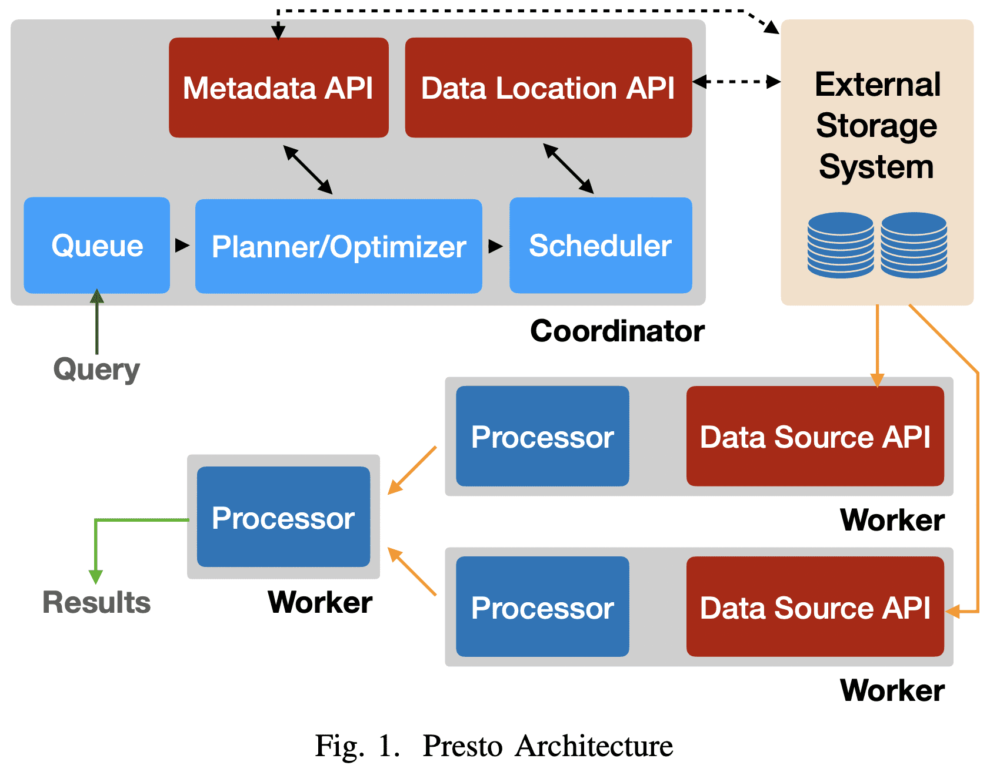
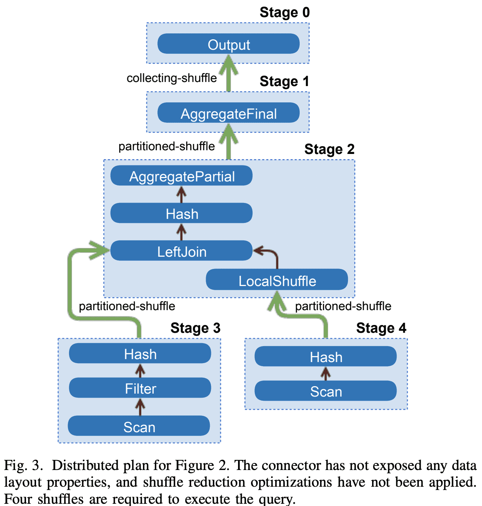

# Presto (ICDE ‘19)


[https://trino.io/Presto_SQL_on_Everything.pdf](https://trino.io/Presto_SQL_on_Everything.pdf)

**[Presto: Fast SQL on Everything (Facebook)](https://www.youtube.com/watch?v=Z2C-iYNm2wU)**

**[Even Faster When Presto meets Parquet @ Uber](https://www.youtube.com/watch?v=0qPhpN1d2AU)**

# 1. Introduction

presto의 주요 특징

- multi-tenant system, memory/io/cpu intensive 쿼리 가능, 수천개의 node로 scale out가능
- extensible: 한 query에서 다양한 data source를 받을 수 있어 여러 시스템을 통합해야하는 복잡도를 없애줌
- flexible: 다양한 usecase에 대해서도 지원
- performance: 여러 query가 worker node에서 하나의 single jvm process를 공유해서 response time을 줄임, 물론 scheduling, resrouce management, isolation필요

# 2. Use Cases

- Interactive Analytics
- Batch ETL
- A/B Testing
- Devloper/Advertiser Analytics

# 3. Architecture Overview

하나의 $coordinator$ node와 1개 이상의 $worker$ node가 존재한다. coordinator는 query admitting, parsing, planing, optimizing, orchestration을 담당한다. worker node는 query prcoessing을 한다.



client는 SQL이 포함된 HTTP request를 coordinator로 보낸다. coordinator는 queue policy에 맞춰 요청을 처리하고, SQL을 parsing, analyzing하고, execution plan을 만들고 최적화한다.

coordinator는 execution plan을 여러 worker로 분산하고 $task$ 를 실행하고, external storage system의 chunk data에대한 handle인 $split$을 task에게 할당한다. task는 $split$에 대한 data를 읽어간다

task를 실행하는 worker node는 external system에서 data를 페치해서 처리하거나, 다른 worker node의 intermediate result를 처리한다. worker는 여러 쿼리에서 생기는 많은 task를 처리하기 위해 cooperative multitasking을 한다. execution은 가능하면 pipelining된다. 모든 데이터가 처리되기 전에 일부 데이터를 받을 수도 있다. intermediate data, state는 가능하다면 in-memory에 저장한다. buffering은 shuffling이 발생하는경우 튜닝된다.

Presto는 다양한 plugin지원을 위해 interface가 있다.

# 4. System Design

## A. SQl Dialect

## B. Client Interfaces, Parsing, Planning

### 1) Client Interfaces

### 2) Parsing

ANTLR-based parser

### 3) Logical Palnning

$plan\ node$의 tree로 구성된 Intermediate Representation을 만든다. 각 node는 physical/logical operation을 표현하고 plan node의 children은 input이 된다. planner는 logical node node를 생성한다. 즉 어떻게 Plan이 실행되는지는 포함되지 않는다.

```sql
SELECT
  orders.orderkey, SUM(tax)
FROM orderes
LEFT JOIN lineitem
  ON orderes.orderkey = lineitem.orderkey
WHERE discount = 0
GROUP BY orders.orderkey
```

위의 query는 아래 logical plan이 된다


## C. Query Optimization

plan optimizer는 logical plan을 physical로 바꾼다. 이 과정은 transformation set을 돌면서 특정한 조건이 만족될때까지 evaluate한다. 각 rule의 pattern은 query plan의 subtree와 매칭되고 transformation이 필요한지 결정한다. result는 매칭된 subtree를 replace하는 subplan이다. Presto에는 predicate/limit pushdown, column pruning, decorrelation같은 optimization rule이 있다. table, column statistics를 기반으로 cost-based optimization은 join strategy나 join reordering을 지원한다.

### 1) Data Layouts

optimizer는 connector가 Data Layout API을 제공하면 data의 physical layout을 활용한다. Connector는 location과 partitioning, sorting, grouping, indexes에 대한 property를 제공하며, 한 table에 대해 각각의 다른 property마다 다른 layout을 줄 수 있고 optimizer는 가장 효율적은 layout을 선택한다.

### 2) Predicate Pushdown

optmizer는 connector를 통해 pushing range와 equality prediciate을 connector레벨로 내려 filtering을 효율적으로 수행한다. 예를들어 MySQL connector를 쓰고 MySQL에 샤딩을 해놨다면 각 샤드에 맞는 predicate을 내려준다. multiple layout이 있다면 predicate column을 index로 가지는 layout을 선택한다.

### 3) Inter-node Parallelism

optimization process는 plan이 병렬적으로 수행될 수 있는 부분을 찾아낸다. 병렬적으로 실행되는 부분들을 stage라고 부르고 한 stage는 1개 이상의 task로 분산된다. 각 task는 같은 input data에서 서로다른 dataset으로 같은 연산을 수행한다. optimizer는 stage간 데이터를 주고받기 위해 buffered in-memory data transfer (shuffle)을 추가한다. Shuffle을 쓰면 latency 증가, buffer memory 사용, cpu overhead가 높다. 따라서 optimizer는 전체 shuffle의 횟수를 잘 설정해야 한다. 아래 그림은 plan이 stage들과 요것들을 연결하는 shuffle로 변환된 예시이다.



**Data Layout Properties**: optimizer는 plan에서 shuffle수를 최소화 하기 위해 physical data layout를 이용한다. engine은 join에 들어가는 두 테이블이 같은 컬럼으로 partition되어있는 점을 활용하고, resource-intensive shuffle을 없애기 위해 co-located join strategy를 쓴다(같은 node에 배치). connector로부터 join column에 index가 있는지 받을 수 있다면 optmizer는 index를 이용해서 nested loop join을 할 수 있다

**Node Properties**: connector처럼 plan tree의 node는 partitioning, sorting, bucketing, grouping characteristics같은 output에대한 property를 표현한다. 또한 node는 shuffle을 도입할때 고려해야하는 $required$나, $preferred$ property를 넣을 수도 있다. redundant shuffle은 제거되고, shuffle 수를 줄일 수 있다면 shuffle의 property를 변경한다. presto는 shuffle을 줄일수 있을때까지 최대한의 required property를 만족시키는 partioning을 greedy로 선택한다. 즉 optmizer가 일부 컬럼 partition되도록 선택한다면 partition skew가 더 커질수도 있다.

Figure 3의 plan에서 이 optimization을 적용하면 아래처럼 single data processing stage으로 변경된다. 왼쪽 테이블은 join column으로 파티셔닝 되어있고, 오른쪽 테이블은 join column으로 파티셔닝 되어있지않아 local shuffle을 거친다. join은 co-located로 수행되어 network를 타지 않게된다.


### 4) Intra-Node Paralleism

optimizer는 single node에서 여러 thread로 병렬화시킬수 있는 이점을 가지는 plan stage내의 section을 찾아낸다. node내 parallize는 latency도 없고 thread간 정보공유를 하면 되므로 inter-node parallelism보다 훨씬 효율적이다. 특히 query에 concurrency bottleneck이 있으면 성능 향상이 크다 (skew로 인해 large data를 읽는경우).


## D. Scheduling

coordinator는 plan stage를 executable task형태로 worker들에게 분배하고, 한 stage의 task들을 다른 stage의 task들과 연겷하여 shuffle에 의해 서로 연결된 process tree를 만든다.

task는 여러 pipeline을 가질 수 있다. pipeline은 $operator$ chain으로 구성되고 각 operator는 single computation을 수행한다. 예를들어 hash join을 하는 task는 최소 2개의 pipeline이 필요하다. 하나는 hash table을 만들고(build pipeline), 다른 하나는 probe side의 data를 흘려서 join을 수행하는 것이다(probe pipeline). optimizer가 local parallelism에 이점이 있다고 판단하면 pipeline을 쪼개고 각 부분을 독립적으로 실행되게 만든다.  위 Figure 4의 ScanHasn, HashBuild가 그 예시이다. pipeline은 local in-memory shuffle로 join된다.

query 실행을 위해 engine은 1) 각 stage가 schedule되는 순서를 결정하고, 2) 얼마나 많은 task가 schedule되어야 하는지, 어떤 node들에 들어가야 하는지 결정한다.

### 1) Stage Scheduling

- `all-at-once`
모든 stage를 동시에 scheduling해서 wall clock time을 최소화한다. data는 바로바로 processing된다. adhoc query같은 latency-sensitive usecase에 적합하다.
- `phased`
deadlock을 피하고 topological order에 따라 같은 시간에 시작되어야 하는 strongly connected component를 식별한다. Figure 4의 hash-join을 phased mode에서 실행하면 pipeline2, pipeline1이 끝날때까지 pipeline0은 schedule되지 않는다. 이건 batch analytics에서 메모리를 아끼게 해준다.

policy에 따라 stage가 schedule되어야하면 scheduler는 task들을 worker node로 할당한다.

### 2) Task Scheduling

task scheduler는 plan tree를 보고 stage들을 $leaf$와 $intermediate$으로 분류한다. $leaf$ stage는 connector로부터 data를 읽고, $intermediate$ stage는 다른 stage의 intermediate result를 처리한다.

- Leaf Stages
task scheduler는 worker node에 task를 할당했을때의 network, connector 제약을 고려한다. 예를들어 shared-nothing deployments는 worker들이 storage node에 co-located되는것을 필요로한다. task scheduler는 Connector Data Layout API를 통해 이런 제약조건들에서의 task placement를 결정한다. A/B testing usecase는 predictable high-throughput, low-latency가 필요하므로 Raptor connector를 쓴다. (Raptor는 ssd를쓰는 shared nothing architecture에 최적화됨)
production cluster에서 CPU time의 대부분이 connector에서 읽은 data에 대해 decompressing, decoding, filtering, transform하는것에 쓰인다. 이런 작업들은 parallelizable하므로 wall time을 줄일 수 있다. 따라서 제약이 없는 상황이라면 data는 여러 split으로 나뉘어지고, leaf stage task는 cluster의 모든 worker node에 할당된다. 물론 이 경우에 network intensive해질 수 있다.
Task scheduler는 rack-local read나 rack-remote read 설정을 통해 network topology를 바탕으로한 최적화도 가능하다
- Intermediate Stages
intermediate stage의 task는 아무런 worker node로 들어갈 수 있다. 하지만 engine은 얼마나 많은 task가 각 stage에 schedule되어야 하는지 결정 할 필요가 있다. 이건 connector configuration, plan 속성, data layout, deployment configuration등을 본다. 동적으로 task 수를 바꾸기도 한다.(Section 4-E3)

### 3) Split Scheduling

leaf stage의 task가 worker node에서 시작하면 node는 1개 이상의 **split**을 받을수있게 available해진다. leaf의 모든 task는 run하기위해 1개 이상의 split을 할당받는다. intermediate stage의 task들은 언제나 run할 수 있고 upstream task가 완료되거나 자신 task가 abort되는경우에 끝난다.

Split Assignment: task가 worker node로 들어가면 coordinator는 split을 task들에게 할당한다. Presto는 connector에게 split에 대한 small batch를 요청한 뒤 이 batch를 task들에게 lazy하게 할당한다. 이 과정은 아래의 이점이 있다.

- connector가 많은 split을 enumerate하는 시간과 query response time을 decoupling시킨다. 예를들면 hive connector가 각 partition과 partition의 file location을 가져오는 시간이다.
- 모든 split이 enumerate되지 않고도 query는 모든 data를 처리하지 않고도 result를 만들어낼 수 있다.
- worker는 split queue를 유지한다. coordinator는 새 split을 가장 짧은 queue를 가지는 worker에게 할당하면 된다.
- query가 모든 metadata를 in-memory로 들고 있을 필요가 없다. 특히 hive connector는 수백만개의 split이 있어도 available해진다

## E. Query Execution

### 1) Local Data Flow

split이 thread에 할당되면 driver loop에 의해 실행된다. presto driver loop은 [Volcano (pull) model](https://dbms-arch.fandom.com/wiki/Volcano_Model)보다 복잡하다. presto driver loop은 operator(=pipeline)가 thread를 생성하기 전에 blocking하지않고 known state를 빠르게 가져올 수 있으므로 multitasking에 적합하다. 또한 operator는 추가적인 input 없이 진행가능한 operator간 data를 옮기는것으로 모든 quanta(split인가?)의 작업 수행 성능을 올린다. 모든 iteration은 data를 받으면 진행가능한 모든 operator에게 data를 전달한다.

driver loop이 수행하는 data의 단위는 row sequence와 columnar encoding된 $page$이다. Connector Data Source API는 split을 던지면 page를 리턴하고, operator는 일반적으로 input page를 받아 computation을 수행하고 output page를 만들어낸다. driver loop은 schedulling qunata가 완료될때까지나 operator가 더이상 진행할 수 없을때까지 지속적으로 operator간 page를 옮긴다.

### 2) Shuffles

Presto는 resource util을 극대화하면서 latency를 최소화하도록 디자인되었다. Presto는 intermediate result를 주고받기 위해 HTTP를 통해 in-memory buffered shuffle을 수행한다. task가 생성한 data는 다른 worker가 가져가기 위해 buffer에 저장된다. 한 worker가 다른 worker에게 intermediate result를 받기 위해 HTTP long-polling을 사용한다. server(result를 리턴해주는쪽)는 client(result를 요청하는쪽)가 이전 response에서 받은 token을 이용해 next segment를 요청할때까지 buffer의 data를 유지하고 있는다. 이런 방식은 transfer protocol에서 ack가 implicit하게 만든다. long-polling mechanism은 data 크기가 작을때 response time을 최소화한다.

engine은 output/input buffer에 대해 target util rate이 유지되도록 parallelism을 조정한다. output buffer가 꽉차면 split execution이 stall되고, 불필요한 processing overhead가 생겨 input buffer가 underutilize된다.

engine은 지속적으로 output buffer util을 모니터링한다. util이 계속 높으면 split에 대한 concurrency를 줄인다. 이건 data가 만들어지는 만큼의 속도로 data를 받을 수 없는 client(end-user 또는 worker)에 대해 optimization을 한다고 볼 수 있다.

받는쪽에서 engine은 target HTTP request concurrency를 계산하기 위해 request당 전송되는 평균 data를 모니터링한다. back pressure는 upstream task의 output buffer가 꽉차게 되니 upstream task가 느려지게 만든다.

### 3) Writes

ETL job은 다른 table로 data를 생성한다. remote-storage (s3같은것)를 쓸때 가장 중요한건 write가 수행되는 concurrency이다 (즉 Connector Data Sink API를 통해 쓰는 data thread 수). Presto는 adaptive approach를 통해 write하려는 producing data의 buffer utilization이 높아지면 동적으로 task/worker node를 추가해서 writer concurrency를 올릴 수 있다.

## F. Resource Management

fully integrated fine-grained resource management system 덕에 single cluster는 cpu, io, memory resource를 최대한 활용하면서 수백개의 쿼리를 동시에 실행 가능하다.

### 1) CPU Scheduling

presto는 data processing을 할 때 쓴 CPU util처럼 전체적인 cluster throughput을 최적화한다. local (node-level) scheduler는 compute-inexpensive query에 대한 turn around time을 최적화하고, query간 CPU resource를 fair sharing한다. task의 resource usage는 각 split에 대해 aggregate thread CPU time으로 측정한다. (task간)coordination overhead를 줄이기 위해 presto는 task level resource usage를 보고 scheduling decision을 내린다.

presto는 모든 worker node에 수많은 concurrent task를 스케줄링해서 multi-tenancy를 얻는다. 주어진 split은 1초애 maximum $quanta$만큼만 수행가능하고, queue로 돌아가야 한다. output buffer가 꽉차거나(downstream stage가 data를 빠르게 consume하지않은상황), input buffer가 비어있거나 (upstream stage가 data를 빠르게 만들지 못한 상황, system에 OOM이 발생했을 때 local scheduler는 $quanta$만큼 일하지 않았떠라도 task를 queue로 돌려보내고 다른 task를 받아서 실행한다. 따라서 cpu usage를 최대한으로 높이고, 다양한 query shape(access pattern관련?)에도 문제없다.

split이 thread를 나갈때 engine은 실행 시킬 다음 task를 결정해야 한다. presto는 새 쿼리를 완료하는데 필요한 resource를 예측하는것보다, 5-level feedback queue를 통해 classify 하며, task의 aggregate cpu time을 활용한다. task가 많은 cpu time을 쓰면 더 높은 level로 간다. 각 level은 available cpu time의 비율이 다르게 할당되어있다. 실제로는 io,cpu 패턴이 아주 다양하므로 fair하게 동작하기는 어렵고, 일부 connector는 async API가 없어서 worker thread가 시간을 많이 써야 할 때도 있다.

scheduler는 위와같은 제약에서도 adaptive 해야만 한다. system은 operator 내의 long running computation이 멈출 수 있도록 low-cost yield signal을 제공한다(어쩌라는..?). operator가 quanta를 넘기면 scheduler는 task에게 actual thread time을 저장해서, 다음 execution에 해당 시간만큼 적게 실행하도록 한다. 이 adaptive behavior는 다양한 query shape에 대처하게 해준다. 또한 user가 inexpensive query를 빠르게 끝내게 해주고, compute-intensive job에 대해서 turnaround time을 덜 고민하게 해준다 (왜???). 많은 쿼리를 동시에 돌리는것은 short query가 빠르게 종료되기 때문에 전체적인 queue time을 낮추게 된다.

### 2) Memory Management

- **Memory Pools**
presto의 memory allocation은 user memory, system memory로 분류되며, memory pool에 memory를 reserve해야한다. $User\ memory$는 system이나 input data에 대한 간단한 정보만 주어졌을때 user가 추정할 수 있는 memory usage이다 (예를들면 aggregation의 memory usage는 cardinality에 비례하는것). $System\ memory$는 shuffle buffer같은 implementation decision에 대한 결과이며, query shape이나 input data volume과 관련이 없을 수 있다 (shuffle이면 관련있는거아닌가..).
engine은 user와 total(user+system) memory에 대해 다른 제약을 건다. 모든 worker에서 global limit을 초과하거나, node단위 limit을 초과하는 query는 abort시킨다. node가 OOM이 발생하면 실행하는 task를 종료하는것으로 query memory reservation은 block된다.
user memory에 대한 per-node, global limit은 다르게 설정하여 어느정도 data skew를 가능하게 해준다. 500 node cluster에 node당 100gb mem이 있고 각 query는 globally 5TB mem까지 쓸 수 있을 때, 10개 쿼리가 total memory를 다 쓸수 있다(10*5TB). 하지만 2:1 skew를 허용하려면 per-node query memroy limit은 20GB로 설정해야 한다(위에 값 잘 보면 계산가능). 이렇게하면 oom이 나지않는 수준에선 최대 5개 쿼리까지만 돌리는것을 보장해준다.
하지만 5개 쿼리 이상 동시에 돌려야 한다. query들은 memory 특징이 다 다르기 때문에(skew, allocation rate, temporal locality등), 실제로는 5개 쿼리가 모든 limit을 치지는 않는다. 따라서 user limit은 overcommit하는 경우에 safe하게 해주는 설정이고, memory가 부족할때 클러스터를 healthy하게 유지하는 메커니즘이 따로 필요하다. spilling과 reserved pool이 이런 역할을 한다.
- **Spilling (optional, victim결정)**
node가 OOM이 날 때 engine은 execution time이 적은 순서대로 memory revocation procedure를 돌린다(즉 시작한지 얼마 안된 애들이 victim). 그리고 마지막 query에 필요한 충분한 memory를 얻게 되면 멈춘다. revocation은 disk에 state를 저장하는 행동이다(swap?). presto는 hash join, aggregation에 대해 spilling을 지원한다. 하지만 facebook에서는 spill을 쓰진 않는다. cluster는 일반적으로 엄청 크고, local disk를 쓰는 것은 hardware cost를 증가시키기 때문이다.
- **Reserved Pool (default, 가장 무거운 쿼리 빨리 끝내주기)**
spill설정을 안했을때 node가 OOM이 나는 경우 reserved memory mechanism이 cluster를 healthy하게 해준다. 모든 node의 query memory pool은 general pool, reserved pool로 나뉘어진다. general pool을 다 쓰게되면 가장 많은 memory를 쓰는 query는 모든 worker node에서 reserved pool을 쓰도록 promote된다. 이때 해당 query에 할당된 memory는 general pool 대신 reserved pool로 카운트된다. deadlock을 피하기 위해 한개 query만 reserved pool에 들어갈 수 있다. 한 node의 general pool이 다 털리면, 이 node에 있는 다른 task들의 memory request는 stall된다. reserved pool에 들어간 query가 끝나면 cluster는 memory request를 unblock해주게 된다.

## G. Fault Tolerance

presto는 low-level retry를 통해 transient error에 tolerant했다. 하지만 coordinator, worker node failure에 대한 built-in fault-tolerance는 없었다. coordinator failure는 cluster를 장애로 만들고 worker node failure는 해당 node의 모든 query를 실패하게 만든다. presto는 client가 failed query를 retry하도록 했다.

facebook에서는 external orchestration mechanism을 도입했다. external monitoring system은 failure node를 감지하고 cluster에서 제거 한뒤, 복구된 node들은 다시 cluster에 들어오도록 했다. 그래도 이 mechanism은 entire failure를 막지는 못한다.
standard checkpointing이나 partial recovery는 compute-intensive하므로 구현하기 까다로웠다. replication based fault tolerance또한 많은 resource를 쓴다. 그래서 retry로만 쓰고있따 (batch라서 문제없는듯함)

# 5. Query Processing Optimizations

## A. Working With the JVM

presto는 Hotspot JVM으로 구현됐다. data compression, checksum같은 performance-sensitive 한 것들은 optimization을 했다. application이 JVM의 JIT compiler를 제어하지않고, method inlining, loop unrolling, intrinsic같은 JIT compiler가 제공해주는 최적화를 활용했다.

GC algorithm을 선택하는 것도 성능에 큰 영향을 준다. Presto는 특정 size보다 큰 object를 잘 대처하지 못하는 G1 controller를 쓴다. presto는 이런 object를 최소화 하기 위해 아주 큰 threadold보다 더 큰 object,buffer의 할당을 피하고, 만약 필요하다면 segmented array를 썼다. 또한 크거나 많이 link된 object graph를 가지는경우도 G1 controller의 $remembered\ set$을 유지하는데 문제가 될 수 있다. query실행의 critical path에 있는 data structure는 reference와 object conunt를 줄이고 GC가 쉽게 동작하도록 flag memory array로 구현했다. 예를들어 `HISTOGRAM` aggregation은 모든 group에 대해 bucket key와 count를 각 histogram에 대한 독립적인 object 대신 flat array와 hash table에 저장한다.

## B. Code Generation

Java좀 알아야 볼 수 있다 ...

### 1) Expression Evaluation

query engine의 성능은 complex expression을 evaluate하는 속도에 달려있다. presto는 complex expression을 eval하는 expresion interpreter가 포함되어있지만 production의 수싱벙깨의 row를 eval하는데에는 너무 느리다. 따라서 Presto는 contant, function call, variable참조, lazy/short circuiting operation에 대해 bytecode를 직접 생성한다

### 2) Targeting JIT Optimizer Heuristics

Presto는 key oprator와 oeprator combination에 대해 bytecode를 생성한다. generator는 JIT optimization에 적합한 bytecode를 생성한다. 아래는 generator가 주로 타게팅하는 behavior들 이다

- quanta마다 서로다른 task pipeline에서 split들을 switching하므로 JIT의 profiling information에 pollution이 생길 수 있다.
- processing loop가 single task pipeline이더라도 engine은 각 computation에 필요한 type을 알아야하고 column단위로 unrolled loop을 만들 수잇다. loop body에서 type 변화를 제거하면 profiler가 monomorphic임을 인지하고 loop를 inline virtual method로 만들 수 있다.
- 모든 task에서 생성되는 bytecode는 별도의 Java class로 컴파일되고, 각각은 독립적으로 JIT optimizer가 프로파일링한다. 실제로 JIT optimizer는 실제 data가 처리되는 쿼리에 의해 생성된 custom program을 프로파일링에 활용한다. 이런 profiling은 각 task마다 독립적으로 수행되어 task process들이 서로 다른 partition을 가질 때 성능이 향상된다. 또한 perforamnce profile은 시간이 지나면서 바뀌게 되어 generated code가 update되게 한다.

이와같은 bytecode generation은 engine이 intermediate result를 memory대신 register/cache level로 저장할 수 있또록 성능을 향상시킨다.

## C. File Format Features

Scan operator는 leaf split 정보로 Connector API를 호출하고 columnar data를 $Page$로 받는다. page는 $Block$ list이고, 각 block은 flat in-memory로 표현된 한 column을 가진다. flat memory data structure를 쓰는건 complex type을 쓸 경우 성능에 큰 영향을 미친다. pointer chasing, unboxing, virtual method call은 큰 overhead를 만든다.

Figure 5는 각 column이 압축된 page layout을 보여준다. Dictionary-encoded block은 low-cardinality column을 저장하는데 용이하고, run-length encoded (RLE) block은 반복되는 data를 압축하는데 용이하다. 일부 page는 dictionary를 공유할 수 있는데 이건 memory efficiency를 향상시킬 수 있다. ORC file의 column은 전체 stripe(최대100만row)에 대해 한 dictionary를 공유할 수 있다.


## D. Lazy Data Loading

Presto는 lazy materialization을 지원한다. 이건 columnar, commpressed에 효과가 좋다. Connector는 실제로 access될때 읽고, 압축을 풀고, 디코딩 하는 $lazy\ block$을 생성 할 수 있다. 이를 통해 decompressing, decoding, filtering하는 대부분의 cpu time을 selective하ㅔ 할 수 있어 접근하지 않는 column이 있으면 아주 효과적으로 동작한다.

## E. Operating on Compressed Data

Presto는 dictoary, RLE block같은 connector에서 들어오는 compressed data도 처리한다. Figure 5는 한 page에 구성된 block을 보여준다. page processor가 dictionary block에 대해 transformation이나 filter를  dictionary의 모든 value에 대해 수행 할 수 있다 (RLE는 single value). 일부 케이스는 block의 dictionary에 row보다 더 많은 value가 있을 수 있다. 이때 page processor는 unreferended value가 다음 block에서 사용 될 것이라 추측한다. page processog는 row수와 dictionary size를 들고있어 dictionary processing하는것과 모든 index를 processing하는것을 비교한다. dictonary size보다 row수가 많으면 dictionary를 process하는게 더 효율적이다. page processor가 새 dictionary를 만나면 이와 같은 heuristic을 적용한다.

또한 hash table을 만들 때 (join/aggregation) dictionary block structure를 사용한다. index가 processing되면 operator는 array에 dictionary entry에 대한 hash table location을 저장한다. dictionary entry가 반복되면 location을 재사용한다.

task는 intermediate compressed result를 만든다. join processor는 dictionary나 RLE block을 만든다. hash join에서 join의 probe side가 hash table에서 look-up하면 값을 카피하지 않고, value index를 array에 저장해둔다. operator는 index list가 array로 구성된 dictionary block을 만들고 dictionary는 hash table에서 block으로 참조된다.

---

Writer scaling

- write perforamcne domiated by concurrency
- too few writers causes the query to be slow
- too many writers creates small files
    - expensive to read later (metadata, IO, latency)
    - inefficient for storage systme
- Add writes as needs when producer bufferes are full, as long as data written exeeds a configured threshold

coordinator SPOF

- 여러개 coordinator 쓸수있음
- https://github.com/trinodb/trino/issues/391 facebook만 되고 trino는 안된다?