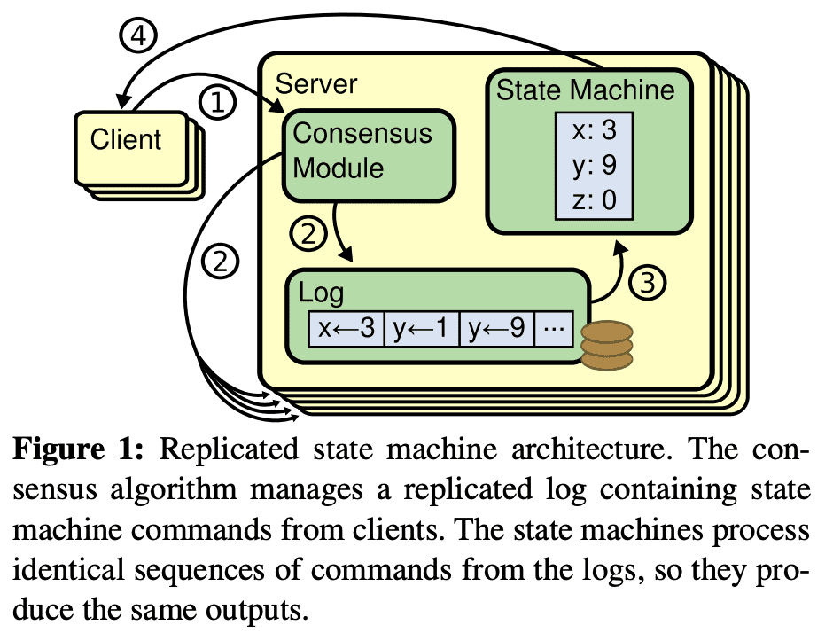

# Raft (ATC ‘14)

[https://raft.github.io/raft.pdf](https://raft.github.io/raft.pdf)

prerequisite: [https://martinfowler.com/articles/patterns-of-distributed-systems/paxos.html](https://martinfowler.com/articles/patterns-of-distributed-systems/paxos.html)

# 1. Introduction

consensus algorithm은 여러 머신이 failure에서도 한 그룹으로 일하도록 해준다. 이것은 reliable large scale software system의 키이다. paxos가 널리 쓰인 알고리즘이었다. 대부분 구현체는 paxos나 여기에서 영향받은것이고, consensus algorithm을 가르칠때 필수적이다. 하지만 paxos는 더 쉽게 설명하기 위한 많은 시도를 해봐도 이해하기 어렵다. 또한 paxos architecture는 실제 시스템에 복잡한 변경사항을 만든다.

paxos를 가지고 씨름한 끝에 새 consensus algorithm을 만들었다. 주 목표는 $understandability$였다. practical system에 적용할 consensus algorithm을 만들고, paxos보다 훨씬 쉽게 설명할 수 있는가? 또한 이 알고리즘이 system builder들에게는 필수적인 직관에 대한 개발을 도와주길 원했다. 알고리즘이 잘 동작하는것 뿐만아니라 왜 이게 잘 동작하는지 명백한 것이 중요했다.

그것이 Raft algorithm이다. 이해도를 높이고, decomposition하고(Raft는 leader election, log replicationm safty를 분리했음), state space reduction(paxos와 비슷하게 raft는 non-determinism의 정도와 서버간 inconsistency를 줄인다)을 적용하여 만들었다.

Raft는 [Viewstamped Replication](https://www.google.com/search?q=Viewstamped+replication+revisited.&oq=Viewstamped+replication+revisited.&aqs=chrome..69i57j0i30.224j0j7&sourceid=chrome&ie=UTF-8) 과 비슷하지만 몇가지 피쳐가 있다

- Strong leader: Raft는 다른 consensus algorithm과 달리 strong leader가 있다. 예를들어 log entry는 strong leader에서 다른 server들로 간다. 이것은 replicated log를 관리하기 쉽게 해주고, Raft를 이해하기 쉽게 해준다.
- Leader election: Raft는 리더 선출시 randomized timer를 쓴다. 이것은 다른 consensus algorithm이 conflict를 해결하기 위해 필요로하는 heartbeat에 비해 매우 작은 양이다.
- Membership changed: Raft가 cluster에서 server를 바꾸는 mechanism은 transition중에 두가지 다른 config의 대부분이 overlap되도록 하는  $joint\ consensus$ approach를 쓴다.(??) 이건 cluster가 configuration change가 발생하는 동안에도 정상적으로 일하도록 만든다

# 2. Replicated State Machines

consensusm algorithm은 $replicated\ state\ machine$에서 생겨났다. 여러 서버에서 동작하는 state machine은 같은 상태를 복제하고 일부 서버가 다운데어도 잘 동작하도록 한다. Replicated state machine은 distributed system에서 fault-tolerance 문제를 해결한다. 예릴들어 single cluster leader를 가지는 GFS, HDFS, RAMCloud같은 large-scale system은 leader election을 관리하고 leader crash에서도 tolerent하기 위한 정보들을 저장하는 replicated state machine을 쓴다. chubby, zookeeper도 이에 해당한다.

replicated state machine은 일반적으로 replicated log를 이용한다. 각 서버는 in odrer로 state machine을 실행시키게 될 command들을 담고있는 log를 저장한다. 각 log는 같은 순서로 같은 command들을 저장해서 각 state machine이 같은 순서대로 command를 실행한다. state machine이 deterministic하므로 같은 state에서 같은 연산을 적용하면 같은 결과가 나온다.

replicated log를 consistent하게 유지하는것은 consensus algorithm에서 수행한다. server의 consensus module은 client로부터 command를 받고 log에 command를 넣는다. consensus module은 다른 server의 consensus module과 통신해서 모든 log가 server fail이 발생해도 같은 순서로 같은 command를 eventual하게 전달 되도록 한다. 한번 command가 replicate되면 각 server의 state machine은 log 순서에 따라 command를 수행시키고, output이 client에게 전달된다. 따라서 server들은 한개인것처럼 보이고 reliable state machine이 된다.

practial system에서 consensus algorithm은 아래와 같은 property를 가진다.

- system은 network delay, partition, packet loss, duplication, reordering등 모든 non-Byzantine condition에서 $safety$를 보장한다(incorrect result를 리턴하지 않는다).
— [abount non-Byzantin condition](https://ravendb.net/articles/byzantine-and-non-byzantine-distributed-systems)
- 대다수의 서버가 operation하고 각 서버간과, client와 통신 가능한 한 $available$ 하다. 5개 server를 가지는 cluster는 2개 서버의 failure까지도 tolerent하다. server는 stop으로 인해 실패된것으로 간주되며 이후에 stable storage에서 state를 복구하여 cluster에 다시 들어오게 된다.
- system은 log의 consistency를 보장하기 위해 timing에 의존하지 않는다. faulty clock, extreme message delay도 발생할 수 있고, availability문제도 발생할 수 있는 상황을 생각해야한다.
- 대부분 케이스에서 command는 cluster에서 다수가 RPC에 대해 응답하면 완료됐다고 간주한다, 나머지 slow server는 전체 시스템 성능에 영향을 미치지 않는다.. — 오 흥미롭다..

# 3. What’s wrong with Paxos?

Lamport의 Paxos protocol은 거의 consensus와 동의어로 사용되었다. 많은 강의에서 가르치고, consensus implementation 의 대부분이 Paxos에서 시작했다. Paxos는 single replicated log entry같이 처음으로 single decision에 합의하는 protocol을 정의했다. 이것을 $single\text{-}decree\ Paxos$라고 부른다. 그리고 $single\text{-}decree\ Paxos$를 가지는 여러 instance를 합쳐서 log 같은걸로 decision들을 내릴 수 있는 protocol을 만들었다 ($multi\text{-}Paxos$). Paxos는 safety, liveness를 보장하고 cluster membership 변경도 허용한다. Paxos는 일반적인 케이스에서 efficient하다.

하지만 Paxos는 두개의 큰 단점이 있다. 첫번째는 이해하기 너무 어렵다. [paper](https://lamport.azurewebsites.net/pubs/lamport-paxos.pdf)는 극히 일부만 이해할 수 있다. 물론 더 쉬운 버전도 있다([Paxos Made Simple](https://lamport.azurewebsites.net/pubs/paxos-simple.pdf), [How to build a highly available system using consensus.](https://www.microsoft.com/en-us/research/uploads/prod/1996/10/Acrobat-58-Copy.pdf), [The ABCD’s of Paxos](https://citeseerx.ist.psu.edu/viewdoc/download?doi=10.1.1.595.4829&rep=rep1&type=pdf)). 이 설명들은 single-decree subnet에 대해 포커스를 맞췄지만 multi-Paxos는 여전히 어렵다. 두번째는 구현을 위한 foundation이 없다는 것이다. 이유는 multi-Paxos에 대해 합의된 알고리즘이 없기 떄문이다. Lamport는 single-dcree Paxos에대해 주로 설명했고 multi-Paxos는 가능한 approach만 설명하여 디테일들이 없다.

또한 Paxos architectur는 practical system을 만들기엔 좋지 않다. paxos architecture는 single-dcree decomposition의 다른 결과일 뿐이다. 예를들어서 독립적으로 log entry collection을 선택한다음 sequential log에 붙이는것은 거의 이점이 없다. 복잡도만 더하게된다. 새 entry가 constrained order로 sequential하게 append되는 log를 바탕으로 system을 design하는게 훨씬 단순하고 효율적이다. 다른문제는 Paxos가 symmetric peer-to-peer approach를 코어로 쓰는것이다. 이건 한개의 decision만 만들어지는 단순한 상황에서는 괜찮은데, 대부분 practical system은 이방식을 쓰지않는다. 만약 일련의 decision들이 만들어져야 한다면 leader election을 한뒤 leader가 결정하는것이 훨씬 단순하다.

따라서 practical system은 Paxos와 비슷하지 않게된다. 각 구현체는 Paxos에서부터 시작하지만, 구현하는데 어려운점을 발견하고, 다른 아키텍쳐를 만들게 된다. large-scale system에서 consensus의 중요성때문에 Paxos보다 더 나은 consensusm algorithm을 만들었다.

# 4. Designing for understandability

Raft를 만들기 위해 몇가지 goal을 정했다. Raft는 system building을 위해 complete, practical하게 설명 되어야지 개발자가 system을 디자인 하는 시간을 줄일 수 있다. Raft는 모든 조건에서 safe하고, 모든 일반적인 operating condition에서 available하고, 일반적인 operation에서 효율적이어야 한다. 가장 중요한 목표는 $understandability$이다. Raft는 많은 사람들이 algorithm을 이해할 수 있도록 해야한다. 또한 algorithm에 대한 직관을 느낄 수 있어야 system builder들이 실제로 구현할때 확장할 수 있다.

Raft를 design하는데 여러가지 대안이 생기는 지점이 많았다. 이럴때마다 understandability를 바탕으로 결정했다. 설명하는데 얼마나 어려운가? (예를들어 state space가 얼마나 복잡한지, 미묘한 의미를 가지고 있는지? 등)와 독자가 완벽히 이 approach와 의미를 이해하는데 얼마나 쉬운지?를 고려했다.

이런 분석을 진행하면서 많은 주관이 담기는것을 알아서, 범용적으로 적용할만한 두 테크닉을 활용했다. 첫번째는 잘 알려진 문제 해결방식인가 이다. 가능한한 문제를 상대적,독립적으로 해결가능하고, 설명가능하고, 이해가능하게 쪼갰다. 예를들어 Raft에서는 leader election, log replication, safety, memership change로 쪼갰다.

두번째는 고려해야할 state수를 줄여 state space를 단순화 해서, system을 보다 일관성있게하고 가능하다면 non-determinism을 없앤다. 특히 log에는 hole을 허용하지 않고, raft는 로그가 서로 inconsistent하지않는 방식을 제한한다. non-determinism을 없애기 위해 시도했지만 일부 non-determinism이 understandability를 높여주는 일부 케이스가 있었다. 특히 randomized approach는 non-determinism을 만들지만 가능한 모든 선택을 비슷한 방식으로 처리해서 state space를 감소시킨다. Raft는 randomization을 leader election에서 사용한다.

# 5. The Raft consensus algorithm

Raft는 Section 2에서 설명한 형태로 replicated log를 관리하는 algorithm이다. Figure 2는 알고리즘을 간단하게 설명하고, Figure 3은 algorithm의 key property를 설명한다.

Raft는 $leader$를 뽑고, leader에게 replicated log를 관리하도록 한다. leader는 client로부터 log entry를 받고 다른 서버로 replicate하고, log entry를 state machine에 적용해도되면 그것을 알려준다. leader를 가지는것은 replicated log를 관리하는것을 간단하게 만들어준다. leader는 다른 server와 communication없이 새 log entry를 어디에 둘지 결정하고, data flow또한 leader에서 다른 server들로 가게 되므로 간단해진다. leaeder는 failure가 발생하거나 다른 서버와 connection이 끊어질 수 있는데, 이때는 새 leader가 뽑힌다.

Raft는 consensus 문제를 3개의 subproblem으로 쪼갠다

- **Leader election**: 새 leader는 기존 leader의 failure발생 시 뽑혀야만한다 (Section 5.2).
- **Log replication**: leader는 log entry를 client로 받고, server들에게 replicate한다 (Section 5.3).
- **Safety**: Figure 3, server가 특정 log entry를 자신 state machine에 apply치면, 같은 log index에서 다른 command를 apply친 server가 없어야 한다 (Section 5.4, 순서 보장)

## 5.1 Raft Basics

각 server는 $leader,\ follower,\ candidate$ state 중 한개를 가진다. 평소에는 하나의 leader, 나머지 모두는 follower가 된다.

- Follower는 request를 던지지 않고, leader나 candidate으로부터 응답만 한다.
- Leader는 모든 client request를 처리한다. leader가 follower에게 요청을 던지는경우엔 follower가 leader로 redirect시킨다.
- Candidate은 새 leader를 뽑을때 사용된다.

Raft는 시간을 $term$단위로 쪼갠다. term은 consecutive integer로 표현된다. 각 term은 1개 이상의 candidate이 leader가되려고 시도하는 $election$에서 시작한다 (Section 5.2). 한 candidate이 이기면 term의 남은 시간동안 leader가 된다. 때때로 split vote가 발생하는데, 이때 term은 leader를 만들지 않고 새 term을 시작하여 특정 term에 최대 1개의 leader만 있도록 한다.

server들은 각각 다른시간에 term의 전환을 볼 것이고. 때때로 election이나 전체 term을 보지 못 할 수도 있다. Term은 Raft에서 [logical clock](https://martinfowler.com/articles/patterns-of-distributed-systems/lamport-clock.html) 처럼 동작하고 server들이 stale leader같은 obsolete info를 알수 있도록 해준다. 각 server는 monotoic-increase하는 $current\ term$ number를 저장한다. $current\ term$은 server들이 통신할때마다 주고받는다. 한 server의 $current\ term$이 다른 server들보다 작은 값을 가지면, 다른 서버들이 가지는 큰 값으로 업데이트된다. server가 candidate이나 leader상태일때 term이 outdate된것을 보면 즉시 follower state로 전환한다. server가 stale term number로 request를 받으면 request는 reject된다.

Raft server는 RPC를 통해 통신한다. RequestVote RPC는 election동안 candidate이 호출한다(Section 5.2). AppendEntries RPC는 leader가 log entry를 replicate하고, heartbeat를 쏠때 호출한다(Section 5.3). 다른 RPC는 Section 7에서 나온다. 일정 시간내에 응답을 받지 못하면 재시도를 하며, 성능을 위해 parallell로 동작한다.

## 5.2 Leader Election

Raft는 leader election을 시작하기 위해 heartbeat를 쓴다. server가 시작할때는 모두 follower로 시작한다. server는 leader/candidate으로부터 RPC를 받는동안 follower state를 유지한다. Leader는 주기적으로 heartbeat를 던지며, replicate시킬 log entry가 없을때에도 던진다. follower는 $election\ timeout$이 지나도 heartbeat를 받지 못하면 leader가 없다고 보고 새 leader를 선출을 시작한다.

election을 시작할때 follower는 $current\ term$을 증가시키고 candidate state로 변경한다. 그리고 자신을 vote하고, 모든 server에게 병렬로 RequestVote RPC를 호출한다. (a) candidate이 election에서 뽑히거나, (b) 다른 server가 leader가 되거나, (c) 일정 시간이 지나도 winner가 없을때까지는 candidate 상태로 유지한다.

### Candidate이 election에서 이길 때

한 term에서 절반이상의 server가 한 candidate을 선택하면 election에서 이긴것이다. 각 server는 FCFS로 최대 한 candidate에게 vote를 한다 (Section 5.4에 vote에 대한 제약조건이 있음). 위 majority rule은 특정 term에서 최대 하나의 candidate만 election에서 이길 수 있도록 한다 (Election Safety Property). candidate이 election에서 이기면 leader가 되고, 이 leader는 heartbeat message를 모든 다른 server에게 보내어 내가 leader라는 것을 알린다.

### 다른 Candidate이 election에서 leader가 됐을 때

vote를 기다리는 동안 candidate은 다른 server로부터 leader가 됐음을 알리는 AppendEntries RPC를 받을 수 있다. RPC에 들어있는 leader의 term number가 자신(candidate)의 current term보다 크면, 새 leader가 뽑혔음을 인지하고 follower state로 변경한다. RPC의 term이 자신의 curretn term보다 작으면 candidate은 RPC를 reject하고 candidate state를 유지한다.

### 일정 시간이 지나도 leader가 선출되지 않을 때

동시에 여러 follower들이 candidate이 되어 vote가 50%를 넘기지 못할 수 있다. 이때 candidatre은 timeout을내고 term number를 올려 새 election을 시작하고 RequestVote RPC를 호출해서 새 election round를 시작한다. 하지만 이렇게 재시도하면 split vote가 계속 발생 할 수 있다. (split vote: 서로다른 term에 대해 leader를 선출하는 상황)

Raft는 randomized election timeout을 써서 처음에 split vote가 생겼더라도 곧 해소될 수 있도록 만들어준다. 이렇게 하면 한 server만 timeout을 보게된다. 이 server가 election에서 이기고, 다른 server들은 timeout이 나기 전에 heartbeat를 받는다. 이 방식은 split vote를 핸들링할때도 쓰인다. 각 candidate은 election을 시작할때 randomized election timeout으로 재시작하고 다음 election을 하기 전에 timeout을 기다린다. 이건 다음 election에서 또 다른 split vote가 발생하는 것을 막는다. Section 9.3은 leader를 빠르게 설정하는 방법을 보여줄것이다.

## 5.3 Log Replication

leader가 선출되면 client request를 받기 시작한다. 각 client request는 replicated state machine에 에도 적용될 command를 포함하고 있다. leader는 command를 log entry로 만들고 AppendEntries RPC를 병렬로 호출해서 각 server에 log entry가 replicate되도록 한다. log entry가 replicate되면leader는 log entry를 state machine에 적용하고 result를 리턴한다. follower가 crash나거나 느리게 동작거나 network가 끊어지면 ledaer는 무한히 AppendEntries RPC를 재시도한다. client에게 응답한이후에도 모든 follower가 log entry를 저장할때까지 계속 재시도한다.

Figure 6에서 각 log entry는 term number와 command를 저장한다. log entry의 term number는 log간 inconsistency를 확인하기 위한것이다 (Figure 3 참조). 또한 각 log entry는 log position을 식별하기 위한 integer index를 가진다.

leader는 log entry가 state machine에 적용되면 safe하다고 본다. 이런 log entry를 $commited$라 한다. Raft는 commited log entry가 durable하며, 모든 aviailable state machine에서 eventually executed 될 것임을 보장한다. **log entry는 절반 이상의 서버에 replicate되면 commited된다**(Figure 6의 entry 7). 또한 이전 leader가 만든 log entry 포함하여 모든 이전 log entry들도 commited가 된다. leader는 commited가 될 highest index를 들고 있고, 다음 AppendEntries RPC에 이 index를 넣어서 호출하므로 다른 server들이 highest index를 알게 된다. follower는 log entry가 commited인것을 알게 되면 해당 log entry를 state machine에 반영한다. (leader log, follower log, leader commit, follower commit 순서)

Raft log mechanism은 여러 server의 log들이 high coherence를 가지도록 디자인되었다. 시스템의 행동이 단순하고 predictable할 뿐만 아니라 safety를 보장하는데 중요하다. Raft는 Figure 3의 Log Matching Property를 아래 property을 통해 보장한다

- 다른 log의 두 entry가 같은 index, 같은 term을 가지면, 두 entry는 같은 command를 가진다.
- 다른 log의 두 entry가 같은 index, 같은 term을 가지면, 두 log에서 이전의 모든 log entry는 같다.

첫번째는 leader가 주어진 term, log index에 최대 한개의 log entry만 생성하고, log entry는 절대 바뀌지 않기때문에 보장이 되고, 두번째는 AppendEntries RCP에 의해 수행되는 consistency check에 의해 보장된다. leader는 AppendEntries RPC를 호출할때 새 log entry바로 앞에 있는 index와 term을 포함한다(commited log entry?). follower가 같은 index, term을 가지는 log entry를 찾지 못하면 새 entry를 reject한다. log가 첫 empty state로 시작하는것은 Log Matching Property를 만족하고, consistency check은 log가 추가될떄마다 Log Matching Property를 유지하게 해준다. 따라서 AppendEntries RPC가 성공하면 leader는 follower의 log가 leader log와 new entry까지 동일하다는 것을 알 수 있다.

leader election이 아닌 평소 상황엣 leader log와 follower log는 consistent하게 유지되어 AppendEntries RPC가 실패하지 않는다 (term이 달라지지 않으므로). 하지만 leader failure는 inconsistent한 상황을 만든다 (old leader가 모든 log entry를 replicate하지 못하므로). inconsistency는 여러 leader, follower failure로 악화될 수 있다.

Figure 7은 follower log가 새 leader log와 다른 모습을 보여준다. leader에는 있지만 follower에는 없는 Log entry, follower에만 있는 log entry, 같은 index인데 서로 다른 log entry가 생길 수 있다. 이런 상황은 여러 term에 걸쳐서 일어날 수 있다.

Raft에서 leader는 follower log가 leader log를 가지도록 강제해서 inconsistency를 해결한다. Section 5.4에서 다른 restriction과 더해져 safe하다는것을 보여줄 것이다. (client요청이 무시되는상황..?).

follower log를 leader log와 consistent하게 만드려면 leader는 follower log와 자신 log가 일치하는 latest log entry index를 찾고, 해당 index 이후의 follower log의 모든 log entry를 지우고, 해당 Index 이후의 모든 leader log entry를 follower에게 보내야 한다. 모든 행동은 AppendEntries RPC에서 일어난다. leader는 각 follower에게 보내야할 next log entry에 대한 $nextIndex$를 들고있는다. leader가 새로 된 직후에 모든 nextIndex는 leader log의 nextIndex가 된다 (Figure 7에서 11). follower log가 leader log와 incosistent하면 (leader는 10,6을 보낼거고 b, e, f는 reject을 리턴), AppendEntries RPC가 실패한다. rejection 이후 leader는 follower에 대한 nextIndex를 감소시켜 재시도한다. 최종적으로 nextIndex는 leader log와 일치하는 index까지 가게되어 AppendEntries RPC가 성공하는데, 이때 leader log와 충돌하는 follower log는 지워지고 leader log가 append된다. AppendEntries RPC가 한번 성공하면 follower log는 leader log와 consistent하게되고 나머지 부분도 똑같이 consistent 해지게 된다.

> 이 protocol은 nextIndex를 1씩 감소시키면서 재시도하므로 AppendEntries RPC가 많다. 이를 위해 follower는 reject를할때 해당 index가 가지는 term에서 저장한 첫번째 index를 리턴하는것으로 leader는 nextIndex를 좀더 빠르게 줄일 수있다. 하지만 이런 상황이 빈번히 일어나는 것이 아니니 optimization이 필수는 아니다.
>

이 mechanism을 통해 leader가 새로 생길때 해당 leader는 log consistency를 맞추기 위한 추가적인 action을 할 필요가 없다. 또한 leader는 자신의 log entry를 overwrite하거나 지우지 않는다 (Leader Append-Only Property in Figure 3).

이 log replication mechanism은 Raft가 절반 이상의 server가 available하는동안 log entry를 client로 부터 받고, replicate하고, 적용하게 해준다. 평소에 log entry는 한번의 RPC로 replicate되며 소수의 slow single follower는 성능에 영향을 미치지 않는다.

## 5.4 Safety

이전 section에서 어떻게 Raft가 leader를 뽑고 log entry를 replicate하는지 보여줬다. 하지만 위 내용만으로는 state machine이 같은 순서로 같은 command를 실행하는것을 보장해주지 못한다. 예를들어 follower는 leader가 log entry를 commit하는동안 unavailable해질 수 있고, 이후에 이 follower가 leader가 되어서 이전 leader가 쓴 log entry를 모두다 overwrite할 수 있다. 이렇게되면 다른 state machine이 다른 command set을 실행하는 상황이 생길 수 있다.

이 section은 leader로 뽑힐 수 있는 server에 대한 restriction을 걸어 위 문제를 해결할 것이다. restriction은 어떤 term에서도 leader가 이전 term에서 commit된 Log entry를 포함하는 것을 보장한다 (Leader Completeness Property).

### 5.4.1 Election Restriction

leader-base consensus algorithm에서 leader는 모든 commited log entry를 eventually store 해야 한다. [Viewstamped Replication](http://pmg.csail.mit.edu/papers/vr-revisited.pdf) 같은 consensus algorithm에서는 모든 commited entry를 가지고 있지 않아도 leader가 될 수 있다. 이런 algorithm은 놓친 commited entry를 찾고, 새 leader로 전달하기 위한 추가적인 로직이 필요하므로 복잡도를 증가시킨다. Raft는 새 leader가 뽑힐때 log entry 전송 없이도 이전 term에서 commited entry가 포함되도록 보장하는 좀더 간단한 방법을 사용한다. 즉 log entry는 언제나 leader에서 follower로 흐르고, leader는 절대 leader log를 overwrite하지 않는다.

Raft는 election에서 모든 commited log entry를 가지지 않는 candidate이 leader가 되지 못하도록 막는다. candidate은 cluster의 절반 이상과 communicate해야한다. log commit을 할때 절반 이상의 서버에게 log를 전달하는것을 보장하므로, 모든 commited entry는 election에 참여한 절반이상의 서버중 하나에는 반드시 존재하게 된다. candidate log가 up-to-date 하다면 모든 commited entry를 유지한다?? RequestVote RPC는 candidate log에 대한 정보를 포함하고, server들은 자신의 log보다 up-to-date하지 않은 candidate에 대해서는 deny를 한다.

Raft는 두 log (candidate, server)가 up-to-date한지 확인하기 위해 last log entry의 index, term을 비교한다. log가 다른 term을 가지면 later term이 up-to-date한거고, 같은 term을 가지면 같은 term에서 더 많은 log를 가진 쪽이 up-to-date 한 것이다.

### 5.4.2 Committing Entries from Previous Terms

Section 5.3에서 말한것처럼 leader는 현재 term의 entry가 절반 이상의 server에게 exactly-once로 commit된것을 알고 있다. leader가 log entry를 commit하기전에 crash가 발생하면, 그 다음 leader는 entry replication을 마지 완료시킨다. 하지만 leader는 이전 term에서 발생한 log entry가 절반 이상의 server에 ‘exactly-once’로 commit 되었다고 판단할 수 없다. Figure 8은 old log entry가 절반 이상의 서버에 저장되어있지만, 그 다음 Leader에 의해 overwrite되는 상황을 보여준다.

위의 문제가 생기지 않도록 만들기 위해 Raft는 replica 수를 세면서 이전 term의 log entry를 commit하지 않는다. leader의 현재 term의 log entry만 (절반이상 commit되었는지?) replica 수를 세면서 commit된다. 현재 term의 log entry가 이렇게 commit되면, 모든 이전 Log entry는 Log Matching Property에 의해 implicit하게 commit 된 것이다. leader는 이전 log가 commited되었음을 모든 server를 찔러서(안전하게) 판단 할 수있지만, Raft는 simplicity를 위해 이 방식을 쓰지 않는다.

Raft는 log entry가 leader가 이전 term의 log entry를 replicate할때 이전 term number를 유지하기 때문에 commit rule에 추가적인 복잡도를 만들게 되었다. 다른 consensus algorithm에서 새 leader가 이전 term의 log entry를 replicate할때, 새 term number를 쓴다. Raft는 같은 log entry가 모두 같은 term을 가지도록 하기 위해서 기존 term number를 쓴다. 또한 다른 algorithm에 비해 새 leader는 이전 term의 log entry를 훨씬 적게 전송한다. 다른 algorithm은 log entry의 term number를 모두 바꾸기 위해 log entry를 더 많이 보낸다.

### 5.4.3 Safety Argument

Leader Completeness Property가 유지되지 않는다고 가정하고 반례를 통해 증명할 것이다. term T의 leader $leader_T$가 T에서 log entry를 commit하지만 이 log entry가 미래의 term에 저장되지 않는 상황을 가정한다 ($U>T$ 인 leader $leader_U$가 log entry를 저장하지 않은 상황).

1. $leader_U$의 log에서 commited entry가 없어야 한다. (leader는 log entry를 절대 지우거나, overwrite하지않음)
2. $leader_T$ 가 절반 이상의 서버에 log entry를 replicate 했고, $leader_U$는 절반 이상의 서버($voter$)로부터 vote를 받았따. 따라서 최소 한개 server는 $leader_T$의 log entry를 받았고, $leader_U$에게 투표했다. $voter$가 가정에 대한 반례를 보기 위한 ‘키’ 이다.
3. $voter$는 $leader_U$에게 vote 하기 전에 $leader_T$가 보낸 commited log entry를 받아야만 한다. 그렇지 않으면 $leader_T$의 AppendEntries 요청이 reject 됐을것이다 (이 케이스에선, 이미 $voter$의 current term이 더높아졌기 때문에 reject됨)
4. $voter$는 $leader_U$에게 vote할때 $leader_T$의 log entry를 저장하고 있고, leader는 log entry를 지우지 않고, follower는 leader와 충돌나는 log entry만 제거한다.
5. $voter$는 $leader_U$에게 vote해서 $leader_U$의 log는 voter의 log보다 같거나 더 up-to-date 하게 된다. 이것은 두개의 모순을 만든다.
6. $voter$와 $leader_U$가 같은 last log tern을 공유한다면 $leader_U$의 log는 $voter$가 가진것만큼은 가지고 있게된다. 즉 $voter$ log의 모든 entry를 가지고 있는것이다. 이것은 $voter$가 commited log entry를 가지고 있지만 $leader_U$가 가지고있지 않은 가정을 깨게 된다.
7. 또한 $leader_U$의 last log term은 최소한 $voter$것보다 커야 한다. $voter$의 last log term이 최소 T이기때문에 $leader_U$의 last log term은 T보다 크다. $leader_U$가 가지는 last log entry를 생성한 이전 leader는 자신의 Log에 이 log entry를 가져야 한다. 따라서 Log Mathcing Property에 의해 $leader_U$의 log 는 commited entry를 가져야 한다. 이것 또한 모순이 된다.
8. 따라서 T보다 큰 term을 가지는 leader는 T의 모든 commited log entry를 가진다.
9. Log Matching Property는 미래의 leader가 commited log entry를 가지도록 보장한다.

Leader Completeness Property에서 Sate Machine Safety Property도 증명할 수 있다. server가 log entry를 state machine에 적용할 때에 server log는 leader log와 해당 log entry까지 commit되었다는것은 일치하게 된다. 특정 Log index를 적용한 server에서 lowest term을 고려해보면, Log Completeness Property는 모든 higher term에 대해 leader가 같은 log entry를 저장 하도록 보장해서, 미래 term의 index를 반영한 server가 같은 command를 apply하게 된다. 따라서 State Machine Safety Property도 보장된다.

마지막으로 Raft는 server가 log entry를 indexed order로 반영하게 한다. State Machine Safety Property를 생각해보면, 모든 server가 같은 log entry를 같은 순서로 반영하는것을 의미하게 된다.

## 5.5 Follower and Candidate Crashes

Follower, candidate crash는 leader crash보다 단순하다. 얘네들은 같은 방식으로 처리된다. follower, candidate에 crash가 생기면 미래의 RequestVote, AppendEntries RPC가 실패할것이다. Raft는 이런 실패상황을 무한히 재시도한다. crashed server가 재시작하면 RPC는 성공하게 된다. RPC를 처리했지만 응답을 보내기전에 crash가 생기면, 이 server는 같은 RPC를 한번 더 받게된다. Raft의 RPC는 idempotent하므로 이건 문제가 없다. 예를들어 follower가 이미 반영한 Log entry에대한 AppendEntries request를 또 받으면 그냥 무시한다.

## 5.6 Timing and Availability

Raft의 요구사항중 하나는 타이밍에 의존하지 않는 safety이다. system은 일부 event가 빠르거나 느리게 발생했다고 해서 부정확한 결과를 내서는 안된다. 하지만 availability는 어쩔수없이 timing문제가 생길수밖에없다. 예를들어 server crash가 발생하는동안 message 처리가 좀더 오래걸리게 되면 candidate은 election에서 이길만큼 오래 유지할 수 없다(???). leader가 없으면 raft는 진행할수 없다.

Leader election은 Raft의 여러 로직중에서 timing이 가장 중요한 부분이다. Raft는 아래의 timing requirement를 만족시키도록 leader를 뽑고 유지할 수 있다.

$broadcastTime << electionTimeout << MTBF$

- $broadcastTime$:  server가 RPC를 병렬로 보내고 응답을 받는 평균 시간
- $electionTimeout$: Section 5.2
- $MTBF$: 한 server가 failure사이의 평균 시간(즉 uptime)

$boradcastTime$은 $electionTimeout$보다 한참 작아야 leader가 다른 Follower들이 election을 시작하지 못하도록, 안정적으로 heartbeat message를 보낼 수 있다. (즉 timeout이 나면 election을 하려할것이므로). $electionTimeout$에 random을 쓰므로 split vote도 드물게 발생한다. $electionTimeout$또한 $MTBF$보다 한참 작아야 system이 진행이 될 수 있다. leader가 crash날때 system은 $electionTimeout$시간동안 unavailable할 것이다. 이 시간은 충분히 작아야 한다.

$broadcastTime$과 $MTBF$는 시스템이 가지는 속성이지만 $electionTimeout$은 설정할 수 있는 값이다. Raft의 RPC들은 server가 log를 storage에 저장해야하므로 $broadcastTime$은 storage성능에 따라 0.5ms~20ms정도가 되어야 한다. 따라서 $electionTimeout$은 10ms~500ms정도면 된다. 일반적으로 server의 $MTBF$는 몇개월 이상이므로 충분히 timing requirement를 만족한다.

# 6. Cluster Membership changes

이전까지는 configuration이 고정이었는데, 실제로는 바뀔수 있어야한다. 서버는 failure가 발생하거나 replication degree도 바뀔 수 있다. 전체 cluster를 멈춘다음 configuration을 업데이트하고 재시작 할수있겠지만 당연히 이동안에 서비스가 불가능하다. 또한 manual step이 들어간다면 휴먼에러가 생길수밖에 없다. 따라서 configuration change가 consensus algorithm과 함께 자동화되도록 했다.

안전하게 config change를 만들기 위해, 같은 term에서 두 리더가 생기는 상황이 만들어지면 안된다. 또한 한 server가 old config에서 새config로변경하는 어떤 방식이던지 모두 unsafe하다. 따라서 atomic하게 모든 server를 한번에 바꾸는것은 불가능하고 cluster는 transition동안 두개의 config를 가질 수 있다. 따라서 이상황에 old config에대한 cluster, new config에 대한 cluster 두개로 분리 될 수 있다.

safety를 보장하기 위해 config change는 two-phase approach를 쓴다. two-phase를 구현하는 다양한 방법들이 있는데, viewstamped replication은 first phase에 old config를 가지는 server가 client request를 처리하지 못하도록 disable하고, second phase에 new config를 적용하는 방법을 쓴다. Raft에서는 first phase에 cluster를 $joint\ consensus$라고 부르는 transitional config로 전환하고, joint consensus가 commit되면 system은 새 config로 또 한번 전환한다.

joint consensus는 old, new config를 합친다

- Log entry는 old, new config기준으로 모든 서버에 replicate된다.
- 두 config에서 어느 서버든지 leader가 될 수 있다.
- 이떄 agreement는 old, new config 모두 각각 따로 과반수 서버가 필요하게 된다

join consensus는 각 server가 서로 다른 시각에 safe하게 config를 바꿀 수 있게 해준다. 또한 cluster가 config change도중에도 client request를 받게 해준다.

cluster config는 replicated log에 special entry로 처리된다. leader가 $C_{old}$에서 $C_{new}$로 config change 요청을 받으면, leader는 $C_{old,new}$ config(joint config)를 replicate 한다. server가 새 config entry를 log에 저장하면 server는 모든 future decision에 이 config를 쓰게된다. 즉 server는 config가 commit되지않더라도 config를 쓴다. 이건 leader가 $C_{old,new}$를 이용해서 $C_{old,new}$가 언제 commit될지를 결정한다는 것을 의미한다(???). 이떄 leader failure가 발생하면 새 leader는 winning candidate이 $C_{old,new}$를 가지고있으면 $C_{old,new}$를 config로, $C_{old,new}$를 받지 않았으면 $C_{old}$를 config로 쓴다. 또한 이때 $C_{new}$로 decision을 내릴 수 없다.

 $C_{old,new}$가 commit되면 $C_{old}$, $C_{new}$ 둘다 서로의 approval없이 decision을 만들수 없고 Leader Completeness Property는  $C_{old,new}$를 가지는 server만이 leader로 되는것을 보장해준다(commit되었으므로). 이제 leader가 $C_{new}$ entry를 만드는것이 safe해지고, $C_{new}$ entry를 replicate하기 시작한다. 여기서도 마찬가지로 $C_{new}$는 서버에서 commit되기전이 아닌 log로 저장되는순간부터 사용된다. $C_{new}$가 commit되면 new config를 쓰지 않는 server는 shutdown된다. Figure 11에서처럼 $C_{old}$, $C_{new}$ 가 동시에 decision making을 할 수 없어서 safety를 보장한다.

아직 reconfiguration에 대한 3가지 이슈가 있다. 첫째로 새 server가 log entry를 가지지 않는 것이다. 이 상태로 cluster에 들어오면 catch-up 하는 시간이 걸리고, 이 시간동안 새 log entry를 commit하는게 불가능 해질 수 있다. 이 availability gap을 피하기 위해 Raft는 configuration change전에 추가적인 phase를 넣었다. 새 server는 cluster에 join할때 non-voting member가 되는것이다. 즉 leader가 log entry를 새 server에게 넣어주지만, ‘과반수’에 포함되지 않는다. 새 server가 catch-up을 끝내면 reconfiguration을 시작할 수 있다.

두번째는 leader가 new config를 받으면서 leader 되지 않을 수도 있다는 것이다. 이 케이스에서 leader는  $C_{new}$를 commit하면 follower state로 바뀐다. 즉 $C_{new}$를 commit 하는동안 leader가 자신이 속한곳이 아닌 다른 cluster를 관리하는것이다. leader는 log entry를 replicate하지만, 과반수를 셀수 없게 된다(내 cluster가 아니므로?). new config가 독립적으로 동작하는 첫 시점이기떄문에 $C_{new}$를 커밋할때 leader transition이 발생한다. 이 시점이전에는 $C_{old}$만 leader로 뽑히는 경우가 생길 수도 있다.

세번째는 $C_{new}$에 없는 removed server가 cluster에 방해요인이 될 수 있다는 점이다. 이 server는 heartbeat를 받지 않으므로 timeout이 발생하고 election을 시작한다. 그리고 새 term number를 가지는 RequestVote RPC를 보내어 현재 leader가 follower가 되는상황을 만든다. 새 leader가 결국 뽑히겠지만 removed server는 또 timeout을 받고 위 과정을 반복해서 availability를 낮추게 된다.

이 문제는 server가 현재 leader가 살아있는동안은 RequestVote RPC를 무시하는 것으로 해결가능하다. server가 minimum election timeout 이내에 RequestVote RPC를 받으면 term을 update하거나 vote를 진행하지 않는다. 이건 normal election에도 영향을 주지 않는다. 각 server는 최소 minimum election timeout만 큼 기다리고 election에 들어가기 때문이다.

# 7. Log Compaction

Raft log는 normal operation동안 계속 늘어나지만 실제 시스템에서 무제한으로 증가할 수는 없다. log가 점점 커질수록 더 많은 공간을 먹고 replay하는데 더 많은 시간을 필요로한다. log의 obsolete entry를 버리지 않으면 availability 이슈를 만들게 된다.

snapshot은 log compaction을 하는 가장 간단한 approach이다. snapshot에서 현재 시스템의 state가 stable storage에 저장되고, snapshot까지의 전체 log는 버려진다. snapshot은 Chubby, ZooKeeper에서 쓰고있다.

log cleaning [[The Design and Implementation of a Log-Structured File System](https://people.eecs.berkeley.edu/~brewer/cs262/LFS.pdf)]이나 LSM tree [[The log-structured merge-tree](https://www.cs.umb.edu/~poneil/lsmtree.pdf), [Bigtable](https://static.googleusercontent.com/media/research.google.com/ko//archive/bigtable-osdi06.pdf)]같은 incremental approach도 가능하다. incremental approach는 한번 compaction을할때 data의 일부에 대해서만 동작하므로 시간이 지나면서 compaction load가 고르게 분산된다. data가 지워지거나 overwritten된 region을 선택한 뒤 live object로 rewrite시키는 방식으로 compaction을 한다. 따라서 모든 data에 대해 작동하는 snapshot에 비해선 좀더 복잡하다.

Raft의 snapshot은 server마다 독립적으로 진행되고 snapshot대상의 log entry까지를 반영한 state를 저장한다. 또한 $last\ included\ index$, $last\ included\ term$을 따로 저장하여 AppendEntries RPC에서 snapshot 직후에 있는 log entry(그림에서 6번)에 대해 consistency check를 하기위해 (previous index, term이 필요) 쓰인다. 또한 snapshot의 last index 기준의 config도 저장한다.

leader가 snapshot을 직접 server에게 보내야할 때도 있다. leader가 이미 지운 log entry를 server가 원하는 경우이다. 정확히는 slow or new joining server에서 발생하고, 일반적인 상황에서는 server들이 leader log를 잘 따라가고 있으므로 발생하진 않는다.

Follower가 InstallSnapshot RPC를 받는다. 일반적으로 snapshot은 follower가 가지는 log보다 새 log들을 가지고 있으니 전체 log를 버린다. snapshot보다 follower log가 더 앞서있다면, snapshot까지 해당하는 log는 버리고, snapshot 미래의 log들은 유지한다. snapshot은 Raft가 strong leader를 가지고있다는것을 보여준다. strong leader는 decision conflict를 피할수 있게 해준다. dataflow도 leader → follower로 흐른다.

leader만이 snapshot을 만드는것도 고민했었는데, 이것은 network bandwidth를 많이잡아먹고, leader 구현이 복잡해진다.

snapshot이 성능에 영향을 미치는 이슈가 있다. 첫번째로 server가 언제 snapshot을 만들지 결정해야만 한다. server가 snapshot을 자주 만들면 resource를 잡아먹게되고, 가끔만들면 재시작시 follow하는 속도가 느려진다. 간단하게는 log가 어느정도 size를 넘으면 snapshot을 만드는 것이다. 두번째는 snapshot을 만드는동안 noral operation이 delay되지 않도록 하는 것이다. 이건 CoW로 해결했다. state machine 에서CoW를 서포트하는 data structure를 만들면 된다. 아니면 Fork같이 CoW를 지원하는 operation을 이용해서 in-memory snapshot을 만들어도 된다.

# 8. Client Interaction

Client는 모든 요청을 leader에게 보낸다. client가 시작할땐 아무런 server와 연결을 하고, 이 server는 자신이 leader가 아니면 client request를 reject하면서 자신이 가진 last term을 바탕으로 leader 정보를 알려준다. leader failure가 발생하면 client request는 Timeout이 나고 이때는 또 다시 random server에게 재시도한다.

Raft는 linearizable semantic(each operation appears to execute instantaneously, exactly once, at some point between its invocation and its response)을 지원하도록 구현했다. 하지만 실제로 Raft는 command를 여러번 실행 할 수 있다. leader가 client에게 응답을 주기전에 command를 실행하고 failure가 나면, client는 재시도를 하게된다. 이 상황을 피하기 위해 client가 모든 command에 unique serial number를 넣어 idempotency를 지키게 한다.

read-only operation은 log를 생성하지 않고도 처리가능하지만, 현재 통신하고 있는 leader가 old leader가 됐고, new leader가 새로 생기게되면 이때는 stale data를 리턴할 수 있다. linearizable read는 stale data를 리턴하면 안되기 때문에, Raft는 두가지 제약을 걸어 log 없이 linearizable read를 보장하도록 한다.

첫번째로 leader는 어떤 log entry가 commit됐는지에 대한 up-to-date한 정보를 가져야 한다. Leader Completeness Property는 leader가 모든 commited entry를 가지도록 보장하지만, term의 시작시점에는 보장해주지 않는다. 이 시점에 모든 commited entry를 가졌는지 확인하려면 log entry를 한번 commit해봐야한다. Raft는 term 시작 시점에 $no\text{-}op$ entry를 쓰도록 해서 term 시작시점에도 commited entry를 가지도록 해준다.

두번째로 leader는 read-only request를 처리하기전에 새 leader가 생겼는지 확인해야한다. Raft는 read-only request를 처리하기 전에 과반수의 server에게 heartbeat를 받도록 하여 새 leader가 생기지 않았음을 보장한다.