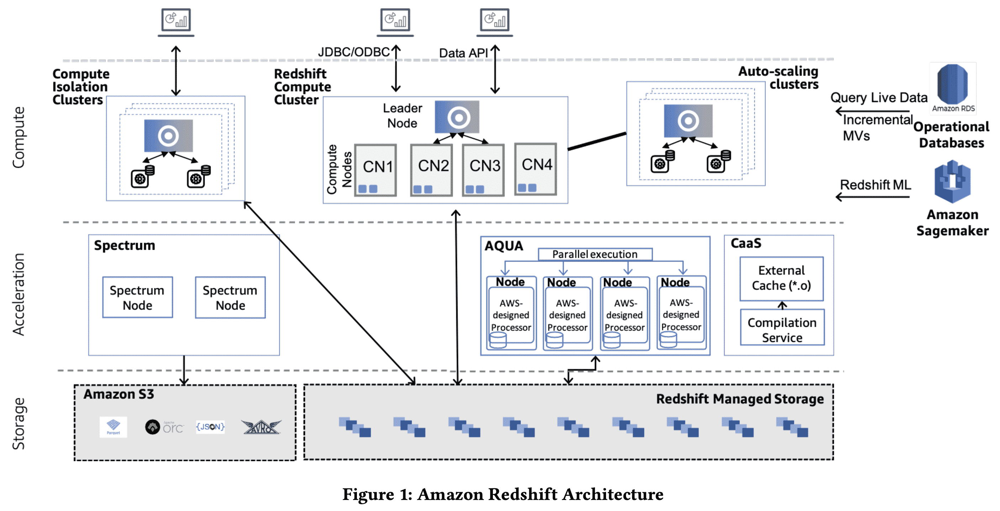
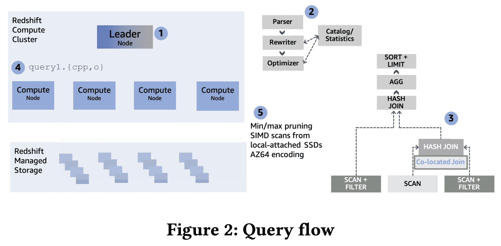
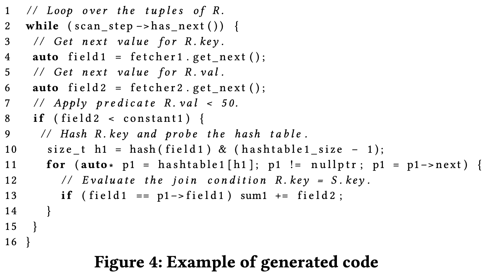
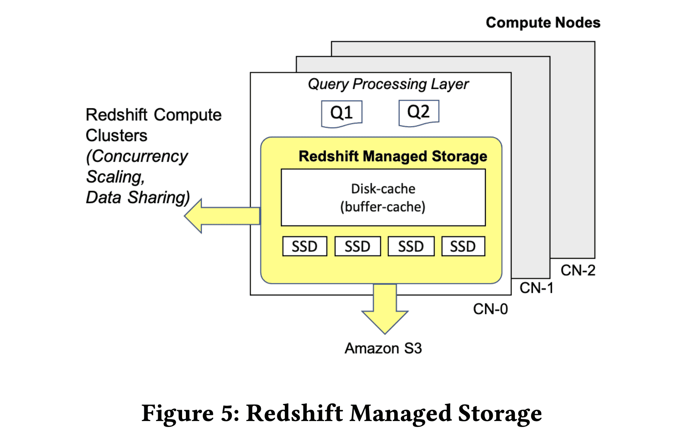

{{ page.description }}

# Amazon Redshift re-invented

## 1. Introduction

Redshift는 2013년에 런칭했고 현재는 매일 exabyte에 달하는 데이터를 처리한다. Redshift는 4개의 고객사의 니즈를 반영하는데 집중한다.

첫째로 customer는 복잡한 analytical query를 고성능으로 처리하길 원한다. Redshift는 코드 생성을 통하여 각 query fragement에 대한 database operator를 섞는 식으로 data warehouse중에서 높은 성능을 내고 있다. prefetching과 vectorized execution같은 state-of-the-art technique들로 redshift가 linear-scalable할 수 있다.

두번째로 고객사가 성장할수록 더 많은 data를 처리하길 원하며, data로부터 인사이트를 얻어가는 유저의 수도 점점 많아지게 된다. Redshift는 storage, compute layer에 대해 disaggregation을 하여 workload가 변화함에따라 scale이 가능하다. Redshift는 각 클러스터의 사이즈가 바뀌는것에따라 유연하게 scale up이 되며, 고객사의 workload의 spike에 대응하기 위하여 자동적으로 compute cluster를 추가하고 없애는 multi-cluster autoscaling을 통해 increased throughput에도 scale out할 수 있다. 유저는 서로 독립적인 클러스터에서 같은 dataset을 사용할 수도 있다.

세번째로 유저가 Redshift를 쉽게 사용하길 원한다. 따라서 Redshift는 ML 기반의 fine-tuning을 만들었다. Redshift는 workload management, physical tuning, MV(materialized view) refreshing등을 자동화했다.

네번째로 고객사가 Redshift를 다른 AWS 서비스와 쉽게 integrate하는 것을 기대한다. Redshift는 DynamoDB, Aurora같은 transactional database와 S3, Sagemaker에 federated query가 가능하다. Glue Eleastic View를 통해 DynamoDB, OpenSearch에 대한 MV도 만들 수 있고, SUPER type에대한 쿼리도 가능하다.

## 2. Performance That Matters

### 2.1 Overview

Redshift는 column-oriented MPP data warehouse이다. Redshift cluster는 single coordinator node와 여러 CN(compute node)가 있다. data는 S3기반의 Redshift Managed Storage에 저장되고, column-oriented format으로 computed node에 붙은 SSD에 캐싱된다. table은 모든 computed node에 replicate되거나, 모든 compute node에 여러 bucket으로 파티셔닝된다. 파티셔닝은 workload pattern, data characteristic이나 유저가 명시적으로 partioning style을 지정하는 것에 따라 바뀔 수 있다.

Redshift는 사용하기 쉬운 feature를 통해 유저가 business problem에 집중하게 해준다. concurrency scaling은 더 많은 processing power를 필요로 하는 상황에서 동적으로 scale-out 가능하다. data sharing은 유저가 격리된redshift cluster간에 read 목적의 data를  쉽게 공유할 수 있도록 해준다. AQUA는 FPGA를 이용해 performance를 올린다. Compilation-as-a-service는 Redshift fleet에서 실행되는 다양한 query fragement에 대해 optimized code를 생성하여 caching microservice로 만들어진다.

Redshift를 JDBC/ODBJC connection을 통해 접근하는것 말고도 Data API로도 접근가능하다. Data API는 driver configuration과 db connection 관리를 없애준다.

위 그림은 query flow를 나타낸다. leader node (1)가 query를 받아 파싱하고 최적화한다(2). Redshif의 cost based optimizer는 cost model에 cluster의 topology와 compute node간 data movement cost를 고려해서 optimal plan을 만든다. planning은 distribution key를 이용해서 불필요한 data movement를 피한다(3). 예를들어 equi-join에서 join key가 두 테이블의 dist key이면 join이 각 파티션에서 일어나도록 해서 data movement를 피한다.

planning 이후 WLM(workload management) component는 Redshift의 execution phase를 관리한다. admit이 되면 optimized plan은 blocking pipeline-breaking operation 또는 user에게 result를 리턴하는 inidividual execution unit으로 쪼개진다. 이 unit들은 순서대로 실행되고 이전에 실행된 unit의 intermediate result를 가져간다. 각 unit에 대해 한 pipeline에서 1개 이상의 (nested) loop을 여러 query operator를 interleaving하는 optimized cpp code를 생성하고, binary로 컴파일하여 compute node에 전달한다(4). columnar data는 local-attached SSD에서 스캔하거나 Redshift Managed Storage에서 가져온다(5). execution unit이 다른 compute node와 data 교환이 필요하면 이 unit은 network를 통해 pipeline으로 data를 교환하는 binary들이 만들어진다.

각각 generated binary는 각 compute node에 스케줄되고 고정된 수의 query process에서 실행된다. 각 query process는 다른 data subset에 대해 같은 코드를 실행한다. Redshift의 execution engine은 query performance를 높이기 위해 많은 optimization을 진행한다. scan하는 block 수를 줄이기 위해 $zone\ maps$를 통해 query predicate을 평가한다. 예를들어 block당 min/max value를 가지고 late materialization을 이용하는 small hash table이 있다. zone-map filtering 이후에 스캔되어야 하는 data는 balanced parallel execution을 위해 shared workunit으로 쪼개어진다. Scan은 빠른 decompression과 predicate을 효율적으로 적용하기 위해 vectorization과 SIMD processing을 이용한다. hash table을 생성할떄 만들어진 bloom filter는 scan할때 적용되어 downstream query operator가 프로세싱할 data volume을 더 줄인다. prefetching은 hash table을 더 효율적으로 쓰기 위해 활용된다.

### 2.2 Introduction to Redshift Code Generation

redshift는 대량의 데이터에 대해 복잡한 쿼리를 빠르게 실행하는데 집중하는 analytical database이다. Redshift는 query plan, 실행되는 schema에 대한 C++ code를 생성한다. generated code는 compile되고 binary는 compute node에 전달되어 실행된다. $segment$ 라고 불리는 각각의 compiled file은 $step$ 이라 하는 operator의 pipeline으로 구성된다. 각 segment와 segment의 각 step은 physical query plan을 구성한다. segment의 마지막 step만이 pipeline을 끝낼 수 있다.

위 그림은 `SELECT sum(R.val) FROM R, S WHERE R.key = S.key AND R.val < 50` 쿼리(scan → join → aggregate) 가 single node cluster에서 실행된다고 할때 생성되는 C++ code의 예시이다. segment는 base table `R` 을 스캔하고(line 3-6), filter를 적용하고(line 8), hash table `S` 를 조회하고(line 10), aggregation을 수행한다 (line 13). 실제 코드에선, table `S` 에서 hash table을 만들기 위한 segment와 compute node에서 partial sum을 합친 뒤 final result를 user에게 리턴한다. 생성된 코드는 CPU가 가능한한 최대한의 성능을 끌어낼 수 있는 working set을 맞추도록 되어있다. pipeline에서 여러 operator들에 의해 처리되는 tuple은 CPU register에 상주하고 있다가, tuple이 network로 보내지거나, main memory로 materialized되거나, disk로 flush된다.

code generation은 특정 query에 대해 생성된 모든 operator가 on-the-fly로 code가 되기 떄문에 interpreted code를 피하게 된다. stnadard volcano execution model은 iteator로 각 operator가 구현되어있고, function pointer나 virtual function이 각 execution step에서 operator를 선택한다. code generation model은 latency측면에서 tuple당 성능이 높다. Section 2.6에서는 compilation cost를 어떻게 줄였는지 설명한다.

### 2.3 Vectorized Scans

example code에서 `get_next()` 는 base table `R` 에 해당하는 field에 대한 next value를 리턴한다. 이런 function은 virtual이 아닌 inlined이며, base table을 generated codee로 바로 표현하기엔 너무 복잡하기 때문에 push-based 대신 pull-based로 동작한다. 이 model은 각 컬럼을 스캔할때 많은 state를 유지해야 하므로 상대적으로 비싸고, 많은 컬럼을 접근 하는 쿼리라면 CPU register를 많이 쓸 것이다. 또한 filter predicate evaluation(line 8)은 selectivity가 50%에 가깝다면 branch miss cost를 만들 수 있는 branching이 들어가기 때문에 pipeline이 stall될 수 있다. 각 fetcher는 decompression code의 많은 양을 inline으로 만들어 많은 컬럼을 접근할 때, compilation time이 느려질 수 있다.

이를 위해 Redshift는 generated code에 SIMD-vectorized scan layer를 추가했다. on-the-fly로 compile하는 다른 step과 다르게 vectorized scan은 precompile되고, 모든 data type, encoding, compression scheme을 커버한다. SIMD-vectorized scan layer의 output은 predicate에서 downstream이 접근하는 stack의 local array에 이르는 column value를 저장한다 (뭔말인지~). 또한 SIMD는 register pressure, compile되어야 하는 inline code 양을 줄여 wide table에 대한 성능을 대폭적으로 향상시킨다. 이 design은 scan step에서의 tuple chunk에 대한 column-at-a-time execution과 join, aggregation step에서 tuple-at-a-time execution을 합친다. column-at-a-time에 처리해야할 chunk size는 code generation시점에 접근해야할 column width와 L2(thread-private) cache의 크기에 따라 동적으로 결정된다.

### 2.4 Reducing Memory Stalls with Prefetching

Redshift의 pipelined execution은 outer stream join과 aggregate에 대한 intermediate result를 CPU register에 저장해서 materialize하지 않는다. 하지만 hash join, aggregation에서 hash table을 만들고 probing하고, update할때 Redshift는 hash table이 CPU cache에 들어가지 않으므로 cash miss가 계속 발생하게 된다. 이런 memory stall은 push-based model에서 줄여둔 materialization cost를 모두다 상쇄시켜버릴정도로 오버헤드가 크다. 해결책은 hash table을 파티셔닝해서 CPU cache에 맞춰 cache miss를 줄이는것이다. 하지만 매우 큰 테이블은 memory에 올라가지 못할 수 있으므로 record id료 column을 접근하지 못할 수 있다. Redshift는 downstream step에 필요한 모든 column을 전달하고 Cpu cache보다 hash table이 큰 경우 cache miss를 유발시킨다.

execution engine의 design에서 cache miss를 허용했으므로 stall은 prefetching을 통해 완화시킬 수 있다. prefetching mechanism은 generated code에 들어가고, hash table이나 bloom filter의 probing 시점에 prefetch instruction을 추가한다. L1 Cache에 circular buffer를 만들어두고 tuple이 도착하면 buffer에 넣어둔다. earlier tuple은 buffer에서 빠지고 downstream step으로 전달된다. buffer가 가득 차면 buffering하지 않고 tuple단위로 push, pop을 수행한다.

이 model은 materialization cost대신 cache-resident prefetching buffer를 만들어 hash table에서 prefetching의 이점과 memory stall을 줄였다. 이 tradeoff는 hash table이 CPU cache보다 클 때 언제나 이득인것을 확인했다. 만약 hash table이 CPU cache보다 충분히 작다면 prefetching code는 생성되지 않는다. 또한 tuple에 컬럼이 너무 많고 buffer에 tuple을 저장하는상황에도 비슷하게 적용된다. 반면에 prefetching code는 pipeline에서 multiple join이나 group-by aggregation이 있을때, 같은 nested loop에서 여러번 생성될 수 있으며 모든 prefetching buffer는 L1 cache보다 충분히 작도록 유지된다.

### 2.5 Inline Expression Functions

위 최적화는 단순한 data type을 join, aggregation하는 일반적인 케이스를 커버했지만, industrial database는 복잡한 datatype과 expression function을 지원해야 한다. generated code는 hashing, string comparison같이 간단한 operation에 대해 pre-compiled header를 포함한다. query의 scalar function은 query의 복잡도에 따라 inline이나 regular function으로 바뀐다. 대부분은 single tuple을 처리하기 때문에 scalar이지만 내부적으로 SIMD-vectorized 될 수도 있다.

Redshift에서 대부분 string function은 SIMD vectorized code가 된다. `LIKE` predicate은 intel CPU에서 `pcmpestri` instruction을 사용하여 한 instruction에서 16-byte pattern까지 substring matching이 가능하다. `UPPER(), LOWER()` 같은 function과 case-insensitive string comparison은 ASCII path를 활용하는 SIMD code를 쓰고, 복잡한 unicode character를 써야하는 경우에 fallback으로 optimized scalar code를 활용한다. code generation layer는 필요한 경우에 (더 빠르다고 판단될경우에) critical path에 존재하는 function call을 inline으로 만들게 된다.

### 2.6 Compilation Service

query가 Redshift에 전달되면 query processing engine은 optimized object file로 compile한다. 같거나 유사한 query를 실행시키면 compiled segment는 compilation cache에서 code를 재사용하여 compilation overhead를 줄인다. 하지만 여전히 first query는 latency가 길다. 일부 케이스에서 SLA miss를 만들 수 있고 특히 많은 양의 segment가 존재한다면 cluster resource에 contention이 발생할 수 있다.

compilation service는 Redshift cluster 밖의 compute, memory resource를 써서 compilation 속도를 높인다(그림 1 참조). compilation service는 compiled object를 exeternal code cache에 저장하여 여러 같은 query segement를 필요로하는 여러 compute cluster에 서빙할 수 있도록 한다. query processing동안 redshift는 query segment를 만들고 extenral compilation service를 통해 cluster local cache에 없지만 extennal code cache에 있는 segment를 가져온다. 현재 cluster들은 87%의 object file이 extennal code cache를 통해 object를 받아간다.

### 2.7 CPU-Friendly Encoding

performance는 CPU, disk usage와 직접적으로 엮여있으며, Redshift는 disk에 column을 저장할때 압축을 한다. Redshift는 LZO, ZSTD같은 byte-oriented compression algorithm과 type-specific algorithm을 지원한다. AZ64는 numeric, date, time type에서 쓰는데 ZSTD와 compression 속도는 비슷하고 decompression 속도는 더 빠르다.

### 2.8 Adaptive Execution

Redshift의 execution engine은 runtime에 execution statistics를 바탕으로 generated code나 runtime property를 바꿔 성능을 올린다. 그중 한 케이스는 Bloom filter를 통해 dynamic optimization을 한다. large table을 join하는 쿼리에서 많은 양의 data가 network를 타거나, memory가 부족해 disk를 사용하거나, io 병목이 쿼리 성능에 악영향을 미치는데, Bloom filter를 통해 성능을 올린다. Bloom Filter는 join relation과 매치되지 않는 row를 필터시켜 network나 disk usage를 높이는 data transfer를 줄인다.

Runtime에 join operation은 Bloom filter를 만드는데 사용하게 될 메모리를 process된 데이터 양에 따라 결정한다. 예를들어 join이 disk를 쓰게되면 join operator는 더 큰 bloom filter를 만들어 더 낮은 FP rate을 얻을 수 있다. 이런 decision은 Bllom filter의 pruning power를 높이며 probing phase에서 spill을 줄인다(데이터가 많이 가는것을 줄인다는 의미). 비슷하게 execution engine은 runtime에 각 bloom filter의 effectiveness를 모니터링하고 filter가 성능에 악영향을 미치면 disable 시킨다. 그리고 ineffective 하다고 판단한 bloom filter가 effective해질 수 있다고 판단되면 다시 enable시킨다.

### 2.9 AQUA for amazone Redshift

AQUA(Advanced Query Accelerator)는 Redshift Managed Storage의 off-cluster caching layer와 복잡한 scan,aggregation에 대해 push-down accelerator의 역할도 한다. AQUA는 local SSD에 hot data를 캐싱하여 S3같은 외부 service에서 데이터를 받아오는 latency를 줄이고, Redshift compute node에서 cache storage에 데이터를 채울 필요성을 줄이게 된다 (미리 채워넣어주므로). network bottleneck을 줄이기 위해 AQUA는 storage interface가 아닌 functional interface를 제공한다. Redshift는 AQUA에 사용 가능한 scan, aggregation operation을 식별하고 AQUA에 이런 요청을 밀어넣고 AQUA는 cached data를 리턴해준다. 또한 AQUA는 data-center scale의 computing storage이다. AQUA의 multi-tenancy를 통해 효율적인 리소스 사용(특히 SSD)을 하며, cluster resize, pause/resume 같은 예측할수없는 cluster transformation 에서도 문제없다.

AQUA를 최대한 빠르게 하기 위해 AWS에서 compression, encryption을 하드웨어단에서 처리하는 Nitro ASIC와 filtering/aggregation을 고성능으로 처리하는 FPGA를 이용하는 커스텀 서버를 만들었다. FPGA는 query 단위로 프로그램되지 않고 pipelined primitive에 db type, operation을 custom multi-core VLIW processor를 구현했다. 각 node의 compiler는 operation들을 local CPU(Nitro ASIC)나 accelerator(FPGA)로 매핑한다. 이를 통해 복잡한 operation이 FPGA에서 효율적으로 수행되어 성능을 높인다.

### 2.10 Query Rewriting Framework

Redshift는 DSL based QRF(Query Rewriting Framework)를 만들었다. QRF의 기능 Redshift가 빠르게 customer needs에 응답하는 rewriting, optimization을 제공한다. 특히 QRF는 union, join, aggregation에 한 execution ordering을 최적화하는 rewriting rule을 도입했다. QRF는 query decorrelation(where절에 subquery넣은 상황을 join으로 바꾸는것이 decorrelation중 하나)에서도 수행되는데, query decorrelation의 execution model은 반복되는 subquery 실행보다 large scale join에서 아주 효율적이다.

QRF의 또 다른 기능은 incremental MV(materialized view) maintenance (Section 5.4)에 필요한 script를 생성하거나, MV를 사용할때에도 쓴다. QRF의 key intuition은 rewriting이 pattern matcher와 generator로 추상화 할 수 있다는 것이다(pattern matcher는 query representation(AST or algebra)에서 특정부분을 매칭시키고 추출하는것, generator는 pattern matcher에서 추출된부분에서 새 query representation을 만드는것). 또한 QRF를 통해 nested, semistructured data processing에서도 rewriting을 도입했고(Section 6.4), MV scope를 확장 할 수 있었다.

## 3. Scaling Storage

Redsfhit의 storage layer는 memory, local storage, S3 까지이고, 모든 data lifecycle operation(commmit, caching, prefetching, snapshot/restore, replication, disaster-recovery)을 포괄한다. storage는 durability, availability, scalability, performance를 보장하는 transformation을 수행한다

- **Durability, Availability**: Storage layer는 모든 commit과 모든 data를 S3에 저장한다. S3을 활용하는건 Redshift가 compute cluster로부터 data를 디커플링 하게 해준다. 또한 data를 durable하게 만들고 availability를 높여준다
- **Scalability**: S3을 기반으로 사용하므로 unlimited scale이라고 생각할 수 있다. RMS(Redshift Managed Storage)는 성능을 최적화하고 storage tiering을 장동적으로 관리하기 위해 쓰이는 data block temperature, data block age, workload pattern의 이점을 활용하게 된다.
- **Performance**: Storage layer는 memory, algorithming optimization까지 확장한다. 동적으로 prefetch하고, in-memory cache에 넣고, commit protocol이 incremental하도록 최적화한다.

### 3.1 Redshift Managed Storage

RMS(Redshift Managed Storage)는 multiple AZ에서 1년에 9 nines의 durability와 2 nines의 availability를 목표로 디자인되었다. RMS는 는 transaction metadata, user data를 둘다 관리한다. compute node는 local cache로 고성능 SSD를 사용한다. Redshift는 local SSD 성능의 이점을 활용하기 위해 automatic fine-grained data eviection, intelligent data prefetching같은 workload pattern을 활용한 최적화를 수행한다.

위 그림은 memory cache에서 S3에 들어가는 commited data까지를 보여준다. S3의 snapshot은 logical restore point로 사용된다. Redshift는 특정 테이블, 아니면 클러스터전체를 restore할 수 있다. RMS는 S3의 data access의속도를 prefetching하는것(data block을 memory에 올려두고, local SSD에 캐싱)을 통해 빠르게한다. RMS는 모든 block에 대한 access를 트래킹하여, relevant block이 local에서 접근할 수 있도록 cache replacement를 튜닝한다. 이 정보는 customer가 scale up을 하는게 이익이 있을지 판단하는데 도움을 준다. RMS는 Redshift가 cluster resizing을 할때 metadata operation만으로 resize가능하게 해주는데, Redshift의 compute node가 stateless이고, RMS가 data block을 가지고 있기때문에 data를 신경쓰지않고도 resize를 할 수 있게 해준다. SSD가 cache로 동작하는 RMS의 tiered nature는 hardware를 쉽게 바꿀수 있게 해준다. RMS를 지원하는 Redshift RA3 instance는 최대 16PB까지 제공한다. in-memory disk-cache size는 query의 필요 메모리와 성능사이에서 밸런싱을 하며 조절된다.

table data는 $data\ slice$로 파티션되고 block들의 logical chain으로 저장된다. 각 data block은 block header에 identity, table ownership, slice information이 정의되고, $superblock$이라는 in-memory construct에 indexing된다. superblock은 다른 filesystem과 비슷한 indexing structure이다. Query는 zone map을 이용하여 superblock을 스캔해 필요한 block을 가져온다. 또한 superblock은 live query가 소유하는 data blcok에 대한 query tracking information을 저장한다 (무슨용도지?).

Transaction은 RMS에 의해 S3으로 sync commit된다. 이건 여러 cluster가 consistent data를 transactional하게 접근하도록 만들어준다. 다른 AZ에서 S3으로 write하는건 batching data write과 synchronization barrier를 통해 latency를 숨기는 방식으로 동작한다(가물가물..). state는 하나의 cluster에서 소유하지만, concurrent reader/writer는 RMS위에서 computing 을하므로 scalable하다. concurrent cluster는 query를 처리하기 위해 snapshot isolation과 priortized on-demand fetching을 바탕으로 동작하게 된다. main cluter에서 지워진 data는 모든 reader reference가 사라지면 S3에서 GC된다. RMS는 TTL과 on-demand delete를 이용해 data가 transaction rollback을 유발하지 않도록 한다.

data가 언제나 S3에 저장되므로 local SSD lose는 data durability에 문제가 되지 않는다. Redsfhit는 disaster recovery에서도 cluster를 같은 AZ나 다른 AZ에 띄우면 되기 때문에 RPO = 0을 제공해준다.

### 3.2 Decoupling Metadata from Data

data에서 metadata를 decoupling하는건 $Elastic\ Resize$ 와 $Cross\ Instance\ Restore$ 를 할수있게 해준다. $Elastic\ Resize$, $Cross\ Instance\ Restore$모두 한 cluster config에서 다른 cluster로 metadata를 합쳐야 하기때문에, data와 metadata를 분리하게되면 효율적인 구현을 할 수 있다. Elastic Resize는 customer가 node나 storage를 쉽게 추가/제거할수 있는 reconfigure를 할 수 있게 해준다. Cross Instance Restore는 user가 어떤 instance type을 가진 cluster에서 생긴 snapshot을 다른 instance type을 가진 cluster로 복구할수 있게 해준다.

Redshift는 위 feature를 아래처럼 구현했다. 첫번째로 data copy가 S3에 저장되도록 보장한다(Commit). 이건 multiple hardware failure같은 드문 상황에서도 복구간으하게 해준다. reconfigure전에 Redshift는 balanced cluster를 만들면서 최소한의 data movement를 만드는 reconfigure plan을 만든다. 또한 data에 대한 count, checksum을 저장하고, reconfiguration이 끝난 후에 검증할때 쓴다. restore에서는 table, block, row 수, 사용한 bytes, data distribution을 snapshot에 저장한다. restore후에 count와 checksum등을 검증하고 쿼리를 처리한다.

### 3.3 Expand Beyond Local Capacity

Redshift는 cluster의 storage capacity를 높이기위해 S3을 이용하고 local memory, SSD를 cache로 써서 scalability를 높인다. 이를 위해 super block이 더 큰 capacity를 가질수 있도록 하고, local layout이 더 많은 metadata를 지원하도록 수정하고, rehydration/eviction을 하는 등의 수정을 했지만 가장 중요한 tiered storage cache, dynamic buffer cache에 대해 설명할 것이다.

tiered storage cache는 data block의 access count를 저장해서 각 cluster가 각각의 local에서 working set을 유지하도록 한다. 각 compute node에서 local disk에 저장된 data block을 트래킹하기 위해 2-level clock-based cache replacement policy를 사용한다. 이 cache policy는 cold data block $B$(유저가 처음으로 쿼리한 데이터)를 low-level clock cache에 저장하고, access할때마다 $B$의 ref count를 증가시킨다. $B$가 hot해지면 cache policy에 의해 high-level clock cache로 가게된다. eviction동안 각 block의 ref count는 clock pointer에 의해 감소된다. $B$의 ref count가 0이 되면 high-level에서 low-level로 가거나, cache에서 eviction된다.

RMS는 cluster reconfiguration이후에 rehydration을 위해 tiered storage cache를 이용하기도 한다. compute node는 query에서 접근할 가능성이 높은 data block을 compute node의 local disk로 rehydrate한다.

또한 성능을 높이기 위해 tiered storage cache위에 dynamic disk cache를 올려 hottest block을 memory에 저장한다. 또한 disk cache는 query에서 생성된 temporary block이나 새 data block을 캐싱하기도 한다. disk cache는 available mem이 많거나 부족하거나 하는상황에 동적으로 scale up/down을 한다.

### 3.4 Incremental Commits

S3을 primary storage 로 사용하려면 data footprint와 비용을 줄이기 위해선 incremental commit이 필요하다 (in-place update가 안되므로). RMS는 last commit이후에 발생한 data change만 캡쳐하고 commit log에 추가한다. persistent data structure또한 incremental하게 update된다. 기존 redirect-on-write protocol을 대체한(얘는뭐지) redshift의 log-based commit protocol은 persisted superblock이 change log를 레코딩하는 persistent structure와 in-memory structure를 디커플링시킨다. log-based commit protocol은 random io를 sequential log append로 바꾸기 때문에 commit performance를 40%까지 올린다. RMS가 multi AZ에서도 high-availability를 가지므로 metadata는 global distributed compute위에서 공유될 수 있다. log-structured metadata는 data sharing이나 concurrency scaling에서 비용을 줄이는데 이런 feature들은 consistent data를 접근할때 log를 local superblock에 반영하는식으로 transactional하게 접근하게 된다.

### 3.5 Concurrency Control

Redshift는 reader와 writer간 blocking이 생기지 않고, writer들끼리만 blocking이 생기는 MVCC(Multi-Version Concurrency Control)을 구현했다. 각 transaction은 이전 committed transaction들이 모두 반영된 consistent snapshot을 바라본다. Redshift는 serializable isolation을 강제해서 lost update나 read-write skew같은 data anomaly를 피한다.

이전 구현은 serializability를 보장하고 transaction cycle을 피하기 위해 transaction간 dependency를 트래킹하는 graph-based mechanism을 이용했다. 이 방식은 다른 concurrent transaction이 commit될때까지 기존에 commit된 transaction의 state를 트래킹해야 한다. 하지만 최근에 snapshot isolation 위에서 동작하는 SSN([Serial Safety Net](https://event.cwi.nl/damon2015/papers/damon15-wang.pdf)) 기반의 새 design을 적용했다. SSN은  committed transaction에 대해 summary information만 들고 있어 memory efficient하고, Serializable Snapshot Isolation보다 빠르며 당연히 serializability도 보장한다.

## 4. Scaling Compute

Redshift는 다양한 workload를 서빙해야하며 다양한 requirement가 있다. ETL workload는 strict latency SLA가 필요하며, interactive dashboard는 concurrency, response time이 좋아야 한다.

### 4.1 Cluster Size Scaling

$Elastic\ Resize$는 customer가 compute node를 빠르게 추가하거나 제거할 수 있게 해준다. $Elastic\ Resize$가 data partition assignment를 reorganize 하고 모든 compute node가 data partition 수에 밸런싱되도록 한다. 즉 data shuffling이 일어나지 않고 metadata operation만 수행된다. resize 이후에 담당하는 compute node가 변경된 data partition은 background로 S3에서 rehydrate된다. 물론 hot data는 on-demand로 가져간다. $Elastic\ Resize$ 이후에 consistent query performance를 유지하기 위해 data partition과 compute parallelism을 디커플링 시켜 한 data partition을 여러 compute process가 쓸 수 도 있고, 한 compute process가 여러 data partition을 쓰게 될 수도 있다.

### 4.2 Concurrency Scaling

concurrency scaling은 유저가 single cluster가 제공하는 concurrency보다 더 많이 필요로 할때 동적으로 scale-out 할 수 있게 해준다. concurrency scaling은 concurrent query 수가 증가함에 따라 알아서 처리해준다. 따라서 유저는 하나의 cluster endpoint에서 높은 concurrency로 쿼리를 할 수 있게 된다. 현재 compute resource를 다 쓰고 있는 상태에서 새 query가 queue로 들어오면 Redshift는 추가적인 concurrency scaling compute cluster를 추가하고 queued query를 라우팅한다. concurrency scaling cluster는 RMS에서 rehydrate을한다. 

### 4.3 Compute Isolation

Redshift는 유저가 secure하고 쉽게 다른 redshift cluster, aws account간 data를 공유할 수 있게 해준다. schema, table, view, udf까지 공유가능하다. consumer cluster가 shared object를 쿼리하면 1개이상의 metadata request가 생긴다. metadata request는 consumer가 data access권한을 가지고 있을때에만 생긴다. 각 metadata request는 directory service, proxy layer를 거치고 proxy는 authentication, authorization을 수행하고 producer에 요청을 전달한다. consumer cluster가 metadata를 받으면 RMS를 통해 data block을 받고 query를 수행하게 된다. data block은 consumer cluster에 캐싱된다.

## 5. Automated Tuning and Operations

Redshift는 cluster maintenance, monitoring, backup등 많은것들이 자동화 되어있지만, vaccum이나 dist key같은 것들은 여전히 직접 maintenance를 해야했다. 이런 것들도 자동화하기 위해 ml based automation을 도입했다.

현재 Redshift는 user workload에 영향을 미치지 않는 선에서 background로 vaccum, analyze, MV refresh등을 수행하고 있다. automatic workload management는 workload 특징에 따라 query concurrency나 memory를 설정한다. 또한 user workload를 모니털이하고 분석해서 성능향상의 기회를 찾아낸다. 예를들어 자동으로 dist key, sort key를 바꾸는 것이다. forecasting을 이용해 node failure, cluster resumption, concurrency scaling에 대해 빠르게 node를 추가하도록 해서 query latency와 down time을 줄인다.

### 5.1 Automatic Table Optimizations

Redshift는 ATO(Automatic Table Optimization)을 통해 dist, sort key를 자동으로 선택한다. ATO는 주기적으로 optimized query plan, cardinality, predicate selectivity를 수집하여 dist,sort key 추천을 생성한다. 또한 각 추천에 대해 expected benefit을 추정해서 가장 높은 추천만 보여준다.

dist key advisor는 주어진 workload에 대해 network cost를 최적화 하는것을 목표로 한다. dist key는 쿼리에 참여하는 모든 table들을 전체적으로 봐야한다 (join이 중요하므로). 따라서 ATO는 workload의 모든 join에서 weighted join graph를 만들어 전체 network distribution cost를 최소로 하는 dist key를 선택한다.

sort key advisor는 disk에서 읽어가는 data volume을 줄이는 것을 목표로 한다. 주어진 query에서 ATO는 scan opeation의 selectivity를 분석하고 zone map filtering(data block pruning같은 것)의 효율을 향상 시킬 수 있는 sort key를 추천한다.

추천을 적용할때 Redshift는 유저에게 직접 apply를 치게 하거나, 주기적으로 Redshift가 background에서 반영하는 것이다. worker는 cluster가 idle할때 추천을 순차적으로 실행하다 cluster의 로드가 증가하면 backoff를 한다.

### 5.2 Automatic Workload Management

queued query를 실행하는건 현재 실행중인 query들에게 영향을 미친다. 너무 적게 실행시키면 queued query의 latency가 늘어나고 resource를 너무 적게 사용하게 되며, 너무 많으면 resource utilization에 악영향을 주게된다. response time과 throughput을 향상시키기 위해 Redshift는 ML을 이용해 query resource requirement를 예측하고 동시에 실행되는 query를 조정하는 queueing theory model을 적용했다.

내용이 쏴쏴라 생략..