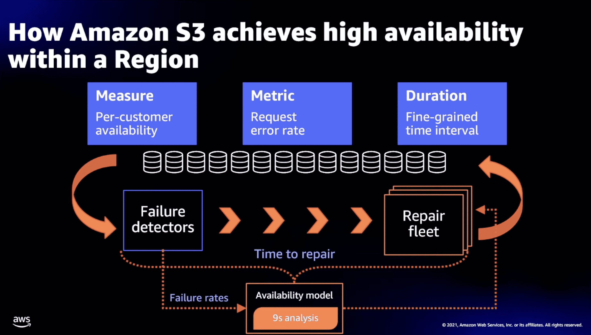
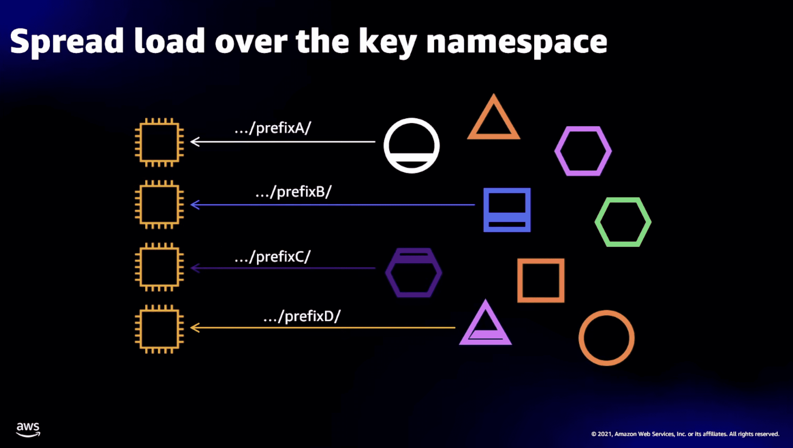
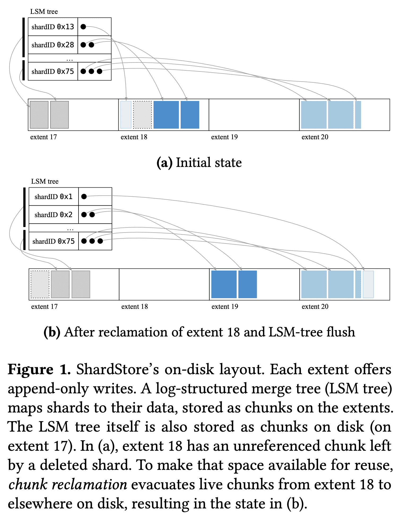
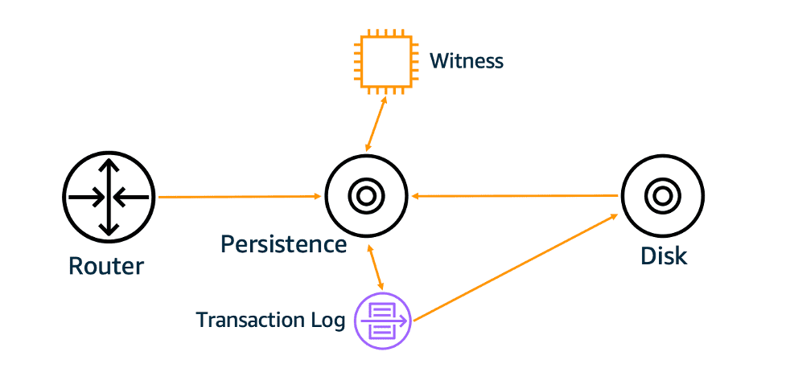

**{{ page.description }}**

# S3

GFS 에 얹어서 생각해보면 될듯 

[https://www.youtube.com/watch?v=4_hCFprOpaQ](https://www.youtube.com/watch?v=4_hCFprOpaQ)

HDD

- 120 IOPS정도 나옴
- density가 높아져서 1HDD당 capacity가 늘어남
- → 따라서 실질적인 hdd의 속도는 내려가고있다고 말할수있음

workload

- case 1
    - bucket size 3.7PB
        - 3.7pb / (20tb/hdd) = 185 hdd
    - peak throughput 2.3M req
        - 185 hdd * 120iops = 22200 iops.. 턱없이모자라다
        - 19000 hdd 필요
    - 많은 hdd에 넣어서 높은 throughput을 만들어야함
- case 2
    - 28PB → 1400hdd & 168000IOPS
    - 8.5k req/s → 차고넘친다
    - 많은 hdd에 넣는데 대부분 traffic은 idle함

drive level에서 hot spot이 생기지않게하려면?? 

- erasure coding
    - 여러 chunk로 분할, parity set 생성 → subset만으로 original chunk생성가능, flexible sharding이 가능해지고 durable해짐
    - load balancing이 가능해짐
    - chunk가 매우 작은양의 데이터를 가지므로 특정 워크로드가 drive를 hotspot으로 만들지않게됨

[https://www.youtube.com/watch?v=FJJxcwSfWYg](https://www.youtube.com/watch?v=FJJxcwSfWYg)

[https://assets.amazon.science/07/6c/81bfc2c243249a8b8b65cc2135e4/using-lightweight-formal-methods-to-validate-a-key-value-storage-node-in-amazon-s3.pdf](https://assets.amazon.science/07/6c/81bfc2c243249a8b8b65cc2135e4/using-lightweight-formal-methods-to-validate-a-key-value-storage-node-in-amazon-s3.pdf)

## ShardStore

sharedstore: S3 내에서 storage node로 사용하는 KV store. 각 storage node는 object를 저장하며 replicate됨. 

### Design Overview

key: shard identifier, value: object data, LSM tree로 구현되었으며 data는 LSM tree에 있지않음(write amplification을 일으키므로)

(실제 데이터)chunk list를 가리키는 pointer가 LSM tree value가 됨. 실 데이터는 그림의 extent에 저장됨. extent는 $write\ pointer$를 유지해서 sequential write을 하게 만듦. ShardStore는 여러 extent로 data를 뿌림. 이 방식은 flexible하지만 crash consistency가 복잡해짐

**Chunk storagere/clamation**

LSM tree를 포함한 모든 data는 chunk에 저장됨. chunk store abstraction은 chunk에서 extent로의 매핑을 정렬함. chunkstore는 `put(data) -> locator, get(locator) -> data` 두개의 interface를 가짐. locator는 chunk identifier임. single shard는 한개이상의 chunk로 구성됨.

extent가 append-only이므로 shard를 지우는것이 바로 free space로 Reclamation을 하지못함. 위 그림에서 extent 18은 회색 점선으로 그려진 deleted chunk가 있음. free space를 확보하기위해 chunk store는 GC를 하는 background task가 돌아감. reclamation은 extent가 저장하고 있는 모든 chunk를 검색해서 각 chunk에 해당하는 LSM tree index를 lookup함. chunk가 쓰이고있으면 새 extent로 옮기고 index도 옮김. unreference chunk는 버려짐. extent가 전체다 스캔되면 write pointer가 초기화되어 reuse할수있게됨. extent의 write pointer를 초기화하는것은 당연히 extent에 있는 모든 데이터가 실제로 제거되지않았더라도 읽을수 없게 되는것임. 따라서 chunk store는 chunk evacuation, index update, extent reset으로 인해 crash-consistent ordering을 해줘야만 함. 또한 LSM tree도 chunk로서 extent에 저장됨. LSM compaction같은 maintenance operation은 요 chunk를 unused로 만들 수 있음. 

**RPC Interface**

shardstore는 storage host 위에서 여러 hdd를 관리함. 각 disk는 isolated failure domain이며 독립적인 KV store임. client는 shardstore와 shard ID(target disk)를 가지고 RPC interface를 통해 request를 전달함. RPC interface는 request-plane call과 migration, repair같은 control plane operation을 제공함.

**Append-only IO**

shardstore는 zoned/conventional disk를 지원하기 위해 append implementation을 가지고있다. 각 extent에 대해 write pointer를 in-memory로 관리하고, extent append operation을 write syscall로 변환하고, 각 extent의 write pointer를 super block에 주기적으로 flush한다.

## **Diving Deep on S3 Consistency**

[https://www.allthingsdistributed.com/2021/04/s3-strong-consistency.html](https://www.allthingsdistributed.com/2021/04/s3-strong-consistency.html)

s3 metadata subsystem에 HA를 위해서 사용하는 caching이 일부 케이스에서 eventually consistent write을 하고있다. 즉 system이 언제나 available하더라도 때떄로 API call이 old version object를 리턴하고있었다. 하지만 data processing application은 strong consistency를 요구한다.

per-object metadata는 s3 subsystem에 저장. 이 subsystem은 get, put, delete 요청의 data path이고 list, head 도 처리함. 이 system으 중요부분은 metadata를 저장하는 persistence tier. persistence tier는 resiliency를 위해 caching을 사용중. s3은 cache에 문제가 있떠라도 성공해야함. 즉 극히 일부 케이스에서 cache를 거치지않거나, 거치는 두개의 path가 생겨서 inconsistency가 발생했음. cache를 제거하는것은 성능이 나빠지게됨. 이문제를 CPU cache coherence protocol을 구현해서 strong consistency를 만듦.

**Cache Coherence**

stong consistency는 metadata cache가 strong consistent하게 만들면 됨. 이전에 persistence tier에 [at-least-once event notification system](https://docs.aws.amazon.com/AmazonS3/latest/userguide/NotificationHowTo.html) 과, [repliation time control](https://aws.amazon.com/blogs/aws/new-cross-region-replication-for-amazon-s3/) 을 붙였는데. 이것들이 object단위 operation order를 알수있게 해주어 cache coherence protocol에 활용했음.

metadata subsystem은 object metadata가 stale해지는 cache view를 감지함. 위 그림의 witness가 object change가 생길때마다 noti를 write해서 read 도중 barrier역할을 해서 cache의 stale여부를 알수있게함. stale하면 invalidation시키면그만.

위 cache conherence protocol을 붙이게되면 1) protocol이 correct함을 검증해야하고, 2) high availability를 깨지 않아야함. → 아마 formal method 이야기?