{{ page.description }}

# Spanner (OSDI ‘12)

[Spanner, TrueTime & The CAP Theorem](https://storage.googleapis.com/pub-tools-public-publication-data/pdf/45855.pdf)

[Google’s Spanner is all about time](http://radar.oreilly.com/2012/10/google-spanner-relational-database.html)

[Spanner, 2PC+2PL over Paxos](https://www.mydistributed.systems/2020/08/google-spanner.html)

[Serializability](https://www.mydistributed.systems/2020/08/distributed-transactions-serializability.html)

[Evolution and Future Directions of Large-scale Storage and Computation Systems at Google](https://research.google/pubs/pub44877/)

[GOOGLE SPANNER: BEGINNING OF THE END OF THE NOSQL WORLD?](https://wp.sigmod.org/?p=2153)

[Life of Cloud Spanner Reads & Writes](https://cloud.google.com/spanner/docs/whitepapers/life-of-reads-and-writes)

[MIT 6.824: Lecture 13 - Spanner](https://timilearning.com/posts/mit-6.824/lecture-13-spanner/)

[NewSQL database systems are failing to guarantee consistency, and I blame Spanner](https://dbmsmusings.blogspot.com/2018/09/newsql-database-systems-are-failing-to.html)

[CAP Twelve Years Later: How the "Rules" Have Changed](https://www.infoq.com/articles/cap-twelve-years-later-how-the-rules-have-changed/)

[Living Without Atomic Clocks | Where CockroachDB & Spanner Diverge](https://www.cockroachlabs.com/blog/living-without-atomic-clocks/#how-does-cockroachdb-choose-transaction-timestamps)

- challenges
    - read without any communicaiton (local replica)
    - transactions accross shards
    - transactions must be serializable
- read/write transactions
    -

## 1. Introducction

Spanner는 scalable, globally-distributed database이며, cross-datacenter replication도 가능하다. bigtable의 versioned KV 에서 한단계 더 발전한 temporal multi-version 이다. transaction과 SQL based query도 지원한다.

Spanner만의 feature는

1. application이 어떤 datacenter에서 어떤 data를 저장하는지, data가 user와 얼마나 떨어져있는지 (read latency), 각 replica간 얼마나 멀리 떨어져 있는지(write latency), 몇개의 replica를 쓸건지(durability, availability, read performance) 등을 조정할 수 있으며, datacenter간 data 전달은 system이 resource balancing을 위해 dynamic하게 수행한다.
2. distributed database에서 구현하기 어려운 feature들을 제공한다. r/w에 대해 external consistency를 제공하고, timestamp로 전체 db에 걸친 global consistent read가 가능하다. 이를 통해 ongoing transactions이 있어도 consistent backup, consistent MapReduce, atomic schema update가 가능하다.
external consistency: transaction의 commit 순서는 유저가 transaction을 실행하는 순서와 일치

## 2. Implementation

한 spanner deployment를 $universe$라고 부른다. global로 data를 저장하므로, running universe는 몇개밖에 없다. $zone$은 bigtable service의 deployment 단위이며 system이 동작할때에도 zone을 추가/제거 할 수 있다. zone간의 data replication도 가능하다. 한 data center에 여러개 zone이 phsically isolated될 수 있다.

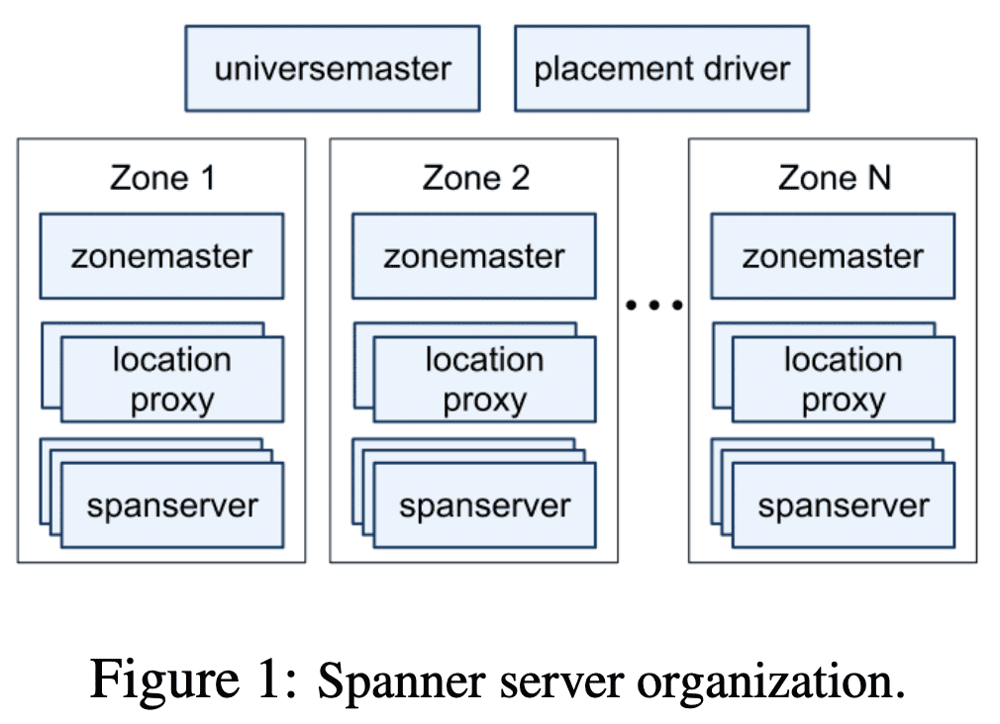

각 zone에 있는 $zonemaster$는 data를 몇천개의 $spanserver$에 할당하고, $spanserver$는 data serving을 한다. $location\ proxy$는 client가 data를 가진 spanserver를 찾을 수 있게 해준다. $universe\ master$는 singleton이며 모든 zone의 status를 수집한다. $placement\ driver$도 singleton이며, spanserver들과 주기적으로 communicate하면서 load balancing이나 replication constraint가 바뀌는 것으로 인해 data movement가 필요한 것들을 찾아낸다.

### 2.1 Spanserver Software Stack

각 spanserver는 100~1000 개의 $tablet$ 을 관리한다. tablet은 아래의 mapping이다.

 $(key:string,\ timestamp:int64) \rightarrow string$

bigtable과 다르게 spanner는 timestamp를 data에 할당하는데 이건 spanner가 KV store보다 multi-version DB에 가깝게 만든다. tablet state는 Colossus라는 GFS successor에 B-tree와 비슷한 file과 WAL에 저장된다.

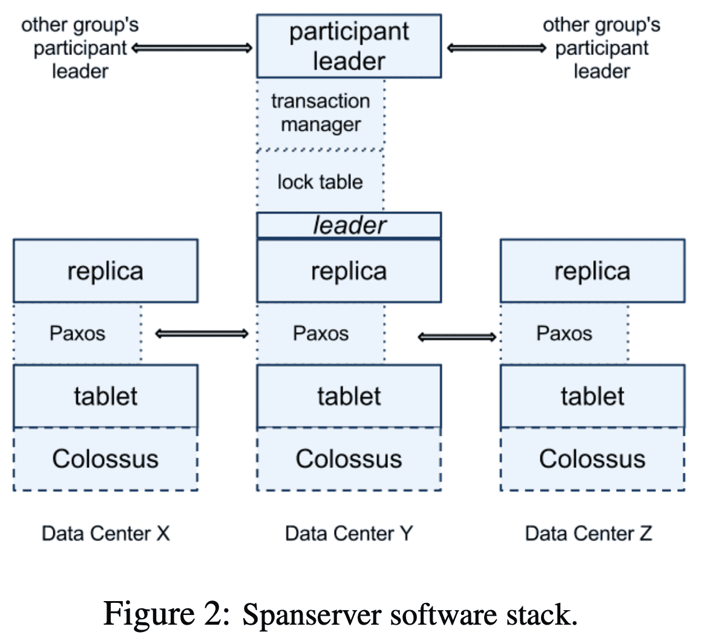

각 spanserver는 각 tablet을 관리하는 Paxos state machine을 쓴다. Paxos state machine은 자신이 관리하는 tablet에 대한 metadata, log를 저장한다. Paxos implementation은 long-lived leader, time-based leader lease를 지원한다. write할때 log는 tablet log, paxos log 두개가 생기는데, 이건 하나만 쓸 수도 있다. Paxos는 pipeline되므로 WAN latency가 있어도 throughput이 올라가면서, write order는 Paxos가 보장해준다.

Paxos는 consistently replicated mapping을 만드는데 쓰인다. 각 replica의 mapping (이 section초반에 나옴)은 tablet에 저장되며, write는 Paxos leader에서만 시작된다. read는 up-to-date replica에서 가능하다. replica set은 $Paxos\ group$이라 불린다.

paxos leader는 two-phase locking을 위한 state를 가지는 $lock\ table$을 들고있다. lock table은 key range에 대해 lock state를 가진다. optimistic concurrency control은 conflict이 생기는경우 Long live transaction의 성능이 매우 떨어지는데, 이런 transactional read같이 sync가 필요한 operation은 lock을 잡고 수행해서 성능을 보장한다. sync가 필요없는 operation은 lock table을 쓰지않는다.

또한 paxos leader의 $transaction\ manager$는 distributed transaction을 위해 쓰인다. transaction manager는 $participant\ leader$이고, 다른 replica는 $participant\ slave$이다. 한 paxos group에서 수행가능한 transaction이라면, paxos와 lock table이 transacionality를 제공해주므로 transaction manager를 거칠 필요가 없다.

여러 paxos group에 걸친 transaction이면 각 paxos group의 leader들이 two-phase commit을 수행한다. transaction에 참여하는 paxos group중하나가 coordinator group이 되고, 이 group의 leader가 $coordinator\ leader$, 이 group의 slave가 $coordinator\ slave$이다. 각 transaction manager state는 paxos group에 저장, replicate된다.

### 2.2 Directories and Placement

common prefix를 가지는 인접한 key들의 set을 $directory$로 만들 수 있다 (사실 용어는 bucket이 더 어울림). directory는 application이 key들에 대해 locality를 가지도록 해준다. directory는 또한 data placement의 단위이며 같은 replication config를 가진다. paxos group간 data가 이동할때 directory단위로 움직인다. data movement는 load balancing을 할때, 같이 자주 접근되는 directory를 한 group오로 옮길때 등의 이유로 directory를 옮긴다. directory가 옮기는 와중에도 operation은 available하다. bigtable tablet과 달리 spanner tablet은 row space에서 인접할 필요는 없으며 같이 자주 접근되는 tablet들을 한데 묶기 위해 이런 디자인을 했다.

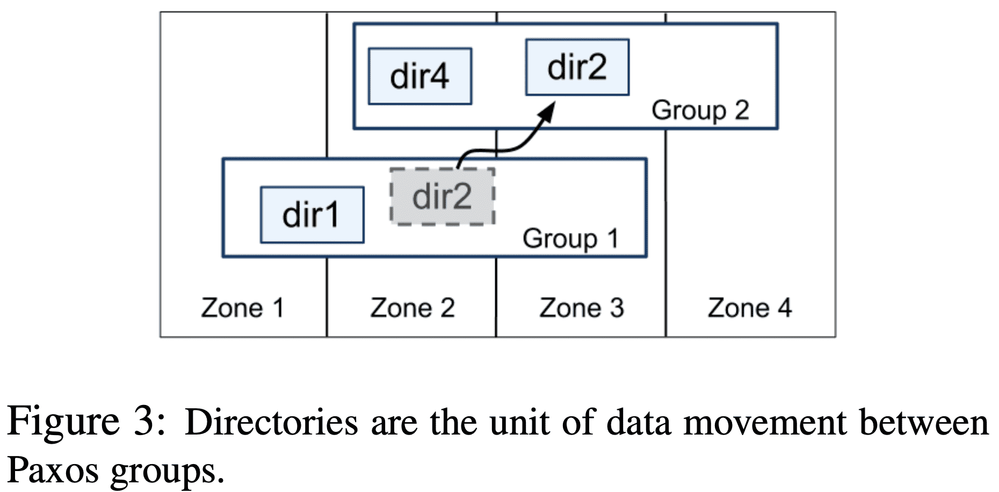

$Movedir$은 paxos group간 directory를 옮겨주는 backgroud task이며, replica를 추가/제거 할때도 쓰인다. background task이므로 ongoing r/w를 blocking하진 않는다. 하지만 data를 옮긴 사이에 조금의 data change가 생기는경우엔 transaction을 통해 src/dst paxos group에서 data를 옮기고 metadata를 업데이트한다.

또한 directory는 application이 replication을 설정할 수 있는 단위이다. 관리자는 replica의 수와 type, replica의 물리적 위치를 설정한다. 예를들어 application은 각 user data를 각각의 directory에 저장하고, user A의 datat는 유럽에 3 replica, user B의 data는 북아메리카에 5 replica로 설정할 수 있다.

하지만 내부에서 directory가 너무 커지면 여러 $fragment$로 샤딩한다. fragment는 다른 paxos group에서 서빙 될 수있다. 실제로 movedir은 directory단위가 아닌 fragment를 옮긴다.

### 2.3 Data Model

spanner의 datamodel은 schematized semi-relational table, query language, transaction을 기반으로 한다. megastore는 schematized semi-relational table, synchronous replication을 지원했지만 성능은 낮았고, bigtable은 datacenter간 eventual consistent replication만 지원했다. query는 dremel에서 많이 쓰이고 있었다. 또한 bigtable에서 여러 row를 묶어서 transaction을 할수 없어 불만이었다. spanner가 two-phase commit을 하는것은 performance, availability 문제가 생길수 있지만. transaction 기능을 지원하는것이 더 낫다고 판단했다. paxos를 통한 two phase commit은 availability 문제를 완화시켜주었다.

Spanner data model은 relational하진 않다. row는 무조건 name(key)를 가져야 한다, 1개이상의 primary key가 무조건 필요하며 primary key list가 key, 다른 field들이 value로 동작한다. row는 key에 대해 value가 있어야지만(null도 가능) 존재한다고 본다. 이건 application이 key를 이용해서 locality를 설정할 수 있게 해준다.

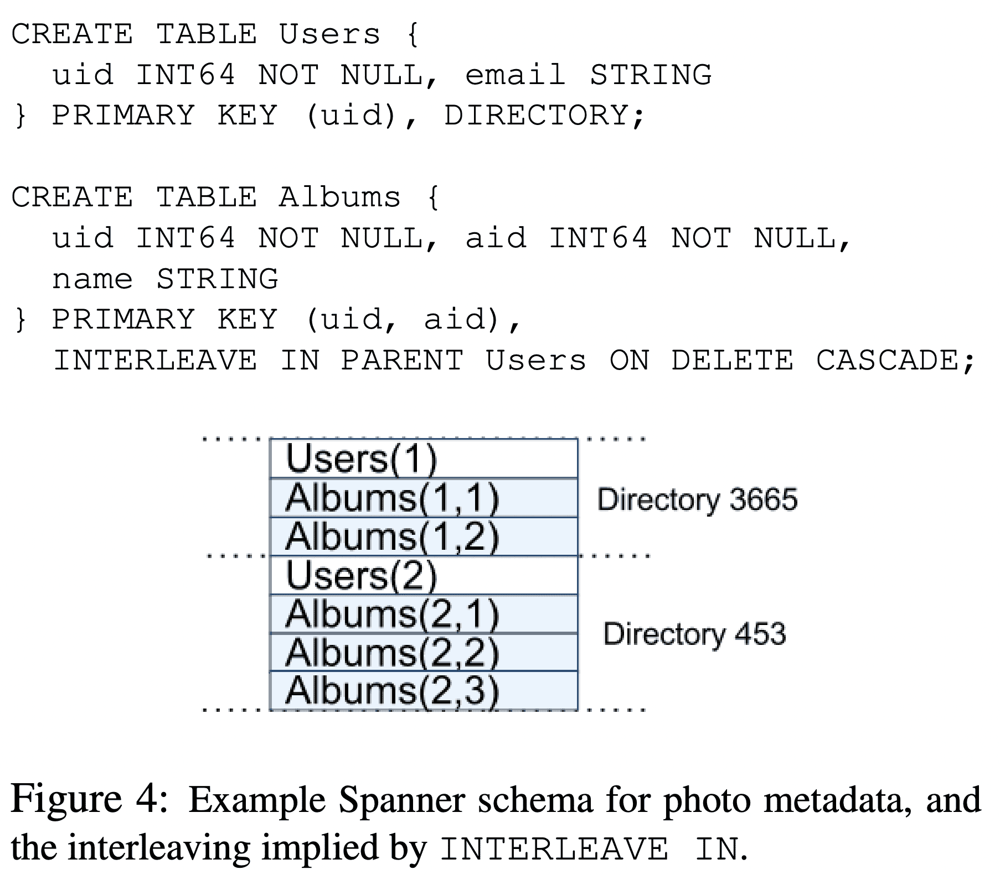

모든 table은 1개 이상의 talbe hierarchy를 가진다. client application은 `INTERLEAVE IN` 을 통해 hierarchy를 정의할 수 있다. hierarchy의 제일 위는 $directory\ table$이라고 한다. key $K$를 가지는 directory table의 row에 속하는 decendant table의 row들은 $K$로 시작하며 lexicographic order를 가지는 key이다. `ON DELETE CASCADE` 는 directory table의 row가 지워지면 children row도 지워지는 옵션이다. interleaving을 통해 table relationship에 대한 locality를 만들어 성능을 향상시켰다.

## 3. TrueTime

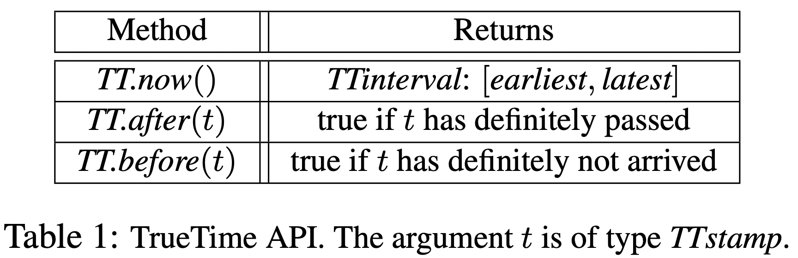

TrueTime은 $TTinterval$로 time을 표현하는데, 얘는 interval과 bounded time uncertainty를 포함한다. $TTinerval$은 $TTstamp$ type 이다($TT.now()$의 리턴 참조). $TT.now()$는 $TT.now()$가 호출 된 시간이 포함되는 $TTinterval$을 리턴한다. $TT.after()$와 $TT.before()$는 $TT.now()$의 wrapper method 이다. event $e$ 의 absolute time은 $t_{abs}(e)$ 함수로 나타낸다. TrueTime은 $e_{now}$ 가 invocation일때, $tt=TT.now()$, $tt.earliest \leq t_{abs}(e_{now}) \leq tt.latest$를 보장한다.

Truetime의 시간은 거의 오차가 없도록 설계되었다 (논문참조.. 아무튼 보장됨.. GPS, atomic clock으로 어쩌구저쩌구.. redundancy 붙여서 어쩌구저쩌구.. 아무튼 깨질일 없게 만들어줌.. 여러 datacenter에 걸쳐서 cock sync를 함..).

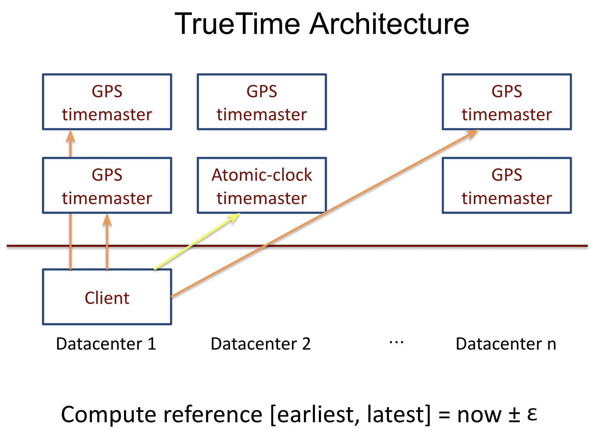

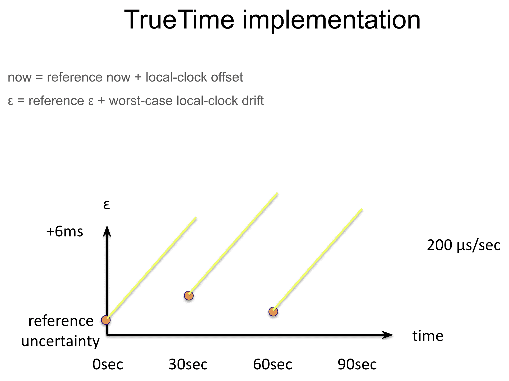

구글의 머신 시간 오차는 200us/s 이다?? [OSDI12 - Spanner: Google’s Globally-Distributed Database](https://youtu.be/C75kpQszAjs?t=1415)

[Spanner Internals Part 1: What Makes Spanner Tick? (Cloud Next '19)](https://youtu.be/nvlt0dA7rsQ?t=867)

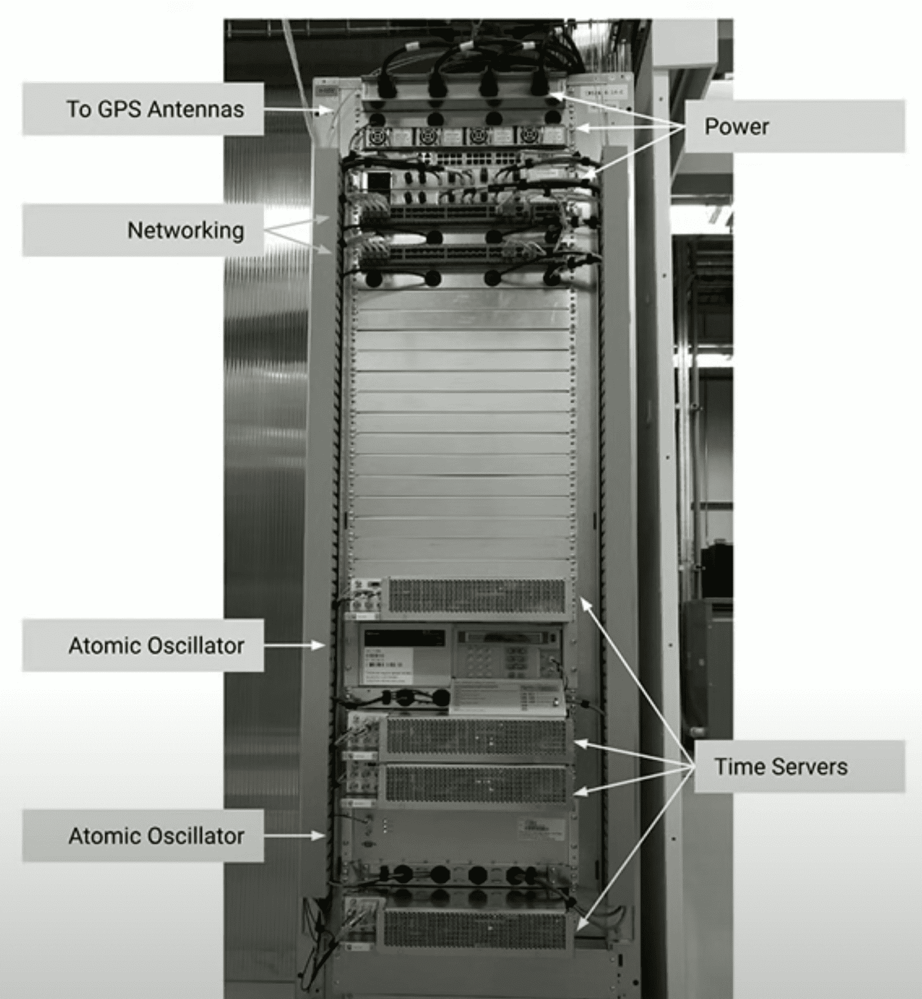

## 4. Concurrency Control

paxos write (paxos group내의 write, 즉 한 파티션에서 일어나는 write)와, spanner client write를 구별하는것이 중요하다. context가 명확하지 않으면 paxos의 write로 간주한다. 예를들어 two-phase commit는 prepare phase에 paxos write만 만들고 spanner client write는 없다.

### 4.1 Timestamp Management

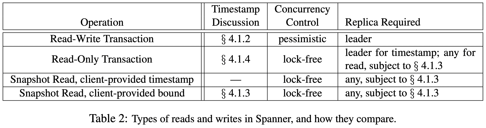

read-only transaction은 snapshot isolation으로 성능 향상을 한다. read-only transaction의 read는 system이 선택한 timestamp로, lock 없이 데이터를 read해서 incoming write가 block되지 않는다. read를 수행하는 replica는 충분히 up-to-date하다 (왜 충분히를 붙였지).

특정 시점에 대한 snapshot read도 lock없이 동작한다. client는 timestamp를 명시하거나, upper bound를 명시(system이 timestamp를 결정)한다. snapshot read도 충분히 up-to-date한 replica에서 실행된다.

read-only transaction, snapshot read에서 선택된 timestamp에 대해 GC가 진행되지 않았다면 commit을 해야만 한다 (???). 따라서 retry loop에서 result를 버퍼링 하지 않아도 된다. server failure에서 client는 기존 timestamp, read position으로 다른 server에 요청을 보내면 된다 (commit이랑 무슨상관?).

#### 4.1.1 Paxos Leader Leases

candidate은 timed lease vote를 던지고, quorum을 만족하면 lease를 얻었음을 알게된다 (즉 leader가 됨). $lease\ interval$은 leader가 다른 replica들의 quorum 동의를 얻음을 확인한 시점부터, quorum을 나가는 시점(일부가 expire됨)까지로 정의된다 (즉, replica에서 lease vote timeout이 있는듯). replica에서 successful write가 생길때(의미를 잘모르겠음) lease vote를 연장하면 (timeout을 늘려 implicit하게 연장), leader에게 timeout을 안보내게되고 leader는 자신의 timeout이 됐을때 연장 요청을 보낸다.  각 paxos group에서, paxos leader의 lease interval은 이전/이후 leader와 겹치지 않는 disjointness invariant를 가진다.

slave들이 lease vote를 release하는 것으로 master를 abdicate 할 수 있다. disjointness invariant를 유지하기 위해서 spanner는 abdicate이 가능한 때를 정해놓는다. abdicate이 가능하려면 leader에서$TT.after(s_{max}) = true$가 될때까지 기다려야 한다. ($s_{max}$: leader의 maximum timestamp, 즉 extension에서만 abdicate이 가능한것 같다)

#### 4.1.2 Assigning Timestamps to RW Transactions

Transactional read, write는 2PL을 쓰기 때문에 lock을 잡은 후, 놓기 전의 시점 중에서 timestamp를 할당받는다. transaction에서 paxos가 paxos write에 할당한 transaction commit을 의미하는 timestamp를 transaction에 할당한다.

**monotonicity invariant**: paxos group에서 spanner는 paxos write들에 monotonically increased를 유지하는 timestamp를 할당한다 (두개의 paxos write = 두개의 파티션). single leader replica일 때도 (한개 파티션에 여러 write가 생기는경우) monotonicity invariant를 유지한다. monotonicity invariant는 leader들이 disjointness invariant를 사용하므로 유지할 수 있다. leader는 leader lease동안에만 timestamp를 할당하기 떄문이다.

external consistency invariant: transaction $T_2$가 $T_1$ 커밋 이후에 시작되면, $T_2$의 commit timestamp는 $T_1$의 commit timeastmp보다 크다. $T_i$의 start, commit event를 각각 $e_i^{start}$, $e_i^{commit}$이고 $T_i$의 commit timestamp는 $s_i$라 하자.
external consistency invariant는 $t_{abs}(e_1^{commit})<t_{abs}(e_2^{start}) => s_1<s_2$가 된다.
transaction을 실행하고 timestamp를 할당하는 프로토콜은 아래 두개 룰을 따른다.($e_i^{server}$: commit 요청이 coordinator leader에 도착한 이벤트)

**Start**: $T_i$에 대한 coordinator leader는 $s_i$( $\geq TT.now().latest$)라는 commit timestamp를 $e_i^{server}$ 이후에 할당한다 (participant leader는 여기서 일을하지않음).

**Commit Wait**: coordinator leader는 client가 $T_i$에 의해 commit된 데이터를 $TT.after(s_i)=true$가 될때까지 볼 수 없도록 보장한다. commit wait은 $s_i<t_{abs}(e_i^{commit})$을 보장한다(commit timestamp < commit event)

#### 4.1.3 Serving Reads at a Timestamp (RW Transaction)

monotonicity invariant는 replica가 데이터를 읽기에 충분히 up-to-date 한지 결정할 수 있게 해준다. 모든 replica는 어느 시점까지 up-to-date한지 나타내는 safe time ($t_{safe}$) 을 트래킹한다. replica는 read timestamp $t$에 대해, $t<=t_{safe}$일때 데이터를 읽어갈 수 있다 (즉, safe time은 upper bound 이다, safe time이전 시점의 데이터를 읽어갈 수 있다)

$t_{safe}^{paxos}$는 paxos state machine의 safe time이고, $t_{safe}^{TM}$는 transaction manager의 safe time일 때, $t_{safe}=min(t_{safe}^{paxos}, t_{safe}^{TM})$ 로 결정된다.

$t_{safe}=t_{safe}^{paxos}$ 가 된다면, $t_{safe}^{paxos}$이전에 write가 발생해서는 안된다. 윗 내용들을 되짚어보면 monotonically increased timestamp이고, write에 순서가 있으므로 $t_{safe}^{paxos}$ 이하에서 write가 발생하지 않아서 문제없다.

$t_{safe}^{TM}$은 transaction manager를 고려해야하므로 prepared (not committed) transaction이 있을때, 없을때가 달라진다.
- prepared transaction이 없는경우: write가 생긴게 없으므로 아무런 시점에나 읽어도 문제 없으니 $t_{safe}^{TM}=inf$ 이다.
- prepared transaction이 있는경우: participant replica가 prepared transaction이 commit됐는지 알 수 없다. coordinator leader(TM?)는 $s_i>=s_{i,g}^{prepare}$($s_{i,g}^{prepare}$: paxos group $g$에서 transaciton $T_i$의 prepare timestamp) 를 보장한다. 따라서 $t_{safe}^{TM}=min_i(s_{i,g}^{prepare})-1$ 가 된다 (prepare시점 직전까지가 safe time)

#### 4.1.4 Assigning Timestamps to RO Transactions

RO transaction은 1) timestamp $s_{read}$를 할당하고, 2) $s_{read}$에 대해 snapshot read를 수행한다. snapshot read는 모든 replica에서 up-to-date하다.

$s_{read}=TT.now().latest$ 로 설정한다. 하지만 $t_{safe} < TT.now().latest$ 인 경우 external consistency 보장이 안되므로 $t_{safe}$가 될때까지 기다린다. 또한 disjointness를 보장하기 위해  $s_{read}<s_{max}$여야 한다.

### 4.2 Details

#### 4.2.1 Read-Write Transactions

Bigtable 처럼 transactional write는 commit전까지 buffer에 남아있는다. 따라서 transactional read는 transactional write를 볼 수 없다.

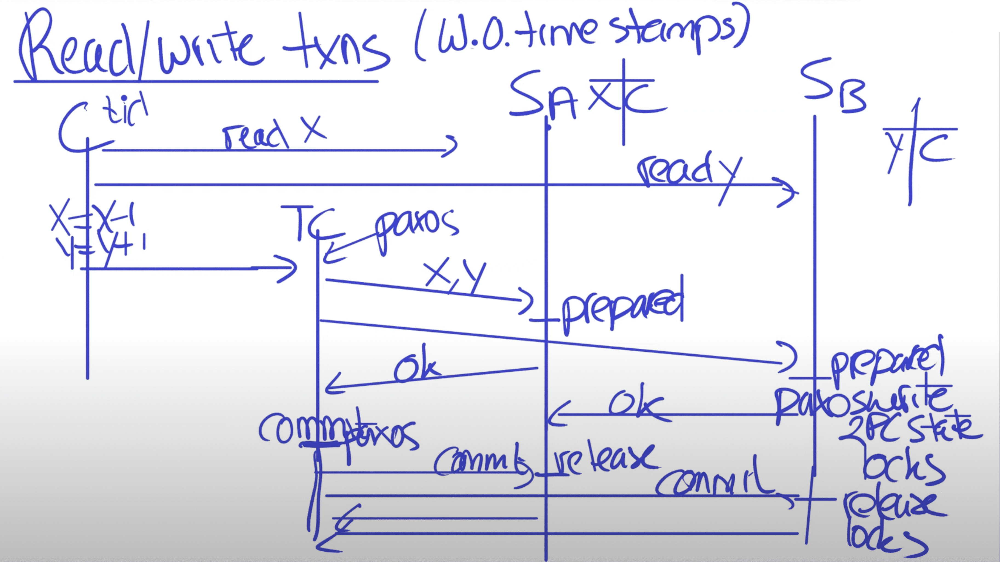

[Lecture 14: Spanner](https://youtu.be/ZulDvY429B8?t=1445)

RW transaction의 read는 deadlock avoindance를 위해 wound-wait를 사용한다. client는 leader replica에 read request를 보내고, leader replica는 read lock을 걸고 recent data를 읽는다. client는 transaction이 진행중일땐 keepalive를 보내서 timeout이 발생하지 않도록 한다(leader들이 timeout시킴). client가 r/w를 모두 마치면 2PC을 진행한다. client는 coordinator group을 선택하고 각 participant leader에게 commit message와 coordinator id, buffered write를 전달한다(participant leader, coordinator가 따로따로 있는데.. 확인필요). client가 2PC를 진행하는것은 inter-datacenter로 보내지는 payload가 두번 발생하지 않게 해준다.

non-coordinator-participant leader는 write lock을 얻고, 이전 transaction에서 할당했던것보다 큰 값의 prepare timestamp를 선택하고, paxos로 prepare record를 로깅한다. 각 participant는 coordinator에게 prepare timestamp를 알려준다. (각각 paxos leader=participant는 각각의 prepare timestamp를 가지고, coordinator는 얘네를 모은다)

coordinator는 write lock을 잡고나서 prepare phase는 스킵한다. coordinator는 모든 participant leader에게서 noti를 받은 뒤에 해당 transaction에 대한 timestamp를 결정한다. commit timestamp $s$ 는 세가지 조건을 만족해야한다.
- $s_i>=s_{i,g}^{prepare}$, Section 4.1.3에 나온 것
- $s > TT.now().latest$, $TT.now()$는 coordinator가 commit message를 받은 시점이 됨
- $s_i>s_j$ (for $j<i)$, monotonicity를 보장하기 위함
coordinator leader는 paxos로 commit record를 로깅한다. 이 사이에 다른 participant들을 기다리다가 timeout이 발생해서 abort 될 수도 있다.

coordinator replica들이 commit record를 적용하기 전에 coordinator leader는 $TT.after(s)$ 가 될때까지 기다린다 (Section 4.1.2의 commit wait rule). coordinator leader가 $s=TT.now().latest$로 설정했다는것은 사실상 과거 시점임을 의미하고, Expected wait은 최소 $2*\bar{\epsilon}$ 이다. wait 시간은 paxos communication과 중복되므로 crtical path는 아니다. commit wait 이후 coordinator는 commit timestamp를 client와 모든 participant leader에게 전달한다. participant leaader는 paxos로 transaction결과를 로깅하고, $s$에 대한 내용을 apply한뒤 unlock한다 (prepare만 완료되면 실제 commit되지 않더라도 success처리한다는건가).

#### 4.2.2 Read-Only Transactions

timestamp를 할당하려면 read에 엮이는 모든 paxos group과 negotiation이 필요하다. 따라서 read에 역이는 모든 paxos group을 알기 위해 $scope$ expression을 만들었다. $scope$는 transaction에 쓰이는 key들 리스트를 가지게 된다.

scope가 single paxos group만 가지면 해당 paxos group leader로 RO transaction을 수행한다. leader는 $s_{read}$를 할당하고 read를 수행한다. 해당 paxos group에 prepare transaction이 없으면
$s_{read}=LastTS()$ ($LastTS()$: last committed timestamp for write of paxos group) 로 설정하여 last write를 보게 해주어 external consistency를 유지한다.

scope가 multiple paxos group을 가지면 여러 negotiation option을 선택할 수 있는데 spanner는 negotiation자체를 피하기 위해 $s_{read}=TT.now().latest$를 사용한다 (safe time보다 큰 값이 될것이므로 wait 필요). $TT.now().latest$는 모든 replica가 up-to-date하게 해준다.

#### 4.2.3 Schema-Change Transactions

schema-change transaction은 standard transaction의 non-blocking mode이다. 첫번째로 prepare phase에서 미래 timestamp를 할당한다. 이는 schema hcnage가 수많은 서버에서 다른 요청들을 처리하는것을 방해하지않고 완료되어야 하므로 미래로 할당한다. 두번째로 schema 변경과 엮여있는 read/write를 동기화한다. schema change timestamp $t$ 이전의 요청이면 그냥 수행하면 되고, $t$이후의 요청이면 block한다.

#### 4.2.4 Refinements

$t_{safe}^{TM}$은 single prepared transaction이 $t_{safe}$가 올라가지 못하게 만드는 단점이 있다 (Section 4.1.3). 따라서 read가 transaction과 conflict이 발생하지 않더라도 later timestamp를 읽어 갈 수 없다($t_{safe}$가 올라가지 않기 때문). 이와 같은 false conflict는 fine-grained mapping을 통해 피해갈 수 있다. 이 정보는 이미 key range to metadata 을 들고있는 lock table에 저장할 수 있다. read가 오면 key range에 대해 fine-grained safe time을 확인해서 read conflict이 발생했는지 확인한다.

$LastTS()$ 도 transaction이 commit될때 non-comflicting RO transaction이 무조건 $s_{read}$를 할당해야 하므로 느려진다 (여러 paxos group에 걸치게 되면). 이것 또한 fine-grained mapping을 통해 해결할 수 있다.

$t_{safe}^{Paxos}$는 Paxos write가 없을때 값을 높일수가 없는 단점이 있다. last write 이후의 시점 $t$ 에 대한 snapshot read가 불가능하다. 이것은 leader-lease interval에 대한 disjointness를 활용해서 해결한다. 각 paxos leader는 future write가 발생하는 threshold를 이용해서 $t_{safe}^{Paxos}$를 증가시킨다. paxos sequence number $n$에 대해, $MinNextTS(n)$은 $n+1$에 할당될 minimum timestamp를 리턴한다. replica는 $t_{safe}^{Paxos}$를 $MinNextTS(n)-1$까지 증가시킬 수 있다.

---

Correctness

- serializable:
- external consistency: transaction 기준, linearizability: 개별 read or write

---

spanner에서는 recursive directory를 지원하고, RPC로 recursive get을 지원한적있음 → relational model과 엄청다름

GFS → colossus: bigtable위에 올라가있음

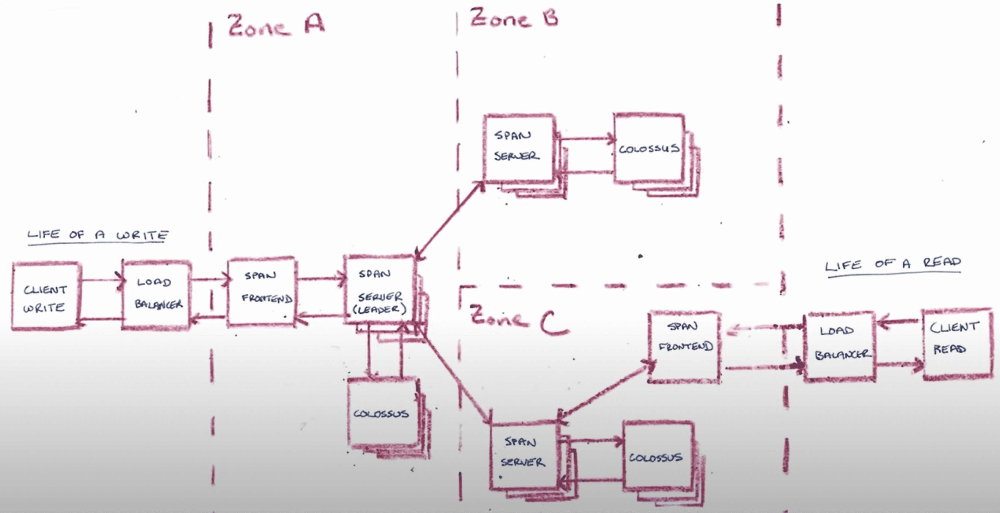

write 홀수개 서버로 이루어진 paxos group , write가 들어오면 절반이상이 성공하면 리턴 (dynamodb랑똑같)

근데 paxos group에 참여하는 서버가 고정되어있지않음 (compute - storage가 분리되어있어서 가능)

spanner v1: logical clock

---

[Cloud Spanner  How It Works](https://www.youtube.com/watch?v=QPpSzxs_8bc)