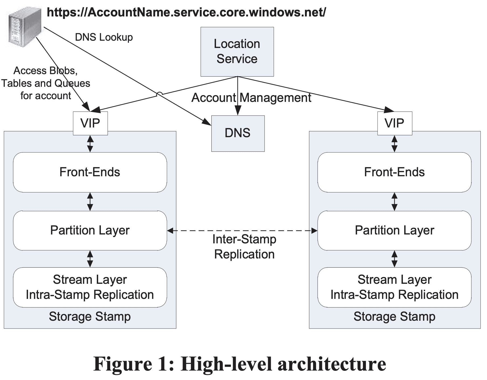
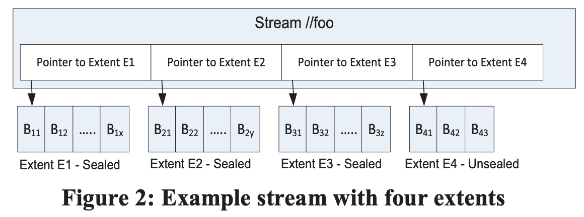
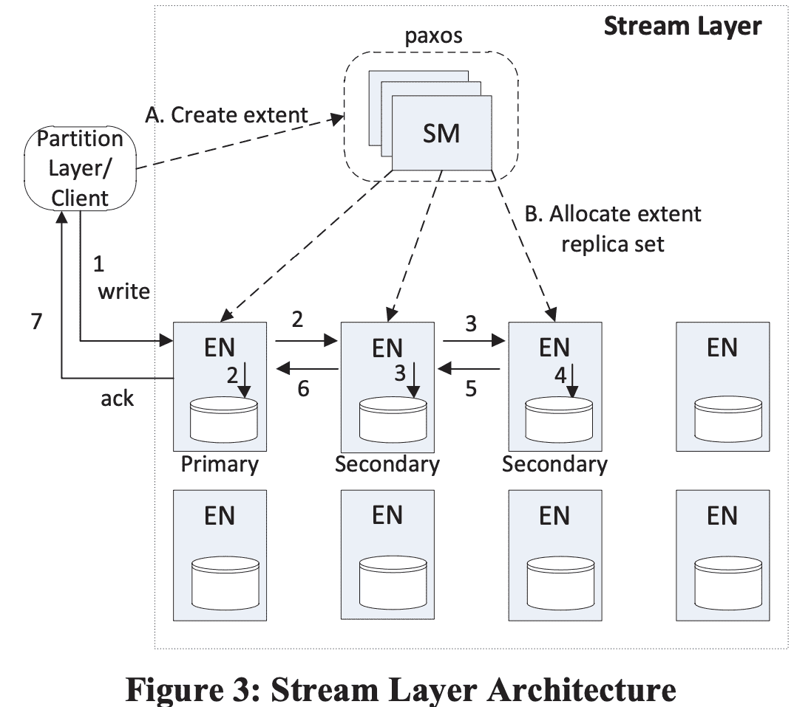
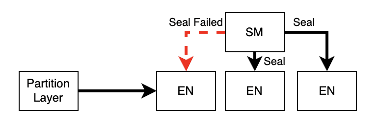
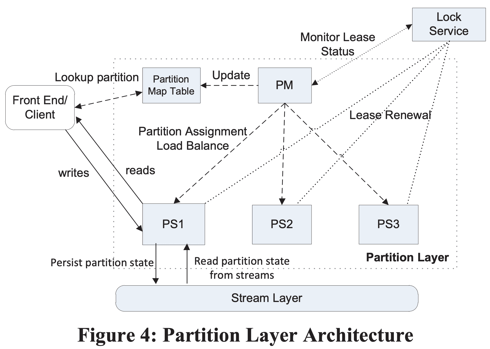
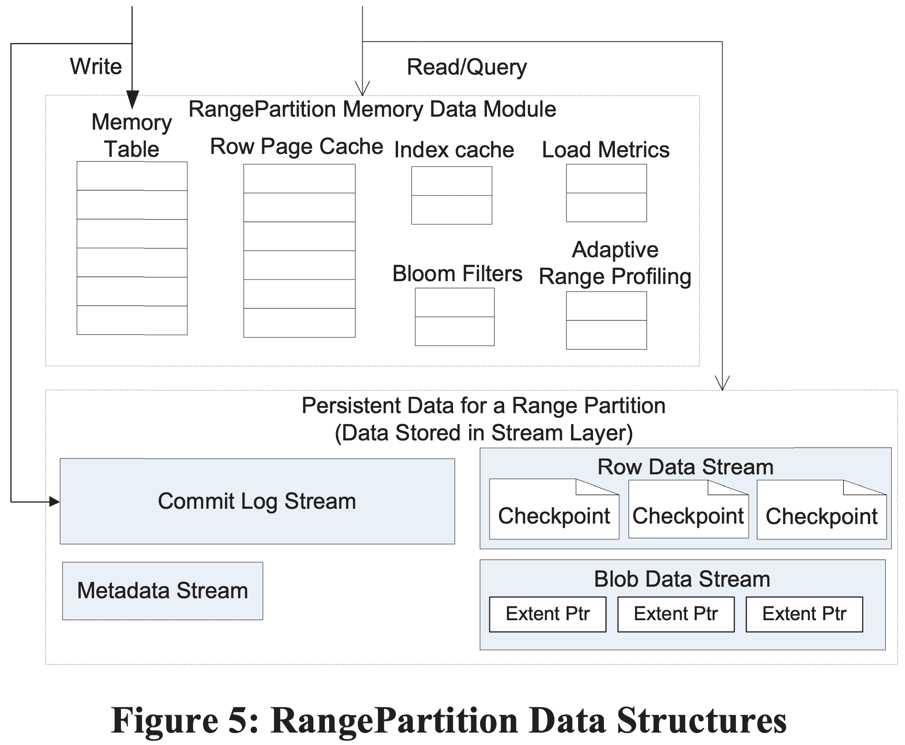

**{{ page.description }}**

# Windows Azure Storage: A Highly Available Cloud Storage Service with Strong Consistency

## 1. Introduction

- Strong consistency
사용자들이 strong consistency를 원한다, strong consistency 위에서 optimistic concurrency control하기를 원한다. CAP를 다 만족시킨다 (라고 주장)
- Global and Scalable Namespace/Storage
어디서든지 consistent하게 접근가능하다.
- Disaster Recovery
- Multi-tenancy and Cost of Storage
사용자들은 비용을 줄이기 위해 같은 shared storage infra를 쓰길 원한다.

## 2. Global Partitioned Namespace

storage namespace를 DNS part로 활용하고, storage namespace에서 account name, partition name, object name 3개로 쪼개서 아래같은 uri를 만든다.
`http(s)://AccountName.<service>.core.windows.net/PartitionName/Objectname`

AccountName DNS translation은 primary storage cluster, data가 들어있는 datacenter 위치를 찾는다. primary location은 해당 account에 대해 모든 요청을 받게된다. 여러 location에 저장하기 위해 여러 account name을 쓰기도 한다. PartitionName은 traffic에 따라 storage node를 scale out하기 위해 쓴다. ObjectName은 해당 partition의 object를 식별하는데 같은 partition 내에서 여러 object간 atomic transaction을 지원한다.

이 네이밍 방식은 blob은 full blob name이 PartitionName이 되도록 한다. table은 table의 각 entity(row)가 PartitionName, ObjectName을 PK로 가지도록 한다. 만약 같은 partition에 대해 row를 그룹핑하기 위해 테이블을 쓰는 app이 있다면, PK(Partitionname, ObjectName)를 통해 atomic transaction을 수행하게 해준다. queue는 queue name이 PartitionName이고, 각 메시지가 ObjectName이 되어 queue의 메시지를 식별하게 해준다.

## 3. High Level Architecture

### 3.1 Windows Azure Cloud Platform

Windows Azure Fabric Controller는 리소스 할당, 배포, 업글, 관리 등을 제공하는 리소스 관리 레이어이다. azure storage는 fabic controller 위에 올라가있는 서비스다. fabric controller는 node management, network configuration, health monitoring, starting/stoping service instances, service deployment 등을 제공한다. azure storage는 fabric controller로부터 network topology 정보, cluster들의 physical layout, storage node의 hardware configuration를 가져온다. azure는 disk간 replication, data replacement와 load balancing을 관리한다.

### 3.2 Azure Storage Architectural Components

Azure Storage는 Storage Stamps와 Location Service로 구성된다.

**Storage Stamps** - storage stamp는 storage node를 가지는 N개의 rack으로 구성된 클러스터이다. 각 rack은 분리된 fault domain으로 만들어진다. cluster는 대체적으로 10~20개 rack이며 한 rack당 18개 storage node를 가진다. stamp당 수십PB의 용량을 storage를 가진다.
low cost로 서비스를 제공하기 위해 가능한한 높은 storage utilization을 만들 필요가 있다. 목표는 capacity, transaction, bandwidth기준 70%가량을 만드는것이다. 하지만 80%는 넘지 않도록 해서 나머지 20%의 util은 더 나은 seek time, high throughput을 얻기 위한 short stroking(억지로 이리갔다 저리갔다하면 total throughput은 더 낮아짐)과 stamp의 Rack failure상황에 대비한 capacity, availability 목적으로 남겨둔다. storage가 70% util에 닿게되면 location service는 account를 inter-stamp replication을 통해 다른 stamp로 옮기게 된다.

**Location Service (LS)** - location service는 모든 storage stamp와 acocunt namespace를 관리한다. LS는 storage stamp에 account를 할당하고 disaster recovery, load balancing을 위해 여러 stroage stamp에서 account를 관리한다. location service는 disaster recovery를 위해 2개의 지역에 분산된다.
Azure storage는 3개 리전 각각 여러 location에서 storage를 제공한다. 각 location은 여러 storage stamp를 가진다. storage를 더 추가하려면 특정 data center에 storage stamp를 deploy하고 LS에 추가하면 된다. 그리고 LS는 새 stoage saccount를 새 stamp에 추가하거나, load balancing 목적으로기존 stamp에서 새 stamp로 storage account를 옮긴다.
Figure 1은 location service와 2개 storage stamp를 보여준다. LS는 모든 location의 storage stamp이서 사용하는 resource를 트래킹한다. application은 새 account를 만들때 location affinity를 지정한다 (ex: US North). 그러면 LS는 해당 location에 storage stamp를 primary stamp로 선택한다. 이때는 전체 stamp의 부하를 고려한다. 그리고 account metadata를 해당 stamp에 저장해서, account에 대한 트래픽을 받을 수 있게 한다. 그리고 DNS를 업데이트해서 `[https://AccountName.service.core.windows.net/](https://AccountName.service.core.windows.net/)` 으로 route되도록 한다.

### 3.3 Three Layers within a Storage Stamp

**Stream Layer** - stream layer는 disk에 bits를 저장하고 여러 서버간 data를 분산/복제해서 한 storage stamp 안에서 data durability를 보장한다. stream layer는 한 stamp 안의 distributed file systema layer라고 볼 수 있다. stream layer는 file을 stream으로 본다 (stream은 extents라고 불리는 large stroage chunk의 ordered list 이다). 또한 어떻게 저장하는 지, 어떻게 복제하는 지 등을 담당하지만 higher level object나 semantic을 관리하지는 않는다. 데이터는 stream layer에 저장되지만, partition layer에서 접근가능하다. partition server(partition layer의 daemon process)와 stream server는 한 stamp의 각 storage node에 co-locate되어있다.

**Partition Layer** - partition layer는 high level data abstranction (Blob, Table, Queue) 관리, scalable object namespace 제공, object들에 대한 transaction ordering, strong consistency 제공, stream layer 위에서 object data 저장, disk IO를 줄이기 위한 object caching의 역할을 한다.
또한 stamp 안에서 모든 data object를 partitioning해서 높은 scalability를 만든다. 모든 object는 PartitionName을 가지고 있으므로, PartitionName을 기반으로 disjoint range로 쪼개어 다른 partition server들에 의해 서빙된다. 또한 Blob, Table, Queue에 대한 PartitionName range를 서빙하는 partition server 정보도 관리한다. 당연히 partition server들간 PartitionName의 automatic load balancing도 제공한다.

**Front-End Layer** - FE layer는 incoming request를 처리하는 stateless server들로 구성된다. request를 받으면 FE는 AccountName을 보고 authentication, authorization을 확인하고, request를 PartitionName에 따라 partition server로 라우팅한다. FE server는 PartitionMap(PartntionName range에서 partition server를 찾는 map)을 캐싱하고 request를 포워딩할때 사용한다. 또한 stream layer로부터 large object를 스트리밍하고, 자주 접근하는 데이터를 캐싱한다.

### 3.4 Two Replication Engines

**Intra-Stamp Replication (stream layer)** - 여기선 synchronous replication을 제공하고 해당 stamp에 써지는 모든 데이터가 durable하도록 보장한다. disk, node, rack failure로부터 stamp의 데이터를 durable하게 만들기 위해 다른 failut domain의 여러 node들에 걸쳐 replica들을 유지한다. intra-stamp replication은 stream layer에서 담당하고. write request에서 critical path에 들어간다. transaction이 intra-stamp replication을 성공하면 customer에게 success가 리턴된다.

**Inter-Stamp Replication (partition layer)** - asynchronouse replication이며 stamp간 replication을 담당한다. inter-stamp replication은 background로 진행된다. 이 replication은 object level에서 수행하므로 전체 object 또는, 해당 account에 대해 최근의 delta change가 replicate된다. inter-stamp replication은 disaster recovery 대응과 특정 account의 stamp간 data migration에 사용된다. inter-stamp replication은 account에서 설정가능하고 partition layer가 수행한다.

inter-stamp와 intra-stamp replication 두개로 분리한 이유는 intra-stamp replication은 “빈번한” HW failure로부터 durability를 제공 2) inter-stamp replication은 “드문” geo-disaster에 대한 durability를 제공 한다. **intra-stamp replication은 user request의 critical path에 포함되므로 low latency를 목표로 하고, inter-stamp replication은 stamp간 network bandwidth를 최적으로 사용 (적절한 수준의 replication delay를 유지하되)하는데 목표를 가진다.**
replication layer를 분리한 다른 이유는 두개 layer가 각각 유지해야 하는 namespace 때문이다. stream layer에서 intra-stamp replication을 수행하면 관리해야하는 정보의 양을 single storage stamp 크기로 한정할 수 있다. 따라서 intra-stamp replication에 대한 모든 meta-state가 memory에 캐싱될 수 있어 Azure storage가 single stamp 안에서 strong consistency를 제공하면서 빠르게 transaction을 commit할 수 있다. 반면에 partition layer는 location service와 함께 전체 object namespace를 인지하고 효율적으로 data center간 object state를 replicate 한다.

## 4. Stream Layer

stream layer는 partition layer가 쓰는 filesystem과 비슷한 namsepace, API interface를 제공한다. 물론 S3처럼 write는 append-only이다. partition layer는 stream layer를 통해 file(stream)에 대해 open, close, delete, rename, read, append, concat을 수행한다. stream은 extent pointer의 ordered list이고 exent는 block sequence이다.

위 그림은 stream `//foo` 를 보여준다. 이 stream은 4개의 extent(E1, E2, E3, E4)를 가진다. 각 extent는 연속된 block을 가진다. E1, E2, E3 은 sealed extent인데, 더이상 append할 수 없는 extent이다. app이 이 stream을 처음부터 끝까지 읽는다면 E1, E2, E3, E4 순서대로 안의 block을 가져가게 된다.

**Block** - block은 data RW 에대한 최소 단위이다. block은 최대 N bytes(예: 4MB) 까지 채워진다. data는 1개 이상의 block으로 append 된다(크기가 커지면 여러 block으로 쪼개어 write한다?). block은 같은 크기일 필요는 없다. client는 block단위로 appen를 수행하고 block size를 지정한다. client read request가 stream이나 extent에 대한 offset, length를 던져주면 stream layer가 이를 읽어준다. read가 수행될 때 block의 모든 데이터가 read되는데, stream layer가 block단위 checksum을 수행하기 때문이다. 모든 block은 data integrity를 위해 며칠에 한번씩 checksum이 수행된다.

**Extent** - extent는 stream layer에서 replication 단위이고, storage stamp 안에서 기본으로 3개 replica를 유지한다. 각 extent는 NTFS file에 저장되고 block sequence로 구성된다. partition layer에서 사용하는 target extent size는 1GB이다. 작은 object를 저장하기 위해 partition layer는 이런 object들을 같은 extent나 같은 block안에 저장한다. 몇 TB 되는 object (Blob)에 대해선 partition layer에서 이 object들을 많은 수의 extent로 쪼개어 저장한다. partioin layer는 object가 어디에 저장되어있는지 알기 위해 stream, extent, offset in extent 정보를 저장해둔다.

**Stream** - 모든 stream은 namespace에 속하는 name을 가진다. 또한 partition layer관점에서 stream은 big file로 보인다. stream에는 append와 random read가 발생한다.  stream은 extent pointer의 ordered list이고 **Stream Manager**가 관리한다. 여러 extent가 한번에 concat되면, stream에 추가된 순서대로 full contiguous address space를 가지게 된다. 새 stream은 기존 stream에 concat해서 만들어질수도 있는데, 이건 pointer list만 업데이트 하므로 빠르게 만들 수 있다(근데언제쓰는거지, 살짝 branching하는 목적일까). 마지막 extent만 append 가능하며 다른 extent들은 immutable하다.

### 4.1 Stream Manager and Extent Nodes

**Stream Manager (SM)** - SM은 stream namespace, 각 stream에 속한 extent들, extent 할당정보(in EN)을 관리한다. SM은 standard Paxos cluster이며 request critical path에 속하지 않는다. SM은 (a) 모든 active stream, extent의 상태와 stream namespace를 관리하고, (b) EN health를 모니터링하고 (c) EN에 extent를 생성하거나 할당하고 (d) HW failure/unavailability로 생긴 loss가 일어난 extent replica에 대해 lazy replication을 수행하고, (e) stream에서 사용하지 않는 extent에 대해 GC를 수행하고, (f) stream policy에 따라 extent data에 대해 erasure coding을 스케줄링한다.
SM은 주기적으로 EN의 state를 폴링하고 EN이 저장하고 있는 extent 정보를 받아온다. SM이 어떤 extent가 필요한 replica 수보다 적게 가지고 있다면 SM은 replicate을 lazy하게 수행한다. replica placement는, SM이 여러 fault domain에서 랜덤하게 EN을 선택한다 (당근 로드밸런싱 고려하겠지?).
SM은 block에 관해서는 알지 못하고 stream, extent에 대해서만 알고 있고(SM이 전체 block을 관리하기엔 너무 많음), critical path에 속하지 않으므로 block append도 관여하지 않는다. 한 stamp가 stream, extent state만 관리하므로 이 state에 대한 양은 SM memory에 들어갈 수 있다. stream layer와 연결되는 client는 parittion layer만 있다.

**Extent Node (EN)** - 각 extent node는 SM에서 할당하는 exten replica를 저장하는 storage이다. EN은 stream에 대해서는 모르고 extent, block에 대해서만 알고 있다. EN 서버 안에서는 모든 extent는 file로 존재하고 data block, checksum과 extent offset에서 block위치를 찾아내는 map을 저장하고 있다. 각 EN은 각각이 가진 extent와 해당 extent의 peer replica 위치를 가지고 있다. SM이 해당 정보를 모두 다 저장하고 있지만 EM은 cache로 가지고 있다(critical path에서 SM을 제외시키기 위한것같다). EN은 block write를 replicate할때, SM에 의해 기존 Replica copy를 만들때만 다른 EN과 통신한다. extent가 모든 stream에서 참조하지 않으면 SM은 GC를 수행하고 EN에게 reclaim하라고 알려준다.

### 4.2 Append Operation and Sealed Extent

appent는 atomic하다. 또한 “multi-block append” operation으로 여러 block을 한번에 append할 수 있다. stream의 minimum read size는 block이다. multi-block append는 많은 양의 데이터를 한번에 append하고 추후 small read가 일어나는 케이스에 적합하다. partition layer와 stream layer는 multi-block append가 atomic하게 일어나고, client가 response를 받지 못하면 retry를 한다 (또는 seal). 이 방식은 client가 duplicate record를 적절히 처리하기 위해 timeout이 일어날때 같은 block에 대해 at-least once로 append할 수 있음을 의미한다. partition layer는 duplicate reocrds를 2가지 방식으로 처리한다. metadata, commit log stream에 대해서는 모든 written transaction이 sequence number를 가지고 duplicate record는 같은 sequence number를 가지므로 idempotent하게 만든다. row/blob data stream에서 duplicate write이 발생하면 last write에 대한 pointer만 바뀌어 이전 duplicate write이 reference가 사라지게 만든다 (추후 GC됨). (왜 last write만..?)

extent의 target size는 partition layer가 설정하고, size가 꽉차면 seal을 하고 새 extent를 stream에 추가한다. sealed extent는 immutable이다. 따라서 stream layer는 sealed extent에 대해 erasure coding같은 최적화를 진행한다.

### 4.3 Stream Layer Intra-Stamp Replication

stream layer와 partition layer는 object transaction level에서 strong consistency를 보장하도록 디자인되었다. partition layer의 strong consistency는 stream layer에서 아래의 내용들을 보장해주기때문에 가능하다.

1. record가 append되고 ack를 받게되면, 모든 replica에서 해당 record에 대한 read들은 모두 같은 data를 보게 된다 (immutable).
2. extent가 seal되면 모든 sealed replica에서 발생하는 모든 read는 같은 content를 보게 된다.

partition layer 밖에서 이미 보안에 대한 방어책이 있으므로 replication에서 이런걸 걱정할 필요는 없고, disk나 node error, network, bit-flip같은 hardware failure나 software bug를 고려해야 한다. 이런 문제는 data corruption을 일으키기때문에 checksum을 통해 corruption을 찾아낸다.

**4.3.1 Replication Flow**

위 그림에서처럼 stream이 생성되면 SM은 첫 extent에 대해 3개의 replica를 3개 EN에 할당한다 (하나는 primary, 나머지는 secondary). EN 할당은 SM이 랜덤하게 여러 fault/upgrade domain에서 선택하며 로드밸런싱도 고려한다. 또한 SM은 어떤 replica가 primary가 될지도 결정하는데, write request는 언제나 primary EN에서 수행하며, secondary EN에 대한 write를 coordination 하는 역할도 한다(SM이 write path에 관여하지않음!). primary EN과 3개 replica의 위치는 extent가 seal되기전까지는 절대로 바뀌지 않는다. 따라서 primary EN이 extent를 가지는것에 대해 **lease가 필요 없다**.

SM이 extent를 할당할때 extent 정보는 client에게 전달되어 어떤 EN들이 replica를 가졌는지, primary EN은 누구인지 알 수 있다. 이런 stream metadata에 대한 state는 SM이 관리하며, client는 이것을 캐싱한다. stream의 last extent가 append되고 sealed 되면 새 extent를 만들어야하니 위와 같은 과정을 수행한다. SM은 extent를 새로 할당하고, 이게 stream의 last extent가 된다.

extent 관점에서 모든 append는 3개 extent replica로 삼중화된다. client는 모든 write request를 primary로 보내지만, read request는 모든 replica에 보낼 수 있다 (sealed여부 관계없이). append가 primary EN에 들어오면 primary는 (a) extent에 append할 offset을 결정하고, (b) 같은 extent에 대해 여러 append request가 동시에 날아올경우 append에 대한 ordering을 수행하고(offset결정), (c) secondary EN에게 offset과 append request를 전달하고, (d) **3개 EN에 append가 성공하면** success를 리턴한다(왜 n/2+1 을 적용하지 않았을까). (그리고 그림을 보면 primary가 두 secondary에게 보내는게 아니고, secondary가 다른 secondary에 전송한다는것도 좀 다른듯). 한 extent에 대해 동시에 여러 append가 발생하면 primary EN은 offset 순서에 따라 commit하며, success를 전달한다. (commit되기 전에는 다음 append를 commit시도하질않음). extent replica에서 append commit이 순서대로 진행되므로 last append position은 현재 extent replica의 current commit length라고 볼 수 있다.

stream이 open되면 extent에 대한 metadata는 client가 캐싱해서 client는 “다음 extent를 할당받아야 하기 전”까지 SM과 통신할 필요 없이 read,write을 수행한다. write동안 replica중 하나가 문제가 생기거나 disk failure가 발생하면 client에게 write failure를 리턴한다. 이 때, client는 SM에게 해당 current commit lengt로 seal하라고 요청한다. 이 시점에서 sealed extent는 더이상 append할 수 없다. SM은 새 extent를 다른 available EN에게 할당하고 stream의 last replica가 되도록 하며 이 정보를 client에게 전달한다. 그럼 client는 write를 계속 진행한다. sealing과 new extent를 할당하는것은 평균 20ms정도 걸린다. 중요한점은 client가 new extent를 받자마자 append를 지속할 수 있고 **특정 node의 unavailability가 발생하는것에 의존하지 않아도 된다는 점이다.**

SM은 만들어진 sealed extent에 대해 필요한경우 redundancy level을 맞추기 위해 background로 replication을 수행한다.

**4.3.2 Sealing**

high level에서 SM은 EN간 sealing operation을 coordinate한다. extent replica의 commit length를 바탕으로 sealing에 사용할 commit length를 결정한다. sealing이 완료되면 commit length는 바뀌지 않는다.

SM은 sealing을 위해 모든 EN에게 current length를 물어본다. sealing을 진행하는동안 모든 replica는 같은 length를 가지거나(일반적인경우), 어떤 replica가 다른 Replica보다 더 길거나 짧은 length를 가질 수 있다. 이 케이스는 모든 EN이 available하지 못해 append failure가 발생했을때 생긴다. 하지만 모든 EN이 available 하지 않다 하더라도 SM은 sealing을 수행해야 한다. SM은 available EN이 가진 commit length중 가장 작은 값을 선택한다. 작은 값을 선택한다 해서 data loss가 생기는것은 아니다. primary EN이 큰 값에 대해서는 fail을 주었을 것이기 때문이다(위 섹션). 즉 가장 작은 commit length는 모든 write가 client에게 ack되었음을 의미한다. 또한 client에게 ack가 가지 못한 block이 final length에 포함되어도, client는 적절하게 이런 데이터를 대처하므로 문제가 없다(4.2 참조). sealing이 진행되는 동안 모든 available replica는 SM에 의해 같은 commit length로 sealing된다. 

sealing이 commit length는 바뀌지 않는다. sealing이 진행되는동안 available EN이 생겨도 나중에 available해질때 SM은 EN에게 해당 commit length로 sealing을 하도록 force sync를 한다. 이를 통해 모든 avilable replica에 대해 extent가 sealed로 바뀌고 bitwise로도 동일한 데이터를 가지게 보장한다.

**4.3.3 Interaction with Partition Layer**

위 그림처럼 network partitioning이 생길때, partition layer는 SM이 sealing하는동안 network가 끊긴 EN과 통신할 수 있다. 이 섹션은 이와 같은 케이스에 대한 처리를 설명한다.

partition layer는 두가지 read pattern을 가진다.

1. **Read records at known locations.**
partition layer는 row와 blob이라는 두가지 타입의 data stream을 사용한다. 이 stream은 언제나 특정한 location `(extent+offset, length)` 를 지정해서 read를 수행한다. partition layer는 **이전의 success append에서 리턴해준 location 정보만**을 이용해서 read를 시도한다. 즉 append가 모든 3개 replica에 성공적으로 commit될때만 location을 이용한다. 이 replication scheme은 언제나 같은 data를 읽도록 보장해준다.
2. **Iterate all records sequentially in a stream on partition load.**
각 partition은 metadata, commit log라는 다른 두개 stream도 가진다. 얘네들은 partition layer가 stream의 시작지점부터 마지막까지 sequential하게 읽을때만 쓰는 stream이다. 이 operation은 partition이 load될때만 쓰인다. partition layer는 partition load동안 useful append(useful의 의미는 뭘까)가 발생하지 않는것을 보장한다. 그리고 partition layer, stream layer는 partition load때 같은 순서의 record가 리턴되는것을 보장한다.
partition load를 시작할때, partition server는 metadata/commit-log stream의 마지막 extent의 primary EN에게 “check for commit length” 를 전달한다. 이건 모든 replica가 available하고 같은 commit length를 가졌는지 확인한다. (partition load를 할때) 같은 commit length를 가지지 않으면 extent는 sealed가 되고 read만 수행하게된다. 이건 partition load가 stream의 마지막 extent의 다른 sealed replica에서 같은 partition을 읽어도 동일한 데이터를 보도록 한다.

### 4.4 Erasure Coding Sealed Extents

storage cost를 줄이기 위해 blob storage에서 erasure coding을 수행한다. extent를 block boundary 기준으로 N개의 같은 크기의 fragment로 쪼갠다. 그리고 reed-solomon algorithm을 통해 fragment에 M개의 error correting code fragment를 추가한다. M개의 fragment 이상으로 손실되지 않는한 azure storage는 extent를 복구할 수 있다.

erasure coding은 저장하는 데이터 수를 줄여준다. 한 stamp에서 3개의 replica를 가지면 3배이지만, fragment수에 따라서 1.3배~1.5배 정도로 데이터 양을 줄일 수 있다. 또한 erasure coding은 3 replica보다 durability가 높다.

### 4.5 Read Load-Balancing

3 replica를 가진 extent에 대해 read 요청이 들어올때 deadline을 추가해서 던져준다. EN이 이 시간 내에 read를 다 하지 못하면 error를 뱉는다. 이 방식은 client가 다른 EN을 선택하도록 해서 더 빨리 read를 완료하도록 만들어준다. 이 방식 또한 erasure coded data를 사용할 수 있다. data fragment에 대해 spindle 부하가 커서 read가 제때 가지 못하는경우 data fragment를 읽는것보다 reconstruction이 빠를 수 있다. 이 때 read는모든 fragment (N + M)에 대해 요청이 들어가며, N개의 response가 오는순간 reconstruct를 수행하여 읽게 된다.

### 4.6 Spindle Anti-Starvation

HDD는 가능한한 high throughput을 내지만, fairness는 희생하게 되어있다. 따라서 sequential RW를 선호한다. azure storage는 큰 사이즈가 될 수 있는 stream을 많이 가지고 있어서, disk가 아주 큰 RW 요청으로 다른 operation이 starvation에 빠지는 상황을 봤다. 일부 disk는 non-sequential IO를 2.3초까지 락을 잡고있었다. 이 상황을 피하기 위해 이미 스케줄된 pending IO의 예상 대기시간이 100ms 이상이거나, 200ms가 넘는 시간동안 스케줄링 되지 않으면 새 IO에 대해 스케줄링을 하지 않는다. custom IO scheduling을 통해 seqeuntial request의 latency가 조금 늘어나지만, RW에 대해 fairness를 줄 수있다.

### 4.7 Durability and Journaling

stream layer의 durability는 stream layer가 ack를 보낼때 최소 3개의 durable copy가 있음을 보장한다. cluster-wide **power** failure에서도 data durability를 지켜야한다. 따라서 모든 write가 ack를 전달하기 전에 durable해질 수 있도록 power를 공급한다.

성능을 내면서 druability를 지키려면 stream layer에서 각 extent node가 특정한 한개 disk(또는 ssd)를 write 전용 journal drive로 사용해야 한다. journal drive는 single sequential data를 write하기만 하며 full write throughput을 낼 수 있다. partition layer가 append를 수행할때 data는 primary EN에 써지면서 동시에 secndary EN에도 써질 것이다. 각 EN이 append를 수행할 때 (a) 모든 data를 journal drive에 append하고 (b) data disk에 해당 extent에 대한 데이터를  append하기 위해 요청을 queue에 넣는다. 이를 성공하면 success를 리턴한다. journal이 성공하게 되면, data는 memory에 버퍼로 남아있고 일부는 data disk에 write되고 있게 될텐데 이떄 read 요청이 오면 data disk에 write되지 않아도 memory로 서빙한다. write가 완료되면 data disk로 서빙한다. 이 방식은 contiguouse write을 더 큰 write으로 합칠 수 있고(in-memory read가 빨리끝나서 다음 write가 오기때문), 더 나은 throughput을 낼 수 있다. 한개 요청 기준에서는 extra write(journaling)를 critical path에 추가하게 되어 이 지점에선 손해이다.

stream layer가 append-only이지만 journal drive를 통해 data disk에서 read와 write가 경합을 할 필요가 없는 이점도 있다. 따라서 journal은 append가 consistent하고 더 낮은 latency를 갖게해준다. partition layer의 commit log stream을 생각해보면, append는 가장 느린 EN이 append하는 속도만큼 나올것이다. commit log stream에 journaling 없는 small append를 하면 end-to-end latency가 30ms가 나오는데, journaling을 하게되면 6ms가 나오며, latency에 대한 분산도 크게 낮춰준다.

## 5 Partition Layer

partition layer는 Blob, Table, Queue type의 object를 저장하고 각 object type에 대한 transaction을 이해한다. partition layer는 (a) 저장된 여러 종류의 object data model, (b) 여러 종류의 object를 처리하는 로직과 시맨틱, (c) object에 대한 scalable namespace, (d) available partition server로 object를 접근할때 로드 밸런싱, (e) transaction ordering과 strong consistency를 제공한다.

### 5.1 Partition Layer Data Model

partition layer는 각 stamp에서 Object Table(OT)라는 internal data structure를 제공한다. OT는 몇 PB까지 커질수있는 테이블이다. 한 stamp내에서 OT는 트래픽에 따라 RangePartitions으로 쪼개지거나, partition server로 spread된다($5.2). **RangePartition**은 OT row의 특정 low key, high key 범위의 contiguous range이다. 특정 OT의 모든 RangePartition은 겹치지 않고 모든 row는 RangePartition에 속한다.

- Account Table: 각 storage account의 metadata, config를 저장한다.
- Blob Table: (stamp 내에 존재하는) 모든 account에 대한 blob object를 저장한다.
- Entity Table: 모든 account의 entity row를 저장한다. public Azure Table data abstraction에서 사용된다.
- Message Table: 모든 account queue의 message를 저장한다.
- Schema Table: 모든 OT의 schema를 관리한다. (mysql의 performanc_schema와 비슷한듯)
- Partition Map Table: OT의 RangePartitions와 어떤 partition server가 RangePartition을 서빙하는지 관리한다. front-end server가 request를 partition server로 라우팅할때 사용한다.

각 OT는 fixed schema이며, schema는 Schema Table에 저장된다. Blob Table, Entity Table, Message Table의 PK는 <AccountName, PartitionName, ObjectName> 이다.

**5.1.1 Supported Data Types and Operations**

OT schema에서 지원하는 property type은 bool, binary, string, datetime, double, guid, int32, int64이다. 또한 DictionaryType, BlobType을 지원하는데, DictionaryType 내에서 각 property는 (name, type, value)의 tuple로 저장된다. BlobType은 많은 양의 데이터를 저장하는 property이고 BlobTable에서만 쓰인다. BlobType은 data를 직접 저장하지 않고 blob data stream을 저장하고, (extent + offset, length) 의 pointer를 저장한다. 이 방식으로 OT와 분리되어 데이터를 저장한다.

OT는 crud를 지원하고, 같은 PartitionName에 대해 여러 row에 걸친 batch transaction을 지원한다. single batch의 operation은 single transaction으로 commit된다. 또한 snapshot isolation을 통해 read와 write가 동시에 들어와도 문제없다.

### **5.2 Partition Layer Architecture**

partition layer는 Partition Manager(PM), Partition Servers(PS), Lock Service로 구성된다.

**Partition Manager(PM)** - ObjectTable들을 관리하고 RangePartitions를 쪼개고, 각 RangePartition에 Parittion Server를 할당하는 역할을 한다. PM은 각 stamp에서 Object Table을 N개의 RangePartition으로 쪼개고 각 OT의 RangePartition을 서빙하는 Partition Server를 관리한다. PM은 각 RangePartition이 한 시간에 하나의 active partition server에만 할당되도록 보장하고 두개의 RangePartition이 row가 겹치지 않도록한다. 또한 partition server간 RangePartition을 로드밸런싱한다. 각 stamp는 여러 PM instance를 가지고 Lock Service이 관리하는 leader lock을 얻기위해 경쟁한다. lease를 가진 PM은 active PM이며 partition layer를 관리하게된다. (실제 하나만 필요한데 active-passive형태로 구성한듯한?)

**Partition Server(PS)** - partition server는 할당된 RangePartition set에 대한 요청을 처리한다. PS는 partition의 모든 persistent state를 stream에 저장하고, 캐싱을 활용한다. system이 Lock Service의 lease를 이용해 한 RangePartition이 여러 partition server로 할당되지 못하도록 보장하므로 strong consistency와 transaction ordering을 제공한다. PS는 동시에 다른 OT의 여러 RangePartition을 동시에 서빙할 수 있다.

**Lock Service** - Paxos Lock Service는 PM의 leader 선출, PS의 partition serving을 위한 lease에 사용된다. google의 Chubby를 참조했다.

partition server failure에서 failed PS가 서빙한 N개의 RangePartition은 PM에 의해 다른 available PS로 할당된다. PM은 부하를 바탕으로 N개 이하의 partitoin server를 선택해서 RangePartition을 PS에 할당하고 Partition Map Table을 업데이트한다. Map이 업데이트된뒤 frontend layer가 RangePartition의 위치를 찾을수 있게 된다. PS가 새 할당을 받으면 이 PS가 lease를 얻게될경우 RangePartition을 서빙할 수 있다.

### 5.3 RangePartition Data Structures

**5.3.1 Persistent Data Structure**

RangePartition은 persistent data를 저장하기 위해 LSM Tree를 사용한다. 각 OT의 Range Parittion은 stream layer에 각각 stream set이 있으며 stream은 특정 RangePartition에만 속한다 (RangePartition splitting이 발생해 extent가 여러 stream에 의해서 참조되더라도 상관없음). 

**Metadata Stream** - metadata stream은 RangePartition의 root stream이다. PM은 RangePartition의 metadata stream name을 통해 partition을 PS에 할당한다 (매핑테이블에 들어가는게 metadata stream name이란건가). metadata stream은 commit log stream name이나 data stream name, stream에서 operating을 할때 필요한 pointer (extent+offset)정보 등 PS가 RangePartition을 load하기에 충분한 정보를 가지고있는다. (pointer 예시: commit log stream에서 processing할 위치나 row data stream의 index root 위치 등). RangePartition을 서빙하는 PS는 metadata stream에 해당 RangePartition이 관여될수있는outstanding split/merge operation들을 써둔다.

**Commit Log Stream** - RangePartition에 반영되는 insert, update, delete operation에 대한 commit log이다.

**Row Data Stream** - row data와 index의 checkpoint를 저장한다.

**Blob Data Stream** - Blob Table이 blob data bits를 저장할때 사용한다.

각 stream은 Object Table의 Range Partition이 가진 “stream layer와 분리된 stream”이다. Object Table의 각 RangeParittion은 Blob Table을 제외하고 한개의 data stream을 가진다. Blob Table의 RangePartition은 row checkpoint data (blob index)을 저장하는 row data stream과, blob data bits를 저장하는 blob data stream을 가진다.

**5.3.2 In-Memory Data Structures**

디테일은 BigTable, LSM Tree paper에 있으므로 생략한다.

**Memory Table** - RangePartition의 in-memory commit log이고 row data stream에 checkpoint되지 않은 모든 최근의 update를 들고있는다.

**Index Cache** - row data stream의 checkpoint indexes를 저장한다. row data cache와 분리했는데, 해당 RangePartition에 대해 최대한 많은 index를 캐싱하기 위함이다.

**Row Data Cache** - row data page에 대한 cache이다. row data cache는 RO이고 lookup이 들어오면 row data cache와 memory table을 확인하고 memory table을 우선한다(memory table은 change log가 있으므로)

**Bloom Filters** - data가 memory table, row data cache에 존재하지 않으면 data stream의 index,checkpoint에서 검색해야 한다. 하지만 여기서 모든걸 검색하는것은 매우 비싸기때문에 bloomfilter를 이용한다.

### 5.4 Data Flow

PS가 RangePartition에 대한 insert/update/delete request를 받으면 해당 operation을 commit log에 append하고, 바뀐 row를 memory table에 저장한다. 따라서 partition에 대한 모든 change는 commit log에 persist되고 memory table에도 반영된다. 이 시점에 transaction success를 FE server로 리턴할 수 있다. memory table size나, commit log stream size가 각각의 threshold를 넘으면 PS는 해당 RangePartition에 대한 memory table을 row data stream에 checkpoint하고 memory table에 들어있던 내용에 해당하는 commit log도 나중에 제거될 수 있다(당장은 아니란뜻?). RangePartition의 전체 check point 수를 조절하기 위해 PS는 GC를 통해 주기적으로 더 큰 checkpoint로 합치고 old checkpoint를 제거한다 (LSM Tree와 사실상 동일한 컨셉).

BlobTable은 Blob data가 있어서 조금 다른데, Blob data bits를 commit log stream에 직접 저장한다 (blob operation에 대해 stream write 수를 줄이기 위함). 하지만 이 data는 row data stream에 저장되는것은 아니므로 memory table에 저장되진 않는다. 그대신 row의 BlobType property는 Blob data bits의 위치 `(extent+offset, length)` 를 트래킹한다. checkpoint를 할때 commit log stream에서 extetn를 읽어  blob data stream에 concat된다. **extent concatenation은 stream layer가 data copy없이 pointer를 추가하는것만으로 빠른 연산**이다. 호..

PS가 partition load에 의해 RangePartition을 서빙할하려 할때 해당 RangePartition에 대한 metadata stream을 읽어 checkpoint 위치를 알아내고, commit log에서 transaction을 replay해서 in-memory state를 만든다. 이 과정이 끝나면 PS는 해당 RangePartition에 대한 up-to-date view가 만들어지며 request를 서빙할 수 있다.

### 5.5 RangePartition Load Balancing

partition layer의 역할은 아주 큰 Object Table을 RangePartition으로 나누고, 자동적으로 여러 PS로 로드밸런싱해서 traffic에 대응하는 것이다. PM은 PS간 부하를 분산시키고 stamp의 전체 partition 수를 조절하기 위해 아래 3개 operation을 수행한다.

**Load Balance** - 특정 PS가 너무 많은 traffic을 받는 상황을 찾아내고 1개이상의 RangePartition을 더 적은 부하를 가지는 PS로 재할당한다.

**Split** - 한 RangePartition이 너무 많은 부하를 받는 상황을 찾아내고 그 RangePartition을 2개 이상의 disjoint RangePartitions로 쪼갠 뒤, 쪼개진 RangePartitions를 2개 이상의 PS로 분산시킨다.

**Merge** - contiguous key range에 대해 부하가 적거나 cold인 RangePartitions를 하나의 RangePartition으로 합친다. Merge는 stamp에서 전체 PS와 비례한 RangePartition 수를 유지하기 위해 사용된다.

Azure Storage는 전체 RangePartition 수를 low watermark - high watermark 사이로 유지한다 (한 stamp당 10*PS수 만큼 유지중). 평상시에는 low watermark 근처로 유지되다가, 갑자기 특정 RangePartition에 대해 traffic burst가 들어오면 load balancing을 위해 split을 수행한다. 전체 RangePartition 수가 high watermark에 다다르면 시스템이 merge rate을 올려 RangePartition 수가 low watermark만큼 줄어들도록 유도한다. 결과적으로 각 Object Table의 RangePartition수는 부하에 따라 동적으로 바뀐다

RangePartition의 high watermark가 PS 수의 10배를 가지는건(stamp당 수백개정도의 PS가 존재), SM에 대해 stream, extent metadata가 증가하는걸 허용할수 있는 크기와 memory에 담을수 있는지로 결정했다. PS수보다 더 많은 RangePartition을 유지하는건 failed PS의 트래픽을 빠르게 다른 PS로 분산시키기 위함이다. PS는 stamp의 트래픽에 따라 hot single RangePartition 서빙하는 것에서부터 가벼운 load를 가진 RangePartition 수십개를 서빙하는것 사이의 상태를 가질 것이다. Blob Table, Entity Table, Message Table의 RangePartition 수는 이 table들이 가진 object의 부하와 traffic 변화에 따라 결정된다. 현재 각 stamp에서 75번의 split과 merge, 200번의 load balance가 발생한다.

**5.5.1 Load Balance Operation Details**

RangePartition과 각 PS의 load를 트래킹한다(TPS, avg(pending transaction count), throttling rate, CPU usage, network usage, request latency, RangePartition size). PM은 각 PS에 heartbeat을 주고받는데 이때 response로 이 정보들이 들어간다. PM이 해당 metric 기준으로 큰 부하를 받고있는 RangePartition을 보면 split할지 결정하고, PS에게 split하라고 명령을 보낸다. 특정 RangePartition이 아닌 PS가 많은 부하를 받고있으면 PM은 해당 PS의 몇개 RangePartitions을 다른 부하가 적은 PS로 재할당한다.

RangePartition의 load balancing을 위해 PM은 PS에게 offload command를 보내는데, PS는 offloading 전에 해당 RangePartitoin의 checkpoint를 만들게 된다. checkpoint가 완료되면 PS는 PM에게 ack를 보내 offload가 끝났음을 알려준다(실 데이터는 stream layer에 있으니 ack만 보낸다?). PM은 해당 RangePartition을 새 PS에 할당하고, Partition Map Table에서 해당 RangePartition이 새 PS를 가리키도록 바꾼다. 새 PS는 RangePartition을 load하고 트래픽을 받기 시작한다($5.4). 새 PS에서 RangePartition을 loading하는것은 offload를 시킨 이후 commit log만 rebuild하면 되므로 매우 빠르다.

**5.5.2 Split Operation**

Azure Storage는 RangePartition이 너무 많은 부하를 받거나, 너무 큰 row/blob data stream을 가질떄 split을 한다. PM이 이 상황을 감지하면 해당 PS에게 split을 하라고 요청한다. PM이 split을 하라고 결정하고, PS는 partition을 쪼갤 key `(AccountName, PartitionName)` 를 결정한다. size기반(data stream) split에서 RangePartition은 해당 partition의 object의 전체 크기에서 split되는 기준 key가 절반이 되도록 해주는 key를 선택한다. 부하 기반의 split을 하는 경우 **PS는 [Adaptive Range Profiling](https://sites.cs.ucsb.edu/~sherwood/pubs/ProfilingAdaptiveRanges.pdf)을 이용해 key를 결정한다(이거가 동적으로 트래픽을 쪼개는데 핵심인것같다)**. PS는 RangePartition의 어떤 key range가 큰 부하를 받는지 트래킹하여 이를 바탕으로 key를 결정하게 된다.

RangePartition “B” 를 “C, D” 로 쪼개는 상황이 생긴다면

1. PM은 PS에게 B를 C,D로 쪼개라고 요청한다.
2. PS는 B의 checkpoint를 만든 뒤 트래픽을 받지 않는다.**(unavailable!)**
3. PS는 MultiModify라는 stream operation을 수행하는데, B의 metadata, commit log, data stream을 가져오고(가져온다는게 extent를 읽는다? 아님 metadata만?, 아 바로다음줄에있다ㅋㅋ), B와 동일한 순서로 같은 extent를 사용해서 C,D 에 대한 stream set을 만든다. 이 단계는 stream이 extent pointer로만 이루어져있기때문에 빠르다. 그리고 PS는 C, D에 대한 새 partition key range를 각각의 metadata stream에 할당한다.
**여기서,, C/D는 commit log가 B기준으로 가지고있을텐데 이럼 duplicate이지않나?언제 지워질까, 그리고 unavailable한 상황은 어캐 대처하는가?**
4. PS는 C,D 로 traffic을 받기 시작한다. (당근 C,D는 disjoint)
5. PS는 PM에게 split이 끝났음을 알리고 PM은 Partition Map Table과 metadata를 업데이틓나다. 그리고 PM은 C,D중 하나를 다른 PS로 옮긴다(트래픽을 분산해야하니까)

**5.5.3 Merge Operation**

두 RangePartition을 merge하려면 PM은 인접한 PartitionName range를 가지며 부하가 별로 없는 RangePartition C,D를 선택해야한다.

1. PM은 C, D를 같은 PS에서 서빙하도록 재할당한뒤, PS에게 C,D를 E로 merge하라고 요청한다.
2. PS는 C, D의 checkpoint를 생성한뒤 두 RangePartition의 트래픽을 받지 않는다.
3. PS는 MultiModify stream command로 E에 대한 commit log, data stream을 생성한다. 각각 stream은 C, D의 commit log, data stream의 모든 extent의 concat으로 이루어진다. 즉 E의 새 commit log stream의 extent는 C의 commit log 다음 D의 commit log 순서대로 이루어진다. 이 layout은 row, blob data stream도 똑같다.
4. PS는 E의 metadata stream을 생성해서 commit log, data stream의 정보, E의 key range, commit log의 start와 end pointer, data stream의 root data index를 저장한다.
5. 이 시점에서 E의 metadata stream까지 생성이 완료되었고 PS는 E로 트래픽을 받는다.
6. PM은 Partition Map Table과 metadata를 업데이트한다.

### 5.6 Partition Layer Inter-Stamp Replication

이전 섹션까지는 single location, single storage stamp상황에 대해서만 설명했다. 이 상황은 **primary stamp** 일때이며, 모든 account는 실제로 Location Service가 할당해주는 1개 이상의 **secondary stamp**를 가지고 primary/secondary stamp 정보는 inter-stamp replication을 하는데 쓰인다.

inter-stamp replication의 대표적인 예시는 disaster recovery를 위해 두 data center로 geo-replicate하는것이다. 이 상황에서 primary, secondary location은 account가 선택한다. 예를들어 primary stamp P가 US south에 있고, secondary stamp S가 US north에 있다하자. account를 만들때 Location Service는 각 location에서 stamp를 선택하고 AccountName을 등록하는데, primary stamp는 live traffic을 받고, secondary stamp는 geo-replication만 받도록 한다. LS는 DNS `[AccountName.service.core.windows.net](http://AccountName.service.core.windows.net)` 를 primary stamp P의 virtual IP를 보도록 한다. write요청이 들어오면 stream layer에서 **intra-stamp replication**을 이용해 변경사항이 replicate되고, success가 client에게 리턴된다. update가 P에서 commit되면 P의 partition layer는 async로 **inter-stamp replication**을 수행한다. 변경사항이 S에 도착하면 partition layer에서 transaction이 반영되고 또한 stream layer에서도 **intra-stamp replication**을 통해 replicate된다.

inter-stamp replication이 async로 진행되기 때문에 최근 update는 inter-stamp replication으로 반영되지 않으니 disaster상황에서 로스가 발생할수있다. prodiction에서 변경사항은 평균 30초이내에 commit된다.

inter-stamp replication은 migration에서도 사용된다. diaster recovery때 변경사항이 사라질수도있는 장애조치를 해야되는 상황이 올수도있는데, AzureStorage는 loss가 없는 clean failover를 한다(어캐하냐..). failover 시나리오에서 LocationService는 active secondary stamp를 새 primary로 설정하고 DNS를 secondary stamp의 virtual IP로 바꾸니 URI도 변경되지 않는다. 이 방식은 failover이후에도 서비스가 지속될수있게해준다.

## 8. Design Choices and Lesson Learned

### **Scaling Computation Seprate from stroage**

customer의 service code를 돌리는 node는 storage와 분리되어있다. 따라서 computation과 storage를 독립적으로 scale할 수 있다. 처음 목표는 같은 rack이나 node에 data없이 high bandwidth로 storage를 접근하는것이었다. 이를 위해 차세대 [data center networking architecture](http://cloudscaling.com/assets/pdf/vl2-sigcomm09-final.pdf)로 networking topology를 flat시키고, compute/storage간 bandwidth를 완전히 나누려고 한다.

### Range Partitions vs Hashing

partition layer의 Object Table은 RangePartition을 사용한다. 이렇게 결정한 이유는 range based partitioning이 특정 account의 RangePartition set에 object를 같이 저장하기때문에 perforamcne isolation이 쉽기때문이다. object enumeration도 쉽다. hash는 쉽게 분산가능하지만 isolation, enumeration관점에서 locality가 없다. range partitioning으로 partition에 여러 object를 같이 저장해서 throttling이나 isolation이 가능하다.

range partitioning의 단점은 sequential access에 대한 scale-out이다. 예를들어 table key range에서 매번 끝에만 data를 write한다고하자 (append). 그러면 모든 write는 마지막 RangePartition에만 간다. 이 패턴은 현재 azure storage에서 partitioning, load balancing의 이점을 얻지 못한다. 반면 유저가 write를 PartitionName으로 분산시킨다면 여러 RangePartition으로 쪼개져서 scale이 가능하다. 따라서 RangePartition의 sequential access 문제는 PartitionName을 활용하는 방법으로 해결해야한다.

### **Throttling / Isolation**

throttling을 해야할 때, 잘 동작하는 account들에게 영향을 미치지 않도록 하면서 어떤 storage account를 throttle시킬지 결정하는건 어렵다. 각 partition server는 AccountName과 PartitionName으로 request rate을 트래킹한다 (이 정보는 어디에서 유지하고있을까, 이것도 split/merge때 옮겨가야하는정보일까, 아닐것같긴함). 그래도 엄청 많은 AccountName, PartitionName이 있으므로 비현실적이다. 따라서 azure storage는 Sample-Hold 알고리즘으로 top N AccountName, PartitionName에 대해서만 request rate history를 트래킹한다. 이 정보를 토대로 throttle 대상을 결정한다. server가 큰 부하에 걸리면 이 상황을 만든 대상 account를 throttle한다. PS는 각 account에 대해 request rate history를 기반으로 throttling probability를 계산한다. 또한 AccountName, ParititonName 단의 request history를 바탕으로 해당 account가 정상동작하고있는지(anormaly) 확인한다. load balancing은 server들이 적절한 부하를 유지하도록 하지만, load balancing할수없는 access pattern인 경우(한 PartitionName에 대한 부하, sequential access, 반복적인 sequential scan 등)에 throttling을 한다.

### Automatic Load Balancing

다양한 트래픽이 들어오는 상황에서 빠르고 효율적으로 partition load balancing을 하는것이 중요하다. 이를 통해 multi-tenancy에서 HA를 유지하면서 특정 storage account에 대한 traffic spike도 대응할 수 있기 때문이다. 많은 시간동안 adaptive profile을 모으고, 다양한 트래픽 상황에서 쓸모있는 메트릭을 찾고, 여러 트래픽 패턴에서도 효과적으로 동작하도록 알고리즘을 튜닝했다.

시스템이 각 RangePartition, server에서 “load”라는 정량화 가능한 수를 쓰도록 했다. 처음 `request latency * request rate` 을 load의 지표로 쓰도록 시도했다. 이 방식은 계산하기 쉽고 부하를 유발하는 server/partition 내의 request를 찾기 쉽다. 또한 대부분 load balancing 케이스에서도 잘 동작했다. 하지만 high CPU/network 상황은 잘 감지해내지 못했다. (request rate이 낮아지고 latency가 커지기때문일까?). 따라서 request, cpu, network를 고려해야하는데, 이 정보로도 splitting decision을 내리기엔 부족했다.

splitting을 위해 split을 트리거하는 별도의 메커니즘을 도입했다. 예를들어 request throttling, request timeout, partition size등을 활용했다. split trigger와 load balancing을 합쳐서 hot partition을 빠르게 대응할 수 있다. N초마다(N=15) PM은 split trigger 기준으로 모든 Range Partition을 정렬한다. 그리고 PM은 각 partition에 대해 위의 메트릭들을 이용해 split이 필요한지 디테일한 통계를 봤다. 이 과정을 통해 PM은 적은 양의 split을 수행한다.

split이 끝난 후 PM은 모든 PS를 load balancing metric(request load, CPU load, network load)기준으로 정렬한다. 그리고 어떤 PS가 overload인지, light load인지 판단해서 heavy load인 PS가 이전 split pass에서 split이 발생했으면 PM은 그중 한 RangePartition을 light load인 PS로 이동시킨다. split이 발생하지 않았는데 heavy load인 PS가 있으면 해당 PS의 일부 RangePartition을 light load인 PS로 옮긴다.

core load balancing algorithm은 config update에 의해 동적으로 swap out가능하다는 점이다. Azure storage는 customizing load balancing logic을 설정할수있는 scripting language를 지원한다. 이를 통해 runtime에 fine-tuning이 가능하고 새 알고리즘을 시도해볼 수 있다.

### Separate Log Files per RangePartition

storage account의 performance isolation은 multi-tenant에서 매우 중요하다. BigTable은 한 서버당 한개의 log file을 가지지만, 위 요구사항때문에 각 RangePartition에 별도의 log stream을 두었다. log file을 분리해서 RangePartition의 load time에 해당 RangePartition에 속한 object update만 반영하면 되는 이점이 생긴다.
(이걸 따라 읽었을때.. split/merge 시점에 섞인 데이터는 일단 split/merge가 더 중요하니까 pointer로 다 합친다음에 뭐 background로 돌릴것같다는 생각)

### Journaling

처음 Azure storage를 런칭할때 journaling은 없었는데 같은 드라이브에서 rw가 서로 경쟁하는 상황으로인해 성능에 악영향을 미치는것을 많이 봤다. 하지만 BigTable처럼 2개의 log file(6 replicas)를 두는건 network를 많이 쓰니 하고싶지 않았고, RangePartition단위로 log가 쪼개지니 small write를 최적화 하고싶었다. 따라서 RangePartition당 log file에 대한 journaling을 하기로 했다. journaling이 latency를 줄이면서 일관적인 성능을 내도록하는데 효과적이었다. 

### **Append-only System**

append-only system과 failure에서 extent sealing을 하는건 replication protocol과 failure 대응을 단순하게 만들었다. data는 한번 commit되면 overwrite가 발생하지 않고 failure상황에서 extent는 즉시 seal된다. 따라서 commit length를 통해 모든 replica가 consistency하게 만들 수 있었다.

또한 append-only system은 추가적인 비용 없이 이전 state snapshot을 유지해서 snapshot/versioning feature를 쉽게 지원하게 해주고, erasure coding같은 최적화도 제공하고, 이슈를 분석하기 쉽게 해주고, 문제가 발생했을때 복구도 쉬웠다. change history가 저장되므로 툴로 쉽게 이슈를 분석하고 corrupted state에서 복구하기도 쉬웠다.

append-based system은 단점도 있다. efficient하고 scalable한 GC는 space overhead를 낮춰야 한다. 또한 disk의 data layout은 data abstraction의 virtual address space와 같지 않을수있다(뭔말..). 따라서 large data set을 streaming할때 prefetch하는 로직을 구현해야했다.

### **End-to-end Checksum**

blob upload동안 frontend server가 user data를 받으면 즉시 checksum을 계산하고 backend server에게 data와 같이 checksum을 전송한다. 그리고 각 layer에서 partition server와 stream server는 checksum을 검증한다. mismatch가 발견되면 request를 실패처리한다. 이를 통해 corrupted data가 commit되는 것을 막는다. 일부 서버의 hw에 문제가 발생했을때 이런 케이스가 생겼고 end-to-end checksum이 이 문제를 발견할 수 있었다. 또한 hw에 문제가 발생한 서버를 식별하는데도 도움을 준다.

### Upgrade

storage stamp의 한 rack은 fault domain이다. fault domain과 orthogonal한건 upgrade domain이다 (rolling update에서 여러 서버가 동시에 offline으로 들어가기때문). 3개 layer(front, partition, stream)의 각 server는 다른 fault,upgrade domain에 분산되어있다. 만약 fault domain이 문제가 생기면 해당 layer의 최대 1/x (x= fault domain 수)가 죽은거다, 비슷하게 service upgrade는 최대 1/y (y= # upgrade domain)가 동시에 업그레이드된다. rolling upgrade로 storage service를 upgrade하는동안 high availability를 유지한다.

upgrade동안 storage node는 몇분동안 offline이 될 수 있다. 하지만 시스템의 관점에선 availability를 유지하고 어느 시점에서든지 충분한 replica를 가지고 있어야한다. system이 failure로부터 tolerant한건 맞지만, upgrade failure는 예상 범위내에 있으므로 갑작스러운 에러보다는 효율적으로 처리할 수 있다. upgrade process는 한 storage stanp에서 한 시점에 한개 upgrade domain만 진행한다. upgrade domain을 내리기 전에 upgrade process는 PM에게 partition을 옮기도록 요청하고, SM에게 해당 upgrade domain에 대해 새 extent를 할당하지 말라고 요청한다. 또한 server를 내리기전에 upgrade process는 SM이 충분한 extent replica를 가지는지 확인한다. upgrade가 끝나면, validation test가 돌아서 system이 healthy한지 확인하고 다음 upgrade domain으로 진행한다. validation은 upgrade동안 문제 발견하고 에러가 난경우 빠르게 멈출수 있도록 한다.

### Multiple Data Abstractions from a Single Stack

Azure Storage는 같은 storage stackd으로 Blob, Table, Queue라는 서로다른 data abstraction을 제공한다. 이 방식은 모든 data abstraction이 같은 intra-stamp, inter-stamp replication을 사용하게 해주고, 같은 load balancing을 타게 해준다. 또한 Blob, Table, Queue의 performance needs가 다르기때문에 single stack approach는 전체적인 cost를 줄이게 해준다. Blob은 disk capacity가 필요하고, Table은 IO spindle이 필요하고(blob만큼의 capacity는 필요없다), Queue는 in-memory가 필요하다. 따라서 multi-tenancy뿐만아니라 traffic도 블렌딩할수있었다.

### Use of System-defined Object Tables

Blob, Table, Queue를 쓸때, 유저에게 raw object table을 노출시키지 않고 고정된 수의 object table을 쓰도록 했다. 이건 management 비용을 줄이고, 유지보수하기 쉽고 user data와 internal data structure를 격리할수 있게 했다. (당연한말인것같기도한데, 페이퍼 분량채우기중?)

### Offering Storage in Buckets of 100TBs

storage stamp가 수십PB정도만 가지고있기 때문에 현재 account당 100TB미만의 storage만 쓸 수있다. 더 많은 storage를 쓰려면 user는 account를 더 추가하면 된다. 이 방식은 large user에게는 일반적이기도하다. 물론 용량을 추가할계획이다.

### CAP Theorem

stream layer는 append-only data model이고 network partitioning에서 HA를 제공한다. 반면 stream layer위에 있는 partition layer는 strong consistency를 제공한다. layering을 통해 network partitioning이 발생할때 strong consistency를 보장하는 node, high availiabity를 보장하는 node를 디커플링 시켰다. 만약 TOR(top of rack) switch의 failure가 발생하면 rack은 traffic을 받지 못할것이다. stream layer는 멈출것이고 available rack으로 옮겨갈 것이다. 또한 partition layer는 RangePartition을 재할당해서 data가 계속 서빙되도록 한다.

### High-perforamcne Debug Logging

개발할때 system은 log를 storage node의 local disk에 써서 모든 storage node log를 distributed search할수있게 해놨다. production에서는 log를 줄여야했다. 따라서 자동으로 tokenize하고 output을 압축해서 수백mb/s 의 log를 쓸수있도록 했다(실제 디스크기준으로는 매우작다는 의미인듯. 이 방식으로 verbose log를 남기면서도 많은 기간의 데이터를 저장할수 있게 했다. distributed search와 high perforamcne log로 production에서 특정한 코드를 재배포할필요없이 문제들을 찾아낼수있었다

### Pressure Point Testing

복잡한 행동을 가지는 분산시스템에서 모든 조합의 test를 생성하는건 현실적이지 않다. 따라서 Pressure Point라 불리는 복잡한 행동을 캡쳐하는 툴을 썼다. 모든 main operation에 programmable interface를 제공하고 fault를 만들 수 있게 해놨다. RangePartition의 checkpoint, 여러 RangePartition checkpoint 합치기, GC, split/merge/loadbalance, erasure coding, network latency, disk latency 등등을 확인할 수 있다. pressure point system은 stress run에서 특정행동이나 랜덤한 행동을 주입할수 있다. 이를 통해 이슈를 발견할 수 있었다.
