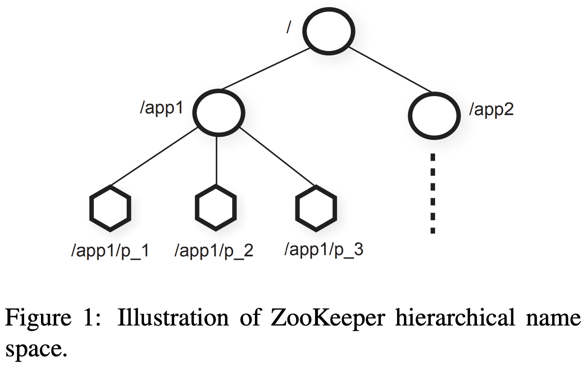
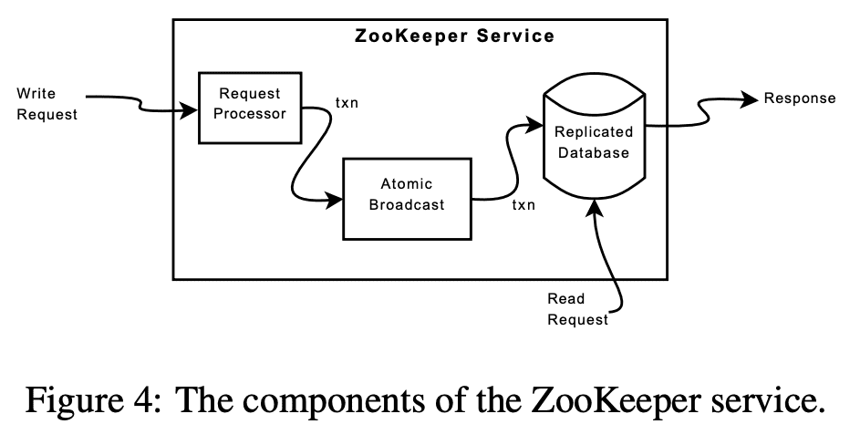

# Zookeeper (ATC ‘10)


[https://www.usenix.org/legacy/event/atc10/tech/full_papers/Hunt.pdf](https://www.usenix.org/legacy/event/atc10/tech/full_papers/Hunt.pdf)

kafka가 zookeeper를 버린 이유 [https://towardsdatascience.com/kafka-no-longer-requires-zookeeper-ebfbf3862104](https://towardsdatascience.com/kafka-no-longer-requires-zookeeper-ebfbf3862104)

# 1. Introduction

zookeeper의 api는 개발자들이 이 api를 이용해 자신 서비스에 필요한 primitive를 구현 할 수 있다. $coordination\ kernel$을 통해 service core의 변경사항 없이 새 primitive를 만들 수 있어 여러 application에 맞춘 다양한 coordination이 가능하다.

zookeeper는 lock같은 blokcing primitive를 쓰지 않는다. blocking primitive는 느리거나 failure가 발생한 client로 인해 정상적인 client의 성능에 악영향을 미치고, 문제가되는 client를 찾기 위해 더 복잡한 로직이 들어가야 한다. zookeeper는 filesystem에 hierarchical하게 관리되는 $wait\text{-}free$ data structure를 접근하는 API를 구현했다. wait-free가 성능, fault-tolerance에서 중요하지만 coordination을 하기엔 부족하므로 opreation order를 보장해준다. 모든 operation에 대한 $FIFO\ client\ ordering$과 $linearizable\ write$를 제공해서 service가 coordination primitive를 구현하도록 해준다.

zookeeper는 high availibility, performance를 위해 replicate된 서버로 구성되어, 많은 Process가 coordination kernel을 쓸 수 있고, pipelined architecture로 만들어져 많은 요청이 low latency로 처리 될 수 있다. pipeline은 한 client에서 온 operation이 FIFO order로 동작하게 만들어 client가 operation을 async로 던질 수 있게 해준다. async를 통해 client는 동시에 여러 요청을 보낼 수 있다. 예를들어 새 client가 리더가 되어서 metadata를 지속적으로 건드리는 일이 있을때 async operation을 활용하게 된다.

zookeeper는 linearizable write를 구현하기 위해 Zab [A simple totally ordered broadcast protocol] 이라는 leader base atomic braodcast protocol 을 쓴다. 하지만 zookeeper 대부분 Operation은 read이고, read는 local에서 동작하기떄문에 scalable하다.

client side에서 cache도 지원한다. 예를들어 leader를 확인하기 위해 매번 zookeeper를 찌르는대신 client cache를 쓰는 상황이 있다. zookeepr는 watch mechanism으로 client가 cache를 직접 관리하지 않고도 caching이 가능하게 해준다. watch mechanism에서는 data object의 모든 update를 ‘watch’하고 update가 발생할때마다 노티를 받는다. 반면에 Chubby [The Chubby lock service for loosely-coupled distributed systems]는 직접 cache를 관리하므로 blocking operation (data가 바뀔때 모든 client가 해당 cache를 invalidate해야함)이 일어난다. 이때 느린 client가 있으면 update가 delay되는데, chubby는 blocking을 막기 위해 lease를 쓴다.

zookeeper의 주요 contribution은

1. **Coordination kernel**: relaxed consistency를 보장하는 wait-free coordination service를 만들었다. 특히 다양한 coordination techinique을 구현할 수 있게 해주는 $coordination\ kernel$을 구현하였다.
2. **Coordination recipies**: zookeeper가 어떻게 higher level coordination primitive를 구현하는데 사용되는지 설명해준다. blocking이나 strong consistency primitive도 가능하다.

# 2. The ZooKeeper Service

client는 zookeeper client library를 써서 zookeeper로 요청을 보낸다, client library는 zookeeper와 통신하는것말고도 network connection도 관리한다. 이 섹션에선 zookeeper service의 high level view를 보여줄것이다.

**Terminology**.
$client$: zookeeper service의 유저
$server$: zookeeper service
$znode$: zookeeper data의 in-memory data node
$data\ tree$: $znode$를 관리하는 hierarchical namespace, update/write 는 $data\ tree$의 상태를 수정하는 작업

$session$: client가 zookeeper와 연결하는 connection, 요청에 대해 session handle을 가짐

## 2.1 Service Overview

hierarchical namespace로 관리되는 znode는 client가 zookeeper api를 통해 접근한다. hierarchical namespace는 주로 Filesystem을 쓴다. unix filesystem path와 비슷하게 notation된다. ephemeral znode는 data를 가질 수 있고, 일반 znode는 data와 children znode도 가질 수 있다.

- **Regular**: client가 직접 생성,삭제를 통해 regular znode를 관리한다.
- **Ephemeral**: client가 직접 생성, 삭제 가능한데, ephemeral znode를 만든 session이 종료되면 system이 알아서 제거한다.

znode를 만들때 client는 $sequential\ flag$를 설정 할 수 있다. sequential flag를 가진 node는 자신 이름 뒤에 monotonic increased counter가 붙는다.  $$$p$ znode 밑에 $n$ znode가 생성되면, $n$은 $p$ 밑에 생성된 기존 znode들보다 무조건 큰 값을 가진다.

zookeeper는 watch를 polling없이 시간에 대한 변경을 노티받는 식으로 구현했다. client가 read operation에 watch flag를 넣어서 요청하면 read data를 받은 이후에 서버가 해당 data의 변경을 감지하면 client에게 알려준다. watch는 session에서 unregister가 trigger되거나, session이 닫히면 unregister된다 (즉 session동안에만 살아있게 된다). 또한 watch는 변경을 알리기만할뿐 변경사항이 무엇인지는 알리지 않는다. connection loss같은 session event도 watch callback을 통해 전달되어 client가 watch callback이 delay될 수 있음을 알 수 있게 해준다.

### **Data model**

zookeeper data model에서 hierarchical namespace는 다른 application의 namespace에 대한 subtree를 생성하고, 접근권한을 설정하는데 쓰인다. 또한 client에서 high level primitive를 만드는데에도 쓰인다.



app1, app2의 서로다른 application이 존재하고, 이중 app1은 group membership protocol을 구현하는데, process $p_i$가 `/app1/p_1` 을 가지는 구조가 될 수 있다.

또한 znode가 data storage로 구현된것은 아니므로, metadata나 configuration을 저장하는데 쓸 수도 있다. 예로 leader-based application에서는 현재 leader의 위치를 알리는데 쓰일 수 있다. znode는 timestamp, version counter에 대한 metadata도 가지므로 client가 znode 변경사항이나, version에 기반한 conditional update도 가능하다.

### **Sessions**

client가 zookeeper와 connect하면 session을 초기화한다. session은 timeout을 가지는데 zookeeper는 timeout 내에 아무런 것도 받지 못하면 failure로 판단한다. session은 client가 직접 session handle을 닫거나, zookeeper가 failure client를 감지할때 닫게된다. session에서 client는 operation의 실행결과를 알수있게 해주는 state change를 관찰한다. client가 session을 통해 zookeeper안의 다른서버로 handoff해도 같은 결과를 받을 수 있도록 하기 위해, zookeeper에서 session은 persist하게 유지된다.

## 2.2 Client API

`create(path, data, flag)`: znode를 생성하고 data를 저장한뒤 znode name을 리턴한다, flag는 znode type과 sequential flag를 설정할 수 있다.

`delete(path, version)`: znode의 해당 version을 지운다

`exists(path, watch)`: znode가 존재하면 true를 리턴한다. watch flag를 통해 znode에대한 상태 변경을 받을 수 있다 (없는 znode도 가능?)

`getData(path, watch)`: 해당 path의 data와 znode metadata(version 포함)를 리턴한다. watch flag를 설정 했을때 getData에서 znode가 없는경우 watch를 하지 않는다.

`setData(path, data, version)`: version이 현재 znode version과 같으면 write한다.

`getChildren(path, watch)`: znode의 children name list를 리턴한다.

`sync(path)`: fsync와 비슷하게 server로 모든 요청이 반영될때까지 기다린다.

API에서 single operation이며 concurrent task가 없으면 blocking으로 동작하고, parallel이며 여러 operation이 실행되는경우 async로 동작한다. zookeeper client는 각 operation의 callback들이 in-order로  실행되는것을 보장한다.

zookeeper는 znode접근을 위해 handle을 쓰지 않는다. 그대신 각 request는 znode의 full path를 가진다. open, close같은 method가 없어 더 간단해질뿐만아니라 server가 유지해야할 extra state도 제거하기 떄문이다.

update method는 expected version number를 가지므로 conditional update를 가능하게 한다. version이 `-1` 로 설정되면 version check를 하지 않는다.

## 2.3 ZooKeeper Guarantees

**Linearizable writes**: zookeeper의 모든 state update request는 serialzable하고 precedence를 지킨다.

**FIFO client order**: 한 client에서 받은 모든 request는 client가 request를 요청한 순서대로 실행한다.

- 이 paper에서 통상적으로 사용되는 linearizability와는 조금 다른 뜻을 가지고 있다. 원래 정의(A-linearizable)는 한 client가 특정 시점에 한개의 outstanding operation만을 가져야 하지만, 여기서는 client가 multiple outstanding operation을 가진다. (이해못함) we can choose to guarantee no specific order for outstanding operations of the same client or to guarantee FIFO order. We choose the latter for our property. It is important to observe that all results that hold for linearizable objects also hold for A-linearizable objects because a system that satisfies A linearizability also satisfies linearizability. Because only update requests are A-linearizable, ZooKeeper processes read requests locally at each replica. This allows the service to scale linearly as servers are added to the system.

두 guarantee가 어떻게 interact하는지 보기위해 아래 시나리오를 생각해보자. 여러 process가 존재하는 system에서 leader를 선출하려 한다. 새 leader가 뽑히면 configuration parameter를 바꾸고 다른 process에게 leader가 뽑혔음을 알려야한다. 이때 두가지 요구사항이 생긴다. 1) 새 leader가 change를 만들면 다른 process가 현재 변경중인 config르 사용하지 않기를 원한다. 2) 새 leader가 config를 모두 업데이트 하기전에 죽었을때 partial config가 생기지 않기를 원한다.

distributed lock은 첫번째 요구사항을 맞출수는있지만 두번째는 불가능하다. zookeeper에서 새 leader는 $ready\ znode$의 path를 지정할 수 있어 다른 process는 이 znode가 존재할때만 해당 config를 사용할 수 있다. 새 leader가 ready znode를 지우고, config를 update하고, ready znode를 만든다. 이 operation들은 async로 빠르게 동작한다. ordering gurantee로 인해 ready znode가 생겼다는것을 process가 보게되면 새 leader의 configuration도 볼 수 있다. 새 leader가 ready znode를 생성하기 전에 죽으면 다른 process는 새 config를 쓰지않는다.

하지만 leader가 ready를 지우기 전에 process가 ready를 보고, config를 읽는도중에 leader가 ready를 제거한뒤 config를 수정하면 문제가 된다. 이건 noti에 대한 ordering guarantee로 해결할 수 있다. client가 change를 보고있으면 client는 새 state를 보기 전에 notification을 받게된다. 따라서 ready znode를 본 process가 znode의 변경사항을 noti받으면, 새 config를 읽기전에 client에게 ready znode변경에 대한 알림을 받을 수 있게 된다.

다른 문제점은 zookeeper 바깥에서 client들끼리 통신하는경우이다. A가 zookeeper의 config를 변경후 B에게 알리면 B는 config를 다시 읽는다. 만약 B가 통신하는 zookeeper replica가 A와 통신하는 zookeeper replica보다 살짝 느리면 새 config를 보지 못할 것이다. 이땐 ordering guarantee를 이용해서 config를 읽기 전에 `sync` 를 시도하는것으로 최신상태인지 확인할 수 있다.

zookeeper는 liveness, durability도 보장한다. zookeeper의 절반 이상 서버가 active하면 available하다. zookeeper가 change request에 success를 리턴하면 change는 eventually applied 된다.

## 2.4 Examples of Primitives

### Configuration Management

가장 단순한 configuration은 znode $z_c$에 저장하는 것이다. process는 $z_c$의 full path name으로 시작한다. process는 $z_c$를 watch flag로 읽는것으로 시작한다. $z_c$가 업데이트 되면 process는 알림을 받고 새 config를 읽는다(이때 또 watch flag를 걸음)

이때 watch는 up-to-date한 config를 읽도록 해준다. $z_c$를 watch하는 Process가 $z_c$의 변경을 알림받고, $z_c$를 읽기 전에 3개 이상의 change가 생기면 process는 이 변경에 대한 noti를 받을 수 없다. 하지만 process가 znode를 읽으려고 하기때문에 이 noti가 씹히는것은 영향을 주지 못한다.

### Rendezvous (barrier와 차이점이 뭐지!)

client가 scheduler에 의해 master process와 여러 worker process로 시작하면 client는 worker가 master와 통신할수 있는 address같은 정보를 미리 알 수 없다. zookeeper에서는 client에 의해 생성되는 rendezvous znode $z_r$로 해결 할 수 있다. client는 worker, master를 시작할때 startup parameter로 $z_r$의 full pathname을 설정하고. master는 $z_r$에 address를 넣어 write한다. worker가 시작할때 $z_r$을 watch flag로 read하면 master의 address를 얻게 할 수 있다. $z_r$을 ephemeral node로 설정하면 master와 worker 가 $z_r$이 삭제되는것도 watch를 할 수 있다.

### Group Membership

ephemeral node는 session state를 간접적으로 알 수 있게 해주므로 group membership에서 유용하다. group을 나타내는 $z_g$로 시작하고, group의 process member가 시작할때 $z_g$밑에 ephemeral child znode를 만든다. 각 process가 unique id를 가진다면 그 name이 child znode에 쓰이거나 아니면 sequential flag를 통해 unique name을 만들 수 있다. process는 child znode에 address같은 process정보를 넣는다. child znode가 생성되면 딱히 할건없고, process에 failure가 발생하거나 종료하게되면 $z_g$는 제거된다. $z_g$밑에 children이 있어서 쉽게 group information을 가질 수 있다. process가 group membership change를 보고싶을땐 watch flag를 설정하면 된다.

### Simple locks

client는 lock을 얻을때 ephemeral znode를 생성한다. 생성이 성공하면 lock을 얻은것이다. unlock은 ephemeral znode를 지우면된다. 실패하면 client는 znode를 watch해서 lock이 release되는것을 noti받는다. client failure가 발생할때에 zookeeper가 ephemeral znode를 제거해주므로 deadlock이 발생하지는 않는다.

이 simple lock은 herd effect엔 취약하다. 많은 client가 lock을 얻으려한다면 unlock이 발생할때 경쟁이 발생한다. 또한 exclusive locking만 구현한것이므로 rw lock이 필요한경우에는 적합하지않다.

### Simple Locks without Herd Effect

```bash
1  Lock() {
2    n = create(l + "/lock-", EPHEMERAL|SEQUENTIAL)
3    C = getChildren(l, false)
4    if n is lowest znode in C; exit
5    p = znode in C ordered just before n
6    if exists(p, true) wait for watch event
7    goto 3
8  }
9
10 Unlock() {
11   delete(n)
12 }
```

znode $l$밑의 내 znode number가 순번을 의미한다. ephemeral로 설정하는 이유는 failure가 발생했을때 순번에서 제외하기 위한 것이다. watch는 내 znode보다 바로 이전 znode를 보게된다.

1. znode를 제거하는것은 한 client만 깨우기 때문에 herd effect가 생기지 않는다.
2. polling, timeout이 없다.
3. lock contention을 확인하거나, break를 하는등 디버깅이 가능하다.

### Read/Write Locks

```bash
1  WriteLock() {
2    n = create(l + "/write-", EPHEMERAL|SEQUENTIAL)
3    C = getChildren(l, false)
4    if n is lowest znode in C; exit
5    p = znode in C ordered just before n
6    if exists(p, true); wait for event
7    goto 3
8  }
9
10 ReadLock() {
11   n = create(l + "/read-", EPHEMERAL|SEQUENTIAL)
12   C = getChildren(l, false)
13   if no write znodes lower than n in C; exit
14   p = write znode in C ordered just before n
15   if exists(p, true) wait for event
16   goto 13
17 }
```

### Double Barrier

double barrier는 client가 computation의 시작/끝을 sync할 수 있게 해준다. barrier thresh를 넘으면 computation을 시작하고, computation이 끝나면 barrier를 끝낸다. barrier $b$를 시작할때, 각 process $p$는 $b$의 children에 znode를 만들고, barrier가 끝났으면 자신이 만든 zonde를 제거한다. process는 $b$의 children 갯수가 barrier threshold를 넘으면 barrier에 들어간다. 그 후 모든 process가 children을 제거하면 barrier가 종료된다. watch를 이용해서 위 조건들이 충족됐는지 확인할 수 있다. barrier에 들어갈때 process는 znode $b$를 watch해서 ready child를 확인할 수 있다. barrier가 끝났는지 확인할때도 비슷하다.

# 3. ZooKeeper Applications

어째 첨듣는 yahoo application있어서 생략..

# 4. ZooKeeper Implementation



zookeeper는 각서버에 data를 replicate하여 high availability를 만든다. request를 받으면 server는 execution을 준비하고(request processor), write request인경우 coordination이 필요하므로 aggrement protocol을 이용한다 (atomic broadcast). 마지막으로 server는 모든 server에 replicate되는 db에 변경사항을 commit한다. read request가 오면 각 server는 local database에서 읽어서 response를 리턴한다.

replicated database는 모든 data tree를 들고있는 $in\text{-}memory\ database$이다. fault-tolerance를 위해 log를 disk에 남긴 뒤 in-memory db에 업데이트 한다. 그리고 주기적으로 snapshot을 생성한다.

모든 zookeeper server는 client와 통신한다. client는 단 하나의 server와만 통신한다. write request는 aggrement protocol을 쓰는데, $leader$ server로 요청이 forward된다. $follower$는 leader로부터 state change에 대한 요청을 받아서 agree를 한다. (왠지 raft랑 비슷할것같음)

## 4.1 Request Processor

messaging layer가 atomic 하므로 (write request를 한놈만 처리하고 commit이 있음), local replica가 diverge하지 않는다. client에게서 받은 request와는 다르게 transaction은 idempotent하게 변환된다. leader가 write request를 받으면 write를 할때의 state를 계산하고 새 state를 들고있는 transaction으로 변환한다. outstanding transaction이 db에 적용되지 않을 수 도 있으므로 미래의 state를 계산 해야한다. 예를들어 client가 conditional setData와 version number를 명시해서 주면, service는 새 data와 새 version number, updated timestamp를 가지는 setDataTXN으로 변환한다. 에러가 발생하는 경우(version number가 맞지 않거나, znode가 없는경우) errorTXN이 생성된다.

## 4.2 Atomic Broadcast

leader는 write request를 받아 Zab이라는 atomic broadcast protocol을 통해 broadcast한다. client request를 받은 server는 state change를 전달할때 client에게 알려준다. Zab은 state change에 대해 aggrement를 할때 2n+1 server가 agree하면 된다.

high throughput을 위해 zookeeper는 request processing을 pipelining한다. processing pipeline의 다른 stage에 수천개의 request가 있을 수 있다. state change가 이전 state change에 의존성이 있으므로 zab은 일반적인 atomic broadcast보다 더 강력한 order guarantee를 준다. zab은 change가 순서대로 전달되고, 이전 leader의 모둔 change는 새 leader가 request를 broadcast하기전에 모두 새 leader에게 전달된다.

일반적으로 zab은 모든 message를 in-order, exactly-once로 전달하지만, zab이 deliver되는 모든 message에 대해 record id를 저장하지 않아서 recovery동안에 두번 전달할 수 있다. 하지만 transaction을 idempotent하게 만들기때문에 문제가 되진 않는다. zookeeper는 last sanpshot이후에 생성된 모든 message를 redeliver해서 deliver를 보장한다.

## 4.3 Replicated Database

server failure이후에 state를 복구해야한다. 모든 message를 replay하는건 시간이 엄청 오래걸리기때문에 zookeeper는 snapshot과 snapshot 이후의 message를 활용한다. zookeeper에서 snapshot을 찍을때 lock을 하지 않으므로 $fuzzy\ snapshot$이라 부른다. fuzzy snapshot은 znode의 data,metadata를 DFS를 통해 atomic 하게 읽고 disk로 write한다. fuzzy snapshot은 state change 과정의 일부만 반영된 상태를 캡쳐할 수 있어 snapshot만으로는 partial state가 되지만, message을 모두 redeliver하여 complete state로 만든다(message는 모두 idempotent transaction으로 변환).

fuzzy snapshot을 시작할때 state는 다음과 같다. `</foo, f1, 1>, </goo, g1, 1>` (각각 path, data, version) 또한 다음과 같은 state change도 진행중이다. `<SetDataTXN, /foo, f2, 2>, <SetDataTXN, /goo, g2, 2>, <SetDataTXN, /foo, f3, 3>` 이 state change가 모두 반영된다면 `</foo, f3, 3>, </goo, g2, 2>` 가 된다. 하지만 fuzzy snapshot에서는 `</foo, f3, 3>, </goo, g1, 1>` 을 캡쳐해서 invalid state이다. 이때 server가 failure이후에 recover할때 server는 snapshot과 모든 state change를 redeliver해서 valid state로 만들게 된다.

## 4.4 Client-Server Interactions

server가 write request를 처리할때 해당 update에 대한 notification을 보내거나 clear해야한다. server는 in-order로 write를 처리하고 동시에 다른 write나 read를 진행하지는 않아 notification의 연속성(?)을 보장한다. server는 notification을 local에서 처리하고, client와 연결된 server만 해당 client에게 notification을 전달한다.

각 read request는 server local에서 server가 해당 시점의 last transaction id인 $zxid$를 태깅하고 있는다. $zxid$는 연관된 write request에 대한 read request의 partial order로 정의된다(???). read가 local에서 in memory로 도작하므로 성능은 빠르다.

fast read의 단점은 read operation에 대한 precedence order를 보장하지 않는 것이다. 즉 read operation은 같은 znode가 commit되더라도 stale value를 리턴할 수 있다(async). 모든 application이 precendence order를 필요로하지않지만 필요로 하는경우 sync operation을 써서 모든 pending write가 반영되는것을 기다리면 된다. server에서 sync를 broadcast하진 않는다. leader와 sync를 받은 server의 request queue끝에 놓기만하면 순서는 보장된다. 하지만 이게 동작하려면 follower는 sync 요청을 전달한 leader가 계속 leader임을 보장 받을수 있어야 한다. pending transaction이 있으면 server는 leader라고 믿지만, empty이면 leader는 null transaction을 sync이전에 넣어 leader임을 확인시켜준다. 이건 leader가 broadcast traffic을 만들지 않아서 high load에서 성능영향을 크게 주지 않는다. leader는 follower들이 다른 leader를 설정하기 전에 자신이 leader가 아님을 인지하도록 timeout이 설정되어있으므로 이땐 null transaction을 만들지 않아 — (여기서부턴 추정,)  sync요청을 보낸 server에게 에러를 리턴한다.

zookeeper server는 요청을 FIFO order로 수행하고, response에는 $zxid$를 포함한다. client가 아무런 요청을 보내지 않아도 heartbeat로 last $zxid$를 보낸다. client가 새 server와 연결할때 새 server는 client가 가지고 있던 last $zxid$보다 높은 값을 가지도록 보장한다. 만약 client가 더 최신값을 가지면 server는 해당 $zxid$까지 catch up하고나서 client와 session을 만든다. client가 handoff에서도 up-to-date한 상태를 보기때문에 durable해진다.

client session failure를 감지하기위해 server에선 Timeout을 쓴다. leader는 session timeout내에 server가 아무것도 받지 못하면 failure라고 본다. client가 request를 자주 보내면 다른 메시지를 보낼 필요가 없고, 자주 보내지않으면 heartbeat를 보낸다. client가 server와 요청이나 heartbeat를 주고받지 못하게 되면 client는 다른 zookeeper server와 통신한다 (이 다른 zookeeper server host는 어디서 얻지..). timeout은 대략 $s$ millisecond인데, heartbeat는 $s/3$ms 이고, 새 server로 switch되는 timeout은 $2s/3$ms이다.