# Exactly-Once in Apache Flink (Seminar)

# ToC

- Flink
- exactly-once는 어떻게 달성할 수 있을까? w/ message queue
- Flink에서 exactly-once 어떻게 보장하는가?

# Apache Flink

## Overview

[https://nightlies.apache.org/flink/flink-docs-release-1.14/docs/learn-flink/overview/](https://nightlies.apache.org/flink/flink-docs-release-1.14/docs/learn-flink/overview/)

MapReduce의 확장팩(Spark)의 확장팩

**Stateful** stream processing

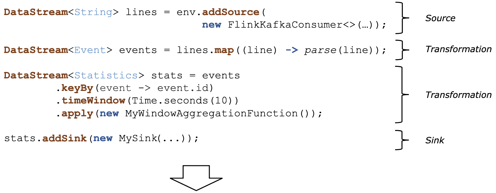

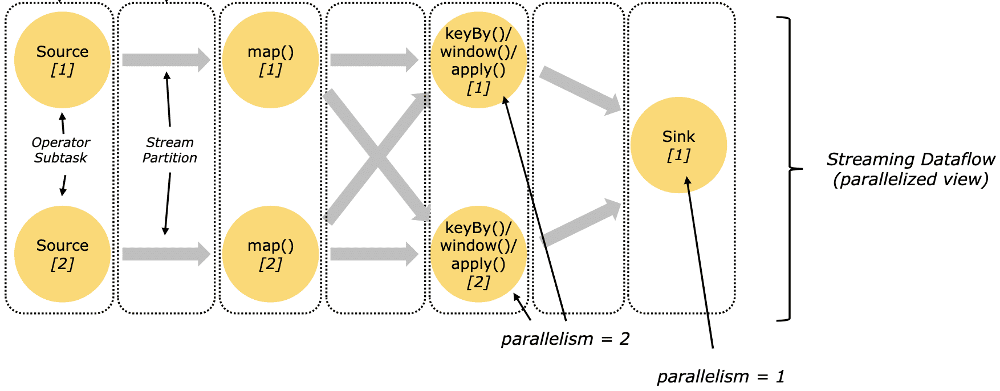

## MapReduce (2004)

[https://static.googleusercontent.com/media/research.google.com/ko//archive/mapreduce-osdi04.pdf](https://static.googleusercontent.com/media/research.google.com/ko//archive/mapreduce-osdi04.pdf)

MapReduce가 생긴 계기

> Over the past five years, the authors and many others at Google have implemented hundreds of special-purpose computations that process large amounts of raw data, such as crawled documents, web request logs, etc., to compute various kinds of derived data, such as inverted indices, various representations of the graph structure of web documents, summaries of the number of pages crawled per host, the set of most frequent queries in a given day, etc. 
Most such computations are conceptually straightforward.
However, the input data is usually large and the computations have to be distributed across hundreds or thousands of machines in order to finish in a reasonable amount of time.
The issues of how to parallelize the computation, distribute the data, and handle failures conspire to obscure the original simple computation with large amounts of complex code to deal with these issues.

As a reaction to this complexity, we designed a new abstraction that allows us to express the simple computations we were trying to perform but hides the messy details of parallelization, fault-tolerance, data distribution and load balancing in a library.
We realized that most of our computations involved applying a map operation to each logical “record” in our input in order to compute a set of intermediate key/value pairs, and then applying a reduce operation to all the values that shared the same key, in order to combine the derived data appropriately.
> 

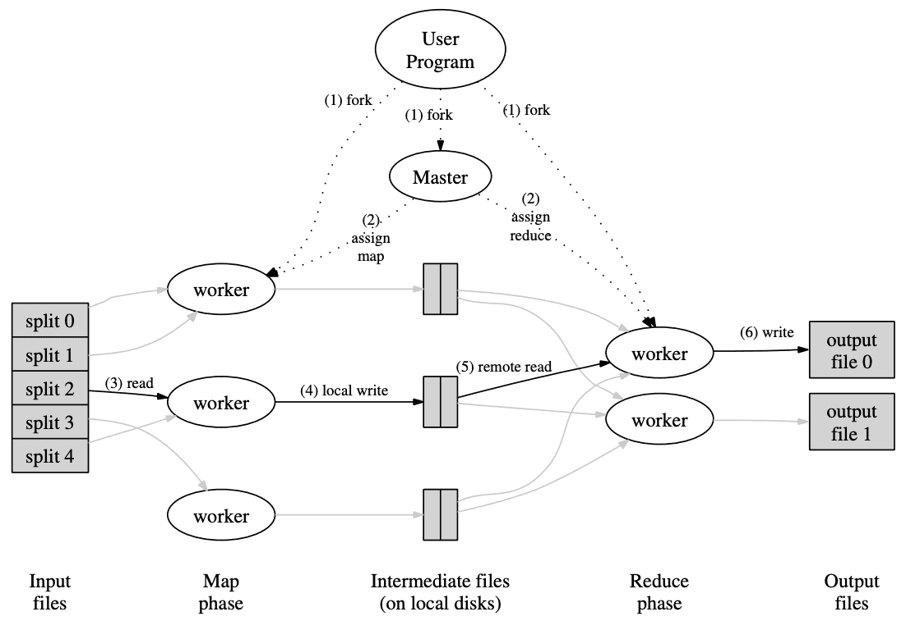

## Architecture

[https://nightlies.apache.org/flink/flink-docs-release-1.14/docs/concepts/flink-architecture/](https://nightlies.apache.org/flink/flink-docs-release-1.14/docs/concepts/flink-architecture/)

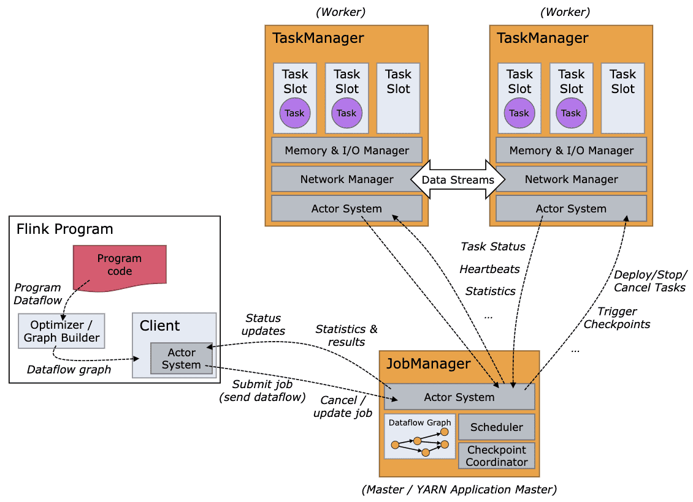

# Realtime Exactly-Once Ad Event Processing at Uber

[https://eng.uber.com/real-time-exactly-once-ad-event-processing/](https://eng.uber.com/real-time-exactly-once-ad-event-processing/)

- 광고주에게 정확한 광고 성과를 보여줘야 한다. data loss는 광고 성과를 낮게 보여준다
- event를 중복집계해서는 안된다. 광고성과를 부풀려서 보여주게 된다
- attribution 또한 100% 정확해야 한다

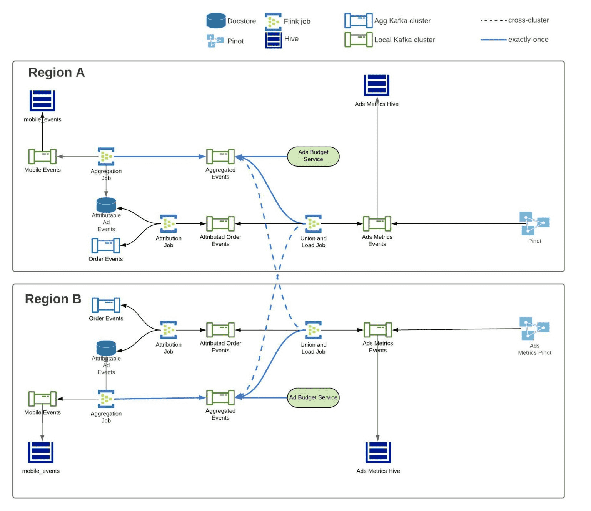

- Flink는 exactly-once를 지원하고, consumer service가 `read_commited` message만 읽으면 end-to-end exactly-once 완성
- attribution을 넣으려면 data enrichment가 필요하므로 외부 db에서 읽는 경우도 있음

# Exactly-Once

[https://www.confluent.io/blog/exactly-once-semantics-are-possible-heres-how-apache-kafka-does-it/](https://www.confluent.io/blog/exactly-once-semantics-are-possible-heres-how-apache-kafka-does-it/)

### Exactly-Once 고려사항

- Broker(Kafka) Failure
N replication을 지원하고, replication protocol이 exactly-once를 지원하므로, N-1 failure에서도 durable하다
- failed put
network failure로인해 broker가 message를 못받았거나, publisher가 ack를 못받았을경우 retry로 인해 문제가 발생할 수 있다
- client(producer/consumer) failure
producer의 failure는 message가 날아갈수밖에없지만, client는 save point에서 다시 시작할 수 있어야 한다.

### Exactly-Once in Kafka

- **Idempotence: exactly-once in order semantics per partition**
producer send operation을 idempotent하게 만들었음. message에 sequence number를 남겨 idempotency 보장
- **Transactions: Atomic writes across multiple partitions**
transaction을 통해 atomicity 지원
- **Exactly-once stream processing - consumer ?????????? Flink**
kafka streams API에서 stream processing을 하면 exactly-once를 지원한다 - java

> 하지만 go/python에서 streams API는 없음
> 

## Exactly-Once Processing in Flink

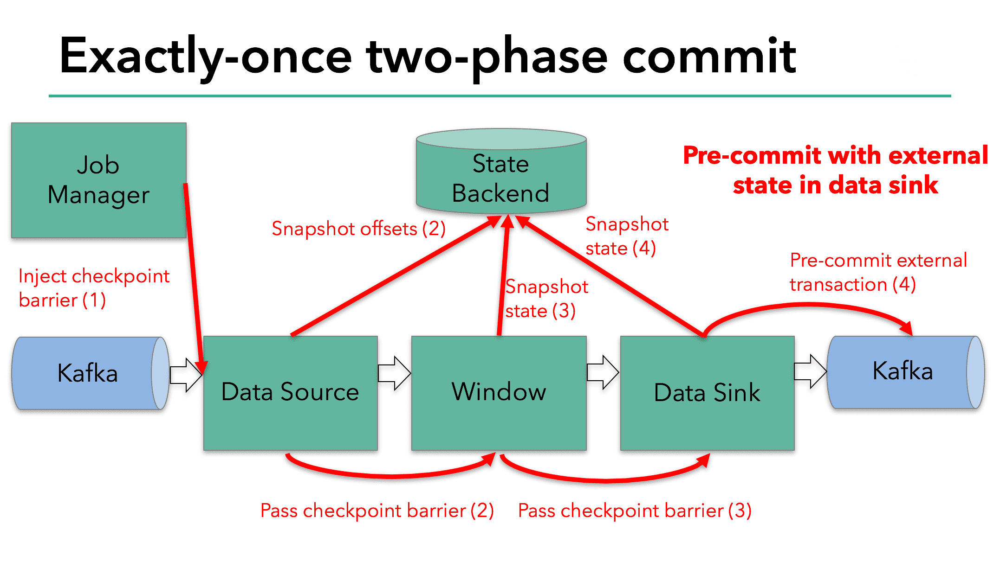

- checkpoint **barrier** 를 datasource channel에 주입
- task들은 barrier를 받을때마다 state backend에 현재 snapshot을 저장
- sink task는 Kafka에 pre-commit

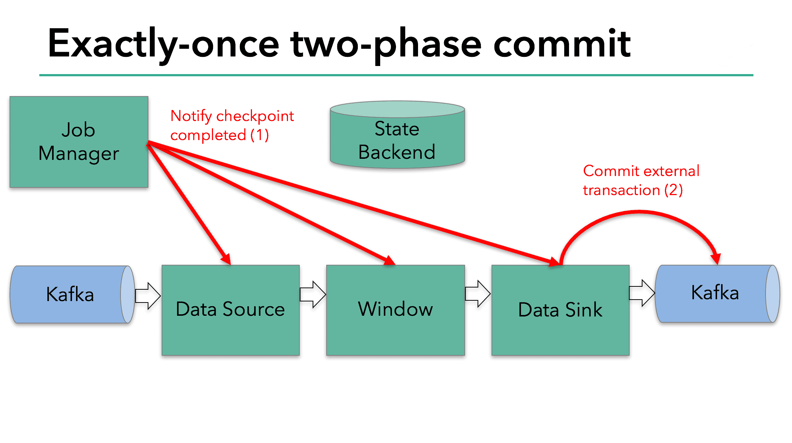

- 모든 pre-commit이 완료되면 jobmanager는 모든 task에게 pre-commit이 완료되었음을 전달
- sink task는 commit을 호출
    - 그 다음의 consumer는 commit된 message를 읽어갈 수 있음

## Chandy-Lamport’s global snapshot algorithm

[http://composition.al/blog/2019/04/26/an-example-run-of-the-chandy-lamport-snapshot-algorithm/](http://composition.al/blog/2019/04/26/an-example-run-of-the-chandy-lamport-snapshot-algorithm/)

distributed system에서 asynchronous global snapshot을 만드는 알고리즘

- snapshot을 생성하는동안 program이 멈춰있지 않아도 됨 (asynchronous)
- master node가 없음 - spof에서 자유로워진다

1. $P_i$: 독립적으로 실행되는 프로세스
2. dot: 이벤트 발생
3. 화살표: process간 이벤트 전달
4. $C_{ji}$: $P_j$에서 $P_i$로 이벤트를 전달하는 채널

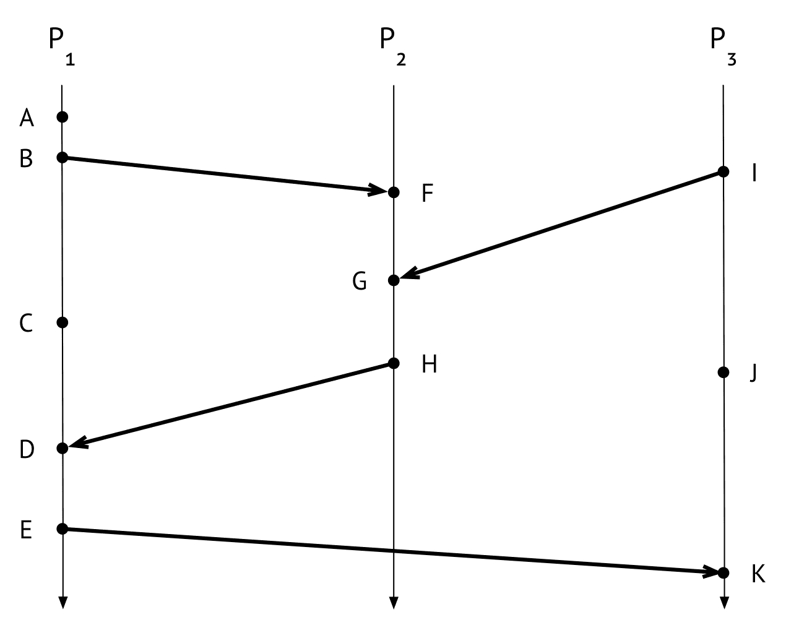

$P_1$

- $P_1$ 에서 B 이벤트가 끝난 직후 스냅샷을 생성하라고 요청
- $P_1$ barrier(marker message)를 다른 process에게 전달 (주황점선), barrier는 speical event로, snapshot에 찍히는 이벤트의 대상은 아니다
- incoming channel $C_{21}$, $C_{31}$에 대해 레코딩 시작

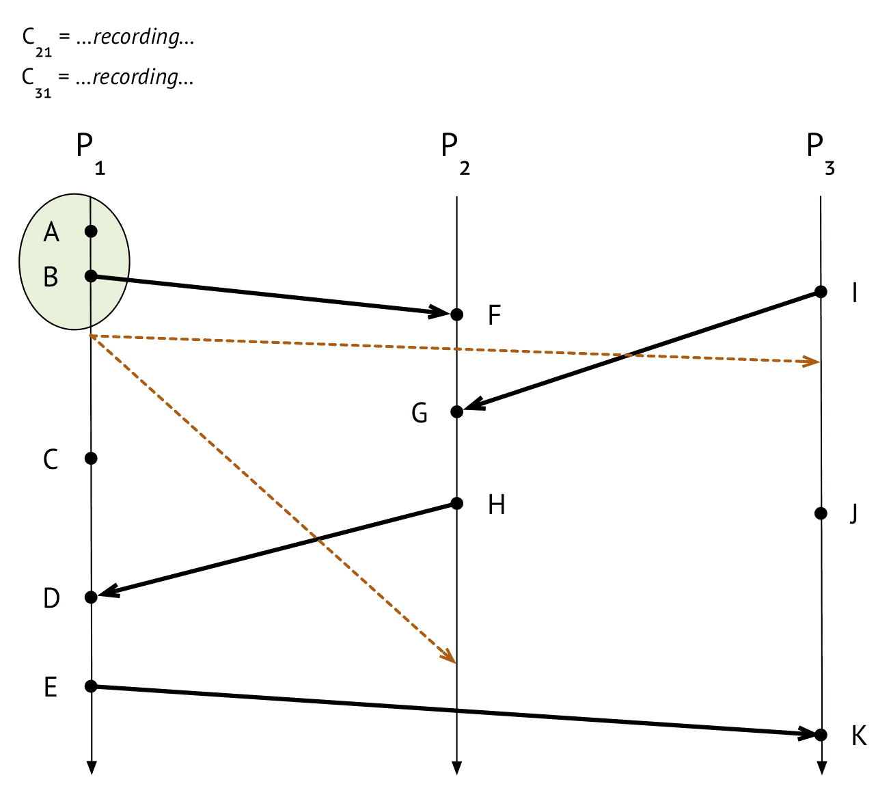

$P_3$

- $P_3$은 $P_1$로부터 barrier를 받아서 snapshot을 캡처
- $P_1$이 했던것과 비슷 한일을하지만, $P_1$에서 barrier를 받았으므로 $C_{13}$ 채널을 레코딩할 필요없이 empty로 저장

$P_1$

- $P_3$에게서 barrier를 받음
- $C_{31}$ 채널 레코딩 끝내고 상태 저장

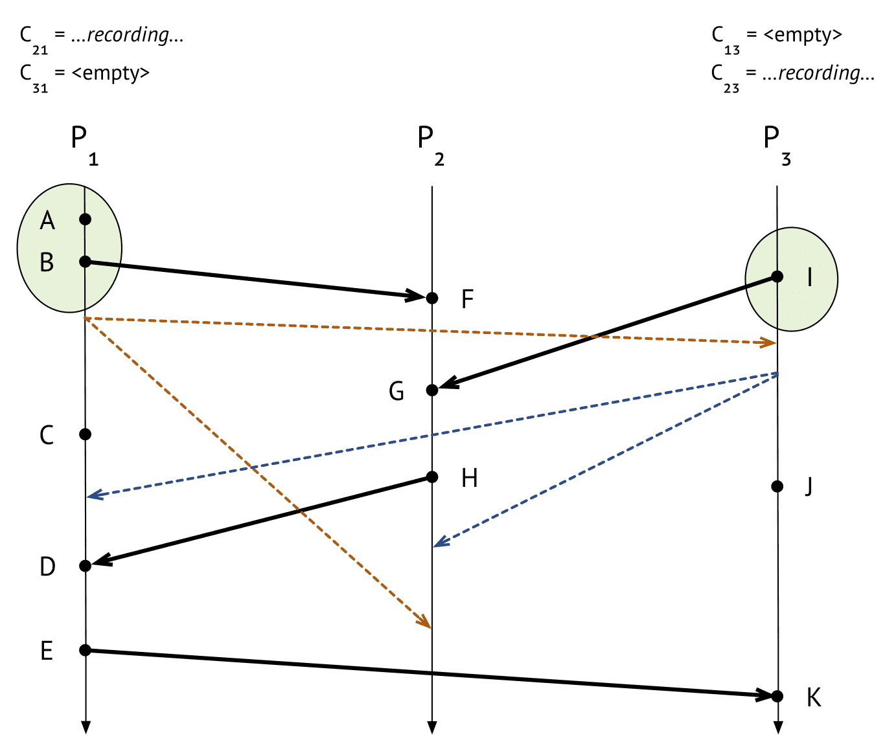

$P_2$

- $P_3$에게서 barrier 받음

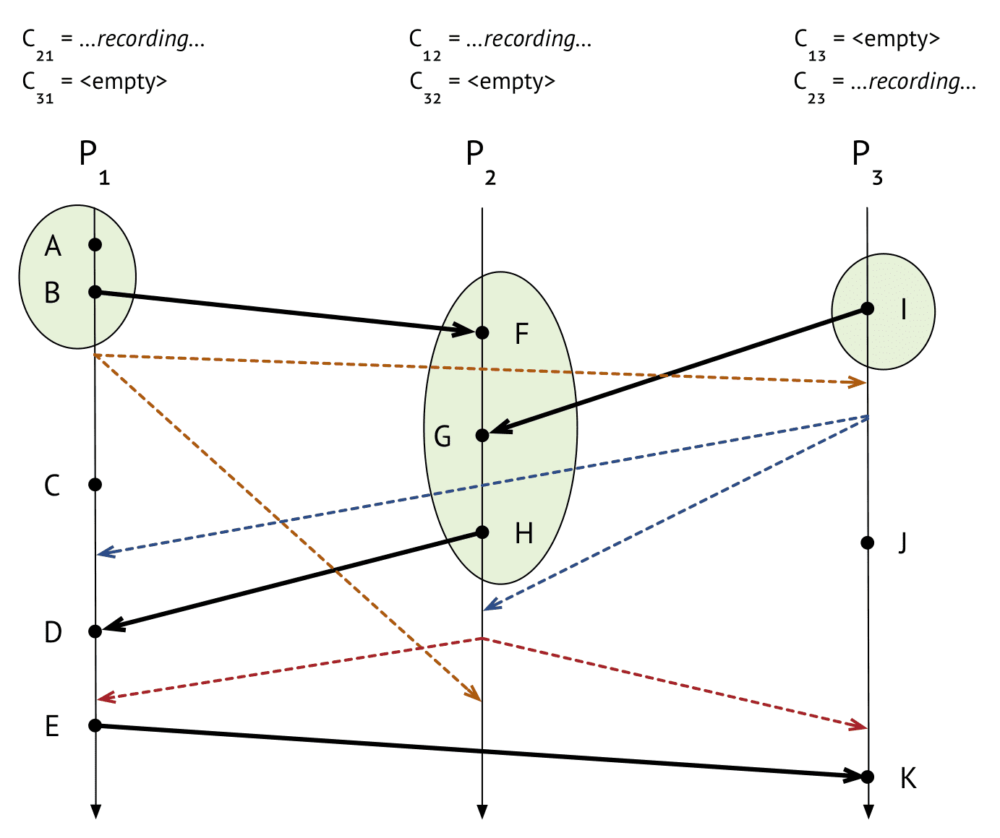

$P_2$

- $P_1$에서 barrier 받음

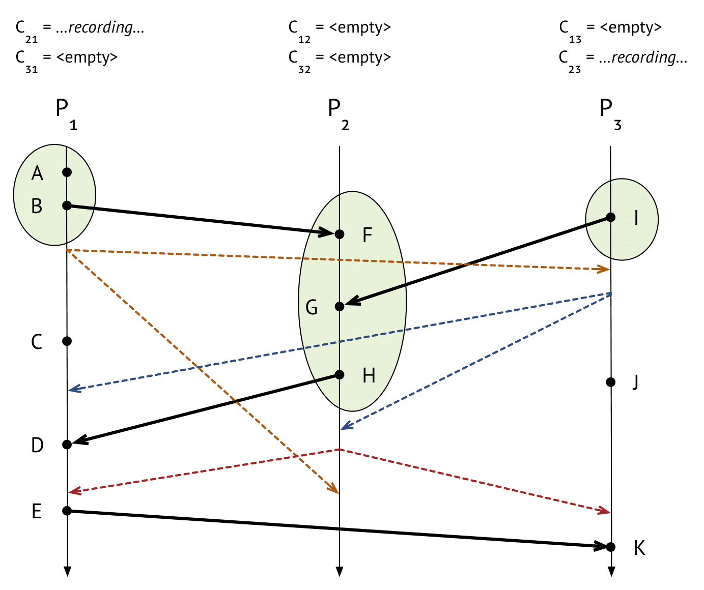

$P_1$

- $P_2$에서 barrier받음
- $C_{21}$ 채널에 들어온 이벤트 `[H->D]` 가 있으므로 이 상태를 저장

$P_3$

- $P_2$에서 barrier 받음

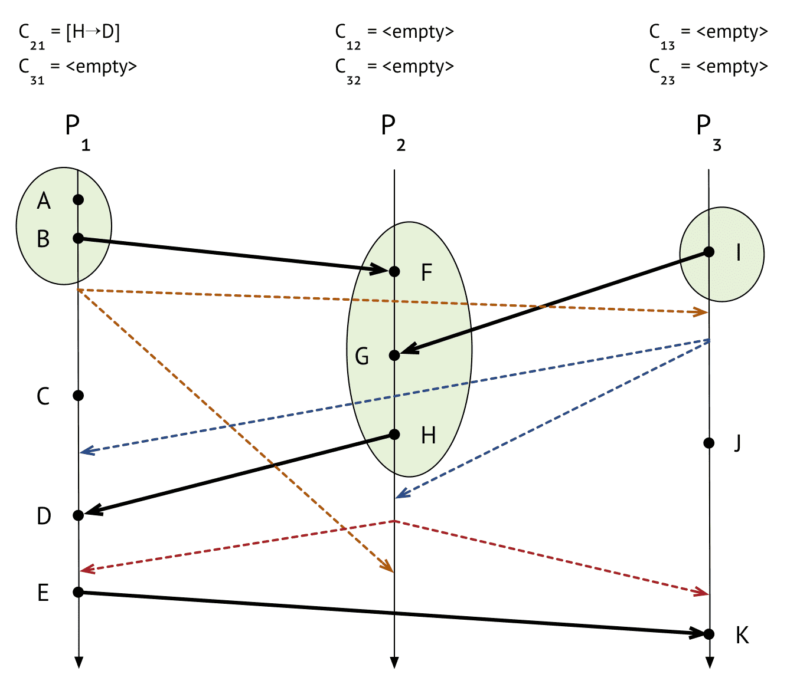

final state

- 스냅샷을 찍은 시점 기준으로 **happened before** event가 snapshot에 포함되는것을 보장함
- causal consistency
    - eventual consistency << causal consistency << sequential consistency

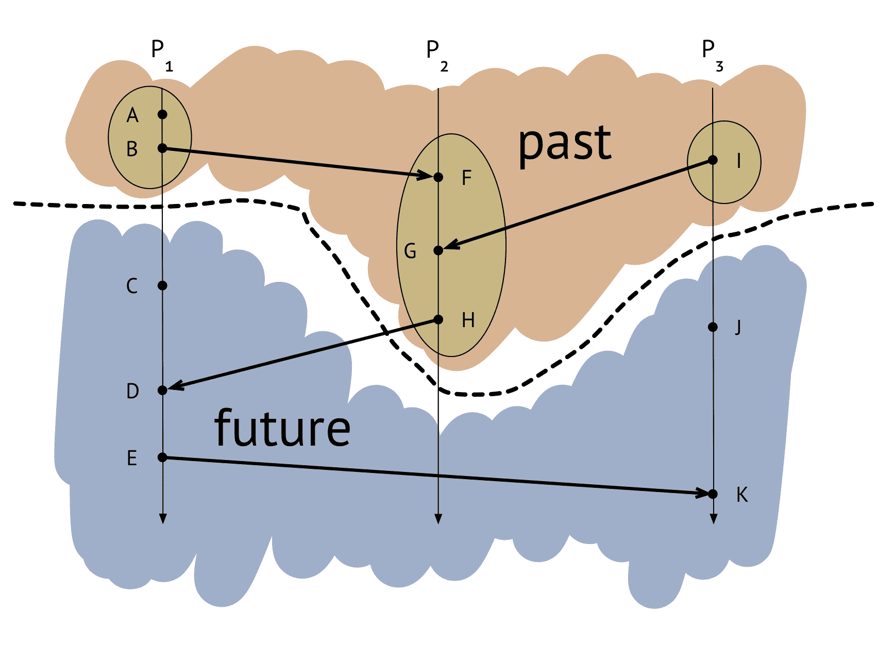

## Flink’s checkpointing algorithm

Lightweight Asynchronous Snapshots for Distributed Dataflows
[https://arxiv.org/abs/1506.08603](https://arxiv.org/abs/1506.08603)

Flink의 dataflow와 chandy-lamport algorithm의 constraint와 다른점

- dataflow는 directed graph형태, chandy-lamport는 모든 Process간 자유롭게 통신 가능하다
- 바뀌는 제약조건
    - source가 되는 task들에게 barrier를 주입해줘야 한다, chandy-lamport는 어떤 process에서부터 주입해도 문제 없음
    - dataflow가 directed acyclic graph인 경우, 채널이 단방향이 되므로 채널 레코딩이 필요없어진다
        - cycle이 생기는경우에 대한것도 위 링크에 있긴함

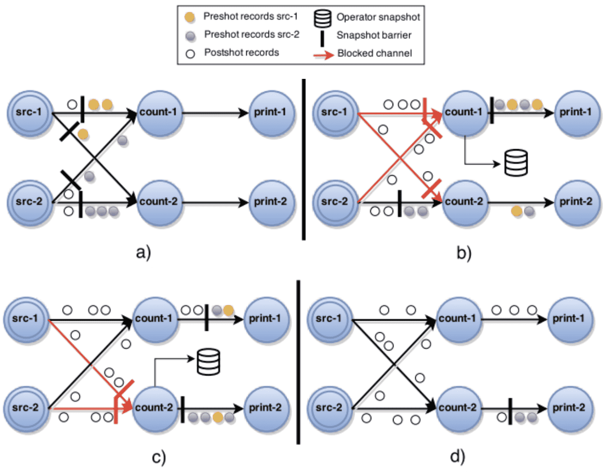

## 요약

- Flink
    - MapReduce - Spark 의 다음 세대 (native event stream processing)
    MapReduce: 많은 데이터 프로세싱에 대해 infrastructure를 떼어내고 library를 제공해주어 쉽게 scale-out이 가능한 시스템
    Spark: Mapreduce가 disk IO를 바탕으로 돌아가는 것을 개선하여 in-memory로 처리
    Flink: Spark가 stream processing이지만 micro batch인 결점을 보완하여 실제로 event단위로 동작하도록 만든 real-time event processing framework
- Exacty-Once guarantee
    - 유저에게 정확한 성과를 보여주기 위해선 exactly-once가 필수
    - 정상 상황에선 문제 없다, network failure에서도 idempotent operation을 만들면 문제없다, 하지만 failure상황에서 시스템이 어떻게 동작하냐에 따라서 보장여부가 결정된다
- Flink의 Exactly-Once
    - two-phase commit으로 동작
    - chandy-lamport snapshot based algorithm
