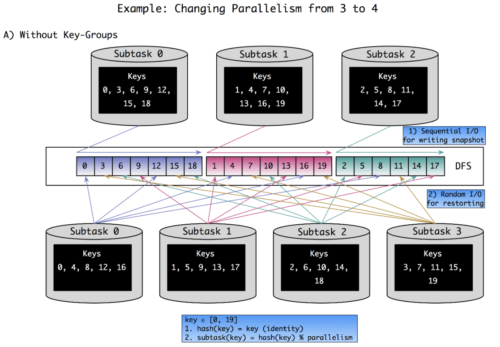
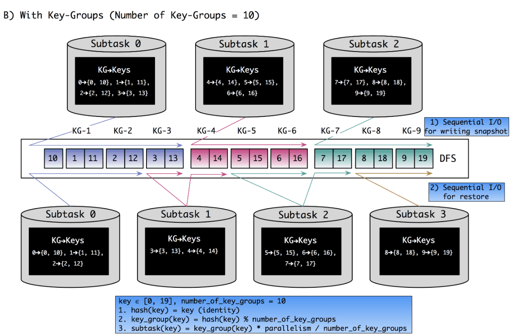

# A Deep Dive into Rescalable State

[https://flink.apache.org/features/2017/07/04/flink-rescalable-state.html](https://flink.apache.org/features/2017/07/04/flink-rescalable-state.html)

# Stateful Stream Processing

operator의 메모리로서, stream processing에서 과거 정보를 기억하고 미래의 input에 사용 할 수 있는  state를 고려해보자. stateless stream processing의 operator는 과거의 context는 필요없이 현재 input만 고려하면 된다. 예를들어 `e = {event_id:int, event_value:int}` 스키마인 이벤트를 emit하는 source stream을 생각해보자. 목표는 각 이벤트를 `event_value`를 extract하여 output으로 쏘는 것이다. 이것은 쉽게 `source-map-sink` pipeline으로 만들 수 있다. 이런것은 stateless stream processing이다.

하지만 이전의 event에서 생긴 `event_value` 보다 큰 값만 output으로 내뱉는다면 어떻게 해야할까? map function은 과거 event에 대한 `event_value` 를  기억하고 있어야한다. 이것이 stateful stream processing 이다.

# State in Apache Flink

Apache Flink는 large scale로 stateful stream processing을 할 수 있는 massively parallel distributec system이다. Flink job은 logical하게 operator들의 graph로 decompose되고, operator execution은 physical하게 여러 parallel operator instance로 decompose된다. Flink의 각 parallel operator instance는 **shared-noting machine** 으로 구성되는 cluster의 머신에 스케줄링 되는 독립적인 task이다.

high throughput, low latency를 위해 task간 network communication은 최소화 되어야 한다. Flink에서 stream processing의 network communication은 job operator graph의 logical edge(**vertically**)에서만 발생하므로, stream data는 upstream에서 downstream operator로 전송될 수 있다.

하지만 operator의 parallel instance간 coomunication (**horizontally**)은 없다. 이 communication을 피하기 위해 data locality는 Flink에서 key priciple이고, 어떻게 state가 access,store 되는데 큰 영향을 미친다.

data locality를 위해 Flink의 모든 state data는 parallel operator instance를 실행하는 task에 바인딩되고, task를 실행하는 machine에 배치된다.

위와같은 디자인을 통해 task의 모든 state data는 local에 있고, state access를 하기 위해 task간 network communication을 하지 않는다.

Flink는 state를 operator state와 keyed state라는 두 타입으로 구분한다. operator state는 operator의 parallel instance (sub-task)의 scope를 가지며, keyed state는 key단위로 정확히 하나의 state partition을 가지는 operator state라고 말할 수 있다.

# Rescaling Stateful Stream Processing Jobs

stateless streaming에서 parallelism을 바꾸는 것은 쉽다. 하지만 stateful operator의 parallelism을 바꾸는것은 더 많은 행동이 필요하다. 왜냐면 **(1) consistent, (2) meaningful하게 이전 operator state를 (3) redistribute 해야만 하기 떄문이다.**

하지만 Flink에는 checkpointing을 통해 task간 operator state를 consistent하며, exactly-once를 보장해주면서 교환할 수 있다. checkpoint는 checkpoint barrier라는 event를 stream에 전달하면서 트리거된다. checkpoint barrier는 downstream으로 흐르고, operator instance가 barrier를 받을 때마다 즉시 현재 state에 대한 snapshot을 만들어 distributed storage system에 저장한다. 복구할땐 job에 대한 새 task들은 distributed storage system에서 state data를 가져온다.

위의 그림처럼 checkpointing을 통해 stateful job rescaling을 piggyback 할 수 있다.

1. checkpoint가 트리거되어 distributed storage system으로 저장된다.
2. Job이 변경된 paralleism으로 재시작하고, distributed storage로부터 모든 이전 state에 대한 consistent snapshot을 접근 할 수 있다.

이를 통해 redistribution과 consistent는 만족하지만, 여전히 한 문제가 남아있다. 이전 state와 새 operator instance간의 명확한 1:1 관계 없이 어떻게 state를 **meaningful**하게 할당 할 수 있을것인가?

`map_1`, `map_2` 를 새로운 `map_1`, `map_2` 로 할당 할수는 있지만, `map_3` 은 empty state를 가진다.

# Reassigning Operator State When Rescaling

첫번째로, 어떻게 operator state를 reassign할것인지 볼것이다. Flink에서 operator state에 대한 일반적인 usecase는 kafka source에서 kafka partition에 대한 현재 offset을 유지하는 것이다. 각 Kafka source instance는 `<PartitionID, Offset>` pair인 operator state를 가지고 있는다. 어떻게 rescaling때 operator state를 reditribute할것인가? 단순하게는 모든 `<PartitionID, Offset>` pair를 round-robin으로 reassign할 수 있다.

하지만 kafka user는 Kafka partition offset의 **의미**를 알고있고, 이것을 독립적이고 redistribute 가능한 state unit으로 쓸 수 있다는 것을 알고 있을 것이다. 그러므로 이 domain knowledge를 Flink에 전달하는 문제를 풀어야한다.

A) 는 Flink의 operator state를 checkpointing 하기 위한 이전(왜 이전?) 인터페이스를 보여준다. snapshot을 만들때 각 operator instance는 complete state를 보여주는 object를 리턴한다. Kafka source에서 이 object는 partition offset 리스트이다. 그 다음 snapshot object는 distributed storage에 저장된다. 복구할때 object는 distributed storage에서 가져오고, operator instance로 전달된다.

이 방식은 rescaling할때 문제가 있다. 어떻게 Flink가 operator state를 “의미있게” decompose하고, partition들을 redistribute할것인가? Kafka source가 partition offset의 list라고 할지라도, 이전에 리턴했던 state object는 Flink관점에서는 object로 감싸져있으므로 black box가 되고, redistribute할수없다.

black box problem을 풀기위한 좀더 일반화된 방식은 checkpointing interface를 `ListCheckpointed` 로 바꾸는것이다. B) 는 state partition list를 리턴하는 `ListCheckpointed` 인터페이스를 보여준다. single object 대신 list를 리턴하면 state에 대한 “의미있는” 파티셔닝을 explicit하게 할 수 있다. list의 각 item은 여전히 Flink에게 black box이지만, atomic하고 독립적으로 operator state의 reditribution part로 취급할 수 있다.

이 방식은 operator를 구현할때 state unit에 대한 partition/merge를 위한 domain-specific knowledge를 encoding할수 있는 API를 제공한다. 이를 통해 Kafka source는 각 partition offset을 explicit하게 만들고, state reassignment는 list를 split/merge 하는것처럼 쉽게 수행할 수 있다.

# Reassigning Keyed State When Rescaling

operator state와 다르게 keyed state는 각 event에서 추출된 특정 key 단위 scope를 가진다.

각 event는 `{customer_id:int, value:int}` 를 가지는 event stream이 있고, operator는 모든 customer에 대한 sum value를 emit하는 예제가 있다. 이 예제에서 각 `customer_id` 마다 sum value를 연산해야 한다고 생각해보자. 이건 하나의 aggregated state가 stream에서 unique key로 활용되어야 하므로 keyed state usecase라고 볼 수 있다.

keyed state는 Flink에서 `keyBy()` operationr을 통해 만들어진 keyed stream에서만 쓸 수 있다. `keyBy()` operation은 1) event에서 추출해낼 키를 specify하고, 2) 같은 key를 가지는 모든 event가 언제나 같은 parallel operator instance에서 수행되도록 보장한다. 따라서 모든 keyed state는 각 key마다 단 한개의 operator instance가 있으므로 한 parallel operator instance에 바인딩된다. 위와같은 key to operator mapping은 key의 hash를 기반으로 deterministic하게 연산된다.

위에서 keyed state는 operator state에 비해 rescaling에서 어떻게 state를 parallel operator instance로 split/redistribute 할것인지에 대한 문제점은 없어보인다. 즉 state reassignment는 keyed stream을 partition하는것으로 풀 수 있다. rescaling할때 각 key의 state는, key hash에 따라, key를 processing할 operator instance로 할당하면 된다.

rescaling 이후 state를 subtask로 매핑하는 문제는 알아서 해결됐지만, 어떻게 효율적으로 state를 subtask의 local backend로 전달 할 것인가? rescaling을 하지 않을땐 각 subtask는 이전 instance가 checkpointing해둔 전체 state를 sequential하게 읽으면 된다.

하지만 rescaling이 일어날때는 sequential read는 비효율적이다. 각 subtask의 state는 모든 subtask들에 의해 만들어진 file 안에 scatter되어있을 것이다. 이 문제점은 아래 `A) Without Key-Groups` 에 그려놨다. 이 예시에서 parallelism을 3에서 4로 바꿀때 key가 어떻게 shuffle되는지 보여준다

단순하게는 모든 subtask의 checkpoint state를 읽고 filter하면 된다. 이 방식은 sequential read가 가능하지만 각 subtask는 자신과 연관없는 fraction을 읽게되고 distributed filesystem은 큰 parallel read request를 받게 된다.

다른 방식은 checkpoint의 각 key에 대해 state location을 추적하는 index를 만드는 것이다. 이를 통해 모든 subtask는 자신의 key를 선택적으로 찾아내고 읽을 수 있다. 또한 자신과 연관없는 데이터를 읽지 않을수도있다. 하지만 2개의 단점이 있다. 1) 모든 key에 대해 materialized index(key to read offset mapping)가 매우 커질 수 있다. 2) 또한 큰 양의 random I/O가 발생할 수 있다. random I/O는 distributed file system에서 낮은 퍼포먼스를 보여줄 것이다.

Flink의 접근법은 atomic unit of state assignment로 key-group이란 개념을 도입한다. key-group의 수는 job이 시작되기 전에 정의되고, 실행하는 도중에 바뀔 수 없다. key-group은 atomic unit of state assigment이므로 key group의 갯수가 operator paralleism의 최대한계점이 된다(위 그림에서는 10까지 paralleism을 올릴 수 있다). key-group 갯수는 rescaling의 유연성과(paralleism의 upper limit 설정을 통해), state를 indexing/restoring 하는데 쓰이는 overhead 사이의 trade-off가 있다.

key group은 key range로 subtask에 할당된다. key range는 restore할때 각 key-group에 대해 sequential read를 만들뿐만 아니라, 여러 key-group에 대해서도 sequential read를 만든다. 또한 key-group-to-subtask 에대한 metadata 를 유지하는 오버헤드가 굉장히 적다. range boundary만 잘 계산하면 되기 때문에 key-group에 대한 explicit list를 유지할 필요가 없다.

위 `B) With Key-Groups` 에서 parallelism을 3에서 4로 rescaling하는 예시를 보여준다.