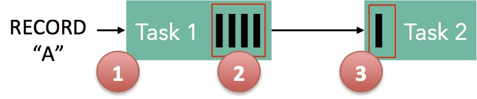

{{ page.description }}

# Backpressure

## What is backpressure

Flink같은 “streaming system” 은  backpressure에 graceful하게 대응할 수 있다. backpressure는 일시적인 load동안 system이 process하는것보다 더 높은 rate으로 data를 받는것을 말한다. 일상적인 상황에서도 backpressure가 일어날 수 잇다. 예를들어 GC stall로 인해 incoming data가 쌓이거나, data source에서 data를 보내는 속도에 스파이크가 발생할 수 있다. backpressure를 잘 처리하지 않으면 resource낭비가 생기고 심한경우 data loss가 생긴다.

위의 streaming system은 초당 5M elements를 처리한다. 이 스냅샷은 1초동안에 처리되는 양을 나타낸다. 한개의 검정 바는 1M elements이고, streaming job은 1초동안 5M개를 처리, channel에는 1초에 5M개씩 들어가있다.

이때 streaming job이나 sink가 1초동안 멈추게 되면, 5m개 이상의 element가 더 쌓이게된다. 따라서 source에서 spike가 발생하고 data producing rate이 1초동안 2배가 된다.

어떻게 이 상황을 해결할것인가? 당연히 exactly-once를 필요로하는 많은 streaming application에서 data loss는 허용하지 않는다. data를 buffering할 추가적인 공간이 필요하다. buffering은 failure에서도 durable해야, data loss없이 replay가능하다. buffered data는 persistence channel에 저장되어야한다. 만약 source가 durability를 보장하는 케이스라면 그 source 자체를 쓰면 된다. Kafka는 이렇게 동작한다. **가장 이상적인 대응은 sink에서부터 source까지 backpressure를 하고(즉 source의 persistence channel에서 버퍼링 되는것), stream의 속도를 전체 pipeline에서 가장 “느린 task”기준으로 맞출 수 있게 source를 쓰로틀하는것이다.**

## Backpressure in Flink

Flink runtime의 building block은 operator, stream이다. 각 operator는 intermediate stream을 consume하고, event에 대해 transformation을 실행하고, 새 stream에 output을 produce한다. Flink는 제한된 용량을 가진 distributed blocking queue를 효율적으로 사용한다. 느린 downstream task는 queue의 buffering이 사라지면 upstream task의 속도를 느리게 만든다.

1. Record “A” 는 Flink로 들어오고, Task 1에서 처리된다
2. “A”는 buffer에 serialize된다
3. 이 buffer는 Task 2로 보내지고, Task 2는 buffer에서 record를 읽는다.

**record가 flink에서 processing되려면, buffer는 available 해야 한다.** Flink에서 이런 buffer는 logical stream이고, buffer의 capacity는 stream단위로 manager되는 vbuffer pool로 구현된다. buffer pool은 consume이 다 되고나면 재활용되는 buffer set이다. pool에서 buffer를 가져오고, data를 채운 뒤, data가 모두 consume된 후에 buffer를 pool에 반납한다.

buffer pool의 size는 동적으로 바뀐다. network stack에 있는 memory buffer의 크기 (=queue size)는 sender/receiver의 속도가 다를때 시스템이 일할수있는 buffer크기로 정의된다. Flink는 some progress를 할수 있게 항상 충분한 buffer를 보장하지만, progress 속도는 user pgoram과 availble memory size에 의해 결정된다. 많은 memory는 system이 일시적인 backpressure(short GC 등,)에서 단순하게 buffering으로 해결할수있지만, 적은 memory는 upstream에게 backpressure를 만들게 된다.

위에 있던 예시에서 Task1은 output channel쪽에 있는 buffer pool이 있고, Task2는 input channel쪽에 buffer pool이 있다. “A”를 serialize할 수있는 buffer가 있으면 serialize해서 buffer를 전달한다. 이떄 2가지 케이스가 있다.

- **Local Exchange**: Task 1과 Task 2가 같은 worker node에 있는 케이스.
    - buffer는 Task 2로 바로 전달되어 Task 2가 record를 읽는다.
    - Task 2가 Task 1보다 느리면 buffer는 Task 1이 buffer를 채우는속도보다 낮은 속도로 재활용 (즉 reclaim을 하지 못했기 때문에 buffer를 계속 들고있음)되므로 Task 1의 작업 속도가 느려지게 된다.
- **Remote Exchange**: Task 1과 Task 2가 다른 worker node에 있는 케이스.
    - buffer는 wire(TCP channel)를 통해 전송된 직후에 재활용된다. Task 2에서는 buffer pool에서 buffer를 하나 가져온뒤, wire에서 buffer로 data를 옮긴다.
    - 만약 available buffer가 없으면, wire에서 data를 읽는것은 interrupt된다. Task 1의 output side에서는 watermark mechanism으로 인해 많은 data를 wire로 넣지 않는다. 충분한 양의 data가 in-flight이면 (wire에 있다면), in-flight data size가 threshold 밑으로 wire로 data copy하는것을 기다리게 해서 많은 data를 밀어넣지 못하게 한다. 따라서 data가 downstream task에서 consume되지 않는다면(availble buffer가 없으므로) upstream task는 느려진다.

따라서 Flink는 Task가 consume하는것보다 빠르게 data를 만들지 못하는 backpressure mechanism을 제공한다.