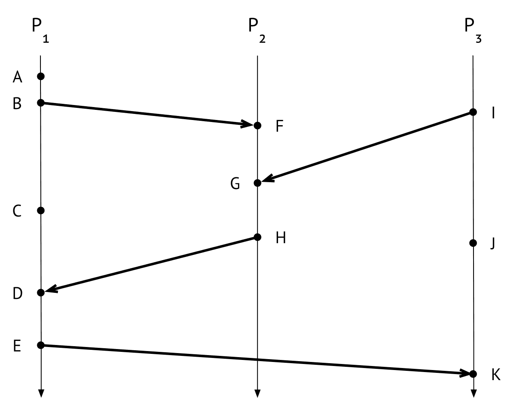
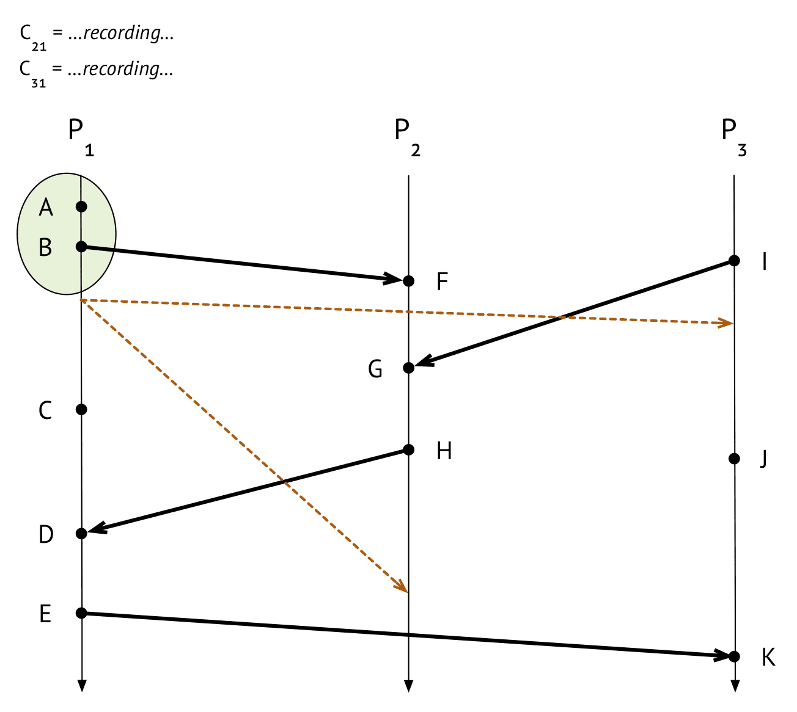
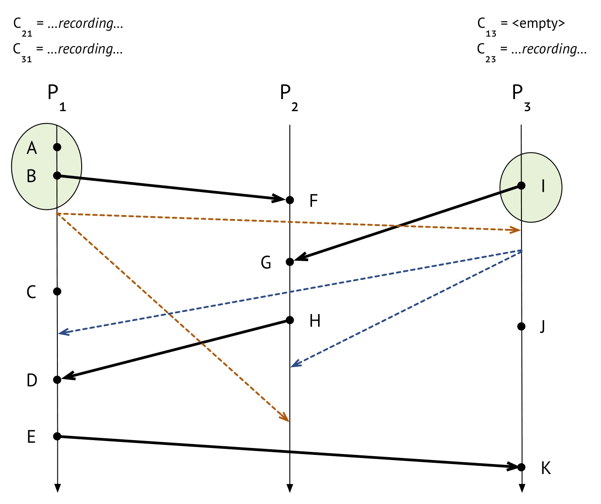
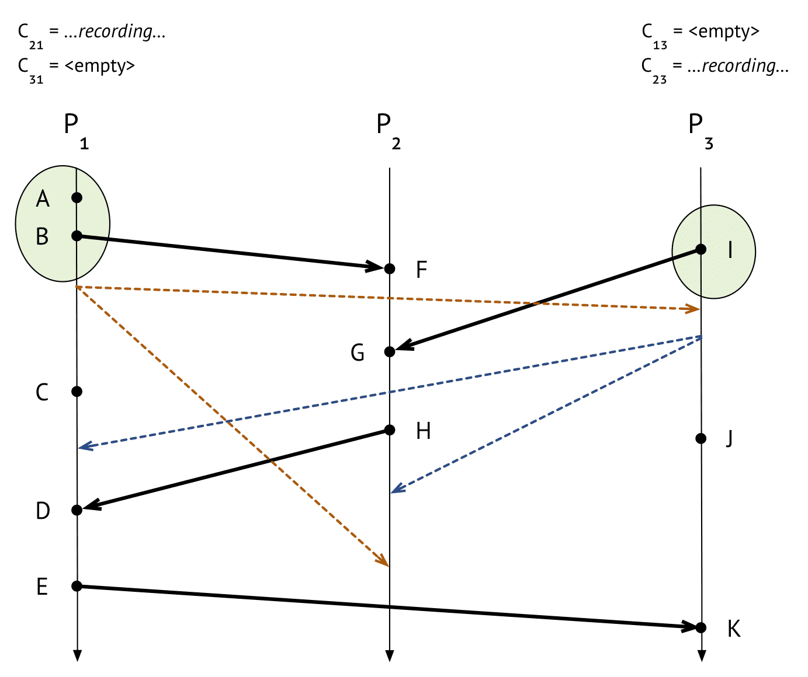
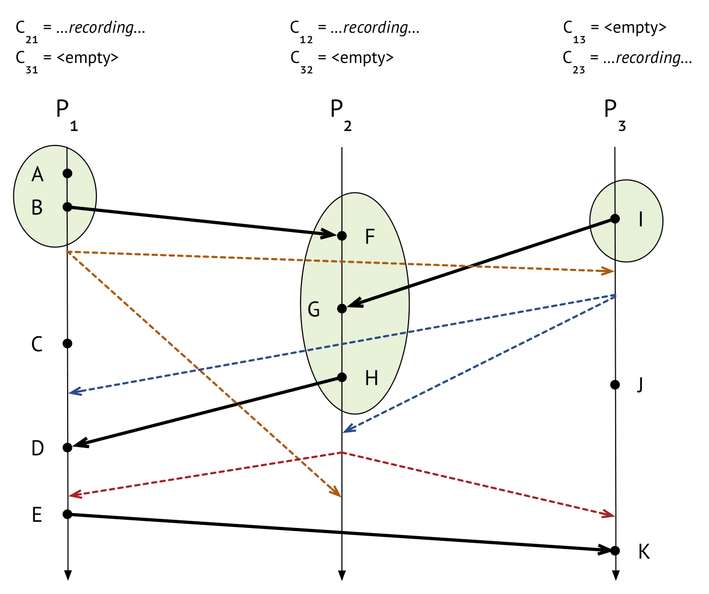
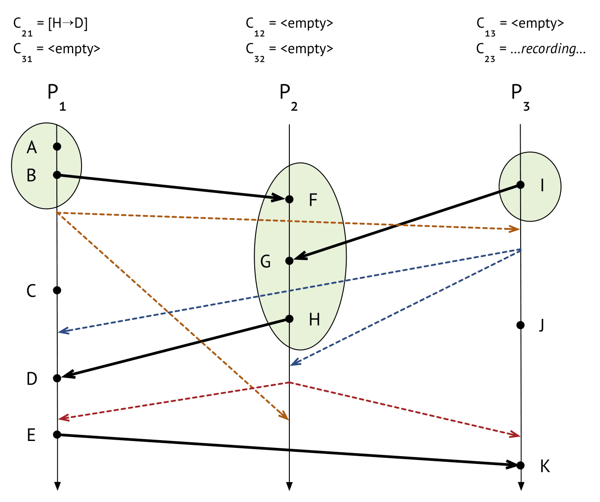
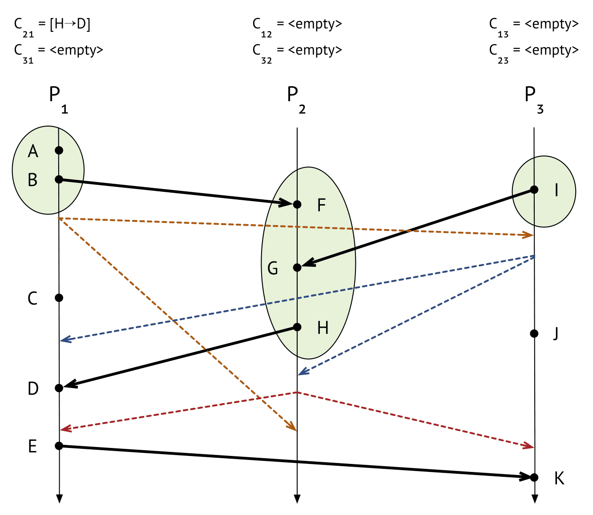
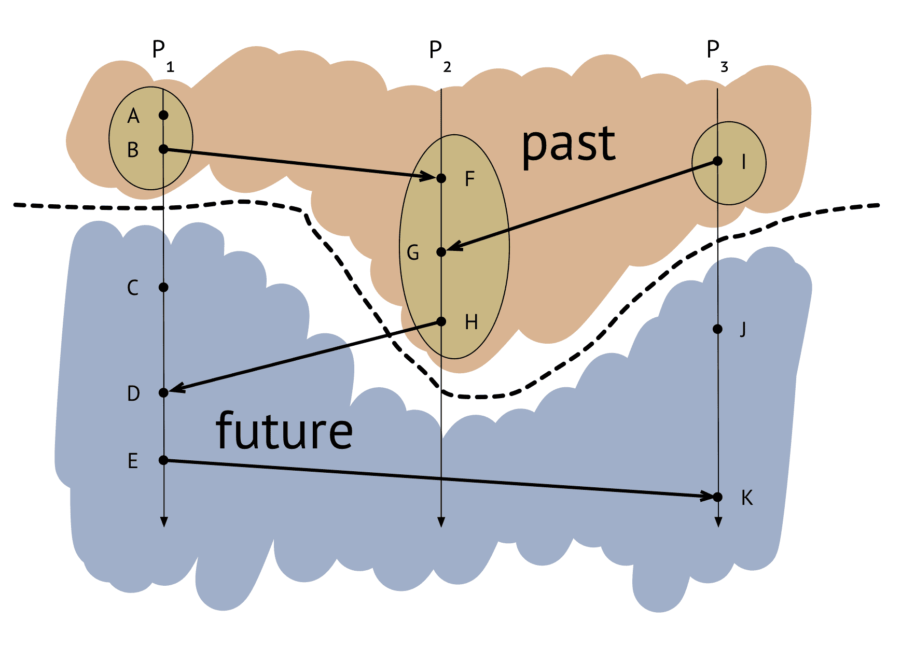

{{ page.description }}

# Chandy-Lamport Algorithm

메시지를 send/receive 하는 process 들의 snapshot을 만들고싶다. process는 internal message와 FIFO로 동작하는 receiving channel을 가진다. $P_i$가 $P_j$에게 메시지를 보내는 채널은 $C_{ij}$이다. snapshot은 각 process의 state와 channel을 캡쳐한다. Chandy-Lamport algorithm은 “distributed execution 위에서 레코딩된 이벤트의 **happend before** 이벤트 또한 스냅샷에 레코딩”된다.

Chandy-Lamport algorithm은 decentrialized이다. snapshot을 시작할때 아무런 프로세스(또는 여러프로세스 동시에)로부터 시작가능하다(no master). 또한 여러 process가 “동시에” 스냅샷을 만들 필요가 없다(non-blocing).

B 이벤트가 발생한 직후, $P_1$에서 스냅샷을 생성한다. 스냅샷 을 생성하기 위해 아래의 init 과정이 필요하다

1. process의 state를 레코딩한다. $P_1$에서 B 이벤트가 발생한 직후 스냅샷을 시작했으므로 state는 `A, B` 가 포함된다. 밑에 그림에서 초록동그라미로 표시해두었다
2. 1을 한 직후 (다른 일을 하기 전), marker message를 outgoing channel로 뿌린다. marker message는 snapshot algorithm의 일부이고, application message와 다르게 처리된다. 즉 snapshot에 찍힐 필요가 없는 메시지이다. 예시의 갈색 점선에서 $P_1$이 channel $C_{12}$, $C_{13}$으로 marker message를 보낸다
3. 마지막으로, incoming channel $C_{21}$, $C_{31}$로 들어오는 메시지들에 대해 레코딩을 시작한다.

$P_2$는 메시지를 늦게 받는 반면, $P_3$은 메시지를 빨리 받았다.

## process가 marker message 처음으로 받았을 때

$P_i$가 marker message를 $C_{ki}$를 통해 받았을때, 2개의 가능성이 있다. marker message를 다른 채널을 통해 이미 받았거나, 처음으로 받았거나 이다. $P_i$가 marker message를 처음으로 받았을때 $P_i$은 아래의 행동을 한다

- $P_i$의 state를 레코드함
- $C_{ki}$의 incomming channel을 empty로 레코드, 실제로 메시지가 있을수 있지만 marker message 이후에 들어온것이므로 무시(이전이라면 이미 state로 레코드됨)
- 모든 outgoing channe에 marker message를 뿌림
- $C_{ki}$를 제외한 모든 incoming channel에 대해 레코딩 시작.

$P_3$은 state `I` 를 레코드하고, $C_{13}$은 empty로 레코드, marker message를 모든 채널 $C_{31}$, $C_{32}$에 뿌리고, $C_{13}$을 제외한 모든 incoming channel $C_{23}$에 대해 레코딩 시작.

## snapshot을 이미 만들고 채널을 기다리는데 marker message가 온경우 $P_1$

$P_3$은 marker mesage를 보냈고, marker message가 $P_1$에 먼저 도착했다.

$P_i$가 $C_{ki}$를 통해 marker message를 받았지만 이미 snapshot을 만든경우. $C_{ki}$에 대해 레코딩을 끝낸다( $C_{ki}$에서 도착한 메시지 순서대로)

$P_1$은 $C_{31}$에 대해 레코딩을 끝낸다. 받은 메시지가 없으므로 empty로 찍힌다.

$P_2$는 $C_{32}$에서 marker message를 받은 뒤, state `F, G, H` 를 레코딩 하고, $C_{32}$를 emtpy로 레코딩하고, outgoing channel $C_{21}$, $C_{23}$에 marker message를 뿌린다.

$P_2$가 $C_{12}$로 marker message를 받았다. $C_{12}$에 대해 레코딩을 끝낸다. 받은 메시지가 없으므로 empty이다.

$P_1$이 $C_{21}$을 통해 marker message를 받았다. $C_{21}$에 `[H->D]` 메시지가 들어와있으므로 이것에대해 레코딩을 한다.

$P_3$이 $C_{23}$을 통해 marker message를 받았다. $C_{23}$을 empty로 레코딩을 끝낸다.

## Discussion

snapshot을 찍을때 marker message를 무시했다. 위에서 언급했던, distributed execution상에서 찍힌 snapshot 안에있는 특정 이벤트에 대해, 그 이전(happend before) 이벤트 또한 snapshot으로 찍힌다고 말했다. 모든 프로세스의 state를 보면 이 특성을 만족한다(causal consistency). 즉 snapshot은 consistent cut을 생성했다. 메시지는 시간을 거슬러 올라가는 경우가 발생하지 않았다.

Q. $C_{21}$에 들어있던 `[H->D]` 가 incoming channel에 있지않고 `D` 로 $P_1$의 state에 들어가야하는거 아닌가?

D는 state로 레코드된게아니다. $P_1$의 snapshot은 event C가 생기기 전에 만들었으므로, D가 snapshot에 포함되려면 C 또한 snapshot에 포함되어야 한다

최대 한개의 process가 특정 파일에 대해 exclusive access를 가지는 것이라면, 이 파일에 대한 접근 권한은 토큰을 가지는 프로세스가 가능하다. process가 토큰을 가지고있거나, process가 다른 process로 토큰을 전달하기위해 채널상에 토큰이 있거나 할것이다.

$P_2$가 토큰을 가지고있고 $P_1$에게 전달한다고 생각해보자. 즉 `[H->D]` 는 “나 너한테 토큰줄게” 이다. 그런데 만약 $P_2$는 $P_2$가 토큰을 포기한 이후에 레코딩되었지만, $P_1$이 토큰을 받기전에 레코딩되었다는 상황을 가정하면 channel state를 레코드 하지 않는 경우 먼가 나이스하지않다. snapshot에서 process state만 보게된다면 마치 토큰이 사라진것처럼 보인다. 이게 채널을 레코딩 해야하는 이유이다.