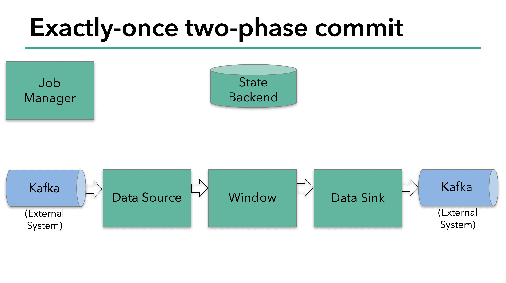

# Exactly-Once Processing

[https://flink.apache.org/features/2018/03/01/end-to-end-exactly-once-apache-flink.html](https://flink.apache.org/features/2018/03/01/end-to-end-exactly-once-apache-flink.html)

# Exactly-once semantics in Flink

exactly-once semantic을 말할때 의미하는것은 각각의 incoming event가 최종 결과에 정확히 한번만 영향을 미치는것을 말한다. machine, software failure에서도 "중복된 결과 반영", "결과가 반영되지 않음"이 일어나서는 안된다.

Flink의 checkpoint algorithm은 application의 현재 state와, input stream의 position에대한 consistent snapshot을 만드는 것이다. Flink는 checkpoint를 생성하고 asynchronous하게 persistent storage에 저장한다. checkpoint가 진행하는 동안 data processing은 멈추지 않는다.

Failure로 인해 재시작이 되면 Flink는 가장 최근에 성공한 checkpoint로부터 processing을 재시작한다. Flink는 application state를 복구하고, input stream을 적절한 position으로 rollback한다. 따라서 Flink는 failure가 발생하지 않은것처럼 결과를 만들게 된다.

Flink 1.4.0이전에서 exactly-once semantic은 Flink application의 scope에서만으로 한정되었고 Flink가 processing이후에 data를 보내므로 external system으로 확장되지 못했다. 하지만 Flink application은 다양한 data sink를 지원하고있으므로 external system으로 확장해야 했다. end-to-end exactly-once semantic을 지원하기 위해 external system이 write를 commit,rollback 하는 mechanism을 제공해야한다.

distributed system에서 commit, rollback을 coordinate하는 일반적인 방식은 two-pahse commit protocol이다.

# End-to-end Exactly Once Applications with Apache Flink

two-phase commit protocol에 대해서 이해하고, 어떻게 two-phase commit protocol이 kafka로 read, write하는 샘플 flink app이 end-to-end exactly-once semantic을 만들어주는지 볼것이다. Flink 의 end-to-end exactly-once semantic은 Kafka에만 한정되지 않고, 다른 coordimation mechanism을 구현한 source/sink connector도 가능하다. streaming opensource storage system인 [Pravega](http://pravega.io/) 또한 `TwoPhaseCommitSinkFunction`을 통해 end-to-end semantic을 지원한다.

샘플 Flink app은

- Kafka에서 데이터를 읽는다 ([KafkaConsumer](https://nightlies.apache.org/flink/flink-docs-release-1.4/dev/connectors/kafka.html#kafka-consumer))
- windowed aggragation을 한다
- Kafka로 write하는 data sink가 있다 ([KafkaConsumer](https://nightlies.apache.org/flink/flink-docs-release-1.4/dev/connectors/kafka.html#kafka-producer))

data sink가 exactly-once를 보장하므로 Kafka에서는 transaction scope 안에서 모든 data를 write 해야 한다. commit은 두개의 check point 사이의 모든 write를 묶게 된다. 따라서 이 방식은 failure 상횡에서 write를 rollback할 수 있게 한다.

그러나 여러 concurrently-running sink tasks가 있는 distributed system에서는 단순한 commit/rollback만으로는 부족하다. consistent result를 보장하려면모든 component가 commit/rollback에 대해 'agree' 를 해줘야 하기 떄문이다. 따라사 Flink는 이 문제를 해결하기 위해 two-phase commit protocol을 활용한다.

checkpoint의 시작지점은 two-phase commit protocol에서 `pre-commit` phase 이다. checkpoint가 시작하면 Flink JobManager가 check point barrier를 data stream에 주입한다. barrier는 datastream에 있는 record들을 current checkpoint로 가는 record set과, next checkpoint로 가는 record set으로 분리한다. barrier는 operator에서 다음 operator로 패스되고, 모든 operator는 operator state backend가 각각의 operator state에 대해 snapshot을 만들도록 트리거한다.

operator의 일이 끝나면 backend data store는 kafka offset을 저장하고. checkpoint barrier를 다음 operator에 전달한다.

이 방식은 operator가 **internal state만 가지고 있을때** 잘 동작한다. internal state는 Flink state backend가 관리하고 저장하는 모든것(???)이다. 예를들어 두번째 operator에선 windowed sum이다. process가 internal state만 가지고 있으면 checkpoint 이전 pre-commit 동안에 state backend에 data를 update 하는것외에 다른 action을 수행 할 필요가 없다. Flink는 checkpoint가 성공할때 적절히 commit하고, 실패 할때는 abort한다.

하지만 process가 external state를 가지는경우 state는 다른방식으로 처리되어야한다. External state는 일반적으로 Kafka와 같은 external system으로 write하는 형태이다. 이 케이스에서 exactly-once를 보장하려면 external system이 무조건 two-phase commit protocol에 integration할 transaction을 제공해야 한다.

이 예시에서 data sink가 Kafka로 write를 하므로 external state를 가지는것을 볼 수있다. 이 경우 pre-commit phase에서 data sink는 external transaction으로 pre-commit을 하고, sink operator의 state를 state backend로 write해야한다.

pre-commit phase는 모든 checkpoint barrier가 모든 operator를 통과하고, snapshot callback이 triggered snapshot callback이 완료되면 끝나게 된다. 이 시점에서 checkpoint는 성공적으로 끝났으며, operator state를 가지고, external transaction은 pre-commited external state를 가진다. failure가 발생하면 이 checkpoint로부터 application을 재시작 할 수 있다.

다음 스텝은 모든 operator에게 checkpoint가 성공했음을 알리는 것이다. 이건 two-phase commit protocol에서 `commit phase` 이며, JobManger가 모든 operator의 `checkpoint-completed` callback을 호출한다. 예시에서 data source와 window operator는 external source가 없으므로 commit phase에서 이 operator들은 아무런 할일이 없다. data sink operator는 external state를 가지므로 transaction을 commit한다.

- 모든 Operator가 pre-commit을 완료하면, commit을 할수 있게된다.
- 만약 최소 한개의 pre-commit이 실패하면 다른 모든 operator들이 abort되고, 이전에 완료된 checkpoint로 rollback한다.
- pre-commit을 성공한 뒤 commit은 eventual success가 보장되어야만 한다. 모든 Operator와 모든 external system이 보장해줘야 한다. 만약 commit이 실패한다면 (network issue등) 전체 Flink application이 실패하게되고, 유저의 restart strategy에 따라 재시작 하게된다. 이 process는 만약 commit이 eventual success를 하지 못하면 data loss가 생기기 때문에 중요하다.

# Implementing the Two-Phase Commit Operator in Flink

two-phase commit protocol을 구현하는 모든 로직은 쬠 복잡하고 왜 Flink가 two-phase commit protocol을 `TwoPhaseCommitSinkFunction` class로 추상화 했는지 알것이다

어떻게 간단한 file-based example에서 `TwoPhaseCommitSinkFunction` 을 지원하는지보자. exactly-once file sink를 위해 4개의 method를 구현해야한다.

1. `beginTransaction`: transaction을 시작하기위해, destination file system에서 temp dir에 temp file을 만든다. processing이 진행될때 이 파일에 data를 쓰게 된다.
2. `preCommit`: pre-commit에서는 file을 flush, close하고 나서 다시는 write하지 않는다. 또한 다음 checkpoint에 속한 write에 대해 새 transaction을 시작한다.
3. `commit`: commit에서 pre-commited file은 atomic하게 temp dir에서 actual dir로 옮겨진다. commit은 output data visibility의 latency가 늘어나게 된다 (temp file만 보면 애초에 commit이 필요 없을수 있었기 때문에)
4. `abort`: abort에서는 temp file을 제거한다

failure가 발생하게 되면 Flink는 가장 최근의 success checkpoint에서 application state를 복구한다. 드문 케이스이지만 pre-commit이 성공했지만 commit notification이 operator들에게 전달되지 못하는 경우가 있다. 이땐 Flink는 operator state를 직전에 pre-commited에서(commit되지않은넘) 복구한다.

restart 이후에 transaction을 abort/commit하기 위해서는 pre-commited transaction에 대한 충분한 정보를 checkpointed state에 저장해야만 한다. 예제에서는 temp file과 temp directory에 대한 path가 이에 해당한다.

`TwoPhaseCommitSinkFunction` 이런 시나리오를 고려하고, checkpoint에서 state를 복원할때 preemptive commit을 실행한다. commit을 idempotent하게 만들기 위해서이다. (갑자기왜그러세요..) 예시에서 아래와같은 상황을 만들 수 있다. temp file이 temp directory에 없고 이미 actual directory로 옮겨진 경우이다.