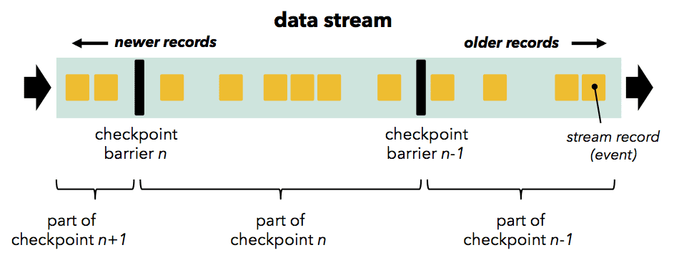

# Flink's checkpointing mechanism

[https://www.ververica.com/blog/high-throughput-low-latency-and-exactly-once-stream-processing-with-apache-flink](https://www.ververica.com/blog/high-throughput-low-latency-and-exactly-once-stream-processing-with-apache-flink)

# An Evolution of Streaming Architectures

fault-tolerant, performant한 stream processing을 만드는것은 어렵다. batch processing에서 job이 실패하면 job이 실패한 부분을 재실행하면 된다. read하려는 파일의 시작부터 끝까지 replay가 가능하다. 하지만 stream processing에선 아니다. data stream은 애초부터 beginning과 end가 없다. buffered stream은 replay할 수 있지만. 시작시간(몇개월.. 어쩌면 수년 전) 부터 replay하는것은 불가능하다. 또한 streaming computation은 batch와 다르게 stateful하다. 즉 system이 output말고도 operator state를 backup, recover 할 수 있어야 한다. 이런 문제들을 해결하기 위해 많은 approach들이 나와있다.

faul tolerance를 위한 메커니즘은 전체 framework의 아키텍처에 깊은게 스며들기 때문에 기존 framework에서 쉽게 다른 fault tolerance mechanism을 적용하는것은 불가능하다. 따라서 streaming framework를 선택할때 fault tolerance는 중요한 요소이다.

밑에서는 record ack, micro-batching, transactional update, distributed snapshot 이라는 fault-tolerant streaming architecture들을 볼 것이고, 아래와 같은 요구사항을 맞추는 것이 필요하다.

1. Exactly-once guarantees: stateful operator의 state는 failure 이후에 restore되어야 한다.
2. Low latency: 많은 application은 1초미만의 latency를 요구한다.
3. High throughput: pipeline을 통해 많은 양의 data를 밀어넣는것이 필요하다.
4. Powerful computation model: framework는 유저에게 제약을 주지안고, 다양한 종류의 application에도 적용할 수 있는 programming model을 제공해야 한다.
5. failure가 없을때에도 fault tolerance mechanism의 overhead는 낮아야 한다.
6. Flow control: slow operator로 인한 backpressure는 자연스럽게 system에 의해 absorb되고, datasource가 crash나 성능 저하가 생기게 만들어선 안된다.

위의 요구사항에서 "장애 후 빠른 복구"는 생략되었다. 이것이 중요하지 않아서가 아니고,
(1) 대부분의 시스템이 full parallel infrastructure로 복구할 수 있고,
(2) stateful application에서 framework가 아닌 reliabele storage로부터 state를 복구하는것이 주요 병목이기 때문이다. → 즉 framwork에서 아무리 튜닝해봤자다..

# Record acknowledgement (Apache Storm)

strema processing은 업계에서 널리 사용되고 있고, 더 많은 usecase에 적용되고 있다. 처음으로 널리 쓰인 large-scale stream processing framework는 Apache Storm이다. Storm은 failure 직후에 message를 replay하기 위해 [**Upstream Backup and Record Acknowledgements**](https://storm.apache.org/documentation/Guaranteeing-message-processing.html) mechanism을 사용한다. 다만 Storm은 state consistency를 보장하지 않으므로, mutable state를 관리하는것은 사용자가 하게된다 (다음 섹션에 나오는 Storm의 Trident API는 state consistency를 보장하긴 함)

opreator에서 처리된 record는 upstream operator에게 process가 끝났음을 알리는 ack를 보낸다. upstream operator는 record를 계속 저장하고 있고, 모든 record에서 ack를 받으면 upstream backup에서 record가 지워지게 된다. failure가 발생할땐 모든 ack를 받지 못하므로, source record는 replay된다. 이 방식은 **data loss가 없지만, duplicate record는 발생한다** (at least once). 성능과는 별개로, record acknowledgement architecture는 exactly once를 보장하지 않으므로 개발자가 deduplication을 해야하는 부담을 안겨준다. 또 다른 문제점은 ack mechanism이 backpressure에서는 때때로 falsely classify를 발생시켜 low throughput과 flow control 문제가 생긴다.

# Micro batches (Apache Storm Trident, Apache Spark Streaming)

# Transactional updates (Google Cloud Dataflow)

# Distributed Snapshots(Apache Flink)

exactly once 를 제공하는 문제는, streaming computation이 들어가는 state(in-flight record와 operator state 둘다)를 결정하고, 이 state에 대한 consistent snapshot 생성, snapshot을 durable storage까지로 저장하는 문제로 귀결된다. 또한 failure로부터 복구하는것은, durable storage에서 snapshot을 읽고, stream source를 snapshot이 생성된 시점으로 rewind하고, play (stream이 흐르도록) 다시 실행하는 것이다. Flink의 알고리즘은 아래 paper에 자세히 설명되어있다.

[http://arxiv.org/abs/1506.08603](http://arxiv.org/abs/1506.08603)

Chandy-Lamport의 snapshot algorithm은 missing information, recording duplicates 없이 분산 시스템의 current state의 snapshot을 만드는데(참조 :[https://blog.acolyer.org/2015/04/22/distributed-snapshots-determining-global-states-of-distributed-systems](https://blog.acolyer.org/2015/04/22/distributed-snapshots-determining-global-states-of-distributed-systems/)), Flink algorithm은 위의 algorithm을 바탕으로, 주기적으로 stream topology에 대한 snapshot을 만들고 durable storage에 저장한다.

Flink의 snapshot algorithm은 micro-batch가 checkpoint간 computation은 전부다 성공하거나 전부다 실패하는것과 비슷하다. 하지만 Chandy Lamport algorithm은 다음 micro batch를 스케줄링 하기 위해 stream processing에서 pause를 시킬 필요 없이, stream data processing은 event가 오는대로 처리되고, checkpoint는 background로 진행된다.

따라서 Chandy-Lamport algorithm에서 만들어주는 high throughput, exactly-once와, continuous(streaming) operator model(low latency, flow control, streaming programming model)을 만드는 이점이 더해진다. stateful computation의 state를 백업하는것을 제외하고 다른 모든 fault tolerance mechanism에 overhead가 생기지 않는다(background로 동작하므로?). 또한 small state (count나 summary등)의 backup overhead는 매우 작고, checkpoint interval은 throughput - recovery time의 tradeoff를 가진다.

가장 중요한 점은 flow/throughput control에서 application developement를 분리한 것이다. snapshot interval을 바꾸는 것은 streaming job의 결과에 영향을 주지 않으므로 downstream application은 받은 결과를 신뢰할 수 있다.

Flink checkpointing mechanism은 operator와 channel을 통해 흐르는 *stream barrier(Chandy-Lamport의 marker)*를 바탕으로 한다.

Barrier는 source에 주입되고 (Kafka를 쓴다면 barrier는 offset에 align됨), data record와 함께 stream에 존재한다. Barrier는 record를 current snapshot과 다음 snapshot으로 나눈다.

Barrier는 operator를 통과할때 downstream에 전달되고, state snapshot을 만든다. operator는 (operator가 2개이상의 input을 가진 경우)모든 incoming stream partition에서 온 barrier들을 align하고, faster partition의 data를 buffering한다. operator가 모든 incoming stream에서 barrier를 받으면, operator의 state를 durable statorage에 checkpointing한다. state checkpoint이 끝나면 operator는 barrier를 downstream에 전달한다. 이 mechanism에서 state checkpointing은 (operator가 지원해줘야하지만..) asynchronous (state가 저장되는동안 processing은 지속됨)하고, incremental (모든 변경사항이 저장됨)하다.

모든 data sink가 barrier를 받으면 현재 checkpoint는 끝난것이다. failure로부터 복구하는것은 latest checkpoint state를 복구하고 last recorded barrier로부터 source를 재시작하는것이다. distributed snapshot은 문서 초반에 나온 요구사항들 (exactly-once, low latency, high throughput, powerful computation model, flow control, low overhead)을 만족한다.

# Summary

