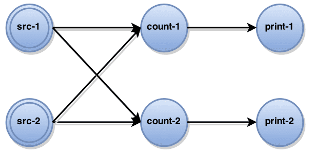

# Lightweight Asynchronous snapshots for Distributed Systems


[https://arxiv.org/abs/1506.08603](https://arxiv.org/abs/1506.08603)

# Abstract

Distributed stateful stream processing은 클라우드에서 large scale의 continuous computation을 low latency, high throughput으로 배포, 실행하게 해준다. 잠재적인 failure로부터 processing을 보장해주는것은 distributed stateful stream processing에서 가장 중요한 문제이다. 기존 방식들은 주기적은 failure recovery에 쓸 수 있는 global state snapshot에 의존한다. 이런 방식들은 ingestion 성능에 악영향을 주고, 바로바로 모든 레코드를 저장하여 실제로 요구하는것보다 큰 snapshot을 만들게 된다. 이 paper에서는 space requirements를 잘 만족하는 data execution engine을 위한 light weight algorithm인 Asynchronous Barrier Snapshotting(ABS)을 제안한다. ABS는 cyclic dataflow에서 최소한의 record log를 유지하면서, acyclic execution toplogies에서 operator state만을 저장한다. 또한 ABS를 stateful streaming processing을 지원하는 distributed analytics engine인 Apache Flink에 구현하였다. Evaluation은 ABS가 execution에 악영향을 주지않고,linear scalable하고 frequent snapshot에서도 잘 동작함을 확인하였다.

# 1. Introduction

Distributed dataflow processing은 high throughput, low latency로 continuouse computation을 하는 data intensive computing에서 떠오르는 패러다임이다. real-time analysis (predictive analytics, complex event processing)를 포함한 time-critical application은 dataflow processing system을 활용한다. Fault tolerance는 대부분 real world usecase에서 장애를 허용하지않기때문에 가장 중요하게 다뤄져야 한다. 현재 stateful processing system에서 global로 exactly-once를 보장하는 방식은 execution state에 대한 consistent snapshot을 만드는것이다. 그러나 이 방식은 realtime stream processing을 비효율적으로 만든다. synchronous snapshot은 전체 state에 대한 consistent view를 얻기 윟 ㅐdistributed computation의 실행을 멈춰버린다. 또한 distributed snapshot의 현존하는 모든 algorithm은 현재 처리중인 Message 뿐만아니라 처리를 기다리는 message도 snapshot state에 포함시켜 성능 저하를 만든다.

이 paper에선 distributed stateful dataflow system에서 low overhead를 가지는 lightweight snapshot을 공유할것이다. 이 방식은 acyclic execution topology에서 operator state만을 포함하여 적은 공간으로 aysnchronous state snapshot을 만든다. 또한 snapshot state를 최소로 유지하면서 topology의 특정 부분에 downstream backup을 적용하는 것으로 cyclic execution graph 케이스도 커버한다(이해안됨..). 이 방식은 streaming operation을 멈추지 않고 작은 overhead를 가진다. 주요 contribution은 아래와 같다.

1. acyclic execution graph에서 최소한의 snapshot을 가지는 asynchronous snapshot algorithm을 구현했다.
2. cyclic execution graph에서 이 알고리즘이 동작하도록 구현했다.
3. Apache Flink에서 더 좋은 성능을 얻었다.

# 2. Related Work

최근 10년간 continuous processing system에 몇몇 recovery mechanism이 나왔다. Discretized Streams와 Comet같이 stateless distributed batch computation으로 continuous processing을 에뮬레이션 하는 system은 state recomputation을 이용한다. 또한 Naiad, SDG, Piccolo, SEEP같은 stateful dataflow system은 failure recovery를 위해 global execution에 대한 consistent snapshot을 만드는 checkpointing을 사용한다.

Chandy-Lamport 가 제안한 distributed system의 consistent global snapshot의 문제점에 대한 Research는 여러개 있다. global snapshot은 이론적으로 execution에 대한 모든 state를 보여주거나, 특정 instance에서 possible state를 보여준다. Naiad에서 동작하는 간단하지만 overhead가 큰 방식은 synchronous snapshot을 3 step으로 생성한다. (1) execution graph의 모든 computation을 멈추고, (2) snapshot을 만들고, (3) global snapshot이 끝나면 각 task를 다시 실행시킨다. 이 방식은 전체 computation을 blocking해야 하므로 throughput에 문제가 되고, producer side에서 만든 record를 로깅하는 upstream backup을 쓰므로 space문제도 크다. Chandy-Lamport algorithm은 eager upstream backup을 만들어 asynchronous하게 snapshot을 만든다. 이는 execution graph 전체에 operator와 channel state의 persistence를 트리거하는 distributing marker에 의해 동작한다. 하지만 upstream backup이 필요하기 때문에 공간을 많이 먹고, backup record를 reprocess해야 하므로 recovery time이 크다. 이 paper는 Chandy-Lamport algorithm의 asynchronous snapshot을 확장하고, acyclic graph에서 record backup을 하지 않고, cyclic execution graph에서 일부 record backup을 유지한다.

# 3. Background: Apache Flink

Apache Flink는 stateful interconnected tasks로 구성된 batch, streaming job을 일관적으로 처리하는 generic runtime engine으로 설계되었다. Flink의 analytics job은 task들의 directed graph로 컴파일된다. Data elements는 external source에서 받아오고 pipeline방식으로 task graph로 라우팅된다. Task는 지속적으로 받은 input으로부터 각각의 internal state를 수정하고 output을 생성한다.

## 3.1 The Streaming Programming Model

Apache Flink의 DataStreams API는 unbounded partitioned data stream(partially ordered record sequence)을 통해, 복잡한 streaming analytics job들을 합치게 해준다. DataStreams는 external source(message queue, socket stream, custom generator)를 통해 생성되기도 하고, 다른 DataStreams가 operation을 호출해서 생성되기도 한다. DataStreams는 record단위로 incremental하게 적용되고 새 DataStreams를 생성하는 higher order function형태인 *map, filter, reduce*와 같은 oeprator를 지원한다. 모든 operator는 여러 instance를 두어 각 stream의 다른 파티션에서 실행되도록 병렬화 시킬 수 있어, stream transformation을 분산환경에서 실행 할 수 있다

```yaml
val env : StreamExecutionEnvironment = ...
env.setParallelism(2)

val wordStream = env.readTextFile(path)
val countStream = workdStream.groupBy(_).count
countStream.print
```



위의 코드는 Apache Flink에서 incremental word count의 구현을 보여준다. text file에서 word를 읽고, 각 word에 대한 현재 count를 print한다. 현재 file offset을 알아야 하고, counter는 각 internal state에 대해 현재 count를 저장하고 있어야 하는 stateful streaming program이다.

## 3.2 Distributed Dataflow Application

User가 application을 실행하면, 모든 DataStreams operator는 directed graph $G=(T,E)$ 인 execution graph로 컴파일된다($T$ 는 Task, $E$ 는 edge). 위 word count의 exeuction graph 예시를 보면, 모든 operator instance는 각 task로 encapsulate된다. Task에 input channel이 없으면 `Source`, output channel이 없으면 `Sink` 이다. 병렬 실행중에 task에 의해 전송된 모든 record set은 $M$ 이다. 각 task $t\in T$ 는 아래와 같은 방식으로 구성된다. (1) input, output channel의 set은 각각 $I_t,O_t\sube E$, (2) operator state $S_t$, (3) User Defined Function $F_t$ 이다. Data ingestion은 pull-based로 동작한다. 실행되는동안 각 task는 input record를 받아, operator state를 업데이트하고, UDF를 써서 새 record를 생성한다. 즉 각 record $r\in M$ 을 task $t\in T$ 가 받아, UDF $F_t: S_t, r \rightarrow\ <S_t',D>$ 를 실행해 각각 새 state $S_t'$, output record $D$ 를 만든다.

# 4. Asynchronous Barrier Snapshotting

consistent result를 만들기 위해 distributed processing system은 task failure에서 resilient 해야 한다. 이를 위해 주기적으로 execution graph에 대한 snapshot을 만든다. sanpshot은 특정 execution state에서부터 computation을 재시작 할 수 있는 모든 정보를 저장하는 execution graph의 global state이다.

## 4.1 Problem Definition

Global snapshot은 $G^* = (T^*,E^*)$ 로 정의한다. $T^*$는 모든 operator state $S_t^* \in T^*$, $\forall_t\in T$ 로 구성되고, $E^*$는 channel state $e^* \in E^*$ 로 구성된다. $e^*$ 는 $e$ 에서 들어오는 record로 구성된다.

$termination, feasibility$같이, recovery 이후에 정확한 결과를 보장하기 위해 각 snapshot $G^*$ 에 대해 특정 property가 유지되어야 한다. $termination$은 모든 process가 살아있을때 snapshot algorithm이 initialize이후 한정된 시간 내에 eventually finish 되도록 보장한다. $feasibility$는 snapshot의 meaningfulness를 표현한다. 즉 snapshotting process동안 computation에 대한 정보가 사라지지 않는다는 것을 의미한다.feasibility는 causal order가 snapshot에서 유지되고, in-transit message가 사라지지 않는다는 것을 의미한다. ([chandy-lamport](Chandy-Lamport%20Algorithm.md)의 discussion 참조).

## 4.2 ABS for Acyclic Dataflows

execution이 stage들로 나뉘어져 있다면, channel state를 저장하지 않고 snapshot을 만드는 것이 가능하다(Chandy-Lamport에서와 다르게 event발생의 순서가 있으므로?). Stage는 injected data stream과 모든 computation을, 모든 input과 output이 fully-process 된 execution series로 만든다.(즉 연산을해야하는거라면 연산을 해서 state로 바꾼다?). stage 끝의 operator state set은 전체 execution history를 나타내므로 snapshot에만 사용할 수 있다(processing에는 사용할수 없다는 말인가?). **이 알고리즘의 core idea는 continuous data ingestion을 유지하면서도 staged snapshotting을 통해 identical snapshot을 만드는 것이다.**

이 알고리즘에서 스테이지는 주기적으로 input data stream으로 들어가는 special barrier marker(Chany-Lamport 참조)에 의해 emulate 된다. Global snapshot은 각 작업이 barrier를 받을때마다 incremental하게 생성된다. 이 알고리즘에는 아래와 같은 가정이 있다.

- network channel은 quasi-reliable하고, FIFO order이며, block/unblock 될 수 있다.
channel이 block되면 모든 message는 buffered되며, channel이 unblocked될때까지 deliver 되지 않는다
- Task는 channel을통해 block, unblock, send같은 operation을 트리거 할 수 있다. 모든 output channel로 broadcasting 하는것도 가능하다.
- source task로 inject되는 message(i.e., stage barrier)는 ‘Nil’ input channel로 동작한다. (source task가 input channel이 없는 문제를 해결하기 위함)

### Algorithm 1: Asynchronous Barrier Snapshotting for Acyclic Execution Graphs (굳이 안봐도 됨ㅋㅋ)

```
 1: **upon event** <Init | input_channels, output_channels, fun, init_state> **do**
 2:   state := init_state; blocked_inputs := 0;
 3:   inputs := input_channels; outputs := output_channels;
 4:   udf := fun;
 5:
 6: **upon event** <receive | input, <barrier>> **do**
 7:   **if** input != Nil **then**
 8:     blocked_inputs := blocked_inputs U {input};
 9:     trigger <block | input>;
10:   **if** blocked_inputs = inputs **then**
11:     blocked_inputs := 0;
12:     **broadcast** <send | outputs, <barrier>>;
13:     **trigger** <snapshot | state>;
14:     **for each** inputs **as** input
15:       **trigger** <unblock | input>;
16:
17:
18: **upon event** <receive | input, msg> **do**
19:   {state', output_records} := udf(msg, state);
20:   state := state'
21:   **for each** output_records **as** {output, out_record}
22:     **trigger** <send | output, out_record>;
```


Central coordinator는 주기적으로 stage barrier를 모든 source task에 주입한다.
a) source가 barrier를 받으면 snapshot을 만들고, 모든 output channel에 barrier를 broadcast한다.
b) (line 9) source가 아닌 task가 input에서 barrier를 받으면, 모든 input channel에서 barrier를 받을때까지, barrier를 받은 input channel을 block한다. 그림에서 `count-1` task가 `src-1`, `src-2` input channel을, `count-2` task가 `src-1` 을 block하고있다.
c) (line 12-13) barrier를 모든 input channel에서 받게되면 task는 current state에 대한 snapshot을 찍고, 모든 output channel에 barrier를 보낸다.
d) (line 15) 그리고 block해뒀던 모든 input channel을 unblock시켜서 원래 하던 프로세싱을 지속한다.
complete global snapshot $G^* = (T^*,E^*)$는 $E^*=0$ (즉 비어있는), $T^*$로만 구성된다.

### Proof Sketch

위에서 말했던것처럼, snapshot algorithm은 $termination, feasibility$ 를 보장해야 한다. $termination$은 channel과 acyclic execution graph에 의해 보장된다. channel의 reliability는 task가 살아있는 동안 모든 barrier가 eventually received가 되도록 보장한다. 또한 source로부터 언제나 경로가 존재하므로 DAG의 모든 task는 모든 Input channel로부터 barrier를 eventually receive하게 되고, snapshot을 만들게 된ㄷ다.

$feasibility$는, global snapshot의 operator state가 마지막 stage까지 처리된 record history만 포함하는것으로 만족하게된다. FIFO ordering channel과 barrier가 왔을때 input channel을 blocking하여 stage의 post-shot record가 snapshot을 찍기전에 processing되지 않도록 하는것을 통해 보장된다. (causal consistency와 연관되는듯.)

## 4.3 ABS for Cyclic Dataflows

execution graph에서 directed cycle이 존재하는경우, 위의 ABS algorithm은 deadlock으로 인해 $termination$을 만족하지 못한다. cycle상에 있는 task들은 input으로부터 무한히 barrier를 기다리려 하기 떄문이다. 또한 cycle 상에 in-transit record들은 snapshot에 포함되지 않으므로 $feasibility$도 만족하지 못한다. 따라서 $feasilbility$를 위해 consistent하게 cycle안에서 생성된 모든 record를 snapshot에 포함시키고, recovery할때 이 record들을 다시 in-transit 으로 보내는 것이 필요하다(즉, $E^* \neq 0$). 우리는 위의 ABS algorithm에서 추가적인 channel blocking을 만들지 않으면서 cyclic graph에도 확장시키려 한다.

첫번째로 static analysis를 통해 loop에 있는 *back-edges* $L$에 대해 따로 정의한다. control flow graph theory에서 directed graph의 back-edge는 DFS(depth-first search)를 하면서 이미 visit한 vertex를 가리키는 edge로 정의한다. execution graph
$G(T,E\ \backslash\ L)$
 은 topology에서 모든 task를 포함하는 DAG이다. 이 관점에서 알고리즘에 snapshot이 진행되는동안 back-edge로 들어오는 record들에 대한 downstream backup을 추가한다. 이것은 back-edge $L_t\sube I_t$ 의 consumer인 각 task $t$ 에서 수행된다. $L_t$는 barrier를 전달한 순간부터, $L_t$가 barrier를 다시 받을때까지 (barrier가 한바퀴 돌게됨) 받게된 모든 레코드의 backup log를 생성한다. loop 안에서 barrier는 모든 in-transit record를 downstream log로 밀어넣어 consistent snapshot안에 “한번만” 포함되도록 한다.

### Algorithm 1: Asynchronous Barrier Snapshotting for Cyclic Execution Graphs (굳이 안봐도 됨ㅋㅋ)

```
 1: **upon event** <Init | input_channels, backedge_channels, output_channels, fun, init_state> **do**
 2:   state := init_state; marked := 0;
 3:   inputs := input_channels; logging := False;
 4:   outputs := output_channels; udf := fun;
 5:   loop_inputs := backedge_channels;
 6:   ****state_copy :+ Nil; backup_log := [];
 7:
 8: **upon event** <receive | input, <barrier>> **do**
 9:   marked := marked U {input};
10:   regular := inputs \ loop_inputs;
11:   **if** input != Nil AND input not in loop_inputs **then**
12:     **trigger** <block | input>;
13:   **if** logging = False AND marked = regular **then**
14:     state_copy := state; logging := True;
15:     **broadcast** <send | outpus, <barrier>>;
16:     **for each** inputs **as** input
17:       **trigger** <unblock | input>;
18:
19:   **if** marked = input_channels **then**
20:     **trigger** <snapshot | {state_copy, backup_log}>;
21:     ****marked := 0; logging := False;
22:     state_copy := Nil; backup_log := [];
23:
24: **upon event** <receive | input, msg> **do**
25:   **if** logging AND node in loop_inputs **then**
26:     backup_log := backup_log :: [input];
27:   {state', out_records} := udf(msg, state);
28:   state := state';
29:   **for each** out_records **as** {output, out_record}
30:     **trigger** <send | output, out_record>;
```


b) (line 14) back-edge를 가진 task는 모든 backedge가 아닌 input channel $e \notin L$ 로부터 barrier를 받으면, state의 local copy를 생성하고, (line 26) back-edge에서 들어온 모든 레코드를 barrier를 다시 받을때까지 레코딩한다.

c) loop에서 in-transit pre-shot record들은 현재 snapshot에 포함되었다. final global snapshot $G^*=(T^*,L^*)$은 모든 task state $T^*$와 back-edge에서 들어온 record $L^* \subset E^*$ 를 포함한다. 다른 Edge record는 없다.

### Proof Sketch

$termination$은 모든 task가 모든 input으로부터 (back-edge포함) barrier를 eventually receive하고, snapshot을 만들기때문에 보장된다. 모든 regular input channel(back-edge 제외)로부터 barrier를 받자마자 broadcast하므로 deadlock을 피할 수 있다.

FIFO ordering은 back-edge가 있어도 똑같기때문에 $feasilbility$를 만족한다. (1) snapshot의 각 task state는 모든 regular input channel에서 barrier를 받았을때 post-shot event를 프로세싱하기전에 state copy를 만들었고, (2) FIFO가 보장되므로 back-edge에서 barrier를 받기전의 모든 pending post-shot record들이 snapshot에 포함된다.

# 5. Failure Recovery

consistent snapshot 에서 동작하는 failure recovery scheme은 이미 존재한다. 가장 단순한것은 전체 execution graph를 latest global snapshot에서부터 재시작하는 것이다. 모든 task $t$ 에 대해 (1) persistent storage에서 $t$ 에 대한 state $s_t$를 가져와서 initial state로 설정하고, (2) backup log를 복구하고 모든 contained record를 처리하고, (3) input channel로부터 ingestion을 시작한다.

partial graph recovery scheme또한 가능하다. [TimeStream](https://www.microsoft.com/en-us/research/wp-content/uploads/2013/04/timestream_eurosys13.pdf) 과 비슷하게, upstream task dependency(failed task를 output channel로 가지는 task들)에서부터 source까지의 upstream task들만 reshedule 할 수 있다.


exactly-once semantic을 보장하기 위해 duplicate record는 recomputation을 피하기 위해 모든 downstream node에서 무시되어야 한다. 이를 위해선 [SDG](https://raulcastrofernandez.com/papers/atc14-sgd.pdf) 와 비슷한 scheme을 써서 source에서부터 record에다가 sequence number를 마킹하여 모든 downstream node가 이미 process된 record의 sequence number보다 작은 Record들은 버릴 수 있다.

# Implementation

exactly-once semantic을 보장하기 위해 ABS algorithm을 flink에 적용했다. scalability를 위해 blocked channel은 모든 incoming record를 memory대신 disk에 저장한다. 이 방식은 robustness를 올려주지만 수행시간이 늘어난다.

data로부터 operator state를 구별하기 위해, state를 update,checkpoint하는 *OperatorState* interface를 만들고, Flink에서 제공하는 stateful runtime operator에 구현했다.

Snapshot coordination은 한 job에 대해 execution graph으 global state를 들고있는 job manager위에서 actor process로 구현했다. coordinator는 주기적으로 stage barrier를 모든 source에 주입한다. configuration을 바꿔서 last global snapshotted state는 distributed in-memory persistent storage에서 복구되게 했다.