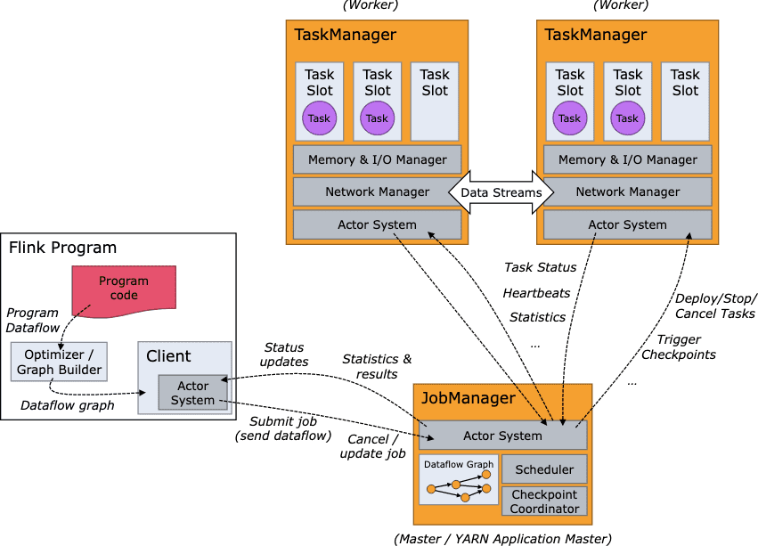

**{{ page.description }}**

# Architecture & Clusters

## Anatomy of a Flink Cluster

Flink runtime은 1개의 Job Manager와 1개 이상의 TaskManager로 구성된다.

Client는 runtime의 일부분이 아니고, jobmanager에 dataflow를 보내기 위한 용도이다. dataflow를 전송하면 client는 (detach mode일때) disconnect하거나, (attatched mode일때) progress report를 받기위해 connection을 물고 있을 수 있다.

JobManager, TaskManager는 yarn, k8s, standalone등 다양한 방법으로 실행될 수 있다. TaskManager는 Jobmanager와 연결되어 available함을 알리고나서 작업이 할당된다.

### JobManager

JobManager는 분산 실행되는 Flink application을 coordinate하는 역할을 한다. 다음 task(또는 task set)을 스케줄링하고, 종료/실패된 task에 대해 처리하고, checkpointing과 recovery등을 관리한다. JobManager는 3개의 컴포넌트로 나뉜다

- **ResourceManager**: resource를 allocation/deallocation하고 Flink cluster의 task slot을 관리하는 provisioning을 맡는다. Flink는 여러가지 환경에서 동작하는 resource manager를 구현했다.
- **Dispatcher**: Flink application을 submit하기 위한 REST interface를 제공하고, submit된 job에 따라 JobMater를 실행시키며, job execution을 보여주는 Flink WebUI를 띄운다.
- **JobMaster**: single JobGraph(submit된 job한개에 대한 dag)의 execution을 관리한다. 여러개의 job은 Flink cluster에 동시에 실행되지만, 각각 JobMaster는 따로 가지게 된다.

HA setup을 하려면 multiple JobManager를 띄워야 하고 그중 한개는 leader, 나머지는 standby가 된다.

[https://nightlies.apache.org/flink/flink-docs-release-1.14/docs/deployment/ha/overview/](https://nightlies.apache.org/flink/flink-docs-release-1.14/docs/deployment/ha/overview/)

### TaskManagers (workers)

dataflow를 실행하고 data stream에 대한 buffer, exchange역할을 한다. 언제나 최소 1개이상의 TaskManager가 있고, TaskManager의 resource scheduling의 최소 단위는 task slot이라 부른다. task slot 갯수가 concurrent processing task 갯수를 의미한다. 또한 여러 operator 한개의 task slot에서 실행될 수 있다.

## Tasks and Operator Chains

distributed execution에서 Flink는 operator subtask를 task로 묶는다. 각 Task는 한개 thread에서 실행되고, 따라서 task로 묶인 chaining operator는 thread간 데이터를 넘기거나 버퍼로 만드는 오버헤드 감소, latency가 줄어들고 throughput상승 등의 최적화가 일어난다. chaining은 configure할 수 있다.

[Task Chaining and Resource Groups #](https://nightlies.apache.org/flink/flink-docs-release-1.14/docs/dev/datastream/operators/overview/#task-chaining-and-resource-groups)

아래 예시 dataflow는 5개의 subtask를 실행하므로 5개의 thread를 쓴다

## Task Slots and Resources

각 TaskManager(worker)는 JVM process이고 여러 쓰레드에서 1개이상의 subtask를 실행한다. TaskManager가 얼마나 많은 tasks를 받을지 설정하려면 task slot을 조정하면된다.

각 task slot은 TaskManager resource의 subset이다. 예를들어 3개의 task slot이 있다면 각 slot의 메모리의 1/3씩 dedicate된다. resource를 slot으로 나누는것은 subtask가 다른 job의 subtask와 경쟁상황에 놓이지 않도록 하고 reserved memory를 쓰게 만든다. CPU isolation을 하지 않으면, 한 slot은 여러 task에 대한 memory만 slotting하게 된다.

task slot 갯수를 조정하여 user는 어떻게 subtask가 다른 subtask와 isolate하는지 설정할 수있다. TaskManager당 1개 slot을 쓰면 각 task group은 서로 분리된 JVM에서 동작한다. 여러개 slot을 쓰면 subtask들은 같은 JVM위에서 동작하며 TCP connection (multiplexing)과 heartbeat message를 공유한다. subtask들은 또한 dataset, datastructure도 공유할수 있어 task단위에서 발생하는 overhead를 줄이게 된다.

Flink는 같은 job에 있지만 다른 task에 속한 subtask일지라도 subtask들이 slot을 공유하는걸 기본값으로 한다. (서로다른 stage에 있는 subtask들도 slot을 공유한다는말?) 따라서 한개 slot이 job 전체 pipeline에 관여할 수도 있다. 이 방식은 아래의 이점이 있다

- Flink cluster는 job에서 필요로하는 최대의 parallelism만큼의 task slot을 필요로하는데, 여러 다양한 paralleism을 포함한 전체 task 갯수를 계산할 필요가 없다. — 근데 이건 한번만 계산하면 되는것아닌가.. 아니면 graph가 매우복잡해질경우 오버헤드라고 생각하는건가..
- resource utilization에서 이점이있다.
위쪽의 예시처럼 slot sharing을 하지 않으면 non-intensive한 source/map subtask는 resource intensive한 window subtask만큼의 resource를 사용하게 된다(slot size가 동일하므로?). source/map이 한개의 task slot을 점유하여 resource가 낭비되고, window는 saturate되고, 한개 task slot은 아에 비어있는 상황이 된다.
아래 예시처럼 slot sharing을 사용하면 base paralleism을 2에서 6으로 늘려 slot resource를 최대로 쓰고, 무거운 subtask(window)가 TaskManager전체에 fairly distributed되게 한다.

## Flink Application Execution

Flink application은 main method에서 1개이상의 Flink job을 생성하는 user program이다. job은 JVM(LocalEnvironment)나 cluster(RemoteEnvironment)에서 실행될 수 있다. 각 program에서 ExecutionEnvironment는 job 실행을 제어하는 method(paralleism 설정 등)를 제공한다.

Flink application의 job은 long-running Flink Session Cluster나 dedicated Flink Job Cluster, Flink Application Cluster로 submit할 수 있다. 큰 차이점은 cluster의 lifecycle을 따를것인지, resource isolation을 할것인지 등 이다.

### Flink Session Cluster

`session`

- **Cluster Lifecycle**: Flink Session Cluster에서 client는 이미 존재하는 cluster에 여러 job을 submit한다. 모든 job이 끝나더라도 cluster는 계속 실행상태로 남아있는다.
- **Resource Isolation**: TaskManager slot은 job submission에따라 ResourceManager가 할당해주며, job이 끝나면 release된다. 모든 job이 같은 cluster를 공유하므로 network bandwith등의 cluster resource에 대한 경합이 생긴다. TaskManager가 크래쉬나면 여기서 동작한 모든 job은 fail나고, Job Manager에 에러가 발생하는경우 모든 job이 멈추는 한계점이 있다
- **Other considerations**: session cluster를 쓰면 resource를 apply하는 시간이나 TaskManager를 실행시키는 시간을 아낄 수 있다. short query로 interactive analysis를 하는경우와 같이 execution time이 매우 짧은경우 유용하다.

### Flink Job Cluster

`per-job`

- **Cluster lifecycle**: job이 submit될때마다 cluster가 올라가고 이 job에 dedicateehlsek. client는 cluster manager에게 JobManager를 실행시키기 위한 resource를 요청하고, JobManager에 있는 Dispatcher에게 job을 submit한다. TaskManager는 job의 resource에따라 lazy하게 할당된다. job이 끝나면 Flink Job Cluster도 내려간다.
- **Resource Isolation**: JobManager에 에러가 생기면 해당 job에게만 영향을 준다.
- **Other considerations**: ResourceManager가 job이 submit될때 TaskManager를 실행시키고 resource를 할당하기때문에 startup time이 오래걸리므로, Flink Job Cluster는 오랫동안 동작하는 큰 job에 적절하다.

k8s는 Flink Job Clister를 지원하지 않는다

[https://nightlies.apache.org/flink/flink-docs-release-1.14/docs/deployment/resource-providers/standalone/kubernetes/#per-job-cluster-mode](https://nightlies.apache.org/flink/flink-docs-release-1.14/docs/deployment/resource-providers/standalone/kubernetes/#per-job-cluster-mode)

[https://nightlies.apache.org/flink/flink-docs-release-1.14/docs/deployment/resource-providers/native_kubernetes/#per-job-cluster-mode](https://nightlies.apache.org/flink/flink-docs-release-1.14/docs/deployment/resource-providers/native_kubernetes/#per-job-cluster-mode)

### Flink Application Cluster

- **Cluster lifecycle**: 한개 Flink Application에서 실행되는 job들을 실행하는 cluster이고, client 대신 cluster가 main method를 실행시킨다. job submission을 할땐 flink cluster를 실행한뒤 cluster session에 job을 submit할 필요 없이. application logic, dependency를 executable job으로 만들고 cluster entrypoint(ApplicationClusterEntryPoint)는 JobGraph를 만들기 위해 main method를 호출한다. 이를 통해 k8s의 다른 application처럼 Flink application을 배포할 수 있다. Flink Application Cluster의 수명은 Flink Application과 똑같다.
- **Resource isolation**: Flink Application Cluster에서 ResourceManager, Dispatcher는 한개 Flink Application만 보면 되므로 Flink Session Cluster보다 더 나은 resource management가 가능하다.