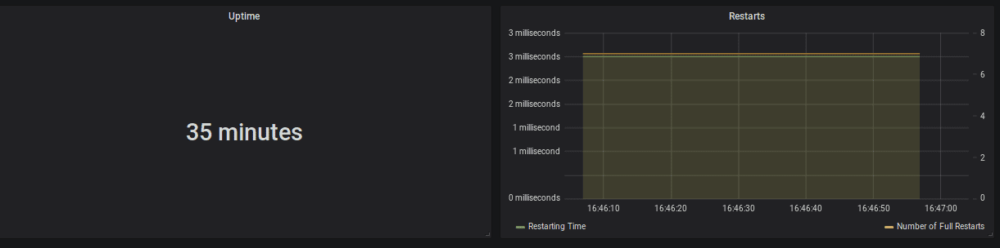

{{ page.description }}

# Monitoring 101

Flink job을 효과적으로 모니터링 할 수 있는 Flink의 built-in monitoring, metric system을 소개한다. performance monitoring은 degradation, downtime을 즉시 인지하고 해결할수 있도록 도와준다. monitoring은 트러블슈팅, 퍼포먼스 튜닝의 prerequisite인 observability와 같이 진행된다. 현재 modern enterprise application의 복잡도와 delivery 속도가 증가하면서 engineering team은 특정시점에 application의 상태에 대한 overview를 반드시 알 수 있어야 한다.

## Flink's Metrics System

Flink [metrics system](https://nightlies.apache.org/flink/flink-docs-release-1.14/docs/ops/metrics/) 은 `Metrics, MetricReporters`로 구성된다.

### Metrics

Flink는 아래와같은 built-in metric을 제공한다

- JVM Heap, NonHeap, Direct Memory (per Task/Job Manager)
- \# of Job Restars (per Job)
- \# of Records per Second (per Operator)
- ...

이런 metrice들은 서로 다른 scope를 가지고, Flink-specific한것과 일반적인 것 (JVM, OS)까지도 측정한다. User는 application-specific metric을 자신의 function에 추가할 수 있다. 일반적으로 \# of invalid record나 managed state에서 현재 버퍼된 record등의 counter가 있다. counter 말고도 gauge, histogram을 제공한다. 이 문서에서는 Flink의 built-in metric을 활용하는 방법에 대해 공유한다.

### MetricReporters

모든 metric은 Flink의 REST API로 가져올 수 있다. 하지만 유저들은 MetricReporter에서 external system으로 metric을 보내고 싶어할 것이다. Flink는 reporter가 JMX, prometheus, Datadog, Graphite, InfluxDB같은 monitoring tool로 metric을 보낼 수 있게 해준다.

## Monitoring General Health

작업이 running상태인지, restart 횟수와, 마지막 restart이후 uptime을 모니터링 하는것이 좋다. successful checkpointing은 flink application의 general health를 확인하는 강력한 지표이다. 각 checkpoint에서 checkpoint barrier는 Flink job의 전체 topology를 따라 흘러야 하며, event와 barrier는 stream상에서 서로를 추월해서는 안된다. 따라서 successful checkpoint는 congested channel이 없음을 보여준다.

| Metric | Scope | Description |
| --- | --- | --- |
| uptime | job | interruption 없이 job이 수행된 시간 |
| fullRestarts | job | job이 submit된 이후로 full restart 횟수 |
| numberOfCompletedCheckpoints | job | 성공한 checkpoint 횟수 |
| numberOfFailedCheckpoints | job | 실패한 checkpoint 횟수 |

- alerts
    - `ΔfullRestarts > threshold`
    - `ΔnumberOfFailedCheckpoints > threshold`

## Monitoring Progress & Throughput

application이 실제로 잘 진행되는지 upstream system을 잘 따라가는지 확인하기 위한 모니터링이다.

### Throughput

각 operator 또는 task (task는 여러 chained task를 가질수있음)에 대해 Flink는 in/out 의 record, bytes를 카운트한다. 이 메트릭중 operator당 outgoing record의 비율이 가장 직관적이다.

| Metric | Scope | Description |
| --- | --- | --- |
| numRecordsOutPerSecond | task | task가 초당 보내는 record 갯수 |
| numRecordsOutPerSecond | operator | operator가 초당 보내는 record 갯수 |

- alerts
    - `recordsOutPerSecond = 0` (sink operator 제외)

### Progress

event time semantic을 쓰는 application들은 watermark가 시간에 따라 잘 진행되고 있는것이 중요하다. watermark t는 더이상 t보다 이전인 event를 받지 않는것이고, `timestamp < t` 에 대한 모든 operation을 스케줄링한다. 예를들어 t=30에서 끝나는 event time window는 watermark가 30이 지나면 close된 뒤 evaluate된다.

따라서 process function과 window같이 event time sensitive operator의 watermark를 모니터링 해야 한다. 현재 processing time과 watermark 사이의 갭이 존재할때, 즉 event time skew가 존재할때, 두 이슈중 한개이다.

1. application이 단순하게 old event를 프로세싱 하고 있는 것이다. 예를들어 downtime이후에 재실행 하거나, job이 event queue를 못따라가는 상황이다.
2. single upstream subtask가 긴 시간동안 watermark를 보내지 않는 상황도 있다. 이건 downstream operator의 진행또한 막게된다. 예를들어 event를 아에 받지 못하는 상황이 있다.

| Metric | Scope | Description |
| --- | --- | --- |
| currentOutputWatermark | operator | operator가 emit한 마지막 watermark |

- alerts
    - `currentProcessingTime - currentOutputWatermark > threshold`

### Keeping Up

message queue로부터 consume할때 application이 잘 keep up하는지 모니터링 하는 방법이 있는 것들이 있다. connector-specific metric을 통해 message queue의 head보다 consumer group이 얼마나 뒤쳐져있는지 모니터링 가능하다. Flink는 대부분 source에서 이런 metric들을 보내준다.

| Metric | Scope | Description |
| --- | --- | --- |
| records-lag-max | user | FlinkKafkaConsumer
해당 window의 partition의 레코드 갯수에 대한 최대 lag
consumer group이 producer를 따라가지 못하면 시간에 따라 이 값이 증가한다. |
| millisBehindLatest | user | FlinkKinesisConsumer |
- alert
    - `records-lag-max > threshold`

### Monitoring Latency

latency는 event생성시점부터, event에 대한 result가 생성된 시각까지의 딜레이이다. event가 생성되면 event는 MQ에 저장되고, Flink에서 processing하고 result를 DB에 쓰거나, downstream system을 호출한다. 이런 pipeline에서 latency는 각 stage에서 도입될 수 있다.

1. event가 MQ에 저장될 때까지의 시간의 스펙트럼이 있다.
2. high load나 recovery상황에서 event는 Flink가 processing하기 전까지 MQ내에서 좀 더 기다리게 된다.
3. streaming topology의 일부 operator는 event를 일시적으로 버퍼링해야된다 (time window 등)
4. topology의 각 computation과 network shuffle은 latency를 증가시킨다.
5. application이 transactional sink를 통해 결과를 저장한다면, sink는 Flink의 checkpoint위에서 transaction을 commit, publish해야한다. 각 레코드의 checkpoint interval까지 latency는 증가하게 된다.

**여러 stage (creation, persistence, igestion, publish, samplling to save bandwith) 에서 event에 timestamp를 추가하는것은 중요하다. stage별 timestamp를 통해 user-defined metric을 만들어 각 stage의 latency 분포를 만들 수 있다.**

Flink는 [Latency Tracking](https://nightlies.apache.org/flink/flink-docs-release-1.14/docs/ops/metrics/#end-to-end-latency-tracking) 이라는 feature를 제공한다. Latency Tracking을 켜면 Flink는 주기적으로 latency marker를 모든 source에 주입한다. 각 operator 마다 각 source에서 해당 operator까지의 latency distribution이 리포팅된다. 이 histogram의 granularity는 `metrics.latency.granularity` 를 설정하여 컨트롤 할 수 있다.

많은 histogram을 만들면 latency tracking이 cluster performance에 영향을 준다. 이것은 디버깅 할때만 사용하는 것을 추천한다.

| Metric | Scope | Description |
| --- | --- | --- |
| latency | operator | soruce operator에서 해당 operator까지 latency |
| restartingTime | job | restart한 뒤로부터 시간 |

## JVM Metrics

### Memory

- Heap Memory: Heap에서 long-living object의 크기가 증가하면 application state의 크기가 원인이다. ([checkpointing metrics](https://nightlies.apache.org/flink/flink-docs-release-1.14/docs/ops/metrics/#checkpointing) 확인). state가 점점 커지는 이유는 application을 봐야한다. 일반적으로 key의 갯수가 증가하거나, event-time skew가 발생하거나, state cleanup이 되지 않거나 이다.
- NonHeap Memory: class metadata와 static contents를 저장한다.
- Direct Memory: network buffer
- Mapped Memory: Flink는 거의 쓰지않아서 0임

[Memory](https://nightlies.apache.org/flink/flink-docs-release-1.14/docs/ops/metrics/#memory)

- alert
    - `container memory limit < container memory + safty margin`

### CPU

TaskManager의 CPU를 모니터링 해야한다. TaskManager CPU가 높으면 아래 방식으로 성능을 향상 시킬 수 있다

1. standalone일때 TaskManager당 task slot의 갯수를 줄이기
2. TaskManager에 더 많은 리소스 할당
3. TaskManager를 더 많이 할당

일반적으로 high CPU이면 recovery할때 시간이 많이 걸리고 event-time skew를 만든다.

갑자기 CPU가 튀는경우는 GC pressure때문이 일반적이므로 memory metric을 언제나 같이 봐야한다.

일부 TaskManager의 CPU가 계속 높은경우, checkpoint alignment가 오래걸리고 event-time skew가 발생해 전체 topology의 속도를 느리게 만들수 있다. 일반적인 이유는 partition key skew이므로 shuffle이전에 pre-aggregation을하거나 더 잘 분산된 키를 써서 완화해야 한다

[CPU](https://nightlies.apache.org/flink/flink-docs-release-1.14/docs/ops/metricscpu)

