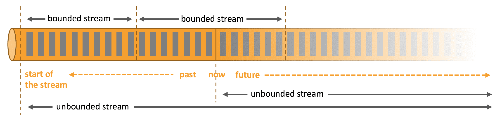
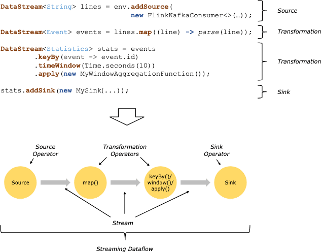
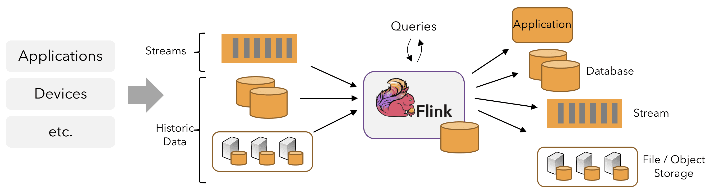
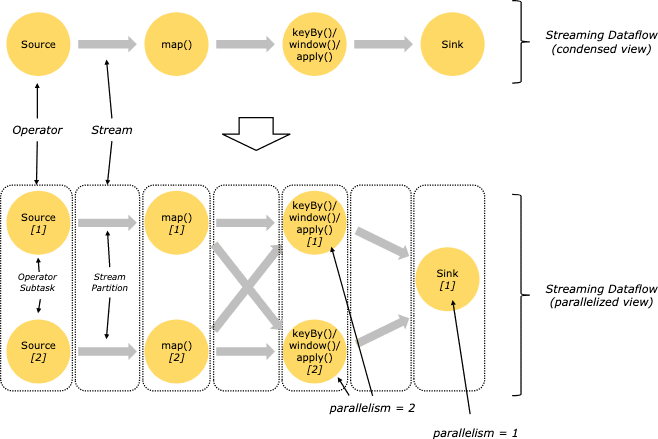
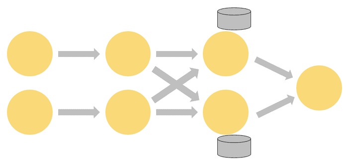
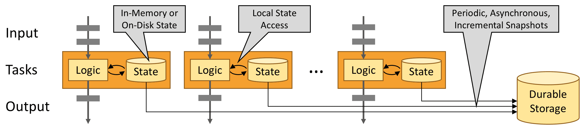

**{{ page.description }}**

# Flink Overview

## Stream Processing

어디서든지 data는 stream의 일부로서 생성된다. 그러나 데이터를 분석할땐 bounded이나 unbounded stream으로 data를 보고 분석하는데, 어떤 패러다임을 선택하냐에 따라서 결과가 달라진다.

**Batch Processing**은 bounded data stream을 쓰는것이다. 결과를 내기 전에 전체 dataset을 ingest할 수 있다. sorting, statistics, final report가 이에 해당된다.

**Stream Processing**은 unbounded data stream을 쓴다. input은 끝나지 않고, input data가 도착할때마다 계속해서 data를 처리 해야 한다.

Flink의 application은 user-defined operator로부터 만들어진 streaming dataflow로 구성된다. 이 dataflow는 1개이상의 source에서 시작해서 1개이상의 sink로 끝나는 Directed Graph를 만든다.

code의 transformation과 dataflow의 operator가 1:1 매핑될때도 있지만, 1개의 trasnformation이 여러 operator를 가질때도 있다.

Flink application은 message queue(Kafka)나 distributed logs(Kinesis)같은 real-time data를 받을수도있고, bounded(historical data) 또한 읽을 수 있다. Flink application에서 생성되는 result stream 또한 sink로 연결된 다양한 시스템에 보낼 수 있다.

## Parallel Dataflows

Flink pragram은 parallel, distributed이다. 실행되는동안 stream은 1개 이상의 **`stream partition`**을 가지며, 각 operator는 1개 이상의 **`operator subtask`**를 가진다. operator subtask는 서로에게 독립적이며, 다른 trehad에서 동작하고, 다른 머신/컨테이너에서도 동작 할 수 있다.

oeprator subtask의 수는 특정 operator의 `parallelism`이 된다. 같은 prgoram의 서로 다른 Operator들은 각각의 parallelism을 가진다.

stream은 아래와 같은 패턴들로 2개 operator사이의 데이터를 전송한다.

- **One-to-one** stream은 partitioning과 ordering을 보장한다. 위의 예시에서 map operator의 subtask는 source operator의가 생성한 같은 순서를 똑같이 보게 된다.
- **Redistributing** stream은 stream partitioning을 바꾼다. 각 operator subtask는 data를 transformation에 따라 다른 subtask로 전달한다. keyBy(hash key기반으로 repartitioning), broadcast, rebalance가 대표적이다. redistributing exchange에서 element간 ordering은 sender-receiver간에서만 보장된다. 예를들어 keyBy/window와 sink operator간의 redistribution은 순서를 보장하지 않는다

## Timely Stream Processing

많은 streaming application에게 historical data를 deterministic, consistent하게 live data를 process했던 코드를 재활용해서 reprocess하는것은 중요하다.

또한 event가 처리될때 전달되는 순서보다, event가 발생한 순서에 집중하고, event가 완료되어야 하는 시기를 추정하는것이 중요하다. e커머스 트랜잭션이나 금융거래가 대표적인 예시다.

timely stream processing에 대한 요구사항은 data를 process하는 machine의 시각대신 data stream에 쓰여지는 event time timestamp로 맞출 수있다.

## Stateful Stream Processing

Flink operation은 stateful하다. 즉 이전에 들어왔던 event들에 의해 쌓인 effect에 따라 현재 event가 처리되는것이 달라질 수 있다. state는 분당 event갯수를 세는것처럼 간단한것도 있지만, fraud detection같은 복잡한것에도 쓰인다.

Flink application은 distributed cluster에서 병렬적으로 실행된다. operator가 서로다른 쓰레드, instance, maching에서 독립적으로 실행된다.

stateful operator의 parallel instance set은 shareded key-value store와 비슷하다. 각 parallel instance는 특정 key group에 대한 event를 핸들링하고, 이 key들에 대한 state를 로컬에 저장한다.

위 그림에서, 앞에 3개는 2개의 paralleism을 가지고, 마지막 한개는 1개의 parallelism을 가진다. 세번째 operator는 stateful해서 2번째와 3번쨰 operator간에 fully-connected network shuffle이 일어나는것을 볼 수있다. 즉 stream이 key값에 의해 repartition되고, 한꺼번에 같이 process될필요가 있는 Event들이 분류된다.

state는 언제나 local에서만 access되므로 Flink application이 high throughput, low latency를 가질수 있게 해준다. state는 JVM heap에 저장할수도있고, 사이즈가 크다면 disk에 저장하도록 선택할 수도 있다.

## Fault Tolerance via State Snapshots

Flink는 state snapshot과 stream replay를 통해 fault-tolerent, exactly-once semantic을 제공한다, snapshot은 distributed pipeline의 전체 state를 캡쳐해서, inpt queue로 들어가는 offset들을 기록하고, 해당 시점까지 data를 ingest한 결과로 발생하는 job graph의 전체 상태를 저장한다. 장애가 발생하면 source는 replay되고, state는 복구되고, processing은 재시작된다. 위 그림처럼 state snapshot은 진행되는 processing을 방해하지 않고 async로 백업된다.